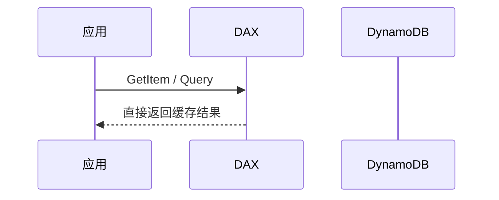
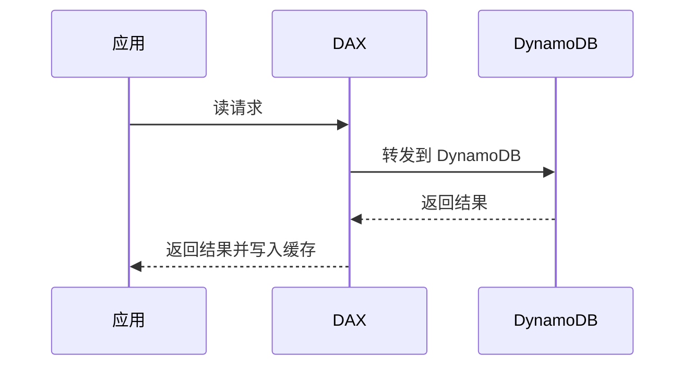
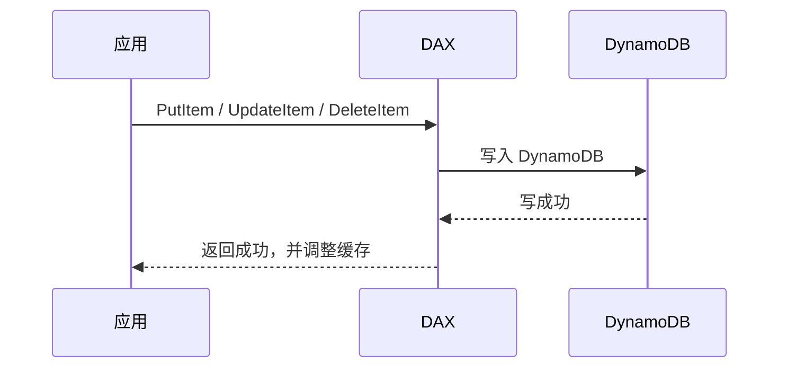

# DynamoDB - 第 10 课：DAX 深入：缓存架构、命中路径、一致性边界与适用场景

## 学习目标（本节结束后你能做到什么）

- 不再只会说“DAX 是 DynamoDB 的缓存”，而能解释它到底缓存了什么、怎样命中、怎样失效。
- 理解 DAX 真正优化的是哪一类请求，为什么它主要服务的是低延迟最终一致读。
- 说清楚 DAX 与 Redis、本地缓存、直接访问 DynamoDB 的差别。
- 理解 DAX 的一致性边界，避免把它误用成“强一致读加速器”或“万能缓存层”。

## 内容讲解（核心概念，用类比、例子、图示说清楚）

### 1. DAX 到底是什么

DAX，全称 DynamoDB Accelerator。

这名字里最重要的是后半句：

**Accelerator，不是 replacement。**

它不是一种新的数据库，也不是 DynamoDB 的替代品，而是 DynamoDB 前面的一层“协议兼容、语义贴近”的托管缓存集群。

如果你用一句最工程化的话描述它，可以这么说：

**DAX 是一个专门为 DynamoDB 设计的、以最终一致读为主要优化目标的内存缓存层。**

这里面有三个关键词一定要抓住：

- 专门为 DynamoDB 设计
- 内存缓存层
- 主要优化最终一致读

如果你只记“缓存层”，很容易把它想成“Redis 的托管版”，这是不对的。

### 2. 为什么 AWS 不直接说“你们自己上 Redis 就行”

因为 Redis 和 DAX 解决的问题只有部分重叠。

Redis 更像一个通用缓存和数据结构系统：

- 你可以缓存任何内容
- 你需要自己设计 key、失效和一致性
- 它不理解 DynamoDB 的主键、Item 语义和 SDK 调用链

DAX 则更像：

- DynamoDB 原生调用路径前的一层专用加速器
- 客户端几乎不需要重写业务建模
- 它理解 DynamoDB 的 GetItem、Query 等语义

所以 AWS 提供 DAX，不是在说“Redis 不行”，而是在说：

**有些团队不想自己再维护一套缓存一致性逻辑，只想在 DynamoDB 访问前无缝插一层低延迟缓存。**

### 3. DAX 的基本架构是什么

先把结构图立住：

但这个图还太简单。更完整一点，DAX 集群通常会有：

- 一个主节点，负责集群协调与部分写路径职责
- 多个只读副本节点，用于提升读扩展能力
- 客户端 SDK 负责感知集群节点信息并做请求路由

你可以把它理解成：

- 应用不是直接连 DynamoDB
- 应用先连 DAX
- DAX 再决定是直接返回缓存，还是继续访问 DynamoDB

### 4. DAX 到底缓存什么

这是最关键的问题之一。

很多人以为 DAX 只是“把整张表数据搬进内存”，其实不是。

DAX 主要缓存两类东西：

#### 4.1 Item Cache

对应的是基于主键直接读取的 item。

典型命中场景：

- `GetItem`
- 部分 `BatchGetItem`

也就是说，如果大量请求都在反复按主键取某个 item，DAX 非常适合。

#### 4.2 Query Cache

对应的是某些 `Query`、`Scan` 这类结果集型读取请求的缓存结果。

这类缓存比 item cache 语义更弱，也更依赖：

- 参数完全一致
- 缓存 TTL
- 查询模式稳定

所以从工程价值上看：

- item cache 往往更稳定、更容易形成高命中率
- query cache 则更依赖你的访问模式是否重复且可预测

### 5. DAX 的读路径到底怎么走

#### 5.1 命中场景

如果请求命中了 DAX 缓存：

这种情况下，最大的收益有两个：

- 延迟显著降低
- 不再消耗 DynamoDB 读吞吐

这也是 DAX 真正的价值来源。

#### 5.2 未命中场景

如果没有命中缓存：

这个过程里你要记住一件事：

**DAX 不是替代 DynamoDB 的存储层，它只是帮你把重复读尽量拦截在前面。**

### 6. DAX 的写路径为什么不像读那样“神奇”

这是第二个最容易误解的点。

很多人听到“加速器”三个字，会本能觉得：

- 写入也会更快

通常不是这样。

写请求本质还是要落到 DynamoDB，因为 DynamoDB 才是真正的持久化来源。

更准确地说，DAX 对写路径的作用更接近：

- 作为一层写透式协调入口
- 在写成功后更新或失效相关缓存

所以写路径更像：

注意这里的重点不是“写变快”，而是：

- 写成功后，DAX 会尽量让后续缓存状态更接近最新值

所以 DAX 的核心收益始终还是读优化，不是写优化。

### 7. 为什么 DAX 主要优化 eventually consistent read

这和缓存的本质直接相关。

缓存之所以快，是因为它减少了：

- 跨网络访问底层存储
- 读取副本协调
- 持久化层参与

但只要你要求“强一致”，系统就必须确保你读到的是最新状态。

于是问题就来了：

- 如果缓存里的是刚才的旧值怎么办？
- 如果底层 DynamoDB 刚写完，而缓存还没完全同步怎么办？

因此，DAX 的天然适用场景是：

**能接受最终一致、但对延迟极度敏感的高频读。**

而对于强一致读：

- 要么 DAX 直接绕过缓存转发到底层 DynamoDB
- 要么即便使用 DAX SDK，请求也不能像 eventual read 那样被真正加速

所以一句话记住：

**DAX 最擅长的是“重复读 + 最终一致 + 毫秒很贵”的场景。**

### 8. DAX 的一致性边界到底在哪里

这是面试和工程里最值得展开的一点。

你不能把 DAX 理解成“完美同步的缓存镜像”，因为缓存从来都是带边界的。

#### 8.1 对单 item 热点读，它通常很好用

如果业务场景是：

- 某个商品详情被大量读取
- 某个用户资料被频繁拉取
- 某个配置项被海量请求读取

那么 DAX 的 item cache 很容易形成高命中，收益非常直接。

#### 8.2 对 Query 结果，它的缓存语义更弱

为什么？

因为一个 Query 结果集受到很多因素影响：

- 查询条件
- 返回页大小
- 参数是否完全一致
- 底层数据是否发生变化

而一条写入可能影响很多潜在的 Query 结果集组合。系统很难对所有“可能受影响的查询结果缓存”做完美且低成本的精确失效。

所以在理论上你要把 DAX 的 query cache 理解成：

- 一种更偏性能导向的结果缓存
- 强依赖访问重用度
- 更依赖 TTL，而不是绝对精确的查询结果失效

这也是为什么 DAX 非常适合“主键热点读”，但不一定适合“复杂多变查询”。

### 9. DAX 能解决什么，不能解决什么

#### 能解决的

- 热门 item 被频繁读取带来的高读延迟
- 热读对 DynamoDB RCU 的消耗
- 大量重复 Query/主键读的下游放大

#### 不能解决的

- 糟糕的数据模型
- 错误的 Partition Key 导致的写热点
- 强一致读场景的根本延迟问题
- 业务上本来就几乎没有读重用的数据访问

这点特别重要。

如果你的问题本质是：

- 写热点
- 热分区
- 大量随机不重复读
- Scan 过多

那 DAX 很可能只是“在错误模型前再包一层缓存”，收益有限。

### 10. DAX 和 Redis、本地缓存该怎么区分

#### 和本地缓存比

本地缓存：

- 延迟更低
- 命中后完全不走网络
- 但多实例下一致性更难保证

DAX：

- 比本地缓存慢一点
- 但多个应用实例可以共享同一份缓存视图
- 一致性管理比本地缓存轻松

#### 和 Redis 比

Redis：

- 是通用缓存和数据结构系统
- 适合分布式锁、排行榜、限流、消息流等很多场景
- 需要你自己处理缓存 key、更新策略和失效逻辑

DAX：

- 是 DynamoDB 专用加速层
- 优点是接近无缝接入 DynamoDB 访问路径
- 能力边界也更窄，只服务 DynamoDB 读加速

所以如果你问：

“DAX 和 Redis 谁更强？”

这个问题本身就不太对。更准确的问题应该是：

- 你是要一个专用的 DynamoDB 读加速器
- 还是要一个通用缓存基础设施

### 11. 什么时候值得上 DAX

下面这几种场景比较典型：

1. 热点读非常明显  
   某些 item 被高频重复读取，重复度很高。

2. 对延迟非常敏感  
   比如广告、推荐、用户画像、游戏在线态这类场景，几毫秒差距都很重要。

3. 已经确认 DynamoDB 本身读成本高且命中模式稳定  
   说明缓存确实能发挥价值，而不是盲目加一层。

4. 团队不想自建 Redis 缓存一致性体系  
   希望直接沿用 DynamoDB 风格访问。

### 12. 什么时候不值得上 DAX

1. 读写比例不高，甚至写很多  
   DAX 对写入提速帮助非常有限。

2. 强一致读要求很高  
   这种场景 DAX 的空间会明显变小。

3. 访问模式离散，复用度差  
   命中率低，缓存收益就小。

4. 你的主要问题其实是模型错误  
   比如大量 Scan、热分区、GSI 乱加，这些不是 DAX 能替你兜底的。

### 13. DAX 的一个常见误区：把它当“成本优化万能钥匙”

DAX 的确能省掉很多 DynamoDB 读请求，但它自己也是有成本的：

- DAX 集群节点成本
- 运维与监控复杂度增加
- 客户端 SDK 接入路径变化

所以不能简单说：

- “RCU 贵，我就上 DAX”

更稳的判断顺序是：

1. 先确认访问模式是否高度重复
2. 再确认主要瓶颈是读而不是写
3. 再确认业务可以接受最终一致
4. 最后再比较 DAX 成本和直接增加 DynamoDB 读容量的成本

### 14. DAX 最适合的理论定位

如果让我把 DAX 放在整个 AWS 数据访问体系里，我会这样描述它：

DAX 不是存储真相来源，也不是建模方案本身。它是一个：

- 站在应用和 DynamoDB 中间
- 用缓存换低延迟和低读成本
- 但必须接受一致性边界和命中率约束

的性能组件。

所以理解 DAX 的最高效方式不是死记功能，而是牢牢记住这句话：

**DAX 优化的是“重复、可缓存、可接受最终一致”的 DynamoDB 读请求。**

## 小结（3-5 条关键点）

- DAX 不是新的数据库，而是 DynamoDB 前面的一层专用托管缓存，加速重点在读而不是写。
- DAX 主要缓存 item 读取和部分查询结果，最适合热点主键读和重复度高的 eventually consistent read。
- 强一致读场景下，DAX 的价值会明显下降，因为这类请求不能像最终一致读那样稳定命中缓存并获得显著加速。
- DAX 不能修复糟糕的数据模型、热分区和写热点，它解决的是“高频重复读”的问题。
- 选择 DAX 之前，应该先看访问重用度、读写比例、一致性要求和成本对比，而不是看到延迟就先上缓存。

## 问题 （检测用户对当前章节内容是否了解）

1. 为什么说 DAX 是 DynamoDB 的加速层，而不是 DynamoDB 的替代品？
2. DAX 为什么更适合 eventually consistent read，而不适合把强一致读当主优化目标？
3. item cache 和 query cache 在稳定性和收益上有什么差别？
4. 如果你的系统主要问题是写热点和热分区，为什么 DAX 往往帮不上大忙？
