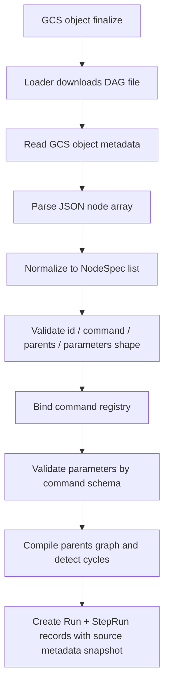

# 02 · DAG 定义文件规范(JSON)

## 2.0 本章导读

上一章把 EMF 的架构全景讲完后,这一章要落到最关键的一层:用户真正上传的 DAG JSON 到底长什么样。

根据你补充的真实形态,EMF 的 DAG DSL 不是我一开始推断的那种 `apiVersion / kind / metadata / steps` 大 manifest,而是更轻的**节点列表**:

```text
{id: abc, command: ExportToGcs, parents: {}, parameters: {...}}
{id: bcd, command: ExportToGcs, parents: {abc}, parameters: {...}}
```

也就是说,一份 DAG 的基本单元就是一个 **Step / Node**:

- `id`:这个节点的唯一标识。
- `command`:这个节点要执行的命令,比如 `ExportToGcs`。
- `parents`:这个节点依赖哪些上游节点。
- `parameters`:传给这条 command 的参数。

同时还有一个关键边界: **所有 DAG 文件本身都在 GCS,Pipeline 级 metadata 不写进 DAG JSON 内容,而是写在 GCS object metadata 上**。所以 DAG file content 只负责描述图,而 GCS object metadata 负责描述这张图是谁的、叫什么、属于哪个环境、怎么告警。

本章会按这个真实模型重写。重点不是发明一套更复杂的 DSL,而是解释:

1. 这个轻量格式如何表达一张 DAG。
2. Loader 如何把它 normalize 成内部图结构。
3. `parents`、`parameters`、`command` 各自承担什么职责。
4. 静态校验应该在执行前挡住哪些错误。
5. GCS object metadata 如何补上 DAG 级 owner / env / label。
6. 这个 DSL 简洁背后有什么代价,后续怎么演进。

---

## 2.1 最小可用 DAG:节点列表

如果把你给的概念写法落成严格 JSON,最自然的表示是一个数组:

```json
[
  {
    "id": "abc",
    "command": "ExportToGcs",
    "parents": [],
    "parameters": {
      "source": "bigquery",
      "query": "select * from demo.orders",
      "destination": "gs://team-a-export/orders/${run_id}/orders.jsonl"
    }
  },
  {
    "id": "bcd",
    "command": "ExportToGcs",
    "parents": ["abc"],
    "parameters": {
      "source": "bigquery",
      "query": "select * from demo.order_items",
      "destination": "gs://team-a-export/orders/${run_id}/order_items.jsonl"
    }
  }
]
```

如果真实代码里 `parents` 用的是对象 / set 风格:

```json
{
  "id": "bcd",
  "command": "ExportToGcs",
  "parents": {
    "abc": {}
  },
  "parameters": {
    "destination": "gs://..."
  }
}
```

Loader 也应该在入口处先 normalize 成统一内部形式:

```python
parents = ["abc"]
```

> 推断:你写的 `parents:{abc}` 更像概念上的集合,不一定是最终合法 JSON。文档里推荐用 `parents: ["abc"]` 表达,但如果真实实现已经用了 object/set 风格,那就以真实代码为准,只要进入 Compiler 前统一成 `list[str]` 即可。

---

## 2.2 这个 DSL 的核心心智模型

EMF 的 DAG JSON 可以理解成一张表:

| id | command | parents | parameters |
|----|---------|---------|------------|
| `abc` | `ExportToGcs` | `[]` | `{...}` |
| `bcd` | `ExportToGcs` | `["abc"]` | `{...}` |

这张表经过 Compiler 后变成一张图:

```text
abc ──▶ bcd
```

如果有三条:

```json
[
  {"id": "extract_orders", "command": "ExportToGcs", "parents": [], "parameters": {}},
  {"id": "extract_users", "command": "ExportToGcs", "parents": [], "parameters": {}},
  {"id": "build_report", "command": "BuildReport", "parents": ["extract_orders", "extract_users"], "parameters": {}}
]
```

图就是:

```text
extract_orders ──┐
                 ├──▶ build_report
extract_users  ──┘
```

调度语义也很简单:

- `parents` 为空的节点是 root step,Run 开始后可以立即调度。
- 一个节点只有在所有 parents 成功后才可以调度。
- 如果任一 parent 最终失败,子节点默认不再执行。
- 同一层级、互不依赖的节点可以并发执行。

这个模型很轻,但足够表达大多数数据工作流。

---

## 2.3 字段规范

### 2.3.1 `id`

`id` 是节点唯一标识,也是后续所有状态、日志、依赖边和参数引用的锚点。

推荐约束:

```text
^[A-Za-z][A-Za-z0-9_\\-]{0,63}$
```

如果现有 DAG 已经大量使用驼峰或大小写,就不要强行改成小写。关键是:

- 同一份 DAG 内必须唯一。
- 不要包含空格。
- 不要包含路径分隔符 `/`。
- 不要包含业务敏感信息。
- 不要频繁改名,因为 `id` 是历史 Run 排查的核心线索。

错误例子:

```json
{
  "id": "export orders 2026-04-23",
  "command": "ExportToGcs",
  "parents": [],
  "parameters": {}
}
```

更好的写法:

```json
{
  "id": "export_orders",
  "command": "ExportToGcs",
  "parents": [],
  "parameters": {
    "business_date": "2026-04-23"
  }
}
```

时间是参数,不是节点身份。

### 2.3.2 `command`

`command` 是命令池中的命令名。

例如:

```json
{
  "command": "ExportToGcs"
}
```

这意味着 Scheduler 不直接知道怎么导出数据,它只知道:

1. 去 Command Registry 里找到 `ExportToGcs`。
2. 用 `parameters` 校验它的入参。
3. 把这次 StepRun 派发给对应的 Command Runner。

`command` 不应该是任意 Python 函数路径:

```json
{
  "command": "my_module.some_random_function"
}
```

如果允许这样写,EMF 就从"受治理的命令池"退化成"远程执行用户代码"。这会破坏第 1 章讲的核心边界:业务用户拥有 DAG,平台团队拥有命令。

更准确地说,`command` 应该是**稳定协议名**,不是实现类名。`ExportToGcs` 可以作为对用户暴露的稳定 command id,但内部最好通过 registry 映射到真实实现:

```text
ExportToGcs -> emf.commands.export_to_gcs.ExportToGcsCommand
```

这样以后内部类重命名、模块迁移、Sidecar 拆分,都不需要改历史 DAG。

### 2.3.3 `parents`

`parents` 是当前节点的直接上游依赖。

推荐 canonical JSON:

```json
{
  "parents": []
}
```

```json
{
  "parents": ["abc", "extract_orders"]
}
```

如果只是表达依赖关系,数组最清楚,也最好做 JSON Schema 校验。只有当"边"本身需要带元数据时,才建议升级成 object map:

```json
{
  "parents": {
    "abc": {
      "on": "success"
    }
  }
}
```

如果真实历史格式已经是:

```json
{
  "parents": {}
}
```

或:

```json
{
  "parents": {
    "abc": {}
  }
}
```

那么 Loader 应该把两者 normalize:

- `{}` -> `[]`
- `{"abc": {}}` -> `["abc"]`

但文档建议把 `parents: []` 作为新 DAG 的规范写法,把 object map 当成兼容格式或未来承载边元数据的扩展格式。

`parents` 的语义是**控制依赖**,不是参数来源。也就是说,即使节点 B 没有引用节点 A 的输出,只要 B 的 `parents` 包含 A,B 就必须等 A 成功后再跑。

### 2.3.4 `parameters`

`parameters` 是传给 command 的参数对象。

```json
{
  "id": "abc",
  "command": "ExportToGcs",
  "parents": [],
  "parameters": {
    "query": "select * from demo.orders",
    "destination": "gs://team-a-export/orders/${run_id}/orders.jsonl",
    "format": "JSONL"
  }
}
```

`parameters` 的合法字段由 command schema 决定。也就是说,不是 DAG DSL 自己规定 `ExportToGcs` 必须有哪些参数,而是 `ExportToGcs` 这条命令在 Command Registry 里声明:

- 哪些参数必填。
- 每个参数是什么类型。
- 哪些参数是 URI。
- 哪些参数是枚举。
- 哪些参数是 sensitive。
- 哪些参数可以有默认值。

所以 Loader 校验 `parameters` 时要分两层:

1. DSL 层:它必须是一个 JSON object。
2. Command 层:它必须满足 `command=ExportToGcs` 的 input schema。

---

## 2.4 一个更贴近真实形态的例子

假设有一个流程:

1. 从 BigQuery 导出订单到 GCS。
2. 从 BigQuery 导出用户到 GCS。
3. 等两个导出都完成后,生成一个 manifest 文件。

DAG 可以是:

```json
[
  {
    "id": "export_orders",
    "command": "ExportToGcs",
    "parents": [],
    "parameters": {
      "query": "select * from mart.orders where dt = '${business_date}'",
      "destination": "gs://team-a-export/${run_id}/orders.jsonl",
      "format": "JSONL"
    }
  },
  {
    "id": "export_users",
    "command": "ExportToGcs",
    "parents": [],
    "parameters": {
      "query": "select * from mart.users where dt = '${business_date}'",
      "destination": "gs://team-a-export/${run_id}/users.jsonl",
      "format": "JSONL"
    }
  },
  {
    "id": "write_manifest",
    "command": "WriteManifest",
    "parents": ["export_orders", "export_users"],
    "parameters": {
      "manifest_uri": "gs://team-a-export/${run_id}/manifest.json",
      "inputs": [
        "gs://team-a-export/${run_id}/orders.jsonl",
        "gs://team-a-export/${run_id}/users.jsonl"
      ]
    }
  }
]
```

这里有一个非常重要的设计味道:

- 节点依赖通过 `parents` 表达。
- 数据产物路径通过 `parameters` 中的约定表达。
- 下游不一定必须读取上游的 in-memory output;很多数据工作流更自然地通过 GCS URI 传递产物。

这比 Airflow XCom 风格更适合数据平台。因为真正的数据不应该塞进 State Store,State Store 只存状态、元数据和小结果。

---

## 2.5 DAG 文件内容与 GCS Object Metadata

你给的例子是节点本身:

```text
{id: abc, command: ExportToGcs, parents: {}, parameters: {...}}
{id: bcd, command: ExportToGcs, parents: {abc}, parameters: {...}}
```

再结合你补充的部署事实:

> 所有 DAG 文件都是 GCS object;Pipeline 级 metadata 在 GCS file 本身的 metadata 里。

这意味着**DAG 文件内容不需要再包一层 metadata**。内容只表达流程图,metadata 交给 GCS object metadata。

### 2.5.1 推荐文件内容:纯节点数组

如果当前实现允许选择,推荐 DAG 文件内容使用纯 JSON array:

```json
[
  {"id": "abc", "command": "ExportToGcs", "parents": [], "parameters": {}},
  {"id": "bcd", "command": "ExportToGcs", "parents": ["abc"], "parameters": {}}
]
```

优点:

- 最接近 DAG 本质。
- JSON 标准。
- Loader 简单。
- 不把 owner / env / label 这类文件级信息混进 DSL。
- AI 生成时只需要生成节点图,不用碰部署元数据。

它看起来"没地方放 metadata",但这不是缺点,因为 metadata 不属于 DAG content,而属于 GCS object。

### 2.5.2 GCS object metadata 放什么

GCS object metadata 建议至少包含:

```text
pipeline-name: daily_export
owner: growth-analytics
environment: prod
tier: batch
description: Daily export for marketing analytics
```

可选再加:

```text
labels.domain: marketing
labels.cost-center: growth
notification-channel: data-alerts
pipeline-version: 2026.04.23
```

GCS 客户端层面这些通常会变成 `x-goog-meta-*` 自定义 metadata。Loader 不需要把这些字段当作 DAG 语法解析,但应该把它们读出来,写入 Run 记录和 OTel attributes。

### 2.5.3 为什么 metadata 放 GCS object metadata 更适合 EMF

这样切有几个好处:

- **DSL 更稳定**:JSON content 只关注流程图,不会因为 owner / label 变化导致 DAG 内容 diff。
- **运维更自然**:GCS object finalize 事件天然带 bucket/object/generation,Loader 顺手读取 object metadata 即可。
- **权限更清楚**:谁能改 DAG 文件和 metadata,都由 GCS/IAM 控制。
- **告警更方便**:owner、notification-channel 这类信息不需要解析 DAG content 就能拿到。
- **AI 更安全**:AI 负责生成节点图,不需要随便改 owner / env / team 这类治理字段。

代价是:复制 / 上传 DAG 文件时必须注意 metadata 不能丢。比如 `gsutil cp`、Terraform、CI 发布脚本都要明确设置 object metadata,否则 Loader 会拿不到 owner / env。

### 2.5.4 对象包装与 NDJSON 怎么看

不推荐为了放 metadata 改成:

```json
{
  "name": "daily_export",
  "owner": "growth-analytics",
  "steps": [
    {"id": "abc", "command": "ExportToGcs", "parents": [], "parameters": {}}
  ]
}
```

因为你们已经把 metadata 放到 GCS object metadata 了,再在文件内容里放一份会出现双写一致性问题:JSON 里 owner 是 A,object metadata 里 owner 是 B,到底信谁?

NDJSON 形式:

```json
{"id": "abc", "command": "ExportToGcs", "parents": [], "parameters": {}}
{"id": "bcd", "command": "ExportToGcs", "parents": ["abc"], "parameters": {}}
```

也可以支持,但它不是普通 JSON 文档,不如 array 适合 JSON Schema 和编辑器校验。除非真实实现已经用了 NDJSON,否则优先用 array。

---

## 2.6 Loader 的第一件事:Normalize

这个 DSL 简洁,但真实用户会写出多种等价形式。Loader 第一阶段应该先把输入 normalize 成统一内部结构。

目标内部结构:

```python
from dataclasses import dataclass
from typing import Any


@dataclass(frozen=True)
class NodeSpec:
    id: str
    command: str
    parents: tuple[str, ...]
    parameters: dict[str, Any]
```

Normalize 规则:

| 输入 | 统一成 |
|------|--------|
| `parents` 缺失 | `parents = []` |
| `parents: {}` | `parents = []` |
| `parents: ["abc"]` | `parents = ["abc"]` |
| `parents: {"abc": {}}` | `parents = ["abc"]` |
| `parameters` 缺失 | `parameters = {}` |

不建议 normalize 的:

- `command` 缺失时不要默认。
- `id` 缺失时不要生成。
- `parents: "abc"` 不要猜成 `["abc"]`,直接报错。
- `parameters: []` 不要猜成 `{}`,直接报错。

原因是 DAG 是执行计划,宁愿早失败,不要"帮用户猜"。

Normalize 还要处理 GCS object metadata,但它不进入 `NodeSpec`,而是进入 `DagFileMetadata`:

```python
@dataclass(frozen=True)
class DagFileMetadata:
    bucket: str
    object: str
    generation: str
    metageneration: str
    content_sha256: str
    pipeline_name: str
    owner: str
    environment: str
    labels: dict[str, str]
```

这样内部结构清楚分层:`NodeSpec` 是图节点,`DagFileMetadata` 是文件和治理信息。

---

## 2.7 Graph 编译:从 parents 到拓扑图

Normalize 后,Compiler 要做四步。

### 2.7.1 建 id 索引

```python
nodes_by_id = {
    node.id: node
    for node in nodes
}
```

同时检查:

- id 不能为空。
- id 不能重复。
- id 格式合法。

重复 id 必须直接失败:

```text
LOAD_FAILED:
duplicate node id "abc".
```

不要以后者覆盖前者,否则执行计划会被悄悄改写。

### 2.7.2 校验 parent 存在

每个 parent 都必须指向同一份 DAG 里的某个节点:

```json
{
  "id": "bcd",
  "command": "ExportToGcs",
  "parents": ["abc"]
}
```

如果没有 `abc`,应该报:

```text
LOAD_FAILED:
node "bcd" declares unknown parent "abc".
```

### 2.7.3 构造边

`parents` 的方向是:

```text
parent -> child
```

也就是:

```text
abc -> bcd
```

内部可以存两份索引:

```python
parents_by_node = {
    "bcd": {"abc"}
}

children_by_node = {
    "abc": {"bcd"}
}
```

这两个索引会分别服务:

- Scheduler 判断一个节点是否 ready。
- 某个节点完成后快速找下游。

### 2.7.4 环检测

下面这种必须在加载期失败:

```json
[
  {"id": "a", "command": "ExportToGcs", "parents": ["b"], "parameters": {}},
  {"id": "b", "command": "ExportToGcs", "parents": ["a"], "parameters": {}}
]
```

错误:

```text
LOAD_FAILED:
dependency cycle detected: a -> b -> a.
```

如果不在 Loader 阶段挡住,到了 Scheduler 就会出现"没有 ready 节点但 Run 也没结束"的尴尬状态。

---

## 2.8 Scheduler 语义:parents 是唯一调度依据

在这个真实 DSL 里,`parents` 应该是调度图的权威来源。

一个节点是否可运行,只看:

```text
all(parent.status == SUCCEEDED for parent in node.parents)
```

伪代码:

```python
def is_ready(node: NodeSpec, state: RunState) -> bool:
    if state[node.id].status != "WAITING":
        return False
    return all(state[parent].status == "SUCCEEDED" for parent in node.parents)
```

### 2.8.1 Root 节点并发

`parents = []` 的节点都是 root。Run 开始后,它们可以一起进入 ready 队列:

```json
[
  {"id": "a", "command": "ExportToGcs", "parents": [], "parameters": {}},
  {"id": "b", "command": "ExportToGcs", "parents": [], "parameters": {}},
  {"id": "c", "command": "ExportToGcs", "parents": [], "parameters": {}}
]
```

这三个节点可以并发,但仍然受 Run 级 / 部署级并发上限约束。

### 2.8.2 parent 失败后的子节点

推荐第一版规则:

- parent 成功:子节点继续等待其他 parents。
- parent 最终失败:所有依赖它的未运行子节点标记为 `CANCELLED` 或 `BLOCKED`。
- parent 被取消:子节点也取消。

状态传播示意:

```text
a FAILED
  └── b CANCELLED_BY_PARENT
        └── c CANCELLED_BY_PARENT
```

这里不要把 b/c 标成 `FAILED`,因为它们没有真正执行失败。区分 `FAILED` 和 `CANCELLED_BY_PARENT` 对排障很重要。

### 2.8.3 是否需要 fail_fast

这个轻 DSL 没有显式 `fail_fast` 字段。推荐默认:

- 一个分支失败,只取消依赖该分支的下游。
- 与失败分支无关的其他分支可以继续跑完。
- Run 最终状态为 `FAILED`,但成功分支的产物仍然保留。

例如:

```text
a -> b -> c
d -> e
```

如果 b 失败,e 可以继续跑,因为 e 不依赖 b。

这比全局 fail-fast 更适合数据导出类 DAG:有时一个表导出失败,不应该阻止完全无关的另一个表导出完成。

---

## 2.9 Parameters:它不是 DAG 语法,而是 command 入参

`parameters` 很容易被误用成一门小脚本语言。建议明确边界:

> DAG DSL 只规定 `parameters` 是 JSON object;具体字段和语义由 `command` 决定。

例如同样是 `parameters`,不同 command 完全不同:

```json
{
  "id": "abc",
  "command": "ExportToGcs",
  "parents": [],
  "parameters": {
    "query": "select * from mart.orders",
    "destination": "gs://team-a/orders.jsonl"
  }
}
```

```json
{
  "id": "notify",
  "command": "SendSlackMessage",
  "parents": ["abc"],
  "parameters": {
    "channel": "#data-alerts",
    "message": "export finished"
  }
}
```

Loader 不应该把 `query`、`destination`、`channel` 写死在 DAG schema 里。它应该查 command registry:

```text
ExportToGcs.input_schema
SendSlackMessage.input_schema
```

然后用对应 schema 校验。

### 2.9.1 参数中的运行时变量

真实实现里很可能需要一些运行时变量:

- run id。
- 触发事件里的 GCS object。
- 业务日期。
- 上游节点输出。

如果已有占位符语法,以真实代码为准。文档层面建议只支持受限替换,例如:

```json
{
  "destination": "gs://team-a-export/${run_id}/orders.jsonl"
}
```

或:

```json
{
  "source_uri": "${abc.output.gcs_uri}"
}
```

但要注意:如果 `source_uri` 引用了 `abc.output.gcs_uri`,那么当前节点的 `parents` 最好显式包含 `abc`:

```json
{
  "id": "load",
  "command": "LoadFromGcs",
  "parents": ["abc"],
  "parameters": {
    "source_uri": "${abc.output.gcs_uri}"
  }
}
```

在这个 DSL 中,推荐**不要依赖参数引用自动生成边**。原因是 `parents` 已经是用户明确给出的图结构,它应该是调度权威来源。参数引用可以作为静态检查的辅助:

- 如果引用了某个节点输出,但它不是当前节点的 ancestor,Loader 报错。
- 不要偷偷帮用户补边,否则 DAG 图和用户写的 `parents` 不一致,排查时很绕。

### 2.9.2 参数解析时机

参数可以分两类:

| 参数来源 | 解析时机 |
|----------|----------|
| 字面量 | Loader 后即可保留 |
| run/event 变量 | Run 创建后可解析 |
| parent output | 当前节点调度前解析 |

因此内部不要把 `parameters` 当成最终 dict,而要当成 template:

```python
@dataclass(frozen=True)
class NodeSpec:
    id: str
    command: str
    parents: tuple[str, ...]
    parameter_template: dict[str, Any]
```

真正执行前:

```python
resolved_parameters = resolver.resolve(
    template=node.parameter_template,
    run_context=run_context,
    parent_outputs=parent_outputs,
)
```

### 2.9.3 大产物不要放进 output

如果 `ExportToGcs` 导出的是几 GB 数据,节点 output 不应该是数据内容,而应该是 URI:

```json
{
  "gcs_uri": "gs://team-a-export/run-123/orders.jsonl",
  "row_count": 1234567
}
```

State Store 只存:

- URI。
- row count。
- job id。
- checksum。
- 小的统计摘要。

真实数据留在 GCS / BigQuery。

---

## 2.10 Command Registry:轻 DSL 的另一半

这个 DAG 格式很轻,所以命令注册信息就更重要。

例如 `ExportToGcs` 应该在命令池里有一份 schema:

```json
{
  "name": "ExportToGcs",
  "kind": "local",
  "input_schema": {
    "type": "object",
    "required": ["query", "destination"],
    "additionalProperties": false,
    "properties": {
      "query": {
        "type": "string"
      },
      "destination": {
        "type": "string",
        "format": "gcs_uri"
      },
      "format": {
        "type": "string",
        "enum": ["JSONL", "CSV", "PARQUET"],
        "default": "JSONL"
      }
    }
  },
  "output_schema": {
    "type": "object",
    "required": ["gcs_uri"],
    "properties": {
      "gcs_uri": {
        "type": "string",
        "format": "gcs_uri"
      },
      "row_count": {
        "type": "integer"
      },
      "job_id": {
        "type": "string"
      }
    }
  },
  "retry_policy": {
    "safe_to_retry": true,
    "retryable_errors": ["TRANSIENT", "RATE_LIMITED"]
  }
}
```

有了这份 registry,Loader 才能检查:

- DAG 里写的 `command` 是否存在。
- `parameters` 是否缺必填字段。
- `parameters` 是否传了未知字段。
- `parameters.destination` 是否真的是 GCS URI。
- 下游引用的 output 字段是否存在。
- 这条 command 是否允许自动重试。

所以 EMF 的设计不是"JSON 很简单,所以平台也简单"。恰恰相反:

> JSON 节点格式越简单,Command Registry 就越要严格。否则所有错误都会拖到运行时才爆。

---

## 2.11 版本化:这个轻格式里的隐藏问题

你给的节点格式里没有 `command_version`:

```json
{
  "id": "abc",
  "command": "ExportToGcs",
  "parents": {},
  "parameters": {}
}
```

这意味着命令版本很可能由 EMF framework 代码版本决定。也就是:

- Team A 当前部署的 EMF 里,`ExportToGcs` 是某个实现。
- Team B 升级之后,`ExportToGcs` 可能是另一个实现。
- 同一份 DAG 在不同 Team / 不同时间执行,语义可能不完全一样。

这是去中心化 framework 模型下的自然代价。

### 2.11.1 最少要记录 framework 版本

Run 记录里必须保存:

```json
{
  "emf_git_sha": "abc1234",
  "image_digest": "sha256:...",
  "dag_source": {
    "bucket": "team-a-emf-pipelines",
    "object": "daily_export.json",
    "generation": "1713840000000000",
    "metageneration": "3",
    "sha256": "..."
  },
  "dag_metadata": {
    "pipeline_name": "daily_export",
    "owner": "growth-analytics",
    "environment": "prod",
    "labels": {
      "domain": "marketing"
    }
  }
}
```

这样排障时至少能回答:

> 这次 Run 是哪份 DAG 文件、哪版 object metadata,被哪版 EMF runtime 执行的?

这里 `metageneration` 很重要。GCS object 的内容 generation 没变,metadata 也可能单独变更。如果告警 owner、env、labels 依赖 object metadata,Run 必须记录当时读到的 `metageneration` 和 metadata snapshot。

### 2.11.2 是否要引入 command version

短期可以不把版本放进 DAG 节点,保持格式轻。

但中长期建议至少在 Command Registry 内部有版本概念:

```text
ExportToGcs -> current implementation in this EMF release
```

再进一步,可以允许可选字段:

```json
{
  "id": "abc",
  "command": "ExportToGcs",
  "commandVersion": "v1",
  "parents": [],
  "parameters": {}
}
```

但这属于演进项,不是当前主线。当前文档只把风险讲清楚:如果 DAG 不 pin command version,可回放性就依赖 framework 版本快照。

---

## 2.12 Loader / Compiler 校验流程

贴近真实 DSL 后,加载链路应该是:



### 2.12.1 读取 GCS object metadata

Loader 在下载 DAG 内容时,同时读取 object metadata:

- `bucket`
- `object`
- `generation`
- `metageneration`
- `content_type`
- 自定义 metadata,例如 owner、pipeline-name、environment、labels

如果关键 metadata 缺失,建议在 Loader 阶段失败,而不是让 Run 进入不可告警的状态:

```text
LOAD_FAILED:
GCS object metadata missing required key "owner".
```

最低要求建议是:

- `pipeline-name`
- `owner`
- `environment`

`labels`、`description`、`notification-channel` 可以先作为可选项。

### 2.12.2 JSON parse

这一层只处理文件格式:

- 文件必须能被解析。
- 文件大小不能超过上限。
- 不允许重复 key。
- 如果支持 NDJSON,要逐行解析并给出行号错误。

### 2.12.3 Normalize

把不同外层形式统一成:

```python
list[NodeSpec]
```

比如:

- array -> nodes。
- NDJSON -> nodes。
- `parents` object -> parent id list。

不再推荐 `{steps: [...]}` 作为新格式,因为 metadata 已经在 GCS object metadata 里,不需要再为了扩展顶层字段包一层。

### 2.12.4 Shape validation

检查每个节点:

- `id` 必填且是 string。
- `command` 必填且是 string。
- `parents` 是 collection。
- `parameters` 是 object。

这一层还不关心 `ExportToGcs` 的业务参数。

### 2.12.5 Command binding

检查:

- `ExportToGcs` 是否在当前部署的 command registry 里。
- 该 command 当前是否启用。
- 该 command 是本地命令、DBT 命令,还是 Sidecar 命令。

如果 command 不存在,直接 `LOAD_FAILED`。

### 2.12.6 Parameter validation

用 command input schema 校验 `parameters`。

典型错误:

```json
{
  "id": "abc",
  "command": "ExportToGcs",
  "parents": [],
  "parameters": {
    "query": "select * from demo.orders"
  }
}
```

如果缺 `destination`,应该报:

```text
LOAD_FAILED:
node "abc" command "ExportToGcs" missing required parameter "destination".
```

### 2.12.7 Graph validation

检查:

- parent 是否存在。
- parent 是否自引用。
- 是否有环。
- 是否至少有一个 root。

没有 root 的 DAG 一定有问题,因为没有任何节点能启动。

---

## 2.13 运行时状态模型

每个 node 在一次 Run 里对应一个 StepRun。

推荐状态:

```text
WAITING
READY
RUNNING
SUCCEEDED
FAILED
CANCELLED_BY_PARENT
SKIPPED
```

最小状态流转:

```text
WAITING -> READY -> RUNNING -> SUCCEEDED
WAITING -> READY -> RUNNING -> FAILED
WAITING -> CANCELLED_BY_PARENT
```

`READY` 可以只是内存队列状态,不一定持久化。但如果要支持进程崩溃恢复,建议持久化到 State Store,或者至少能从 `WAITING + parents all SUCCEEDED` 重新推导出来。

### 2.13.1 StepRun 记录

建议 StepRun 至少包含:

```json
{
  "run_id": "run_123",
  "step_id": "abc",
  "command": "ExportToGcs",
  "parents": [],
  "status": "SUCCEEDED",
  "attempt": 1,
  "started_at": "2026-04-23T10:00:00Z",
  "finished_at": "2026-04-23T10:03:12Z",
  "parameters_snapshot": {
    "destination": "gs://team-a-export/run_123/orders.jsonl"
  },
  "output": {
    "gcs_uri": "gs://team-a-export/run_123/orders.jsonl",
    "row_count": 1234567
  },
  "error": null
}
```

`parameters_snapshot` 很重要:它记录真正执行时解析后的参数。否则排查时只能看到模板,不知道当时 `${run_id}` 解析成了什么。

### 2.13.2 Run 记录

Run 记录负责保存 DAG 文件和 GCS object metadata 快照:

```json
{
  "run_id": "run_123",
  "pipeline_name": "daily_export",
  "owner": "growth-analytics",
  "environment": "prod",
  "source": {
    "bucket": "team-a-emf-pipelines",
    "object": "daily_export.json",
    "generation": "1713840000000000",
    "metageneration": "3",
    "sha256": "..."
  },
  "object_metadata_snapshot": {
    "pipeline-name": "daily_export",
    "owner": "growth-analytics",
    "environment": "prod",
    "labels.domain": "marketing"
  },
  "runtime": {
    "emf_git_sha": "abc1234",
    "image_digest": "sha256:..."
  }
}
```

注意这里保存的是 snapshot,不是运行时再去读 GCS metadata。否则 metadata 后来被人改了,历史 Run 页面会跟着变,审计就不可靠了。

---

## 2.14 常见错误与应该怎么报

### 2.14.1 重复 id

```json
[
  {"id": "abc", "command": "ExportToGcs", "parents": [], "parameters": {}},
  {"id": "abc", "command": "ExportToGcs", "parents": [], "parameters": {}}
]
```

错误:

```text
LOAD_FAILED:
duplicate node id "abc".
```

### 2.14.2 parent 不存在

```json
{
  "id": "bcd",
  "command": "ExportToGcs",
  "parents": ["abc"],
  "parameters": {}
}
```

但没有 `abc` 节点。

错误:

```text
LOAD_FAILED:
node "bcd" declares unknown parent "abc".
```

### 2.14.3 自己依赖自己

```json
{
  "id": "abc",
  "command": "ExportToGcs",
  "parents": ["abc"],
  "parameters": {}
}
```

错误:

```text
LOAD_FAILED:
node "abc" cannot depend on itself.
```

### 2.14.4 command 不存在

```json
{
  "id": "abc",
  "command": "ExportGcs",
  "parents": [],
  "parameters": {}
}
```

如果真实命令叫 `ExportToGcs`,可以做相似度提示:

```text
LOAD_FAILED:
unknown command "ExportGcs" at node "abc".
Did you mean "ExportToGcs"?
```

### 2.14.5 parameters 不符合 command schema

```json
{
  "id": "abc",
  "command": "ExportToGcs",
  "parents": [],
  "parameters": {
    "destination": "not-a-gcs-uri"
  }
}
```

错误:

```text
LOAD_FAILED:
node "abc" parameter "destination" must be a GCS URI, got "not-a-gcs-uri".
```

---

## 2.15 这个轻 DSL 的优点与代价

### 2.15.1 优点

这个格式非常适合 EMF 的定位:

- 分析师能理解。
- AI 容易生成。
- Loader 容易解析。
- 图结构直观。
- 不把部署配置混进 DAG。
- 不鼓励用户在 DAG 里写复杂逻辑。

它把"流程是什么"压缩到四个字段:

```text
id + command + parents + parameters
```

这正是 EMF 相比 Airflow `dag.py` 的优势:把流程定义收敛成数据,而不是代码。

### 2.15.2 代价

简洁也会带来代价:

1. metadata 不在文件内容里,发布链路必须保证 GCS object metadata 写对且不丢。
2. 没有 command version,可回放性依赖 EMF runtime 版本。
3. 没有内置 retry / timeout,这些策略要来自 command 默认值或部署默认值。
4. 没有显式 outputs,最终产物通常靠 command output 和约定路径。
5. 没有复杂条件和 fan-out,需要通过 command 承担。

这不是坏事。第一版 DSL 应该克制。真正需要扩展时,也应该优先考虑"加可选字段",而不是把 `parameters` 变成万能脚本。

---

## 2.16 AI 赋能时该怎么理解这个格式

对 AI Authoring Copilot 来说,这个格式反而更好。

用户说:

> 帮我先导出 orders,再导出 order_items,最后写一个 manifest。

AI 需要生成的是:

```json
[
  {
    "id": "export_orders",
    "command": "ExportToGcs",
    "parents": [],
    "parameters": {
      "query": "select * from mart.orders where dt = '${business_date}'",
      "destination": "gs://team-a-export/${run_id}/orders.jsonl"
    }
  },
  {
    "id": "export_order_items",
    "command": "ExportToGcs",
    "parents": ["export_orders"],
    "parameters": {
      "query": "select * from mart.order_items where dt = '${business_date}'",
      "destination": "gs://team-a-export/${run_id}/order_items.jsonl"
    }
  },
  {
    "id": "write_manifest",
    "command": "WriteManifest",
    "parents": ["export_order_items"],
    "parameters": {
      "manifest_uri": "gs://team-a-export/${run_id}/manifest.json"
    }
  }
]
```

AI 最有价值的不是"写 JSON 括号",而是:

- 根据意图选择正确 command。
- 生成稳定的 step id。
- 推断 parents。
- 按 command schema 补齐 parameters。
- 避免未知参数。
- 根据 Loader 错误自动修复。

所以 AI 能不能做好,仍然取决于 Command Registry 是否清楚。

---

## 2.17 本章关键结论

1. **EMF 的真实 DAG DSL 是节点列表模型**,核心字段是 `id / command / parents / parameters`,不是复杂 workflow manifest。
2. **DAG 文件内容只放节点图,GCS object metadata 放 pipeline 级治理信息**,比如 owner、environment、labels、notification-channel。
3. **`parents` 是调度图的权威来源**。Compiler 根据它构造边、做拓扑排序和环检测;新 DAG 建议使用 `parents: []` 数组形式。
4. **`parameters` 只属于 command 入参**,DAG 层不要理解每个参数的业务含义;参数合法性由 Command Registry 的 input schema 决定。
5. **Loader 第一件事是 normalize**,把节点格式和 GCS object metadata 分别统一成 `NodeSpec` 与 `DagFileMetadata`。
6. **节点格式越轻,Command Registry 越重要**。否则 command 是否存在、参数是否正确、输出能否引用,都会拖到运行时才失败。
7. **Run 记录必须保存 DAG source generation、metageneration、sha256、GCS metadata snapshot、EMF runtime 版本和参数快照**,否则没有 command version 的轻 DSL 很难支撑 replay。
8. **这个 DSL 的扩展方向应该克制**:优先增强 Command Registry / GCS metadata / Loader 校验,不要让 `parameters` 变成脚本语言。

---

## 本章未定的问题(需要和真实代码校准)

- 真实 DAG 文件外层是数组、`{"steps": [...]}`、还是 NDJSON?
- `parents` 在代码里到底是 list、object map,还是自定义 set 语法?
- GCS object metadata 的必填 key 是哪些?是否已有命名规范?
- 参数占位符语法是什么?是否支持引用 parent output?
- `ExportToGcs` 这类 command 的 schema 存在哪里?Python decorator、JSON 文件,还是硬编码 registry?
- 当前是否有 retry / timeout 字段?如果没有,是 command 默认还是部署默认?
- Run 记录当前是否保存 GCS generation、metageneration、object metadata snapshot、DAG sha256、EMF git sha、parameters snapshot?
