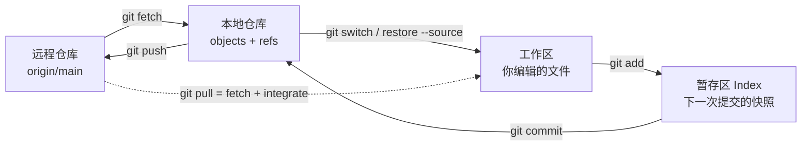
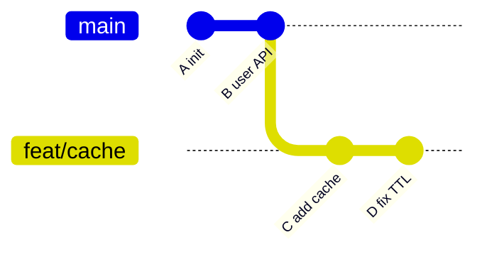

# Git - 第 1 课：Git 对象模型与四个工作区域：从 `add` 到 `push`

> Git 不是“上传代码到服务器”的客户端。即使断网，它也能完整提交、建分支、查看历史，因为本地仓库本身就保存了提交图。远端只是团队交换引用和对象的一处约定位置。

## 学习目标（本节结束后你能做到什么）

- 用四个区域解释 `add`、`commit`、`fetch`、`push`、`restore` 的移动方向。
- 理解 Git 保存的是内容快照和提交图，而不是一串“文件补丁目录”。
- 区分当前分支、`HEAD`、远程跟踪分支和远端真实分支。
- 能在提交前通过三种 `diff` 明确自己将提交什么。
- 避免 detached `HEAD` 下产生找不到归属的新提交。

## 内容讲解（核心概念，用类比、例子、图示说清楚）

## 1. 四个区域：先知道代码现在在哪里



| 区域 | 实际含义 | 高频查看命令 |
| --- | --- | --- |
| 工作区 Working Tree | 项目目录中当前可编辑的文件状态 | `git status`、`git diff` |
| 暂存区 Index / Stage | 下一次 commit 计划写入的树快照 | `git diff --staged` |
| 本地仓库 Local Repository | `.git` 中的对象数据库和引用 | `git log`、`git show` |
| 远程仓库 Remote | 通过网络共享的另一份仓库 | `git fetch`、`git push` |

一个关键事实是：`git add app.java` 不只是“把文件名标记为待提交”，而是把该文件**此刻的内容版本**写入 Index。如果继续编辑同一个文件，工作区与暂存区会同时存在不同版本。

```bash
git add src/App.java
# 再编辑 src/App.java
git status
git diff                 # 第二轮编辑，还没暂存的内容
git diff --staged        # 第一次 add 时已准备提交的内容
```

这就是为什么在提交前总要看 `git diff --staged`：它回答的是“这次 commit 真正会装进去什么”。

## 2. Git 本地仓库内部：对象加引用

可以把 Git 的核心对象简化为四类：

| 对象/引用 | 保存什么 | 为什么重要 |
| --- | --- | --- |
| blob | 某个文件内容，不带文件名 | 相同内容可以复用对象 |
| tree | 文件名、目录结构与其指向的 blob/tree | 表示一次目录快照 |
| commit | 顶层 tree、父 commit、作者、时间与说明 | 构成有向提交图 |
| ref | 指向某个对象的可读名字，如分支和 tag | 分支切换本质是移动/选择引用 |

假设提交图如下：



此时：

- `main` 是一个 ref，指向 `B`。
- `feat/cache` 是另一个 ref，指向 `D`。
- 切换到 `feat/cache`，工作区会重建为 `D` 指向的 tree。
- 提交新变更，只会让**当前分支引用**向新 commit 前进，旧 commit 仍在图中作为父节点存在。

## 3. `HEAD` 到底是什么

日常状态下，`HEAD` 通常是一个符号引用：

```text
HEAD -> refs/heads/main -> commit B
```

也就是说，`HEAD` 表示“我目前站在哪条本地分支上”，而当前分支再指向最新提交。

### 3.1 detached `HEAD`

当你直接检出一个 commit 或 tag，例如：

```bash
git switch --detach v1.2.0
# 或旧式命令：git checkout <commit>
```

`HEAD` 直接指向提交，不再指向某条分支：

```text
HEAD -> commit T
```

这适合查看旧版本或做临时实验。但若此时产生重要提交，切走后没有分支引用帮你永久记住它。正确保留方式是及时建立分支：

```bash
git switch -c fix/from-old-release
```

即便误切走，短时间内通常还可以通过 `git reflog` 找回提交并重新建分支，但不要把这种补救当工作流。

## 4. 本地分支与远程跟踪分支不是同一个东西

`origin` 通常只是远端别名。执行：

```bash
git fetch origin
```

会下载对象，并在本地更新诸如 `origin/main` 的**远程跟踪引用**。它表示“我最近一次 fetch 看见远端 `main` 在哪里”，不等于远程服务器会随本地编辑自动变化。

```text
本地分支：       main
远程跟踪引用：   origin/main
远端真实分支：   服务器上的 main
```

因此 `fetch` 的安全价值在于它只更新观察到的远端状态，不会把改动立刻揉进当前工作区：

```bash
git fetch origin
git log --oneline --graph --decorate main..origin/main
git diff main..origin/main
```

确认远端变化后，再自行选择：

```bash
git merge origin/main
# 或只在本地未共享提交适合重排时：
git rebase origin/main
```

## 5. `pull` 并不是单纯“下载代码”

`git pull` 是组合动作：

```text
git pull = git fetch + 将远程跟踪分支整合进当前分支
```

整合策略取决于配置或参数：

```bash
git pull --ff-only        # 只接受快进，发生分叉就停下
git pull --rebase         # 把本地尚未共享的提交重放到远端之后
git pull --no-rebase      # 需要时生成 merge commit
```

在共享主分支上，`--ff-only` 很适合避免不知情地制造合并提交；在自己的短生命周期功能分支上，`--rebase` 常用于保持最新主线基础。但策略是团队约定，不是永远只有一种正确选择。

## 6. `diff`：提交前最值得养成的肌肉记忆

| 命令 | 对比双方 | 典型用途 |
| --- | --- | --- |
| `git diff` | 工作区 vs 暂存区 | 看还没 `add` 的编辑 |
| `git diff --staged` | 暂存区 vs `HEAD` | 看下一次 commit 的内容 |
| `git diff HEAD` | 工作区整体状态 vs `HEAD` | 看所有尚未提交内容 |
| `git diff main...feat/x` | 从共同祖先到功能分支 | 看 PR 引入的净变化 |
| `git diff A B -- path` | 两提交指定文件 | 定位历史变动 |

### `..` 和 `...` 的实战区别

对于分支对比，面试和 review 里容易混淆：

- `git diff main feat/x` 或 `main..feat/x`：直接对比两个端点的文件快照。
- `git diff main...feat/x`：对比两分支共同祖先与 `feat/x`，更接近“这个 feature 相对起点改了什么”，常用于 PR 视角。

## 7. 一次健康的小提交流程

```bash
git switch -c feat/order-timeout
# 编辑与测试
git status --short
git diff
git add -p
git diff --staged
git commit -m "Handle order payment timeout"
git fetch origin
git rebase origin/main     # 仅对自己的未共享功能提交整理基础
git push -u origin feat/order-timeout
```

这里优先展示 `git add -p`，因为一次工作中常混有修复、调试日志、重构等不同意图。按 hunk 暂存能让 commit 边界更清楚，也让 review、回滚、`cherry-pick` 更容易。

## 小结（3-5 条关键点）

- Git 在本地保存对象数据库和提交图，远端是协作同步点，不是所有动作的前提。
- `add` 把当前内容快照放入 Index，`commit` 把 Index 固化成新的提交。
- `HEAD` 通常指向当前分支；detached `HEAD` 中的重要提交应立刻挂到新分支。
- `fetch` 更新远程跟踪引用而不改当前工作区，`pull` 则会继续进行整合。
- 提交前读 `status` 与 `diff --staged`，比事后频繁撤销更可靠。

## 问题 （检测用户对当前章节内容是否了解）

1. 一个文件 `git add` 后又被编辑，为什么会同时出现在 staged 和 unstaged 两栏？
2. blob、tree、commit 和 branch 引用分别保存什么？
3. `origin/main` 为什么不是远端分支本身，而是本地视角下的远程跟踪引用？
4. `git pull --ff-only` 在团队主分支上能避免哪类意外？
5. detached `HEAD` 中提交了有用修复后，怎样安全保留它？
