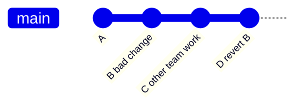

# Git - 第 2 课：撤销与恢复安全：`restore`、`reset`、`revert`、`amend` 与敏感信息清理

> “把代码撤回去”可能意味着四件完全不同的事：扔掉工作区编辑、撤出暂存、移动本地分支指针、在共享历史上新增一次反向修改。选错的代价从多敲一次命令，到覆盖同事代码，再到泄露密钥。

## 学习目标（本节结束后你能做到什么）

- 按变更所在区域选择最小破坏性的撤销方式。
- 准确说出 `reset --soft`、`--mixed`、`--hard` 对三棵树的影响。
- 区分本地历史整理与共享分支回滚，理解为什么后者优先 `revert`。
- 用 `reflog` 找回误操作后仍可达的提交。
- 建立密钥误提交的正确事故响应顺序。

## 内容讲解（核心概念，用类比、例子、图示说清楚）

## 1. 撤销前先问两个问题

### 问题一：改动到哪一层了

```text
工作区编辑 -> git add -> 暂存区 -> git commit -> 本地历史 -> git push -> 共享远端历史
```

越往右，被别人依赖的概率越高，撤销方式就越应保守。

### 问题二：历史是否已共享

| 状态 | 可以考虑的动作 | 主要原则 |
| --- | --- | --- |
| 未提交的本地编辑 | `restore` / 手动修正 | 不影响历史 |
| 自己尚未推送的最近提交 | `reset` / `amend` / `rebase` | 可整理本地历史 |
| 已推到个人分支但无人依赖 | 谨慎改写并 `--force-with-lease` | 明确通知与校验远端 |
| 已合并或共享分支上的提交 | `revert` | 新增修复，不重写公共历史 |

## 2. 工作区与暂存区：用 `restore` 说清意图

### 2.1 丢弃尚未暂存的文件修改

```bash
git restore path/to/file
```

默认把工作区文件恢复为 Index 中已有的版本。这是破坏性操作：尚未暂存的修改会消失，因此先用 `git diff -- path/to/file` 确认。

### 2.2 把已暂存文件撤回到工作区

```bash
git restore --staged path/to/file
```

它修改 Index，不丢工作区内容。适用于“我误把调试日志 add 进来了，但想保留本地继续编辑”。

```bash
git add config/dev.yaml src/App.java
git restore --staged config/dev.yaml
git diff --staged
```

现代 Git 将“切分支”与“恢复文件”拆成了 `switch` 和 `restore`，比让 `checkout` 同时承担两个含义更不容易误操作。

## 3. `reset`：移动当前分支，并决定重置到多深

`git reset <target>` 首先移动当前分支引用到目标 commit，然后按模式决定 Index 和 Working Tree 是否也随之匹配。

| 模式 | 移动 `HEAD`/当前分支 | 重置 Index | 重置工作区 | 常见用途 |
| --- | --- | --- | --- | --- |
| `--soft` | 是 | 否 | 否 | 撤销 commit，保留为已暂存改动 |
| `--mixed`（默认） | 是 | 是 | 否 | 撤销 commit 与暂存，保留编辑 |
| `--hard` | 是 | 是 | 是 | 丢弃本地版本状态，危险 |

例如刚提交后发现 commit 切得不好，且还没推送：

```bash
git reset --soft HEAD^
# 修改暂存内容或提交说明
git commit -m "A clearer atomic change"
```

如果想重新挑选要放入提交的 hunks：

```bash
git reset HEAD^             # 等价于 --mixed
git add -p
git commit -m "Split intended change"
```

### 3.1 为什么不把 `--hard` 当日常撤销

```bash
git reset --hard HEAD^
```

会同时把当前分支、Index 和工作区切回旧状态。未提交内容没有正常引用保护，恢复可能很困难甚至不可能。团队指导里应把它标记为“确认不需要本地改动才执行”，而不是撤 commit 的默认答案。

## 4. `revert`：公共历史上的正确后退方式

若一个错误提交已经进入共享分支，最稳的做法通常是：

```bash
git revert <bad-commit>
git push origin main
```

`revert` 创建一个新的 commit，其内容反向抵消指定提交：



为什么这比 `reset + force push` 更好：

- 别人的 `C` 不会被覆盖或突然失去公共祖先。
- 审计历史清楚展示“变更发生过，后来因故撤销”。
- 发布系统、tag、构建记录仍能对上提交图。

### 4.1 回滚 merge commit 要特别谨慎

一个 merge commit 有两个父提交，revert 时通常要指定保留哪条主线：

```bash
git revert -m 1 <merge-commit>
```

这不仅撤内容，还会影响 Git 后续判断该分支的改动是否已合入。对大型 PR 回滚后再重提，应先理解提交图和团队合并策略，而不是只反复执行命令。

## 5. `commit --amend`：重写最近一次本地提交

漏加一个文件或提交说明不准确时：

```bash
git add missing-file
git commit --amend --no-edit

# 或只修改说明
git commit --amend -m "Fix payment timeout validation"
```

`amend` 不是“编辑原 commit”，而是生成一个内容或元数据不同的新 commit，commit id 会改变。

因此：

- 尚未共享：很适合清理自己最后一次提交。
- 已经推给别人：优先新建后续修复 commit。
- 确认只是个人远程分支且必须更新时：使用 `git push --force-with-lease`，不要裸 `--force`。

`--force-with-lease` 会在远端分支仍是你上次观察到的状态时才覆盖；若同事已经推送新提交，它会拒绝而不是静默删除对方工作。

## 6. 误删提交还能找回来吗：`reflog`

分支引用被 reset、rebase 或误删除后，对象通常不会立刻物理消失。本地 `reflog` 记录引用近期移动轨迹：

```bash
git reflog --date=local
git switch -c rescue/work <lost-commit-id>
```

常见救援流程：

1. 立即停止继续进行大规模改写或清理操作。
2. 用 `reflog` 找到操作前的 `HEAD`。
3. 创建新分支保护该 commit。
4. 检查差异，再决定 merge、cherry-pick 或 reset 的后续动作。

`reflog` 是本地恢复网，不是远程备份或永久归档。换机器、过期清理或对象回收后，不能指望它仍存在。

## 7. `.gitignore` 为什么加了却不生效

`.gitignore` 只决定**未被跟踪的路径**是否进入跟踪范围；它不会让仓库忘掉已经提交过的文件。

例如 `config/local.env` 已被跟踪后，再添加规则：

```gitignore
config/local.env
```

仍会看到后续改动。若目标是停止跟踪而保留本地文件：

```bash
git rm --cached config/local.env
git commit -m "Stop tracking local environment file"
```

排查规则命中来源：

```bash
git check-ignore -v --no-index config/local.env
```

常见规则边界：

| 规则 | 含义 |
| --- | --- |
| `/build/` | 仅当前 `.gitignore` 所在目录根下的 `build` 目录 |
| `*.log` | 当前作用域及子目录中所有 `.log` 文件 |
| `!important.log` | 将此前忽略的某文件重新包含，但父目录也不能被完全排除 |

## 8. 敏感信息提交：这不是普通撤销题

密钥、Token、证书私钥一旦被提交到可访问远端，应假定已经泄露。正确顺序是：

1. **立即吊销或轮换凭证**：让泄露内容失效，这是止损动作。
2. **删除当前树中的敏感内容**：改为环境变量、Secret Manager 或仅保存模板。
3. **评估并改写历史**：使用 `git filter-repo` 等工具清除历史文件或字符串；历史改写会影响所有 clone，必须协调团队。
4. **强制更新远端并通知协作者重建本地历史**：已有 clone、fork、缓存构建物仍可能保存旧秘密。
5. **检查暴露影响**：审计凭证调用、云账单、访问日志，并补 secret scanning 与提交前钩子。

为什么 `revert` 不够：

```text
commit A: 加入 secret.txt
commit B: 删除 secret.txt
```

最新目录确实不见了 secret，但任何人仍可检出 `A` 读取密钥。这里需要移除历史副本，更需要让密钥本身失效。

## 9. 一张撤销决策表

| 我想做什么 | 首选动作 | 风险提醒 |
| --- | --- | --- |
| 放弃未 `add` 的单文件修改 | `git restore file` | 内容会丢失，先看 diff |
| 撤回误暂存但保留编辑 | `git restore --staged file` | 安全，不改工作区 |
| 重写未推送的最后一次提交 | `git commit --amend` 或 `reset --soft` | commit id 会变 |
| 重新组织多个未发布提交 | 交互式 rebase | 只整理自己的历史 |
| 回滚公共分支错误提交 | `git revert commit` | 保留可审计历史 |
| 找回误 reset 的提交 | `git reflog` 后建分支 | 尽早操作 |
| 远端个人分支确需覆写 | `git push --force-with-lease` | 确认无人基于该分支工作 |
| 已暴露密钥 | 先轮换，再清历史 | 删除文件不是止损 |

## 小结（3-5 条关键点）

- 撤销必须先判断改动在哪一层、历史是否已共享。
- `restore` 管文件状态；`reset` 会移动当前分支；`revert` 在共享历史上生成安全反向提交。
- `amend`、rebase、reset 都可能改变 commit id，只应谨慎用于自己尚未共享的历史。
- `.gitignore` 不会自动取消已跟踪文件。
- 密钥泄露的第一动作是轮换/吊销，不是美化 Git 历史。

## 问题 （检测用户对当前章节内容是否了解）

1. `reset --soft HEAD^` 与 `restore --staged file` 分别修改了哪些状态？
2. 一个已合并到 `main` 的错误提交，为什么优先 revert 而不是 reset 后 force push？
3. `--force-with-lease` 比 `--force` 多保护了什么？
4. `.env` 已经提交后再放进 `.gitignore`，为什么仍显示改动？怎样停止跟踪？
5. API key 被推送到公开仓库后，为什么历史清理不能替代凭证轮换？
