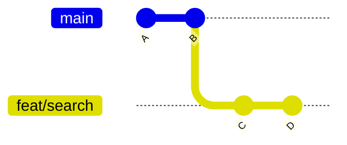
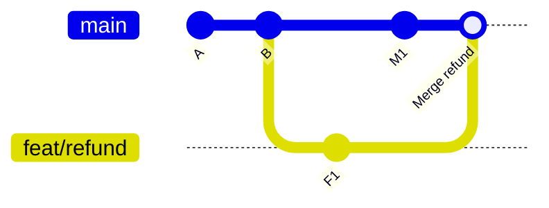

# Git - 第 3 课：分支整合与协作：`merge`、`rebase`、`cherry-pick`、`stash` 与 PR

> 分支不贵，长时间无人整合的分支才贵。日常协作真正需要判断的是：我要保留两条开发轨迹的汇合事实，还是在发布前整理自己尚未共享的提交；我要合入一个完整功能，还是只取一条独立修复。

## 学习目标（本节结束后你能做到什么）

- 从提交图解释 fast-forward、merge commit 与 rebase。
- 根据历史是否已共享选择 merge 或 rebase，避免重写别人的基础。
- 掌握冲突处理的完整继续/放弃流程。
- 区分整合分支与挑选单个提交的 `cherry-pick`。
- 使用 `stash` 安全中断工作，并理解 fork/clone/PR 的协作边界。

## 内容讲解（核心概念，用类比、例子、图示说清楚）

## 1. 建分支与切分支：让一段意图有名字

现代 Git 建议把切分支的动作写得明确：

```bash
git switch main
git fetch origin
git merge --ff-only origin/main
git switch -c feat/refund-query
```

短生命周期功能分支的价值不只是“避免改到 main”，还包括：

- 让一个 PR 对应一个可 review 的业务意图。
- 允许 CI 在进入主线前验证变更。
- 需要丢弃、延后或重做功能时，不污染可发布主线。

分支命名不必复杂，但应表达目的，例如 `feat/refund-query`、`fix/order-timeout`、`chore/update-sdk`。

## 2. `merge`：保留两条开发轨迹如何汇合

### 2.1 Fast-forward

如果 `main` 在功能分支创建后没有前进：



在 `main` 上执行 `git merge feat/search`，Git 可以只把 `main` 指针移到 `D`，无需新提交。这叫 fast-forward。

```text
A -- B -- C -- D
               ^ main, feat/search
```

### 2.2 Merge commit

如果两边都已经前进：



合并提交有两个父节点，它明确记录了“两个开发方向在这里合流”。这对保留 PR 边界、审核背景和发布回溯有价值。

### 2.3 `--no-ff` 不是越多越清楚

```bash
git merge --no-ff feat/refund
```

即便能够快进，也强制留下 merge commit。对需要把一个 feature 当作整体回溯或整体 revert 的团队，这可能合理；但每个极小分支都强制 `--no-ff`，提交图会被大量无信息合并节点淹没。选择它应服务于发布与审计需求，而不是形式习惯。

## 3. `rebase`：复制自己的提交到新的基础上

假设你从 `B` 开发了 `F1`、`F2`，与此同时 `main` 前进到 `M2`：

```text
          F1 -- F2   feat/payment
         /
A -- B -- M1 -- M2   main
```

在功能分支执行：

```bash
git rebase main
```

Git 会找到共同祖先 `B`，把功能分支的变更逐条重放到 `M2` 之后：

```text
A -- B -- M1 -- M2 -- F1' -- F2'   feat/payment
```

`F1'` 与 `F2'` 是新 commit，即使内容意图相同，其父节点变了，hash 就会变化。

### 3.1 什么时候适合 rebase

- 你的功能提交尚未被别人依赖，需要把分支更新到最新 `main` 基础上。
- 提交还在本地，想通过交互式 rebase 合并修正提交、调整说明或重排小提交。
- 团队明确要求 PR 分支在合入前保持线性，且强推只发生在提交作者控制的分支。

### 3.2 什么时候不要 rebase

- commit 已在共享分支上，其他人已经从它继续开发。
- 一条分支表达了需要保留的并行合并事实，而不是待整理的个人草稿。
- 你不清楚强推会覆盖谁的远程变更。

一句安全口径：

> Rebase 适合整理自己的未共享历史；merge 适合整合已经发生过协作的历史。

## 4. `pull --rebase` 的真实含义

在自己功能分支上：

```bash
git pull --rebase origin feat/payment
```

大意是：

1. `fetch` 远端新对象与远程跟踪引用。
2. 暂时摘下本地独有提交。
3. 将当前分支推进到远端基础。
4. 逐个重放本地提交。

它能减少“只为同步远端而出现”的 merge commit，但仍然可能冲突，也仍然会改写本地独有提交。共享主线应由团队保护规则与合并策略控制，而不是让所有人随意在主线上 rebase push。

## 5. 冲突处理：冲突不是 Git 坏了

冲突意味着 Git 无法自动判断两种修改怎样组合才符合业务意图。以 merge 为例：

```bash
git switch main
git merge feat/refund
# CONFLICT ...
git status
```

文件中可能出现：

```text
<<<<<<< HEAD
main 上的内容
=======
feat/refund 上的内容
>>>>>>> feat/refund
```

解决流程：

```bash
# 编辑文件，留下正确的组合结果
git add path/to/resolved-file
git status
git commit                 # merge 冲突解决后完成合并提交
```

若整次合并方向不对：

```bash
git merge --abort
```

Rebase 冲突流程类似，但因为它正在逐条重放提交：

```bash
git rebase main
# 解决当前冲突并验证
git add path/to/resolved-file
git rebase --continue

# 确认不该重放当前提交时
git rebase --skip

# 放弃整次 rebase，回到开始之前
git rebase --abort
```

### 5.1 冲突解决的工程纪律

- 不要把冲突标记删掉就算完成；必须编译、测试或至少验证目标行为。
- 解决冲突时确认双方意图，特别是配置、迁移脚本、依赖锁文件和权限规则。
- 一次冲突过大通常说明分支寿命太长或提交混杂太多，应改善整合节奏，而非训练“手速合冲突”。

## 6. `cherry-pick`：只搬需要的提交

`merge` 整合整条分支关系，`cherry-pick` 则在当前分支创建一个内容对应于指定 commit 的新提交：

```bash
git switch release/1.2
git cherry-pick <hotfix-commit>
```

适合场景：

- 某个功能分支里有一条独立线上修复，需要先进入 release 分支。
- 一个已验证补丁需要回植到若干维护版本。
- 误提交到了错误分支，需要把正确 commit 搬到正确分支，再处理原分支。

它不适合把一长串相互依赖的功能提交零碎搬运；那通常意味着应合并完整分支或重新规划发布切片。

冲突处理：

```bash
git cherry-pick <commit>
# 解决冲突
git add .
git cherry-pick --continue

# 放弃此次挑选
git cherry-pick --abort
```

同一个补丁若被多次 cherry-pick 到交汇的分支，后续合并可能增加冲突或审计难度，因此回植策略要记录清楚。

## 7. `stash`：临时让工作区变干净

正在开发一半，临时需要切换分支处理紧急问题：

```bash
git stash push -m "WIP: refund query"
git switch fix/production-timeout
# 完成紧急修复后
git switch feat/refund-query
git stash pop
```

常用命令：

| 命令 | 用途 |
| --- | --- |
| `git stash push -m "msg"` | 保存当前已跟踪文件的 staged/unstaged 变更 |
| `git stash push -u -m "msg"` | 也保存未跟踪文件 |
| `git stash list` | 查看 stash 条目 |
| `git stash show -p stash@{0}` | 查看某条内容 |
| `git stash apply stash@{0}` | 应用但保留 stash |
| `git stash pop` | 应用成功后删除该条 |
| `git stash branch recover/wip stash@{0}` | 从 stash 单独开分支恢复，冲突少时很好用 |

关键边界：

- stash 默认不包含未跟踪文件，调试新文件需要 `-u`。
- stash 是本地临时存放，不是团队备份，也不该长期堆放无人知道的工作成果。
- 需要 review 或异地备份的 WIP，更合适的是建个人分支并推远端草稿 PR。

## 8. Fork、Clone 与 Pull Request

三者发生在不同层次：

| 操作 | 发生在哪里 | 意义 |
| --- | --- | --- |
| Fork | 托管平台服务器侧 | 在自己账号下生成上游仓库的关联副本 |
| Clone | 本地 | 下载一个仓库对象与工作区，开始开发 |
| Pull Request | 托管平台协作层 | 请求将一个分支的变化审查并合入目标分支 |

开源贡献常见结构：

```bash
git clone git@github.com:me/project.git
git remote add upstream git@github.com:upstream/project.git
git fetch upstream
git switch -c fix/issue-123 upstream/main
# 修改、测试、commit
git push -u origin fix/issue-123
# 在平台上向 upstream/main 发起 PR
```

内部团队若已经有写权限，通常无需 fork：从同一仓库创建短分支、推送并发 PR 即可。

## 9. 分支清理

PR 合并后，短分支应及时清理，减少错选与误判：

```bash
git branch -d feat/refund-query
git push origin --delete feat/refund-query
git fetch --prune
```

- `-d` 只删除 Git 判断已经合并的本地分支。
- `-D` 强制删除未合并分支，先确认有无仍需保存的提交。
- `fetch --prune` 清掉本地过期远程跟踪引用，不会删除正常存在的远程分支。

## 小结（3-5 条关键点）

- Merge 记录分支如何汇合；rebase 将自己的提交复制到新的基础上，二者不是“谁先进”的竞争。
- Rebase 和强推只适用于作者控制且未被依赖的历史；共享历史应保持稳定。
- 冲突解决必须验证行为，不能只去掉冲突标记。
- `cherry-pick` 用于搬运少量独立修复，`stash` 用于短时中断工作，各有边界。
- PR 是审查与集成机制；短分支、清晰 commit 和 CI 能显著降低协作成本。

## 问题 （检测用户对当前章节内容是否了解）

1. Fast-forward 合并为什么不需要创建新 commit？什么时候仍可能选择 `--no-ff`？
2. Rebase 后为什么 commit hash 一定会变化？这对共享分支意味着什么？
3. Merge 冲突与 rebase 冲突完成流程分别是什么？
4. 线上补丁需要进入两个仍在维护的版本分支时，为什么 `cherry-pick` 可能比合并整个开发分支更合适？
5. `git stash` 默认没有保存哪类文件？长时间 WIP 为什么更适合分支加草稿 PR？
