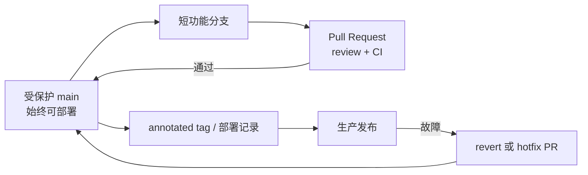

# Git - 第 4 课：工作流与排障发布：GitHub Flow、`tag`、`log`、`blame` 与 `bisect`

> 命令熟练只是个人效率；团队真正需要的是可审查的变更、可追踪的发布和出了问题能快速回答“哪一次改变引入了它”。工作流越贴近发布方式和自动化能力，越不需要用复杂分支弥补流程不足。

## 学习目标（本节结束后你能做到什么）

- 根据持续部署、版本维护和环境约束选择轻重合适的分支策略。
- 理解主线保护、短分支、PR 与 CI/CD 之间的协作关系。
- 用 annotated tag 建立可追踪发布节点。
- 通过 `log`、`show`、`blame` 和 `bisect` 定位变更与回归来源。
- 将 Git 操作组织成真实线上回滚与修复闭环。

## 内容讲解（核心概念，用类比、例子、图示说清楚）

## 1. 工作流不是分支名大全

工作流需要解决四个现实问题：

1. 多个人如何并行开发而不过早互相干扰。
2. 哪条代码代表可以发布或已经发布的版本。
3. review、测试和部署在变更进入主线前后怎样执行。
4. 线上故障时怎样定位、回滚、修复并将修复传播到正确版本。

仓库已有 [Git协同工作流，你该怎么选？](<../geektime后端-架构/左耳听风/docs/20 - Git协同工作流，你该怎么选？.md>) 对 Git Flow、GitHub Flow、GitLab Flow 的历史背景与权衡有完整展开。本节只把它收束成后端团队日常决策。

## 2. 三种常见选择

| 模式 | 核心形态 | 更适合的团队 | 主要代价 |
| --- | --- | --- | --- |
| GitHub Flow / 短功能分支 | `main` 可部署；短分支经 PR 合入 | Web 服务、持续交付、单主版本 | 依赖可靠 CI、feature flag 与回滚能力 |
| Trunk-Based Development | 极短分支或直接主干；频繁集成 | 自动测试成熟、发布频繁的小批量变更 | 对测试、开关和纪律要求很高 |
| 维护版本分支 | 主线开发 + `release/x.y` 维护 | SDK、客户端、需同时支持旧版本的产品 | 修复需要回植与版本同步管理 |

经典 Git Flow 的 `develop`、`release`、`hotfix` 多分支模型能够处理复杂发布窗口，但对于持续部署服务往往过重：分支长期漂移会把风险推迟到最终合并。不要因为名字正式就默认采用；先看团队是否真的同时维护多个发布轨道。

## 3. 一个适合多数服务团队的最小流程



关键约束：

- `main` 受保护，必须通过 PR 和必需检查才能合入。
- 功能分支尽量短，未发布功能通过 feature flag 隔离，而不是长期不合并。
- 每次部署可映射到 commit SHA 或 release tag，故障时能精准定位。
- 线上故障优先 revert 已合入的坏变更或走小型 hotfix PR，不在公共主线强制改写历史。

## 4. `tag`：发布版本的固定锚点

分支会移动，tag 的价值是为一次发布指向固定 commit。

### 4.1 轻量标签与附注标签

| 类型 | 创建方式 | 内容 | 推荐用途 |
| --- | --- | --- | --- |
| lightweight | `git tag v1.2.0 <sha>` | 仅引用 commit | 临时书签 |
| annotated | `git tag -a v1.2.0 <sha> -m "Release v1.2.0"` | 独立 tag 对象，含作者、时间、说明，可签名 | 正式发布 |

正式发布建议使用附注标签：

```bash
git tag -a v1.2.0 -m "Release v1.2.0"
git push origin v1.2.0
git show v1.2.0
```

发布系统还应记录构建产物、环境、迁移版本、配置版本与 tag/SHA 的关系。仅有 tag 不等于能可靠恢复生产。

### 4.2 不要随意移动已发布 tag

已经对外公布的 `v1.2.0` 应当不可变。如果发现发布错误，通常修复并发布 `v1.2.1`，而不是偷偷让同名 tag 指向另一份代码，否则构建可追溯性会断裂。

## 5. `log` 与 `show`：先缩小调查范围

高频查看方式：

```bash
git log --oneline --graph --decorate --all
git log --since="2026-05-20" --until="2026-05-27" -- path/to/file
git log --grep="timeout" --oneline
git show <commit>
git show --stat <commit>
```

线上告警发生后，可以先用部署 SHA 与上一稳定版本做差异：

```bash
git log --oneline v1.2.0..v1.2.1
git diff --stat v1.2.0..v1.2.1
git diff v1.2.0..v1.2.1 -- src/payment/
```

目标是尽快回答：

- 事故窗口里上线了哪些变更？
- 故障模块的相关文件是否被修改？
- 是否存在一个足够小、可以安全 revert 的提交或 PR？

## 6. `blame`：问“这一行从哪来”，不是问“谁背锅”

```bash
git blame -L 80,110 src/payment/TimeoutHandler.java
git show <blamed-commit>
```

`blame` 给出每一行最后一次修改对应的 commit。它适合：

- 找到这行代码引入时的上下文、PR 和设计理由。
- 发现同一逻辑附近是否有相关修复。
- 联系熟悉背景的人快速澄清行为。

它不适合直接得出“故障是谁造成的”：

- 代码可能因后续环境变化才变错。
- 格式化或搬文件可能成为表面最后作者。
- 事故通常与 review、测试、配置和发布保护共同相关。

使用 `blame` 的正确结果应是更快找到上下文和修复方案，而不是停止在作者名字上。

## 7. `bisect`：用二分找第一条坏提交

若你知道：

- 某个旧版本行为正常：`good`
- 当前或某个新版本可稳定复现故障：`bad`

可以执行：

```bash
git bisect start
git bisect bad HEAD
git bisect good v1.2.0
```

Git 会检出区间中间的提交，你运行验证：

```bash
# 测试失败
git bisect bad

# 或测试通过
git bisect good
```

对 `n` 个候选提交，只需约 `log2(n)` 次判断。256 个提交最多约 8 轮，这比肉眼逐条翻历史可靠得多。

### 7.1 自动化 bisect

若已有返回码稳定的回归测试：

```bash
git bisect start HEAD v1.2.0
git bisect run ./scripts/reproduce_timeout_regression.sh
git bisect reset
```

约定通常是：

- 退出码 `0`：good。
- 退出码 `1` 至 `127`（除 `125`）：bad。
- 退出码 `125`：该提交无法测试，跳过。

这是 Git 与测试体系相互放大的地方：测试越可复现，事故定位越接近机械化。

## 8. 一条真实线上故障闭环

假设新发布版本支付超时判断异常：

1. 从部署系统得到当前 SHA/tag 和上一稳定 tag。
2. 用 `git log` 与 `git diff` 缩小变更范围。
3. 若已确定单个坏 commit 且回滚安全，在 `main` 创建 revert PR，CI 通过后部署。
4. 若范围不明但可稳定复现，用 `git bisect run` 找第一条坏提交。
5. 用 `git show` 和关联 PR 理解根因，编写永久修复和回归测试。
6. 修复合入主线；若仍维护旧发布分支，按策略 `cherry-pick` 修复并发布补丁 tag。
7. 复盘为何测试或发布防线未及时发现故障。

注意“先恢复服务”和“彻底修根因”可以是两条不同提交路径；紧急 revert 不意味着根因分析结束。

## 9. 分支、版本与发布决策表

| 场景 | 推荐做法 |
| --- | --- |
| 日常 Web 服务持续部署 | 短分支 + PR + 受保护 `main` + feature flag |
| 同时维护 `1.x` 与 `2.x` SDK | `main` 开发 + 稳定 release 分支 + 明确回植策略 |
| 大功能开发不能立即曝光 | 尽量拆小合入并用开关隐藏；确实无法拆时定期同步主线 |
| 线上已合入变更导致故障 | revert PR 或最小 hotfix PR，不 reset 公共历史 |
| 发布需要可追溯 | 附注 tag + 产物/SHA/迁移/配置记录 |

## 小结（3-5 条关键点）

- 工作流要服务于并行开发、可发布主线、可追踪发布和快速修复，不是堆分支名。
- 对多数持续部署服务，短分支加 PR 与 CI 通常比长期多轨分支更轻、更稳。
- 正式发布用 annotated tag 建立不可随意移动的锚点。
- `log` 和 `show` 用于缩小范围，`blame` 用于找上下文，`bisect` 用于定位第一条坏提交。
- Git 能定位历史，但最终恢复效率取决于自动化测试、发布记录和回滚机制。

## 问题 （检测用户对当前章节内容是否了解）

1. 什么时候 GitHub Flow/短功能分支比完整 Git Flow 更适合后端服务？
2. 为什么正式发布优先用 annotated tag，且不应移动已经发布的 tag？
3. `git blame` 应用于事故分析时，正确目标是什么？
4. 有 512 条候选提交时，`bisect` 大约最多需要多少轮判断？
5. 一个坏变更已部署线上后，为什么紧急 revert 与永久修复通常应被视为两个动作？
