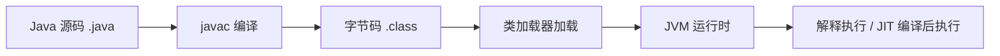

# JVM - 第 1 课：JVM 到底是什么，从 Java 代码到字节码到运行时

## 学习目标（本节结束后你能做到什么）

- 用自己的话解释 JVM 是什么，而不是只会说“Java 虚拟机”。
- 分清 JDK、JRE、JVM 三者的关系。
- 理解 Java 程序从源码到运行的完整路径。
- 建立“JVM 是 Java 运行时平台核心”的整体认知。
- 为后续学习内存模型、类加载和 GC 打下地基。

## 内容讲解（核心概念，用类比、例子、图示说清楚）

### 1. 先问一个最根本的问题：JVM 到底在干嘛

很多人学 JVM，开头就是：

- 堆
- 栈
- 方法区
- GC

这些当然重要，但在看这些之前，先得搞懂一件事：

**JVM 不是“垃圾回收器”，它是 Java 程序运行时真正待着的那个世界。**

当你写一段 Java 代码时，操作系统并不会直接理解 `new`、`class`、`synchronized` 这些高级语言概念。  
JVM 的职责，就是给 Java 提供一个统一的运行时环境，让 Java 程序能在不同机器上以比较一致的方式运行。

你可以把 JVM 理解成：

- Java 程序的“操作系统中的小世界”
- 一台专门负责运行 Java 字节码的虚拟机器

它负责的事情很多：

- 加载类
- 管理内存
- 执行字节码
- 做即时编译
- 做垃圾回收
- 处理线程同步与异常

所以 JVM 的位置比很多人想象得更靠底层。

### 2. JDK、JRE、JVM 到底什么关系

这是面试和学习里最容易混的地方。

#### JVM

JVM 是运行时引擎，负责真正执行字节码。

#### JRE

JRE = JVM + Java 标准类库 + 运行 Java 程序所需的基础环境。

如果你只是想“运行一个 Java 程序”，理论上 JRE 就够了。

#### JDK

JDK = JRE + 开发工具，比如：

- `javac`
- `javadoc`
- `jstack`
- `jmap`
- `jcmd`

也就是说：

- JVM 负责跑
- JRE 提供跑的环境
- JDK 提供开发和排查工具

你可以把它们想成：

- JVM 是发动机
- JRE 是整车运行组件
- JDK 是整车加维修工具箱

### 3. Java 程序是怎么跑起来的

先看一条完整路径：

这里最重要的转折点是：  
Java 源码不会直接变成 CPU 指令，而是先变成 **字节码**。

字节码是一种面向 JVM 的中间表示。  
这意味着：

- 只要某个平台上有兼容的 JVM
- 同一份字节码理论上就能运行

这就是“Write Once, Run Anywhere”背后的关键技术基础。

### 4. 为什么 JVM 让 Java 具备跨平台能力

假设没有 JVM，会发生什么？

- 你写的 Java 代码得直接编译成 Windows 可执行文件
- 或者 Linux 可执行文件
- 或者 macOS 可执行文件

那每个平台都要重新适配一套底层差异。

JVM 的做法是：

- 上层统一编译成字节码
- 下层由不同平台各自实现 JVM

于是变化被隔离在 JVM 这一层了。

程序员面对的是统一字节码和统一 Java 语义，不必直接处理不同平台的系统差异。

当然，这种跨平台不是“白来的”，因为多了一层虚拟机，就一定会引入额外设计，比如：

- 字节码解释/编译
- 内存管理
- 垃圾回收

这也是为什么 JVM 自己会变成一门庞大的工程学问。

### 5. JVM 不是只有“解释执行”

有些初学者会以为：

- JVM 读到字节码
- 就一条条解释执行

其实现代 JVM 远不止如此。

除了解释器，它还会做即时编译（JIT）：

- 热点代码先被识别出来
- 再编译成本地机器码
- 后续直接执行机器码，性能更高

所以 JVM 并不是一个“慢吞吞的纯解释器”，而是一个会边跑边优化的运行时系统。

这也解释了为什么 Java 程序刚启动和跑一段时间后的性能经常不一样：  
因为热点路径会被逐渐编译优化。

### 6. 为什么学 JVM 不能只盯着 GC

很多人学 JVM 的动力是：

- 面试爱问 GC
- 线上问题经常看到 Full GC

但如果你只盯 GC，会有一个问题：你会把 JVM 误解成“内存 + 回收器”。

实际上 GC 只是 JVM 里一个非常重要但不是全部的模块。

GC 的前面至少还有：

- 类是怎么加载进来的
- 对象是怎么创建出来的
- 对象分配在哪
- 哪些对象被认为还活着

如果这些基础不清楚，GC 就永远只剩名词。

### 7. 学 JVM 最好的视角：把它当运行时平台

如果你把 JVM 看成一个统一运行时平台，后面的知识会自然很多：

- 类加载机制：程序组件怎么进入运行时
- 运行时数据区：程序运行时的数据放在哪
- 执行引擎：字节码怎么被执行
- 垃圾回收：不用的对象怎么被清理
- JIT：热点代码怎么被优化

也就是说，JVM 不是零碎知识点的堆积，而是一个完整运行时系统。

## 小结

- JVM 不是单纯的垃圾回收器，而是 Java 程序运行时的核心平台。
- JDK、JRE、JVM 的关系可以理解为：开发工具箱、运行环境、底层执行引擎。
- Java 程序不是直接从源码变成机器码，而是先编译成字节码，再由 JVM 加载和执行。
- JVM 让 Java 获得跨平台能力，但也因此承担了内存管理、执行优化、垃圾回收等复杂职责。
- 学 JVM 最重要的第一步，是先建立“它是一个完整运行时系统”的视角。

## 问题（检测用户对当前章节内容是否了解）

1. JVM 和 JDK、JRE 的关系，你能不能用自己的话讲清楚？
2. Java 为什么能跨平台运行，关键中间层是什么？
3. 为什么说 JVM 不是只有 GC，而是一个完整运行时平台？
4. 如果没有 JVM，Java 程序的跨平台能力会受到什么影响？

