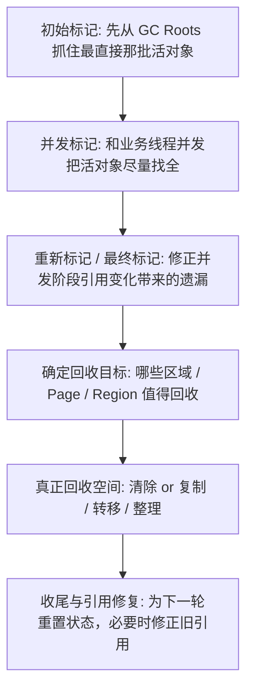

# JVM - 第 5b 课：垃圾回收器共同阶段：初始标记、并发标记、重新标记、清理与转移

## 学习目标（本节结束后你能做到什么）

- 不再把 CMS、G1、ZGC 的阶段名看成三套互不相干的黑话，而是能抽象成一条共同主线。
- 理解“初始标记、并发标记、重新标记”为什么会反复在不同收集器里出现。
- 分清“标记活对象”“选择回收目标”“真正回收空间”“修复引用”这几件事不是一回事。
- 说清 CMS、G1、ZGC 在共同主线上的共性和差异。
- 以后再看 G1、ZGC、CMS 的日志或源码时，知道自己到底在看哪一步。

## 内容讲解（核心概念，用类比、例子、图示说清楚）

### 1. 为什么它们看起来总在重复同样的阶段名

很多人学 CMS、G1、ZGC 时会有一种烦躁感：

- CMS 讲初始标记、并发标记、重新标记
- G1 也讲初始标记、并发标记、Remark
- ZGC 好像也有类似的起手和收尾停顿

于是就会疑惑：

**这些收集器到底是不是换个名字重复讲同一件事？**

答案是：

- 是，也不是

“是”的部分在于：

- 它们都要回答“谁还活着”这个问题
- 只要要并发做这件事，就都会遇到“业务线程还在改引用”的问题
- 所以都会出现“先标一部分、并发标、最后再收个尾”的结构

“不是”的部分在于：

- 它们最后怎么回收空间不一样
- 它们怎么处理引用变化不一样
- 它们怎么让对象搬家或不搬家也不一样

所以最好的学习方式不是把 CMS、G1、ZGC 分成三座孤岛，而是先抽象出一条共同主线。

### 2. 先抽象出一条 GC 共性主线

如果把现代垃圾回收器的工作抽象一下，大致都绕不开下面这些问题：

1. 谁还活着？
2. 并发标记过程中，引用关系变了怎么办？
3. 哪些区域或对象值得回收？
4. 回收时到底是“直接清掉”，还是“把活对象搬走”？
5. 如果对象搬家了，其他引用怎么修正？

你会发现，收集器设计再花哨，本质上都要把这几件事做完。

所以可以先把它们统一抽象成下面这条主线：

这条图不是某一个收集器的官方阶段图，而是我们为了建立统一心智模型做的抽象图。

你以后再学具体收集器时，就可以不断问自己：

- 它现在处在哪一步
- 这一步在解决哪一个通用问题

### 3. 第一步：初始标记到底在干什么

先抓一句最核心的话：

**初始标记不是为了把所有活对象一口气找全，而是为了从 GC Roots 出发，先抓住最直接、最关键的起点。**

为什么这一步通常都要 Stop-The-World？

因为 GC Roots 本身是运行时最核心的一批起点，例如：

- 栈上的引用
- 静态字段引用
- JNI 相关根
- 某些运行时元数据根

如果这时候业务线程还在疯狂改这些引用，GC 一开始就拿不到一个稳定起点，后面整轮标记都会变得很别扭。

所以现代 GC 的常见做法是：

- 先短暂停一下世界
- 先把最直接那批根对象抓住
- 然后再尽量把后面的大量工作并发化

这就是为什么：

- CMS 有初始标记
- G1 有初始标记
- ZGC 也会有一个非常短的起手停顿

它们都在解决同一个问题：

**先拿到一个足够稳定的“活对象起点快照”。**

### 4. 第二步：并发标记到底在干什么

初始标记之后，收集器已经拿到一批“肯定活着的对象起点”了。  
接下来要做的就是：

- 沿着引用链继续往下走
- 把尽可能完整的存活对象图找出来

这就是并发标记。

这一阶段最常见的特点是：

- 工作量大
- 但尽量和业务线程并发执行

为什么大家都努力把这一步并发化？

因为“找谁活着”这件事非常重。  
如果整个对象图都靠 Stop-The-World 来遍历，大堆场景下停顿就会很难看。

所以你可以把并发标记理解成：

**真正大量干活的那一段“活对象普查”。**

这里 CMS、G1、ZGC 的目标是一样的，但手段会不一样：

- CMS 更偏传统并发标记 + 增量更新思路
- G1 在并发标记上会结合 SATB
- ZGC 则会结合染色指针和读屏障建立自己的并发视图

但从抽象层看，它们都在回答：

**这轮 GC 到底哪些对象应该留下。**

### 5. 为什么有了并发标记，还非得再来一次重新标记

这是整个共性流程里最容易卡人的地方。

很多人会想：

- 都已经并发标记了
- 为什么还要重新标记 / 最终标记

根本原因只有一个：

**并发标记时，业务线程没停，它还在改对象引用。**

而只要引用在变，就会出现经典问题：

- 漏标
- 多标
- 某些对象刚刚变成不可达或刚刚重新可达

所以并发标记拿到的结果，往往还差“最后一遍收尾”。

这就是重新标记 / 最终标记的作用：

- 把并发阶段遗漏的边边角角补齐
- 修正引用变化带来的不一致
- 让这轮存活集结果足够可靠

这一步通常也会有一次短停顿，因为：

- 想真正把尾巴收干净
- 最终还是需要一个更稳定的视图

所以你可以记一句非常实用的话：

**初始标记是“先抓住头”，重新标记是“把尾巴收干净”。**

### 6. 初始标记和重新标记，分别更像哪种“短停顿”

你可以用这个直觉来区分：

#### 初始标记

更像：

- 先在地图上钉几个关键坐标

它的任务是把根抓住，通常很短。

#### 重新标记 / 最终标记

更像：

- 业务线程在你普查时一直偷偷改地图，现在你要回头核对一遍

它往往比初始标记更复杂，因为这里不只是“补几个点”，还可能要做：

- Reference 处理
- SATB 队列收尾
- 类卸载前的某些清理
- 元数据相关处理

所以在很多收集器里，真正更容易出长停顿的，往往不是初始标记，而是最终标记 / Remark。

### 7. 第三步：确定“回收目标”到底在做什么

当收集器已经知道“谁活着”之后，还不能立刻说“GC 完成了”。

因为接下来还要回答：

**我这一轮具体要回收哪部分空间？**

这件事在不同收集器里差异就开始明显了。

#### CMS

CMS 更像：

- 我已经知道 Old 区里哪些对象死了
- 后面直接把死对象占的空间清出来就行

它不太强调“精挑细选一批最值钱的区域”，而是更偏老年代并发清扫。

#### G1

G1 很强调这一步。

它会先做全局标记，知道哪些 Region 的垃圾比例高，然后进一步形成一批：

- 值得优先回收的 Region 集合

也就是 Collection Set。

#### ZGC

ZGC 则更像：

- 我知道哪些 Page 里活对象分布如何
- 现在决定哪些 Page 要进入重定位集合

所以在抽象层面，这一步可以统一叫：

**从“知道谁活着”走到“决定这轮实际收谁”。**

### 8. 第四步：真正回收空间，到底有哪几条路线

当我们说“垃圾回收”，很多人脑子里容易只有一个动作：把垃圾删掉。

但真实世界里，“让空间重新可用”至少有三种主要路线。

#### 路线一：清除（Sweep）

把死对象占的空间直接标为空闲。  
特点是：

- 不搬活对象
- 实现直观
- 但容易留下碎片

CMS 的常规路线更接近这一类。

#### 路线二：复制 / 转移（Copy / Evacuate / Relocate）

把活对象搬到新空间，原空间整体腾出来。  
特点是：

- 更利于消除碎片
- 分配也更容易走指针碰撞
- 但要付出搬运对象和修引用的成本

G1 的 Young GC / Mixed GC 更偏 `Evacuation`。  
ZGC 更偏 `Relocate`。

#### 路线三：整理（Compact）

把活对象往一侧压紧，消除碎片。  
这类动作也会移动对象，但常常比单纯复制更重。

CMS 正常并发周期不做这件事，但一旦退化到 Full GC，可能会进入这条路线。

所以到这里你就能理解：

**“标记完成”不等于“空间已经回来了”。**

标记只是告诉你谁能收，真正让内存可再用，后面还要靠清除、复制或整理。

### 9. CMS、G1、ZGC 在“真正回收空间”这一步差在哪

这是三者最值得抽象对比的地方。

#### CMS：以清除为主

它的核心特点是：

- 尽量并发
- 尽量少移动对象

好处是：

- 停顿相对短

代价是：

- 容易有碎片
- 碎片积累后可能退化

#### G1：以复制 / 转移为主

它的核心特点是：

- 选一批 Region 组成回收集
- 把活对象 evacuate 到别的 Region
- 让原 Region 整体腾空

这让 G1 更容易控制碎片，也更适合做“挑有价值的 Region 回收”。

#### ZGC：以并发转移 + 访问时修复为主

它的核心特点是：

- 对象可以搬
- 但不要求一次性把所有旧引用全修完
- 谁访问旧引用，谁在读屏障里自愈

所以 ZGC 最激进的地方不只是“也搬对象”，而是：

**它把搬家后的引用修复，也尽量做成运行时渐进完成。**

### 10. 第五步：如果对象搬家了，引用怎么修正

这一步是理解 G1 和 ZGC 差异的关键。

如果对象移动了，原本所有指向旧地址的引用理论上都得改。

但不同收集器处理这件事的风格很不一样。

#### CMS

常规 CMS 不太移动对象，所以这一步压力相对小。  
它的代价主要体现在碎片，而不是引用修正。

#### G1

G1 在 Young GC / Mixed GC 时会搬活对象。  
所以在停顿阶段里，它会更集中地完成对象复制和相关引用更新。

它的思路更像：

- 既然已经 STW 了
- 那就趁这次把该搬的搬、该改的改

#### ZGC

ZGC 的思路最不同。

它不执着于：

- 一次停顿里把所有引用全修对

而是依赖：

- 染色指针
- 读屏障
- 转发表
- 自愈

来让旧引用在访问路径上逐步修正。

所以你以后再看 ZGC 时，一定要记住：

**它和 G1 的差异，不只是“阶段名字不同”，而是“引用修复时机不同”。**

### 11. 第六步：收尾 / Reset 又在做什么

GC 并不是“对象收完就立即什么都不用管了”。

每一轮结束后，通常还要做一些收尾动作，例如：

- 清理本轮标记状态
- 重置位图、队列、统计信息
- 更新某些阈值
- 为下一轮回收准备元数据

这一步你可以统称为：

**把战场打扫干净，准备进入下一轮。**

不同收集器在这里的细节很多，但从心智模型上，它们都在做“状态归零和下一轮准备”。

### 12. 用一张总表把 CMS、G1、ZGC 放在一起看

下面这张表最适合你建立“共性流程 + 个性实现”的整体认知：

| 共性步骤 | 核心问题 | CMS | G1 | ZGC |
| --- | --- | --- | --- | --- |
| 初始标记 | 先从 GC Roots 抓住哪批对象 | 有，短 STW | 有，短 STW | 有，极短 STW |
| 并发标记 | 怎么把存活对象图尽量找全 | 有，主要看 Old | 有，全局并发标记 | 有，强并发标记 |
| 重新标记 / 最终标记 | 怎么修正并发期间引用变化 | 有，Remark 很关键 | 有，Remark + SATB 收尾 | 有，收尾停顿非常短 |
| 选择回收目标 | 这轮具体收哪里 | 更偏老年代清扫 | 选 Collection Set | 选 Relocation Set |
| 真正回收空间 | 空间怎么变可用 | 清除为主 | Evacuation 复制转移 | Relocate 转移 |
| 引用修复 | 搬家后旧引用怎么办 | 常规路径压力较小 | 停顿阶段更集中处理 | 读屏障 + 自愈渐进修复 |
| 收尾重置 | 怎么准备下一轮 | 有 | 有 | 有 |

这张表最重要的不是让你死记，而是帮你形成一句话：

**它们都在走“先认活、再收尾、再回收空间”的通用路线，只是 CMS 更偏清除，G1 更偏分区复制，ZGC 更偏并发转移加访问时修复。**

### 13. 为什么这篇抽象课对后面几课特别重要

学完这篇以后，你再回头看：

- CMS
- G1
- ZGC

就不会再被阶段名牵着走，而是会主动问：

- 这一步是不是在“认活对象”
- 这一步是不是在“补并发标记的尾巴”
- 这一步是不是在“选回收目标”
- 这一步到底是“清除”还是“搬家”
- 搬家后引用是“停顿里统一修”，还是“运行时渐进修”

一旦有了这个抽象框架，后面很多术语都会自动归位。

## 小结（3-5 条关键点）

- CMS、G1、ZGC 虽然实现差异很大，但都可以抽象成“初始标记 -> 并发标记 -> 重新标记 -> 选择回收目标 -> 真正回收空间 -> 收尾重置”这条主线。
- 初始标记和重新标记之所以常常都要短暂停顿，是因为它们分别在解决“抓住起点”和“修正并发变化尾巴”这两个关键问题。
- 真正让内存重新可用，不是只有一种方式，常见有清除、复制 / 转移、整理三条路线。
- CMS 更偏并发清除，G1 更偏分区复制转移，ZGC 更偏并发转移加访问时修复。
- 以后看任何现代 GC 的阶段名，先问“它在解决哪一个通用问题”，会比死背阶段顺序更稳。

## 问题（检测你对当前章节内容是否了解）

1. 为什么现代 GC 经常都会出现“初始标记、并发标记、重新标记”这几个阶段，它们分别在解决什么问题？
2. 为什么说“标记完成了”不等于“空间已经回来了”？
3. CMS、G1、ZGC 在“真正回收空间”这一步上最本质的差异是什么？
4. 如果对象搬家了，G1 和 ZGC 处理旧引用的思路为什么会明显不同？
