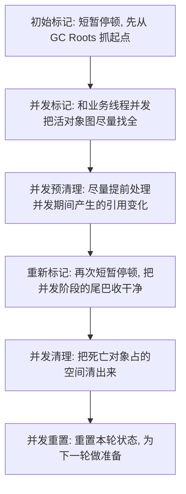

# JVM - 第 5c 课：CMS 垃圾回收器，从 ParNew、并发标记到碎片与退化

## 学习目标（本节结束后你能做到什么）

- 不再把 CMS 只理解成“一个老 GC 名字”，而是真正知道它想解决什么问题。
- 理解 `ParNew + CMS` 这组经典组合到底是怎么分工的。
- 说清 CMS 的关键阶段：初始标记、并发标记、重新标记、并发清理、重置。
- 理解 CMS 为什么能降低停顿，又为什么会带来浮动垃圾、碎片和退化问题。
- 知道 CMS 和 G1 的差别不只是“新旧版本”，而是设计取舍不同。

## 内容讲解（核心概念，用类比、例子、图示说清楚）

### 1. 先说 CMS 到底想解决什么问题

CMS 的全名是：

`Concurrent Mark Sweep`

先别急着背这个名字，先抓它出现的背景。

在早期 JVM 里，大家最难受的事情之一就是：

- 老年代一回收
- Stop-The-World 就会比较长
- 对在线系统很不友好

尤其是：

- RPC 服务
- Web 服务
- 网关
- 各类延迟敏感的服务端应用

它们往往不是最怕“整体吞吐差一点”，而是最怕：

**某一次 GC 停得太久。**

CMS 就是在这个背景下出现的。

它的核心目标非常明确：

**尽量把老年代回收中的大量工作搬到并发阶段做，从而缩短停顿时间。**

所以理解 CMS 的正确入口，不是“它有哪些阶段”，而是：

**它想减少老年代 GC 带来的长停顿。**

### 2. 为什么 CMS 总是和 ParNew 一起出现

你在很多 Java 8 时代的文章或日志里，经常看到的不是单独的 CMS，而是：

- `ParNew + CMS`

这是因为在经典分代模型里，这俩本来就是搭档。

你可以先这样理解：

- `ParNew`：主要负责年轻代回收
- `CMS`：主要负责老年代回收

也就是说：

- 新生代对象多、死得快，适合用复制算法高效回收
- 老年代对象活得久，CMS 重点是尽量把“找垃圾、清垃圾”做得更少停顿

所以这组组合的经典分工是：

| 区域 | 主要收集器 | 核心思路 |
| --- | --- | --- |
| Young | `ParNew` | 多线程复制回收，STW |
| Old | `CMS` | 并发标记 + 并发清理，尽量缩短停顿 |

这也是为什么你读 CMS 时，不能把它当成“整个堆唯一收集器”来看。

### 3. CMS 这个名字到底是什么意思

名字其实已经把它的设计思路写出来了：

#### Concurrent

并发。

意思是：

- GC 线程会和业务线程一起跑
- 不是所有事情都靠 STW 完成

#### Mark

标记。

意思是：

- 先找出哪些对象还活着

#### Sweep

清除。

意思是：

- 把死对象占的空间直接清出来
- 但**通常不移动活对象**

这里有一个非常关键的点：

**CMS 的常规路径是 Mark-Sweep，不是 Mark-Compact。**

这句话会直接导向后面最经典的两个问题：

- 浮动垃圾
- 内存碎片

### 4. CMS 的最经典执行流程是什么

如果你先不管特别细的源码实现，CMS 可以先抓下面这条主线：

你可以把它理解成：

- 先停一下，把关键起点抓住
- 然后大量工作并发做
- 中间尽量预处理一些脏数据
- 最后再短暂停一下，把尾巴收干净
- 然后并发清理垃圾

这条流程里最重要的不是阶段名，而是它背后的取舍：

**CMS 选择了“尽量并发 + 不主动整理空间”这条路线。**

### 5. 初始标记在做什么

初始标记很短，但非常关键。

它主要是在做：

- 从 GC Roots 出发
- 先把最直接能到达的老年代活对象抓出来

为什么这一步必须 STW？

因为：

- GC Roots 本身是最核心的一批起点
- 如果一开始业务线程还在疯狂改引用
- GC 连起手都不稳定

所以 CMS 会先来一次短暂停顿，把“头”先抓住。

你可以把初始标记理解成：

**先把整棵对象图最关键的入口钉住。**

### 6. 并发标记在做什么

初始标记之后，CMS 已经拿到一批确定活着的起点。

接下来就进入真正的大头工作：

- 沿着引用链往下遍历
- 把老年代里存活对象尽量找全

这一步和业务线程并发执行。

这正是 CMS 最大的价值所在：

- 大量工作不再全部压在 STW 上

但并发执行也会带来天然副作用：

- 你在标记对象
- 业务线程也在修改对象引用

于是标记结果在理论上就可能不断变化。

这也是为什么 CMS 后面一定还要有重新标记。

### 7. 并发预清理为什么存在

很多同学学 CMS 时会看到一个容易被忽略的阶段：

- `Concurrent Preclean`

这个阶段你可以先把它理解成：

**趁业务线程还在跑，尽量把一些“将来重新标记要处理的脏活”提前做掉。**

为什么要这么做？

因为重新标记是 STW 的。

如果所有尾巴都留到重新标记阶段再处理，那这次停顿就会更难看。

所以 CMS 会尝试：

- 先并发处理一部分引用变化
- 尽量压缩后面 Remark 的停顿时间

你不用把它想得太神秘，它的本质就是：

**提前做家务，给 Remark 减负。**

### 8. 重新标记为什么往往比初始标记更值得关注

重新标记也叫 Final Remark 或 Remark 阶段。

它的作用是：

- 修正并发标记期间业务线程改引用带来的不一致
- 把本轮存活对象结果最终定下来

为什么很多 CMS 问题最后都落到 Remark？

因为这一阶段虽然也是短暂停顿，但它常常不只是“补几个标记”这么简单，还可能顺带处理：

- 引用队列
- `Reference` 相关对象
- 类卸载相关工作
- 一些元数据清理

所以在实践里，CMS 真正容易出长停顿的，往往不是初始标记，而是：

- `CMS Final Remark`

这也是为什么 CMS 问题排查时，大家会特别关注：

- `remark` 耗时
- `Reference` 处理
- `class unloading`

### 9. 并发清理到底在做什么

当 CMS 已经确定“谁死了、谁活着”之后，就进入清理阶段。

CMS 的常规做法不是搬活对象，而是：

- 直接把死对象占的空间标为空闲

这就是 `Sweep`。

它的好处很明显：

- 不需要大规模搬对象
- 停顿压力相对更小

但它的代价同样明显：

- 活对象还在原地
- 死对象被清掉后，堆里会留下很多空洞

这就埋下了 CMS 最大的经典问题：

**碎片。**

### 10. 为什么 CMS 会有浮动垃圾

浮动垃圾这个词，基本是 CMS 的高频配套词。

根本原因很简单：

- CMS 并发标记、并发清理时，业务线程没停
- 业务线程还在继续创建对象、修改引用、制造新垃圾

所以会出现这样一类对象：

- 它们在本轮标记开始后才变成垃圾
- 但这轮 CMS 又来不及处理它们

这些对象就叫：

- `Floating Garbage`

你可以把它理解成：

**回收工人正在打扫房间时，旁边还有人继续往地上丢纸团。**

CMS 的结果就是：

- 本轮回收结束了
- 但地上又多了一些新垃圾
- 这些垃圾只能等下一轮再收

所以 CMS 一定要预留更多空间，不能把老年代打到特别满。

### 11. 为什么 CMS 会产生内存碎片

这一点和它的 `Sweep` 路线直接相关。

CMS 正常路径下：

- 不整理活对象
- 只是把死对象空间清掉

那结果就是：

- 这里空一点
- 那里空一点
- 整个老年代越来越像“蜂窝煤”

问题在于：

- 总空闲空间可能看起来不少
- 但未必有足够大的**连续空间**

这就会带来两个经典后果：

1. 分配效率变差  
   因为不能总是简单地做指针碰撞分配。

2. 大对象或晋升对象可能找不到合适连续空间  
   即使“总空闲量够”，也可能放不进去。

这就是为什么 CMS 在理论上追求低停顿，但在长期运行后，可能会被碎片反噬。

### 12. CMS 为什么会退化

CMS 最让人头疼的，不是它平稳运行的时候，而是：

**它没赶上对象分配和晋升速度的时候。**

常见的退化信号有：

- `Concurrent Mode Failure`
- 晋升失败
- 需要退回到更重的 STW Full GC

为什么会这样？

因为 CMS 的老年代回收是并发做的，但业务线程还在继续：

- 分配对象
- 晋升对象
- 消耗老年代空间

如果回收速度赶不上消耗速度，就会出现：

- 还没清完
- 老年代又快满了

那 JVM 就只能走更激烈的兜底路线。

这时候 STW 往往会明显变长，系统也会从“低停顿模式”掉进“故障模式”。

### 13. 为什么很多人说 CMS 怕空间不够

现在你就能理解了：

CMS 和某些停世界整理型收集器不同，它不是“停下来狠狠干一轮再说”。

它需要额外空间去承受：

- 并发阶段新产生的垃圾
- 并发阶段继续晋升进老年代的对象
- 碎片带来的空间利用损失

所以 CMS 的老年代通常不能配得太抠。

一句话总结就是：

**CMS 不只是怕没空间，更怕“看起来有空间，但并发过程中其实不够用”。**

### 14. CMS 的 Foreground 和 Background 有什么区别

这是学习 CMS 时特别值得补上的一个点。

正常情况下，我们理解的 CMS 是：

- 后台并发回收
- 也就是常说的 `Background CMS`

这时候：

- 初始标记和重新标记会短暂停顿
- 大量工作仍然是并发完成

但如果遇到某些特殊情况，例如：

- 显式 `System.gc()`
- 并发模式失败
- 某些分配担保失败

CMS 可能会走到更重的前台回收路径，也就是：

- `Foreground GC`

这时它可能不再维持平时那种“尽量并发、尽量短停顿”的姿态，而会进入更重的 Full GC 路线。

你可以把它理解成：

- 平时是“边跑边打扫”
- 出事了就变成“把所有人赶出去，整栋楼大扫除”

这也是为什么 `System.gc()` 和 `Concurrent Mode Failure` 在 CMS 时代特别敏感。

### 15. CMS 相比 G1，到底差在哪

这里不要用“新旧”来理解，最好用“设计重点”来理解。

#### CMS 的重点

- 尽量并发
- 尽量缩短老年代回收停顿
- 代价是：
  - 不整理空间
  - 会有碎片
  - 对空间担保比较敏感

#### G1 的重点

- 把整个堆切成 Region
- 回收时更强调“选择最值得回收的区域”
- 通过复制 / 转移减少碎片
- 更重视停顿可预测性

所以 G1 不是简单“CMS 的下一版本”，而是：

**在 CMS 遇到碎片、退化、空间担保这些老问题后，JVM 选择了一条更系统化的新路线。**

### 16. 今天还要不要学 CMS

如果你只看最新 JDK：

- CMS 已经退出历史舞台

但如果你看真实世界：

- 很多 Java 8 老系统还在跑 CMS
- 很多 GC 排障经验仍然源于 CMS 时代
- 很多“为什么会过早晋升、为什么会碎片、为什么会退化”的理解，放到今天仍然很有价值

所以学习 CMS 的意义不只是：

- 会答一个旧收集器

更重要的是：

- 它会帮你真正理解“并发回收”这条路线为什么难
- 也会帮你理解 G1、ZGC 后来的很多设计为什么要那么做

### 17. 怎么评价 CMS

CMS 的历史地位非常高。

它最大的贡献是：

- 把 JVM 从“主要靠长停顿回收”推进到了“认真做并发回收”

它的优点很鲜明：

- 对在线服务更友好
- 老年代停顿相比传统方案明显更短
- 思路经典，特别适合建立 GC 问题分析直觉

但它的缺点也非常经典：

- 会有浮动垃圾
- 会有内存碎片
- 对空间担保敏感
- 容易在高压力下退化

所以 CMS 的关键词可以浓缩成一句话：

**它用更复杂的并发回收，换来了更短停顿；但这份低停顿不是白来的，而是用碎片、担保压力和退化风险换来的。**

## 小结

- CMS 的核心目标是降低老年代回收带来的长停顿，所以它会把大量工作搬到并发阶段做。
- 经典的 CMS 场景通常是 `ParNew + CMS`：年轻代由 `ParNew` 回收，老年代由 `CMS` 回收。
- CMS 的主流程可以抓成：初始标记、并发标记、并发预清理、重新标记、并发清理、并发重置。
- CMS 常规路径使用的是 `Mark-Sweep`，而不是整理，所以它会天然带来浮动垃圾和内存碎片。
- CMS 最怕的不是“平时慢一点”，而是空间不够、碎片严重或并发回收赶不上分配速度，从而触发退化。

## 问题（检测用户对当前章节内容是否了解）

1. 为什么 CMS 总是和 `ParNew` 一起出现，而不是单独理解成一个完整的整堆回收器？
2. CMS 的并发标记和并发清理为什么能缩短停顿，又为什么会带来浮动垃圾？
3. 为什么说 CMS 的碎片问题不是小瑕疵，而是它 `Mark-Sweep` 路线的自然结果？
4. `Concurrent Mode Failure` 本质上在说明 CMS 的哪种设计取舍开始撑不住了？
