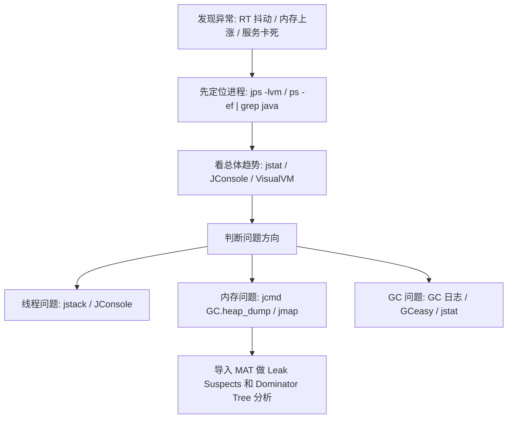

# JVM - 第 9 课：JVM 问题排查工具：jps、jstat、jstack、jmap、jcmd、JConsole 与 VisualVM

## 学习目标（本节结束后你能做到什么）

- 建立 JVM 排障工具的整体地图，而不是只会零散背几个命令。
- 知道不同症状应该优先看哪些工具，例如高 CPU、Full GC 频繁、线程卡死、疑似内存泄漏分别怎么下手。
- 分清命令行工具、可视化工具和第三方分析工具分别适合什么场景。
- 能说清 `jps`、`jstat`、`jstack`、`jmap`、`jcmd` 这些命令各自最核心的价值。
- 为后面做死锁分析、Heap Dump 分析、OOM 定位建立工具基础。

## 内容讲解（核心概念，用类比、例子、图示说清楚）

### 1. 为什么 JVM 排障一定要先有“工具地图”

很多同学学 JVM 工具时，最常见的问题不是不会敲命令，而是：

- 不知道先用哪个
- 看到命令很多，感觉都差不多
- 一出问题就乱打一通，结果信息很多，但没有结论

JVM 排障和临床看病很像。

你不会一上来就做最重的检查，而是会先问：

- 症状是什么
- 问题更像出在线程、内存、GC，还是进程配置
- 我要先看“概况”，还是直接抓“现场”

所以工具要按职责来记，而不是按字母顺序来记。

一个很好用的划分方式是：

- 找进程：先确认你到底在看哪个 Java 进程
- 看趋势：先看 GC、堆、线程这些运行态指标
- 抓现场：把线程栈、堆快照、参数配置抓下来
- 做深挖：把快照导入 MAT、VisualVM 或其他工具分析

如果脑子里先有这张图，工具就不再是一堆零碎命令，而是一条诊断链路。

### 2. JDK 自带的可视化工具

#### JConsole

`JConsole` 是 JDK 自带的基于 JMX 的可视化监控工具。

它适合干什么？

- 看应用基本运行概况
- 看堆内存趋势
- 看线程数量变化
- 看类加载数量
- 看 MBean
- 检测死锁

它的优点是：

- JDK 自带，开箱即用
- 图形化界面简单直观
- 对排查线程问题、快速看内存趋势很方便

它的定位更像“基础体检面板”。  
当你只是想快速确认：

- 线程是不是一直在涨
- 堆是不是打满了
- 有没有明显死锁

这时候 `JConsole` 非常合适。

#### VisualVM

`VisualVM` 也是非常经典的 JVM 可视化工具。  
你可以把它理解成比 `JConsole` 更全面、更适合日常排查的一站式工具。

它通常可以看：

- CPU
- 堆内存
- 线程
- 类加载
- 采样结果
- Heap Dump
- Thread Dump

它还有一个非常大的优点：很多场景下不需要像某些商业 Profiling 工具那样依赖特殊 Agent，侵入性相对更低，所以很适合作为线上问题的第一层观察工具。

当然，也不要把它神化。  
它适合：

- 快速观察
- 轻量采样
- 导出快照

但如果要做非常深的性能分析，商业工具如 `JProfiler`、`YourKit` 往往仍然更强。

### 3. JDK 自带的命令行工具

图形化工具很好用，但线上服务器很多时候你根本没有图形界面。  
这时候，真正最常用的还是命令行工具。

#### 3.1 `jps`：先找到你要看的 Java 进程

`jps` 的全称是 `JVM Process Status`。  
它的作用非常像 UNIX 里的 `ps`，但它专门看 JVM 进程。

最基本的用法：

```bash
jps
```

它会列出：

- JVM 进程的本地唯一 ID
- 主类名，或者 Jar 包名

更常用的参数有：

```bash
jps -l
jps -v
jps -m
```

它们分别用于：

- `-l`：显示主类完整包名，或者 Jar 包完整路径
- `-v`：显示 JVM 参数，例如 `-Xmx`、`-Xms`、`-XX:+UseG1GC`
- `-m`：显示传给 `main()` 的业务参数

所以 `jps` 最重要的价值不是“列个进程出来”这么简单，而是：

- 快速确认进程身份
- 快速确认 JVM 启动参数
- 快速确认业务启动参数

但它也有边界：

- 默认通常只能看到当前用户权限下的 JVM 进程
- 某些极简生产环境或容器里可能只有 JRE，没有完整 JDK，这时 `jps` 命令可能不存在

这时候就要回到标准系统命令：

```bash
ps -ef | grep java
```

#### 3.2 `jstat`：看 GC 和内存趋势

`jstat` 的全称是 `JVM Statistics Monitoring Tool`。  
它最擅长干的事情是：

**快速查看 HotSpot 各类运行时统计数据，尤其是 GC 相关数据。**

例如：

```bash
jstat -gcutil <pid> 1000 10
```

这条命令的意思是：

- 每 1 秒采样一次
- 连续采样 10 次
- 看年轻代、老年代、元空间、GC 次数和 GC 时间等利用率

`jstat` 特别适合回答这些问题：

- GC 是不是特别频繁
- 老年代是不是一直在涨
- Full GC 是不是在持续发生
- 对象是不是晋升过快

它的特点是：

- 很轻量
- 很适合看趋势
- 不适合直接回答“为什么泄漏”

也就是说，`jstat` 更像监护仪，不像 CT。  
它告诉你“病人情况在变差”，但真正要看到内部细节，还得看 Heap Dump。

#### 3.3 `jinfo` / `jcmd`：看配置和运行命令

`jinfo` 用来查看 JVM 配置信息，例如：

```bash
jinfo -flags <pid>
```

它可以帮助你确认：

- 进程到底用了什么 GC
- 堆大小到底配成了多少
- 某些关键 JVM 参数是否真的生效

不过从工程实践上说，很多新版本 JDK 里更推荐用 `jcmd` 来做更多事情，因为它功能更统一、更强。

例如：

```bash
jcmd <pid> VM.flags
jcmd <pid> VM.command_line
```

所以如果你要记一个更现代、更通用的工具，`jcmd` 的优先级应该很高。

#### 3.4 `jstack`：抓线程现场

`jstack` 用来生成 Java 线程快照，也就是常说的 Thread Dump。

例如：

```bash
jstack -l <pid>
```

它最适合排查：

- 死锁
- 线程长时间阻塞
- 线程池打满
- 请求卡住但 CPU 不高
- 大量线程处于 `WAITING` / `BLOCKED`

如果是 Java 级别死锁，`jstack` 的输出里通常会直接出现：

```text
Found one Java-level deadlock:
```

这非常关键，因为很多线上死锁排查的第一证据就是这行字。

#### 3.5 `jmap` / `jcmd`：抓堆快照和对象分布

`jmap` 最经典的用途是：

- 看对象直方图
- 生成 Heap Dump

例如：

```bash
jmap -histo <pid>
jmap -dump:format=b,file=heapdump.hprof <pid>
```

但在较新的工程实践里，很多团队更偏向用 `jcmd`：

```bash
jcmd <pid> GC.class_histogram
jcmd <pid> GC.heap_dump heapdump.hprof
```

原因很简单：

- `jcmd` 能力更统一
- 官方路线更现代
- 某些情况下比老命令更稳

这里要记住一个重要事实：

**Heap Dump 是重量级现场，不是“随手抓一下没代价”。**

因为生成堆快照通常会有额外开销，甚至触发停顿。  
所以它很有价值，但不应该毫无判断地在线上高峰期乱抓。

#### 3.6 `jhat`：历史上出现过，但现在不要作为主力

`jhat` 曾经用于分析 Heap Dump，并启动一个 HTTP/HTML 服务让你在浏览器里看结果。

但它有两个现实问题：

- 功能已经明显落后
- JDK 9 以后已经移除

所以今天真正做 Heap Dump 分析时，更实用的主力工具通常是：

- `MAT`
- `VisualVM`
- `JProfiler`

### 4. 第三方工具各自站在哪一层

除了 JDK 自带工具，线上排障里最常见的第三方工具还有这些：

#### MAT

`MAT`（Eclipse Memory Analyzer Tool）是分析 Heap Dump 的核心利器。

它特别适合：

- 查内存泄漏
- 找大对象
- 看引用链
- 看支配树（Dominator Tree）
- 看谁真正“持有并卡住”了最多内存

如果说 Heap Dump 是“内存 X 光片”，那 MAT 就是看片子的主刀医生。

#### GCeasy

`GCeasy` 是 GC 日志分析工具。  
它适合做什么？

- 上传 GC 日志
- 看停顿分布
- 看 Young GC / Full GC 趋势
- 看配置建议

它不直接替代 `jstat`，但很适合做日志级分析和报告化分析。

#### JProfiler / YourKit

它们是商业 Profiling 工具，擅长：

- 方法级热点分析
- 内存分配分析
- CPU 采样 / 火焰视图
- 线程行为分析

它们比 `JConsole`、`VisualVM` 更深入，但通常也意味着更高的成本和更重的使用方式。

#### Arthas

`Arthas` 是线上 Java 诊断神器，尤其适合：

- 不重启服务直接排查
- 查线程
- 看方法调用耗时
- 看类加载器
- 动态 watch / trace
- 生成 heapdump

它的价值在于：

**当你已经在线上机器上，并且需要“边看边验证”时，Arthas 往往非常顺手。**

### 5. 看到不同症状，第一反应应该用什么

可以先建立一张很实用的映射表：

| 现象 | 第一反应工具 | 第二层工具 | 目标 |
| --- | --- | --- | --- |
| 不知道机器上跑了哪些 Java 服务 | `jps -lvm` | `ps -ef \| grep java` | 确认进程身份和参数 |
| GC 很频繁、RT 抖动 | `jstat` | GC 日志 + `GCeasy` | 看 GC 趋势和停顿 |
| 线程卡住、服务假死 | `jstack` | `JConsole` / `VisualVM` | 看线程状态和死锁 |
| 内存持续上涨、怀疑泄漏 | `jcmd GC.heap_dump` | `MAT` | 分析引用链和 retained heap |
| 想快速看概况 | `JConsole` | `VisualVM` | 看堆、线程、类加载总体趋势 |
| 想做更深的线上诊断 | `Arthas` | Heap Dump / Profiler | 进一步定位代码和对象 |

### 6. 一条实用的排障路线

下面这条路线非常适合线上 JVM 问题的第一轮排查：



你会发现，真正成熟的排障不是“我会 10 个命令”，而是：

- 我知道先看什么
- 我知道什么时候升级到更重的工具
- 我知道拿到结果后下一步看哪里

## 小结（3-5 条关键点）

- JVM 排障工具最好按职责来记：找进程、看趋势、抓现场、做深挖。
- `jps` 负责识别进程，`jstat` 负责看 GC 趋势，`jstack` 负责看线程现场，`jmap/jcmd` 负责抓堆快照。
- `JConsole` 和 `VisualVM` 适合图形化观察，`MAT` 是 Heap Dump 深度分析的主力工具，`Arthas` 适合线上动态诊断。
- `jhat` 属于历史工具，今天不应该作为主力 Heap Dump 分析方案。
- 真正高质量的排障不是“会很多命令”，而是能把症状、工具和下一步动作串成一条链路。

## 问题（检测你对当前章节内容是否了解）

1. 如果你只知道机器上有问题，但还不知道具体是哪一个 Java 进程，你会先用什么命令？为什么？
2. 如果你怀疑是死锁、线程阻塞或者线程池打满，你会优先抓什么现场？
3. `jstat` 和 Heap Dump 分别更适合回答什么问题？为什么它们不能互相替代？
4. 如果线上堆内存持续上涨，你准备按什么顺序从 `jps`、`jstat`、`jcmd`、`MAT` 这些工具往下查？
