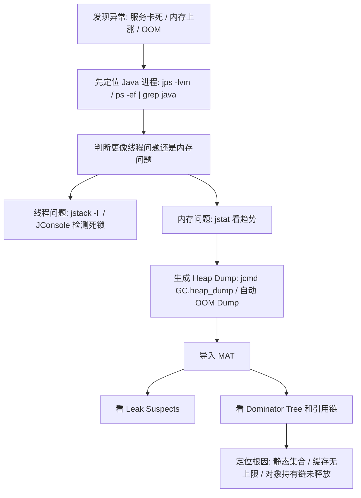

# JVM - 第 11 课：线上故障实战：死锁检测、HeapDump 与 OutOfMemoryError 排查

## 学习目标（本节结束后你能做到什么）

- 知道线上服务器上如何快速定位 Java 进程，并确认它的参数和身份。
- 理解死锁应该怎么查，为什么 `jstack` 和 `JConsole` 都有价值。
- 说清 Heap Dump 文件到底是什么，为什么它是 OOM 排查最重要的现场证据。
- 理解从生成 Heap Dump 到使用 MAT 分析 OOM 的完整链路。
- 能把工具、参数、样例代码和分析结论串成一套完整的排障思路。

## 内容讲解（核心概念，用类比、例子、图示说清楚）

### 1. 线上排障的第一步：先确认“我在看谁”

很多线上排障失败，不是因为不会分析，而是从一开始就看错了进程。

一台服务器上可能同时跑着：

- 业务服务 A
- 业务服务 B
- 定时任务进程
- 管理后台
- 测试实例

这时候第一步永远是先识别 Java 进程。

最常用的命令：

```bash
jps
jps -l
jps -v
jps -m
```

你可以这样理解：

- `jps`：先看到底有哪些 JVM
- `jps -l`：看主类全名或 Jar 路径，确认进程身份
- `jps -v`：看 JVM 参数，例如堆大小、GC 类型
- `jps -m`：看业务启动参数

如果环境里没有 `jps`，或者权限不够，那就回到操作系统命令：

```bash
ps -ef | grep java
```

这一步的目标不是“列个进程出来”，而是回答三个问题：

1. 哪个进程才是我要排查的目标
2. 它用的 JVM 参数是什么
3. 它是不是和我想象中那套配置一致

### 2. 死锁怎么查：先抓线程现场

死锁本质上是：

- 线程 A 等线程 B 手里的锁
- 线程 B 又等线程 A 手里的锁

于是大家都不往前走，系统就会出现：

- 请求卡死
- 某些线程长时间不返回
- CPU 未必高，但系统就是“像死了一样”

#### 2.1 用 `jstack` 看死锁

最经典的死锁排查命令：

```bash
jstack -l <pid>
```

如果真的存在 Java 级别死锁，输出里经常会直接看到：

```text
Found one Java-level deadlock:
```

后面通常还会跟着：

- 涉及死锁的线程名
- 每个线程当前持有的锁
- 每个线程正在等待的锁
- 对应的代码栈帧

这就是为什么 `jstack` 特别适合做死锁第一诊断。  
它不像图形化工具那么直观，但它给的是最原始、最权威的线程现场。

#### 2.2 用 `JConsole` / `VisualVM` 图形化看死锁

如果你本地或测试环境方便开图形界面，也可以直接用 `JConsole` 或 `VisualVM`。

它们的价值在于：

- 线程列表直观
- 可以看到 `BLOCKED` 状态
- 可以直接触发死锁检测
- 可以把线程和堆、类加载等趋势结合起来看

对于 Mac 用户，如果需要找到 JDK 路径，可以先看：

```bash
/usr/libexec/java_home -V
```

确认路径后，可以直接运行对应 JDK 里的 `jconsole`。  
进入工具后，连接目标进程，切到线程面板，通常就能看到死锁检测结果。

所以死锁排查你可以这样记：

- 命令行下：`jstack` 更直接
- 图形化下：`JConsole` / `VisualVM` 更直观

### 3. Heap Dump 到底是什么

Heap Dump，也就是堆转储文件，可以理解成：

**Java 进程在某一个时刻的“内存 X 光片”。**

它不是普通日志，而是一份二进制快照文件，通常是 `.hprof` 格式。

里面会记录很多关键信息，例如：

- 堆里有哪些对象
- 每种对象有多少实例
- 每个对象占了多少空间
- 对象和对象之间怎么互相引用
- 哪些对象链条被 GC Roots 持有
- 和 GC Roots 相关的线程栈信息

你可以把它想成：

- 日志告诉你“病人有问题”
- Heap Dump 告诉你“问题具体卡在身体哪个位置”

所以排查内存问题时，Heap Dump 的地位非常高。  
如果没有 Heap Dump，很多内存泄漏只能停留在猜测。

### 4. Heap Dump 怎么生成

#### 4.1 自动生成：最推荐的生产方案

最推荐的方式，是在 JVM 启动时就加上：

```bash
-XX:+HeapDumpOnOutOfMemoryError
-XX:HeapDumpPath=/path/to/heapdump.hprof
```

这样一旦发生 `OutOfMemoryError`，JVM 会自动把现场留下来。

这比“出问题后再想办法抓现场”可靠得多，因为很多 OOM 一旦发生：

- 进程可能很快退出
- 现场可能已经不完整
- 你没法稳定复现

#### 4.2 手动生成：应用还没挂，但你已经怀疑内存异常

如果服务虽然还活着，但你已经看到：

- 内存持续上涨
- GC 越来越频繁
- 老年代不回落

这时候可以手动生成快照。

例如：

```bash
jmap -dump:format=b,file=heapdump.hprof <pid>
jcmd <pid> GC.heap_dump heapdump.hprof
```

如果你在线上用的是 Arthas，也可以用它来生成。

从工程实践上说，`jcmd` 往往比老式命令更推荐，因为它更现代、更统一。

### 5. 一个最常见的 OOM 示例：静态集合导致对象无法回收

下面是一段非常典型的“人为制造堆内存泄漏”的示例代码：

```java
import java.util.ArrayList;
import java.util.List;

public class SimpleLeak {

    // 静态集合的生命周期通常和类一样长
    public static List<byte[]> staticList = new ArrayList<>();

    public void leakMethod() {
        // 每次往静态集合里放 1MB 数据
        staticList.add(new byte[1024 * 1024]);
    }

    public static void main(String[] args) throws InterruptedException {
        SimpleLeak leak = new SimpleLeak();
        System.out.println("Starting leak simulation...");

        for (int i = 0; i < 200; i++) {
            leak.leakMethod();
            System.out.println("Added " + (i + 1) + " MB to the list.");
            Thread.sleep(200);
        }

        System.out.println("Leak simulation finished. Keeping process alive for Heap Dump.");
        Thread.sleep(Long.MAX_VALUE);
    }
}
```

如果配上这样的参数去跑：

```bash
-Xmx128m
-XX:+HeapDumpOnOutOfMemoryError
-XX:HeapDumpPath=simple_leak.hprof
```

那么它很容易出现：

- 堆空间不够
- 抛出 `java.lang.OutOfMemoryError: Java heap space`
- 自动生成 `simple_leak.hprof`

这个例子为什么好？

因为它把 OOM 的根因讲得很清楚：

- 问题不在 GC 不努力
- 问题在对象一直被静态集合持有
- 只要引用链不断，GC 就没法回收

这就是你以后分析真实内存泄漏时最重要的思路：

**不是看“对象多不多”，而是看“谁一直把它们抓着不放”。**

### 6. 用 MAT 怎么看 Heap Dump

Heap Dump 文件有了之后，最常见的下一步就是导入 `MAT`。

`MAT` 最常用的两个入口是：

#### Leak Suspects Report

这是一个非常适合第一轮分析的报告。  
它会基于启发式算法，尽量帮你自动指出：

- 哪个对象嫌疑最大
- 哪条引用链最可疑
- 哪个类或者哪个集合在“持有并卡住”大量内存

在上面的 `SimpleLeak` 例子里，这个报告通常会把问题直接指向：

- `cn.javaguide.SimpleLeak`
- `java.util.ArrayList`
- `java.lang.Object[]`
- 以及一大串 `byte[]`

#### Dominator Tree（支配树）

这是更核心也更专业的视角。

支配树的核心思想是：

**如果父节点不被释放，下面那一整片对象都不可能被释放。**

所以它特别适合回答：

- 哪个对象真正“支配”了最多内存
- 哪个引用链是问题根源
- 哪部分 retained heap 最大

在 `SimpleLeak` 这个例子里，你通常会看到：

- `SimpleLeak` 类对象
- 指向静态字段 `staticList`
- `staticList` 指向 `ArrayList`
- `ArrayList` 内部 `Object[]`
- `Object[]` 里挂着很多 `byte[1048576]`

这条链就把根因讲明白了：

**静态变量 `staticList` 是泄漏根源，因为它的生命周期和类一致，导致里面的对象一直无法被 GC。**

### 7. OOM 排查不是“看谁大”，而是“看谁活着不该活”

很多人第一次看 Heap Dump 时，会犯一个很典型的错误：

- 只盯着哪个对象大

但真实排查时，更关键的是：

- 这个对象为什么还活着
- 是谁在引用它
- 这条引用链是不是符合业务预期

举个例子：

- 缓存对象大，不一定是泄漏，可能只是业务设计如此
- 大量请求对象大，也不一定是泄漏，可能只是流量突然上来
- 但一个静态集合持续增长、永不清理，那就很可疑

所以分析 Heap Dump 时，要同时看：

- Shallow Heap：对象自己占多少
- Retained Heap：对象“带着一串引用链”一共卡住多少

真正能帮你定位根因的，往往是 Retained Heap 和引用路径，而不是单个对象自己的大小。

### 8. 一条完整的 OOM / 死锁排障链路

把前面这些工具和动作串起来，线上排障可以先按下面这条链路走：



你会发现，这已经不是单个命令的问题了，而是一整套工程动作：

- 先识别进程
- 再抓线程或内存现场
- 再进入 Heap Dump 深挖
- 最后回到代码和业务逻辑修复

## 小结（3-5 条关键点）

- 线上排障第一步永远是先识别正确的 Java 进程，确认它的身份和参数。
- 死锁排查最经典的证据来自 `jstack`，图形化工具如 `JConsole` 和 `VisualVM` 则更适合直观查看线程状态。
- Heap Dump 是 JVM 在某一时刻的内存快照，是排查 OOM 和内存泄漏最重要的现场证据。
- `-XX:+HeapDumpOnOutOfMemoryError` 和 `-XX:HeapDumpPath` 是非常值得默认配置的线上保命参数。
- MAT 分析 Heap Dump 时，要重点看引用链、Retained Heap 和 Dominator Tree，而不是只看哪个对象表面上最大。

## 问题（检测你对当前章节内容是否了解）

1. 如果线上服务出现“卡住不返回”，你会先走线程排查还是内存排查？你准备先抓什么？
2. 为什么说 Heap Dump 更像“内存 X 光片”，而不是普通日志？
3. 在 `SimpleLeak` 这个例子里，真正的泄漏根因为什么不是 `byte[]` 本身，而是 `staticList`？
4. 如果你拿到一个 OOM 的 `.hprof` 文件，导入 MAT 后，你会优先看哪两个视角？为什么？
