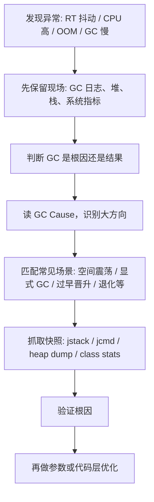

# JVM - 第 12 课：CMS GC 问题分析总览：评价指标、GC Cause 与处理 SOP

## 学习目标（本节结束后你能做到什么）

- 理解为什么在今天仍然值得系统学习 `CMS + ParNew` 的问题分析方法。
- 建立一张 CMS 问题排查总图，而不是看到 GC 日志就凭感觉猜原因。
- 说清延迟、吞吐量为什么是判断 GC 是否有问题的两个核心指标。
- 读懂常见的 `GC Cause`，知道 `System.gc()`、`Allocation Failure`、`Concurrent Mode Failure`、`GCLocker Initiated GC` 大致在说什么。
- 建立一套通用排障 SOP：保留现场、判断因果、匹配场景、验证根因、再做优化。

## 内容讲解（核心概念，用类比、例子、图示说清楚）

### 1. 为什么现在还要学 CMS

虽然从趋势上看：

- `CMS` 已经是历史收集器
- JDK 9 开始标记弃用
- JDK 14 被移除

但很多真实生产环境，尤其是：

- 长期运行在 Java 8 的老系统
- 多年演进的交易、网关、RPC、中台服务
- 对升级 JDK 和切换 G1 / ZGC 非常谨慎的系统

依然会长期背着 `ParNew + CMS` 继续跑。

所以学习 CMS 的价值不只是“了解一个旧收集器”，而是学习一套非常经典的 GC 问题分析思路：

- 看分代
- 看晋升
- 看碎片
- 看并发标记与 STW 阶段
- 看是 GC 引起业务异常，还是业务问题把 GC 拖坏了

这套方法论放到 G1、ZGC 时代依然有迁移价值。

### 2. 先建立 CMS 的最小知识底座

在进入问题之前，先抓住几个最常见的基础名词。

#### Mutator

`Mutator` 就是你的业务线程。  
它的职责很简单：

- 创建对象
- 修改对象引用
- 顺手制造垃圾

GC 的很多设计，本质上都在回答一个问题：

**怎样在不把 Mutator 干死的情况下，把它制造出来的垃圾收走。**

#### TLAB

`TLAB` 是线程本地分配缓冲区。

它的价值在于：

- 每个线程先在 Eden 里拿一小块私有空间
- 分配对象时优先在这块空间里做指针碰撞
- 减少多线程并发分配时的锁竞争

所以对象分配快不快，不只是 GC 算法的事，也和分配路径有关。

#### Card Table

`Card Table` 可以理解成一张“脏页索引表”。

它主要用来解决：

- 老年代对象引用了新生代对象
- 回收新生代时，如何快速知道哪些老年代区域需要扫描

所以它的本质不是为了“记录所有引用”，而是为了避免每次 Young GC 都全表扫老年代。

### 3. CMS 世界里的内存地图

在 Java 8 时代的经典 CMS 场景里，最值得关注的区域通常是：

- Heap
- MetaSpace
- Direct Memory

其中：

- Heap 主要承载普通 Java 对象
- MetaSpace 主要存类元数据
- Direct Memory 主要是 NIO、Netty 这类堆外内存使用场景

所以线上看到 OOM 时，先别急着说“堆满了”。  
你得先判断到底是：

- `Java heap space`
- `Metaspace`
- `Direct buffer memory`

不同区域，分析路径完全不一样。

### 4. 怎么判断 GC 到底有没有问题

很多人看到 GC 日志里数字很大就慌，但 GC 从来不是“发生了就有问题”。  
判断 GC 是否异常，至少要看两个核心指标。

#### 延迟（Latency）

你可以把它理解成：

**一次 Stop-The-World 最长会把业务停多久。**

这对实时服务极其重要。  
如果你的服务 TP9999 是 80ms，而单次 GC 停了 600ms，那么哪怕 GC 次数不多，用户体验也会很差。

#### 吞吐量（Throughput）

吞吐量关注的是：

**应用真正干业务的时间占总运行时间的比例。**

例如：

- 系统运行 100 分钟
- GC 总共消耗 1 分钟

那么吞吐量大致是 99%。

对很多在线系统来说，不能只看“单次停多久”，还要看“GC 总体吃掉了多少运行时间”。

### 5. 如何把指标放回业务语境

一个很实用的判断方式是：

- 单次停顿最好不要超过业务 TP9999
- GC 总吞吐量尽量稳定在你能接受的范围，例如 99.99% 级别

这不是机械标准，而是一种工程思路：

- 你的业务最怕什么
- 你的 GC 表现是不是已经踩过那条线

换句话说，GC 调优不能脱离 SLA。  
离开业务延迟目标谈 GC，好坏往往没有意义。

### 6. 先读懂 GC Cause，再谈问题分析

GC 日志里最值得先看的字段之一就是 `GC Cause`。  
它回答的是：

**JVM 为什么决定在这个时间点发起这次 GC。**

你可以重点关注这些高频 Cause：

#### `System.gc()`

表示显式调用触发。  
这通常说明：

- 代码里有人手动调用了
- 某些组件内部主动调用了

它不是“自然负载”触发的 GC。

#### `Allocation Failure`

表示分配失败，最常见。  
一般意味着：

- 某块区域不够分配对象了
- 所以必须触发回收来腾空间

它是很多 Young GC 的直接起点。

#### `CMS Initial Mark` / `CMS Final Remark`

表示 CMS 周期里的两个关键 STW 阶段。  
如果这两个阶段特别慢，问题方向就很可能在：

- Root 扫描
- Reference 处理
- 类卸载
- 元数据清理

#### `Concurrent Mode Failure`

这通常是 CMS 非常危险的信号。  
意思大致是：

- CMS 并发回收还没赶上对象晋升和分配速度
- Old 区空间已经顶不住了
- 收集器开始退化

这类问题一旦出现，停顿往往会明显恶化。

#### `GCLocker Initiated GC`

这通常和 JNI 临界区有关。  
意思大致是：

- 某些 Native 调用阶段 JVM 不能安全做 GC
- 于是延迟到临界区结束后再触发回收

这类问题往往不高频，但一旦出现就很偏门，也更难排查。

### 7. 先判断是不是 GC 造成的，而不是一上来就怪 GC

现实里经常会碰到这样的现象一起出现：

- RT 抖动
- GC 变慢
- CPU 变高
- 慢查询增多
- 线程 Block 增多

这时最关键的问题不是“GC 看起来好像有问题”，而是：

**GC 是根因，还是被别的问题带崩后的结果。**

这里有四种很实用的判断思路：

#### 时序分析

看谁先异常。  
如果 CPU 先飙，再出现慢 SQL，再出现 GC 耗时变大，那 GC 很可能只是结果。

#### 概率分析

结合历史经验。  
如果你们系统过去大多数事故都是慢查询引起的，那本次也要先怀疑数据库链路。

#### 实验分析

通过压测、演练或局部复现去验证。  
例如单独制造线程阻塞，看会不会引出同样链路。

#### 反证分析

看有没有“不符合这个因果链”的样本。  
如果某些节点没有慢 SQL、没有 CPU 尖刺，却依然出现相同的 GC 故障，那根因更可能在 GC 本身。

### 8. CMS 常见问题最好按场景分类来学

如果不分类，CMS 问题会显得特别杂。  
更好的方式是把它们分成几类：

- 意外发生的 GC：明明不该回收，却回收了
- 部分收集问题：Young GC、CMS Old GC 的频率或耗时出问题
- Full GC / 退化问题：一旦发生就影响很大
- 非 Heap 问题：MetaSpace、Direct Memory、JNI 引发的问题

把这些再进一步细化，就能落到九类高频场景：

1. 空间震荡
2. 显式 GC
3. MetaSpace OOM
4. 过早晋升
5. CMS Old GC 频繁
6. 单次 CMS 停顿过长
7. 内存碎片与收集器退化
8. 堆外内存 OOM
9. JNI 触发的 GC 问题

后面几课，我们就按这个顺序展开。

### 9. 一套通用的 GC 问题处理 SOP

当你怀疑 CMS 有问题时，可以先按下面这条链路走：

这里最容易被忽略的一步是：

**先保留现场。**

很多线上问题一出，第一反应就是：

- 重启
- 扩容
- 回滚

这对恢复服务当然重要，但如果条件允许，最好先摘流量、保留现场。  
否则根因一旦消失，后面就只能猜。

## 小结（3-5 条关键点）

- CMS 虽然是历史收集器，但它背后的 GC 问题分析方法仍然很有工程价值。
- 判断 GC 是否有问题，至少要同时看单次停顿和总体吞吐量，而且必须结合业务 SLA。
- `GC Cause` 是排障入口之一，能帮你快速判断 GC 为什么被触发。
- 线上问题不能一上来就怪 GC，必须先判断 GC 是根因还是被别的问题拖坏的结果。
- 高质量的 GC 排障应该沿着“保留现场 -> 判断因果 -> 匹配场景 -> 验证根因 -> 再优化”的 SOP 来走。

## 问题（检测你对当前章节内容是否了解）

1. 为什么今天学习 CMS 不只是为了维护旧系统，而是为了学习一套更通用的 GC 问题分析方法？
2. 延迟和吞吐量为什么必须结合业务 TP9999 一起看，不能脱离 SLA 机械判断？
3. 如果你在 GC 日志里看到 `System.gc()`、`Concurrent Mode Failure`、`GCLocker Initiated GC`，你分别会先往哪个方向怀疑？
4. 如果 RT、CPU、慢 SQL、GC 耗时都在同一时间段异常，你会怎么判断 GC 是根因还是结果？
