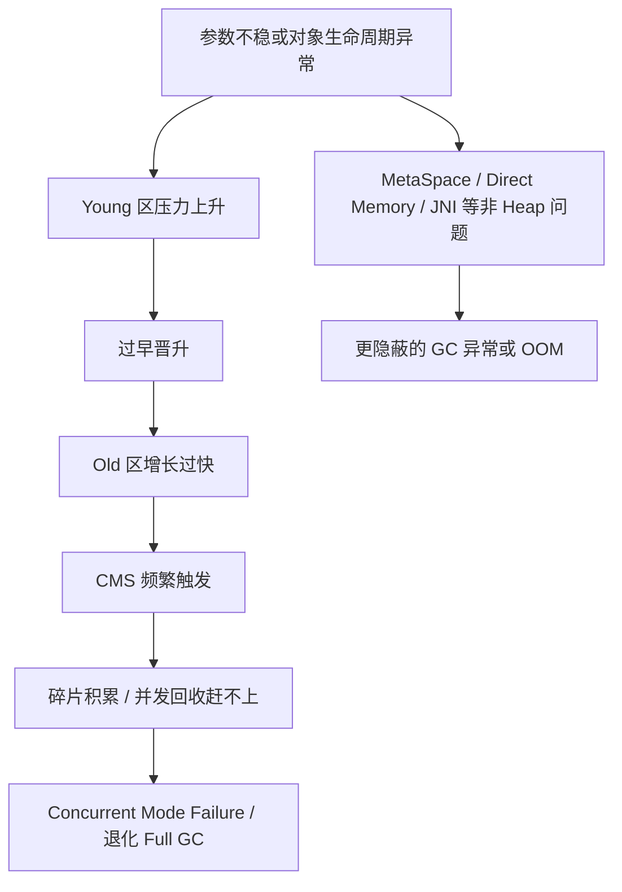

# JVM - 第 15 课：CMS 常见问题（下）：收集器退化、堆外内存 OOM 与 JNI 问题

## 学习目标（本节结束后你能做到什么）

- 理解 CMS 为什么会发生收集器退化，以及为什么这类问题一旦发生就往往影响很大。
- 分清内存碎片、晋升失败、并发模式失败之间的关系。
- 说清堆外内存 OOM 为什么经常表现为 `RES` 超过 `-Xmx`，以及它和普通堆 OOM 的区别。
- 理解 JNI 临界区为什么会导致 `GCLocker Initiated GC`，以及它为什么属于偏门但危险的问题。
- 能把 CMS 收尾阶段的问题和整个 CMS 专题串成一条完整的实战链路。

## 内容讲解（核心概念，用类比、例子、图示说清楚）

### 1. 场景七：内存碎片与收集器退化

#### 1.1 现象长什么样

这类问题通常是 CMS 最让人头疼的场景之一。  
你在日志里可能会看到：

- `Promotion Failed`
- `Concurrent Mode Failure`
- 非常长的 STW
- 本来并发回收的 CMS，突然退化成非常重的前台串行 Full GC

这意味着什么？

意味着 CMS 原本想走的“低停顿路线”没走通，被迫走了代价更大的保底方案。

#### 1.2 为什么碎片会成为问题

CMS 的核心算法是标记清除。  
它的好处是：

- 并发性强
- 停顿相对短

但代价是：

- 不整理对象
- 容易留下很多不连续的小空洞

所以 Old 区可能出现一种情况：

- 总剩余空间看起来够
- 但连续大块空间不够

这时候大对象或者一批晋升对象就可能放不下，于是出现：

- `Promotion Failed`

这也是为什么“有空间”和“能分配”不是一回事。

#### 1.3 为什么会退化

CMS 退化常见有几类原因：

#### 晋升失败

Young GC 后对象要晋升到 Old，但 Old 找不到足够连续空间。

#### 并发模式失败（Concurrent Mode Failure）

CMS 并发回收还没结束，Old 区的新对象分配和晋升已经把预留空间吃光了。  
这本质上是：

- 回收速度没赶上对象进入 Old 的速度

#### 显式 GC

如果有人手动 `System.gc()`，也可能直接把系统带进重型回收路径。

#### 1.4 这类问题怎么处理

这类问题要同时从三个方向下手：

#### 减少碎片

可以考虑：

- `-XX:+UseCMSCompactAtFullCollection`
- `-XX:CMSFullGCsBeforeCompaction`

核心思路是：

- 不要让碎片长期积累到不可收拾

#### 提前触发 CMS

如果 CMS 总是启动太晚，那就可以考虑：

- 降低 `CMSInitiatingOccupancyFraction`
- 并配合 `UseCMSInitiatingOccupancyOnly`

核心目标是：

- 让 CMS 更早启动
- 给并发回收留出更充足时间

#### 降低晋升压力和浮动垃圾冲击

例如：

- 重新审视 Young / Old 比例
- 必要时考虑 `CMSScavengeBeforeRemark`
- 避免短命大对象和过早晋升问题继续放大

所以这类问题不是单一参数能解决的，它通常是：

- 分代比例
- CMS 启动时机
- 碎片积累
- 晋升压力

几件事叠在一起的结果。

### 2. 场景八：堆外内存 OOM

#### 2.1 现象长什么样

堆外内存问题特别迷惑人的地方在于：

- 你看 JVM 堆，好像还没爆
- 但机器内存已经很高
- `top` 里 Java 进程的 `RES` 甚至超过了 `-Xmx`
- 还可能开始用到 `SWAP`

这时候大概率不是单纯的 Java Heap 问题，而是：

**堆外内存泄漏或堆外内存失控。**

#### 2.2 常见根因有哪些

最常见的两大类根因是：

#### 主动申请堆外内存但释放不及时

例如：

- `Unsafe.allocateMemory`
- `ByteBuffer.allocateDirect`
- NIO / Netty 相关组件

#### JNI / Native Code 申请内存未释放

这类问题更偏底层，也更难排查，因为内存不一定经过 JVM 的常规堆管理路径。

#### 2.3 怎么判断是哪一类

这时非常有价值的工具是：

```bash
-XX:NativeMemoryTracking=detail
jcmd <pid> VM.native_memory detail
```

它能帮助你判断：

- JVM 视角下记录到的 Native Memory
- 和系统实际 `RES` 差距有多大

一个很实用的判断思路是：

- 如果 `jcmd` 里看到的 committed 和系统 `RES` 差距不大，往往更像 JVM 已知路径申请的堆外内存
- 如果差距非常大，就要更怀疑 JNI / 外部 Native 代码

#### 2.4 怎么继续查

如果更像是 `DirectByteBuffer` / Netty 这类问题，可以继续：

- 检查代码里 direct buffer 的使用和释放
- 关注相关计数器
- 检查是否错误使用了 `DisableExplicitGC`

如果更像 JNI / Native 代码问题，就可能要用更底层的工具：

- NMT
- 系统级 profiler
- BTrace
- gperftools 一类方案

这类问题的难点在于：

- 现场往往不在 Java 堆里
- 你不能只靠 Heap Dump 解决

#### 2.5 这类问题的工程启示

当你看到：

- 内存使用率狂涨
- 堆却不高
- GC 时间也开始被拖慢

一定要第一时间想到：

- 不一定是堆
- 很可能是堆外

这是线上排障非常关键的分流点。

### 3. 场景九：JNI 引发的 GC 问题

#### 3.1 现象长什么样

这类问题在 GC 日志里通常有一个非常鲜明的特征：

```text
GCLocker Initiated GC
```

一旦看到这行字，你就应该立刻想到：

- JNI 临界区
- `GetPrimitiveArrayCritical` 一类调用

#### 3.2 为什么 JNI 会影响 GC

JNI 的某些高性能访问方式，会让 Native 代码直接拿到 JVM 堆中数组或字符串的关键引用。

问题就在于：

- 如果这时 JVM 随便移动对象
- Native 侧手里的指针就可能失效

所以 JVM 会采取一种保守策略：

- 在某些 JNI 临界区期间，限制 GC 发生
- 等最后一个线程退出临界区，再补做一次 GC

这就是 `GCLocker` 的核心背景。

#### 3.3 它会带来什么坏处

这类问题之所以麻烦，是因为它会带来一些非常不直观的副作用：

- Young 区本来该回收，但因为锁住了，GC 不能按时做
- 对象可能被迫更早进入 Old
- 线程可能因为等锁释放而阻塞
- 在某些 JDK 版本和场景下，甚至可能诱发额外重复 GC

所以 JNI 问题不只是“Native 代码难看”，它是真的会把 GC 行为扭曲。

#### 3.4 怎么查

可以优先做这几件事：

- 打开 JNI 相关 GC stall 日志
- 关注触发时的线程信息
- 结合业务代码确认是否用了 JNI critical 区访问

如果你确认问题方向在 JNI，那就要非常谨慎，因为这类问题的处理通常已经超出了普通 Java 调优范畴。

#### 3.5 怎么处理

常见处理思路包括：

- 找到并缩短 JNI critical 区
- 评估是否真的有必要这么用 JNI
- 升级到更好的 JDK 版本，规避已知问题

这类问题的核心原则非常明确：

**JNI 不是不能用，但一定要把它当成“高风险能力”来使用。**

### 4. 把 CMS 九大场景串起来

学到这里，你应该能看到 CMS 问题其实不是九个孤岛，而是一条链：



也就是说，很多严重事故在早期都会有小信号：

- 曲线不平滑
- 晋升率异常
- CMS 频率异常
- Remark 时间异常
- MetaSpace 或 Direct Memory 走势不正常

如果早一点看到这些信号，很多大故障其实可以提前压住。

### 5. CMS 专题最重要的收尾结论

学 CMS 最后要真正记住的，不是 20 个参数，而是这几个判断：

#### 第一，GC 优化首先是诊断问题，不是改参数竞赛

很多问题最后根因都在：

- 代码引用链
- 缓存策略
- 对象生命周期
- JNI / Native 使用方式

不是单纯收集器参数。

#### 第二，参数调整要控制变量

每次尽量只改一个方向：

- 先改分代比例
- 再观察
- 再改 CMS 启动阈值
- 再观察

否则你很容易不知道到底是哪一步起了作用。

#### 第三，防火永远优于救火

真正高质量的 JVM 运维，不是等出 `Concurrent Mode Failure` 再救，而是：

- 看到年轻代不对劲就开始查
- 看到 Old 曲线异常就开始查
- 看到 MetaSpace、Direct Memory 异常就开始查

任何“不平滑的曲线”，都值得怀疑。

## 小结（3-5 条关键点）

- CMS 退化通常和碎片、晋升失败、并发模式失败等因素有关，一旦发生影响往往明显放大。
- 堆外内存 OOM 的典型信号是进程实际内存远超 `-Xmx`，这类问题不能只靠 Heap Dump 分析。
- `NativeMemoryTracking + jcmd VM.native_memory` 是区分 JVM 侧堆外内存和更底层 Native 泄漏的重要起点。
- `GCLocker Initiated GC` 往往和 JNI 临界区有关，属于偏门但危险的 GC 问题。
- CMS 专题真正要沉淀下来的，不是参数表，而是“从曲线异常一路追到机制根因”的诊断能力。

## 问题（检测你对当前章节内容是否了解）

1. 为什么 CMS 会出现“总空闲够，但对象还是放不下”的情况？这和碎片有什么关系？
2. 如果你看到 `Concurrent Mode Failure`，你会优先从哪几个方向怀疑是回收赶不上分配？
3. 为什么说堆外内存 OOM 和 Java Heap OOM 的排查路径从一开始就不一样？
4. 日志里出现 `GCLocker Initiated GC` 时，你为什么应该立刻想到 JNI 临界区，而不是先去调普通 GC 参数？
