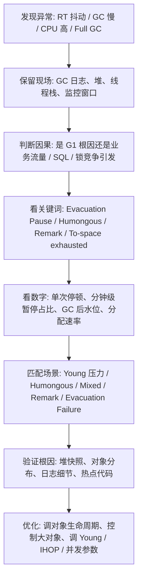

# JVM - 第 16 课：G1 GC 问题分析总览：评价指标、GC Cause 与处理 SOP

## 学习目标（本节结束后你能做到什么）

- 理解为什么在今天学习 G1 问题分析非常有价值，因为它已经是很多服务端应用的默认选择。
- 建立一张 G1 问题排查总图，而不是看到 `Evacuation Pause`、`Mixed GC`、`Humongous` 就开始凭感觉猜。
- 说清判断 G1 有没有问题时，为什么要同时看停顿、吞吐、对象分配速率和 GC 后水位。
- 读懂几个最关键的 G1 触发原因和日志关键词，知道它们大概在说什么。
- 建立一套适合 G1 的通用排障 SOP：保留现场、判断因果、匹配场景、验证根因、再做优化。

## 内容讲解（核心概念，用类比、例子、图示说清楚）

### 1. 为什么现在特别值得学 G1 问题分析

和 CMS 不一样，G1 不是历史遗留课题，而是很多 JVM 版本里的主流路线。

这意味着：

- 你线上很大概率会直接碰到 G1
- 很多服务不一定调过特别多参数，但默认就是 G1
- 你看到的 GC 日志、停顿抖动、Full GC、Humongous 对象问题，很多都发生在 G1 上

所以学习 G1 的价值不仅是“懂一个回收器原理”，更是：

**能在今天的大多数 Java 服务里快速判断 GC 到底有没有出问题。**

### 2. 先建立 G1 的最小问题分析底座

#### Region

G1 把整个堆切成很多大小相同的 `Region`，不同 Region 在不同时间可以扮演：

- Eden
- Survivor
- Old
- Humongous

所以 G1 的很多问题，都不能再用“整块年轻代 / 整块老年代”的思路去想，而要看：

- 哪些 Region 被谁占了
- 哪些 Region 能不能进入回收集合

#### RSet 和 Card Table

G1 为了避免回收某批 Region 时去全堆乱扫，需要维护跨 Region 引用信息。

这就是：

- `Card Table`
- `RSet`

所以 G1 的很多停顿问题，不只是“对象太多”，也可能是：

- RSet 维护压力过大
- 脏卡片处理不过来
- 结果把暂停时间或 CPU 一起拖高

#### SATB

G1 的并发标记依赖 `SATB`。

你可以把它理解成：

- 尽量以“标记开始那一刻的对象图快照”为准
- 允许有浮动垃圾
- 但要避免并发标记漏标

所以当你分析 G1 的并发标记和 Remark 时，一定要记住：

- 它不是简单“扫一遍堆”
- 它是带着快照一致性问题在工作

#### Collection Set

G1 的核心不是“收整个老年代”，而是：

- 挑一批最值得收的 Region 组成 `Collection Set`

所以 G1 问题分析时，常见关键问题会变成：

- 这轮 CSet 为什么太大
- Mixed GC 为什么一直收不完
- 回收收益是不是已经很差了

#### Humongous Object

特别大的对象会走 `Humongous Region` 路线。

这类对象在 G1 中非常敏感，因为它们容易：

- 吃掉连续 Region
- 增加老年代压力
- 触发额外并发标记甚至 Full GC

### 3. 判断 G1 有没有问题，先看哪些数字

G1 排障时，最容易犯的错误是：

- 一看到日志里有 `Pause Young`
- 就直接说 G1 有问题

其实 G1 本来就应该频繁做 Young GC。  
真正有意义的是同时看这几条线：

#### 单次停顿

先看：

- `Pause Young`
- `Pause Remark`
- `Pause Cleanup`
- `Mixed GC`
- `Full GC`

单次时间是否已经接近或打穿业务 TP99 / TP999。

#### 分钟级暂停占比

例如：

- 1 分钟内 G1 总 STW 暂停是否超过 `3%`
- 是否已经超过 `5%`

这决定了吞吐是不是已经明显被拖下来了。

#### GC 后水位

重点看：

- Mixed GC 后 Old 区是否仍然很高
- 每次并发标记后可回收空间是不是越来越少

这比单纯看峰值更重要，因为它更接近真实活对象规模。

#### 对象分配速率

如果 Young Region 非常快就打满，说明问题可能在：

- 对象分配太快
- 请求风暴
- 序列化 / 反序列化 / DTO 转换过重

而不是 G1 自己“天生不好”。

### 4. 先读懂几个最常见的 G1 关键词

#### `G1 Evacuation Pause`

这是 G1 最常见的暂停类型。

它通常意味着：

- 正在做 Young GC
- 或 Young + 部分 Old 的 Mixed GC
- 本质上是在做对象转移（Evacuation）

看到它，不代表出问题。  
要看的是：

- 来得是不是太频繁
- 单次是不是太长

#### `G1 Humongous Allocation`

这通常说明：

- 大对象分配正在给 G1 带来压力

你应该立刻想到：

- 是否有超大数组、超长字符串、序列化缓冲区、附件字节数组

#### `To-space exhausted`

这是非常危险的信号。

它大致说明：

- 本轮 Evacuation 想把活对象搬走
- 但目标空间不够用了

这意味着 G1 的正常复制转移路径开始顶不住了。

#### `Evacuation Failure`

这比普通 Young GC 慢更严重。

它说明：

- 一部分对象本来应该被搬走
- 但因为目标空间不足或相关约束，没法顺利完成

后续往往会引发：

- 更长停顿
- 老年代压力放大
- 甚至 Full GC

#### `Pause Remark`

这是并发标记周期里的关键 STW 收尾阶段。

如果它很长，常见方向包括：

- 引用处理
- SATB 队列收尾
- RSet / 卡表相关压力
- 类卸载或元数据处理

### 5. 先判断是不是 G1 引发的问题

这一步和 CMS 时代一样重要。

线上常见现象依然可能一起出现：

- RT 抖动
- CPU 高
- GC 变慢
- 慢查询增多
- 线程积压

所以一定先做因果判断：

#### 时序分析

谁先异常？

如果是：

- CPU 先飙
- 然后对象分配速率上来
- 再看到 Young GC 变密

那 G1 很可能只是结果。

#### 概率分析

结合历史经验判断问题更像哪类。

例如某系统过去高频问题是：

- 大对象序列化
- 批量查询把数据全打到内存

那这次 `Humongous Allocation` 的概率就很高。

#### 实验分析

通过压测或回放流量验证：

- 是不是只要对象分配速率一拉高，Young GC 就明显恶化
- 是不是一出现大对象请求，Humongous Region 就上升

#### 反证分析

如果有些节点：

- 没有慢 SQL
- 没有 CPU 尖刺
- 但依然出现相同 G1 停顿问题

那根因更可能就在 G1 的回收路径或对象生命周期结构上。

### 6. G1 常见问题最好按场景分类来学

如果不分类，G1 问题会看起来特别碎。

更好的方式是分成下面几类：

- 年轻代压力问题：Young GC 太频繁、Young 停顿过长
- 大对象问题：Humongous Allocation、Humongous Region 占用过高
- Mixed GC 问题：回收频繁、回收收益低、老年代长期下不来
- 并发标记收尾问题：Remark 过长
- 维护开销问题：RSet / Dirty Card / Refinement 压力大
- 复制转移失败问题：To-space exhausted、Evacuation Failure
- 兜底问题：Full GC

这批问题里，最值得优先掌握的通常是：

1. Young GC 频繁
2. Humongous 对象压力
3. Mixed GC 频繁
4. Remark 停顿长
5. Evacuation Failure / To-space exhausted

### 7. 一套适合 G1 的排障 SOP

可以先按这条线来：

这里最关键的是：

- 先分清是哪类 G1 问题
- 再决定是看日志、看堆，还是回到业务代码

### 8. 这组 G1 专题会怎么展开

后面三课我会按下面这个顺序拆开：

#### 上篇

- Young GC 频繁
- Humongous Allocation
- Young 区与分配压力问题

#### 中篇

- Mixed GC 频繁
- Remark 停顿过长
- RSet / Refinement 压力

#### 下篇

- To-space exhausted
- Evacuation Failure
- Full GC 与并发标记启动过晚

这样拆的好处是：

- 先把最常见的对象分配和大对象问题讲清
- 再讲更复杂的回收收益和收尾阶段
- 最后再讲最危险的失败和退化场景

## 小结

- G1 问题分析的核心，不是“它是默认 GC 所以肯定没问题”，而是要把 Young、Humongous、Mixed、Remark、Evacuation Failure 这些路径分开看。
- 判断 G1 有没有问题时，至少要同时看单次停顿、分钟级暂停占比、GC 后水位和对象分配速率。
- `G1 Evacuation Pause` 本身不等于故障，`Humongous Allocation`、`To-space exhausted`、`Evacuation Failure` 才是更值得重点盯的危险信号。
- G1 排障一定先做因果判断，避免把 SQL、流量风暴、对象分配风暴误判成“纯 GC 缺陷”。
- 真正高质量的 G1 排障，是先匹配具体场景，再去调参数或改业务代码，而不是一上来就改 JVM。

## 问题（检测你对当前章节内容是否了解）

1. 为什么 `G1 Evacuation Pause` 不能简单等同于“G1 出故障了”？
2. 为什么 G1 问题分析里一定要把 `Humongous` 单独拿出来看？
3. 判断 G1 是否异常时，为什么要同时看 GC 后水位和对象分配速率？
4. `To-space exhausted` 和普通 Young GC 频繁相比，本质上危险在哪里？
