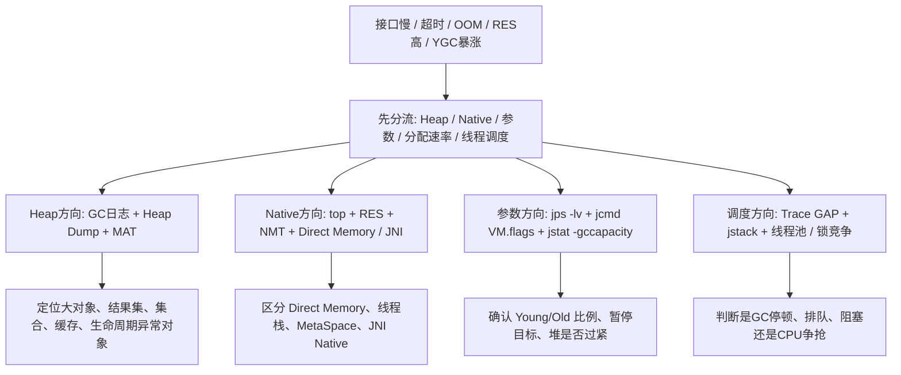

# JVM - 第 20 课：线上 JVM 调优案例拆解：接口 GAP 大、特殊 OOM、Native 内存与 YGC 暴涨

## 学习目标（本节结束后你能做到什么）

- 不再把线上 JVM 调优理解成“看几篇案例，记几个结论”，而是能把案例背后的判断路径抽象出来。
- 理解“接口慢但业务代码实际不耗时”“RES 明显超过 `-Xmx`”“上线后 YGC 暴涨”这些现象分别意味着什么。
- 能区分 Heap OOM、参数误配、Native Memory 问题和对象分配风暴这几条完全不同的排查路线。
- 知道什么时候该看 GC 日志、什么时候该看 Heap Dump、什么时候该看 `top` / `NMT` / 线程栈。
- 建立一套更贴近真实生产事故的 JVM 调优思维，而不是只背参数。

## 内容讲解（核心概念，用类比、例子、图示说清楚）

### 1. 先说一个前提：案例最值钱的不是“建议”，而是“排查路径”

很多 JVM 调优案例文章最后都会给一句建议，比如：

- SQL 默认加 `limit`
- 不要把 `-Xmn` 设太大
- 远离某个框架
- 看 GC 次数和停顿来调堆

这些结论有价值，但如果只记这句话，很容易学偏。

真正应该沉淀下来的，是：

- 这个现象一开始长什么样
- 作者为什么先看这个指标
- 为什么用 `MAT` / `VisualVM` / `top` / `jcmd`
- 最终根因是“对象太多”“参数错了”“Native 内存涨了”，还是“请求根本没进到业务代码”

所以这一课我不会把案例原样抄一遍，而是把它们抽象成 4 类线上高频事故和 1 套粗调方法。

### 2. 案例一：接口很慢，但业务逻辑本身并不慢，中间 GAP 时间很大

这是线上非常容易把人带偏的一类问题。

#### 2.1 现象长什么样

监控或链路追踪里你看到：

- 整个请求总耗时很长
- 但真正业务方法、SQL、RPC 子调用加起来并没有那么长
- 中间有一段明显的 GAP 时间
- 同一时间窗口还出现了很多类似请求

这类问题最容易被误判成：

- “某个接口逻辑太慢”

其实很多时候真正含义是：

- 请求在进入业务代码前就被卡住了
- 或者在业务代码结束后迟迟没被调度出去

#### 2.2 这种 GAP 常见意味着什么

最常见的几类方向是：

1. **GC 停顿**
   - 请求线程整体被 Stop-The-World 挂住
   - 业务代码看起来没慢，但总耗时多了一段“空白”

2. **线程池排队 / 调度延迟**
   - 请求到了，但工作线程不够
   - 或线程虽然在，但被锁、阻塞或 CPU 抢占拖住了

3. **批量数据加载导致对象风暴**
   - 比如全表扫描、一次拉太多数据、反序列化大量对象
   - 真正的业务逻辑可能不复杂，但 JVM 在那段时间忙着分配对象和回收对象

#### 2.3 排查顺序应该怎么走

这类问题的正确顺序通常是：

1. 先看请求时间窗口内的 GC 指标
   - 是否正好出现 YGC / Mixed GC / Full GC 尖刺
   - 1 分钟暂停占比有没有显著升高

2. 再看线程池和线程栈
   - 线程是不是大量 `BLOCKED`
   - 有没有队列积压
   - 有没有锁竞争

3. 再看堆和 dump
   - 是否出现大量结果集对象、`ArrayList`、`HashMap`、`byte[]`
   - 是否有某个查询把太多数据一次性打进堆

4. 最后回看业务代码
   - 是否有无分页查询
   - 是否有默认不设上限的批量读取
   - 是否有“查完再内存过滤”的反模式

#### 2.4 这个案例最该沉淀下来的结论

很多文章会给出一句：

- 没有 `where` 的全表扫描要默认加 `limit`

这句话本身没错，但更本质的结论其实是：

**凡是“不受控地把大量数据整批搬进内存”的代码路径，都可能把问题拖到 JVM 层。**

所以应该沉淀成下面几条工程规则：

- 对开放接口的查询默认要有上限
- 后台导出、批处理和在线请求要隔离
- 能流式处理就不要整批加载
- 查询上限、分页大小、批量反序列化大小都应该有保护阈值

### 3. 案例二：一次“看起来很怪”的 OOM，最后发现是参数和分代结构出了问题

这类案例最容易教会人的不是某个参数，而是：

**JVM 参数错了，表现出来不一定像“参数错了”，而可能像业务 OOM。**

#### 3.1 现象长什么样

这类问题常见表现是：

- 服务突然不可用
- 线上开始报 OOM 或频繁超时
- 临时措施常常是回滚

然后很多人第一反应会去想：

- 是不是代码内存泄漏了

但实际有时根因在于：

- 堆布局本身就不合理

#### 3.2 最常见的参数误配是什么

截图里提到一个方向：

- `-Xmn` 和 `-Xmx` 的关系

如果把它说得更严谨一点，真正的问题不是“`-Xmn` 要小于 `-Xmx`”这么简单，因为这本来就是基本约束。  
更重要的工程结论是：

**Young 区不能挤占得过于激进，否则 Old 区会小到根本承接不住正常晋升。**

举个极端例子：

```bash
-Xmx4g -Xmn3.5g
```

这意味着：

- 整个堆 4G
- Young 3.5G
- Old 只剩大约 0.5G

如果你的对象里有一批会活过几轮 Young GC，那么 Old 区很快就会被顶满。  
这时你看到的现象可能是：

- 晋升失败
- Full GC 提前
- 甚至 OOM

#### 3.3 这类问题应该怎么查

最先做的不是 dump，而是确认运行时参数到底是什么：

```bash
jps -lv
jcmd <pid> VM.flags
jcmd <pid> VM.command_line
jstat -gccapacity <pid> 1000 5
```

你真正要确认的是：

- 堆总大小是多少
- Young / Old 比例是多少
- 当前收集器下这些参数是不是合逻辑

#### 3.4 这类案例最该沉淀的结论

不是简单记住：

- `-Xmn < -Xmx`

而是记住：

- 分代回收器里，Young 太大和 Young 太小都会出问题
- Young 太大时，Old 不够承接晋升
- Young 太小时，Young GC 频繁、对象过早晋升

所以真正该问的是：

- 我的活跃对象到底有多少
- Old 至少需要多大才能稳住
- Young 需要多大才能吸收短命对象

### 4. 案例三：RES 明显超过 `-Xmx`，这是 Heap 问题还是 Native Memory 问题

这类事故在生产里很常见，而且最迷惑人。

#### 4.1 现象长什么样

你在机器上看到：

- Java 进程的 `RES` 很高
- 甚至明显超过 `-Xmx`
- 项目刚启动不久，或者 Heap 看起来还不算特别高

这时最危险的误判是：

- “堆泄漏了”

其实 `RES > -Xmx` 很多时候意味着：

- 问题不只在堆

#### 4.2 先把几个系统指标分清

以 Linux `top` 为例，最值得先记的是：

- `VIRT`：虚拟地址空间
- `RES`：实际驻留物理内存
- `SHR`：共享内存

JVM 里的内存不只包括：

- Java Heap

还包括：

- MetaSpace
- 线程栈
- Code Cache
- Direct Memory
- JNI / Native 库申请的内存
- mmap 映射等其他 native 占用

所以：

**`RES` 高，不等于 Heap 高。**

#### 4.3 排查这类问题最实用的顺序

第一步先做分流：

1. 看 Heap 真实使用量
   - `jstat -gcutil`
   - `jcmd <pid> GC.heap_info`

2. 看 Native Memory Tracking
   - 启动参数里加：

```bash
-XX:NativeMemoryTracking=detail
```

   - 然后执行：

```bash
jcmd <pid> VM.native_memory summary
jcmd <pid> VM.native_memory detail
```

3. 对比系统 `RES`
   - 如果 JVM 已知的 native 统计和 `RES` 接近，说明大概率还是 JVM 管得着的那部分
   - 如果差距很大，就更要怀疑 JNI 或外部 native 库

#### 4.4 哪些框架和技术点特别容易把你带到这里

这类问题里，真正该沉淀的不是“远离 Hibernate”这种粗结论，而是：

**要警惕那些会在你不知不觉中扩大对象图、放大缓存、引入代理、或走到堆外路径的框架行为。**

例如：

- ORM 一次性把大结果集挂到 Session / 一级缓存
- 大量代理对象和延迟加载对象形成庞大对象图
- Netty / NIO 使用 Direct Buffer
- JNI / 压缩库 / 图像库在 native 侧申请内存

所以更稳妥的工程结论是：

- 不要迷信框架默认行为
- 要知道它到底把数据放在堆里、元空间里，还是堆外

### 5. 案例四：新版本上线后 YGC 暴涨，服务开始超时

这是非常典型的一类“上线后退化”事故。

#### 5.1 现象长什么样

最常见的表现是：

- 新版本一上线就收到大量超时报警
- Full GC 不一定很多
- 但 YGC 频率突然上升
- RT 开始整体抖动

这类问题特别适合和“发布前后对比”结合来看。

#### 5.2 YGC 暴涨时，最该先怀疑什么

最常见的根因其实不是参数，而是：

- 新代码开始制造大量短命对象

例如：

- JSON / Proto 反序列化更多了
- DTO 转换层加厚了
- 日志拼接、字符串构造变多了
- 批量查询把结果整批拉进来
- 某个缓存 miss 后一次加载太多数据

#### 5.3 为什么这类问题常常要看 dump

很多人会觉得：

- YGC 问题不就是看 GC 日志吗

其实 GC 日志只能告诉你：

- 回收在变频繁

它不能直接告诉你：

- 到底是哪些对象在被疯狂创建

所以这类问题很适合配合：

- `jmap -histo`
- `jcmd <pid> GC.class_histogram`
- Heap Dump + `MAT`

去看：

- 哪些对象数量异常多
- 哪些大集合是请求级短命对象
- 哪些新版本引入的数据结构在疯狂分配

#### 5.4 这类案例最该沉淀的结论

YGC 问题最容易走歪到：

- 一上来加大 Young

这有时有效，但不是起点。

更稳的顺序是：

1. 先看新版本具体改了什么对象创建路径
2. 再判断是不是对象分配风暴
3. 最后才考虑是不是 Young 太小、暂停目标太激进、堆整体太紧

也就是说：

**YGC 暴涨，优先怀疑“代码让对象变多了”，再怀疑“JVM 参数不合适”。**

### 6. 案例五：所谓“JVM 粗调”到底该怎么做

截图最后一条提到一个很典型的观点：

- 通过观察 GC 频率和停顿时间来调 JVM 内存空间
- 小步快跑，避免大幅波动

这个方向是对的，但如果只停在这句话，还是不够落地。

#### 6.1 粗调最重要的原则

真正的 JVM 粗调，至少要遵守下面四条：

1. **一次只改一个变量**
   - 比如只改 `-Xmx`
   - 或只改 `-Xmn`
   - 或只改 `MaxGCPauseMillis`

2. **改前后看同一组指标**
   - Young GC 次数 / 分钟
   - 单次停顿
   - 1 分钟 GC 暂停占比
   - GC 后 Old 水位
   - RT 的 `p99`

3. **在类似流量条件下比较**
   - 不能昨天低峰和今天高峰直接比

4. **不要只看 GC**
   - 还要看 CPU、线程、SQL、对象数、内存占用

#### 6.2 一组非常实用的粗调模板

如果你怀疑是内存空间不合理，可以按下面这个模板来：

```text
1. 先记录基线：
   - Young GC 次数 / 分钟
   - 单次 Young GC 停顿
   - Old / Mixed / Full GC 频率
   - 1 分钟 GC 暂停占比
   - GC 后 Old 水位
   - RT p99 / p999

2. 只改一个参数

3. 观察 30 分钟到 1 天

4. 只回答两个问题：
   - 停顿变好了没有
   - 吞吐和 RT 变坏了没有
```

#### 6.3 这类“粗调”最容易犯的错误

最常见的错误有：

- GC 一频繁就拼命加堆
- RT 一抖就拼命调 Young
- 一次改 3 到 5 个参数
- 没有基线就说“这次调优有效”

所以真正该沉淀的是：

**JVM 粗调的本质不是调得快，而是调得可验证。**

### 7. 把这 5 类案例串成一条线

你会发现，这几类案例虽然看起来不一样，但其实都在逼你做同一件事：

- 先分清现象属于哪条内存和运行时链路

可以把它们串成下面这张图：



这张图最想帮你建立的不是知识点，而是一个习惯：

**线上 JVM 事故，先分流，再深入，不要一上来就改参数。**

## 小结

- “接口慢但业务方法不慢、链路中间 GAP 大”这类问题，常常意味着 GC 停顿、线程排队或对象风暴，而不只是“业务逻辑慢”。
- 参数误配问题真正要关注的不是背一条 `-Xmn < -Xmx`，而是 Young / Old 比例是否合理，Old 是否有足够空间承接晋升。
- `RES > -Xmx` 时，一定先把 Heap、MetaSpace、线程栈、Direct Memory、JNI Native 这些路径分开看，不能直接说“堆泄漏”。
- 新版本上线后 YGC 暴涨，优先怀疑新代码制造了更多短命对象，再考虑年轻代和暂停目标配置。
- JVM 粗调最重要的是小步快跑、单变量验证、保留基线，而不是一次改一堆参数后凭感觉说“好像变好了”。

## 问题（检测你对当前章节内容是否了解）

1. 如果链路追踪里业务方法耗时不高，但总耗时有很大 GAP，你第一反应应该分流到哪几类问题？
2. 为什么“`-Xmn` 要小于 `-Xmx`”这句话本身没有太大价值，真正有价值的问题应该怎么问？
3. `RES` 高但 Heap 看起来不高时，为什么一定要优先想到 Native Memory 而不是直接判 Heap 泄漏？
4. 新版本上线后 YGC 暴涨，为什么最先该看的是对象分配路径，而不是直接调 Young 区大小？
