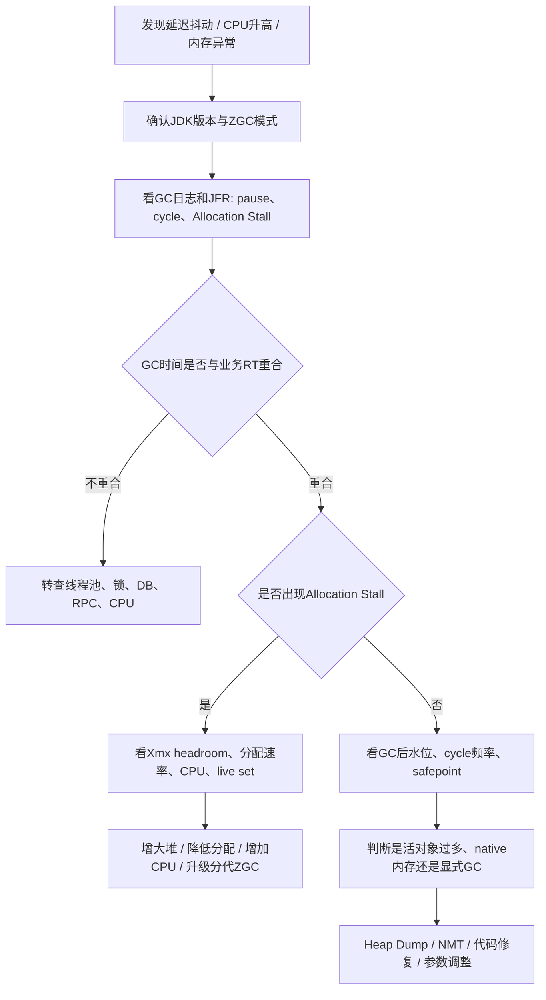

# JVM - 第 22 课：ZGC 生产实战：低延迟调优、Allocation Stall 与常见问题处理

## 学习目标（本节结束后你能做到什么）

- 知道 ZGC 适合什么业务场景，什么时候不该为了“新”而切换 ZGC。
- 能根据 JDK 版本区分普通 ZGC、分代 ZGC，以及线上启动参数应该怎么写。
- 建立一套 ZGC 生产上线前的检查清单，而不是只加一个 `-XX:+UseZGC`。
- 能识别 ZGC 线上最常见的问题：`Allocation Stall`、吞吐下降、RSS 偏高、容器 OOM、显式 GC、Heap OOM。
- 能把 ZGC 问题分成三类处理：堆空间不够、分配速率太高、业务活对象太多。

## 内容讲解（核心概念，用类比、例子、图示说清楚）

### 1. ZGC 生产选型：先问业务是不是真的怕停顿

ZGC 最核心的价值是：

**把 GC 停顿压得非常低。**

但这不等于所有 Java 服务都应该切 ZGC。

更适合考虑 ZGC 的场景：

- 服务对 TP99 / TP999 延迟非常敏感
- 堆比较大，G1 的 Remark、Mixed GC 或 Full GC 停顿已经影响 SLA
- 业务能接受为了低停顿付出一定吞吐和 CPU 代价
- 有能力持续观察 GC 日志、JFR、容器内存和应用 RT

不适合盲目切 ZGC 的场景：

- 服务主要追求吞吐，而不是极低停顿
- 堆很小，G1 或默认 GC 已经稳定满足 SLA
- CPU 本来就很紧，切 ZGC 后并发 GC 线程可能进一步抢 CPU
- 团队没有 GC 日志、JFR、容器内存监控，出了问题只能凭感觉猜

所以 ZGC 的选型表达可以这样说：

**ZGC 不是“性能一定更好”，而是“停顿目标更激进”。如果系统真正的瓶颈不是 GC 停顿，切 ZGC 可能看不出收益，甚至吞吐变差。**

### 2. 先按 JDK 版本说清启动参数

ZGC 的生产使用方式和 JDK 版本关系很大。

#### JDK 17

JDK 17 里的 ZGC 已经可用于生产，但它还是非分代 ZGC。

典型启动参数：

```bash
-XX:+UseZGC
```

它适合低停顿场景，但对高分配速率、短命对象很多的服务，通常不如后来的分代 ZGC 友好。

#### JDK 21 / JDK 22

JDK 21 引入分代 ZGC，可以显式开启：

```bash
-XX:+UseZGC
-XX:+ZGenerational
```

分代 ZGC 的思路更接近服务端应用的对象生命周期现实：

- 大多数对象很快死亡
- 少数对象进入老年代

所以它通常比非分代 ZGC 更适合普通后端服务。

#### JDK 23

JDK 23 开始，ZGC 默认使用分代模式。

典型启动参数：

```bash
-XX:+UseZGC
```

#### JDK 24 及以后

JDK 24 移除了非分代 ZGC 模式，保留分代 ZGC。

典型启动参数仍然是：

```bash
-XX:+UseZGC
```

这也是现在更推荐的心智模型：

**新版本里说 ZGC，默认就按分代 ZGC 来理解。**

### 3. ZGC 生产启动参数怎么给

一个偏稳妥的生产起点可以这样写：

```bash
-XX:+UseZGC
-Xms8g
-Xmx8g
-XX:+AlwaysPreTouch
-Xlog:gc*,gc+heap=debug,safepoint:file=/var/log/app/gc.log:time,uptime,level,tags:filecount=10,filesize=100m
-XX:+HeapDumpOnOutOfMemoryError
-XX:HeapDumpPath=/var/log/app/heapdump.hprof
```

这里每个参数的意义是：

- `-XX:+UseZGC`：启用 ZGC。
- `-Xms` / `-Xmx`：低延迟场景常常设成一样，避免运行时堆伸缩带来的抖动。
- `-XX:+AlwaysPreTouch`：启动时预先触碰内存页，减少运行时缺页抖动。
- `-Xlog:gc*`：保留 GC 日志，出问题时能回看现场。
- `-XX:+HeapDumpOnOutOfMemoryError`：发生 OOM 时保留堆现场。

如果是在容器里，不要把 `-Xmx` 顶到容器 memory limit。

例如容器限制是 `10g`，不要直接给：

```bash
-Xmx10g
```

更稳的做法是给 JVM 堆、堆外、线程栈、Metaspace、Code Cache、监控 agent 都留出空间：

```bash
-Xmx7g
```

具体比例要看业务，但经验上一定要记住：

**容器 limit 限的是整个进程，不只是 Java heap。**

### 4. 生产观察 ZGC，重点看哪些指标

ZGC 排障不要只看“停顿时间很低”，还要看完整链路。

#### 4.1 GC 停顿

重点看：

- 单次 STW pause 是否真的低
- 是否有异常 safepoint
- 应用 RT 抖动是否和 GC 时间重合

如果 GC pause 很低，但 TP99 仍然很差，说明问题可能不在 GC，而在：

- 线程池
- 锁竞争
- 数据库
- RPC
- CPU 饱和
- 下游慢调用

#### 4.2 GC 周期是否追得上分配速度

ZGC 的大量工作是并发完成的，所以要看：

- GC cycle 是否越来越密
- 单次 concurrent cycle 是否越来越长
- 分配速率是否持续高于回收能力
- 是否出现 `Allocation Stall`

如果应用分配对象太快，ZGC 也可能追不上。

#### 4.3 GC 后水位和 live set

重点看 GC 后堆水位：

- 每次 GC 后使用量是否持续升高
- 业务低峰后是否能回落
- live set 是稳定的，还是越来越大

如果 GC 后水位一直下不来，通常不是 ZGC “没努力”，而是：

**活对象真的很多，或者存在可达泄漏。**

#### 4.4 CPU 和并发 GC 线程

ZGC 把很多工作挪到并发阶段，代价是运行时需要 CPU。

所以要一起看：

- 应用 CPU 是否已经接近打满
- GC 线程是否明显抢占 CPU
- 容器 CPU limit 是否太紧
- `ActiveProcessorCount` 是否被错误限制

如果 CPU 已经长期 90% 以上，切 ZGC 不一定能救延迟，反而可能让业务线程和 GC 线程竞争更激烈。

#### 4.5 RSS / Native Memory

ZGC 低停顿不等于进程内存只等于 `-Xmx`。

线上经常会看到：

- `-Xmx=8g`
- 但进程 RSS 明显超过 8g

这不一定是泄漏，因为 JVM 进程还包括：

- Java heap
- Metaspace
- Direct Memory
- 线程栈
- Code Cache
- GC 自身数据结构
- JNI / Agent / Netty / 压缩库等 native 内存

所以容器内存问题不能只盯 `-Xmx`，要配合 Native Memory Tracking 看。

### 5. 常见问题一：`Allocation Stall`

#### 5.1 现象长什么样

ZGC 最值得警惕的信号之一是：

```text
Allocation Stall
```

它大概说明：

- 应用线程想继续分配对象
- 但当前可用空间不够
- GC 还没来得及并发回收出足够空间
- 应用线程被迫等 GC

这对低延迟服务很伤，因为 ZGC 本来就是为了减少停顿，结果应用线程还是被分配卡住了。

#### 5.2 常见原因

最常见原因有：

- `-Xmx` 太小，没有足够 headroom
- 对象分配速率突然变高
- live set 太大，GC 后可用空间不够
- CPU 太紧，ZGC 并发线程跑不动
- 使用较老 JDK 的非分代 ZGC，高短命对象场景下压力更明显

这类问题的本质是：

**应用分配速度和活对象规模，超过了 ZGC 在当前堆和 CPU 条件下的并发回收能力。**

#### 5.3 怎么定位

先看四条线：

- `Allocation Stall` 出现前，堆使用率是不是已经很高
- GC 后水位是不是也很高
- 同一时间 CPU 是否已经打满
- 业务流量、批处理、缓存加载、序列化是否突然上升

可以用这些命令保留现场：

```bash
jcmd <pid> VM.flags
jcmd <pid> GC.heap_info
jcmd <pid> Thread.print
jcmd <pid> JFR.start name=zgc-profile settings=profile filename=/tmp/zgc-profile.jfr duration=120s
```

如果怀疑 native memory，还要提前开启：

```bash
-XX:NativeMemoryTracking=summary
```

然后线上查看：

```bash
jcmd <pid> VM.native_memory summary
```

#### 5.4 怎么处理

处理顺序建议是：

1. 先增大 `-Xmx` 或降低 `SoftMaxHeapSize` 约束  
   ZGC 最重要的调节旋钮通常就是最大堆大小。堆越紧，越容易出现分配等待。

2. 再降低对象分配速率  
   重点看序列化、日志拼接、大批量查询、临时集合、DTO 转换、JSON 处理。

3. 再看 CPU 是否够  
   如果容器 CPU limit 太小，ZGC 并发阶段可能追不上应用分配。

4. 优先升级到分代 ZGC  
   如果还在 JDK 17 的非分代 ZGC 上，短命对象很多的普通后端服务更建议评估 JDK 21+ 的分代 ZGC。

5. 最后才考虑细调 GC 线程参数  
   例如 `ConcGCThreads` 这类参数，不建议一上来就改。先确认瓶颈确实在并发 GC 线程追不上。

### 6. 常见问题二：切 ZGC 后吞吐下降或 CPU 升高

#### 6.1 现象长什么样

上线 ZGC 后可能看到：

- GC pause 明显下降
- TP999 变稳
- 但 CPU 升高
- QPS 上限下降
- 单机吞吐不如 G1

这不是矛盾。

ZGC 的设计目标是低停顿，它会把更多工作放到并发阶段，还会有读屏障等运行时成本。  
所以它可能用吞吐和 CPU 换延迟稳定性。

#### 6.2 怎么判断是不是值得

要回到业务目标：

- 如果系统核心 SLA 是 TP99 / TP999，吞吐轻微下降可能可以接受
- 如果系统核心目标是批处理吞吐、离线任务速度、单位资源成本，那 G1 或 Parallel 可能更合适

判断时不要只看一条指标，要对比：

- TP99 / TP999 是否下降
- 平均 CPU 是否升高
- 同样机器下 QPS 上限是否变化
- GC 总 CPU 占比是否变化
- 业务错误率和超时率是否改善

#### 6.3 怎么处理

常见处理策略：

- 如果延迟收益明显，适当扩容或提高 CPU request / limit
- 如果吞吐损失不可接受，回退 G1 不丢人
- 如果 CPU 主要花在对象分配和 GC 上，优先优化对象创建
- 如果使用小堆服务，评估是否根本不需要 ZGC

记住一句话：

**ZGC 是低延迟工具，不是免费吞吐加速器。**

### 7. 常见问题三：RSS 明显高于 `-Xmx`

#### 7.1 现象长什么样

线上经常看到这种情况：

```text
-Xmx = 8g
RSS  = 10g+
```

然后第一反应是：

- JVM 内存泄漏了？
- ZGC 有 bug？

不一定。

#### 7.2 正确理解

`-Xmx` 只限制 Java heap 最大值，不限制整个 JVM 进程。

进程 RSS 还包括：

- Direct Buffer
- Metaspace
- 线程栈
- Code Cache
- GC 元数据
- JIT 编译相关内存
- native 库
- 监控 agent

所以正确问题不是：

**为什么 RSS 大于 Xmx？**

而是：

**RSS 里除了 heap，其他部分分别是谁占的？**

#### 7.3 怎么定位

启动时加：

```bash
-XX:NativeMemoryTracking=summary
```

查看：

```bash
jcmd <pid> VM.native_memory summary
```

再结合：

```bash
jcmd <pid> GC.heap_info
jcmd <pid> VM.flags
```

如果是 Netty、NIO、压缩库、JNI、agent 引起的 native memory，还要回到对应组件继续查。

#### 7.4 怎么处理

常见方向：

- 降低 `-Xmx`，给 native memory 留空间
- 限制 Direct Memory，例如评估 `-XX:MaxDirectMemorySize`
- 控制线程数，避免线程栈过多
- 检查 Metaspace 是否持续增长
- 检查监控 agent、JNI、压缩库是否有 native 泄漏

在容器里尤其要记住：

**`container limit` 要覆盖整个 JVM 进程，而不是只覆盖 Java heap。**

### 8. 常见问题四：容器 OOMKilled

#### 8.1 现象长什么样

应用没有抛出 Java OOM，Pod 却被杀了：

```text
Reason: OOMKilled
Exit Code: 137
```

这说明通常不是 JVM 主动抛错，而是操作系统或容器运行时认为进程超过了内存限制。

#### 8.2 常见原因

- `-Xmx` 贴着容器 limit 设置
- Direct Memory、线程栈、Metaspace 没有预留空间
- `AlwaysPreTouch` 让内存更早体现为实际占用
- native memory 泄漏
- 瞬时流量导致堆和堆外一起上涨

#### 8.3 处理策略

优先做这些事：

- 明确设置 `-Xmx`，不要完全依赖默认百分比
- 给 native memory 留出至少一段安全空间
- 给容器设置合理的 memory request / limit
- 用 NMT 验证非 heap 占用
- 对 Netty / NIO / 大文件处理设置更明确的边界

一个实用原则：

**容器 8g，不代表 Java heap 可以给 8g。**

### 9. 常见问题五：内存不及时还给操作系统

#### 9.1 现象长什么样

业务低峰后，Java heap 使用量降了，但进程 RSS 没有马上降。

这时不要马上判断泄漏。

ZGC 支持把未使用内存归还给操作系统，但它不是每次 GC 后立刻把所有空闲内存都还回去。

#### 9.2 关键参数

ZGC 默认会 uncommit 未使用内存。相关参数包括：

```bash
-XX:+ZUncommit
-XX:ZUncommitDelay=<seconds>
```

但如果你设置：

```bash
-Xms8g
-Xmx8g
```

那么堆不会收缩到低于 `-Xms`，等价于低延迟优先、内存占用更稳定。

#### 9.3 怎么取舍

低延迟服务更常用：

```bash
-Xms8g
-Xmx8g
-XX:+AlwaysPreTouch
```

它的好处是运行时更稳定，代价是常驻内存高。

如果你更关心内存占用，可以让 `-Xms` 小于 `-Xmx`，或者使用：

```bash
-XX:SoftMaxHeapSize=6g
```

它表示 ZGC 会尽量把堆控制在 soft limit 附近，但必要时仍然可以增长到 `-Xmx`，避免应用因为堆太紧而卡住。

### 10. 常见问题六：ZGC 仍然 OOM

ZGC 不是防 OOM 工具。

它只能降低 GC 停顿，不会让不可回收对象自动消失。

如果出现：

```text
java.lang.OutOfMemoryError: Java heap space
```

排查仍然回到老路线：

- GC 后水位是否持续上升
- Heap Dump 里 retained heap 最大的是谁
- 哪些对象被长生命周期引用持有
- 是否有无上限缓存、静态集合、ThreadLocal、队列堆积

如果出现：

```text
java.lang.OutOfMemoryError: Direct buffer memory
```

重点就不是 ZGC，而是：

- Direct Buffer 上限
- Netty / NIO 使用方式
- 大文件读写
- 是否有 buffer 未释放

所以可以这样记：

**ZGC 解决停顿问题，不负责修业务内存泄漏。**

### 11. 常见问题七：显式 GC 和第三方库干扰

有些库或代码会调用：

```java
System.gc();
```

在低延迟服务里，这类调用要特别小心。

如果日志里看到显式 GC 相关触发，要继续追：

- 是业务代码调用的
- 是第三方库调用的
- 是监控或诊断工具触发的

如果确认这些调用没有必要，可以考虑：

```bash
-XX:+DisableExplicitGC
```

但这个参数也不要无脑加。  
如果某些组件确实依赖显式 GC 释放特定资源，你需要先理解组件行为，再决定是否禁用。

### 12. 一套 ZGC 生产排障 SOP

可以按这条链路走：



这套流程的关键是：

1. 先确认是不是 GC 导致业务 RT 抖动。
2. 如果是，再区分是 `Allocation Stall`、live set 过大、CPU 不够，还是 native memory。
3. 最后才动参数，不要一上来就靠参数硬猜。

### 13. 上线 ZGC 的灰度建议

上线 ZGC 不建议一步切全量。

更稳的方式是：

1. 先在压测环境对比 G1 和 ZGC  
   同样流量、同样堆大小、同样 CPU，看 TP99、TP999、吞吐、CPU、内存。

2. 再在线上做单实例灰度  
   对比同组其他 G1 实例，观察至少一个完整业务周期。

3. 再扩大灰度比例  
   如果低峰、高峰、批任务、定时任务都没有异常，再继续放量。

4. 保留快速回退方案  
   如果出现 `Allocation Stall`、CPU 明显升高、容器 OOMKilled，要能快速回到原 GC。

上线前至少准备这些观测项：

- GC 日志
- JFR
- 应用 TP99 / TP999
- CPU 使用率
- 堆使用和 GC 后水位
- RSS / 容器内存
- OOM dump
- NMT 开关策略

### 14. 面试和生产表达怎么说

一个比较稳的表达是：

> ZGC 适合对尾延迟非常敏感的服务，它通过并发标记、并发重定位、读屏障和分代回收把 STW 停顿压得很低。但生产上不能只看 pause，还要看分配速率、GC 后水位、CPU、RSS 和 Allocation Stall。如果出现 Allocation Stall，通常说明堆 headroom 不够、分配速率过高、live set 太大或 CPU 不够。ZGC 是低延迟工具，不是解决内存泄漏和吞吐瓶颈的万能药。

## 小结

- ZGC 的核心收益是低停顿，代价可能是更高 CPU 成本和一定吞吐损失。
- JDK 21 引入分代 ZGC，JDK 23 起分代模式成为默认，JDK 24 起非分代模式被移除；新项目优先按分代 ZGC 理解。
- ZGC 最重要的调优旋钮通常是 `-Xmx`，要给并发回收留足 headroom。
- `Allocation Stall` 是 ZGC 生产排障里的高危信号，说明应用分配已经等 GC 回收。
- 容器内存问题不能只看 `-Xmx`，还要看 Direct Memory、Metaspace、线程栈、Code Cache 和 native memory。
- ZGC 能降低 GC 停顿，但不能自动修复业务内存泄漏、无上限缓存和队列堆积。

## 问题（检测你对当前章节内容是否了解）

1. 为什么说 ZGC 适合低延迟服务，但不一定适合所有高吞吐服务？
2. JDK 17、JDK 21、JDK 23、JDK 24 里的 ZGC 使用方式有什么差异？
3. `Allocation Stall` 说明了什么？你会按什么顺序定位？
4. 为什么容器里 `-Xmx=8g` 不代表 Pod memory limit 可以只给 8g？
5. 如果 ZGC pause 很低，但业务 TP99 仍然很差，你下一步应该看什么？

## 参考资料

- OpenJDK JEP 439：Generational ZGC
- OpenJDK JEP 474：ZGC: Generational Mode by Default
- OpenJDK JEP 490：ZGC: Remove the Non-Generational Mode
- Oracle HotSpot VM Garbage Collection Tuning Guide：The Z Garbage Collector
