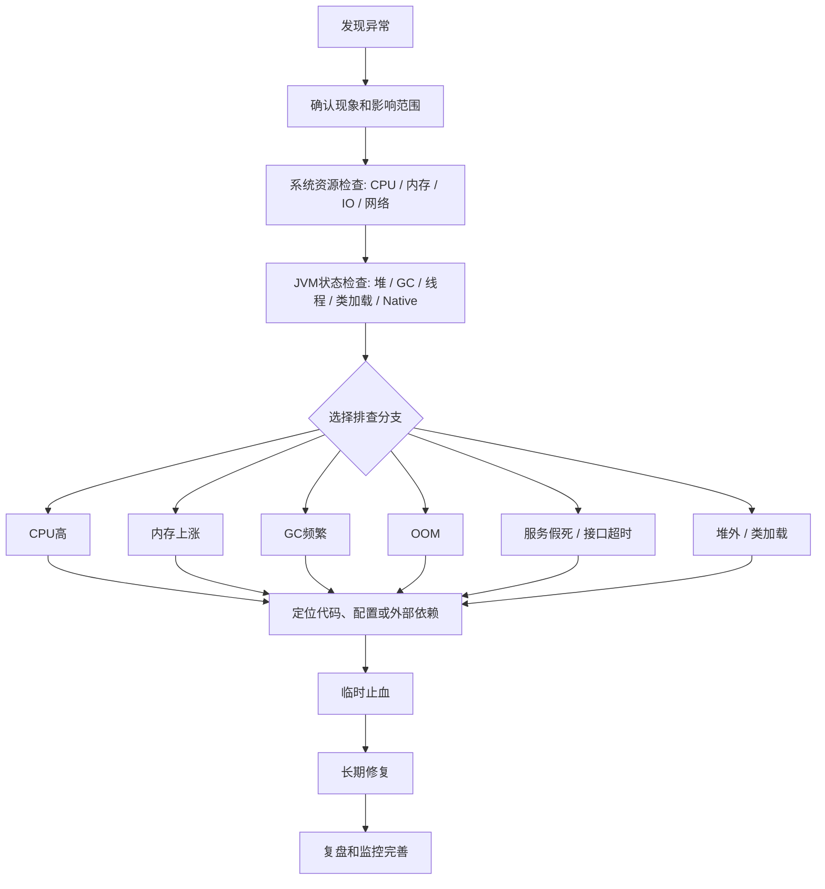

# JVM - 第 23 课：完整排查方法：现象确认、现场保留、分支定位与复盘

## 学习目标（本节结束后你能做到什么）

- 建立一套完整 JVM 排查主线，而不是一上来就 `jstack`、`jmap` 乱打。
- 能先判断异常到底是不是 JVM 问题，再判断是哪类 JVM 问题。
- 能按 CPU 高、内存上涨、GC 频繁、OOM、服务假死、堆外内存、类加载等分支定位。
- 知道生产环境为什么要先保留现场，再重启或止血。
- 能把排查过程讲成面试里的完整生产经验表达。

## 本篇定位：总纲，不替代专题深挖

这一节是 JVM 线上排查的**总入口**。

它解决的是：

- 线上异常来了，第一步先看什么。
- 怎么判断是不是 JVM 问题。
- 怎么从 CPU、内存、GC、OOM、线程假死这些现象分流。
- 每条分支应该先保留什么现场，再进入哪个专题继续深挖。
- 面试里怎么把一套完整排查经验讲得像真实生产经验，而不是背命令清单。

它不负责把每个专题讲到最深。细节应该回到对应章节：

| 想深挖的问题 | 建议继续看 |
| --- | --- |
| JVM 工具怎么选，`jps`、`jstat`、`jstack`、`jmap`、`jcmd` 分别干什么 | `09_JVM问题排查工具：jps、jstat、jstack、jmap、jcmd、JConsole与VisualVM.md` |
| 堆参数、`Xms`、`Xmx`、新生代比例、OOM 自动 dump | `10_堆内存相关JVM参数：Xms、Xmx、Xmn、NewRatio、SurvivorRatio与HeapDump.md` |
| 死锁、Heap Dump、OOM 现场怎么抓 | `11_线上故障实战：死锁检测、HeapDump与OutOfMemoryError排查.md` |
| G1 生产问题：Young GC、Humongous、Mixed GC、Remark、Evacuation Failure | `16~19_G1专题` |
| ZGC 生产问题：低延迟、`Allocation Stall`、RSS、容器 OOMKilled | `22_ZGC生产实战：低延迟调优、Allocation Stall与常见问题处理.md` |
| 引用链、缓存泄漏、`ThreadLocal`、为什么 GC 还会泄漏 | `21_引用强度、保留链与内存泄漏：从WeakReference到ThreadLocal.md` |
| 真实事故怎么复盘和沉淀 | `20_线上JVM调优案例拆解：接口GAP大、特殊OOM、Native内存与YGC暴涨.md` |

所以读这一节时，不要把它当“所有 JVM 细节大全”，而要把它当成一张排障地图：

**先用它找到方向，再去专题里拿证据和修复方案。**

## 核心主线

一个完整的 JVM 排查方法，不是直接上工具，而是按这条链路走：

```text
现象确认
-> 影响范围判断
-> 系统资源检查
-> JVM 状态检查
-> 分支定位
-> 代码级根因分析
-> 临时止血
-> 长期修复
-> 复盘和监控完善
```

你可以把它理解成一句话：

**先判断是不是 JVM 问题，再判断是哪类 JVM 问题，最后用对应工具定位代码级根因。**

## 总体分流表：现象、第一证据和深挖入口

| 现象 | 第一证据 | 更像什么问题 | 深挖入口 |
| --- | --- | --- | --- |
| CPU 飙高 | `top -Hp <pid>` + `jcmd Thread.print` | 业务死循环、锁竞争、GC 线程占 CPU | 本篇 CPU 分支 + 第 9 课工具 |
| 内存持续上涨 | `top` / `jstat` / `jcmd GC.heap_info` / NMT | 堆泄漏、Metaspace、Direct Memory、线程栈、Native | 本篇内存分支 + 第 21 课 |
| Full GC 频繁 | `jstat -gcutil` + GC log | 老年代压力、泄漏、大对象、晋升失败、Metaspace | 第 8b、16~19 课 |
| OOM | OOM 类型和 dump 现场 | Heap、Metaspace、Direct、Native Thread | 第 11、21、23 课 |
| 服务假死 | 连续 3 次 thread dump | 死锁、线程池耗尽、连接池耗尽、下游慢 | 本篇线程分支 + 第 11 课 |
| RSS 远超 `-Xmx` | `jcmd VM.native_memory summary` | 堆外、线程栈、Metaspace、Native Memory | 第 20、22、23 课 |
| 延迟尖刺 | RT 曲线 + GC pause + thread dump | GC STW、锁竞争、下游慢、CPU 饱和 | 第 8b、20、23 课 |

## 一、先做总判断：到底是不是 JVM 问题

线上服务异常时，先不要急着怀疑 JVM。第一步应该确认现象。

| 现象 | 可能方向 |
| --- | --- |
| CPU 飙高 | 死循环、频繁 GC、线程池打满、锁竞争 |
| 内存持续上涨 | Java 堆泄漏、缓存无界、对象堆积、堆外内存泄漏 |
| Full GC 频繁 | 老年代压力大、晋升失败、大对象、内存泄漏 |
| 接口超时 | 线程池耗尽、锁阻塞、下游慢、GC STW |
| 服务假死 | 死锁、线程全部阻塞、连接池耗尽 |
| OOM | Heap、Metaspace、Direct Memory、Native Memory |
| 启动慢 / 启动失败 | 类加载、配置、内存参数、依赖初始化问题 |

先看系统层面：

```bash
top
free -m
df -h
iostat -x 1
vmstat 1
netstat -antp | grep <pid>
```

重点看 Java 进程：

```bash
ps -ef | grep java
top -p <pid>
```

你要先确认：

1. 进程还在不在。
2. CPU 是不是高。
3. 内存是不是高。
4. 系统是否 swap。
5. 磁盘是否打满。
6. 网络连接是否异常。
7. 是单实例问题还是所有实例问题。

如果只有一个 Java 实例异常，大概率是进程内部问题。
如果所有实例都异常，也可能是下游、配置、流量、数据库、Redis、MQ 或发布导致的。

## 二、保留现场：先取证，不要直接重启

很多人线上排查最大的问题是：

**服务一卡，先重启。**

这在生产上很危险，因为你把现场毁了。

正确做法是：在重启或扩容之前，先尽量保存现场数据。

常用取证命令：

```bash
jps -l
jcmd <pid> VM.version
jcmd <pid> VM.flags
jcmd <pid> VM.command_line
jcmd <pid> GC.heap_info
jcmd <pid> Thread.print > thread_dump.txt
jcmd <pid> GC.class_histogram > class_histogram.txt
```

如果怀疑内存泄漏，可以 dump 堆：

```bash
jcmd <pid> GC.heap_dump /tmp/heap.hprof
```

或者：

```bash
jmap -dump:format=b,file=/tmp/heap.hprof <pid>
```

但注意：heap dump 很重，可能导致服务短暂停顿甚至雪崩。

生产建议：

1. 优先在异常实例上 dump。
2. 如果有多副本，先摘流量再 dump。
3. 大堆内存服务不要随便 dump。
4. 更推荐提前配置 OOM 自动 dump。

```bash
-XX:+HeapDumpOnOutOfMemoryError
-XX:HeapDumpPath=/data/dump
```

同时要保留：

- GC log
- 应用日志
- 错误日志
- 线程 dump
- 堆 dump
- 监控指标
- 发布记录
- 流量变化

## 三、建立 JVM 排查主流程

可以按这个顺序来：

1. 确认现象。
2. 判断影响范围。
3. 看系统资源：CPU / 内存 / IO / 网络。
4. 看 JVM 状态：堆、GC、线程、类加载、直接内存。
5. 根据症状进入分支：CPU 高、内存高、GC 频繁、OOM、线程阻塞 / 服务假死、响应慢。
6. 定位到代码、配置或外部依赖。
7. 临时止血。
8. 根因修复。
9. 复盘和监控完善。



## 四、CPU 飙高怎么排查

这一节只给 CPU 高的总路线。
命令细节、线程 ID 转十六进制、`jstack` / `jcmd` 的具体用法，统一看第 9 课工具章节。

### 1. CPU 高的最短证据链

CPU 高时，不要直接猜“是不是死循环”。先按这条证据链走：

| 步骤 | 目标 | 常用证据 |
| --- | --- | --- |
| 1. 先确认是不是 Java 进程高 | 避免把系统、数据库、旁路进程问题误判成 JVM 问题 | `top` / `top -p <pid>` |
| 2. 找到高 CPU 线程 | 判断 CPU 是集中在少数线程，还是整个进程普遍繁忙 | `top -Hp <pid>` |
| 3. 线程 ID 转换 | 把 Linux 线程 ID 对上 Java thread dump 里的 `nid` | `printf "%x\n" <tid>` |
| 4. 抓线程栈 | 看高 CPU 线程到底在跑哪段代码 | `jcmd <pid> Thread.print` / `jstack -l <pid>` |
| 5. 连续抓 2-3 次 | 判断是稳定卡在同一处，还是栈在快速变化 | 多次 thread dump / JFR / async-profiler |

最关键的是第 5 步。
如果多次线程栈都落在同一个业务方法附近，才更像死循环或热点代码。
如果线程栈快速变化，或者看不出稳定热点，就要升级到 JFR / async-profiler，而不是只靠一次 `jstack` 下结论。

### 2. CPU 高的三类高频根因

| 线程栈现象 | 更像什么 | 常见根因 | 下一步 |
| --- | --- | --- | --- |
| 高 CPU 线程多次停在同一个业务方法 | 业务代码热点 / 死循环 | `while` 退出条件错误、递归过深、正则回溯爆炸、大集合循环、JSON 序列化、压缩加密排序 | 回到代码，修算法、边界条件和数据规模 |
| 高 CPU 线程是 `GC Thread`、`G1 Conc`、`VM Thread` | GC 消耗 CPU | YGC / FGC 频繁、分配速率过高、老年代回收无效、堆太小 | 转到 GC 分支，看 `jstat`、GC log、GC 后水位 |
| 大量线程 `BLOCKED` 或卡在 AQS / synchronized | 锁竞争 | 锁粒度过大、热点锁、锁内调用外部服务、线程池争抢资源 | 连续 thread dump，找持锁线程，必要时用 Arthas `thread -b` |

典型业务热点栈可能长这样：

```text
com.xxx.service.CalculateService.calculate()
com.xxx.service.RuleEngine.match()
```

典型锁竞争信号可能长这样：

```text
BLOCKED
waiting to lock
java.util.concurrent.locks.AbstractQueuedSynchronizer
```

典型 GC 消耗 CPU 时，下一步不要继续盯业务线程，而要看：

```bash
jstat -gcutil <pid> 1000
```

以及对应时间窗口的 GC log。

### 3. 什么时候升级到火焰图

下面这些情况，只看 thread dump 往往不够：

- 高 CPU 线程栈变化很快，看不出固定代码位置。
- CPU 分散在很多业务线程里，不是单个线程打满。
- 怀疑对象分配过快导致 GC 和业务线程一起忙。
- 怀疑锁竞争、Unsafe、JNI、序列化、正则、压缩加密这类热点。

这时更适合：

- JFR：低开销记录 CPU、锁、分配、GC、IO 等事件。
- async-profiler：生成 CPU / alloc / lock 火焰图。
- Arthas：快速在线 `thread`、`trace`、`watch` 验证具体方法。

### 4. CPU 高的止血和长期修复

| 类型 | 处理方式 |
| --- | --- |
| 临时止血 | 限流、降级、扩容、摘掉异常实例、重启异常实例、关闭问题功能开关、回滚最近发布 |
| 业务热点修复 | 修复死循环、优化算法复杂度、控制批处理大小、优化正则、减少大对象序列化、拆分大任务 |
| 锁竞争修复 | 缩小锁粒度、减少锁内逻辑、避免锁内调用外部服务、改用更合适的并发结构 |
| GC 导致 CPU 高 | 降低对象分配速率、修复内存泄漏、调整堆和 GC 参数、必要时评估 G1 / ZGC 取舍 |

一句话总结：

**CPU 高先找线程，线程栈定方向；看不清热点就上 JFR / 火焰图；最后把问题落到业务代码、锁、GC 或外部资源竞争。**

## 五、内存持续上涨怎么排查

内存问题分很多种，不能只看 `top` 里的 `RES`。

Java 内存大概分为：

- Java Heap
- Metaspace
- Direct Memory
- Thread Stack
- Code Cache
- JNI / Native Memory
- GC 内部结构

所以看到内存上涨，要先判断是：

1. Java 堆上涨。
2. 堆外内存上涨。
3. Metaspace 上涨。
4. 线程太多导致栈内存上涨。
5. Native Memory 泄漏。

### 1. 核心方法：先量后比，定位是哪一块

排查内存问题最容易犯的错，就是看到 `top` 里 `RES` 涨了，就直接 dump 堆。结果 dump 出来一看堆才用了 30%，白忙一场——因为问题根本不在堆里。

正确的心智模型是把进程物理内存拆开看：

```text
进程 RES ≈ Java 堆(Heap)
          + 元空间(Metaspace)
          + 线程栈(每线程 Xss × 线程数)
          + 直接内存(Direct / Mapped ByteBuffer)
          + Code Cache(JIT 编译后的机器码)
          + GC / 编译器 / 符号表等 JVM 内部结构
          + 其它 Native(JNI、Unsafe、glibc arena、压缩/加密库)
```

**关键判断信号：把 `RES` 和 `-Xmx` 比一比。**

- `RES` 略大于 `Xmx`（比如 Xmx 4g，RES 4.5g）：基本正常，多出来的是元空间、线程栈、Code Cache 这些固定开销。
- `RES` **远大于** `Xmx`（比如 Xmx 4g，RES 9g）：**几乎可以肯定不是堆的问题**，要往堆外、元空间、线程、Native 方向查。

所以第一步不是 dump，而是**逐块量出来，再看是哪块在涨**：

| 内存区 | 怎么量 | 正常表现 / 异常信号 |
| --- | --- | --- |
| Java 堆 | `jstat -gcutil <pid>` 看 O；`jcmd <pid> GC.heap_info` 看 committed | Full GC 后 O 能降下来=正常；降不下来=堆泄漏 |
| 元空间 | `jstat -gcutil` 的 `M` / `CCS`；`jcmd <pid> VM.classloader_stats` | M 一直涨、Loaded 类数只增不减=类加载泄漏 |
| 线程栈 | `ps -eLf \| grep <pid> \| wc -l` 数线程；× `-Xss` 估算 | 线程数几千上万=线程池失控 |
| 直接内存 | `jcmd <pid> VM.native_memory summary`（需开 NMT）；或 `BufferPoolMXBean` | Internal / Other 持续涨、Netty 报泄漏=Direct 泄漏 |
| Code Cache | `jcmd <pid> Compiler.codecache`；NMT 里的 `Code` | 接近上限会触发 `CodeCache is full`，编译停止 |
| 其它 Native | NMT summary 总和对不上 RES，差额很大 | 每块都正常但 RES 还在涨=真 native 泄漏 |

最有力的工具是 **NMT（Native Memory Tracking）**，它能把上面除了“其它 Native”之外几乎所有块都列出来。前提是启动时加了参数：

```bash
-XX:NativeMemoryTracking=summary
```

然后：

```bash
jcmd <pid> VM.native_memory summary
```

输出会按 `Java Heap / Class / Thread / Code / GC / Compiler / Internal / Symbol / Native Memory Tracking / Arena Chunk` 分块给出 `reserved` 和 `committed`。**把 committed 加起来，和 RES 对比**：

- 加起来约等于 RES → 问题在 JVM 已知的某一块（看哪块最大、哪块在涨）。
- 加起来明显小于 RES → 差额是 JVM 管不到的 Native（JNI、`Unsafe.allocateMemory`、glibc malloc arena、第三方 `.so`），这是最难查的一类。

下面按五块分别给实战例子，每个例子都给“你会看到什么现象 + 用什么命令确认”。

#### 1.1 例子一：是 Java 堆涨

现象：

```text
Xmx = 4g，top 里 RES = 4.3g
jstat 看 O 区一直在 90% 以上
Full GC 打了好几次，O 区还是降不下来
```

确认：

```bash
jstat -gcutil <pid> 1000
# O 92.0 -> Full GC -> O 还是 90.5，几乎没掉
```

结论：RES 和 Xmx 接近，堆占满且 Full GC 回收无效 → **堆内泄漏**，进入下面的“看堆对象分布 / dump 堆”流程。

#### 1.2 例子二：是 Metaspace 涨

现象：

```text
RES 慢慢从 2g 涨到 5g
但 jstat 看堆（E/O）一直很稳，没涨
jstat 看 M 从 60% 一路涨到 99%
最后报 java.lang.OutOfMemoryError: Metaspace
```

确认：

```bash
jstat -gcutil <pid> 1000        # 看 M、CCS 持续上涨
jstat -class  <pid> 1000        # Loaded 一直涨，Unloaded 几乎不动
jcmd <pid> VM.classloader_stats # 看有没有大量同名/自定义 ClassLoader
```

结论：堆稳、M 涨、加载的类只增不减 → **类加载泄漏**。常见根因：CGLIB / ByteBuddy / Groovy / JSP 动态生成类、热部署旧 ClassLoader 没卸载、反射代理类爆炸。单纯调大 `-XX:MaxMetaspaceSize` 治标不治本。

#### 1.3 例子三：是直接内存（堆外）涨

现象：

```text
top 里 RES = 9g，但 Xmx 只有 4g —— RES 远超 Xmx，第一信号就指向堆外
jstat 看堆稳定，M 也稳定
最后报 java.lang.OutOfMemoryError: Direct buffer memory
```

确认：

```bash
jcmd <pid> VM.flags | grep MaxDirectMemorySize   # 看堆外上限设了没
jcmd <pid> VM.native_memory summary              # Internal / Other 这块很大
# Netty 场景再开 -Dio.netty.leakDetection.level=advanced 看泄漏栈
```

结论：RES 远超 Xmx、堆和元空间都稳 → **堆外/直接内存泄漏**。常见根因：Netty `ByteBuf` 没 `release`、NIO `ByteBuffer.allocateDirect` 反复分配、Kafka/gRPC 客户端缓冲区、`Unsafe` 手动分配未释放。

#### 1.4 例子四：是线程栈涨

现象：

```text
RES 持续涨
堆、Metaspace、Direct 都正常
最后报 java.lang.OutOfMemoryError: unable to create new native thread
```

确认：

```bash
ps -eLf | grep <pid> | wc -l            # 线程数，发现有上万个
jcmd <pid> Thread.print | grep -c '"'   # 也能粗看线程规模
ulimit -a                               # 看系统/容器线程数上限
jcmd <pid> VM.flags | grep ThreadStackSize
```

粗算：1 万个线程 × 1MB 栈 ≈ 10GB 纯线程栈内存。结论：**线程失控**。常见根因：`Executors.newCachedThreadPool()` 在流量暴涨时疯狂建线程、每个请求 new 一个线程、线程池配置无界。注意这个 OOM 反而和 `-Xmx` 无关，调大堆没用，要么限制线程数，要么调小 `-Xss`。

#### 1.5 例子五：是真正的 Native Memory 泄漏

现象：

```text
RES 缓慢但持续地涨，重启后又慢慢涨上来
堆、Metaspace、线程、Direct（NMT 各块）加起来都正常
NMT 各块 committed 之和明显小于 RES，差额越来越大
```

确认：

```bash
jcmd <pid> VM.native_memory summary    # 各块求和，和 RES 对不上
pmap -x <pid> | sort -k3 -n | tail     # 看大块 anon 映射
# 怀疑 glibc arena 碎片时，可试 MALLOC_ARENA_MAX=1 或换 jemalloc/tcmalloc 观察
```

结论：JVM 自己能统计的都正常，差额在 JVM 管不到的地方 → **真 Native 泄漏**。常见根因：JNI 里 `malloc` 没 `free`、第三方 `.so`（压缩 zstd/lz4、加密、图像、数据库 native 驱动）泄漏、glibc malloc 多 arena 导致的内存碎片膨胀。这类最难，往往要上 `jemalloc`/`tcmalloc` 的 profiling 或 async-profiler 的 native 分配采样。

#### 1.6 一句话总结判断顺序

```text
RES 涨 -> 先和 Xmx 比
  RES ≈ Xmx        -> 大概率堆，jstat 看 O + Full GC 后是否下降
  RES 远超 Xmx     -> 一定不是堆，开 NMT 逐块量
    M 在涨          -> Metaspace / 类加载泄漏
    线程数巨大       -> 线程栈
    Internal/Other 高-> 直接内存（Netty/NIO）
    各块都正常但对不上 RES -> 真 Native 泄漏
```

确定了是“堆”之后，再用下面的方法深入。

如果判断不是 Java 堆，而是 Direct Memory、线程栈、Metaspace 或真正 Native Memory，则不要继续在 heap dump 里硬找答案。
这时应该跳到后面的：

- `九、堆外内存 / Native Memory 怎么排查`
- `十、类加载问题怎么排查`
- `七、OOM 怎么排查` 里的对应 OOM 类型

### 2. 看堆使用情况

```bash
jstat -gcutil <pid> 1000
```

输出类似：

```text
S0     S1     E      O      M     CCS    YGC   YGCT   FGC   FGCT   GCT
0.00   50.00  80.00  92.00  95.00 90.00 1200  30.2   12    8.3    38.5
```

重点看：

| 字段 | 含义 |
| --- | --- |
| E | Eden 区使用率 |
| O | Old 老年代使用率 |
| M | Metaspace 使用率 |
| YGC | Young GC 次数 |
| FGC | Full GC 次数 |
| GCT | GC 总耗时 |

如果老年代 `O` 一直上涨，并且 Full GC 后也降不下来，强烈怀疑内存泄漏。

### 3. 看堆对象分布

轻量方式：

```bash
jcmd <pid> GC.class_histogram > histo.txt
```

或者：

```bash
jmap -histo:live <pid> > histo.txt
```

注意：

```bash
jmap -histo:live
```

会触发 Full GC，生产慎用。

你要看哪些类实例数量巨大：

```text
num     #instances         #bytes      class name
1       5000000            800000000   java.lang.String
2       3000000            600000000   com.xxx.UserSession
3       2000000            400000000   byte[]
```

如果业务对象异常多，比如：

```text
com.xxx.OrderDTO
com.xxx.UserContext
com.xxx.CacheItem
```

就要怀疑：

- 缓存没有过期
- `Map` / `List` 只增不删
- `ThreadLocal` 没有 `remove`
- 监听器、回调、`Future` 没释放
- 消息堆积
- 大对象被静态变量引用
- 本地缓存 Caffeine / Guava 配置不合理

### 4. Dump 堆分析

```bash
jcmd <pid> GC.heap_dump /tmp/heap.hprof
```

然后用 MAT 或 JProfiler 分析。

MAT 里重点看：

- Leak Suspects Report
- Dominator Tree
- Retained Heap
- GC Roots
- Path to GC Roots

关键概念：

| 概念 | 解释 |
| --- | --- |
| Shallow Heap | 对象本身占用内存 |
| Retained Heap | 这个对象被回收后能释放的总内存 |
| GC Root | 导致对象无法被回收的根引用 |
| Dominator Tree | 谁持有了最多内存 |

排查内存泄漏时，真正重要的是 `Retained Heap`，不是 `Shallow Heap`。

例如你看到：

```text
ConcurrentHashMap retained size: 2GB
```

然后一路看引用链：

```text
Static field CacheManager.localCache
 -> ConcurrentHashMap
 -> UserSession
 -> List<OrderDTO>
```

这就说明本地缓存可能无界增长。

### 5. 常见 Java 堆泄漏场景

#### 本地缓存无上限

```java
private static final Map<String, Object> CACHE = new ConcurrentHashMap<>();
```

如果一直 `put`，不清理，就会泄漏。

解决：

```java
Caffeine.newBuilder()
    .maximumSize(10000)
    .expireAfterWrite(10, TimeUnit.MINUTES)
    .build();
```

#### ThreadLocal 没有 remove

```java
threadLocal.set(userContext);
```

线程池里的线程不会销毁，如果不 `remove`，数据会长期挂在线程上。

正确写法：

```java
try {
    threadLocal.set(context);
    // business logic
} finally {
    threadLocal.remove();
}
```

#### 消息队列消费堆积

比如消费者慢，内存里积压大量消息对象。

表现：

```text
List<Message>
BlockingQueue
LinkedBlockingQueue
```

解决：

- 限制队列长度
- 增加消费者
- 降低单条消息大小
- 做背压
- 避免无限队列

#### 大对象被静态变量引用

```java
public static List<BigObject> list = new ArrayList<>();
```

只要 `static` 引用存在，这些对象就不会被 GC。

## 六、GC 频繁怎么排查

这一节只解决一个问题：

**GC 是否真的影响了业务，以及它属于哪一类 GC 问题。**

具体数字口径看第 8b 课，G1 的生产问题看第 16~19 课。这里保留总判断链路。

### 1. 先判断 GC 是原因，还是结果

线上很容易把“看到 GC”误判成“GC 是根因”。
正确顺序是先看时序：

| 观察点 | 怎么判断 |
| --- | --- |
| RT 抖动是否和 GC pause 时间重合 | 如果重合，GC 可能直接影响业务延迟 |
| CPU 是否先升高，再导致分配速率升高和 GC 变密 | 如果是，GC 可能只是业务压力的结果 |
| Old / Metaspace 在 GC 后是否持续抬升 | 如果是，要怀疑活对象增长或泄漏 |
| Full GC 是否出现，且是否有明显长停顿 | 对在线服务来说，Full GC 通常必须重点追 |
| 是否只有单实例异常 | 单实例更像实例内部对象、线程、缓存、流量倾斜问题 |

```bash
jstat -gcutil <pid> 1000
```

再结合：

```bash
jcmd <pid> GC.heap_info
```

和同一时间窗口的 GC log。

### 2. 按 GC 类型分流

| 现象 | 更像什么 | 第一证据 | 后续方向 |
| --- | --- | --- | --- |
| Young GC 很密，但 Old 稳定 | 分配速率过高 / 新生代压力 | YGC 增长快，FGC 不多，Old GC 后水位稳定 | 减少临时对象、控制批量大小、优化 JSON / 日志 / 集合转换 |
| Young GC 后 Old 持续上涨 | 晋升太快 / 中等寿命对象多 | 每次 YGC 后 Old 都抬升 | 查对象生命周期、Survivor / 晋升、批处理和缓存 |
| Old / Mixed GC 频繁 | 老年代压力大 | Old GC 后水位高，回收收益差 | 查活对象规模、缓存、队列、G1 Mixed GC 收益 |
| Full GC 出现或频繁 | 高危信号 | FGC 增加，且常伴随长停顿 | 查泄漏、大对象、Metaspace、晋升失败、显式 GC |
| Metaspace 持续上涨 | 类加载问题 | `M` / `CCS` 持续升高，Loaded 类只增不减 | 查动态代理、脚本引擎、ClassLoader 泄漏 |
| G1 日志里出现 Humongous / To-space exhausted / Evacuation Failure | G1 特定风险 | GC log 关键词 | 转到 G1 专题 16~19 |
| ZGC 出现 Allocation Stall | ZGC 并发回收追不上分配 | GC log / JFR | 转到 ZGC 专题 22 |

### 3. 最重要的三个判断口径

#### 看暂停是否打穿业务 RT

GC 是否有问题，不能只看“有没有 GC”，而要看：

- 单次 pause 有没有接近或超过接口 TP99 目标。
- 1 分钟窗口里 GC 总暂停占比是否明显升高。
- RT 尖刺和 GC pause 是否在时间上重合。

#### 看 GC 后水位

GC 前峰值高不一定危险，真正关键是 GC 后最低点：

- Full GC 后 Old 明显下降：可能是瞬时流量高或堆偏小。
- Full GC 后 Old 几乎不下降：高度怀疑活对象过多或内存泄漏。
- 连续几轮 GC 后最低点持续抬升：要尽快查对象保留链。

#### 看对象分配速率

Young GC 频繁通常不是 GC 自己的锅，而是应用在快速制造对象。

常见来源：

- JSON 序列化 / 反序列化
- 大量字符串拼接
- 大集合转换
- 一次性查太多数据
- 日志打印过重
- 批处理大小失控

### 4. GC 分支的止血和长期修复

| 类型 | 临时止血 | 长期修复 |
| --- | --- | --- |
| 分配速率过高 | 限流、缩小批量、关闭高分配功能、扩容 | 减少临时对象、流式处理、分页、优化序列化和集合转换 |
| Old 水位下不来 | 摘实例、重启、临时扩堆、关闭问题缓存 | 修复缓存 / ThreadLocal / 队列堆积 / 静态引用保留链 |
| Metaspace 上涨 | 重启止血、限制动态规则或脚本加载 | 修复 ClassLoader 泄漏、减少动态类生成、治理热部署 |
| G1 失败路径 | 降低流量、扩大堆缓冲、回滚大对象变更 | 治理 Humongous、Mixed GC 收益、To-space / Evacuation Failure |

一句话总结：

**GC 频繁先看是否影响业务，再看 GC 后水位和分配速率；Young 多不一定是问题，Full GC 和 GC 后水位下不来才是高危信号。**

## 七、OOM 怎么排查

OOM 不等于都是 Java 堆内存溢出。
这一节最重要的不是背命令，而是先回答三个问题：

1. **OOM 是 JVM 抛出来的，还是操作系统 / 容器杀掉的？**
2. **OOM 对应的是哪一块内存：Heap、Metaspace、Direct、Thread Stack，还是 Native？**
3. **现场还在不在：进程还活着，还是已经退出？**

很多生产事故里，真正麻烦的不是 `java.lang.OutOfMemoryError: Java heap space`，而是：

- 容器 `OOMKilled`，Java 进程直接没了，没有 heap dump。
- `RES` 很高，但 Java Heap 不高，问题在堆外或 native。
- 线程数暴涨，最后报 `unable to create new native thread`。
- Metaspace 一直涨，根因是动态类或 ClassLoader 泄漏。

常见 OOM 类型：

```text
java.lang.OutOfMemoryError: Java heap space
java.lang.OutOfMemoryError: GC overhead limit exceeded
java.lang.OutOfMemoryError: Metaspace
java.lang.OutOfMemoryError: Direct buffer memory
java.lang.OutOfMemoryError: unable to create new native thread
java.lang.OutOfMemoryError: Requested array size exceeds VM limit
```

不同 OOM 的排查方法完全不同。

### 1. 先按错误类型分流

| 错误 / 现象 | 对应内存区域 | 第一判断证据 | 常见根因 | 优先动作 |
| --- | --- | --- | --- | --- |
| `Java heap space` | Java Heap | Old 区高，Full GC 后降不下来，heap dump 里有大对象或保留链 | 缓存无界、集合只增不删、请求堆积、`ThreadLocal`、大对象 | 保留 heap dump / histogram，分析 GC Roots |
| `GC overhead limit exceeded` | Java Heap | GC 时间占比极高，回收效果很差 | 堆接近打满、泄漏、堆太小、对象创建过快 | 同 Heap OOM，重点看 GC 后水位 |
| `Metaspace` | Metaspace | `jstat` 的 `M` / `CCS` 高，Loaded 类数持续上涨 | 动态代理、CGLIB / ByteBuddy、脚本编译、ClassLoader 泄漏 | 看 `VM.classloader_stats`，定位异常 ClassLoader |
| `Direct buffer memory` | Direct Memory | Heap 不高但 `RES` 高，NIO / Netty / Kafka / gRPC 使用多 | 直接内存上限过小、`ByteBuf` 未释放、池化配置不当 | 看 `MaxDirectMemorySize`、NMT、Netty leak 日志 |
| `unable to create new native thread` | Thread Stack / OS 线程资源 | 线程数暴涨，`ulimit` / 容器 pids limit 受限 | 线程池无界、`newCachedThreadPool`、阻塞导致线程堆积、`-Xss` 过大 | 先控流和摘实例，再修线程池 |
| `Requested array size exceeds VM limit` | 单个超大对象 / 数组 | 某次分配的数组长度过大 | SQL / ES / 文件一次性加载、分页失效、长度计算溢出 | 查异常栈，修分页、流式处理和上限校验 |
| 容器 `OOMKilled`，没有 Java OOM 日志 | 进程 RSS 超过 cgroup limit | K8s 事件、`dmesg`、监控里 RSS 接近 limit | 堆 + 堆外总和超限、JVM 外 native 泄漏、容器参数不合理 | 看容器 limit、RSS、GC log、NMT，重新规划内存预算 |

一句话判断：

**有 Java OOM 异常，先按异常类型分流；没有 Java OOM 但进程没了，先怀疑容器或操作系统把进程杀了。**

### 2. OOM 现场优先保什么

如果进程还活着，优先保留：

```bash
jcmd <pid> VM.flags
jcmd <pid> VM.command_line
jcmd <pid> GC.heap_info
jcmd <pid> Thread.print > thread_oom.txt
jcmd <pid> GC.class_histogram > class_histogram_oom.txt
```

如果怀疑堆泄漏，再考虑：

```bash
jcmd <pid> GC.heap_dump /tmp/heap_oom.hprof
```

如果怀疑堆外或 native，并且启动时开了 NMT：

```bash
jcmd <pid> VM.native_memory summary
```

如果进程已经被杀，要去找：

- 应用日志里的 OOM 异常和异常栈。
- GC log 里 OOM 前的堆水位和 GC 行为。
- `/data/dump` 或配置目录下是否有 heap dump。
- 容器平台事件，比如 Kubernetes 的 `OOMKilled`。
- 机器或容器监控里的 RSS、线程数、Direct Memory、Metaspace、GC 指标。

生产上建议提前配置：

```bash
-XX:+HeapDumpOnOutOfMemoryError
-XX:HeapDumpPath=/data/dump
```

但要注意：**容器 OOMKilled 不一定会触发 Java 的 heap dump**，因为进程可能是被操作系统直接杀掉，而不是 JVM 自己抛出 `OutOfMemoryError`。

### 3. Java heap space

这个错误说明 Java 堆不够，但它又分两类：

| 情况 | 判断 | 处理方向 |
| --- | --- | --- |
| Full GC 后 Old 明显下降 | 更像堆太小、瞬时流量高、批处理过大 | 控制峰值、调大堆、优化批量大小 |
| Full GC 后 Old 几乎不下降 | 高度怀疑堆泄漏或长期引用 | heap dump + MAT 分析引用链 |

排查：

```bash
jstat -gcutil <pid> 1000
jcmd <pid> GC.class_histogram > histo.txt
jcmd <pid> GC.heap_dump /tmp/heap.hprof
```

MAT 里重点看：

- Dominator Tree
- Retained Heap
- GC Roots
- Path to GC Roots

典型例子：

| 现象 | heap dump 里常见对象 | 代码根因 |
| --- | --- | --- |
| 本地缓存泄漏 | `ConcurrentHashMap`、业务 DTO、`CacheItem` | 缓存没有最大容量或过期时间 |
| 请求堆积 | `LinkedBlockingQueue`、`Runnable`、请求上下文对象 | 线程池消费不过来，队列无界 |
| `ThreadLocal` 泄漏 | `ThreadLocalMap`、用户上下文、连接对象 | 线程池线程复用，但没有 `remove()` |
| 一次性加载大数据 | `ArrayList`、`byte[]`、`String` | 大文件、大查询、大 JSON 一次性进内存 |

修复方向：

- 修复泄漏，而不是只调大 `-Xmx`。
- 本地缓存加 `maximumSize` 和过期时间。
- 批处理改分页或流式处理。
- 线程池队列设上限。
- `ThreadLocal` 放在 `try/finally` 里 `remove()`。

### 4. GC overhead limit exceeded

这个错误说明 JVM 大部分时间都在 GC，但回收效果很差。

本质通常是：

**堆快满了，GC 回收不掉。**

排查方式和 `Java heap space` 类似，但要额外关注：

- GC 日志里是否连续发生 Full GC。
- Full GC 前后 Old 区是否几乎不变。
- 是否存在对象分配速率突然升高。
- 是否最近发布引入了缓存、批处理、大查询或日志爆量。

这个错误不要只理解成“GC 参数问题”。
更常见的是堆里确实有大量活对象，GC 再努力也回收不掉。

### 5. Metaspace OOM

错误形式：

```text
java.lang.OutOfMemoryError: Metaspace
```

常见原因：

- 动态代理类太多
- 反射生成类太多
- ClassLoader 泄漏
- 热部署没有卸载旧 ClassLoader
- 脚本引擎动态编译类

查看：

```bash
jstat -gcutil <pid> 1000
jcmd <pid> VM.classloader_stats
jcmd <pid> GC.class_histogram
```

典型例子：

- Groovy / Janino / Drools 这类规则或脚本频繁动态编译类。
- CGLIB / ByteBuddy 动态生成代理类，但缓存 key 设计错误，导致类无限生成。
- Web 容器热部署后旧 ClassLoader 被线程、静态变量、日志框架引用，无法卸载。
- 插件化系统反复加载插件，旧插件 ClassLoader 没有释放。

解决：

- 限制动态类生成
- 修复 ClassLoader 泄漏
- 调整 `-XX:MaxMetaspaceSize=512m`

但注意，单纯调大不是根治。

判断 Metaspace 泄漏时，要特别看：

- Loaded 类数量是否持续上涨。
- Unloaded 是否很少。
- `VM.classloader_stats` 里是否有大量同类 ClassLoader。
- 是否和发布、热加载、规则更新、脚本执行有关。

### 6. Direct buffer memory

错误形式：

```text
java.lang.OutOfMemoryError: Direct buffer memory
```

常见于：

- Netty
- NIO
- `ByteBuffer.allocateDirect`
- Kafka client
- gRPC
- 大量堆外缓冲区未释放

查看 JVM 参数：

```bash
jcmd <pid> VM.flags
```

看是否设置：

```bash
-XX:MaxDirectMemorySize
```

如果没有设置，默认通常和最大堆有关。

Netty 场景下要重点看：

- `ByteBuf` 是否 `release`
- 是否使用池化内存
- 是否有内存泄漏日志
- direct memory 上限是否合理

可以加：

```bash
-Dio.netty.leakDetection.level=advanced
```

但生产开启要谨慎，有性能损耗。

典型例子：

| 场景 | 常见问题 |
| --- | --- |
| Netty 服务 | `ByteBuf` 引用计数没有释放，或者池化 direct memory 配置过大 |
| Kafka / gRPC 客户端 | 连接数、缓冲区、批量参数过大 |
| NIO 文件处理 | `MappedByteBuffer` 或 direct buffer 大量堆积 |
| 容器服务 | `-Xmx` 设置过大，留给 direct memory 和 native 的空间太小 |

这里的关键是：**heap dump 不一定能解释 Direct Memory OOM**。
heap dump 只能看到 Java 对象引用，未必能完整反映 native 层真实占用，所以要结合 NMT、RSS、框架自身指标和日志一起看。

### 7. unable to create new native thread

错误形式：

```text
java.lang.OutOfMemoryError: unable to create new native thread
```

这不是 Java 堆不够，而是无法创建操作系统线程。

常见原因：

- 线程数太多
- 线程池无界增长
- OS 用户线程数限制
- 容器资源限制
- 每个线程栈太大

查看线程数：

```bash
ps -eLf | grep <pid> | wc -l
```

查看限制：

```bash
ulimit -a
```

查看 JVM 线程栈参数：

```bash
jcmd <pid> VM.flags | grep ThreadStackSize
```

解决：

- 修复线程池配置
- 禁止无限创建线程
- 调小 `-Xss`
- 调整系统线程数限制
- 检查容器 CPU / memory limit
- 用异步或队列削峰

典型风险代码：

```java
Executors.newCachedThreadPool()
```

如果请求暴涨，线程可能疯狂创建。

更安全：

```java
new ThreadPoolExecutor(
    20,
    100,
    60,
    TimeUnit.SECONDS,
    new ArrayBlockingQueue<>(1000),
    new ThreadPoolExecutor.CallerRunsPolicy()
);
```

生产例子：

- Tomcat 工作线程被下游 HTTP 调用长期卡住，请求继续进来，线程池和业务线程持续膨胀。
- 定时任务每次执行都创建新线程池，但没有关闭旧线程池。
- 使用 `newCachedThreadPool()` 承接外部请求，流量尖峰时创建大量线程。
- 容器设置了较小的 pids limit，即使内存还没满，也创建不了新线程。

### 8. Requested array size exceeds VM limit

错误形式：

```text
java.lang.OutOfMemoryError: Requested array size exceeds VM limit
```

这类问题不一定是持续泄漏，更多是**某次分配的数组太大**。

典型场景：

- SQL 查询没有分页，一次查出几十万到几百万行。
- 文件上传或下载时一次性读入 `byte[]`。
- JSON 反序列化出超大数组或超大字符串。
- ES / Redis / MQ 拉取批量过大。
- 长度计算溢出，导致申请异常大的数组。

排查重点是异常栈，因为它通常能直接指向分配发生的位置。

修复方向：

- 分页查询。
- 流式读写。
- 限制单次批量大小。
- 对外部输入做大小上限校验。
- 避免把文件、查询结果、消息批次一次性装进内存。

### 9. 容器 OOMKilled：没有 Java OOM 也可能是内存事故

容器环境里很常见的一种情况是：

- 应用日志里没有 `OutOfMemoryError`。
- 没有 heap dump。
- 进程突然重启。
- Kubernetes 里看到 `OOMKilled`。

这通常说明：**Java 进程总 RSS 超过了容器 memory limit，被内核杀掉了。**

这时候不要只盯 `-Xmx`。容器里的内存预算应该这样看：

```text
容器 memory limit
  > Java Heap(-Xmx)
  + Metaspace
  + Direct Memory
  + Thread Stack
  + Code Cache
  + GC / JIT / JVM native
  + 业务 native 库
  + 系统和监控开销
```

典型错误配置：

```bash
容器 limit = 4g
-Xmx = 4g
```

这看起来“堆刚好等于容器内存”，实际非常危险，因为 Metaspace、线程栈、Direct Memory、Code Cache、GC 内部结构都还要额外吃内存。

更合理的做法是：

- 给堆外和 native 留余量。
- 用 `MaxRAMPercentage` 或明确的 `-Xmx` 控制堆比例。
- 对 Netty / NIO 服务明确规划 `MaxDirectMemorySize`。
- 控制线程数和 `-Xss`。
- 开启 RSS、Metaspace、Direct Memory、线程数、GC 指标监控。

一句话总结：

**OOM 先看错误类型，再看对应内存区域；Java Heap OOM 才优先 heap dump，堆外、线程和容器 OOMKilled 要换证据链。**

## 八、接口变慢 / 服务假死怎么排查

服务假死通常不是 JVM 进程死了，而是：

**进程还在，但请求处理不了。**

这一类问题最容易误判。因为线程 dump 里看到很多 `WAITING`、`TIMED_WAITING` 不一定就是故障；很多线程池空闲线程本来就是等待状态。

真正要看的不是“有没有等待线程”，而是：

- 大量请求线程是否卡在同一类调用上。
- 同一个位置是否连续几次 thread dump 都不动。
- 入口线程、业务线程、连接池、下游指标是否能互相印证。
- RT 抖动是否和 GC pause、CPU 飙高、下游超时在时间上重合。

### 1. 先判断慢在哪里

接口慢 / 服务假死先分三层：

| 层次 | 典型现象 | 第一证据 | 更像什么 |
| --- | --- | --- | --- |
| 入口层卡住 | Tomcat / Jetty / Undertow 工作线程全忙，请求排队 | Web 线程池 active=max，accept / pending 升高 | 入口线程耗尽、慢请求拖住 |
| 业务层卡住 | 业务线程池 active=max，队列堆积，拒绝数上涨 | 线程池指标、thread dump 里大量业务线程同栈 | 业务线程池打满、锁竞争、异步等待 |
| 外部资源卡住 | 大量线程停在 DB / Redis / HTTP / MQ / 日志 | thread dump + 连接池 / 下游指标 | 下游慢、连接池耗尽、超时缺失 |
| JVM 层卡住 | RT 尖刺和 GC pause 重合，或 CPU 被 GC / 热点打满 | GC log、JFR、`top -Hp`、thread dump | GC STW、CPU 饱和、锁竞争 |

先判断层次，再看 thread dump。否则很容易看到一堆栈就开始猜。

### 2. 连续取线程栈

```bash
jcmd <pid> Thread.print -l > thread1.txt
sleep 5
jcmd <pid> Thread.print -l > thread2.txt
sleep 5
jcmd <pid> Thread.print -l > thread3.txt
```

为什么要连续取？

- 一次线程栈只是瞬间快照。
- 三次都卡在同一个调用点，才说明这个位置真的在拖住请求。
- 如果三次栈都在快速变化，更像 CPU 热点或正常执行，要结合 JFR / async-profiler。
- `-l` 能带出锁信息，对 `synchronized` 锁竞争和死锁判断更有帮助。

同时最好保留：

```bash
jstat -gcutil <pid> 1000
jcmd <pid> GC.heap_info
top -Hp <pid>
```

这样能判断“慢”是不是 GC、CPU 或内存导致的，而不是只看线程。

### 3. 看线程状态，但不要只看状态

| 状态 | 含义 |
| --- | --- |
| RUNNABLE | 正在运行，或在 native IO / socket 里等待 |
| BLOCKED | 等 `synchronized` 锁 |
| WAITING | 无限等待 |
| TIMED_WAITING | 定时等待 |
| NEW | 新建 |
| TERMINATED | 结束 |

几个容易踩坑的判断：

| 看到的状态 | 不要急着下结论 | 真正要看 |
| --- | --- | --- |
| 大量 `WAITING` | 不一定假死，线程池空闲线程也会等待任务 | 这些线程是不是请求处理线程，是否连续卡在业务等待点 |
| 大量 `RUNNABLE` | 不一定在消耗 CPU，可能在 socket native read | 栈顶是不是 `socketRead0`、数据库驱动、HTTP 客户端 |
| 大量 `BLOCKED` | 基本要重视 | 谁持有锁，锁内在做什么，是否锁内调外部服务 |
| 少数线程高 CPU | 可能是热点代码或死循环 | `top -Hp` 对应高 CPU 线程，再看 `nid` |
| 所有请求都慢但栈分散 | 可能是 GC、CPU、下游整体抖动 | 对齐 GC log、CPU、下游监控时间线 |

### 4. 按线程栈特征分流

| 线程栈特征 | 更像什么问题 | 继续看什么 | 常见修复方向 |
| --- | --- | --- | --- |
| 大量线程卡在 `HikariPool.getConnection` / `DruidDataSource.getConnection` | 数据库连接池耗尽 | 连接池 active / pending、慢 SQL、事务耗时、DB 锁等待 | 优化 SQL、缩短事务、调连接池、限流 |
| 大量线程卡在 `ClientPreparedStatement.execute` / `SocketInputStream.socketRead0` | DB 执行慢或网络等待 | 慢 SQL、DB CPU / IO、锁等待、网络抖动 | SQL 索引、拆大查询、降低并发、设置超时 |
| 大量线程卡在 `redis.clients.jedis` / `io.lettuce.core` | Redis 慢或连接池耗尽 | Redis slowlog、大 key、连接池 active、网络延迟 | 治理大 key、拆 pipeline、调超时和池 |
| 大量线程卡在 `org.apache.http` / `okhttp3` / `SocketInputStream.socketRead0` | HTTP 下游慢 | 下游 RT、错误率、连接池、read timeout、重试次数 | 超时、熔断、隔离、降级、重试退避 |
| 大量线程 `BLOCKED waiting to lock` | `synchronized` 锁竞争 | `Thread.print -l`、Arthas `thread -b` | 缩小锁范围、避免锁内 IO、固定加锁顺序 |
| 大量线程卡在 `AbstractQueuedSynchronizer` / `ReentrantLock` | AQS 锁 / 条件队列等待 | 持锁线程、队列长度、业务锁粒度 | 减少共享锁、拆分资源、改并发结构 |
| 大量线程卡在 `FutureTask.get` / `CompletableFuture.join` | 异步任务反向阻塞 | 上下游线程池是否共用、业务线程池队列 | 隔离线程池、避免同步等待、设置超时 |
| 大量线程卡在日志 Appender | 日志 IO 或远程日志阻塞 | 磁盘 IO、日志队列、日志量、同步 appender | 降日志量、异步日志、保护队列 |
| RT 尖刺，但 thread dump 没有统一业务卡点 | GC STW 或 CPU 饱和 | GC log、`top -Hp`、JFR | 降低分配、修泄漏、优化热点代码 |
| `Found one Java-level deadlock` | Java 死锁 | deadlock 报告里的锁和线程 | 固定加锁顺序、`tryLock`、减少嵌套锁 |

### 5. 几类高频场景怎么看

#### 数据库连接池耗尽

典型栈：

```text
com.zaxxer.hikari.pool.HikariPool.getConnection
com.zaxxer.hikari.HikariDataSource.getConnection
```

这说明线程不一定是在执行 SQL，而是**连数据库连接都没拿到**。

常见根因：

- 慢 SQL 把连接长期占住。
- 事务范围太大，连接迟迟不归还。
- 连接池太小，或流量突然上来。
- 代码拿了连接但没有及时关闭。
- DB 抖动导致连接归还变慢。

下一步看：

- Hikari / Druid 的 active、idle、pending、timeout 指标。
- 慢 SQL 和 DB 锁等待。
- 业务事务耗时。
- 最近是否上线大查询或批处理。

#### HTTP 下游慢或没有超时

典型栈：

```text
java.net.SocketInputStream.socketRead0
org.apache.http.impl.conn
okhttp3.internal.connection
```

这说明请求线程在等下游响应。

生产上最常见的坑：

**没有设置 connect timeout / read timeout，或者 timeout 设置得过长。**

继续看：

- 下游接口 RT 和错误率。
- HTTP 客户端连接池 active / pending。
- 是否有无限重试或重试风暴。
- 是否多个上游共用同一个下游线程池或连接池。
- 是否缺少熔断、隔离和降级。

#### Redis 卡住

典型栈：

```text
redis.clients.jedis
io.lettuce.core
```

常见根因：

- 大 key 读写。
- 慢命令，比如大范围 `keys`、大集合操作。
- pipeline 批量过大。
- Redis 连接池耗尽。
- Redis 本身 CPU 高或网络抖动。

继续看：

- Redis slowlog。
- big key / hot key。
- 客户端连接池 active / pending。
- Redis CPU、内存、网络流量。

#### 锁竞争和死锁

`BLOCKED waiting to lock` 通常值得重视。

```text
BLOCKED waiting to lock <0x00000000>
```

先看谁持有锁：

```bash
jcmd <pid> Thread.print -l
```

Arthas 更方便：

```bash
thread -b
```

`jstack` 或 `jcmd Thread.print` 通常会直接提示：

```text
Found one Java-level deadlock:
```

典型代码：

```java
synchronized (lockA) {
    synchronized (lockB) {
    }
}

synchronized (lockB) {
    synchronized (lockA) {
    }
}
```

解决：

- 固定加锁顺序
- 减小锁范围
- 使用 `tryLock`
- 避免锁内调用外部服务
- 避免嵌套锁

### 6. 线程问题的止血和长期修复

| 类型 | 临时止血 | 长期修复 |
| --- | --- | --- |
| 入口线程耗尽 | 限流、摘实例、扩容、临时调大入口线程池 | 找慢请求根因，控制入口并发，设置超时和保护队列 |
| 业务线程池打满 | 降低流量、关闭耗时任务、清理队列、回滚 | 拆线程池、设置有界队列、拒绝策略、任务超时 |
| DB / Redis / HTTP 下游慢 | 降级、熔断、暂停重试、切流、扩容下游 | 超时、隔离、连接池治理、慢查询 / 大 key / 下游 SLA |
| 锁竞争 / 死锁 | 摘实例、重启止血、关闭问题入口 | 缩小锁粒度、固定加锁顺序、避免锁内 IO |
| GC STW 导致慢 | 降流、扩容、临时调堆、重启异常实例 | 修泄漏、降分配、优化 GC 参数或收集器选择 |

一句话总结：

**服务假死先看入口线程是否耗尽，再用连续 thread dump 找共同卡点；线程状态只是线索，真正的根因要和连接池、下游、GC、CPU 指标一起对齐。**

## 九、堆外内存 / Native Memory 怎么排查

这一节只处理一种情况：

**第五节已经判断出：Java heap 不高，但进程 RSS 仍然很高。**

也就是说，问题已经不应该继续优先看 heap dump，而要进入堆外 / native memory 分支。

### 1. 先把概念拆开：堆外不等于 Direct Memory

线上说“堆外内存”时，很多人其实混了好几类东西：

| 名称 | 属于什么 | 典型来源 |
| --- | --- | --- |
| Direct Memory | Java 通过 NIO / Netty / `ByteBuffer.allocateDirect` 使用的直接内存 | Netty、Kafka、gRPC、NIO 文件处理 |
| Thread Stack | 每个 Java 线程的 native 栈 | 线程池膨胀、每请求建线程、`-Xss` 过大 |
| Metaspace / Class Space | 类元数据和压缩类空间 | 动态代理、脚本编译、ClassLoader 泄漏 |
| Code Cache | JIT 编译后的机器码 | 编译热点方法、CodeCache 满 |
| GC / JVM Internal | JVM 自己的 native 结构 | G1 / ZGC 辅助结构、JIT、符号表 |
| 真 Native Memory | JVM 统计不到或不完全统计的 native 分配 | JNI、第三方 `.so`、glibc arena、mmap |

所以这一节的第一原则是：

**不要把 RES 远超 Xmx 都叫 Direct Memory。Direct 只是堆外的一种。**

### 2. 入口判断：RSS 和 Xmx 先对齐

```text
top 里 RES 很高
但是 jstat 看 Java heap 不高，Old 区也不高
或者 RES 明显大于 -Xmx
```

先做一个粗判断：

| 观察 | 初步结论 |
| --- | --- |
| `RES` 略高于 `Xmx` | 可能正常，差额来自 Metaspace、线程栈、Code Cache、GC 结构 |
| `RES` 远高于 `Xmx`，但 heap 不高 | 进入堆外 / native 分支 |
| `RES` 接近容器 limit，应用无 Java OOM 直接重启 | 优先怀疑容器 `OOMKilled` |
| Full GC 后 heap 降了，但 `RES` 不降 | 说明问题不在 Java heap，继续看 NMT / native |

第一组命令：

```bash
top -p <pid>
jstat -gcutil <pid> 1000
jcmd <pid> GC.heap_info
jcmd <pid> VM.flags
```

如果确认 heap 不高，再继续查下面这些块。

### 3. 用 NMT 分块，不要直接猜

NMT 是这条分支最重要的工具。前提是启动时已经加了：

```bash
-XX:NativeMemoryTracking=summary
```

线上查看：

```bash
jcmd <pid> VM.native_memory summary
```

如果没开启，命令会提示不可用。更详细的模式是：

```bash
-XX:NativeMemoryTracking=detail
```

但 `detail` 开销更高，生产环境要谨慎。

如果已经开启 NMT，建议在灰度或可控实例上做一次基线对比：

```bash
jcmd <pid> VM.native_memory baseline
# 观察一段时间后
jcmd <pid> VM.native_memory summary.diff
```

看 NMT 输出时，不要只看总量，要看哪一块异常：

| NMT 块 | 重点看什么 | 常见方向 |
| --- | --- | --- |
| `Java Heap` | committed 是否接近 `-Xmx` | 如果这里高，回到 Java 堆分支 |
| `Class` | committed 是否持续涨，ClassLoader 是否异常 | Metaspace / ClassLoader 泄漏 |
| `Thread` | reserved / committed 是否随线程数上涨 | 线程栈、线程池失控 |
| `Code` | 是否接近 CodeCache 上限 | JIT Code Cache 满 |
| `GC` | GC 结构是否异常大 | G1 / ZGC 辅助结构、堆规模和 region 数影响 |
| `Internal` / `Other` | 是否持续涨 | Direct Memory、Unsafe、部分 JVM native 分配 |
| `Arena Chunk` / `Unknown` | 是否异常且持续涨 | native 分配、arena、JVM 内部碎片 |

注意两点：

1. NMT 里 `reserved` 是地址空间，不等于真实占用；更要看 `committed` 和 RSS。
2. NMT 不一定把 Direct Memory 明确标成 “Direct”，不同 JDK / 框架可能体现在 `Other`、`Internal` 或 JVM 外部指标里。

### 4. 如果没开 NMT，怎么降级判断

很多生产服务一开始没有开 NMT，这时不能直接放弃，只是证据会弱一些。

可以先用这些信号拼出方向：

| 目标 | 降级证据 |
| --- | --- |
| 判断 heap 是否高 | `jstat -gcutil`、`jcmd GC.heap_info`、GC log |
| 判断 Metaspace 是否高 | `jstat -gcutil` 里的 `M` / `CCS`、`jstat -class`、`VM.classloader_stats` |
| 判断线程栈是否高 | `ps -eLf \| grep <pid> \| wc -l`、`ThreadStackSize`、thread dump |
| 判断 Direct / mapped buffer | JMX BufferPool、Netty 指标、`DirectByteBuffer` 数量、框架日志 |
| 判断真 native | `RES - heap - 可估算块` 仍然很大、`pmap -x`、`smaps`、最近 native 依赖变更 |

如果问题能复现，建议在灰度实例或压测环境带上：

```bash
-XX:NativeMemoryTracking=summary
```

然后用同样流量复现，对比 RSS 和 NMT 分块变化。

### 5. 按信号分流

| 信号 | 更像哪类问题 | 第一证据 | 下一步 |
| --- | --- | --- | --- |
| 报 `Direct buffer memory`，或 direct / mapped buffer 指标上涨 | Direct Memory | `MaxDirectMemorySize`、NMT、JMX BufferPool、Netty 指标 | 查 Netty / NIO / Kafka / gRPC buffer 使用 |
| 线程数很多，或 `unable to create new native thread` | Thread Stack / 线程资源 | `ps -eLf \| grep <pid> \| wc -l`、NMT `Thread` | 查线程池是否无界、`-Xss` 是否过大 |
| NMT `Class` 高，`jstat -class` Loaded 持续涨 | Metaspace / Class Space | `jcmd VM.classloader_stats` | 查动态代理、热部署、脚本引擎、ClassLoader 泄漏 |
| NMT `Code` 接近上限 | Code Cache | `jcmd <pid> Compiler.codecache` | 查是否出现 `CodeCache is full` |
| NMT `GC` 明显偏大 | GC native 结构 | NMT `GC`、GC 类型、堆大小、region 配置 | 结合 G1 / ZGC 专题判断是否正常 |
| NMT 各块 committed 对不上 RSS | 真 Native 泄漏或 malloc arena 膨胀 | `pmap -x`、`/proc/<pid>/smaps`、native profiler | 查 JNI、第三方 `.so`、Unsafe、glibc arena |

### 6. Direct Memory 怎么看

Direct Memory 常见于：

- Netty `ByteBuf`
- NIO `ByteBuffer.allocateDirect`
- Kafka / gRPC / RocketMQ 客户端缓冲区
- `MappedByteBuffer`
- 部分 off-heap cache

先看上限：

```bash
jcmd <pid> VM.flags | grep MaxDirectMemorySize
```

如果没有显式设置，很多 JDK 版本默认会和最大堆大小相关，但不要在生产上只靠默认值猜。

再看直接内存相关指标：

- JMX：`java.nio:type=BufferPool,name=direct`
- JMX：`java.nio:type=BufferPool,name=mapped`
- Netty：pooled direct memory、arena、chunk、leak detector 日志
- `jcmd <pid> GC.class_histogram`：可辅助看 `DirectByteBuffer` 数量，但不能完整代表 native 字节数

Netty 场景尤其要看：

- `ByteBuf` 是否按引用计数正确 `release()`。
- 是否把 `ByteBuf` 跨线程、缓存或异步回调后忘记释放。
- 池化 direct memory 上限是否超过容器预算。
- 是否有 `LEAK: ByteBuf.release() was not called` 日志。

可以临时提高 leak detection：

```bash
-Dio.netty.leakDetection.level=advanced
```

但生产开启有性能损耗，适合灰度或短时间定位。

### 7. 线程栈怎么估算

如果 NMT 的 `Thread` 高，或者报：

```text
java.lang.OutOfMemoryError: unable to create new native thread
```

先数线程：

```bash
ps -eLf | grep <pid> | wc -l
jcmd <pid> Thread.print | grep -c '"'
```

再看线程栈大小：

```bash
jcmd <pid> VM.flags | grep ThreadStackSize
```

粗略估算：

```text
线程栈占用 ≈ 线程数 × Xss
```

比如：

```text
5000 个线程 × 1MB Xss ≈ 5GB 地址空间压力
```

注意：NMT 里 `Thread reserved` 可能很大，`committed` 会随实际使用增长；容器里最终更要看 RSS 和 pids limit。

常见根因：

- `Executors.newCachedThreadPool()` 被流量打爆。
- 每个请求创建线程。
- 定时任务反复创建线程池但不关闭。
- 下游慢导致线程长期阻塞，入口继续堆线程。
- 容器 `pids limit` 太小。

### 8. 真 Native 泄漏怎么看

如果 NMT 各项 committed 加起来和 `RES` 差不多，说明问题大概率还在 JVM 能识别的块里。

如果 NMT 各项 committed 加起来明显小于 `RES`，且差额持续扩大，就要怀疑 JVM 统计不到的 native 分配。

常见根因：

- JNI 里 `malloc` 后没有 `free`。
- 第三方 native 库泄漏，例如压缩、加密、图像处理、数据库驱动。
- `Unsafe.allocateMemory` 手动分配后释放不当。
- glibc 多 arena 导致 RSS 膨胀。
- mmap 文件映射或 off-heap cache 没有释放。

辅助命令：

```bash
pmap -x <pid> | sort -k3 -n | tail
```

Linux 上还可以看：

```bash
cat /proc/<pid>/smaps
```

如果怀疑 glibc arena，可以在灰度环境尝试：

```bash
MALLOC_ARENA_MAX=1
```

或者切换 jemalloc / tcmalloc 后对比 RSS 曲线。

这类问题通常比 Java heap 泄漏难很多，常需要：

- 结合最近引入的 native 依赖或 JNI 代码。
- 用 jemalloc / tcmalloc profiling。
- 用 async-profiler 的 native / alloc 能力辅助采样。
- 做压测复现，看 RSS 是否按调用次数线性上涨。

### 9. 容器里的内存预算

容器环境里，不能只配置 `-Xmx`，而要给所有非堆内存留空间：

```text
container memory limit
  > Java Heap(-Xmx)
  + Direct Memory
  + Metaspace / Class Space
  + Thread Stack
  + Code Cache
  + GC / JIT / JVM Internal
  + JNI / native library
  + system / agent overhead
```

危险配置：

```bash
容器 limit = 4g
-Xmx = 4g
```

这会导致 heap 还没真正满，进程 RSS 就可能超过容器 limit，然后被 `OOMKilled`。

更稳妥的做法：

- 明确 `-Xmx` 或 `MaxRAMPercentage`，不要把容器内存全给堆。
- 对 Netty / NIO 服务明确 `MaxDirectMemorySize`。
- 控制线程池规模和 `-Xss`。
- 设置合理的 `MaxMetaspaceSize`，但不要用它掩盖类加载泄漏。
- 监控 RSS、heap、direct buffer、Metaspace、线程数和容器 OOM 事件。

一句话总结：

**heap dump 只能解释 Java heap；如果 RES 远超 Xmx，堆外和 native memory 必须单独查。**

## 十、类加载问题怎么排查

类加载问题在生产上通常不会一开始就表现成“类加载有问题”，而是表现成：

- `java.lang.OutOfMemoryError: Metaspace`
- `jstat` 里 `M` / `CCS` 持续上涨
- 服务启动慢，加载类很多
- 发布或热部署后内存不下降
- 动态代理、规则脚本、插件系统运行一段时间后 RSS 持续上涨

这一节只讲排查方法。类加载机制本身，比如加载、验证、准备、解析、初始化和双亲委派，回到第 3 课。

### 1. 先理解：类什么时候能被卸载

类不是“用完就卸载”的。一个类能被卸载，通常要满足几个条件：

- 加载它的 `ClassLoader` 不再可达。
- 这个类的 `java.lang.Class` 对象不再可达。
- 这个类的实例对象不再可达。
- 没有静态变量、线程上下文、JNI、反射缓存等链路继续引用相关对象。

生产上真正容易泄漏的不是某一个 `Class`，而是**一整个 ClassLoader 卸不掉**。因为只要 ClassLoader 还活着，它加载过的类元数据就很难释放。

另外，类卸载通常要等到 GC 周期里完成，所以判断时不要只看一个瞬间。更可靠的方式是观察一段时间内 `Loaded`、`Unloaded`、`M` / `CCS` 的趋势，以及 GC 后 Metaspace 水位有没有下降。

典型引用链可能是：

```text
Thread.contextClassLoader
  -> WebAppClassLoader
  -> loaded classes
  -> Metaspace
```

或者：

```text
Static field
  -> PluginManager
  -> URLClassLoader
  -> plugin classes
```

### 2. 先看是不是类加载问题

查看类加载数量：

```bash
jstat -class <pid> 1000
```

输出：

```text
Loaded  Bytes  Unloaded  Bytes     Time
50000   ...    100       ...       ...
```

重点看：

| 指标 | 怎么判断 |
| --- | --- |
| `Loaded` 持续上涨 | 说明类还在不断加载 |
| `Unloaded` 很少或不动 | 说明类卸载效果弱 |
| `Loaded` 和 `M` / `CCS` 同时上涨 | 高度怀疑类元数据增长 |
| Full GC 后 `M` 仍然不降 | 更像 ClassLoader 泄漏或动态类过多 |

再结合：

```bash
jstat -gcutil <pid> 1000
```

重点看 `M` 和 `CCS`：

- `M`：Metaspace 使用率。
- `CCS`：Compressed Class Space 使用率。

如果 `Loaded` 一直涨，`M` / `CCS` 也一直涨，就进入类加载分支。

### 3. 看 ClassLoader 分布

查看 ClassLoader：

```bash
jcmd <pid> VM.classloader_stats
```

如果这个命令在当前 JDK 不可用，可以退而看：

```bash
jmap -clstats <pid>
```

或者用 histogram 粗看 ClassLoader 相关对象：

```bash
jcmd <pid> GC.class_histogram | grep -i ClassLoader
```

重点看：

| 现象 | 更像什么 |
| --- | --- |
| 大量同名业务 ClassLoader | 热部署、插件化、脚本引擎 ClassLoader 泄漏 |
| 自定义 ClassLoader 数量持续上涨 | 每次加载规则 / 插件 / 模块都创建新 ClassLoader |
| `URLClassLoader`、`GroovyClassLoader`、`RestartClassLoader` 很多 | 脚本、热部署、开发工具或插件加载问题 |
| 类数量上涨，但 ClassLoader 数量不多 | 更像动态代理类或字节码生成类太多 |

### 4. 区分两类问题：类太多，还是 ClassLoader 卸不掉

| 类型 | 现象 | 常见根因 | 修复方向 |
| --- | --- | --- | --- |
| 动态类生成过多 | ClassLoader 数量不一定多，但 Loaded 类持续上涨 | CGLIB / ByteBuddy / Javassist / LambdaMetaFactory / 规则脚本反复生成类 | 缓存生成结果，修代理 key，减少动态编译 |
| ClassLoader 泄漏 | 同类 ClassLoader 越来越多，Unloaded 很少 | 热部署、插件卸载不干净、线程上下文 ClassLoader、静态变量引用 | 找到引用链，释放线程、静态字段、注册表、监听器 |
| 类加载慢 | 启动慢，Loaded 类很多，但不一定泄漏 | 依赖过多、扫描范围大、反射初始化重、Spring Bean 太多 | 缩小扫描范围，延迟初始化，拆依赖 |
| Metaspace 太小 | 类数量稳定，但 `MaxMetaspaceSize` 太小 | 参数配置保守 | 合理调大，但要确认不是泄漏 |

一个很实用的判断：

**类数量持续涨但 ClassLoader 不涨，多半是动态生成类太多；ClassLoader 数量也持续涨，更像 ClassLoader 泄漏。**

### 5. 生产高频场景

#### 动态代理类爆炸

常见框架：

- CGLIB
- ByteBuddy
- Javassist
- JDK Dynamic Proxy
- Mockito / mock 框架
- ORM / RPC / AOP 框架

典型问题：

- 每次请求都生成新的代理类。
- 代理类缓存 key 包含用户 ID、时间戳、请求参数，导致缓存失效。
- 动态生成类没有复用。
- 运行时增强逻辑不断创建新类。

表现：

```text
Loaded 持续上涨
Metaspace 持续上涨
ClassLoader 数量不一定明显上涨
```

修复：

- 修正动态代理缓存 key。
- 避免按请求维度生成类。
- 对生成类做全局复用。
- 能用反射 / MethodHandle / 预生成代码时，不要无限生成字节码类。

#### 脚本和规则引擎动态编译

常见于：

- Groovy
- Janino
- Drools
- Aviator
- JSP / 模板引擎
- 自研规则平台

典型问题：

- 每次规则变更都编译新类，但旧类不卸载。
- 每次请求都动态编译表达式。
- 规则 ClassLoader 被缓存、线程、静态变量或监听器引用。

表现：

```text
Loaded 一直涨
Unloaded 很少
GroovyClassLoader / 自定义 ClassLoader 数量增长
```

修复：

- 规则编译结果缓存起来。
- 控制规则版本数量。
- 规则下线时清理 ClassLoader、线程、监听器和静态注册表。
- 避免请求路径上动态编译。

#### 热部署和插件化 ClassLoader 泄漏

常见于：

- Tomcat / Jetty 热部署
- Spring Boot DevTools
- OSGi / 插件化系统
- 自研模块加载器

典型泄漏链：

```text
ThreadLocal
  -> plugin object
  -> plugin Class
  -> PluginClassLoader
```

或者：

```text
ScheduledThreadPool thread
  -> Runnable from old webapp
  -> WebAppClassLoader
```

还有：

```text
static registry / listener / callback
  -> old application object
  -> old ClassLoader
```

常见修复：

- 插件卸载时关闭线程池、Timer、后台线程。
- 清理 `ThreadLocal`。
- 注销 JDBC Driver、MBean、监听器、回调、SPI 注册。
- 避免把应用对象放进全局 static 单例。
- 热部署后做一次类卸载和 ClassLoader 数量验证。

### 6. 需要保留哪些现场

类加载问题最好保留时间序列，而不是只看一次快照：

```bash
jstat -class <pid> 1000
jstat -gcutil <pid> 1000
jcmd <pid> VM.classloader_stats > classloader_stats.txt
jcmd <pid> GC.class_histogram > class_histo.txt
jcmd <pid> VM.flags > vm_flags.txt
```

如果怀疑 ClassLoader 泄漏，最好抓 heap dump，用 MAT 看引用链：

```bash
jcmd <pid> GC.heap_dump /tmp/classloader_leak.hprof
```

MAT 里重点找：

- `ClassLoader` 实例。
- `Thread.contextClassLoader`。
- `ThreadLocalMap`。
- 静态变量引用。
- `java.lang.Class` 对象。
- 自定义插件 / 脚本 / WebApp ClassLoader。

### 7. 临时止血和长期修复

| 类型 | 临时止血 | 长期修复 |
| --- | --- | --- |
| Metaspace 快满 | 摘实例、重启、临时调大 `MaxMetaspaceSize` | 定位动态类或 ClassLoader 泄漏 |
| 动态类生成过多 | 关闭相关规则 / 插件 / 动态增强入口 | 缓存生成结果，修生成类 key，减少动态编译 |
| 热部署 ClassLoader 泄漏 | 重启释放旧 ClassLoader | 清线程、ThreadLocal、静态注册表、监听器、JDBC Driver |
| 启动慢 / 类加载多 | 延迟启动低优先模块 | 缩小扫描范围，减少反射扫描和无用依赖 |

一句话总结：

**类加载问题先看 Loaded、Unloaded、M / CCS 的趋势，再区分是动态类太多还是 ClassLoader 卸不掉；真正根因通常在动态代理、脚本规则、热部署和插件卸载链路里。**

## 十一、工具入口：在总 SOP 里只记分工

工具细节不要散落在每篇排障文章里，否则后面很容易出现重复和不一致。
本篇只记“什么场合用哪类工具”，详细命令统一回到第 9 课：

`09_JVM问题排查工具：jps、jstat、jstack、jmap、jcmd、JConsole与VisualVM.md`

### 1. 按排障阶段选工具

| 阶段 | 目标 | 首选工具 | 深挖工具 | 注意点 |
| --- | --- | --- | --- | --- |
| 现象确认 | 看进程是否还在、CPU / RSS / IO / 网络是否异常 | `top`、`ps`、`free`、`vmstat`、`iostat`、`df` | 监控平台、容器事件 | 先判断是不是 JVM 问题，不要一上来 dump |
| 进程定位 | 找 Java 进程、启动参数、JDK 版本 | `jps -lvm`、`ps -ef` | `jcmd VM.command_line`、`jcmd VM.flags` | 多实例机器上先确认 PID |
| JVM 总览 | 看堆、GC、线程、类加载的大方向 | `jcmd GC.heap_info`、`jstat -gcutil`、`jstat -class` | GC log、JFR | 先看趋势，再看快照 |
| CPU 高 | 找高 CPU 线程和热点代码 | `top -Hp`、`jcmd Thread.print` | JFR、async-profiler、Arthas `thread` / `trace` | 单次线程栈不够时要上 profiler |
| GC / 堆压力 | 看 GC 频率、GC 后水位、对象分布 | `jstat -gcutil`、GC log、`GC.class_histogram` | heap dump + MAT、GCeasy / GCViewer | histogram 轻，heap dump 重 |
| OOM | 按 OOM 类型保现场 | OOM 日志、GC log、heap dump、`VM.flags` | MAT、NMT、容器事件 | 先分清 Heap / Direct / Metaspace / Thread / OOMKilled |
| 服务假死 | 看线程共同卡点 | 连续 3 次 `jcmd Thread.print -l` | Arthas `thread -b`、JFR | 线程状态只是线索，要和连接池 / 下游指标对齐 |
| 堆外 / Native | 看 RSS 为何远超 heap | NMT、`pmap`、JMX BufferPool | native profiler、jemalloc / tcmalloc profiling | NMT 需要提前开启 |
| 类加载 | 看 Loaded / Unloaded / ClassLoader | `jstat -class`、`VM.classloader_stats` | heap dump + MAT | 区分动态类太多和 ClassLoader 卸不掉 |

### 2. 按线上风险分层

| 风险级别 | 工具 / 命令 | 适合场景 | 风险 |
| --- | --- | --- | --- |
| 低风险 | `jps`、`jcmd VM.flags`、`jcmd VM.command_line`、`jstat`、`top -Hp` | 日常确认、趋势观察 | 基本安全 |
| 中等风险 | `jcmd Thread.print -l`、`GC.class_histogram`、JFR 短时间采样 | 线程假死、对象分布初筛、低开销事件采样 | 可能有短暂影响，频率别太高 |
| 高风险 | `GC.heap_dump`、`jmap -dump`、`jmap -histo:live` | 明确需要保留堆现场 | 可能 STW、磁盘暴涨、实例雪崩 |
| 需要提前配置 | GC log、OOM 自动 dump、NMT、JFR 配置 | 事后复盘和 native 分析 | 没提前开，事故时可能拿不到 |
| 线上慎用 | Arthas `watch` 大对象、JFR 长时间高频事件、Netty advanced leak detection | 短时间定位疑难问题 | 可能有性能开销或日志放大 |

生产上最推荐的节奏是：

```text
轻量趋势工具
-> 线程 / GC / histogram 快照
-> 明确分支
-> 必要时再 heap dump / profiler / NMT 深挖
```

### 3. 工具和问题的对应关系

| 问题 | 最小证据链 | 深挖工具 |
| --- | --- | --- |
| CPU 高 | `top -Hp` 找线程 + `Thread.print` 找栈 | JFR / async-profiler 火焰图 |
| Full GC 频繁 | `jstat` 看 FGC 和 Old 水位 + GC log | heap dump + MAT |
| Heap OOM | OOM 日志 + 自动 heap dump | MAT Dominator Tree / GC Roots |
| Direct Memory OOM | `MaxDirectMemorySize` + JMX BufferPool + NMT | Netty leak detector / native profiler |
| Native Thread OOM | 线程数 + `ThreadStackSize` + `ulimit` / pids limit | thread dump / 线程池指标 |
| 服务假死 | 连续 3 次 thread dump + 连接池 / 下游指标 | Arthas `thread -b` / JFR |
| Metaspace OOM | `jstat -class` + `VM.classloader_stats` | heap dump 看 ClassLoader 引用链 |
| 容器 OOMKilled | K8s 事件 + RSS + GC log | NMT / `pmap` / 容器内存预算 |

这几张表的目的不是替代工具章节，而是提醒排障顺序：

**先用轻工具判断方向，再用重工具抓现场；先看趋势，再看快照；先定位是哪类问题，再深挖代码。**

## 十二、案例索引：用案例验证 SOP，而不是堆更多细节

本篇是排查总纲，所以这里只保留案例的**证据链**。
更完整的案例复盘统一放到第 20 课：

`20_线上JVM调优案例拆解：接口GAP大、特殊OOM、Native内存与YGC暴涨.md`

| 案例 | 现象 | 第一证据 | 根因方向 | 临时止血 | 长期修复 |
| --- | --- | --- | --- | --- | --- |
| CPU 飙高 | Java 进程 300%+ CPU，接口延迟升高 | `top -Hp` 找到高 CPU 线程，`Thread.print` 多次停在同一业务方法 | 死循环、正则回溯、大集合计算、序列化热点 | 限流、摘实例、关闭功能开关、回滚 | 修边界条件、优化算法、拆批次、用火焰图验证 |
| 接口突然超时 | P99 升高、错误率升高，CPU / 内存 / Full GC 都不明显 | 连续 thread dump 发现大量线程卡在 `SocketInputStream.socketRead0` / HTTP client | 下游 HTTP 慢、连接池耗尽、没有设置 read timeout、重试风暴 | 降级、限流、摘实例、暂停重试、调短超时 | 设置 connect/read timeout、熔断、隔离线程池、fallback、下游 SLA 监控、压测验证 |
| Full GC 频繁 | Old 区 95%，FGC 持续增加，Full GC 后 Old 仍然 93% | `jstat` 看 GC 后水位；histogram / heap dump 看到 `ConcurrentHashMap`、`UserSession` retained 很大 | 本地缓存无淘汰、静态引用、会话对象堆积、集合只增不删 | 重启释放内存、减少流量、关闭问题缓存、扩容、临时调大堆 | Caffeine 最大容量和过期时间、缓存大小监控、OOM 自动 dump、压测验证 |
| Heap OOM | 报 `Java heap space` 或 `GC overhead limit exceeded` | OOM dump + MAT 看到大对象保留链 | 缓存、队列、`ThreadLocal`、批量查询、静态引用 | 摘实例、重启、临时扩堆、关问题入口 | 修泄漏、限队列、分页流式、补 OOM dump |
| 容器 OOMKilled | 无 Java OOM 日志，Pod 重启 | K8s 事件显示 `OOMKilled`，RSS 接近 limit | `-Xmx` 过大、Direct / 线程栈 / Metaspace / native 超预算 | 扩容、降流、调低堆或摘实例 | 重做容器内存预算，监控 RSS 和堆外 |
| Native Thread OOM | 报 `unable to create new native thread` | 线程数暴涨，`ulimit` / pids limit 受限 | 线程池无界、下游阻塞、每请求建线程、`-Xss` 过大 | 限流、重启、降级阻塞入口 | 有界线程池、隔离、超时、控制 `Xss` |
| Direct Memory OOM | 报 `Direct buffer memory`，heap 不高但 RSS 高 | JMX BufferPool / NMT / Netty leak 日志 | `ByteBuf` 未释放、direct buffer 池过大、NIO / Kafka / gRPC 缓冲过大 | 降流、重启、临时调 direct 上限 | 修 release、设 `MaxDirectMemorySize`、监控 direct |
| Metaspace OOM | `M` / `CCS` 持续涨，Loaded 类只增不减 | `jstat -class` + `VM.classloader_stats` | 动态代理类爆炸、脚本编译、ClassLoader 泄漏 | 摘实例、重启、临时调大 Metaspace | 修代理缓存 key、清理 ClassLoader 引用 |
| ZGC Allocation Stall | 低延迟服务突然出现长尾延迟 | ZGC log / JFR 看到 `Allocation Stall` | 分配速率过高，并发回收追不上 | 降流、扩容、调大堆缓冲 | 降分配、优化对象生命周期、调整 ZGC 参数 |

这些案例要沉淀的不是“记住某个命令”，而是几条稳定的排查路线：

| 路线 | 证据链 |
| --- | --- |
| CPU 高 | Java 进程 CPU 高 -> 高 CPU 线程 -> 线程栈 / 火焰图 -> 业务热点、锁或 GC |
| 接口慢 / 假死 | RT 升高 -> 连续 thread dump -> DB / Redis / HTTP / 锁 / 线程池 / GC 分流 |
| Java 堆泄漏 | Old GC 后水位不降 -> histogram -> heap dump -> retained heap / GC Roots |
| OOM | 先看 OOM 类型 -> 对应内存区域 -> 保留现场 -> 修代码、配置或容量 |
| 堆外 / Native | RSS 远超 Xmx -> NMT / BufferPool / 线程数 -> Direct、Thread、Class、Native 分流 |
| 类加载 | Loaded / M / CCS 持续涨 -> ClassLoader 统计 -> 动态类或 ClassLoader 泄漏 |

把案例放回 SOP 后，真正重要的是这句：

**先用现象分流，再用证据确认，最后把根因落到代码、配置、容量或外部依赖。**

## 十三、生产环境最低现场保留配置

本篇只保留排障总纲里的**生产基线**。
参数含义、堆大小、新生代比例和不同 GC 的取舍，继续看：

- `10_堆内存相关JVM参数：Xms、Xmx、Xmn、NewRatio、SurvivorRatio与HeapDump.md`
- `22_ZGC生产实战：低延迟调优、Allocation Stall与常见问题处理.md`

生产基线的目的不是“把参数配满”，而是保证三件事：

1. 出问题时有现场。
2. 现场不会把机器打爆。
3. 事故后能从监控和日志还原时间线。

### 1. JVM 启动参数基线

| 目标 | JDK 9+ 常用配置 | 作用 | 注意点 |
| --- | --- | --- | --- |
| 固定堆边界 | `-Xms4g -Xmx4g` | 减少运行时堆伸缩抖动 | 具体大小要按服务和容器资源评估，不要照抄 |
| 保留 GC 日志 | `-Xlog:gc*:file=/data/logs/gc.log:time,uptime,level,tags` | 分析 GC 频率、停顿、GC Cause 和回收效果 | 配合日志滚动，避免磁盘打满 |
| OOM 自动 dump | `-XX:+HeapDumpOnOutOfMemoryError -XX:HeapDumpPath=/data/dump` | OOM 后保留堆现场 | dump 目录必须有足够空间 |
| 容器堆比例 | `-XX:MaxRAMPercentage`、`-XX:InitialRAMPercentage` | 按容器 limit 控制堆 | 需要给堆外和 native 留余量 |
| Native 诊断 | `-XX:NativeMemoryTracking=summary` | 事后分析 RSS 远超 heap | 有一定开销，建议灰度评估 |

```bash
-Xms4g
-Xmx4g
-XX:+HeapDumpOnOutOfMemoryError
-XX:HeapDumpPath=/data/dump
-Xlog:gc*:file=/data/logs/gc.log:time,uptime,level,tags
```

如果 GC 日志量大，建议加滚动策略。不同 JDK 小版本写法略有差异，生产落地前要在本服务 JDK 上验证。

如果是 JDK 8，GC 日志写法换成：

```bash
-XX:+PrintGCDetails
-XX:+PrintGCDateStamps
-Xloggc:/data/logs/gc.log
```

如果经常遇到 `RES` 高于 `-Xmx`、Direct Memory、JNI 或容器 OOMKilled，建议在灰度或关键服务上开启 NMT：

```bash
-XX:NativeMemoryTracking=summary
```

这样出问题时可以看：

```bash
jcmd <pid> VM.native_memory summary
```

### 2. 容器内存预算基线

容器环境要单独做内存预算，不要只看 `-Xmx`。

```text
container memory limit
  > Java Heap(-Xmx)
  + Direct Memory
  + Metaspace / Class Space
  + Thread Stack
  + Code Cache
  + GC / JIT / JVM Internal
  + agent / sidecar / native library
  + 安全余量
```

常见危险配置：

```bash
容器 limit = 4g
-Xmx = 4g
```

这意味着堆外、元空间、线程栈、Code Cache、GC 内部结构都没有空间，容易出现 heap 没满但容器 `OOMKilled`。

容器环境常用参数：

```bash
-XX:MaxRAMPercentage
-XX:InitialRAMPercentage
```

原则：

- 容器 limit 限制的是整个进程，不只是 Java heap。
- `-Xmx` 要给 Metaspace、Direct Memory、线程栈、Code Cache、GC 结构和 agent 留空间。
- heap dump 文件可能很大，`HeapDumpPath` 所在磁盘必须有足够空间。
- NMT 有一定开销，`summary` 通常适合诊断，`detail` 更重，生产要谨慎。

### 3. 必须监控的 JVM 指标

| 类别 | 指标 | 用途 |
| --- | --- | --- |
| 堆 | heap used / committed / max、Old 区水位 | 判断堆压力和泄漏趋势 |
| GC | YGC / FGC 次数、GC pause、GC time ratio、GC cause | 判断 GC 是否影响业务 |
| 非堆 | Metaspace、Code Cache、Direct BufferPool | 判断类加载、JIT、堆外问题 |
| 线程 | live threads、daemon threads、peak threads、线程池 active / queue / rejected | 判断线程池耗尽和 native thread 风险 |
| 进程 | RSS、CPU、FD、磁盘、网络连接数 | 判断 JVM 外资源问题 |
| 容器 | memory usage、memory limit、OOMKilled、restart count、pids | 判断容器层杀进程和容量不足 |
| 业务 | QPS、RT、错误率、下游 RT、连接池 active / pending | 把 JVM 现象和业务影响对齐 |

### 4. 建议告警线

告警线不能机械照搬，但可以有默认方向：

| 指标 | 建议告警思路 |
| --- | --- |
| Old 区使用率 | 持续高位且 GC 后水位抬升，比单点超过 80% 更重要 |
| Full GC | 在线服务出现 Full GC 就应关注，频繁 Full GC 要告警 |
| GC pause | 单次 pause 接近或超过业务 RT 目标时告警 |
| Metaspace | 持续上涨或接近上限时告警 |
| Direct BufferPool | 持续上涨且 RSS 同步上涨时告警 |
| 线程数 | 接近历史峰值或增长斜率异常时告警 |
| RSS / 容器 limit | 接近 limit 前提前告警，不要等 OOMKilled |
| 线程池队列 | queue 持续堆积、rejected 增加要告警 |
| 连接池 | active 打满、pending 增加、获取连接超时要告警 |

最有价值的不是“某个阈值”，而是**趋势和关联**：

- Old 区最低水位是否在抬升。
- GC pause 是否和 RT 尖刺重合。
- RSS 是否明显快于 heap 增长。
- 线程数是否和下游超时一起上涨。
- 发布后某个指标是否改变斜率。

## 十四、排查时的几个重要原则

### 1. 先整体，后局部

不要一开始就钻到某个代码细节。

先回答：

- 是 CPU？
- 是内存？
- 是 GC？
- 是线程？
- 是 IO？
- 是下游？
- 是发布？
- 是流量？

这一步的目的，是先把问题放进正确分支。
如果所有实例都慢，可能是下游、流量、数据库、Redis、MQ 或发布；如果只有单实例异常，才更像该实例内部的 JVM / 线程 / 缓存 / 对象问题。

### 2. 先保现场，再重启

重启可以止血，但不能定位根因。

至少保留：

- 线程 dump
- GC log
- heap histogram
- 应用日志
- 监控截图
- 发布记录

如果业务已经严重受影响，可以边止血边保现场：

1. 先摘掉异常实例流量。
2. 在异常实例上抓 thread dump、histogram、GC 信息。
3. 必要时低峰或隔离后 heap dump。
4. 再重启或替换实例。

### 3. 多打几次线程栈

一次线程栈不可靠。

建议：

```bash
jcmd <pid> Thread.print > t1.txt
sleep 5
jcmd <pid> Thread.print > t2.txt
sleep 5
jcmd <pid> Thread.print > t3.txt
```

如果三次都卡在同一个位置，可信度高很多。

### 4. 先用轻工具，再用重工具

排障工具也要分风险。

| 先用 | 再用 | 最后才用 |
| --- | --- | --- |
| `top`、`jstat`、`jcmd VM.flags`、`GC.heap_info` | `Thread.print`、`GC.class_histogram`、JFR 短采样 | heap dump、长时间 profiler、线上高开销 watch |

先用轻工具判断方向，再决定是否值得冒风险抓重现场。

### 5. 不要随便在线上 dump 大堆

heap dump 可能导致停顿。

特别是几十 GB 堆的服务，dump 可能非常危险。

更安全做法：

1. 摘流量。
2. 低峰执行。
3. 只在异常副本执行。
4. 先用 histogram 初步判断。
5. 必要时再 dump。

### 6. 结合业务上下文

JVM 工具只能告诉你：

- 线程在哪里
- 对象在哪里
- 内存被谁引用
- GC 为什么频繁

但真正的根因通常在业务逻辑：

- 为什么缓存没有过期？
- 为什么请求突然变大？
- 为什么队列消费不过来？
- 为什么下游超时？
- 为什么锁粒度这么大？
- 为什么最近发布引入了问题？

### 7. 复盘要沉淀成监控和机制

事故结束后不要只写“已重启恢复”。至少要补齐：

| 复盘项 | 要回答的问题 |
| --- | --- |
| 时间线 | 什么时候开始、什么时候发现、什么时候止血、什么时候恢复 |
| 触发因素 | 是流量、发布、下游、数据量、配置还是容量 |
| 第一证据 | 哪个指标最早暴露问题 |
| 根因证据 | 哪个 dump、日志、监控或代码链路证明了根因 |
| 止血动作 | 哪些动作有效，哪些无效 |
| 长期修复 | 代码、参数、容量、降级、熔断、线程池、缓存策略怎么改 |
| 监控补齐 | 下次如何更早发现 |
| 演练验证 | 压测或故障演练是否验证修复有效 |

真正成熟的 JVM 排查，不是这次靠经验修好了，而是下次同类问题能更早告警、更快分流、更少靠人肉猜。

## 十五、面试中可以这样回答

如果面试官问：

**你线上遇到 JVM 问题一般怎么排查？**

可以这样说：

> 我一般不会一上来就直接 `jstack`、`jmap` 或 heap dump，而是先从现象和影响范围开始。先确认是单实例还是多实例，是 CPU 高、RSS 高、GC 频繁、OOM、接口超时还是服务假死。然后通过 `top`、`ps`、`free`、`vmstat`、容器事件和监控判断系统资源，再用 `jps` 或 `jcmd` 找到 Java 进程，查看 JVM 参数、GC 状态、线程状态、堆和非堆使用情况。
>
> 如果是 CPU 高，我会用 `top -Hp` 找到高 CPU 线程，把线程 ID 转成十六进制，再用 `jstack` 或 `jcmd Thread.print` 找到对应线程栈，判断是业务死循环、锁竞争还是 GC 线程占用。
>
> 如果是内存问题，我会先区分 Java heap、Metaspace、Direct Memory、线程栈和 native memory。Java 堆问题看 `jstat -gcutil`、GC 后 Old 水位和 `GC.class_histogram`；如果 Full GC 后 Old 仍然降不下来，再考虑 heap dump，用 MAT 看 Dominator Tree、Retained Heap 和 GC Roots。如果 RSS 远超 `-Xmx`，我不会继续盯 heap dump，而是看 NMT、BufferPool、线程数、Metaspace 和容器 limit。
>
> 如果是 OOM，我会先按错误类型分流。`Java heap space` 看堆对象和引用链，`Metaspace` 看类加载和 ClassLoader，`Direct buffer memory` 看 NIO / Netty / BufferPool，`unable to create new native thread` 看线程数和线程池，容器 `OOMKilled` 则看 RSS 和容器内存预算。
>
> 如果是接口超时或服务假死，我会连续打几次线程 dump，看大量请求线程是卡在数据库、Redis、HTTP、连接池、日志、锁竞争，还是线程池队列和下游慢导致的堆积。如果有死锁，`jstack` 或 `jcmd Thread.print` 通常能直接提示。
>
> 最后定位后，我会先止血，比如限流、降级、扩容、摘实例、回滚或关闭问题开关，再做根因修复，比如优化代码、调整线程池、修复缓存泄漏、治理大对象、增加超时熔断、重做容器内存预算。问题解决后还要复盘和补监控，包括 GC、heap、RSS、Metaspace、Direct Memory、线程数、连接池、接口延迟、容器 OOMKilled 和 OOM 自动 dump。

这个回答比较完整，既有流程，也有工具，也有线上意识。

## 十六、记忆口诀

可以记住这一版：

```text
先看现象，再看范围；
先保现场，再做止血；
CPU 看线程，内存看对象；
GC 看日志，卡死看栈；
OOM 分类型，堆外别漏看；
容器看 RSS，类加载看上涨；
定位到代码，最后做复盘。
```

更工程化一点就是：

```text
现象确认
-> 系统资源检查
-> JVM 指标检查
-> 线程栈 / GC / 堆分析
-> 定位根因
-> 临时止血
-> 代码或参数修复
-> 容量和监控补齐
-> 压测验证
-> 复盘沉淀
```

面试里只要能围绕这条线讲，再穿插一两个真实例子，比如 CPU 高通过 `top -Hp + jstack` 定位死循环，Full GC 频繁通过 heap dump 发现缓存泄漏，或者容器 `OOMKilled` 通过 RSS 和 NMT 发现堆外超预算，基本就很像有生产经验的人了。

## 小结

- JVM 排查不要从工具开始，要从现象、影响范围和系统资源开始。
- 生产上先保留现场，再重启止血，否则根因证据会丢。
- CPU 高看线程，内存上涨看对象，GC 频繁看日志和 GC 后水位，服务假死看线程栈。
- OOM 必须分类型处理，Heap、Metaspace、Direct Memory、Native Thread 的根因完全不同。
- RSS 远超 `-Xmx` 时不要只看 heap dump，要查 Direct、线程栈、Metaspace、NMT 和容器 limit。
- 生产基线要提前准备 GC log、OOM dump、监控告警和必要的 Native Memory 诊断能力。
- JVM 工具只能给证据，最终根因通常要回到业务代码、配置、下游依赖和最近发布。
