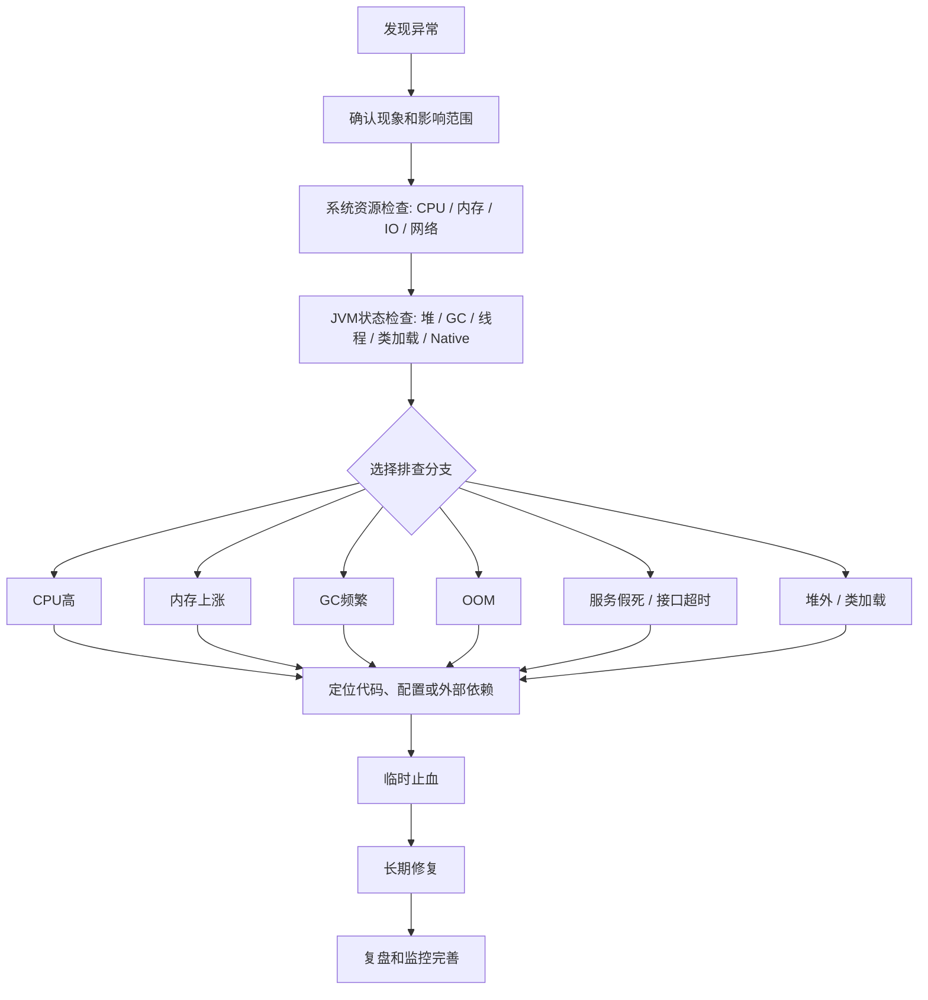

# JVM - 第 23 课：完整排查方法：现象确认、现场保留、分支定位与复盘

## 学习目标（本节结束后你能做到什么）

- 建立一套完整 JVM 排查主线，而不是一上来就 `jstack`、`jmap` 乱打。
- 能先判断异常到底是不是 JVM 问题，再判断是哪类 JVM 问题。
- 能按 CPU 高、内存上涨、GC 频繁、OOM、服务假死、堆外内存、类加载等分支定位。
- 知道生产环境为什么要先保留现场，再重启或止血。
- 能把排查过程讲成面试里的完整生产经验表达。

## 核心主线

一个完整的 JVM 排查方法，不是直接上工具，而是按这条链路走：

```text
现象确认
-> 影响范围判断
-> 系统资源检查
-> JVM 状态检查
-> 分支定位
-> 代码级根因分析
-> 临时止血
-> 长期修复
-> 复盘和监控完善
```

你可以把它理解成一句话：

**先判断是不是 JVM 问题，再判断是哪类 JVM 问题，最后用对应工具定位代码级根因。**

## 一、先做总判断：到底是不是 JVM 问题

线上服务异常时，先不要急着怀疑 JVM。第一步应该确认现象。

| 现象 | 可能方向 |
| --- | --- |
| CPU 飙高 | 死循环、频繁 GC、线程池打满、锁竞争 |
| 内存持续上涨 | Java 堆泄漏、缓存无界、对象堆积、堆外内存泄漏 |
| Full GC 频繁 | 老年代压力大、晋升失败、大对象、内存泄漏 |
| 接口超时 | 线程池耗尽、锁阻塞、下游慢、GC STW |
| 服务假死 | 死锁、线程全部阻塞、连接池耗尽 |
| OOM | Heap、Metaspace、Direct Memory、Native Memory |
| 启动慢 / 启动失败 | 类加载、配置、内存参数、依赖初始化问题 |

先看系统层面：

```bash
top
free -m
df -h
iostat -x 1
vmstat 1
netstat -antp | grep <pid>
```

重点看 Java 进程：

```bash
ps -ef | grep java
top -p <pid>
```

你要先确认：

1. 进程还在不在。
2. CPU 是不是高。
3. 内存是不是高。
4. 系统是否 swap。
5. 磁盘是否打满。
6. 网络连接是否异常。
7. 是单实例问题还是所有实例问题。

如果只有一个 Java 实例异常，大概率是进程内部问题。  
如果所有实例都异常，也可能是下游、配置、流量、数据库、Redis、MQ 或发布导致的。

## 二、保留现场：先取证，不要直接重启

很多人线上排查最大的问题是：

**服务一卡，先重启。**

这在生产上很危险，因为你把现场毁了。

正确做法是：在重启或扩容之前，先尽量保存现场数据。

常用取证命令：

```bash
jps -l
jcmd <pid> VM.version
jcmd <pid> VM.flags
jcmd <pid> VM.command_line
jcmd <pid> GC.heap_info
jcmd <pid> Thread.print > thread_dump.txt
jcmd <pid> GC.class_histogram > class_histogram.txt
```

如果怀疑内存泄漏，可以 dump 堆：

```bash
jcmd <pid> GC.heap_dump /tmp/heap.hprof
```

或者：

```bash
jmap -dump:format=b,file=/tmp/heap.hprof <pid>
```

但注意：heap dump 很重，可能导致服务短暂停顿甚至雪崩。

生产建议：

1. 优先在异常实例上 dump。
2. 如果有多副本，先摘流量再 dump。
3. 大堆内存服务不要随便 dump。
4. 更推荐提前配置 OOM 自动 dump。

```bash
-XX:+HeapDumpOnOutOfMemoryError
-XX:HeapDumpPath=/data/dump
```

同时要保留：

- GC log
- 应用日志
- 错误日志
- 线程 dump
- 堆 dump
- 监控指标
- 发布记录
- 流量变化

## 三、建立 JVM 排查主流程

可以按这个顺序来：

1. 确认现象。
2. 判断影响范围。
3. 看系统资源：CPU / 内存 / IO / 网络。
4. 看 JVM 状态：堆、GC、线程、类加载、直接内存。
5. 根据症状进入分支：CPU 高、内存高、GC 频繁、OOM、线程阻塞 / 服务假死、响应慢。
6. 定位到代码、配置或外部依赖。
7. 临时止血。
8. 根因修复。
9. 复盘和监控完善。



## 四、CPU 飙高怎么排查

### 1. 先确认 Java 进程 CPU 高

```bash
top
```

例如：

```text
PID     USER    PR  NI  VIRT  RES  SHR S %CPU %MEM TIME+ COMMAND
12345   app     20   0  8g    3g   20m S  350  20.0  java
```

说明这个 Java 进程占用了 `350%` CPU，也就是大概 `3.5` 个核。

### 2. 查看哪个线程 CPU 高

```bash
top -Hp <pid>
```

例如：

```bash
top -Hp 12345
```

假设某个高 CPU 线程 ID 是：

```text
12387
```

### 3. 把线程 ID 转成十六进制

因为 `jstack` 里面的线程 ID 是十六进制的 `nid`。

```bash
printf "%x\n" 12387
```

假设结果是：

```text
3063
```

### 4. 打线程栈并搜索

```bash
jstack <pid> > thread.txt
```

或者更推荐：

```bash
jcmd <pid> Thread.print > thread.txt
```

然后搜索：

```bash
grep -A 30 "nid=0x3063" thread.txt
```

你就能看到这个高 CPU 线程正在执行什么代码。

### 5. 判断高 CPU 原因

#### 情况一：业务代码死循环

线程栈一直停在某个业务方法：

```text
com.xxx.service.CalculateService.calculate()
com.xxx.service.RuleEngine.match()
```

而且多次 `jstack` 看到都在同一段代码附近。

这通常是：

- `while` 循环没有退出条件
- 递归过深
- 正则表达式回溯爆炸
- 大集合循环处理
- JSON 序列化对象过大
- 加密、压缩、排序等 CPU 密集任务过重

#### 情况二：GC 线程占 CPU

如果高 CPU 线程是 GC 相关线程，例如：

```text
GC Thread
G1 Conc
VM Thread
```

就要转去看 GC：

```bash
jstat -gcutil <pid> 1000
```

或者看 GC log。

如果 YGC / FGC 很频繁，CPU 高可能不是业务线程导致的，而是 JVM 在疯狂 GC。

#### 情况三：锁竞争严重

线程栈里大量出现：

```text
BLOCKED
waiting to lock
```

或者：

```text
java.util.concurrent.locks.AbstractQueuedSynchronizer
```

说明很多线程在竞争同一把锁。

可以用：

```bash
jcmd <pid> Thread.print -l
```

看锁信息。

也可以用 Arthas：

```bash
thread -b
```

看当前阻塞其他线程的线程。

### 6. CPU 高的止血方式

临时处理：

- 限流
- 降级
- 扩容
- 摘掉异常实例
- 重启异常实例
- 关闭问题功能开关
- 回滚最近发布

长期修复：

- 修复死循环代码
- 优化算法复杂度
- 缩小锁粒度
- 使用异步化
- 增加缓存
- 优化正则
- 优化 GC 参数
- 拆分大任务

## 五、内存持续上涨怎么排查

内存问题分很多种，不能只看 `top` 里的 `RES`。

Java 内存大概分为：

- Java Heap
- Metaspace
- Direct Memory
- Thread Stack
- Code Cache
- JNI / Native Memory
- GC 内部结构

所以看到内存上涨，要先判断是：

1. Java 堆上涨。
2. 堆外内存上涨。
3. Metaspace 上涨。
4. 线程太多导致栈内存上涨。
5. Native Memory 泄漏。

### 1. 看堆使用情况

```bash
jstat -gcutil <pid> 1000
```

输出类似：

```text
S0     S1     E      O      M     CCS    YGC   YGCT   FGC   FGCT   GCT
0.00   50.00  80.00  92.00  95.00 90.00 1200  30.2   12    8.3    38.5
```

重点看：

| 字段 | 含义 |
| --- | --- |
| E | Eden 区使用率 |
| O | Old 老年代使用率 |
| M | Metaspace 使用率 |
| YGC | Young GC 次数 |
| FGC | Full GC 次数 |
| GCT | GC 总耗时 |

如果老年代 `O` 一直上涨，并且 Full GC 后也降不下来，强烈怀疑内存泄漏。

### 2. 看堆对象分布

轻量方式：

```bash
jcmd <pid> GC.class_histogram > histo.txt
```

或者：

```bash
jmap -histo:live <pid> > histo.txt
```

注意：

```bash
jmap -histo:live
```

会触发 Full GC，生产慎用。

你要看哪些类实例数量巨大：

```text
num     #instances         #bytes      class name
1       5000000            800000000   java.lang.String
2       3000000            600000000   com.xxx.UserSession
3       2000000            400000000   byte[]
```

如果业务对象异常多，比如：

```text
com.xxx.OrderDTO
com.xxx.UserContext
com.xxx.CacheItem
```

就要怀疑：

- 缓存没有过期
- `Map` / `List` 只增不删
- `ThreadLocal` 没有 `remove`
- 监听器、回调、`Future` 没释放
- 消息堆积
- 大对象被静态变量引用
- 本地缓存 Caffeine / Guava 配置不合理

### 3. Dump 堆分析

```bash
jcmd <pid> GC.heap_dump /tmp/heap.hprof
```

然后用 MAT 或 JProfiler 分析。

MAT 里重点看：

- Leak Suspects Report
- Dominator Tree
- Retained Heap
- GC Roots
- Path to GC Roots

关键概念：

| 概念 | 解释 |
| --- | --- |
| Shallow Heap | 对象本身占用内存 |
| Retained Heap | 这个对象被回收后能释放的总内存 |
| GC Root | 导致对象无法被回收的根引用 |
| Dominator Tree | 谁持有了最多内存 |

排查内存泄漏时，真正重要的是 `Retained Heap`，不是 `Shallow Heap`。

例如你看到：

```text
ConcurrentHashMap retained size: 2GB
```

然后一路看引用链：

```text
Static field CacheManager.localCache
 -> ConcurrentHashMap
 -> UserSession
 -> List<OrderDTO>
```

这就说明本地缓存可能无界增长。

### 4. 常见 Java 堆泄漏场景

#### 本地缓存无上限

```java
private static final Map<String, Object> CACHE = new ConcurrentHashMap<>();
```

如果一直 `put`，不清理，就会泄漏。

解决：

```java
Caffeine.newBuilder()
    .maximumSize(10000)
    .expireAfterWrite(10, TimeUnit.MINUTES)
    .build();
```

#### ThreadLocal 没有 remove

```java
threadLocal.set(userContext);
```

线程池里的线程不会销毁，如果不 `remove`，数据会长期挂在线程上。

正确写法：

```java
try {
    threadLocal.set(context);
    // business logic
} finally {
    threadLocal.remove();
}
```

#### 消息队列消费堆积

比如消费者慢，内存里积压大量消息对象。

表现：

```text
List<Message>
BlockingQueue
LinkedBlockingQueue
```

解决：

- 限制队列长度
- 增加消费者
- 降低单条消息大小
- 做背压
- 避免无限队列

#### 大对象被静态变量引用

```java
public static List<BigObject> list = new ArrayList<>();
```

只要 `static` 引用存在，这些对象就不会被 GC。

## 六、GC 频繁怎么排查

GC 问题是 JVM 排查核心。

### 1. 先看 GC 频率

```bash
jstat -gcutil <pid> 1000
```

观察：

- Young GC 是否过于频繁
- Full GC 是否频繁
- Old 区是否一直很高
- Metaspace 是否很高
- GC 时间占比是否过高

### 2. 判断是哪种 GC 问题

#### Young GC 频繁

常见原因：

- 请求量大，对象创建太快
- Eden 区太小
- 短生命周期对象太多
- 大量临时对象，比如字符串拼接、JSON 解析、大集合转换
- 新生代配置不合理

可能表现：

```text
YGC 每秒都在增加
FGC 不多
Old 区不高
```

优化方向：

- 减少临时对象创建
- 优化批处理大小
- 调大新生代
- 对象复用要谨慎，不要为了复用制造并发问题
- 优化 JSON、日志、集合操作

#### Full GC 频繁

常见原因：

- 老年代满
- 内存泄漏
- 大对象直接进入老年代
- 晋升失败
- Metaspace 满
- `System.gc` 被调用
- 堆配置过小

表现：

```text
FGC 不断增加
Old 区 Full GC 后仍然降不下来
接口明显卡顿
```

排查：

```bash
jstat -gcutil <pid> 1000
jcmd <pid> GC.heap_info
jcmd <pid> GC.class_histogram
```

同时分析 GC log。

### 3. 开启 GC 日志

JDK 8 常见配置：

```bash
-XX:+PrintGCDetails
-XX:+PrintGCDateStamps
-Xloggc:/data/logs/gc.log
```

JDK 9+：

```bash
-Xlog:gc*:file=/data/logs/gc.log:time,uptime,level,tags
```

看 GC log 时重点关注：

| 指标 | 含义 |
| --- | --- |
| GC 频率 | 是否过于频繁 |
| GC pause | 单次暂停多久 |
| Full GC 次数 | 是否异常 |
| Old 区回收前后 | 是否回收有效 |
| Humongous object | G1 下是否有大对象 |
| Allocation Failure | 分配失败 |
| Promotion Failed | 晋升失败 |
| Metadata GC Threshold | Metaspace 触发 |

### 4. GC 问题的典型判断

**Full GC 后 Old 区明显下降**：说明不是明显泄漏，可能只是瞬时流量高或堆太小。

**Full GC 后 Old 区几乎不下降**：高度怀疑内存泄漏。

**Young GC 很频繁，但 Old 区稳定**：大概率是对象创建太快，新生代压力大。

**Metaspace 一直涨**：可能是动态生成类太多、ClassLoader 泄漏、CGLIB / ByteBuddy / Groovy / JSP / 热部署问题，或者频繁加载脚本和规则类。

## 七、OOM 怎么排查

OOM 不等于都是 Java 堆内存溢出。

常见 OOM 类型：

```text
java.lang.OutOfMemoryError: Java heap space
java.lang.OutOfMemoryError: GC overhead limit exceeded
java.lang.OutOfMemoryError: Metaspace
java.lang.OutOfMemoryError: Direct buffer memory
java.lang.OutOfMemoryError: unable to create new native thread
java.lang.OutOfMemoryError: Requested array size exceeds VM limit
```

不同 OOM 排查方法完全不同。

### 1. Java heap space

说明 Java 堆不够。

排查：

```bash
jstat -gcutil <pid> 1000
jcmd <pid> GC.heap_dump /tmp/heap.hprof
```

分析：

- 是否有大对象
- 是否有缓存泄漏
- 是否有集合无限增长
- 是否有请求对象堆积
- 是否有 `ThreadLocal` 泄漏

解决：

- 修复泄漏
- 控制缓存大小
- 分页处理
- 流式处理
- 调整 `-Xmx`
- 避免一次性加载大量数据

### 2. GC overhead limit exceeded

说明 JVM 大部分时间都在 GC，但回收效果很差。

本质通常是：

**堆快满了，GC 回收不掉。**

排查方式和 `Java heap space` 类似。

### 3. Metaspace OOM

错误：

```text
java.lang.OutOfMemoryError: Metaspace
```

常见原因：

- 动态代理类太多
- 反射生成类太多
- ClassLoader 泄漏
- 热部署没有卸载旧 ClassLoader
- 脚本引擎动态编译类

查看：

```bash
jstat -gcutil <pid> 1000
jcmd <pid> VM.classloader_stats
jcmd <pid> GC.class_histogram
```

解决：

- 限制动态类生成
- 修复 ClassLoader 泄漏
- 调整 `-XX:MaxMetaspaceSize=512m`

但注意，单纯调大不是根治。

### 4. Direct buffer memory

错误：

```text
java.lang.OutOfMemoryError: Direct buffer memory
```

常见于：

- Netty
- NIO
- `ByteBuffer.allocateDirect`
- Kafka client
- gRPC
- 大量堆外缓冲区未释放

查看 JVM 参数：

```bash
jcmd <pid> VM.flags
```

看是否设置：

```bash
-XX:MaxDirectMemorySize
```

如果没有设置，默认通常和最大堆有关。

Netty 场景下要重点看：

- `ByteBuf` 是否 `release`
- 是否使用池化内存
- 是否有内存泄漏日志
- direct memory 上限是否合理

可以加：

```bash
-Dio.netty.leakDetection.level=advanced
```

但生产开启要谨慎，有性能损耗。

### 5. unable to create new native thread

错误：

```text
java.lang.OutOfMemoryError: unable to create new native thread
```

这不是 Java 堆不够，而是无法创建操作系统线程。

常见原因：

- 线程数太多
- 线程池无界增长
- OS 用户线程数限制
- 容器资源限制
- 每个线程栈太大

查看线程数：

```bash
ps -eLf | grep <pid> | wc -l
```

查看限制：

```bash
ulimit -a
```

查看 JVM 线程栈参数：

```bash
jcmd <pid> VM.flags | grep ThreadStackSize
```

解决：

- 修复线程池配置
- 禁止无限创建线程
- 调小 `-Xss`
- 调整系统线程数限制
- 检查容器 CPU / memory limit
- 用异步或队列削峰

典型风险代码：

```java
Executors.newCachedThreadPool()
```

如果请求暴涨，线程可能疯狂创建。

更安全：

```java
new ThreadPoolExecutor(
    20,
    100,
    60,
    TimeUnit.SECONDS,
    new ArrayBlockingQueue<>(1000),
    new ThreadPoolExecutor.CallerRunsPolicy()
);
```

## 八、接口变慢 / 服务假死怎么排查

服务假死通常不是 JVM 进程死了，而是：

**进程还在，但请求处理不了。**

常见原因：

- 线程池打满
- Tomcat / Jetty 工作线程耗尽
- 数据库连接池耗尽
- Redis 连接池耗尽
- 下游接口慢
- 锁竞争
- 死锁
- Full GC STW
- MQ 消费线程阻塞

### 1. 打线程栈

```bash
jcmd <pid> Thread.print > thread.txt
```

最好连续打 3 次：

```bash
jcmd <pid> Thread.print > thread1.txt
sleep 5
jcmd <pid> Thread.print > thread2.txt
sleep 5
jcmd <pid> Thread.print > thread3.txt
```

为什么要打多次？

因为一次线程栈只是瞬间快照。  
多次都卡在同一个位置，才能说明问题。

### 2. 看线程状态

| 状态 | 含义 |
| --- | --- |
| RUNNABLE | 正在运行或等待 CPU / IO |
| BLOCKED | 等 `synchronized` 锁 |
| WAITING | 无限等待 |
| TIMED_WAITING | 定时等待 |
| NEW | 新建 |
| TERMINATED | 结束 |

重点看：

- 大量线程 `BLOCKED`
- 大量线程 `WAITING`
- 大量线程卡在数据库调用
- 大量线程卡在 Redis 调用
- 大量线程卡在 HTTP 调用
- 大量线程卡在日志输出

### 3. 常见线程栈判断

#### 大量线程卡在数据库

```text
com.mysql.cj.jdbc.ClientPreparedStatement.execute
com.zaxxer.hikari.pool.HikariPool.getConnection
```

可能原因：

- SQL 慢
- DB 连接池耗尽
- 事务太长
- 数据库锁等待
- 下游 DB 抖动

要继续查：

- Hikari 连接池指标
- 慢 SQL
- DB 活跃连接数
- DB 锁等待
- 最近是否有大查询上线

#### 大量线程卡在 Redis

```text
redis.clients.jedis
io.lettuce.core
```

可能原因：

- Redis 慢查询
- 大 key
- 网络抖动
- 连接池耗尽
- pipeline 使用不当

#### 大量线程卡在 HTTP 下游

```text
java.net.SocketInputStream.socketRead0
org.apache.http
okhttp3
```

说明线程在等下游响应。

要看：

- 下游是否超时
- 连接池是否满
- 超时时间是否过长
- 是否没有设置 read timeout
- 是否有重试风暴

很常见的坑是：

**没有设置 timeout，导致线程长期挂死。**

#### 大量线程 BLOCKED

```text
BLOCKED waiting to lock <0x00000000>
```

说明锁竞争严重。

用：

```bash
jcmd <pid> Thread.print -l
```

看谁持有锁。

Arthas 更方便：

```bash
thread -b
```

### 4. 死锁排查

`jstack` 或 `jcmd Thread.print` 通常会直接提示：

```text
Found one Java-level deadlock:
```

典型代码：

```java
synchronized (lockA) {
    synchronized (lockB) {
    }
}

synchronized (lockB) {
    synchronized (lockA) {
    }
}
```

解决：

- 固定加锁顺序
- 减小锁范围
- 使用 `tryLock`
- 避免锁内调用外部服务
- 避免嵌套锁

## 九、堆外内存 / Native Memory 怎么排查

有时候你看到：

```text
top 里 RES 很高
但是 jstat 看 Java heap 不高
```

这时候可能是堆外内存或 native memory 问题。

先看 JVM 是否开启 NMT：

```bash
jcmd <pid> VM.native_memory summary
```

如果没开启，会提示不可用。

需要启动参数：

```bash
-XX:NativeMemoryTracking=summary
```

或者更详细：

```bash
-XX:NativeMemoryTracking=detail
```

然后查看：

```bash
jcmd <pid> VM.native_memory summary
```

重点看：

- Java Heap
- Class
- Thread
- Code
- GC
- Compiler
- Internal
- Symbol
- Native Memory Tracking
- Arena Chunk

如果 `Thread` 很高，可能线程太多。  
如果 `Class` 很高，可能类加载问题。  
如果 `Internal` 或 direct memory 高，要结合 Netty / NIO / Unsafe 查。

## 十、类加载问题怎么排查

类加载相关问题常见于：

- Metaspace OOM
- 服务启动慢
- 动态代理多
- 热部署
- 插件化系统
- Groovy / Janino / CGLIB / ByteBuddy

查看类加载数量：

```bash
jstat -class <pid> 1000
```

输出：

```text
Loaded  Bytes  Unloaded  Bytes     Time
50000   ...    100       ...       ...
```

如果 `Loaded` 一直涨，说明类还在不断加载。

查看 ClassLoader：

```bash
jcmd <pid> VM.classloader_stats
```

重点看是否有大量自定义 ClassLoader 没有释放。

## 十一、推荐工具体系

### JDK 自带工具

| 工具 | 作用 |
| --- | --- |
| `jps` | 查看 Java 进程 |
| `jcmd` | 综合诊断工具，推荐优先使用 |
| `jstack` | 打线程栈 |
| `jmap` | dump 堆、看对象分布 |
| `jstat` | 看 GC、类加载、编译统计 |
| `jinfo` | 查看 JVM 参数 |
| `jconsole` | 图形化监控 |
| `jvisualvm` | 本地分析 |
| JFR | Java Flight Recorder |
| JMC | Java Mission Control |

现在更推荐 `jcmd`，因为它统一、功能强，而且比一堆老命令更好用。

### 线上神器：Arthas

如果公司允许，Arthas 很好用。

常用命令：

```bash
dashboard
thread
thread -b
jvm
memory
heapdump
watch
trace
stack
monitor
jad
```

例如看最忙线程：

```bash
thread -n 5
```

看阻塞线程：

```bash
thread -b
```

观察方法入参返回值：

```bash
watch com.xxx.UserService getUser "{params, returnObj}" -x 3
```

看方法调用耗时链路：

```bash
trace com.xxx.OrderService createOrder
```

它特别适合定位：

- 哪个方法慢
- 哪个线程卡住
- 参数是不是异常
- 是否走到了错误分支
- 某个类是否被加载
- 某个方法调用次数是否异常

### 性能分析工具

| 工具 | 适用场景 |
| --- | --- |
| async-profiler | CPU 火焰图、锁、分配分析 |
| JFR | 低开销线上诊断 |
| MAT | heap dump 分析 |
| JProfiler | 商业性能分析 |
| VisualVM | 本地基础分析 |
| GCViewer / GCeasy | GC 日志分析 |

CPU 高时，火焰图非常有用。

例如 async-profiler：

```bash
./profiler.sh -d 30 -e cpu -f cpu.html <pid>
```

如果怀疑对象分配过快：

```bash
./profiler.sh -d 30 -e alloc -f alloc.html <pid>
```

## 十二、完整案例：接口突然超时

### 第一步：确认现象

看监控：

```text
P99 延迟升高
错误率升高
CPU 不高
内存不高
Full GC 没明显增加
```

说明不一定是 GC。

### 第二步：看线程

```bash
jcmd <pid> Thread.print > thread.txt
```

发现大量线程：

```text
java.net.SocketInputStream.socketRead0
org.apache.http.impl.conn
com.xxx.PaymentClient.call
```

说明大量请求卡在下游 HTTP 调用。

### 第三步：确认连接池和超时

检查代码发现：

**RestTemplate 没有设置 readTimeout。**

于是下游慢时，请求线程一直挂住。

### 第四步：临时止血

- 降级支付状态查询
- 限流
- 摘掉异常实例
- 扩容
- 调短超时时间
- 暂停重试

### 第五步：长期修复

- 设置连接超时和读超时
- 增加熔断
- 增加隔离线程池
- 增加下游 SLA 监控
- 避免无限重试
- 增加 fallback
- 压测验证

## 十三、完整案例：Full GC 频繁

### 第一步：看现象

```bash
jstat -gcutil <pid> 1000
```

发现：

```text
O 区 95%
FGC 不断增加
Full GC 后 O 区仍然 93%
```

说明老年代回收不掉。

### 第二步：看对象分布

```bash
jcmd <pid> GC.class_histogram > histo.txt
```

发现：

```text
com.xxx.UserSession  数量 300 万
ConcurrentHashMap    retained 很大
```

### 第三步：dump 堆

```bash
jcmd <pid> GC.heap_dump /tmp/heap.hprof
```

MAT 分析发现引用链：

```text
CacheManager.staticCache
 -> ConcurrentHashMap
 -> UserSession
 -> UserProfile
```

说明本地缓存没有淘汰策略。

### 第四步：临时止血

- 重启释放内存
- 减少流量
- 临时关闭缓存功能
- 扩容
- 调大堆作为临时缓冲

### 第五步：长期修复

- 改为 Caffeine
- 设置最大容量
- 设置过期时间
- 增加缓存命中率和大小监控
- 加入压测
- 增加 OOM 自动 heap dump

## 十四、生产环境 JVM 参数建议

至少建议配置：

```bash
-Xms4g
-Xmx4g
-XX:+HeapDumpOnOutOfMemoryError
-XX:HeapDumpPath=/data/dump
-Xlog:gc*:file=/data/logs/gc.log:time,uptime,level,tags
```

JDK 8：

```bash
-XX:+PrintGCDetails
-XX:+PrintGCDateStamps
-Xloggc:/data/logs/gc.log
```

如果要查 native memory：

```bash
-XX:NativeMemoryTracking=summary
```

如果是容器环境，还要注意：

```bash
-XX:MaxRAMPercentage
-XX:InitialRAMPercentage
```

不要只看机器内存，要看容器 limit。

## 十五、排查时的几个重要原则

### 1. 先整体，后局部

不要一开始就钻到某个代码细节。

先回答：

- 是 CPU？
- 是内存？
- 是 GC？
- 是线程？
- 是 IO？
- 是下游？
- 是发布？
- 是流量？

### 2. 先保现场，再重启

重启可以止血，但不能定位根因。

至少保留：

- 线程 dump
- GC log
- heap histogram
- 应用日志
- 监控截图
- 发布记录

### 3. 多打几次线程栈

一次线程栈不可靠。

建议：

```bash
jcmd <pid> Thread.print > t1.txt
sleep 5
jcmd <pid> Thread.print > t2.txt
sleep 5
jcmd <pid> Thread.print > t3.txt
```

如果三次都卡在同一个位置，可信度高很多。

### 4. 不要随便在线上 dump 大堆

heap dump 可能导致停顿。

特别是几十 GB 堆的服务，dump 可能非常危险。

更安全做法：

1. 摘流量。
2. 低峰执行。
3. 只在异常副本执行。
4. 先用 histogram 初步判断。
5. 必要时再 dump。

### 5. 结合业务上下文

JVM 工具只能告诉你：

- 线程在哪里
- 对象在哪里
- 内存被谁引用
- GC 为什么频繁

但真正的根因通常在业务逻辑：

- 为什么缓存没有过期？
- 为什么请求突然变大？
- 为什么队列消费不过来？
- 为什么下游超时？
- 为什么锁粒度这么大？
- 为什么最近发布引入了问题？

## 十六、面试中可以这样回答

如果面试官问：

**你线上遇到 JVM 问题一般怎么排查？**

可以这样说：

> 我一般不会一上来就直接 dump，而是先从现象和影响范围开始。首先确认是单实例还是多实例，是 CPU 高、内存高、GC 频繁、接口超时还是服务假死。然后通过 `top`、`ps`、`free`、`vmstat` 判断系统资源，再用 `jps` 或 `jcmd` 找到 Java 进程，查看 JVM 参数、GC 状态、线程状态和堆使用情况。
>
> 如果是 CPU 高，我会用 `top -Hp` 找到高 CPU 线程，把线程 ID 转成十六进制，再用 `jstack` 或 `jcmd Thread.print` 找到对应线程栈，判断是业务死循环、锁竞争还是 GC 线程占用。
>
> 如果是内存问题，我会先用 `jstat -gcutil` 看新生代、老年代、Metaspace 和 GC 频率。如果老年代 Full GC 后仍然降不下来，就怀疑内存泄漏。然后用 `jcmd GC.class_histogram` 看对象分布，必要时 dump heap，用 MAT 分析 Dominator Tree、Retained Heap 和 GC Roots，定位是哪类对象被谁引用。
>
> 如果是接口超时或服务假死，我会连续打几次线程 dump，看大量线程是 `BLOCKED`、`WAITING`，还是卡在数据库、Redis、HTTP 调用、连接池获取或者锁竞争上。如果有死锁，`jstack` 通常能直接发现。
>
> 最后定位后，我会先做止血，比如限流、降级、扩容、摘实例、回滚，然后再做根因修复，比如优化代码、调整线程池、修复缓存泄漏、优化 GC 参数、增加超时和熔断。问题解决后还要补监控，包括 GC 次数、GC 耗时、堆使用率、线程数、连接池、接口延迟和 OOM 自动 dump。

这个回答比较完整，既有流程，也有工具，也有线上意识。

## 十七、记忆口诀

可以记住这一版：

```text
先看现象，再看范围；
先保现场，再做止血；
CPU 看线程，内存看对象；
GC 看日志，卡死看栈；
OOM 分类型，堆外别漏看；
定位到代码，最后做复盘。
```

更工程化一点就是：

```text
现象确认
-> 系统资源检查
-> JVM 指标检查
-> 线程栈 / GC / 堆分析
-> 定位根因
-> 临时止血
-> 代码或参数修复
-> 压测验证
-> 监控告警补齐
```

面试里只要能围绕这条线讲，再穿插一两个真实例子，比如 CPU 高通过 `top -Hp + jstack` 定位死循环，或者 Full GC 频繁通过 heap dump 发现缓存泄漏，基本就很像有生产经验的人了。

## 小结

- JVM 排查不要从工具开始，要从现象、影响范围和系统资源开始。
- 生产上先保留现场，再重启止血，否则根因证据会丢。
- CPU 高看线程，内存上涨看对象，GC 频繁看日志和 GC 后水位，服务假死看线程栈。
- OOM 必须分类型处理，Heap、Metaspace、Direct Memory、Native Thread 的根因完全不同。
- JVM 工具只能给证据，最终根因通常要回到业务代码、配置、下游依赖和最近发布。
