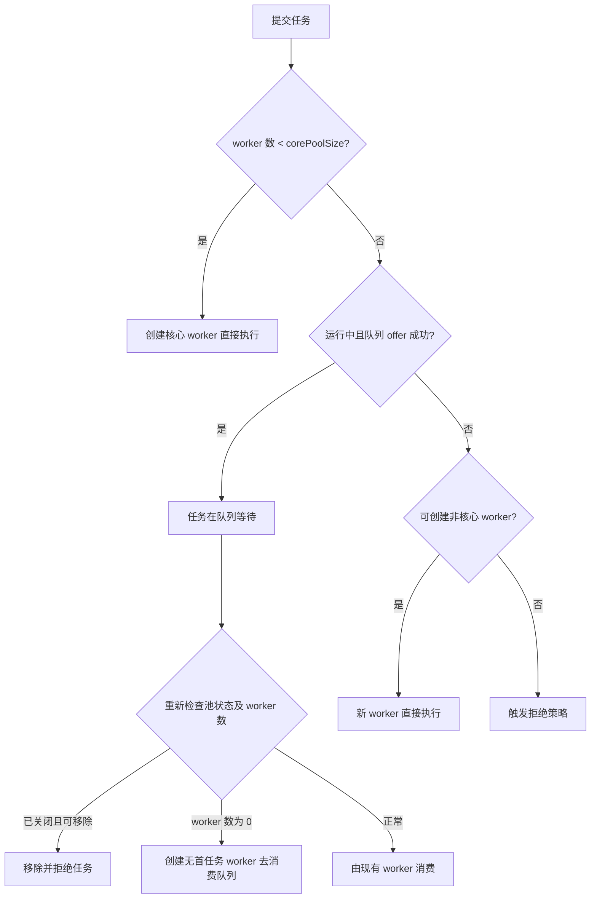

# Java - 第 6 课：线程池、`submit` / `execute` 与参数设计

## 学习目标（本节结束后你能做到什么）

- 从资源控制而不是“少写几个 `new Thread`”的角度解释线程池价值。
- 说清 `ThreadPoolExecutor` 七个构造参数以及任务提交路径。
- 解释有界队列、最大线程数、拒绝策略怎样共同形成背压。
- 区分 `execute`、`submit`、`shutdown`、`shutdownNow` 的工程语义。
- 结合平台线程与虚拟线程，判断什么时候该配置池，什么时候该限制下游资源。

## 内容讲解（核心概念，用类比、例子、图示说清楚）

### 1. 线程池解决的核心问题是资源预算

对于传统平台线程，创建一个线程不仅是创建一个 Java 对象，还涉及栈空间、操作系统线程和调度成本。请求一来就新建线程，在流量突增时会把风险放大成：

- 线程数量失控，内存和上下文切换成本飙升。
- 数据库、RPC 下游本来只能承受有限并发，却被同时压入更多请求。
- 任务没有明确的排队与拒绝边界，延迟先恶化，随后服务整体不可用。

因此线程池的真正职责是：

1. 复用或管理执行线程。
2. 明确允许同时运行多少任务。
3. 明确来不及处理的任务在哪里等待。
4. 明确系统过载时怎样反馈压力，而不是无限吞任务。

这也是为什么线程池参数不是“性能玄学”，而是容量设计的一部分。

### 2. `ThreadPoolExecutor` 的七个参数

生产代码中，理解原始构造器比只记 `Executors` 工厂方法更有价值：

```java
ThreadPoolExecutor pool = new ThreadPoolExecutor(
        8,                              // corePoolSize
        16,                             // maximumPoolSize
        30, TimeUnit.SECONDS,           // keepAliveTime, unit
        new ArrayBlockingQueue<>(200),  // workQueue
        runnable -> {
            Thread thread = new Thread(runnable);
            thread.setName("order-query-worker");
            return thread;
        },                              // threadFactory
        new ThreadPoolExecutor.CallerRunsPolicy() // handler
);
```

| 参数 | 含义 | 设计时真正要问的问题 |
| --- | --- | --- |
| `corePoolSize` | 首选承载任务的工作线程数 | 稳态业务允许并行运行多少任务？ |
| `maximumPoolSize` | 队列接不住时最多扩到多少线程 | 峰值时下游还能承受多少额外并发？ |
| `keepAliveTime` / `unit` | 默认回收超过核心数的空闲线程所需时间 | 峰值扩出的资源多久后回收？ |
| `workQueue` | 核心线程已占用时等待的任务容器 | 可以接受多少排队延迟与内存占用？ |
| `threadFactory` | 创建工作线程的策略 | 线程能否被定位、打点、设置异常处理器？ |
| `handler` | 无法接收新任务时的处理策略 | 过载时是失败、降速，还是允许丢任务？ |

默认情况下核心线程也会在空闲时保留；调用 `allowCoreThreadTimeOut(true)` 后，它们也可按超时时间回收。

### 3. 提交一个任务到底走哪条路

`ThreadPoolExecutor.execute(command)` 的主流程比“先排队再开线程”更精确：



这里有三个面试中很容易漏掉的细节：

1. **核心线程忙了以后，优先尝试入队，而不是立刻扩到最大线程数。**
2. **只有队列拒绝任务时，`maximumPoolSize` 才通常开始发挥作用。** 如果使用近似无界队列，最大线程数往往不会救你，风险会转化为任务无限堆积。
3. **任务入队成功后仍要复检状态。** 线程池可能恰好在入队后关闭；或者 `corePoolSize == 0` 且没有 worker，此时必须 `addWorker(null, false)` 启动一个消费者，否则队列里有任务却无人执行。

### 4. 队列不是缓存垃圾桶，而是延迟预算

不同队列把压力导向不同位置：

| 队列选择 | 行为特征 | 适用判断 |
| --- | --- | --- |
| `ArrayBlockingQueue` | 明确容量、数组布局 | 希望限制积压并提前触发背压的常见生产选项 |
| 有界 `LinkedBlockingQueue` | 链表节点，有容量上限 | 需要较大缓冲但仍必须设置边界 |
| `SynchronousQueue` | 不存任务，提交方直接交接 worker | 希望快速扩线程或快速拒绝，任务不宜排队 |
| 无界队列 | 提交方很少被拒绝 | 容易把过载隐藏为堆积和长尾延迟，不宜作为默认生产选择 |

假设单任务平均等待中的内存占用为 20 KB，队列允许积压 50,000 个任务，光排队对象就可能接近 1 GB，还没有算上下文对象、响应缓冲和 GC 成本。所谓“队列大一点更稳”，常常只是让故障更晚暴露、却更难恢复。

### 5. 四种拒绝策略表达的是业务决策

| 策略 | 行为 | 适合的语义 |
| --- | --- | --- |
| `AbortPolicy` | 抛出 `RejectedExecutionException` | 调用方必须感知失败、重试或降级 |
| `CallerRunsPolicy` | 由提交线程同步执行任务，池关闭时丢弃 | 允许拖慢上游形成自然反压，且任务不能静默消失 |
| `DiscardPolicy` | 静默丢弃新任务 | 明确可丢的采样、刷新类任务，并配有丢弃指标 |
| `DiscardOldestPolicy` | 丢弃队首任务后重试提交 | 旧任务失去价值的少数场景；需非常谨慎 |

核心交易、写库、消息确认这类任务，不能因为策略名字方便就使用静默丢弃。更成熟的设计是让拒绝成为可观测业务结果：计数、告警、降级、返回过载响应或写入具备持久性的缓冲系统。

### 6. `execute` 与 `submit`：异常能否被看见是关键差异

`execute(Runnable)` 提交的是一个没有返回值的任务。如果任务未自行捕获运行时异常，异常会从 worker 执行链路暴露给线程的异常处理机制，出问题的 worker 随后可能被替换。

`submit(...)` 会把任务包装为 `FutureTask` 并返回 `Future`：

```java
Future<Order> future = pool.submit(() -> loadOrder(id));
try {
    Order order = future.get();
} catch (ExecutionException e) {
    Throwable taskFailure = e.getCause();
    // 记录或转换任务异常
}
```

任务抛出的异常会成为 `Future` 的失败结果；如果调用方从不 `get()`、也没有额外埋点，异常很容易变成没有人观察的失败。因此：

- 需要结果、超时或取消控制时用 `submit`。
- 只想执行副作用任务时可以用 `execute`，但应配置日志与异常监控。
- 不要因为用了 `submit` 就以为异常自然会进入日志。

第 3 课已经解释 `Future` 与 `CompletableFuture` 的结果编排；本课关注它们提交到执行资源后的容量边界。

### 7. 正确关闭与取消：中断是一种请求，不是强杀

```java
pool.shutdown();
if (!pool.awaitTermination(30, TimeUnit.SECONDS)) {
    List<Runnable> queued = pool.shutdownNow();
    // 记录未开始任务，按业务决定补偿方式
}
```

| 方法 | 含义 |
| --- | --- |
| `shutdown()` | 不再接受新任务；已提交任务继续执行，空闲 worker 会被中断以推动退出 |
| `shutdownNow()` | 尝试中断正在执行的 worker，并返回尚未开始的队列任务 |
| `Future.cancel(true)` | 尝试通过中断取消指定任务 |

中断要求任务配合：阻塞方法可能抛出 `InterruptedException`，循环任务应检查中断标记并及时退出，捕获异常后若不结束应恢复中断状态。一个忽略中断、持续死循环或被不可取消外部调用卡住的任务，不会因为方法名带 `Now` 就立即消失。

### 8. 参数如何估：先看瓶颈，再做压测

不要将“CPU 核数加一”或“IO 任务乘二”当成万能公式。更可靠的思路是：

1. 识别任务是 CPU 计算、等待下游，还是两者混合。
2. 明确下游硬约束，例如连接池只有 30 个连接，就不要让 300 个数据库任务同时运行。
3. 用期望吞吐与平均处理时间估算并发在途量：`并发数约等于吞吐量 x 平均响应时间`。
4. 队列容量由可以接受的排队时间和故障缓冲窗口倒推，而不是尽量大。
5. 通过压测与线上指标校准配置。

线程池至少应观测：

- `activeCount`、`poolSize`、`largestPoolSize`
- 队列当前长度与等待时长
- completed task 数、任务运行耗时
- 拒绝次数、调用方超时、下游连接池占用

只有同时看执行池与下游资源，才不会把“线程池没拒绝”误判为系统健康。

### 9. 线程池与虚拟线程怎样分工

本课的固定容量线程池主要用于**平台线程**和受限资源并发控制。第 5 课讲过，虚拟线程足够轻时，经常采用“每任务一个虚拟线程”：

```java
try (var executor = Executors.newVirtualThreadPerTaskExecutor()) {
    Future<Result> result = executor.submit(this::callRemote);
}
```

这时无需为了复用线程而把虚拟线程装进一个小池子；真正还要限制的是数据库连接、外部接口 QPS 或 CPU 密集任务。常用手段可能是 `Semaphore`、连接池容量、限流器或专门的 CPU 执行器。

结论不是“有虚拟线程就不要线程池”，而是：

- 平台线程昂贵，线程池承担线程与并发预算。
- 虚拟线程便宜，但外部资源并没有变便宜，仍需限流与背压。

### 10. 常见误区纠正

| 误区 | 更准确的理解 |
| --- | --- |
| 队列越大越抗峰值 | 队列消耗内存并增加延迟，容量必须对应可接受的等待预算 |
| `maximumPoolSize` 配很大就能扩容 | 近似无界队列会让任务一直排队，最大线程数难以触发 |
| `submit` 的异常一定会自动打印 | 异常封装在 `Future` 中，未观察就可能静默丢失 |
| `shutdownNow()` 能立刻杀掉任务 | 它主要依赖中断，任务必须协作退出 |
| 虚拟线程也应放入固定小池复用 | 通常一任务一虚拟线程；限制应放在稀缺资源处 |

### 11. 面试表达模板

> `ThreadPoolExecutor` 的价值是把平台线程和任务积压控制在明确预算内。它有核心线程数、最大线程数、保活时间、工作队列、线程工厂和拒绝策略等参数。提交任务时先尝试创建核心 worker；核心数已满后优先入队；队列放不下才扩到最大线程数；仍无法接收则执行拒绝策略。生产中通常选择可控线程数、有界队列、有命名的线程工厂，并把拒绝和排队时长纳入监控。`submit` 将异常包装在 `Future` 中，需要调用方观察；关闭和取消依靠任务正确响应中断。虚拟线程降低了等待型任务占用平台线程的成本，但不能替代对数据库、下游和 CPU 的容量限制。

## 小结（3-5 条关键点）

1. 线程池首先是资源和过载行为的设计，不只是线程复用工具。
2. 提交流程是核心 worker、队列、非核心 worker、拒绝；队列类型会改变整个容量模型。
3. 有界队列与可观测拒绝策略比无边界“先接进来”更可控。
4. `submit` 的异常需要观察，`shutdownNow` 与取消都依赖中断协作。
5. 虚拟线程改变了线程成本，但没有消除下游限流和背压问题。

## 问题（检测你对当前章节内容是否了解）

1. 为什么使用无界队列时，`maximumPoolSize` 常常几乎不起扩容作用？
2. 任务成功放入队列后，`ThreadPoolExecutor` 为什么还要再次检查状态和 worker 数？
3. `CallerRunsPolicy` 如何形成背压，它不适合哪些调用链？
4. `submit()` 提交的任务抛异常，而代码从不调用 `Future.get()`，会产生什么排障风险？
5. 在虚拟线程服务中，为什么仍可能需要 `Semaphore` 或连接池容量控制？
