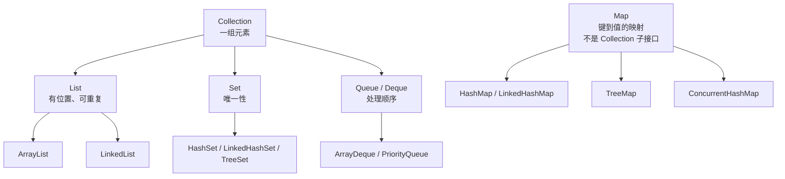
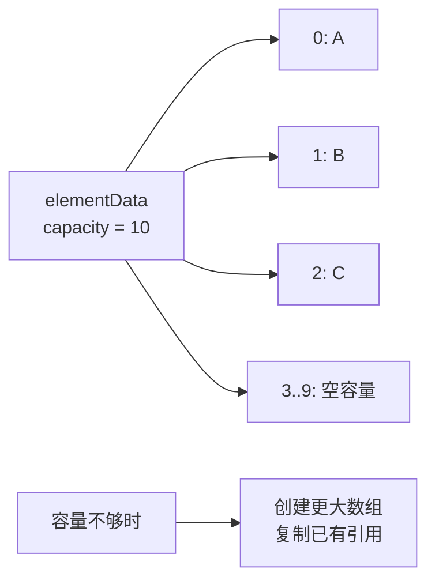
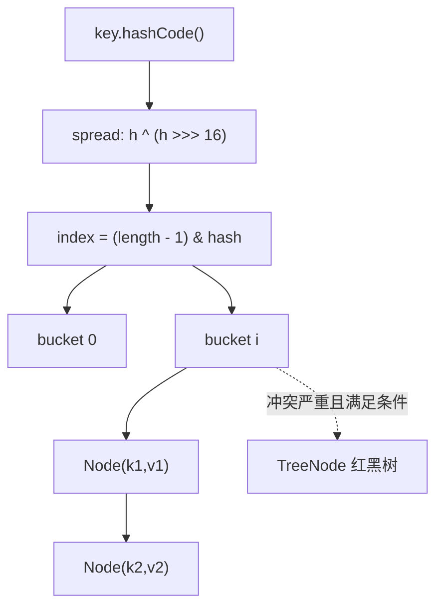
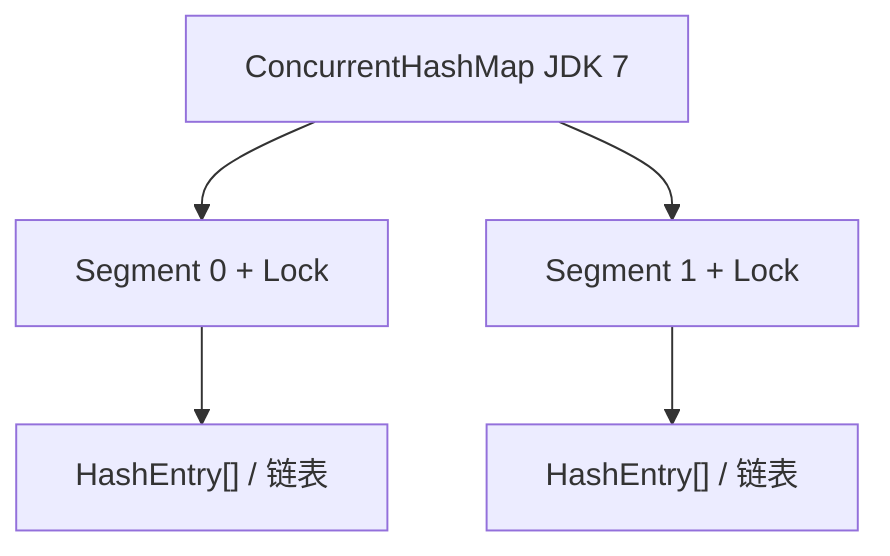
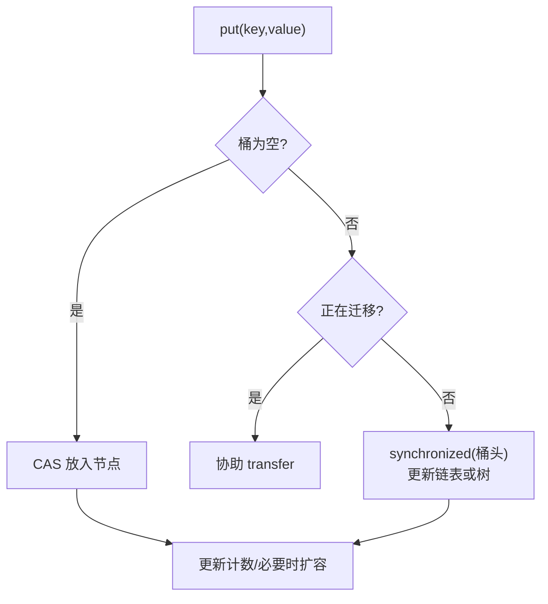

# Java - 第 8 课：HashMap、ConcurrentHashMap 与集合设计

## 学习目标（本节结束后你能做到什么）

- 从接口语义、数据布局和使用代价三层选择 `List`、`Set`、`Queue` 与 `Map`，而不只会罗列实现类。
- 解释 `ArrayList` 的扩容、集合视图、迭代器 `fail-fast`，以及为什么 `LinkedList` 通常不是性能捷径。
- 按 JDK 8 及以后常见实现讲清 `HashMap` 的寻址、冲突、扩容、树化和 key 契约。
- 区分 `HashMap`、`LinkedHashMap`、`TreeMap`、`HashSet` 的顺序与唯一性语义。
- 理解 `ConcurrentHashMap` 的版本演进、并发操作边界，并为读多写少、生产者消费者等场景选择合适容器。

## 内容讲解（核心概念，用类比、例子、图示说清楚）

### 1. 先别背类图：集合是在选择业务约束

数组解决的是“长度确定、按下标放引用或基本值”；集合解决的是“元素数量变化、需要通用增删查与抽象语义”。Java 泛型集合保存的是引用类型，因此 `List<int>` 无法编译，要写 `List<Integer>`，使用自动装箱把 `int` 包成对象。对于海量数值计算，这种包装对象成本也提醒我们：集合的方便并非没有内存代价。

Java 集合框架有两条主线：



先依据业务约束选接口，再根据排序、查找、内存和并发需求选实现：

| 需求 | 首选方向 | 不应凭直觉选择 |
| --- | --- | --- |
| 保持顺序、允许重复、主要遍历或按索引读 | `ArrayList` | 因“可能删除”就默认 `LinkedList` |
| FIFO 队列或栈，非并发 | `ArrayDeque` | 继续使用遗留的 `Stack` 或把 `ArrayList` 当队列头删 |
| 按优先级取出元素 | `PriorityQueue` | 误认为完整遍历一定是排序结果 |
| 去重，不要求稳定遍历顺序 | `HashSet` | 依赖碰巧出现的遍历顺序 |
| 去重并保持插入顺序 | `LinkedHashSet` | 用 `TreeSet` 误表达“插入有序” |
| 键值快速定位 | `HashMap` | 在大列表中反复线性查找 |
| 按键排序/范围查询 | `TreeMap` | 用 `HashMap` 后每次临时排序 |
| 最近访问淘汰等访问顺序 | `LinkedHashMap` | 认为它天然线程安全或完整缓存方案 |

`Vector`、`Stack`、`Hashtable` 是早期同步容器，了解其历史即可。现代代码中，线程安全需求一般应先看 `java.util.concurrent` 的专用容器，而不是为了“有 synchronized”继续选择旧类型。

### 2. `ArrayList`：默认 List 的理由并不只是 O(1) 下标访问

`ArrayList` 的内部核心是一个 `Object[]` 数组和当前元素数量 `size`。连续引用数组有良好的遍历局部性，按下标访问只需定位数组槽位。尾部追加若容量仍足够，也只需写一个位置并更新大小。



在 OpenJDK 常见实现中，容量不足时新容量通常按旧容量约 `1.5` 倍增长；这是实现细节，应把结论记成“扩容需要新数组和复制，已知规模时可预分配”，而不是把倍数当作永恒 API 契约：

```java
List<Order> orders = new ArrayList<>(estimatedSize);
```

复杂度和现实代价要一起看：

| 操作 | `ArrayList` | `LinkedList` | 工程判断 |
| --- | --- | --- | --- |
| `get(i)` | O(1) | O(n) | 随机读、遍历通常优先数组 |
| 尾部 `add` | 摊还 O(1) | O(1) | ArrayList 通常局部性更好 |
| 按索引中间插入/删除 | O(n)，搬移引用 | O(n) 找节点，找到后改链接 O(1) | 两者都需定位；链表未必赢 |
| 已持有节点/迭代器处删除 | 仍可能搬移 | 修改链接 O(1) | 这是链表优势成立的限定条件 |
| 空间与 GC | 数组有预留空槽 | 每元素还需节点及前后引用 | 大量元素时链表更重 |

“`LinkedList` 增删快，所以中间增删多就选它”经常不成立。业务通常给的是索引或条件，而不是一个已经定位的链表节点；链表必须先逐节点走过去，还造成额外对象、指针跳转和更差的 CPU cache 友好性。确实需要头尾队列操作时，`ArrayDeque` 往往比 `LinkedList` 更直接；需要在中间频繁编辑时，应结合访问方式用基准测试或重新审视数据结构。

### 3. List 的三个工程坑：视图、删除与结构性修改

#### 3.1 `Arrays.asList` 不是普通 `ArrayList`

```java
String[] raw = {"a", "b"};
List<String> view = Arrays.asList(raw);
view.set(0, "changed");       // 合法，同时改变 raw[0]
// view.add("c");             // UnsupportedOperationException

List<String> independent = new ArrayList<>(view);
independent.add("c");         // 合法，且不再和 raw 共享固定长度视图
```

`Arrays.asList` 返回的是由原数组支持的固定长度 List 视图，并非严格“不可变集合”：它支持 `set`，不支持导致长度变化的 `add/remove`。Java 9 之后的 `List.of(...)` 才是不可修改集合工厂之一，并且拒绝 `null` 元素。两者的约束不同，不能混称“不可变”。

基本类型数组还有另一个坑：

```java
int[] numbers = {1, 2, 3};
List<int[]> wrong = Arrays.asList(numbers); // 只有一个元素：整个 int[]
List<Integer> ok = Arrays.stream(numbers).boxed().toList();
```

泛型看到的是一个 `int[]` 引用，而不是把内部每个 `int` 自动拆成元素。

#### 3.2 `subList` 是原列表的窗口

`list.subList(from, to)` 返回的是共享底层列表的视图。通过子列表改元素或删除，会影响原列表；在持有子列表期间直接结构性修改原列表，再访问子列表，通常会触发 `ConcurrentModificationException`。长期只保留小切片还可能让大列表对象继续被引用。

需要独立快照时，应明确复制：

```java
List<Order> page = new ArrayList<>(allOrders.subList(start, end));
```

#### 3.3 遍历时修改：区分替换元素与改变结构

`ArrayList` 等集合用 `modCount` 记录添加、删除等结构性修改，迭代器保存 `expectedModCount`。若遍历期间绕过迭代器改变了结构，下一次检测可能抛出 `ConcurrentModificationException`：

```java
for (Iterator<String> it = names.iterator(); it.hasNext(); ) {
    if (it.next().isBlank()) {
        it.remove();           // 正确：迭代器同步自己的预期修改计数
    }
}
```

`list.set(i, value)` 通常只是替换已有位置，不改变列表大小，不属于同一种结构性修改。若用 `ListIterator` 遍历，使用其 `set/add/remove` 能更清楚地表达意图。

要特别记住：`fail-fast` 是尽早暴露编程错误的最佳努力检测，不是并发安全协议。多个线程无同步共享 `ArrayList` 时，即便没有抛异常，也可能读到错乱状态、覆盖写入或看到不可预测结果。

### 4. `Set` 的“唯一”取决于判等规则

Set 没有下标，其核心契约是不能存在两个被认为相同的元素。不同实现“认为相同”的方式不同：

| 实现 | 底层与顺序语义 | 判重方式 | 合适场景 |
| --- | --- | --- | --- |
| `HashSet` | 基于 `HashMap`，不承诺遍历顺序 | `hashCode` 定位后用 `equals` | 普通去重、成员判断 |
| `LinkedHashSet` | 哈希结构加链表，保持插入迭代顺序 | `hashCode` + `equals` | 去重且保留录入顺序 |
| `TreeSet` | 基于 `TreeMap` 红黑树，按值排序 | `Comparable`/`Comparator` 比较结果为 `0` | 有序集合、范围导航 |

`HashSet` 可以理解为只使用 `HashMap` 的 key，并用一个固定占位对象作为 value。因此，放进 `HashSet` 的元素也必须遵守稳定的 `equals/hashCode` 契约。

`TreeSet` 的陷阱更隐蔽：如果比较器对两个对象返回 `0`，Set 会将它们视为同一个排序位置，即使 `equals` 返回 `false`。例如仅按姓名长度比较用户，两个不同用户名称同长就可能被“去重”。一般应让比较关系与业务唯一性一致，或在比较器末尾加入真正唯一字段。

### 5. `Map` 三种顺序：无承诺、插入/访问顺序、键排序

`Map<K,V>` 是键到值的映射，不继承 `Collection`。`map.keySet()`、`map.values()`、`map.entrySet()` 返回的是映射的视图，视图上的受支持删除会反映回原 Map；若要脱钩仍需复制。

| 实现 | 主要结构 | 顺序语义 | `null` | 典型用途 |
| --- | --- | --- | --- | --- |
| `HashMap` | 桶数组 + 链表/红黑树 | 不承诺 | 允许一个 null key、多个 null value | 默认键值定位 |
| `LinkedHashMap` | `HashMap` + 双向链表 | 插入顺序，或构造为访问顺序 | 与 `HashMap` 类似 | 有序遍历、简单 LRU 骨架 |
| `TreeMap` | 红黑树 | 按 key 比较顺序 | 自然排序下一般不接受 null key | 排序、范围查询、前驱后继 |
| `Hashtable` | 哈希表 + 方法级同步 | 不承诺 | key/value 都不允许 null | 遗留兼容，通常不作为新代码首选 |

`LinkedHashMap` 的访问顺序模式非常适合讲解 LRU 思想：

```java
Map<String, User> lru = new LinkedHashMap<>(16, 0.75f, true) {
    @Override
    protected boolean removeEldestEntry(Map.Entry<String, User> eldest) {
        return size() > 1000;
    }
};
```

但这不是一个可直接用于高并发生产缓存的完整方案：它不是线程安全的，也不自带过期、统计、异步加载、容量按字节控制等能力。真实缓存通常使用专门缓存库或外部缓存服务。

### 6. `HashMap` 的核心模型：桶里解决冲突

以下讨论以 JDK 8 及以后经典实现模型为主；具体内部代码可能随 JDK 版本优化，但外部契约和主要设计思路稳定。

`HashMap` 以 `Node<K,V>[] table` 作为桶数组。key 先得到扰动后的 hash，再落入一个桶；如果多个不同 key 落在同一桶，就是哈希冲突，桶中用链表或红黑树存放条目。



为什么要把原始 `hashCode` 的高 16 位异或进低位？当表容量不大时，索引计算只使用低若干位；有些 key 的差异集中在高位，不扰动就更容易聚集到同一个桶。扰动不能拯救质量极差的 `hashCode`，但能低成本改善常见分布。

为什么容量使用 2 的幂？若长度为 `16`，`length - 1` 的低 4 位全是 `1`，`hash & (length - 1)` 等价于取低 4 位来寻址，桶位能够完整利用。扩容到两倍时，还能利用新增的一位迅速拆分旧桶。

### 7. `put`、`get`、扩容与树化：按一条路径串起来

#### 7.1 `put(key, value)`

简化后的逻辑如下：

1. 首次插入时初始化桶数组。无参 `new HashMap<>()` 并不急于立刻分配默认表。
2. 计算扰动 hash 与桶下标；该桶为空时直接创建节点。
3. 桶不为空时，先比较首节点，再遍历链表或树；若已存在相等 key，替换其 value，Map 大小不增加。
4. 不存在相等 key 时插入新节点；链表达到树化门槛后考虑转换。
5. 插入新 key 后若 `size > threshold`，执行扩容。

HashMap 判断“同一个 key”依靠 hash 和 `equals`，而不是引用地址或仅凭 hash。冲突只表示需要进一步比较，并不表示 key 相同。

#### 7.2 `get(key)`

`get` 同样先计算 hash 和下标：先检查桶头；若桶为树则走树查找；否则顺链比较节点 hash 与 `equals`。在哈希分布合理且容量合适时，期望复杂度接近 O(1)；严重碰撞的链表会退化为 O(n)，树化后的桶查找约为 O(log n)。

`HashMap` 允许 `null` key：实现将它的 hash 处理为 `0`，因此最多只有一个 null key，但可以有多个值为 null 的不同 key。这也意味着：

```java
map.get(key) == null
```

无法区分“没有这个 key”与“存在该 key 且 value 就是 null”，需要时应结合 `containsKey`。

#### 7.3 阈值、负载因子与扩容

默认负载因子为 `0.75`，它平衡空桶浪费与冲突概率。阈值近似为：

```text
threshold = capacity * loadFactor
```

若预计放入大量数据，为避免反复扩容，应预估容量，而不是先用默认值再承受迁移成本。例如需要存放约 10,000 个 key，按默认负载因子需要超过 `10000 / 0.75` 的容量，并向合适的 2 的幂容量取整。不要轻率改变负载因子：增大它节约桶数组但增加碰撞，减小它增加空间占用。

在 JDK 8 的双倍扩容中，一个旧桶中的节点不必重新计算完整 hash：判断 `hash & oldCapacity`。

```text
结果为 0      -> 新位置仍是 oldIndex
结果非 0      -> 新位置是 oldIndex + oldCapacity
```

原来同桶的节点会分成 low/high 两组，既减少重复计算，也保持组内顺序。这一机制和 2 的幂容量互相配合。

#### 7.4 为什么是红黑树，以及何时真的树化

JDK 8 引入链表到红黑树的转换，是为了在碰撞恶劣甚至恶意 key 的情况下限制查询退化。常见阈值为：

- `TREEIFY_THRESHOLD = 8`：桶中节点达到树化条件的门槛。
- `MIN_TREEIFY_CAPACITY = 64`：整个表至少足够大才树化；若表还小，优先扩容以分散冲突。
- `UNTREEIFY_THRESHOLD = 6`：在缩小到足够少的节点时可退回链表，避免小树的维护成本。

红黑树比 AVL 树平衡要求宽松，查询仍维持对数级上界，同时插入删除的旋转/维护成本更适中。需要注意的是：树化不是“性能必然更快”的日常路径，而是冲突桶变坏后的防护；正常 HashMap 更希望 key 分散，绝大多数桶为空或节点很少。

### 8. `equals` / `hashCode`：Map 正确性的业务契约

对于用作哈希 key 的类型：

```text
a.equals(b) == true  =>  a.hashCode() == b.hashCode() 必须成立
a.hashCode() == b.hashCode()  并不推出  a.equals(b) == true
```

还要满足一个常被遗漏的条件：key 放入 Map 后，参与 `equals/hashCode` 的字段不应变化。若用一个可变订单对象按 `orderNo` 与状态共同生成 hash，放入后再修改状态，它可能仍物理存在于旧桶中，但用修改后的对象查找会落入另一个桶，表现为“明明放过却找不到”。

因此常用的 key 是不可变值，如 `String`、不可变 ID 类型、正确实现的 record/value object。`String` 适合作 key 不仅因为实现了方法，还因为内容不可变，hash 与判等在生命周期内稳定。

同样原则影响 `HashSet`；而 `TreeMap` / `TreeSet` 还要保证排序比较与“业务重复”含义不冲突。

### 9. 为什么不能并发修改 `HashMap`

`HashMap` 不提供跨线程访问的同步和可见性保证。JDK 7 的并发扩容存在链表成环、读取死循环的著名风险；JDK 8 改变了迁移方式，不应再把“成环死循环”当作当前实现的典型结论，但它仍不支持并发写入：两个 put 可能覆盖、丢条目，读线程也没有所需的可见性保证。

另外，`ConcurrentModificationException` 主要是迭代器检测结构修改时抛出的异常，不是所有无锁并发读写都会可靠抛出的保护网。错误做法不是“有时出异常”，而是程序已经违反容器并发契约。

可以考虑的方式有：

| 方式 | 语义与代价 | 合适范围 |
| --- | --- | --- |
| 外部锁保护普通 `HashMap` | 能把多个 Map 操作纳入同一个业务临界区 | 操作组合复杂、并发度不高 |
| `Collections.synchronizedMap` | 每个方法通过同一 mutex 串行；遍历仍需显式同步 | 简单遗留适配，不追求高并发 |
| `ConcurrentHashMap` | 为并发访问设计，常用原子组合 API | 高频共享映射 |
| 不共享/不可变 Map | 发布后只读或每线程拥有一份 | 配置快照、函数式数据流 |

### 10. `ConcurrentHashMap`：并发性来自更细的协作，不是没有同步

`ConcurrentHashMap` 不允许 `null` key 或 null value。并发场景中，`get(key) == null` 必须能够明确表达“当前没有映射”；否则无法区分不存在与映射为 null，原子 API 的语义也会变得模糊。

#### 10.1 JDK 7：Segment 分段锁

JDK 7 实现将数据划分到多个 `Segment`；每个 Segment 类似一个带锁的小哈希表，继承/使用 `ReentrantLock`。不同段的写操作可以并发推进，粒度明显小于 `Hashtable` 整表方法同步。



#### 10.2 JDK 8 及以后：桶数组、CAS 与桶头锁

JDK 8 起，结构更接近现代 `HashMap`：桶数组加链表/红黑树，`Segment` 不再承担实际分段存储职责。核心策略是把同步用在必须协调的位置：

- table 未初始化时，通过 CAS 协调初始化。
- 目标桶为空时，用 CAS 尝试安装新节点，不必锁住其他桶。
- 桶已有链表或树时，对桶头节点 `synchronized`，在该桶内完成检查、追加或更新。
- 发生扩容时，线程可以看到 forwarding/MOVED 标记并协助迁移（`helpTransfer`），而不是由一个线程独自阻塞全部工作。
- value/链接等读取所需字段配合 `volatile` 等可见性机制，使常规读取不用整表加锁。



“用了 `synchronized` 为什么还比 Hashtable 好”不是矛盾：Hashtable 的同步常围绕整个容器方法展开；现代 ConcurrentHashMap 只在发生桶内冲突写操作时锁住局部桶，其它空桶写入和多数读取不被同一把整表锁串住。

#### 10.3 线程安全 Map 不会自动让业务复合逻辑原子

下面代码即使使用 `ConcurrentHashMap` 也有竞态：

```java
if (!counts.containsKey(userId)) {
    counts.put(userId, 1);
} else {
    counts.put(userId, counts.get(userId) + 1);
}
```

每一个方法调用是安全的，但“判断后写入”或“读取后加一再写回”由多个步骤组成，线程间仍能交错。应使用容器提供的原子组合操作，或者选择适合累加的值类型：

```java
ConcurrentHashMap<String, LongAdder> counts = new ConcurrentHashMap<>();
counts.computeIfAbsent(userId, k -> new LongAdder()).increment();
```

`putIfAbsent`、`compute`、`merge`、`replace` 等 API 的意义，正是将围绕一个 key 的复合动作交给容器原子协调。还要避免在 `compute` 回调里做耗时 I/O 或递归修改同一映射，以免长期占用桶协调路径或引发难以推理的行为。

遍历 `ConcurrentHashMap` 通常是弱一致的：不会像普通 fail-fast 迭代器那样因并发更新必然失败，但也不承诺获得某一瞬间的全局快照；统计 `size()` 等结果在持续更新期间也更适合监控参考，而非结算依据。

### 11. 线程安全集合不是只选 `ConcurrentHashMap`

并发需求要区分“读多写少”“键值共享更新”“生产者消费者”和“需要排序”：

| 场景 | 候选容器 | 关键代价与语义 |
| --- | --- | --- |
| 监听器/规则快照，读极多、写极少 | `CopyOnWriteArrayList` | 写入时复制整个数组；迭代读取稳定旧快照，不适合高频写或大列表 |
| 并发 key-value 查询更新 | `ConcurrentHashMap` | 用原子组合 API；不支持 null |
| 并发按 key 排序/范围查询 | `ConcurrentSkipListMap` | 预期 O(log n)，换取排序和并发导航 |
| 生产者消费者，需要背压 | `ArrayBlockingQueue` / `LinkedBlockingQueue` 等 | 满时生产者可阻塞，空时消费者可等待 |
| 非阻塞无界队列式传递 | `ConcurrentLinkedQueue` | CAS 推进，不提供有界背压 |

`CopyOnWriteArrayList` 的迭代器读取创建迭代器时的数组快照，所以写入期间不会抛 `ConcurrentModificationException`，但当前遍历不会看到后续新增；其迭代器不支持通过 `remove` 改变底层。它特别适合监听器列表等写入罕见场景，若将它用于频繁写入的大集合，复制开销和短期内存峰值会非常昂贵。

`BlockingQueue` 的价值也不只是“线程安全队列”：有界队列提供背压，让生产速度过快时主动阻塞或拒绝，而不是任由内存增长。在线程池和异步流水线中，这个业务语义往往比单次入队性能更重要。

### 12. 一份实际选型与面试回答框架

面对集合选型，先回答四个问题：

1. 数据语义：允许重复吗？需要按位置、插入顺序、排序顺序或 key 定位吗？
2. 操作形状：读多还是写多？查询是按下标、按 key、按范围还是 FIFO/优先级？
3. 数据规模：扩容、冲突、节点对象、写时复制或排序树的空间成本可接受吗？
4. 并发边界：集合是否跨线程共享？要的是单方法安全，还是复合业务操作原子性、快照或背压？

面试中对 `HashMap` 可以用以下链路回答，而不是只背阈值：

> `HashMap` 是非线程安全的键值容器。JDK 8 及以后常见实现以 2 的幂长度桶数组存储节点，通过扰动 hash 和 `(n - 1) & hash` 定位；冲突先走链表，桶内节点达到 8 且总容量至少 64 才树化成红黑树，否则优先扩容分散冲突。默认负载因子 0.75 平衡空间与冲突，双倍扩容时节点按 `hash & oldCap` 留在原位或迁到原位加旧容量。正确使用还依赖 key 的 `equals/hashCode` 一致且稳定；并发更新应使用 `ConcurrentHashMap` 或外部同步。

对 `ConcurrentHashMap` 则补上语义边界：

> JDK 7 以 Segment 分段锁提升写并发；JDK 8 起采用桶数组、CAS 空桶安装节点、冲突桶头 `synchronized`、协助扩容和可见性机制。它不允许 null，并提供 `computeIfAbsent`、`merge` 等原子组合 API；线程安全的是其定义的操作，并不意味着任意多步业务逻辑自动原子，也不意味着迭代得到冻结快照。

## 小结（3-5 条关键点）

1. 选择集合先选择语义：位置、唯一性、排序、映射、队列和并发需求分别对应不同结构；`Map` 不是 `Collection` 子接口。
2. `ArrayList` 通常是 List 默认首选；`Arrays.asList`/`subList` 是视图，`fail-fast` 只用于暴露错误，不能提供并发安全。
3. `HashMap` 的性能和正确性由哈希分布、容量/负载因子、冲突处理与稳定的 `equals/hashCode` key 契约共同决定。
4. JDK 8 及以后 `HashMap` 的链表在“桶节点达到门槛且表容量足够大”时才树化；双倍扩容利用新增 bit 高效拆分桶。
5. `ConcurrentHashMap` 通过局部协调提高并发度，但多步骤业务更新仍应使用其原子 API；不同并发场景还需选择 COW、SkipList 或 BlockingQueue 等容器。

## 问题 （检测用户对当前章节内容是否了解）

1. 为什么说 `Arrays.asList(array)` 是“固定长度视图”而不是普通 `ArrayList`，也不是严格不可变列表？
2. 业务要维护一个高频遍历、偶尔更新的监听器列表，你会选择什么集合？若写入也非常频繁，选择为什么要变化？
3. 一个 mutable key 放入 `HashMap` 后修改了参与 `hashCode` 的字段，会产生什么现象？为什么 `String` 通常适合作 key？
4. `HashMap` 桶中出现 8 个节点时，是否必然马上转换成红黑树？请补齐条件和设计原因。
5. 从容量 16 扩到 32 时，为什么一个节点的新桶位只可能是原位置或原位置加 16？
6. `HashMap` 与 `TreeMap` 都可以查 value，它们在顺序、复杂度和 key 契约上有什么差异？
7. 为什么 JDK 8 的 `ConcurrentHashMap` 同时使用 CAS 和 `synchronized`，这并不等同于 `Hashtable` 的整表同步？
8. 下面写法即使 `map` 是 `ConcurrentHashMap` 也会错在哪里，应改用哪个原子操作？

```java
if (!map.containsKey(key)) {
    map.put(key, createValue());
}
```
