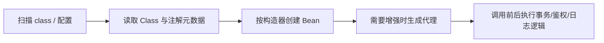

# Java - 第 9 课：字节码、类加载、反射与注解

## 学习目标（本节结束后你能做到什么）

- 从 `.class` 到可执行类，讲清加载、链接、初始化和执行引擎之间的顺序。
- 理解“类的身份 = 类全名 + 定义它的类加载器”，并能解释类冲突和插件隔离问题。
- 区分创建对象、初始化类和触发 GC 三类容易混淆的运行时行为。
- 正确使用反射创建对象、调用方法、读取注解，同时理解封装、性能和模块边界。
- 说明运行时注解如何从 class 文件信息变成框架能消费的配置。

## 内容讲解（核心概念，用类比、例子、图示说清楚）

### 1. 字节码是 Java 语言与 JVM 之间的契约

源代码写的是 `new UserService()`、`service.load(id)`；编译后的 class 文件保存的是 JVM 可理解的指令、常量池、字段、方法和属性表等结构。

可以用工具观察编译产物：

```bash
javac Demo.java
javap -c -v Demo
```

`javap -c` 能看到方法字节码，`-v` 还能看到常量池、方法描述符和注解属性等元数据。面试中不需要手写所有指令，但要知道：

- 重载主要在编译期按声明类型与参数签名选定调用目标。
- 重写形成的运行时多态，在执行时依据对象实际类型分派实例方法。
- 泛型大多通过类型擦除实现，`List<String>` 与 `List<Integer>` 通常不会变成两个不同的运行时类；这也是不能直接 `new T()`、不能 `List<int>` 的背景之一。

> 素材中“泛型编译后保留类型信息”的说法需要修正：普通泛型类型参数通常会被擦除；字段或方法签名里可能保留供反射读取的泛型元数据，但对象运行时并非完整携带其所有实际类型参数。

### 2. 类的生命周期：加载不等于初始化

一个类被真正使用之前，JVM 会经历以下主干步骤：


链接通常包含验证、准备和解析。解析在实现上可以按需要延迟；核心边界仍然是：

- 加载阶段把类定义读入 JVM 并得到对应的 `Class<?>` 表示。
- 准备阶段给静态字段的是类型默认值，不等于执行了你的赋值代码。
- 初始化阶段才执行编译器合成的 `<clinit>`，包含静态字段显式赋值和静态代码块。

```java
final class Config {
    static int timeout = initTimeout();

    static {
        System.out.println("class initialized");
    }
}
```

只有触发 `Config` 初始化时，`initTimeout()` 与静态代码块才会执行一次。把这说成“类一加载静态块就一定运行”会混淆加载与初始化。

### 3. 什么会主动触发类初始化

常见主动使用包括：

- `new SomeClass()` 创建实例。
- 读写某个类的非编译期常量静态字段。
- 调用静态方法。
- 通过反射主动调用构造器或静态成员。
- 初始化子类前，需要先初始化其父类。

反过来，读取一个编译期可折叠的 `static final` 常量，常可能已被编译进调用方字节码，并不要求初始化定义它的类。

```java
final class Limits {
    static final int RETRIES = 3;                   // 编译期常量
    static final Integer BOXED = Integer.valueOf(3); // 非编译期常量
}
```

这类边界常见于“为什么静态代码块没打印”的排查题。

### 4. 类加载器：同名类不一定是同一个类型

JVM 判定类身份时，不仅看完整类名，还看定义这个类的类加载器：

```text
com.example.Plugin + LoaderA  !=  com.example.Plugin + LoaderB
```

因此两个插件各自加载同名接口时，即使源码相同，也可能在强转时得到 `ClassCastException`。典型工程场景包括应用服务器隔离、插件系统、热部署以及依赖冲突排查。

常见加载器职责可以概括为：

| 加载器层次 | 常见负责范围 |
| --- | --- |
| Bootstrap Loader | Java 核心运行时类，例如 `java.lang` |
| Platform Loader | 平台模块/标准扩展层 |
| Application Loader | 应用 classpath 或 module path 上的类 |
| 自定义加载器 | 插件、隔离、加密 class、热加载等需求 |

传统“父优先委派”的价值是避免应用随意伪造核心类，并尽量保证基础类型只有一份定义。它不是所有容器永远不可打破的规则；插件框架可能为隔离需求设计不同策略，但随之必须承担类型边界和安全复杂度。

### 5. 对象创建：不是一句 `new` 就结束

以最常见的 `new Account()` 为例，可以按以下问题链理解：

1. 类是否已经被加载、链接并初始化？没有则先处理类元数据。
2. 在堆上为对象分配内存，并给实例字段设置默认零值。
3. 建立对象头等运行时信息，关联其类元数据。
4. 执行实例初始化逻辑与构造器，使对象满足业务不变量。
5. 将引用返回给调用代码。

不同创建入口有明显不同的约束：

| 方式 | 是否通常调用构造器 | 用途与风险 |
| --- | --- | --- |
| `new` | 是 | 业务代码默认选择，关系清晰 |
| `Constructor.newInstance()` | 是 | 框架按运行时元数据创建实例，会包装/传播异常 |
| 工厂方法 | 内部通常是 | 隐藏缓存、池化或实现选择，例如 `Integer.valueOf` |
| `clone()` | 否 | 默认浅复制，契约别扭，谨慎用于领域对象 |
| Java 反序列化 | 不按普通构造器路径 | 存在兼容性与不可信数据安全风险 |

旧代码里可能看到 `Class.newInstance()`；它自 JDK 9 起已被弃用，不能很好地表达构造器选择和异常处理，应使用：

```java
PaymentGateway gateway = clazz
    .getDeclaredConstructor()
    .newInstance();
```

### 6. 创建出的对象什么时候能被回收

对象不是“离开某个方法就立刻释放”。主流 JVM 通过可达性分析判断对象是否仍能从 GC Roots 访问到。常见根包括：

- 活跃线程栈帧中的引用。
- 已加载类的静态字段引用。
- JNI 全局/本地引用等本地边界持有的引用。
- JVM 内部需要保留的运行时结构。

对象不可达后只是具备回收资格；何时实际回收由收集器和内存压力决定。资源释放不能等待 GC：

- 文件、socket、数据库连接使用 `try-with-resources` 或明确生命周期管理。
- 不要依赖 `finalize()` 清理资源；它已经被弃用，执行时机和成本都不可控。

GC 算法、分代/分区收集器与线上内存诊断会单独成章，本课只把“类、实例、可达性”的边界接上。

### 7. 反射：对运行时结构进行查询与调用

反射的核心是取得运行时类表示，并基于元数据完成动态行为：

```java
Class<?> type = Class.forName("com.example.EmailSender");
Constructor<?> ctor = type.getDeclaredConstructor();
Object sender = ctor.newInstance();

Method method = type.getMethod("send", String.class);
method.invoke(sender, "hello");
```

在普通业务代码里，如果编译期已经知道类型，直接接口调用比反射更清晰。反射适合以下动态场景：

- IoC 容器扫描 Bean 并调用构造器、注入字段或方法。
- ORM 根据字段/注解把结果集映射为对象。
- 测试框架发现测试方法。
- 序列化框架、路由框架或插件系统依据元数据注册处理器。

#### 反射不是“随意破坏 private”的推荐设计

反射访问私有成员可能需要打开可访问权限；在模块化 Java 中，强封装和模块开放规则会进一步限制这种深反射。业务代码若靠反射读写私有状态才能工作，通常意味着 API 设计出了问题。框架使用反射也应：

- 优先调用公开构造器/方法或显式开放的扩展点。
- 缓存已解析元数据，避免热路径反复查找。
- 清楚异常包装、模块权限与 native image/AOT 等运行环境限制。

### 8. `Class<?>` 与反射的一个隐藏重点：类加载器隔离

以下判断可能返回 `false`，即使两个对象的类名输出一致：

```java
left.getClass() == right.getClass()
```

如果 `left` 和 `right` 来自不同定义加载器，它们的 `Class<?>` 对象不相同，互相也不能简单强转。框架报错“`X cannot be cast to X`”时，不要只盯着类名；还要检查 classloader 与依赖重复装载。

### 9. 注解：写进 class 文件的元数据，不是魔法

注解本身不自动执行业务。它的价值是让编译器、工具或运行时框架获得声明式元数据。

```java
@Retention(RetentionPolicy.RUNTIME)
@Target(ElementType.METHOD)
public @interface Audited {
    String action();
}

@Audited(action = "refund")
public void refund() { }
```

#### 保留策略

| 策略 | 是否进入 class 文件 | 运行时反射可读 | 常见用途 |
| --- | --- | --- | --- |
| `SOURCE` | 否 | 否 | 编译检查、代码生成输入 |
| `CLASS` | 是 | 否 | 字节码工具使用，默认策略 |
| `RUNTIME` | 是 | 是 | Spring、JUnit 等运行时框架 |

编译器会把相应注解写入 class 文件属性表。对于 `RUNTIME` 注解，运行时可以通过 `AnnotatedElement` 相关 API 读取，并得到表现为注解接口实例的对象。框架随后根据值执行拦截、注入、路由或校验逻辑。

```java
Method refund = Service.class.getMethod("refund");
Audited audited = refund.getAnnotation(Audited.class);
if (audited != null) {
    System.out.println(audited.action());
}
```

`@Target` 定义能标注的位置，例如类型、字段、方法、参数、构造器、类型使用、模块或 record 组件；`@Retention` 定义信息保留多久。回答注解原理时，把这两者说清，远胜于背“注解就是标签”。

### 10. 反射、注解、代理与 Spring 的连接点

一个简化的框架流程通常是：



这里要分清：

- 反射负责动态读取和调用。
- 注解提供声明式元数据。
- 代理负责在调用边界插入行为。
- IoC/AOP/事务是框架使用这些能力建立出的工程机制，不等同于“反射本身”。

后续 Spring 事务专章会继续展开代理失效、自调用和线程上下文问题。

### 11. 面试表达模板

> Java 源码经 `javac` 编译为字节码，JVM 在运行时加载并验证类、完成链接和初始化，然后由解释器执行并对热点代码 JIT 编译。类的运行时身份由类名和定义它的类加载器共同决定，所以插件隔离中可能出现同名类无法强转。反射建立在 `Class`、`Constructor`、`Method`、`Field` 等元数据 API 上，适合框架的动态装配，但会引入封装、权限和调用开销问题。运行时注解会保存在 class 文件属性中，框架通过反射读取后才赋予其业务含义。

## 小结（3-5 条关键点）

1. class 文件保存 JVM 能执行的字节码与元数据；运行时还要经历类加载、链接、初始化以及解释/JIT 执行。
2. 静态代码块属于类初始化，而不是笼统的“加载”；类身份还必须带上定义它的类加载器。
3. `new`、反射、克隆与反序列化的创建路径不同，资源释放和对象回收更不能混为一谈。
4. 反射适合真正需要运行时动态性的框架边界，不是普通业务绕开封装的默认捷径。
5. 注解只是带保留策略和目标位置的元数据；框架读取并执行相应逻辑后，它才呈现“功能”。

## 问题 （检测用户对当前章节内容是否了解）

1. `.java`、`.class`、类加载、JIT 四者各发生在哪个阶段？
2. 为什么“加载一个类”与“执行它的静态代码块”不能直接画等号？
3. 为什么应用服务器里可能出现 `com.example.User cannot be cast to com.example.User`？
4. `Class.newInstance()` 为什么不再推荐，应该换成什么写法？
5. 一个 socket 包装对象不可达以后，为什么仍不能把关闭 socket 的责任交给 GC？
6. 反射和注解在 Spring 风格的容器里各自解决什么问题？
7. `RetentionPolicy.CLASS` 和 `RUNTIME` 对运行时框架的影响是什么？
8. 为什么说普通泛型信息存在类型擦除，而不是“运行时始终完整保留泛型类型”？
