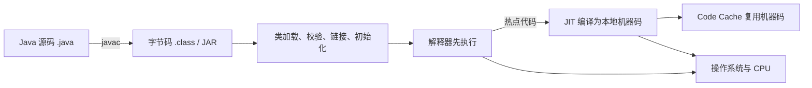
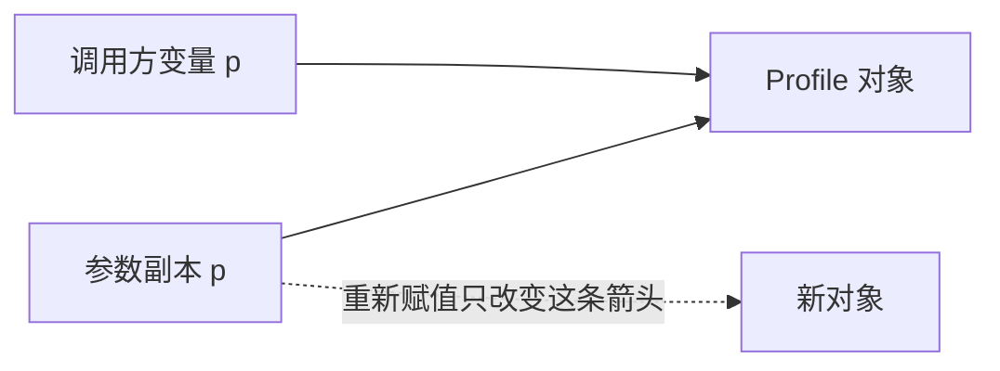

# Java - 第 12 课：Java 平台、类型系统与对象语义

## 学习目标（本节结束后你能做到什么）

- 解释 Java 为什么能跨平台，以及 `JDK`、运行时、`JVM`、字节码与 JIT 分别负责什么。
- 准确回答八种基本类型、数值转换、`BigDecimal`、装箱拆箱和 `Integer` 缓存的工程问题。
- 证明 Java 只有值传递，并分清引用共享、对象可变性、浅拷贝与深拷贝。
- 用“抽象约束 + 运行时分派”理解封装、继承、多态、接口与抽象类，而不只背定义。
- 避开 `String`、`final`、泛型与 `equals/hashCode` 的常见面试误答。

## 内容讲解（核心概念，用类比、例子、图示说清楚）

### 1. Java 不只是语法：它是一条交付链路

写下 `OrderService.java` 之后，真正被部署和执行的不是这份源文件，而是由工具链和运行时共同完成的一条链：



- `javac` 把 Java 语言翻译为 JVM 指令集，也就是字节码。
- JVM 是执行字节码的运行时实现，它还管理类加载、内存、GC、线程、异常和本地接口。
- 解释器让代码能快速启动执行；JIT 把频繁执行的方法或循环编译为当前平台的机器码，用运行时信息换取后续性能。
- JVM 不只承载 Java。Kotlin、Scala 等语言也可以生成兼容字节码并运行在 JVM 上。

所以“Java 是编译型还是解释型”的可靠回答是：Java 源码先编译为字节码；主流 JVM 在运行时采用解释执行与 JIT 编译结合的方式。

### 2. 跨平台的边界：跨的是字节码，不是所有依赖

同一份兼容字节码，可以交给 Windows、Linux 或 macOS 上对应的 JVM 来运行。JVM 负责把公共字节码语义落实到不同 CPU 指令、系统调用和线程实现上。

但是“一次编译，到处运行”不是无条件承诺：

- 使用 JNI/JNA 加载本地动态库时，需要为不同操作系统和 CPU 构建不同二进制。
- 路径分隔符、默认编码、文件权限、大小写敏感性、时区等环境差异仍会影响行为。
- 程序编译目标的 class 文件版本，必须被目标 JVM 支持；用新 JDK 编出的字节码不能当然地交给旧 JVM。
- 依赖外部数据库、消息系统、证书或容器配置时，运行环境仍是交付的一部分。

因此更严谨的表述是：

> Java 通过稳定的字节码与平台专属 JVM 显著降低跨平台成本；应用仍需控制 JDK 版本、原生依赖与外部环境差异。

### 3. `JDK`、`JRE` 与 `JVM`：记职责，不背旧目录图

| 概念 | 职责 | 典型内容 |
| --- | --- | --- |
| Java 语言 | 定义源代码语法与语义 | 类、接口、泛型、异常、lambda |
| JVM | 执行字节码的抽象机器及其实现 | 类加载、执行引擎、内存/GC、线程、JNI |
| Java 运行时 | 让应用运行所需的 JVM 与标准库/模块 | `java.base`、网络、集合等模块 |
| JDK | 开发、诊断与运行 Java 的工具包 | `javac`、`java`、`jcmd`、`jstack`、`jlink` 等 |

教材常写“`JDK` 包含 `JRE`，`JRE` 包含 `JVM`”，作为职责理解没有问题；但不要把它机械理解为所有现代发行版都必须带一个名为 `jre/` 的子目录。自 Java 9 模块化运行时起，可以通过 `jlink` 裁剪应用需要的运行时镜像，部署形态已不再只有“单独安装 JRE”一种。

### 4. 八种基本类型：不要从一张表背出错误结论

Java 有八种 primitive，其余如数组、类、接口、枚举、record 都属于引用类型。

| 类型 | 语义与宽度 | 高频边界 |
| --- | --- | --- |
| `byte` | 8 位有符号整数 | `-128` 到 `127` |
| `short` | 16 位有符号整数 | 较少用于普通计算 |
| `int` | 32 位有符号整数 | 整数字面量默认类型 |
| `long` | 64 位有符号整数 | 字面量常写 `42L` |
| `float` | 32 位 IEEE 754 浮点 | 字面量需写 `1.0F` |
| `double` | 64 位 IEEE 754 浮点 | 浮点字面量默认类型 |
| `char` | 16 位无符号 UTF-16 code unit | 不等价于完整 Unicode 字符 |
| `boolean` | `true` / `false` | Java 语言规范不规定其存储字节数 |

两个容易忽略的点：

1. `char` 能装一个 UTF-16 代码单元，但某些 emoji 或扩展字符需要两个 `char`（代理对）。业务里按“用户可见字符”截断字符串，不能简单地把 `length()` 当作字符数。
2. `float`/`double` 是二进制浮点。它们适合科学与近似计算，不适合作为精确金额的小数模型。

### 5. 类型转换：扩大范围也不等于总是“没有精度问题”

整数之间的扩大转换，例如 `int -> long`，能精确保留值。缩小转换可能截掉高位：

```java
int n = 300;
byte b = (byte) n; // 44，留下低 8 位
```

浮点边界更细：

- `int -> double` 在一定范围内可以精确表达，但极大的 `long -> double` 也可能舍入。
- `double -> int` 会丢弃小数部分，并可能发生越界饱和/非期望结果。
- 金额、费率结算等十进制业务，应使用 `BigDecimal` 并明确舍入规则。

```java
BigDecimal price = new BigDecimal("0.10");
BigDecimal tax = new BigDecimal("0.20");
BigDecimal total = price.add(tax); // 0.30
```

用字符串构造 `BigDecimal` 是关键：`new BigDecimal(0.1)` 已经把 `double` 的二进制近似值带入了精确模型。

### 6. Java 只有值传递：对象参数传的是“引用值的副本”

方法参数总是复制一个值。基本类型复制数字本身；引用类型复制“指向对象的引用值”。因此，方法能通过副本修改同一个对象，却不能让调用方变量重新指向另一个对象。

```java
static void change(Profile p) {
    p.name = "changed";       // 修改同一个对象，调用方可见
    p = new Profile("new");   // 只改局部引用，调用方不可见
}
```



这能同时解释三个问题：

- `swap(a, b)` 无法交换调用方的两个对象变量。
- 传入 `List` 后调用 `add()`，调用方能看见新增元素。
- 不可变对象（如 `String`）传入方法后看似“改不动”，原因是对象不提供就地改变内容的操作，不是 Java 改成了另一种传参方式。

### 7. `int` 与 `Integer`：对象能力的代价

泛型类型参数必须是引用类型，所以集合里写 `List<Integer>` 而不是 `List<int>`。编译器可以替你装箱和拆箱：

```java
Integer count = 42; // Integer.valueOf(42)
int value = count;   // count.intValue()
```

但语法顺滑不代表成本消失：

- `Integer` 可以为 `null`，自动拆箱时会抛 `NullPointerException`。
- 大量数值包装会增加对象分配、内存占用和 GC 压力；大量数值流可考虑 `IntStream`。
- `Integer.valueOf()` 默认缓存 `-128` 到 `127`，所以 `==` 的结果会因数值范围不同而迷惑人。

```java
Integer a = 127, b = 127;
Integer c = 128, d = 128;

System.out.println(a == b);      // 通常 true，命中缓存
System.out.println(c == d);      // 通常 false，不应依赖对象身份
System.out.println(c.equals(d)); // true，比较数值
```

缓存范围是实现约定中需要理解的性能细节，不是让业务用 `==` 比较包装数值的理由。

### 8. 面向对象的重点不是术语，而是替换能力

封装、继承、多态可以这样串起来：

- 封装控制状态修改入口，让对象能维护自己的不变量，例如账户不能被随意写成负余额。
- 继承表达“确实是一个”的替换关系；如果只是复用代码，组合通常比强行继承更松耦合。
- 多态让调用方依赖抽象，不必用一连串 `if/else` 判断具体实现。

```java
interface PaymentGateway {
    Receipt pay(Order order);
}

final class CheckoutService {
    private final PaymentGateway gateway;

    CheckoutService(PaymentGateway gateway) {
        this.gateway = gateway;
    }

    Receipt checkout(Order order) {
        return gateway.pay(order);
    }
}
```

`CheckoutService` 不关心底下是微信、银行卡还是测试替身。这正是依赖倒置与开闭原则在代码里的样子。

#### 接口还是抽象类

| 需要表达的东西 | 更合适的选择 |
| --- | --- |
| 一种可由许多无关类实现的能力 | 接口 |
| 共同行为并需要共享受保护状态、构造约束 | 抽象类 |
| 多种能力组合 | 多个接口 |
| 强继承层级、模板方法 | 抽象类，且要确认替换关系成立 |

Java 8 起接口可提供 `default` 与 `static` 方法，Java 9 起还能有用于复用实现的 `private` 方法；接口字段依然隐含为 `public static final`，接口没有实例构造器。

### 9. `static`、`final` 与不可变性是不同维度

- `static` 把成员绑定到类，而不是某个实例；静态方法没有 `this`，不能直接读取实例状态。
- 静态初始化块发生在类初始化阶段，而不是泛泛地说“类文件刚加载就执行”。
- `final` 变量只能被赋值一次；若变量保存对象引用，禁止的是重新指向，不是修改对象内容。
- `final` 方法不能被重写，`final` 类不能被继承。

```java
final List<String> names = new ArrayList<>();
names.add("Ada");       // 合法，对象仍可变
// names = new ArrayList<>(); // 不合法，引用不可重新赋值
```

`String` 的不可变性来自其封装和实现不暴露变更内容的操作，类为 `final` 只是避免子类破坏其语义的一部分保障，而不是不可变性的全部来源。

### 10. 对象身份、相等性与拷贝

#### 10.1 `==`、`equals` 与 `hashCode`

- 对 primitive，`==` 比较值。
- 对引用，`==` 比较是否指向同一个对象。
- `Object.equals()` 默认与身份比较一致；值对象通常要重写它。
- 如果 `a.equals(b)` 为 `true`，则 `a.hashCode() == b.hashCode()` 必须成立。

哈希容器中的完整 key 契约、可变 key 风险与 `HashMap` 工作过程，已经在 [08_HashMap、ConcurrentHashMap与集合设计.md](/Users/xinqi/Documents/learning_stuff/Java/08_HashMap、ConcurrentHashMap与集合设计.md) 展开，这里不重复。

#### 10.2 浅拷贝与深拷贝

假设一个 `Order` 引用了一个可变的 `Address`：

```java
Order copy = new Order(original.id, original.shippingAddress);
```

这个新 `Order` 与旧 `Order` 共享 `shippingAddress`，属于浅拷贝。若编辑副本地址也会改变原订单看见的地址，就是共享引用造成的。

深拷贝需要创建独立的可变子对象：

```java
Order copy = new Order(
    original.id,
    new Address(original.shippingAddress.city(), original.shippingAddress.street())
);
```

工程建议：

- 对可控领域对象，优先显式复制构造器或静态工厂，能明确哪些字段共享、哪些字段复制。
- 不要把 `Object.clone()` 当作通用深拷贝方案；它默认只做字段级浅复制，`Cloneable` 契约也不直观。
- 不要为了复制普通对象随意使用 Java 原生序列化；它慢、耦合类结构，而且反序列化不可信数据有安全风险。序列化边界在第 13 课讨论。
- 对真正不可变对象，共享引用通常是安全且高效的。

### 11. 素材中已由其他专章覆盖的内容

本次素材还包含若干重要主题，但以下内容已有更完整的专章，因此这里保持链接而不重抄：

- 集合、`equals/hashCode` 的容器后果、`HashMap` 与 `ConcurrentHashMap`：第 8 课。
- `lambda`、`Optional`、`Stream.map` / `flatMap`：第 11 课。
- `Future`、`CompletableFuture` 的异步编排：第 3 课。
- 平台线程、虚拟线程及其 I/O 场景：第 5 课。

## 小结（3-5 条关键点）

1. Java 的可移植核心是字节码与平台专属 JVM 的分层；原生依赖和环境配置仍可能破坏可移植性。
2. 现代 Java 学习应以 JDK、运行时模块和 JVM 的职责为主，别死记旧版 `JDK > JRE > JVM` 目录形状。
3. Java 参数传递始终是值传递；引用类型复制的是引用值，因此能共享修改对象，却不能替调用方重绑变量。
4. 基本类型与包装类在可空性、泛型能力、内存和比较语义上不同；金额计算应明确使用十进制模型。
5. 好的对象设计重在维护不变量与可替换性；相等、拷贝和不可变性都必须按业务语义明确设计。

## 问题 （检测用户对当前章节内容是否了解）

1. 为什么说跨平台的是兼容字节码和应用约束，而不是 JVM 本身？
2. 为什么现代 JDK 环境下不宜只用“安装一个独立 JRE 就够了”作为部署结论？
3. `char` 为什么不一定表示一个用户眼里的完整字符？`boolean` 的存储大小为什么不应背成固定字节数？
4. 写一段代码证明 Java 对对象参数仍然是值传递。
5. 为什么 `Integer a = 128; Integer b = 128; a == b` 不适合作为数值相等判断？
6. 为什么 `new BigDecimal("0.1")` 比 `new BigDecimal(0.1)` 更适合金额？
7. 一个对象的 `final List` 字段还能被 `add()`，这说明 `final` 保证了什么、没有保证什么？
8. 订单对象的配送地址应浅拷贝还是深拷贝？请按“地址是否允许独立修改”解释选择。
