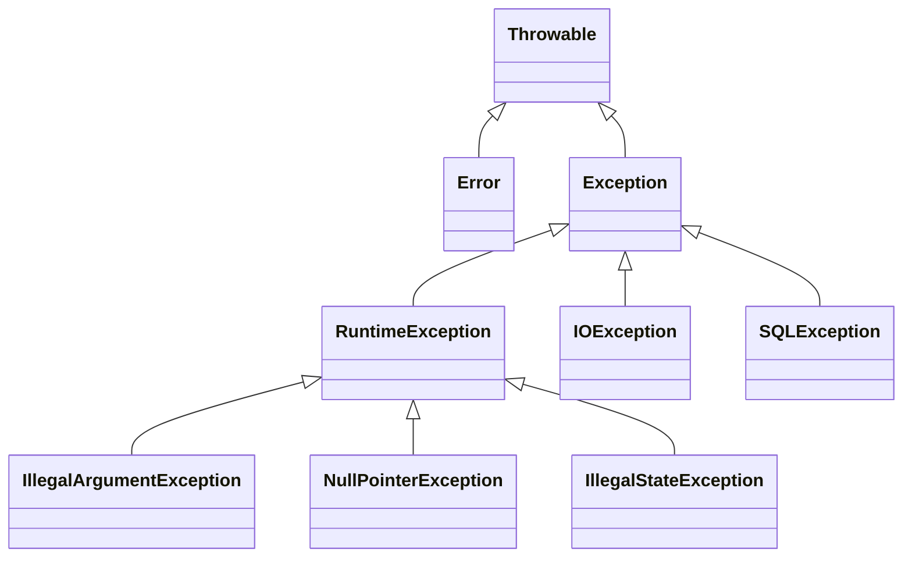

# Java - 第 13 课：异常、资源管理与序列化边界

## 学习目标（本节结束后你能做到什么）

- 讲清 `Throwable`、`Error`、受检异常与非受检异常的真实区别。
- 设计不会吞错、不会丢上下文、不会泄漏资源的异常处理路径。
- 正确使用 `try-with-resources`、异常转换与 suppressed exceptions。
- 区分“Java 对象”与“跨进程消息”，理解序列化协议、安全与兼容性。
- 在面试和工程中识别 `finally return`、原生反序列化、不透明重试等危险写法。

## 内容讲解（核心概念，用类比、例子、图示说清楚）

### 1. 异常不是语法附属品，而是失败协议

一个服务方法不仅有成功返回值，也需要表达失败：

```java
Receipt pay(Command command)
```

支付可能因参数错误、余额不足、网络超时、下游故障或本机资源耗尽而失败。异常体系的意义不是“让程序不崩”，而是让失败沿调用边界传播时仍保留：

- 失败属于谁的责任。
- 调用方能否恢复、重试或降级。
- 需要记录哪些诊断上下文。
- 已打开的资源如何关闭。

### 2. `Throwable` 体系：编译器要求不等于发生时机



| 分支 | 编译器是否强制捕获/声明 | 典型语义 | 常见处理 |
| --- | --- | --- | --- |
| `Error` | 否 | JVM/资源级严重失败，如 `OutOfMemoryError` | 通常记录、让上层终止或重启，不作为普通业务分支 |
| Checked Exception | 是 | 调用外部资源时可预期但无法由当前方法完全消除的失败 | 捕获恢复或 `throws` 暴露契约 |
| `RuntimeException` | 否 | 参数、状态或编程契约被违反；也可用于业务 API 的 unchecked 失败 | 在合适边界统一转换/记录 |

“受检异常”不是指异常只在编译期发生；它一样在运行时抛出。区别是编译器要求调用代码显式处理或声明它。`RuntimeException` 也不等于一定不可恢复，例如解析一个可选配置失败可以降级；关键仍是当前边界是否有足够信息做正确决策。

### 3. `throw`、`throws`、`catch`：谁承担决策

- `throw` 是此刻创建/抛出一个失败。
- `throws` 是方法签名声明：这类失败由调用方继续决策。
- `catch` 意味着当前边界决定进行恢复、转换、补充上下文或最终记录。

不要为了“代码不红”而抓住所有异常：

```java
try {
    repository.save(order);
} catch (Exception e) {
    // 什么也不做：订单失败了，调用方还以为成功
}
```

更可信的做法是保留语义与根因：

```java
try {
    repository.save(order);
} catch (SQLException e) {
    throw new OrderPersistenceException(
        "save order failed, orderId=" + order.id(), e);
}
```

这里将基础设施异常转换为领域/服务边界能理解的异常，同时把原始异常作为 `cause` 保留给日志和排障。

### 4. 什么时候捕获，什么时候继续抛

在以下位置捕获通常有充分理由：

| 边界 | 适合做的事 |
| --- | --- |
| 参数与领域校验 | 抛出清晰的业务/参数异常，不开始副作用 |
| 基础设施适配层 | 将 JDBC、HTTP、文件等异常转换为模块自己的失败语义 |
| 重试/熔断层 | 只对明确可重试且幂等的失败重试 |
| HTTP/RPC 入口层 | 映射错误码、写结构化日志、隐藏内部栈信息 |
| 消费者任务最外层 | 记录消息标识，决定 ACK、重试或死信 |

不应捕获后无动作；也不应每一层都重复打同一个异常堆栈日志，否则一次错误会生成一条噪音链。通常由“最终处理或跨系统边界”的一层完整记录一次。

### 5. 资源管理：优先 `try-with-resources`

数据库连接、文件流和 socket 都不是等 GC 回收即可释放的普通内存。它们绑定操作系统句柄、连接池容量或下游资源，必须明确关闭。

```java
String load(Path file) throws IOException {
    try (BufferedReader reader = Files.newBufferedReader(file)) {
        return reader.readLine();
    }
}
```

任何实现 `AutoCloseable` 的资源都可放入 `try (...)`。即使业务读取抛异常，资源关闭也会执行。

如果业务代码和 `close()` 同时失败，Java 会把业务失败作为主异常，把关闭失败保存为 suppressed exception：

```java
try {
    load(file);
} catch (IOException e) {
    for (Throwable suppressed : e.getSuppressed()) {
        log.warn("close also failed", suppressed);
    }
    throw e;
}
```

这比手写 `finally` 更容易保留真正的失败原因。

### 6. `finally` 的危险边界：绝不要从中 `return`

```java
static String bad() {
    try {
        throw new IllegalStateException("payment failed");
    } finally {
        return "ok";
    }
}
```

这个方法会返回 `"ok"`，原本最重要的失败被覆盖。类似地，`finally` 抛出的新异常也可能遮盖 `try` 中原异常。

规则很简单：

- `finally` 只做必要、简短的清理。
- 可关闭资源优先交给 `try-with-resources`。
- 不在 `finally` 中 `return`，也不要随意抛新的无因异常。

### 7. 异常设计的业务细节：可重试、幂等与日志

网络超时不等于操作没执行。假设支付请求发送后响应丢失，贸然重试可能重复扣款。因此重试之前要回答：

1. 这是什么失败：超时、连接拒绝、参数非法还是库存不足？
2. 操作是否幂等，是否带业务幂等键？
3. 重试是否应退避、限次，是否会放大下游故障？
4. 日志是否包含 trace id、业务 id 和根因，而不是敏感字段？

```java
final class PaymentRejectedException extends RuntimeException {
    PaymentRejectedException(String message) {
        super(message);
    }
}

final class PaymentUnavailableException extends RuntimeException {
    PaymentUnavailableException(String message, Throwable cause) {
        super(message, cause);
    }
}
```

“用户余额不足”和“支付服务连接超时”不应都包装成一个 `RuntimeException("error")`；前者通常不重试，后者在具备幂等保护时才可能重试。

### 8. 跨 JVM 传递的不是对象，而是协议中的数据

两个进程有不同堆和不同对象身份。所谓“把对象发送给另一个 JVM”，实际链路是：


接收方重建的是语义相近的新数据，不是发送方堆里原对象的“移动”。所以协议设计必须考虑：

- 字段是否向前/向后兼容。
- 缺失字段、未知字段和默认值怎么处理。
- 消息是否有类型、版本、幂等 id 与校验。
- 数据是否可信，解析会不会执行危险行为。
- 多语言服务是否都能实现相同协议。

### 9. Java 原生序列化为什么不宜成为服务协议默认值

`ObjectOutputStream`/`ObjectInputStream` 可以序列化实现 `Serializable` 的对象，但在服务间通信中通常不是理想默认方案：

- 它与 Java 类结构和序列化兼容约定强绑定，不适合多语言协作。
- 对不可信字节做原生反序列化会扩大攻击面，历史上存在利用可反序列化对象链触发危险行为的问题。
- 格式通常不是跨团队 API 契约的最佳选择，调试、演进和带宽成本都不理想。

对于跨服务消息，更常见的选择是明确 schema 的 JSON、Protocol Buffers 或 Avro 等协议；选择取决于可读性、性能、兼容演进和生态约束，而不是“哪一个永远最好”。

如果必须维护遗留原生序列化：

- 不反序列化不可信来源的数据。
- 设定允许类型过滤与输入大小限制。
- 明确 `serialVersionUID` 与版本迁移策略。
- 把反序列化放在隔离边界，并尽快转为内部安全 DTO。

### 10. 深拷贝为什么不应随手借用反序列化

用“序列化再反序列化”实现深拷贝，确实能在一些简单可序列化对象图中得到独立实例，但它把复制问题升级成：

- 整个对象图必须可序列化。
- 复制性能差且容易制造大量短命字节数组和对象。
- 类版本与安全限制进入原本只是内存复制的业务。

领域对象更适合显式复制：

```java
Order duplicate(Order source) {
    return new Order(
        source.id(),
        new Address(source.address().city(), source.address().street()),
        List.copyOf(source.lines())
    );
}
```

这里还能清楚表达：地址需要独立副本，行项目列表希望是不可变快照。

### 11. 与已有章节的连接

- `CompletableFuture` 的异常恢复、`exceptionally` / `handle` / `whenComplete` 已在 [03_Runnable、Callable、Future与CompletableFuture.md](/Users/xinqi/Documents/learning_stuff/Java/03_Runnable、Callable、Future与CompletableFuture.md) 展开，本课只讨论异常边界原则。
- `equals/hashCode` 对哈希集合的影响已在 [08_HashMap、ConcurrentHashMap与集合设计.md](/Users/xinqi/Documents/learning_stuff/Java/08_HashMap、ConcurrentHashMap与集合设计.md) 讨论，不重复展开。
- 反射创建对象和注解元数据的运行过程在 [09_字节码、类加载、反射与注解.md](/Users/xinqi/Documents/learning_stuff/Java/09_字节码、类加载、反射与注解.md) 继续深入。

### 12. 面试表达模板

> Java 的异常根类是 `Throwable`，下面有 `Error` 和 `Exception`。受检异常与非受检异常的差异是编译器是否强制声明或捕获，不是异常是否会在运行时发生。工程中我会在能恢复或需要转换语义的边界捕获异常，保留 cause，并用 `try-with-resources` 管理连接和流。跨 JVM 传输时传的是按协议编码的数据，不是对象身份；Java 原生反序列化不适合作为不可信网络数据的默认协议，因为安全、兼容和跨语言成本都较高。

## 小结（3-5 条关键点）

1. 异常是失败协议：需要表达责任、恢复方式与诊断上下文，而不是尽可能多地 `catch`。
2. Checked/unchecked 是编译器处理要求的差别；`Error` 一般不应成为普通业务恢复分支。
3. 外部资源必须明确关闭，`try-with-resources` 能正确保留业务异常与关闭异常。
4. 跨进程传的是版本化协议数据；Java 原生序列化不应默认用于不可信服务通信。
5. 重试之前必须先判断失败类型、幂等性和下游压力，否则“容错”可能制造重复副作用。

## 问题 （检测用户对当前章节内容是否了解）

1. “受检异常在编译时发生，运行时异常在运行时发生”这句话错在哪里？
2. 为什么业务代码不能简单 `catch (Exception e) {}` 后继续返回成功？
3. `try-with-resources` 中业务处理和 `close()` 都失败时，两个异常如何被保留？
4. 为什么不应在 `finally` 中写 `return`？
5. 支付 RPC 超时后是否可以自动重试？你需要先确认哪些条件？
6. 为什么说通过消息发送的用户对象在接收方是“重建的数据”，而不是同一个 Java 对象？
7. 原生 Java 反序列化面对外部输入有哪些安全与兼容问题？
8. 为什么复制领域对象时，显式复制工厂通常比“序列化实现深拷贝”更容易维护？
