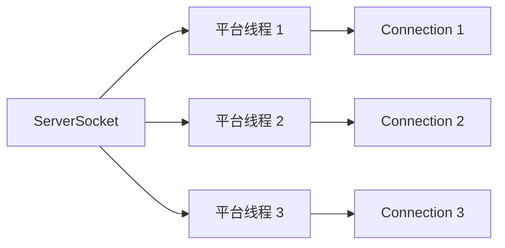
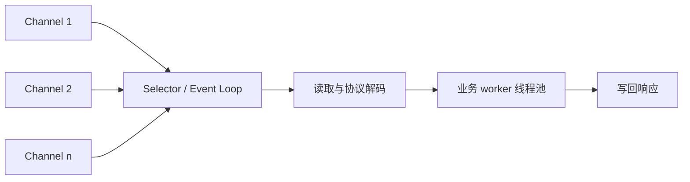
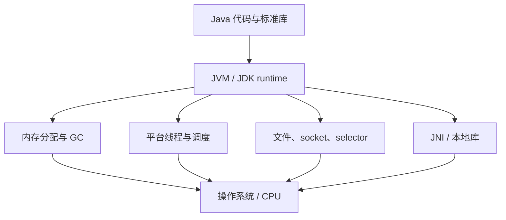

# Java - 第 14 课：I/O、NIO、Selector 与 JNI 边界

## 学习目标（本节结束后你能做到什么）

- 从线程会不会等待、谁通知完成、连接量与任务耗时四个维度区分 BIO、NIO 与 AIO。
- 讲清 `Channel`、`Buffer`、`Selector` 和 Reactor 模型如何协作。
- 判断 NIO、传统阻塞代码配合虚拟线程、Netty 分别适合什么场景。
- 理解 Java 进程如何通过 JVM 使用操作系统资源，以及 JNI/native 方法带来的边界成本。
- 识别把“一个 selector 线程承包所有业务”当成高性能方案的误区。

## 内容讲解（核心概念，用类比、例子、图示说清楚）

### 1. 网络服务器首先面对的是等待成本

一个连接的生命周期里，大部分时间可能不是在计算，而是在等待：

- 等客户端发数据。
- 等磁盘、数据库或下游接口返回。
- 等 socket 具备可读/可写条件。

传统的一连接一平台线程模型很直观：



连接数很高、每个连接大部分时间空闲时，大量平台线程会带来栈内存、调度与上下文切换成本。NIO 的目标之一，就是让少量线程关注大量连接的“就绪事件”，而不是让每个线程阻塞等一条连接。

### 2. BIO、NIO 与 AIO：先把名词放回调用语义

| 模型 | 发起调用后的线程表现 | 谁感知可继续处理 | Java 常见 API |
| --- | --- | --- | --- |
| BIO / blocking I/O | `read()` 等待数据完成，当前线程被阻塞 | 阻塞返回后当前线程 | `java.io`，阻塞 socket 流 |
| NIO / non-blocking + multiplexing | 非阻塞 channel 不必等到数据到达；线程通过 selector 获取已就绪通道 | 应用线程处理“就绪”事件并继续读写 | `java.nio.channels`、`Selector` |
| AIO / asynchronous I/O | 提交操作后返回，完成时通过回调/结果通知 | 操作完成通知触发后续逻辑 | `AsynchronousSocketChannel` 等 NIO.2 API |

需要特别纠正一个口号化说法：NIO 中 `Selector` 告诉你的是通道“已准备进行某种操作”，应用仍要执行读取、解码和业务处理；如果业务处理在事件循环上阻塞，整个事件循环照样卡住。

### 3. NIO 三件套：`Channel`、`Buffer`、`Selector`

#### 3.1 `Channel`

通道表示可读写的连接或文件资源。与传统 stream 常强调单向连续读取不同，channel 通常配合缓冲区进行显式读写。

#### 3.2 `Buffer`

缓冲区保存一次批量处理的数据，并通过 `position`、`limit`、`capacity` 描述读写状态。读数据的典型流程是：

```java
ByteBuffer buffer = ByteBuffer.allocate(4096);
int n = channel.read(buffer); // channel -> buffer
buffer.flip();                // 写模式切换为读模式
while (buffer.hasRemaining()) {
    consume(buffer.get());
}
buffer.clear();               // 为下一轮写入准备
```

忘记 `flip()` 或不理解 partial read/write，是 NIO 入门代码里比“背三大组件”更实际的坑。

#### 3.3 `Selector`

非阻塞通道可以注册到 selector，关注 `ACCEPT`、`CONNECT`、`READ`、`WRITE` 等就绪事件。一个事件循环大致如下：

```java
while (running) {
    selector.select();
    Iterator<SelectionKey> it = selector.selectedKeys().iterator();
    while (it.hasNext()) {
        SelectionKey key = it.next();
        it.remove();
        if (key.isAcceptable()) accept(key);
        if (key.isReadable()) readAndDispatch(key);
    }
}
```



selector 线程应尽量短小地处理注册、读写搬运、协议状态推进与任务分发；数据库查询、外部 HTTP 调用、复杂计算等耗时逻辑不应直接堵在事件循环上。

### 4. Reactor：将“事件准备好”变成可扩展结构

Reactor 模式常见职责拆分为：

- Acceptor：接受新连接。
- Event loop / Reactor：监听就绪事件，选择对应 handler。
- Handler：协议读写、编解码和状态推进。
- Worker：执行可能耗时的业务任务，处理完成后安排响应写回。

Netty 将这类模型工程化，提供事件循环、channel pipeline、buffer 管理、协议编解码和线程模型等能力。它不是“因为 Java 原生 NIO 不可用”才存在，而是因为手写正确的网络状态机、半包粘包、反压、内存管理和异常处理很费力。

### 5. NIO 与虚拟线程：不是新旧淘汰关系

第 5 课已经讲过虚拟线程：当大量任务阻塞于适配良好的 I/O 时，JDK 可以挂起虚拟线程，让载体平台线程服务其他任务。于是应用可以保留清晰的同步写法，而不必为省平台线程把所有流程拆成回调状态机。

选型时可这样判断：

| 情况 | 可优先考虑 |
| --- | --- |
| 普通请求/响应服务，依赖库提供阻塞 API，追求直观代码 | 阻塞式 API + 虚拟线程，做好连接池和限流 |
| 自定义协议网关、长连接、极高连接密度、需要精细反压/事件循环治理 | Netty / NIO Reactor |
| 已有成熟事件驱动链路 | 不因虚拟线程存在就贸然重写 |
| CPU 密集业务 | 无论 NIO 或虚拟线程，都仍受 CPU 约束，应隔离与限并发 |

虚拟线程降低的是“等待时长期占用平台线程”的代价；它不会增加数据库连接数，也不会让慢下游变快。NIO 降低的是大量连接等待就绪的线程压力；它也不会自动让阻塞的业务处理消失。

### 6. 文件 I/O、网络 I/O 与资源边界

无论使用哪种模型，都应把资源生命周期明确表达出来：

- 文件和普通流用 `try-with-resources`。
- channel、selector 与 socket 同样需要关闭。
- 写操作可能只写入部分缓冲区，必须保留剩余数据并关注可写事件。
- TCP 是字节流，不自带消息边界；业务协议要定义长度、分隔或帧格式。
- 对大请求或慢消费者需要限流/反压，避免只把压力堆入内存缓冲区。

异常释放和跨进程消息协议的通用原则，详见 [13_异常、资源管理与序列化边界.md](/Users/xinqi/Documents/learning_stuff/Java/13_异常、资源管理与序列化边界.md)。

### 7. Java 进程如何触碰操作系统

Java 屏蔽了很多平台差异，但不是运行在“操作系统之外”。JVM 本身是操作系统进程：



- 堆、代码缓存、线程栈等最终要向操作系统申请虚拟内存。
- 平台线程映射到操作系统线程；虚拟线程则由 JVM 调度到载体平台线程上。
- 文件和网络操作最终调用平台 I/O 能力；NIO 的 selector 会利用适合所在平台的多路复用设施。
- 信号、系统属性、时钟、文件权限与动态链接库都是运行环境边界。

这也解释了为什么同一段 Java 业务代码在不同部署配置、文件系统或容器限制下可能出现不同性能与故障表现。

### 8. `native` 与 JNI：逃出 JVM 边界的窄门

`native` 方法声明实现不在 Java 类体中，而由已加载的本地库提供：

```java
public final class Checksum {
    static {
        System.loadLibrary("fastchecksum");
    }

    public native long crc32(byte[] bytes);
}
```

开发一个 JNI 调用通常涉及：

1. 用 `javac -h` 根据 native 声明生成 C/C++ 头文件。
2. 实现本地函数并针对目标平台编译 `.so`、`.dylib` 或 `.dll`。
3. 配置库加载路径或以明确位置加载本地库。
4. 在 Java 与 native 边界处理参数、异常、内存与线程规则。

旧资料里的 `javah` 已不应作为新项目做法；现代 JDK 使用 `javac -h`。

### 9. JNI 的成本：不是“C 更快”四个字

JNI 适合必须接入现有 C/C++ 库、操作系统能力或经过测量确认的极少数热点，而不应成为普通优化默认答案：

- 跨平台部署复杂：每个 OS/架构都要匹配本地库。
- native 内存越界、悬空指针和泄漏不再受 Java 类型安全与 GC 完全保护。
- JNI 边界转换、数组拷贝/固定和调用切换本身有成本，小调用未必更快。
- native 崩溃可能直接带走整个 JVM 进程，诊断比普通 Java 异常困难。
- native 代码持有引用不当，会影响对象可回收性。

所以性能讨论的顺序应是：先 profile 找瓶颈，优化算法、数据结构、分配和 I/O，再决定是否值得承担 native 边界。

### 10. 常见误区纠正

| 误区 | 更准确的结论 |
| --- | --- |
| NIO 就是一个线程处理全部工作 | selector 可用少量线程监听许多连接；耗时业务仍应隔离 |
| 非阻塞就一定更快 | 它改善等待/线程扩展性，简单低并发业务未必收益 |
| `parallelStream()` 适合并行发远程请求 | 它默认占用公共 ForkJoinPool；阻塞 I/O 易影响其他任务，已有第 11 课不再重复展开 |
| 有了虚拟线程，Netty/NIO 都过时 | 两者解决不同层次问题，按协议、连接密度与团队模型选择 |
| JNI 能让 Java 业务自然地跨平台提速 | JNI 增加部署、安全和诊断成本，且需要按平台构建 |

### 11. 面试表达模板

> BIO 中一个平台线程进行阻塞读写时会等待 I/O 完成，简单直观但大量空闲长连接时线程成本高。NIO 通过 `Channel`、`Buffer` 与 `Selector` 构建同步非阻塞的就绪事件处理，一个事件循环可以管理许多连接，但就绪后的业务耗时仍需隔离，Netty 正是把 Reactor、协议处理和缓冲区管理工程化。虚拟线程让许多阻塞式 I/O 服务重新获得更好的可扩展性，但不替代需要精细事件循环和反压控制的网关场景。Java 与操作系统交互最终由 JVM 落到平台能力；JNI 能调用本地库，却以跨平台、安全和诊断复杂度为代价。

## 小结（3-5 条关键点）

1. BIO、NIO、AIO 的差别要从等待和通知语义理解，不要仅背包名。
2. NIO 的核心是 channel/buffer/selector；selector 负责就绪分派，不应承载长耗时业务。
3. NIO/Netty 与虚拟线程是不同抽象层的选择，前者偏事件驱动与连接治理，后者偏保留直观阻塞式业务写法。
4. Java 程序仍依赖操作系统资源；跨平台抽象并不消除部署与性能边界。
5. JNI 是必要时的本地能力桥梁，也是内存安全、可移植性和故障定位风险的入口。

## 问题 （检测用户对当前章节内容是否了解）

1. BIO 的线程压力来自哪里？NIO 改变了哪一种等待方式？
2. `ByteBuffer.flip()` 在一次读处理链路中起什么作用？
3. 为什么 selector 线程上不应直接执行数据库慢查询？
4. “就绪通知”和“AIO 的完成通知”在语义上有什么区别？
5. 一个普通 CRUD Web 服务与一个百万长连接协议网关，为什么可能分别偏好虚拟线程和 Netty？
6. TCP 没有消息边界，对你设计服务端读取逻辑有什么影响？
7. JNI 的部署和故障风险有哪些？什么条件下你才会考虑使用它？
8. 解释为什么“Java 跨平台”与“Java 程序完全无需考虑操作系统”不是一回事。
