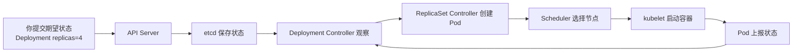

# Kubernetes - 第 1 课：Kubernetes到底在解决什么问题：从单机部署到容器编排

## 学习目标（本节结束后你能做到什么）

学完这一节，你不应该只是能说一句“Kubernetes 是容器编排平台”。这个定义太短，也太容易让人误解。你应该能做到：

- 从一个后端服务的部署演进过程出发，解释为什么单机脚本、Docker、Docker Compose 都会在生产规模下遇到边界。
- 说清楚 Docker 解决的是“应用交付物标准化”，Kubernetes 解决的是“集群运行状态持续管理”。
- 理解 Kubernetes 的核心不是 YAML，而是“声明式 API + 控制器 + 调谐循环”。
- 能区分命令式运维和声明式运维的思维差异。
- 能解释 Kubernetes 为什么常被称为“分布式操作系统”，以及这个说法到底准确在哪里、不准确在哪里。
- 能用订单服务、支付服务、库存服务这类后端系统案例，讲清 Kubernetes 对发布、扩容、故障恢复、服务发现和资源隔离的价值。

## 内容讲解（核心概念，用类比、例子、图示说清楚。不要太提纲化，加强每一节深度，力求深度。）

### 1. 先忘掉 Kubernetes，先看一个后端服务是怎么变复杂的

你是一个后端工程师，最开始只有一个服务，比如 `order-service`。它是一个 Java 服务，打出来一个 jar 包，部署在一台云服务器上。

最早的部署流程可能非常朴素：

```text
1. 本地打包：mvn package
2. 上传 jar：scp order-service.jar user@server:/opt/app/
3. 登录机器：ssh user@server
4. 停旧进程：kill old_pid
5. 启新进程：nohup java -jar order-service.jar &
6. 看日志：tail -f app.log
```

在系统很小时，这套方式没有什么问题。机器少、服务少、发布频率低，人的脑子可以记住“订单服务在 A 机器，支付服务在 B 机器，Nginx 配在 C 机器”。出了问题，SSH 上去看日志、重启进程，也能处理。

但复杂度不是线性增长的。

当系统从一个服务变成多个服务时，你开始需要关心服务之间的调用。当单个服务从一个实例变成多个实例时，你开始需要负载均衡。当机器从一台变成多台时，你开始需要调度和故障迁移。当环境从生产一个变成测试、预发、生产多个环境时，你开始需要配置隔离。当发布从一周一次变成一天多次时，你开始需要滚动发布和快速回滚。

我们把这个变化展开：

```text
阶段 1：一台机器，一个进程
问题：能不能跑起来？

阶段 2：一台机器，多个进程
问题：端口、配置、日志、启动顺序怎么管理？

阶段 3：多台机器，多个服务
问题：服务跑在哪台机器？挂了谁来恢复？调用方怎么找到它？

阶段 4：多台机器，多个服务，每个服务多个副本
问题：副本数怎么维持？流量怎么分配？发布怎么不中断？

阶段 5：多团队、多环境、高频发布
问题：资源怎么隔离？权限怎么控制？变更怎么审计？故障怎么定位？
```

Kubernetes 不是从第一阶段诞生的。第一阶段用 systemd、shell 脚本、Nginx 就够了。Kubernetes 真正要解决的是第四、第五阶段的问题：当你不再能靠人肉记忆和手工脚本稳定管理一堆服务实例时，需要一个系统替你持续维护运行状态。

这里有一个很重要的认知转变：

```text
早期部署关注的是“把程序启动起来”。
Kubernetes 关注的是“让系统长期保持在你声明的状态”。
```

“启动起来”是一个瞬时动作；“长期保持”是一个持续过程。Kubernetes 的复杂度，基本都来自后者。

### 2. Docker 解决了什么，又没有解决什么

很多人学 Kubernetes 的入口是 Docker，所以容易误以为 Kubernetes 是“更高级的 Docker”。这个理解不准确。

Docker 最大的贡献，是把应用交付物标准化成镜像。以前一个服务能不能跑，取决于很多环境细节：机器上有没有正确版本的 JDK，系统库是否齐全，环境变量有没有配，目录结构是否一致，启动脚本是否匹配。于是经常出现一句老话：“我本地能跑，线上跑不了。”

容器镜像把应用、依赖、启动命令、基础文件系统打成一个相对稳定的包。你可以把镜像理解成“应用运行环境的快照说明书”。它让交付从“给你一堆文件和部署文档”变成“给你一个镜像，按这个命令启动”。

```text
没有容器镜像时：
代码 + JDK + 系统库 + 配置 + 启动脚本 + 运维文档 = 一次部署

有容器镜像后：
镜像 + 配置 + 运行参数 = 一次部署
```

这已经是巨大进步。但 Docker 仍然主要解决单个容器、单台机器或少量机器上的运行问题。它并没有完整回答下面这些生产问题：

- 现在有 300 个容器，分别应该放到哪些机器？
- 某个容器退出了，谁来发现并重启？
- 某台机器宕机了，这台机器上的服务副本谁来补到其他机器？
- 服务扩容时，如何自动创建更多副本？
- 服务缩容时，如何优雅摘流再停止？
- 新版本发布时，如何保证旧版本不要一次性全被杀掉？
- 一个服务的 Pod IP 总在变，调用方如何用稳定名字访问它？
- 某个服务内存泄漏，如何避免它吃光整台机器？
- 不同团队共享集群时，权限、资源和网络如何隔离？
- 谁能读取数据库密码？谁能修改生产 Deployment？

这些不是“容器能不能跑”的问题，而是“很多容器组成的系统能不能长期稳定运行”的问题。

Docker 像是标准化集装箱。它让货物包装统一，方便运输和装卸。但港口真正要运转起来，还需要调度系统：哪个箱子放哪艘船，哪个码头有空位，哪条路线拥堵，哪个箱子损坏要替换，船来了如何卸货，订单变化如何重新安排。Kubernetes 扮演的更像这个港口调度系统。

这个类比里要注意边界：Docker 负责把应用打成标准箱子，Kubernetes 负责在一个集群里调度、连接、监控和恢复这些箱子。

### 3. Docker Compose 为什么也不够

如果你用过 Docker Compose，会觉得它已经能描述多个容器了。比如一个本地开发环境里有：

```yaml
services:
  order:
    image: order:v1
    ports:
      - "8080:8080"
  redis:
    image: redis:7
  mysql:
    image: mysql:8
```

Docker Compose 很适合本地开发、测试环境、小规模单机场景。它能帮你把多个容器按一份文件启动起来，也能建立简单网络。但它不是生产级集群调度系统。

它的核心限制在于：Compose 的主要视角仍然是“在这台机器上启动这些容器”。而 Kubernetes 的视角是“在整个集群中持续维持这些应用对象的状态”。

差别可以这样理解：

```text
Docker Compose：
这台机器上应该启动 order、redis、mysql。

Kubernetes：
整个集群里应该长期保持 order 服务 6 个可用副本，
每个副本需要 1 核 CPU、1Gi 内存，
只能调度到带有 app 节点池标签的节点，
启动后先通过 readinessProbe 才能接流量，
对外通过 order-service 这个稳定服务名暴露，
发布时最多允许 1 个副本不可用。
```

这里的关键不是“语法复杂了”，而是表达能力变了。Kubernetes 描述的不是“启动哪些容器”，而是“应用在集群中的运行约束和稳定性目标”。

如果只是本地开发，Docker Compose 很轻巧。但如果你要管理生产环境的服务副本、滚动发布、自动恢复、节点故障、资源调度、权限隔离，它就不够了。

### 4. 真正的复杂度来自“状态漂移”

理解 Kubernetes 之前，一定要先理解一个词：状态漂移。

你原本希望订单服务有 4 个副本，但真实世界随时可能发生变化：

- 一个 Pod 因为内存超过限制被 OOMKilled。
- 一个节点宕机，节点上的两个 Pod 消失。
- 新版本镜像拉取失败。
- 某个 Pod 启动了，但健康检查一直失败。
- 业务高峰来了，需要从 4 个副本扩到 10 个。
- 发布新版本时，新旧版本同时存在。
- 某个运维手工删除了一个 Pod。

这些变化会让“真实状态”偏离“期望状态”。

```text
期望状态：
order-service 应该有 4 个可用副本。

真实状态：
只有 2 个副本 Ready，1 个 Pending，1 个 CrashLoopBackOff。

系统要做的事：
找出差距，分析原因，继续创建、重启、调度、等待或上报。
```

传统脚本通常只能处理一次性动作。脚本可以启动 4 个进程，但脚本结束后，世界继续变化。如果 10 分钟后一个进程挂了，脚本不会自动感知，除非你额外写守护脚本、监控脚本、重启脚本、发布脚本、回滚脚本、扩容脚本。写到最后，你会发现自己在重新发明一个简陋的 Kubernetes。

Kubernetes 的核心设计，就是承认真实世界一直在变化，然后用控制器不断把真实状态拉向期望状态。

### 5. Kubernetes 的本质：声明式 API + 控制器 + 调谐循环

很多初学者觉得 Kubernetes 的核心是 YAML。因为他们接触 Kubernetes 的第一件事通常是写 YAML：

```yaml
apiVersion: apps/v1
kind: Deployment
metadata:
  name: order-service
spec:
  replicas: 4
  selector:
    matchLabels:
      app: order
  template:
    metadata:
      labels:
        app: order
    spec:
      containers:
        - name: order
          image: order:v1
```

但 YAML 只是表达形式。Kubernetes 真正的核心是背后的控制模型。

你把这份 YAML 提交给 API Server，本质是在说：“我希望集群里存在一个 Deployment，它长期维护 4 个 `order:v1` 副本。”提交成功后，Kubernetes 不是简单执行一条“启动 4 个容器”的命令，而是把这个期望状态保存下来，然后由控制器持续工作。

控制器的逻辑可以抽象成一个循环：

```text
while true:
    期望状态 = 从 API Server 读取
    真实状态 = 从集群当前状态观察
    差异 = 期望状态 - 真实状态
    如果有差异:
        执行动作让真实状态更接近期望状态
    等待下一次变化
```

这就是调谐循环。它和后端系统里的很多机制很像：

- 消息队列消费者失败后重试：不是保证永远不失败，而是失败后继续补偿。
- 主从复制：不是保证机器永远不挂，而是持续复制状态，故障后切换。
- 定时对账：不是保证每一步都绝对一致，而是发现差异后修正。
- 缓存重建：不是保证缓存永远不丢，而是丢了之后能从数据源恢复。

Kubernetes 的控制器也是类似思想：系统不假设世界稳定，而是持续对账。

可以用一个图表示：



这个图先不用记组件细节，第二章会深入讲。现在只要抓住一件事：Kubernetes 是一个围绕状态工作的系统。它不是运行一条命令就结束，而是一直观察、比较、修正。

### 6. 命令式运维和声明式运维的差别

传统运维脚本大多是命令式的。你告诉系统每一步怎么做：

```text
去 A 机器；
停掉旧进程；
拉取新包；
启动新进程；
修改 Nginx upstream；
重载 Nginx；
检查日志。
```

命令式方式的问题是，它对中间状态非常敏感。假设第三步成功、第四步失败，系统处于什么状态？脚本下次重跑是否安全？如果 A 机器挂了怎么办？如果 Nginx reload 成功但进程没起来怎么办？你需要在脚本里处理大量分支。

声明式方式则是告诉系统结果是什么：

```text
我希望 order-service 当前版本是 v2；
我希望副本数是 4；
我希望发布过程中至少保留 3 个可用副本；
我希望只有 Ready 的副本才能接流量。
```

Kubernetes 会自己决定怎么逐步接近期望状态。它可能先创建一个新 Pod，等它 Ready 后再删一个旧 Pod；如果新 Pod 不 Ready，就暂停推进；如果旧 Pod 被误删，就补一个；如果节点资源不够，就让 Pod Pending 并记录事件。

声明式不是说你不用理解过程。恰好相反，生产排障时你必须理解 Kubernetes 如何逼近状态。但声明式把“你要什么”和“系统怎么一步步做到”分开了。

这个分离非常重要：

```text
用户 / 平台工程师：
声明目标和约束。

Kubernetes 控制器：
负责持续逼近目标。

事件 / 状态 / 日志：
告诉你逼近过程中哪里失败了。
```

### 7. Kubernetes 到底编排了什么

“容器编排”这个词容易让人以为 Kubernetes 只是管理容器启动顺序。实际上它编排的是一整套运行时关系。

第一类是计算资源。Pod 要运行在节点上，节点有 CPU、内存、磁盘、网络。Kubernetes 要根据资源请求和调度约束决定 Pod 放在哪里。它不是随便找机器，而是在做资源分配。

第二类是副本关系。一个服务需要几个实例？少了要补，多了要缩。Deployment 负责无状态服务的副本管理和发布，StatefulSet 负责带稳定身份的有状态实例，DaemonSet 负责每台节点一个实例，Job 负责一次性任务。

第三类是网络关系。Pod 会不断变化，所以不能让调用方直接依赖 Pod IP。Kubernetes 用 Service 提供稳定访问入口，用 DNS 提供稳定名称，用 Ingress 或 Gateway 处理外部流量入口，用 CNI 插件实现 Pod 网络。

第四类是配置和密钥。镜像不应该绑定环境配置，所以 Kubernetes 用 ConfigMap 管理普通配置，用 Secret 管理敏感信息。它们可以作为环境变量或文件挂载到容器里。

第五类是存储关系。容器本地文件系统是临时的，Pod 重建后可能消失。Kubernetes 用 Volume、PV、PVC、StorageClass 把应用和底层存储解耦。

第六类是安全和权限。谁能创建资源，谁能读取 Secret，Pod 能不能访问另一个 namespace 的服务，容器能不能使用宿主机网络，这些都需要被管理。

所以 Kubernetes 编排的是：

```text
应用实例 + 节点资源 + 副本关系 + 网络入口 + 配置密钥 + 持久化存储 + 权限策略
```

这就是它复杂的原因，也是它有价值的原因。

### 8. 一个订单系统在 Kubernetes 里的样子

假设你有一个简化版电商后端：

- `gateway-service`：对外 API 网关。
- `order-service`：订单服务。
- `payment-service`：支付服务。
- `inventory-service`：库存服务。
- `notification-service`：通知服务。
- Redis：缓存和分布式锁。
- MySQL：持久化订单、支付和库存数据。

在传统机器部署里，你可能有一张表记录每个服务部署在哪些机器：

```text
gateway-service      10.0.1.11, 10.0.1.12
order-service        10.0.1.21, 10.0.1.22, 10.0.1.23
payment-service      10.0.1.31, 10.0.1.32
inventory-service    10.0.1.41, 10.0.1.42
```

然后 Nginx upstream 或注册中心里维护这些地址。扩容时加机器，缩容时摘流，发布时逐台替换。做得成熟的公司会有自己的发布平台和服务治理体系；做得不成熟时，就会散落在脚本、文档和人的经验里。

在 Kubernetes 里，思路会变成：

```text
order-service 的 Deployment：
  我需要 6 个订单服务 Pod。
  每个 Pod 使用 order:v12 镜像。
  每个 Pod 至少需要 1 核 CPU 和 1Gi 内存。
  启动后 /health/ready 通过才可以接流量。
  发布时最多允许 1 个副本不可用。

order-service 的 Service：
  任何集群内服务都可以通过 order-service 这个名字访问订单服务。
  后端自动选择 app=order 的 Ready Pod。

order-service 的 ConfigMap：
  数据库地址、Redis 地址、业务开关来自配置对象。

order-service 的 Secret：
  数据库密码和第三方 token 不写进镜像。
```

这时订单服务的 Pod 具体在哪台节点，调用方不需要知道。库存服务调用订单服务，也不需要知道订单服务当前有几个实例、IP 是多少，只要访问 `order-service`。

当订单服务某个 Pod 崩溃，Deployment 会补副本。当节点宕机，节点上的 Pod 会在其他节点重建。当你把镜像改成 `order:v13`，Deployment 会滚动发布。当流量上涨，HPA 可以根据指标扩副本。当某个新 Pod 健康检查失败，它不会进入 Service 后端。

这不是说 Kubernetes 让你不再需要架构设计。数据库连接池、接口幂等、下游限流、消息可靠性、缓存一致性仍然是你的事。Kubernetes 管的是应用运行层面的生命周期，不替你解决业务语义问题。

### 9. Kubernetes 不保证什么

为了避免神化 Kubernetes，这里必须明确它不保证什么。

Kubernetes 不保证你的应用代码没有 bug。如果服务启动后一直抛异常，它最多帮你重启，重启后还是会失败。

Kubernetes 不保证数据库自动高可用。你可以用 StatefulSet 部署数据库，但主从复制、选主、备份恢复、数据一致性仍然是数据库系统或 Operator 要解决的问题。

Kubernetes 不保证发布一定安全。它提供滚动更新和健康检查机制，但如果 readinessProbe 写错，或者数据库 schema 不兼容，发布仍然可能出事故。

Kubernetes 不保证资源无限。如果集群节点 CPU、内存不足，Pod 会 Pending；如果 limits 配得不合理，容器可能 OOMKilled；如果镜像仓库慢，扩容也会慢。

Kubernetes 不自动理解业务优先级。它不知道订单服务比后台报表更关键，除非你通过资源配额、优先级、调度策略、PDB 等机制表达出来。

这点很重要：Kubernetes 是平台能力，不是业务可靠性的替代品。它提供的是标准化的运行时控制面，让你用统一方式表达和治理应用运行状态。

### 10. 为什么说 Kubernetes 像“分布式操作系统”

普通操作系统管理单机资源。它管理进程、文件、网络、权限、CPU 调度、内存隔离。你写一个程序，不需要自己直接操控硬件，操作系统提供抽象。

Kubernetes 管理集群资源。它管理 Pod、Service、Volume、Namespace、RBAC、调度、服务发现和控制器。你部署一个服务，不需要自己指定每个进程在哪台机器，不需要手工维护每个实例 IP，Kubernetes 提供集群层面的抽象。

可以这样对比：

```text
单机操作系统：
进程       -> 被调度到 CPU 上运行
文件       -> 通过文件系统抽象磁盘
端口       -> 通过网络栈暴露通信能力
用户权限   -> 控制谁能访问什么资源

Kubernetes：
Pod        -> 被调度到 Node 上运行
Volume     -> 抽象底层存储
Service    -> 抽象一组动态 Pod 的访问入口
RBAC       -> 控制谁能访问什么 API 资源
Namespace  -> 提供逻辑隔离边界
```

这个类比准确的地方在于：Kubernetes 确实提供了集群级资源抽象和调度能力。

但这个类比也不能过度。操作系统管理的是一台机器内部，Kubernetes 管理的是多台机器组成的分布式环境。分布式环境有网络分区、节点失联、状态延迟、最终一致性、控制器异步调谐等问题。所以 Kubernetes 的行为不像本地函数调用那样立即完成。`kubectl apply` 成功，只代表期望状态写入成功，不代表所有 Pod 已经 Ready。

这也是很多新手的第一个坑：把 Kubernetes 当同步系统。实际上它是状态驱动的异步系统。

### 11. Kubernetes 学习最应该抓住的主线

学 Kubernetes 最怕被对象名淹没：Pod、Deployment、ReplicaSet、Service、Ingress、ConfigMap、Secret、PV、PVC、Node、Namespace、Role、RoleBinding。你如果一个一个背定义，很快会觉得它只是 YAML 大杂烩。

更好的方式是抓住这条主线：

```text
1. 我希望运行什么应用？
   -> Pod / Container

2. 我希望它长期保持几个副本、如何发布？
   -> Deployment / ReplicaSet

3. 我希望它跑在哪些节点、使用多少资源？
   -> Scheduler / requests / limits / affinity

4. 我希望别人如何稳定访问它？
   -> Service / DNS / Ingress

5. 我希望它使用哪些配置、密钥和存储？
   -> ConfigMap / Secret / Volume / PVC

6. 我希望谁能操作它，它能访问谁？
   -> RBAC / ServiceAccount / NetworkPolicy

7. 它出问题时，我如何观察和恢复？
   -> logs / events / metrics / probes / controllers
```

Kubernetes 的所有对象，基本都可以放回这些问题里。这样学，你会知道每个对象为什么存在，而不是只记住字段。

### 12. 本章的核心判断：什么时候 Kubernetes 值得上

不是所有系统都必须上 Kubernetes。

如果你只有一个单体应用、一台机器、低频发布、流量不大、团队没有平台运维能力，那么 Kubernetes 可能是过度复杂。你需要的不一定是 K8s，可能是更简单的 PaaS、云应用服务、Docker Compose，甚至 systemd + Nginx。

但如果你有这些特征，Kubernetes 的价值会变大：

- 服务数量多，且每个服务有多个副本。
- 发布频繁，需要标准化滚动更新和回滚。
- 机器数量多，需要自动调度和故障迁移。
- 多团队共享基础设施，需要 namespace、RBAC、资源配额。
- 需要统一接入日志、监控、告警、服务发现。
- 需要跨环境保持部署模型一致。
- 未来希望接入 HPA、Service Mesh、Operator、GitOps 等平台能力。

Kubernetes 不是为了“显得高级”，而是为了把复杂系统运行时的共性问题收敛到一个标准平台上。它的收益来自规模和标准化，代价是学习成本和运维复杂度。

所以第 1 课的结论不是“Kubernetes 很强，所以都该用”，而是：

```text
当应用运行状态的复杂度超过人工脚本和单机工具能稳定管理的范围时，
你需要一个声明式、可调谐、可扩展的集群控制系统。
Kubernetes 就是这个系统的主流实现。
```

## 小结（3-5 条关键点）

- Docker 解决的是应用交付物标准化，让应用和依赖能以镜像形式一致运行；Kubernetes 解决的是多节点、多副本、多服务场景下的运行状态持续管理。
- Kubernetes 的核心不是 YAML，而是声明式 API、控制器和调谐循环：你声明期望状态，系统持续观察真实状态并修正偏差。
- 传统命令式运维强调“按步骤执行动作”，Kubernetes 声明式运维强调“长期维持目标状态”。
- Kubernetes 编排的不只是容器，还包括计算资源、副本关系、网络入口、配置密钥、存储挂载、权限策略和故障恢复。
- Kubernetes 有明显收益，也有复杂度成本；它适合服务规模、发布频率、团队协作和稳定性诉求达到一定程度后的平台化治理。

## 问题（检测你对当前章节内容是否了解）

1. Docker 已经能把应用跑进容器里，为什么生产环境仍然可能需要 Kubernetes？请从调度、恢复、发布、服务发现四个角度回答。
2. 什么是“状态漂移”？举一个订单服务副本数不符合预期的例子，说明 Kubernetes 会如何处理。
3. 命令式部署和声明式部署的核心差别是什么？为什么声明式部署更适合大规模集群？
4. 为什么说 `kubectl apply` 成功不等于服务已经可用？中间还可能经历哪些步骤？
5. Kubernetes 为什么像“分布式操作系统”？这个类比有哪些准确之处，又有哪些边界？
6. 如果一个团队只有一个低频发布的小型单体服务，你会建议它直接上 Kubernetes 吗？请说明收益和代价。
