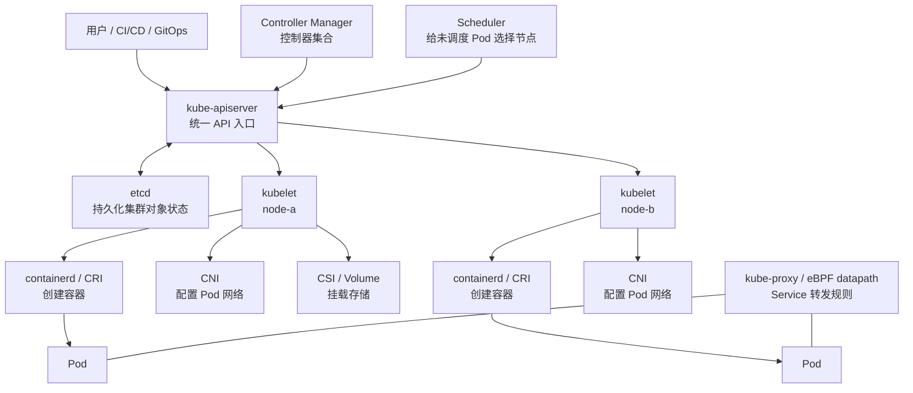
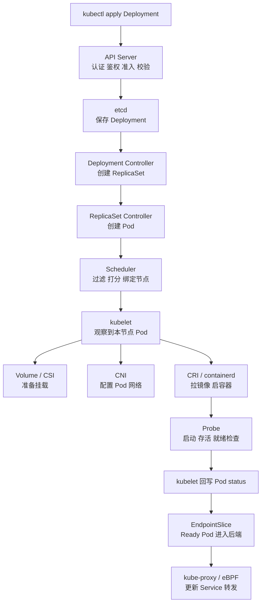

# Kubernetes - 第 2 课：集群架构：控制面、工作节点与调谐循环

## 学习目标（本节结束后你能做到什么）

学完这一节，你要能把 Kubernetes 集群架构讲成一条完整生命线，而不是背一串组件名。

你应该能做到：

- 画出控制面和工作节点的关系，并说清每个组件为什么存在。
- 理解 API Server 不只是“入口”，它还是认证、鉴权、准入、状态读写、watch 分发和 API 语义的统一边界。
- 理解 etcd 保存的是 Kubernetes 的对象状态，为什么其他组件不应该绕过 API Server 直接操作 etcd。
- 理解 `spec` 和 `status` 的区别，知道 Kubernetes 为什么把“你想要什么”和“现在怎么样”放在同一个对象的不同字段里。
- 解释控制器的调谐循环：它不是执行一次脚本，而是持续对账、持续补偿。
- 说清 Scheduler 只负责给 Pod 选节点，不负责启动容器。
- 说清 kubelet 如何在节点上把一个 Pod 真正变成容器、网络、卷、探针和状态上报。
- 能把常见问题映射回组件：Pending 看调度，ImagePull 看 kubelet/runtime，Service 没后端看 readiness 和 EndpointSlice，权限失败看 API Server/RBAC。

## 内容讲解（核心概念，用类比、例子、图示说清楚。不要太提纲化，加强每一节深度，力求深度。）

### 1. Kubernetes 集群不是“一台大机器”，而是一套状态控制系统

第 1 课我们讲过，Kubernetes 的核心是“声明期望状态，并持续把真实状态拉回期望状态”。第 2 课要回答的是：这件事在架构上到底怎么做到？

很多入门资料会直接列组件：

- API Server
- etcd
- Scheduler
- Controller Manager
- kubelet
- container runtime
- kube-proxy
- CNI

这当然没错，但如果只是背组件名，很容易学完仍然不知道一次 `kubectl apply` 后系统到底发生了什么。

更好的方式是先建立一个总图：



这个图里有两个层次：

第一层是控制面。控制面负责保存状态、暴露 API、做调度决策、运行控制器。它不直接跑你的业务容器。

第二层是工作节点。工作节点负责真正运行 Pod。每台节点上有 kubelet、容器运行时、网络插件、存储插件、Service 转发相关组件。

这里最容易误解的是“控制面控制节点”这句话。控制面不是像远程 SSH 一样直接登录节点执行命令。Kubernetes 更像一组组件围绕 API Server 交换状态：控制器创建 Pod 对象，Scheduler 给 Pod 写入节点绑定，kubelet 观察到分配给自己的 Pod，然后在本机执行动作。

它不是一个同步调用链：

```text
用户调用 API Server -> API Server 调 Controller -> Controller 调 Scheduler -> Scheduler 调 kubelet
```

真实情况更像：

```text
大家都看 API Server 里的对象状态。
每个组件发现自己负责的状态不满足，就更新对象或在本机执行动作。
```

这句话很重要，因为 Kubernetes 的异步、最终一致、事件驱动、排障方式，都从这里来。

### 2. API Server：不是普通网关，而是整个集群的状态入口

API Server 是 Kubernetes 最核心的组件。你执行 `kubectl get pods`、`kubectl apply -f deploy.yaml`、`kubectl delete pod xxx`，本质都是在和 API Server 通信。控制器、调度器、kubelet 也都围绕 API Server 工作。

但 API Server 不只是一个 HTTP 网关。它至少承担这些职责：

```text
1. 暴露 Kubernetes API
2. 认证：你是谁？
3. 鉴权：你能不能做这个动作？
4. 准入控制：这个请求进入集群前是否需要校验、默认值、修改或拒绝？
5. API 对象校验：字段是否合法，版本是否匹配？
6. 状态持久化：把对象写入 etcd。
7. 状态读取：给 kubectl、控制器、kubelet 等提供查询。
8. watch 分发：让组件监听对象变化。
9. 乐观并发控制：通过 resourceVersion 防止覆盖冲突。
```

拿一个最简单的创建 Deployment 举例：

```bash
kubectl apply -f order-deployment.yaml
```

API Server 收到请求后，不会立刻启动容器。它会先处理 API 请求本身：

```text
请求进来
  -> 认证：请求来自哪个用户、证书、token 或 ServiceAccount？
  -> 鉴权：这个主体有没有 create/update deployments 的权限？
  -> 准入：是否允许用这个镜像？是否必须设置 resources？是否补默认字段？
  -> 校验：apiVersion、kind、spec 字段是否合法？
  -> 持久化：写入 etcd。
  -> 返回：对象创建或更新成功。
```

所以 `kubectl apply` 成功的意思是：期望状态已经被 API Server 接受并保存。它不等于 Pod 已经创建，更不等于容器已经启动，也不等于服务已经 Ready。

API Server 还是 Kubernetes 一致性的边界。所有组件通过它读写对象，而不是直接彼此调用。这样做有几个好处：

- 权限统一：所有读写都经过认证、鉴权和审计。
- 语义统一：所有对象都遵守 Kubernetes API 规范。
- 扩展统一：CRD、自定义控制器、Admission Webhook 都能接入同一套 API。
- 状态统一：etcd 作为后端存储，API Server 作为唯一合法读写入口。
- 协作解耦：控制器、Scheduler、kubelet 不需要直接知道彼此细节。

如果每个组件都能直接改 etcd，集群会很快失控。比如某个组件绕过准入控制写入非法对象，另一个组件看不懂；某个组件绕过鉴权修改 Secret；某个组件更新状态时覆盖了别人的字段。API Server 的存在，就是为了把这些行为收束到统一规则里。

### 3. etcd：Kubernetes 的事实账本，但不是业务数据库

etcd 是 Kubernetes 的持久化状态存储。你可以把它理解为集群的事实账本：Deployment、Pod、Service、ConfigMap、Secret、Node、Role、RoleBinding 等对象最终都持久化在 etcd 里。

但 etcd 不是业务数据库。你的订单、支付流水、库存扣减记录，不应该放在 etcd 里。etcd 保存的是 Kubernetes 控制系统需要的对象状态。

例如，一个 Pod 对象大概包含两类信息：

```text
metadata:
  name、namespace、labels、annotations、ownerReferences、resourceVersion

spec:
  期望怎么运行：容器镜像、命令、资源、卷、调度约束、重启策略

status:
  当前怎么样：phase、conditions、containerStatuses、podIP、nodeName、重启次数
```

这里引出 Kubernetes 特别重要的一组概念：`spec` 和 `status`。

`spec` 表示期望状态。通常由用户、平台、控制器写入。比如 Deployment 的 `spec.replicas=4` 表示你希望有 4 个副本。

`status` 表示真实状态。通常由控制器或 kubelet 更新。比如 Deployment 的 `status.availableReplicas=3` 表示当前可用副本只有 3 个。

这两个字段放在同一个对象里，是 Kubernetes 设计里非常漂亮的一点：对象既包含“你希望它是什么样”，也包含“系统观察到它现在是什么样”。控制器要做的事情，就是比较 spec 和 status，再采取动作。

```text
spec：我想要什么。
status：现在怎么样。
controller：差多少，我来补。
```

etcd 保存这些对象状态，但它不理解“订单服务要怎么发布”。真正理解业务对象含义的是控制器。etcd 只是可靠地保存键值数据，并支持 watch。它很关键，但不是 Kubernetes 的大脑。大脑是 API 语义和控制器逻辑。

etcd 还有几个生产上很重要的特点：

- 它是强一致键值存储，通常通过 Raft 保证多个成员之间的一致性。
- 它对延迟和磁盘 I/O 敏感，etcd 抖动会影响整个集群控制面。
- 它需要定期备份，因为 etcd 丢失意味着集群对象状态丢失。
- 不应该把大量无关数据或高频大对象塞进 Kubernetes API，否则会给 etcd 和 API Server 压力。

对后端工程师来说，可以把 etcd 类比成“控制系统元数据数据库”。它类似配置中心、注册中心、状态账本的组合，但只服务于 Kubernetes 控制面。

### 4. watch：Kubernetes 组件不是靠疯狂轮询工作

如果控制器每隔一秒全量扫描所有对象，集群稍微大一点就会崩。Kubernetes 不是这么工作的。

Kubernetes API 支持 watch。组件可以先 list 一批对象，然后 watch 后续变化。控制器通常通过 informer 机制维护本地缓存，再把变化事件放入队列处理。

你可以简单理解成：

```text
第一次：
Controller list 所有 Deployment，建立本地缓存。

之后：
API Server 通过 watch 把 Deployment 的新增、修改、删除事件推给 Controller。

Controller：
把变化对象的 key 放进工作队列，异步处理。
```

这有点像后端系统里的“先全量加载，再订阅增量变更”。例如一个配置中心客户端启动时先拉全量配置，然后长连接监听配置变化。Kubernetes 控制器也是类似思想，只是它处理的是 Kubernetes 对象。

不过要注意，控制器不是只依赖事件本身。成熟控制器的核心是 level-driven，而不是 edge-driven。也就是说，它不应该只关心“刚刚来了一个创建事件”，而应该关心“当前对象状态和期望状态是否一致”。即使事件丢了、重复了、延迟了，只要下一次重新对账，仍然能修正。

这也是为什么调谐循环要设计成幂等。控制器执行同一个对象多次，结果应该仍然正确。比如 ReplicaSet Controller 发现期望 4 个 Pod，当前已有 4 个，就什么都不做；如果当前只有 3 个，就创建 1 个；如果当前有 5 个，就删除 1 个。

### 5. Controller Manager：一组持续对账的控制器

Controller Manager 不是一个单一控制器，而是一组控制器的集合。Kubernetes 里有很多内置控制器，比如：

- Deployment Controller
- ReplicaSet Controller
- StatefulSet Controller
- DaemonSet Controller
- Job Controller
- Node Controller
- EndpointSlice Controller
- ServiceAccount Controller
- Namespace Controller
- Garbage Collector

这些控制器都围绕同一个基本模式工作：

```text
观察对象
  -> 比较期望状态和真实状态
  -> 如果不一致，创建、更新或删除相关对象
  -> 等下一轮变化或定期重新同步
```

以 Deployment 为例。你创建的不是 Pod，而是 Deployment。Deployment Controller 看到 Deployment 后，会创建或更新 ReplicaSet。ReplicaSet Controller 看到 ReplicaSet 后，会创建或删除 Pod。Scheduler 看到未绑定节点的 Pod 后，会给它选择节点。kubelet 看到分配给自己节点的 Pod 后，才在节点上启动容器。

```text
Deployment
  -> ReplicaSet
    -> Pod
      -> Container
```

这条链路里，每一层负责的事情不同：

- Deployment：负责版本、滚动更新、回滚策略。
- ReplicaSet：负责某个版本的一组 Pod 副本数量。
- Pod：表达一次具体的运行实例。
- Container：最终在节点上运行的进程隔离单元。

这里有一个非常重要的关系：ownerReferences。控制器创建下级对象时，会在对象上写 ownerReferences，表示“这个对象归谁管理”。比如 ReplicaSet 归 Deployment 管，Pod 归 ReplicaSet 管。这样 Kubernetes 可以做级联删除和垃圾回收。

比如你删除 Deployment，Kubernetes 知道它拥有 ReplicaSet，ReplicaSet 又拥有 Pod，于是可以级联清理。如果你手工删除一个被 ReplicaSet 管理的 Pod，ReplicaSet Controller 会发现副本少了，再创建一个新 Pod。这就是为什么生产里“删除 Pod”通常只是让它重建，不是永久缩容。真正缩容要改 Deployment 的 replicas。

控制器思想还有一个很深的点：每个控制器只负责一小段状态，不试图掌控全世界。Deployment Controller 不负责拉镜像，Scheduler 不负责健康检查，kubelet 不负责全局副本数，Service Controller 不负责业务代码是否正常。这种分工让系统可扩展，但也要求你排障时能判断问题卡在哪个环节。

### 6. Scheduler：它只做一件事，给 Pod 选节点

Scheduler 的职责很明确：为还没有绑定节点的 Pod 选择一个合适的 Node。

它不创建 Pod，也不启动容器。它只是看见一个 Pod 没有 `nodeName`，然后通过调度算法选择节点，把绑定结果写回 API Server。

调度大致分两个阶段：

```text
Filtering：过滤
  排除不满足硬性条件的节点。

Scoring：打分
  对剩余节点打分，选择更合适的节点。
```

过滤阶段会看很多条件，比如：

- 节点是否 Ready。
- 节点剩余 CPU、内存是否满足 Pod requests。
- Pod 的 nodeSelector 是否匹配节点标签。
- 节点上的 taint 是否被 Pod toleration 容忍。
- Pod affinity / anti-affinity 是否满足。
- 卷是否能在该节点挂载。
- 端口冲突是否存在。

打分阶段则更像“在可选节点中选最优”。比如更均衡地分散 Pod，或者更倾向把 Pod 放到资源利用率合适的节点。

调度失败时，Pod 会保持 Pending。Scheduler 会在事件里记录原因，比如：

```text
0/5 nodes are available:
3 Insufficient cpu,
1 node(s) had untolerated taint,
1 node(s) didn't match Pod's node affinity.
```

这个事件比“Pod Pending”四个字重要得多。Pending 不是一个根因，只是结果。根因通常在 Scheduler 的事件里。

还有一个常见误区：Scheduler 调度成功，不代表容器启动成功。调度成功只是 Pod 被绑定到了某个节点。后面还要靠 kubelet 拉镜像、挂载卷、配置网络、启动容器、执行探针。

所以 Pod 的生命周期至少可以粗略分成：

```text
对象已创建
  -> Scheduler 已绑定节点
  -> kubelet 已创建 Pod sandbox
  -> 镜像已拉取
  -> 容器已启动
  -> readinessProbe 通过
  -> Pod Ready
```

每一步都可能失败。

### 7. kubelet：节点上的执行者和状态上报者

kubelet 是每台工作节点上最重要的组件。它像节点代理，负责把“分配给本节点的 Pod 对象”变成真实运行的容器。

kubelet 主要做这些事：

- 向 API Server 注册 Node，并持续上报节点状态。
- 监听分配给本节点的 Pod。
- 调用容器运行时创建 Pod sandbox 和容器。
- 调用 CNI 插件配置 Pod 网络。
- 协调卷挂载，比如 ConfigMap、Secret、PVC。
- 拉取镜像。
- 启动 init containers 和业务 containers。
- 执行 livenessProbe、readinessProbe、startupProbe。
- 处理容器重启策略。
- 上报 Pod status、containerStatuses、事件和节点状态。

一个 Pod 被 Scheduler 绑定到 `node-a` 后，`node-a` 上的 kubelet 会看到它。接下来 kubelet 不是简单执行 `docker run`，而是做一串动作：

```text
1. 读取 Pod spec。
2. 准备 Pod sandbox，也就是 Pod 的基础运行环境。
3. 通过 CNI 为 Pod 分配网络，创建网络命名空间，拿到 Pod IP。
4. 准备和挂载 Volume，例如 emptyDir、Secret、ConfigMap、PVC。
5. 通过 CRI 调用 containerd 拉取镜像。
6. 按顺序运行 init containers。
7. 启动业务容器。
8. 周期性执行探针。
9. 把 Pod IP、容器状态、Ready 状态、重启次数回写到 API Server。
```

这里的 Pod sandbox 可以先理解为 Pod 的“外壳”。Pod 内多个容器共享网络命名空间，通常就是通过 sandbox 建立这个共享环境。很多运行时实现里会有一个很小的 pause 容器作为 Pod 网络命名空间的持有者。

kubelet 的一个关键职责是“上报状态”，而不是“让控制面直接进入节点查询”。API Server 里的 Pod status 很多就是 kubelet 写回去的。比如容器是否 Running、重启了几次、Pod IP 是什么、readiness 是否通过。

所以你看到：

```text
kubectl get pod
NAME            READY   STATUS    RESTARTS
order-xxx       1/1     Running   0
```

这些状态不是凭空来的。背后是 kubelet 在节点上观察容器运行情况，并更新 Pod status。

如果 kubelet 和 API Server 通信异常，控制面可能无法及时知道节点真实状态。如果 kubelet 挂掉，节点上的容器可能还在跑，但 Kubernetes 已经无法正常管理这些 Pod 的生命周期。这也是为什么节点健康和 kubelet 状态对集群很关键。

### 8. container runtime、CRI、CNI、CSI：kubelet 背后的插件边界

kubelet 不是自己实现容器、网络和存储的所有细节。Kubernetes 用接口把这些能力拆开。

CRI 是 Container Runtime Interface。kubelet 通过 CRI 调用容器运行时，比如 containerd 或 CRI-O。容器运行时负责拉镜像、创建容器、启动进程、停止容器、查询容器状态。

以前很多人说“Kubernetes 用 Docker 跑容器”，这是早期历史造成的印象。现在更准确的说法是：Kubernetes 通过 CRI 对接容器运行时，常见运行时是 containerd。Docker 本身不是 Kubernetes 的必要组件。

CNI 是 Container Network Interface。它负责给 Pod 配网络。Pod 能不能拿到 IP，不同节点 Pod 能不能互通，NetworkPolicy 能不能生效，很大程度取决于 CNI 插件。常见 CNI 包括 Calico、Cilium、Flannel 等。

CSI 是 Container Storage Interface。它负责对接存储系统，比如云盘、分布式存储、网络文件系统。PVC 能不能绑定，卷能不能挂载到节点，很多时候和 CSI 驱动有关。

可以这样理解：

```text
kubelet：我要把这个 Pod 跑起来。
CRI/runtime：我负责创建容器。
CNI：我负责给 Pod 配网络。
CSI/volume plugin：我负责给 Pod 挂存储。
```

这种接口化设计让 Kubernetes 可以适配不同底层实现。你可以换 CNI，也可以换 runtime，还可以用不同云厂商的 CSI。这也是 Kubernetes 生态强大的原因之一：核心控制模型稳定，底层能力通过插件扩展。

但接口化也意味着排障时要知道边界。比如 Pod 一直 ContainerCreating，可能是镜像拉取慢，可能是 CNI 分配 IP 失败，可能是 PVC 挂载失败。它们表面都卡在“容器创建中”，但负责组件不同。

### 9. kube-proxy 和 Service：访问路径不是 Pod 自己维护的

工作节点上还有一个重要组件：kube-proxy。它负责把 Service 的虚拟访问入口转换成节点上的转发规则。传统实现常见是 iptables 或 IPVS，新的方案也可能用 eBPF 替代 kube-proxy 的部分能力。

先不深入网络细节，先理解它在架构中的位置。

Pod 是动态的，IP 会变。Service 提供稳定访问入口。那访问 Service 的流量怎么转到后端 Pod？这就需要集群网络层维护转发规则。

大致过程是：

```text
1. 你创建 Service，selector 选择 app=order 的 Pod。
2. EndpointSlice Controller 根据 Ready Pod 维护 EndpointSlice。
3. kube-proxy 观察 Service 和 EndpointSlice。
4. kube-proxy 在节点上写入转发规则。
5. 访问 Service ClusterIP 的流量被转发到某个后端 Pod IP。
```

这里再一次体现 Kubernetes 的状态协作模式。Service Controller、EndpointSlice Controller、kube-proxy、kubelet 都不需要互相直接调用。它们都是通过 API 对象协作。

如果 Service 没有后端，常见原因不是 kube-proxy 坏了，而是 EndpointSlice 里没有 Ready Pod。为什么没有 Ready Pod？可能是 selector 标签不匹配，也可能是 Pod readinessProbe 没通过。这就要求你排障时沿对象链路看：

```text
Service
  -> selector 是否匹配 Pod labels
  -> EndpointSlice 是否有地址
  -> Pod 是否 Ready
  -> kube-proxy 是否同步规则
  -> CNI 网络是否连通
```

### 10. 一次 Deployment 创建到 Pod Ready 的完整生命线

现在把所有组件串起来。假设你提交一个订单服务 Deployment：

```yaml
apiVersion: apps/v1
kind: Deployment
metadata:
  name: order-service
spec:
  replicas: 3
  selector:
    matchLabels:
      app: order
  template:
    metadata:
      labels:
        app: order
    spec:
      containers:
        - name: order
          image: registry.example.com/order:v1
          ports:
            - containerPort: 8080
          readinessProbe:
            httpGet:
              path: /health/ready
              port: 8080
```

完整流程可以拆成 12 步。

第一步，`kubectl` 读取你的 kubeconfig，找到 API Server 地址和认证信息，把 YAML 转成 API 请求发送给 API Server。

第二步，API Server 做认证、鉴权、准入、默认值填充、字段校验。比如你有没有权限在这个 namespace 创建 Deployment，Admission Webhook 是否要求必须设置资源 limits。

第三步，API Server 把 Deployment 对象持久化到 etcd，并返回创建成功。

第四步，Deployment Controller 通过 watch/informer 观察到新的 Deployment。它发现当前没有对应 ReplicaSet，于是创建一个 ReplicaSet。这个 ReplicaSet 的 ownerReferences 指向 Deployment。

第五步，ReplicaSet Controller 观察到 ReplicaSet，发现期望 3 个 Pod，当前 0 个，于是创建 3 个 Pod 对象。每个 Pod 的 ownerReferences 指向 ReplicaSet。

第六步，Scheduler 观察到这些 Pod 没有绑定节点。它对节点做过滤和打分，考虑 CPU、内存、污点、亲和性、卷、节点状态等因素，选出节点，然后把绑定结果写回 API Server。

第七步，目标节点上的 kubelet 观察到“有 Pod 分配给我”。它开始执行本地创建流程。

第八步，kubelet 调用存储插件准备 Volume，调用 CNI 配置 Pod 网络，调用 CRI/containerd 拉取镜像。

第九步，kubelet 启动 Pod sandbox、init containers 和业务容器。

第十步，kubelet 执行 startupProbe、livenessProbe、readinessProbe。只有 readinessProbe 通过后，Pod 才会被标记为 Ready。

第十一步，kubelet 把 Pod status 回写 API Server。此时你用 `kubectl get pod` 才能看到 Ready 状态变化。

第十二步，如果有对应 Service，EndpointSlice Controller 会把 Ready Pod 加入 EndpointSlice，kube-proxy 或等价网络组件观察到后更新转发规则，流量才会打到这个 Pod。

画成流程图是这样：



这条生命线非常重要。以后你看到任何问题，都可以问：它卡在哪一步？

### 11. 为什么 Kubernetes 是异步系统

理解上面的流程后，就能明白为什么 Kubernetes 不是同步系统。

当你执行 `kubectl apply` 时，API Server 只是保存了 Deployment。后面的 ReplicaSet 创建、Pod 创建、调度、镜像拉取、网络配置、健康检查，都是不同组件异步完成的。

这就像你在电商系统里提交订单。下单接口返回成功，可能只是订单记录创建成功；后面还有库存锁定、支付、发货、通知等异步流程。你不能因为下单接口返回成功，就认为包裹已经送到用户手里。

Kubernetes 也是一样：

```text
apply 成功
  不等于 ReplicaSet 已创建
  不等于 Pod 已创建
  不等于 Pod 已调度
  不等于镜像已拉取
  不等于容器已启动
  不等于 readiness 通过
  不等于 Service 已经把流量转给它
```

所以生产发布不能只看 apply 是否成功，而要看 rollout 状态、Pod Ready、Endpoint、监控指标和业务探活。

异步系统还有一个特点：状态可能短暂不一致。你刚创建 Deployment 时，Deployment 存在但 ReplicaSet 还没创建；ReplicaSet 存在但 Pod 还没创建；Pod 存在但没有 nodeName；Pod 有 nodeName 但容器还在 Creating；容器 Running 但 readiness 还没通过。这些都是正常中间状态。

初学者容易把中间状态当异常。成熟的理解是：Kubernetes 一直在逼近期望状态，中间状态要结合时间、事件和组件职责判断。

### 12. spec/status：排障时最重要的对象视角

第 3 节讲过 spec 和 status。这里再从排障角度展开。

几乎所有 Kubernetes 对象都可以问两个问题：

```text
spec 写的是什么？
status 现在是什么？
```

比如 Deployment：

```text
spec.replicas = 3
status.replicas = 3
status.availableReplicas = 2
status.unavailableReplicas = 1
```

这说明期望 3 个副本，当前有 3 个 Pod，但只有 2 个可用。下一步就应该看哪个 Pod 不 Ready，为什么不 Ready。

比如 Pod：

```text
spec.nodeName = node-a
status.phase = Running
status.conditions Ready = False
containerStatuses.restartCount = 5
```

这说明 Pod 已调度到 node-a，容器进程能运行，但没有 Ready，而且重启过多次。下一步看 logs、describe 事件、探针配置。

比如 Service：

```text
spec.selector = app=order
EndpointSlice 为空
```

这说明 Service 规则存在，但没有匹配到 Ready 后端。下一步看 Pod labels 是否匹配、Pod 是否 Ready。

理解 spec/status 后，你会发现 Kubernetes 排障不是玄学，而是对对象状态做差异分析。

### 13. 为什么组件都通过 API Server 协作，而不是互相调用

你可能会问：Deployment Controller 为什么不直接通知 Scheduler？Scheduler 为什么不直接通知 kubelet？kubelet 为什么不直接通知 EndpointSlice Controller？

因为直接调用会让系统强耦合。任何一个组件变慢、重启、网络抖动，都会影响调用链。Kubernetes 选择了另一种方式：所有组件围绕 API Server 和对象状态协作。

这种方式有几个明显好处：

- 组件可以独立重启。Controller 重启后重新 list/watch 对象即可恢复工作。
- 状态可审计。对象变化都能通过 API 记录、查询、watch。
- 易扩展。你可以写自定义控制器，只要遵守 API 对象语义。
- 最终一致。某个动作失败了，下次调谐还能继续。
- 降低直接依赖。组件不需要知道其他组件内部实现。

代价是系统变成异步模型，状态不是立刻一致，排障需要理解对象链路。

这是一种典型的分布式系统取舍：用状态中心和异步控制降低耦合，用调谐循环处理失败和延迟。

### 14. 控制面高可用：生产环境最怕的不是某个 Pod 挂，而是状态控制失灵

生产 Kubernetes 集群通常会把控制面做高可用。因为 API Server、etcd、Scheduler、Controller Manager 任何关键组件异常，都会影响集群管理能力。

如果 API Server 不可用：

- 你无法 kubectl 查询或变更资源。
- 控制器、Scheduler、kubelet 与 API Server 通信受影响。
- 已经运行的业务 Pod 可能还在继续处理流量，但集群无法正常调谐。

如果 etcd 异常：

- API 对象无法可靠读写。
- 控制面可能整体不可用。
- 严重情况下对象状态丢失，需要从备份恢复。

如果 Scheduler 异常：

- 已运行 Pod 不受直接影响。
- 新创建的 Pod 无法绑定节点，会 Pending。

如果 Controller Manager 异常：

- 已运行 Pod 不一定马上挂。
- 但 Deployment、ReplicaSet、Node、Job 等调谐逻辑会停摆。
- 副本少了可能没人补，节点状态变化可能没人处理。

如果某个节点上的 kubelet 异常：

- 该节点 Pod 的状态无法正常上报。
- 新 Pod 无法在该节点正常创建。
- 探针、重启、卷、网络等节点级管理能力受影响。

这说明 Kubernetes 的可用性要分两层看：

```text
业务运行面：
已经运行的 Pod 是否还能处理请求？

控制管理面：
集群是否还能创建、调度、恢复、发布和观察对象？
```

控制面短暂异常不一定立刻导致业务不可用，但会削弱系统恢复能力。生产环境里 etcd 备份、控制面监控、API Server 延迟、Scheduler 队列、Controller 错误日志都很重要。

### 15. 常见现象如何映射到组件

学架构不是为了画图，而是为了排障时不乱猜。

如果 `kubectl apply` 返回 forbidden，大概率是 API Server 认证鉴权阶段拒绝，应该看 RBAC、用户身份、ServiceAccount、namespace 权限。

如果 `kubectl apply` 返回字段错误，说明 API Server 校验不通过，应该看 apiVersion、kind、字段拼写、资源版本。

如果 Deployment 存在但没有 ReplicaSet，要看 Deployment Controller 是否正常，以及 Deployment 条件和事件。

如果 ReplicaSet 存在但 Pod 数量不对，要看 ReplicaSet Controller、配额、ownerReferences、selector 是否异常。

如果 Pod 长期 Pending，要看 Scheduler 事件：资源不足、污点不容忍、亲和性不满足、PVC 未绑定、节点不可用。

如果 Pod 卡在 ContainerCreating，要看 kubelet 事件：镜像、网络、卷挂载、CNI、CSI。

如果 Pod 是 ImagePullBackOff，要看镜像地址、tag、仓库认证、节点到镜像仓库网络。

如果 Pod Running 但不 Ready，要看 readinessProbe、应用健康接口、依赖服务、启动耗时。

如果 Pod CrashLoopBackOff，要看应用日志、退出码、OOMKilled、livenessProbe 是否误杀。

如果 Service 没有后端，要看 selector、Pod labels、EndpointSlice、Pod readiness。

如果服务名无法解析，要看 CoreDNS、namespace、Service 是否存在、DNS 策略。

如果跨 Pod 网络不通，要看 CNI、NetworkPolicy、节点路由、防火墙、kube-proxy 或 eBPF 数据面。

可以压缩成一张表：

| 现象 | 优先怀疑层 | 常用观察点 |
| --- | --- | --- |
| apply forbidden | API Server / RBAC | `kubectl auth can-i`、RoleBinding |
| Deployment 无法推进 | Controller | Deployment conditions、events |
| Pod Pending | Scheduler | `describe pod` events |
| ContainerCreating 卡住 | kubelet / CNI / CSI / runtime | events、节点 kubelet 日志 |
| ImagePullBackOff | runtime / 镜像仓库 | image、imagePullSecret、网络 |
| Running 但不 Ready | kubelet / probe / 应用 | readinessProbe、应用日志 |
| CrashLoopBackOff | 应用 / probe / 资源 | `logs --previous`、退出码、OOM |
| Service 无后端 | EndpointSlice / readiness / selector | endpointslice、labels |
| 集群无法变更 | API Server / etcd | 控制面健康、etcd 延迟 |

这张表不是让你机械套，而是帮你建立组件边界感。

### 16. 第 2 课最重要的心智模型

到这里，我们可以把 Kubernetes 架构压缩成一个心智模型：

```text
API Server 是门。
etcd 是账本。
Controller 是对账员。
Scheduler 是分配座位的人。
kubelet 是每台节点上的执行者。
runtime 是真正创建容器的人。
CNI/CSI 是网络和存储插件。
kube-proxy 或等价数据面是 Service 转发规则的维护者。
```

但这只是类比。更严格地说：

```text
用户通过 API Server 写入期望状态。
etcd 持久化对象。
控制器通过 watch 观察对象变化，持续调谐。
Scheduler 为未调度 Pod 写入节点绑定。
kubelet 观察分配给自己的 Pod，在节点上调用 runtime/CNI/CSI 执行。
kubelet 和控制器持续回写 status。
其他组件根据对象状态继续派生新的状态。
```

Kubernetes 的架构精髓不是某个组件特别神奇，而是所有组件都围绕“对象状态”协作。这就是为什么它能扩展出 CRD、Operator、Service Mesh、GitOps 等生态：只要你能定义对象、观察状态、写控制器，就能把新的运维能力纳入同一套控制模型。

## 小结（3-5 条关键点）

- Kubernetes 不是同步命令执行系统，而是围绕 API 对象状态工作的异步控制系统。
- API Server 是统一入口，负责认证、鉴权、准入、校验、读写、watch 和并发控制；etcd 是持久化状态账本。
- `spec` 表示期望状态，`status` 表示真实状态，控制器通过比较二者持续调谐。
- Controller Manager 运行一组控制器，Deployment、ReplicaSet、EndpointSlice、Node 等控制器各自负责一段状态。
- Scheduler 只负责给未调度 Pod 选择节点；kubelet 才负责在节点上通过 CRI、CNI、CSI 把 Pod 跑起来并上报状态。

## 问题（检测你对当前章节内容是否了解）

1. 为什么说 API Server 不只是一个 HTTP 网关？它在请求进入集群时做了哪些事情？
2. etcd 保存什么？为什么业务数据不应该放进 etcd？为什么其他组件不应该绕过 API Server 直接写 etcd？
3. `spec` 和 `status` 的区别是什么？请用 Deployment 或 Pod 举一个例子。
4. Deployment、ReplicaSet、Pod、Container 之间是什么关系？删除一个被 ReplicaSet 管理的 Pod 后，为什么它通常会重新出现？
5. Scheduler 调度成功后，Pod 一定能 Running 吗？后面还可能在哪些阶段失败？
6. kubelet 在节点上创建 Pod 时，大致要做哪些事情？CRI、CNI、CSI 分别参与哪一部分？
7. 为什么 `kubectl apply` 成功不等于服务已经可以接流量？请按完整生命线说出后续步骤。
8. 一个 Pod 长期 Pending、一个 Pod ImagePullBackOff、一个 Service 没有后端，分别应该优先看哪些组件和对象？
