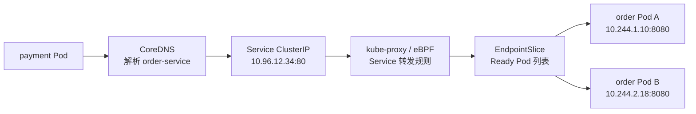

# Kubernetes - 第 5 课：Service专题：稳定访问入口、EndpointSlice与服务发现

## 学习目标（本节结束后你能做到什么）

学完这一节，你应该能把 Kubernetes 里的“服务注册与发现”讲清楚，而不是简单说一句“Service 做服务发现”。

你应该能做到：

- 解释 Kubernetes 为什么不采用传统注册中心里“服务实例主动注册”的模式。
- 说清 Pod、label、Service、selector、EndpointSlice、CoreDNS、kube-proxy/eBPF 在服务发现链路中的关系。
- 理解 Service 的本质：给一组动态变化的 Ready Pod 提供稳定访问入口。
- 区分名字发现和实例发现：`Service name -> ClusterIP` 与 `Service -> EndpointSlice -> Pod IP`。
- 理解 ClusterIP、NodePort、LoadBalancer、Headless Service 分别解决什么问题。
- 解释为什么 Service 存在不代表一定有后端，以及排查 Service 无后端、DNS 解析异常、端口映射错误的方法。
- 能用面试表达讲清 Kubernetes 和 Eureka、Nacos、Consul 这类传统注册中心的本质差异。

## 内容讲解（核心概念，用类比、例子、图示说清楚。不要太提纲化，加强每一节深度，力求深度。）

### 1. 先给结论：Kubernetes 里没有传统意义上的“服务主动注册”

很多后端工程师学 Kubernetes 时，会自然地把它和 Eureka、Nacos、Consul、ZooKeeper 这类注册中心做类比。因为在微服务体系里，“服务注册与发现”太常见了：服务启动后注册自己，调用方查询注册中心，然后拿到实例列表。

但 Kubernetes 的思路不一样。

在 Kubernetes 里，业务 Pod 通常不需要在启动时主动向某个注册中心发送“我上线了”的请求，也不需要定期续约心跳来证明自己还活着。Kubernetes 的控制面会根据对象状态自动计算服务后端。

更准确地说，Kubernetes 的服务注册与发现链路是：

```text
Pod 通过 label 暴露身份
Service 通过 selector 选择一组 Pod
EndpointSlice 记录这组 Ready Pod 的真实地址
CoreDNS 把 Service 名称解析成稳定入口
kube-proxy / eBPF 数据面把访问 Service 的流量转到后端 Pod
```

一句话版本：

```text
传统注册中心：服务实例主动注册自己。
Kubernetes Service：控制面根据 label、selector 和 readiness 自动计算后端。
```

这个差别非常关键。它意味着 Kubernetes 的服务发现不是业务 SDK 的能力，而是平台控制面的能力。

### 2. 传统注册中心怎么做

先看传统注册中心模式。以 `order-service` 为例，一个实例启动后，通常会做这些事：

```text
order-service 实例启动
  -> 读取注册中心地址
  -> 注册：服务名=order-service，IP=10.0.1.21，port=8080
  -> 定期心跳：我还活着
  -> 下线时注销：我不再接流量
```

调用方 `payment-service` 要调用订单服务时，大致是：

```text
payment-service
  -> 查询注册中心：order-service 有哪些实例？
  -> 拿到实例列表：
       10.0.1.21:8080
       10.0.1.22:8080
       10.0.1.23:8080
  -> 客户端负载均衡选择一个实例
  -> 发起 RPC / HTTP 调用
```

这种模式有几个特点：

- 服务实例主动注册。
- 服务实例通常要集成注册中心 SDK 或客户端。
- 实例要通过心跳续约维持在线状态。
- 调用方可能拿到实例列表并做客户端负载均衡。
- 注册中心保存服务名到实例列表的映射。

这套模式在 Spring Cloud、Dubbo、传统 VM 部署环境里很常见。它解决的是“实例 IP 会变，调用方如何找到实例”的问题。

但 Kubernetes 选择了另一条路：它已经掌握了 Pod 的生命周期、label、Ready 状态和 IP 信息，所以没必要让每个业务容器再主动注册一遍。

### 3. Kubernetes 为什么不需要 Pod 主动注册

在 Kubernetes 里，Pod 本来就是被控制面创建和管理的。

一个 Deployment 创建 Pod 时，Pod 对象会有 label：

```yaml
apiVersion: v1
kind: Pod
metadata:
  name: order-abc123
  labels:
    app: order
    version: v1
spec:
  containers:
    - name: order
      image: order:v1
```

这个 label 就是 Pod 的身份标签。它不是服务注册专用字段，但 Kubernetes 里大量对象关系都靠 label/selector 建立。

Service 用 selector 选择 Pod：

```yaml
apiVersion: v1
kind: Service
metadata:
  name: order-service
spec:
  selector:
    app: order
  ports:
    - name: http
      port: 80
      targetPort: 8080
```

这段 YAML 的含义不是“创建一个 order-service 进程”，而是：

```text
创建一个名为 order-service 的稳定服务入口。
它的后端是所有 labels 满足 app=order 的 Ready Pod。
调用方访问 Service 的 80 端口时，最终转发到 Pod 的 8080 端口。
```

这里没有任何业务代码主动注册。Pod 不需要知道 Service 的存在。Service 也不拥有 Pod，它只是通过 selector 选择 Pod。

这种松耦合非常重要：

```text
Deployment 负责创建带 label 的 Pod。
Service 负责选择带 label 的 Ready Pod。
EndpointSlice 负责记录真实后端地址。
DNS 和网络数据面负责让调用方能访问它们。
```

每个对象只负责自己的事情，通过 Kubernetes API 对象状态协作。

### 4. Service 的本质：给动态 Pod 提供稳定入口

Pod 是不稳定的。

这里的不稳定不是说 Pod 质量差，而是说 Pod 的生命周期天然是动态的：

- 滚动发布会创建新 Pod、删除旧 Pod。
- HPA 扩缩容会增加或减少 Pod。
- 节点故障会导致 Pod 在其他节点重建。
- 探针失败可能导致 Pod 暂时 NotReady。
- 手工删除 Pod 后，ReplicaSet 可能会补一个新 Pod。

每次重建，Pod IP 都可能变化。

如果调用方直接访问 Pod IP，就会出现问题：

```text
payment-service 写死调用 10.244.1.10:8080

order Pod 重建后：
旧 Pod 10.244.1.10 消失
新 Pod 10.244.2.27 出现

payment-service 还在访问旧 IP，请求失败
```

Service 解决的就是这个问题。它给一组动态变化的 Pod 提供一个稳定入口。

```text
payment-service
  -> order-service
       -> 当前 Ready 的 order Pod A
       -> 当前 Ready 的 order Pod B
       -> 当前 Ready 的 order Pod C
```

调用方只认识 `order-service`，不关心背后 Pod 怎么变化。

这和传统注册中心解决的问题有相似之处，但实现方式不同：

```text
传统注册中心：
调用方知道服务名，通过注册中心获取实例列表。

Kubernetes Service：
调用方访问稳定 Service 名称，实例列表由控制面和网络层维护。
```

### 5. 真正的“实例表”是 EndpointSlice

Service 自己不直接保存所有后端 Pod IP。真正记录后端地址的是 EndpointSlice。

假设当前有 3 个订单 Pod：

```text
order-pod-a  10.244.1.10:8080  Ready
order-pod-b  10.244.2.18:8080  Ready
order-pod-c  10.244.3.27:8080  NotReady
```

Service 的 selector 是：

```yaml
selector:
  app: order
```

Kubernetes 会根据 selector 找到匹配的 Pod，再根据 Pod Ready 状态维护 EndpointSlice。

大致逻辑是：

```text
Service selector: app=order
  -> 找到所有 app=order 的 Pod
  -> 判断 Pod 是否 Ready
  -> 把 Ready Pod 的 IP 和端口写入 EndpointSlice
```

所以 EndpointSlice 可以理解成 Kubernetes 内部的服务后端表。

一个简化后的 EndpointSlice 可能像这样：

```yaml
apiVersion: discovery.k8s.io/v1
kind: EndpointSlice
metadata:
  labels:
    kubernetes.io/service-name: order-service
addressType: IPv4
ports:
  - name: http
    port: 8080
endpoints:
  - addresses:
      - 10.244.1.10
    conditions:
      ready: true
  - addresses:
      - 10.244.2.18
    conditions:
      ready: true
```

注意，`order-pod-c` 虽然 Running，但如果 NotReady，通常不会作为可接流量后端。

这就是 readinessProbe 和服务发现的关系：

```text
readinessProbe 决定 Pod 是否 Ready。
Pod Ready 状态影响 EndpointSlice。
EndpointSlice 影响 Service 后端。
Service 后端影响真实流量是否会打到这个 Pod。
```

所以 readinessProbe 不是“健康检查装饰品”，它直接参与服务发现。

### 6. CoreDNS：用服务名发现稳定入口

Kubernetes 集群里通常运行 CoreDNS。它负责把 Service 名称解析成地址。

如果你创建了这个 Service：

```yaml
apiVersion: v1
kind: Service
metadata:
  name: order-service
  namespace: default
spec:
  selector:
    app: order
  ports:
    - port: 80
      targetPort: 8080
```

同一个 namespace 下的 Pod 可以直接访问：

```text
http://order-service
```

完整域名是：

```text
order-service.default.svc.cluster.local
```

这几个部分分别是：

```text
order-service：Service 名称
default：namespace
svc：表示这是 Service
cluster.local：集群 DNS 域
```

普通 ClusterIP Service 的 DNS 解析结果通常是 Service 的 ClusterIP，比如：

```text
order-service.default.svc.cluster.local
  -> 10.96.12.34
```

调用方访问的是 Service 的稳定虚拟 IP，而不是某个 Pod IP。

所以 Kubernetes 的服务发现至少有两层：

```text
名字发现：
Service name -> ClusterIP

实例发现：
Service -> EndpointSlice -> Pod IP
```

CoreDNS 解决的是第一层：让调用方通过名字找到 Service。

EndpointSlice 解决的是第二层：让 Kubernetes 网络层知道 Service 后面有哪些真实 Pod。

### 7. kube-proxy / eBPF：流量如何从 Service 到 Pod

Service 的 ClusterIP 是一个虚拟 IP。它不是某个业务进程监听的普通网卡 IP。

当 `payment-service` 访问：

```text
http://order-service:80
```

链路大概是：

```text
payment Pod
  -> CoreDNS 解析 order-service
  -> 得到 Service ClusterIP: 10.96.12.34
  -> 请求 10.96.12.34:80
  -> 节点上的 Service 数据面规则拦截/转发
  -> 选中某个 EndpointSlice 里的 Ready Pod
  -> 转发到 10.244.1.10:8080
```

传统 Kubernetes 里，这些转发规则通常由 kube-proxy 维护，底层可能使用 iptables 或 IPVS。新的网络方案，比如 Cilium，可能通过 eBPF 实现 Service 转发能力。

你不需要一开始就记住所有实现细节，但要知道：

```text
Service 对象只是 API 层抽象。
真正让流量转发发生的是节点上的网络数据面规则。
这些规则来自 Service 和 EndpointSlice 的状态。
```

完整链路可以画成：



这条链路解释了为什么 Service 排障不能只看 Service 对象本身。Service 存在，只代表稳定入口对象存在。后端是否存在，要看 EndpointSlice；DNS 是否正常，要看 CoreDNS；转发是否正常，要看 kube-proxy/eBPF/CNI。

### 8. ClusterIP、NodePort、LoadBalancer、Headless Service

Service 有多种类型，每种类型解决不同访问场景。

ClusterIP 是默认类型，提供集群内部访问入口。

```yaml
spec:
  type: ClusterIP
```

适合服务之间调用，比如 `payment-service` 调 `order-service`。这是最常用的 Service 类型。

NodePort 会在每个节点上打开一个端口，把外部访问转发到 Service。

```yaml
spec:
  type: NodePort
```

访问方式类似：

```text
NodeIP:NodePort -> Service -> Pod
```

NodePort 简单直接，但生产中直接暴露 NodePort 不算优雅。端口范围有限，节点 IP 管理麻烦，也不适合作为复杂外部入口。它常作为 LoadBalancer 或 Ingress Controller 的底层组成部分。

LoadBalancer 通常用于云环境。你创建一个 `type: LoadBalancer` 的 Service，云厂商控制器会帮你创建外部负载均衡器，并把流量导入集群。

```yaml
spec:
  type: LoadBalancer
```

链路可能是：

```text
公网 LB
  -> NodePort / 节点数据面
  -> Service
  -> Pod
```

Headless Service 比较特殊：

```yaml
spec:
  clusterIP: None
```

它不会分配 ClusterIP。DNS 查询时，可能直接返回后端 Pod IP 列表。

```text
order-service.default.svc.cluster.local
  -> 10.244.1.10
  -> 10.244.2.18
  -> 10.244.3.27
```

Headless Service 常用于 StatefulSet，因为有状态服务经常需要稳定实例身份。比如：

```text
mysql-0.mysql.default.svc.cluster.local
mysql-1.mysql.default.svc.cluster.local
mysql-2.mysql.default.svc.cluster.local
```

普通无状态后端服务，一般用 ClusterIP Service。需要外部入口时，再配 Ingress、Gateway 或 LoadBalancer。需要直接感知实例身份时，才重点考虑 Headless Service。

### 8.1 Service YAML：不要只背 type，要看访问契约

一个稍微完整的 Service 可能是：

```yaml
apiVersion: v1
kind: Service
metadata:
  name: order-service
  namespace: prod
  labels:
    app.kubernetes.io/name: order-service
spec:
  type: ClusterIP
  selector:
    app.kubernetes.io/name: order-service
    app.kubernetes.io/component: api
  ports:
    - name: http
      protocol: TCP
      port: 80
      targetPort: http
  sessionAffinity: None
```

这份 YAML 至少表达了几件事：

```text
name:
  集群内服务发现名称的一部分。

namespace:
  DNS 名称的一部分，也影响默认短名称解析范围。

type:
  Service 暴露方式，是集群内访问，还是节点端口，还是云负载均衡。

selector:
  选择哪些 Pod 作为后端。

ports:
  Service 暴露端口和 Pod 目标端口之间的映射。

sessionAffinity:
  是否启用简单会话保持。
```

Service 的重点不是“有没有一个 IP”，而是它建立了一份访问契约：

```text
调用方：
  我访问 order-service:80。

Service：
  我负责把这个请求转发到当前 Ready 的 order Pod 的目标端口。

控制面：
  我负责根据 selector 和 readiness 维护 EndpointSlice。

数据面：
  我负责根据 Service 和 EndpointSlice 执行转发。
```

所以 Service 是 API 对象、DNS 记录、EndpointSlice 和节点数据面规则共同作用后的结果。

### 8.2 没有 selector 的 Service：Service 不一定只服务 Pod

大多数 Service 都有 selector，但 Service 也可以没有 selector。

为什么需要这种能力？

有时你希望集群内应用用 Kubernetes Service 名称访问一个外部系统，或者访问一组不是由 Kubernetes 管理的后端。

例如：

```yaml
apiVersion: v1
kind: Service
metadata:
  name: legacy-user-service
spec:
  ports:
    - name: http
      port: 80
      targetPort: 8080
```

这个 Service 没有 selector。Kubernetes 不会自动根据 Pod label 生成 EndpointSlice。你需要自己创建 EndpointSlice：

```yaml
apiVersion: discovery.k8s.io/v1
kind: EndpointSlice
metadata:
  name: legacy-user-service-1
  labels:
    kubernetes.io/service-name: legacy-user-service
addressType: IPv4
ports:
  - name: http
    protocol: TCP
    port: 8080
endpoints:
  - addresses:
      - 10.10.1.21
  - addresses:
      - 10.10.1.22
```

这样，集群内调用方仍然可以访问：

```text
legacy-user-service.default.svc.cluster.local
```

但后端地址不是由 Pod selector 自动算出来的，而是你手工或外部控制器维护。

这个能力适合做迁移：

```text
老系统还在 VM 上
新系统已经上 Kubernetes
你希望 K8s 内服务用统一 Service 名称访问老系统
```

但要注意，没 selector 的 Service 少了 Kubernetes 自动发现 Pod 的便利。后端地址、健康状态、摘流逻辑都要另想办法维护。

### 8.3 ExternalName：DNS 别名，不是流量代理

ExternalName 是另一种特殊 Service。

示例：

```yaml
apiVersion: v1
kind: Service
metadata:
  name: external-payment
spec:
  type: ExternalName
  externalName: payment.example.com
```

它的作用更像 DNS CNAME：

```text
external-payment.default.svc.cluster.local
  -> payment.example.com
```

它不会创建 ClusterIP，也不会创建普通 EndpointSlice，也不会让 kube-proxy 转发流量。

所以 ExternalName 适合：

- 给外部服务提供集群内统一名称。
- 在不同环境里把同一个服务名指向不同外部域名。
- 减少业务配置里硬编码外部域名。

但它不是代理。它不做：

- 负载均衡。
- 健康检查。
- TLS 终止。
- 重试。
- 流量治理。

如果你需要真正的出口流量治理，可能要看网关、Service Mesh、egress gateway 或专门代理。

### 8.4 sessionAffinity：Kubernetes Service 的简单会话保持

默认情况下，Service 会把请求分发到后端 Pod。不同连接可能落到不同 Pod。

有些场景希望同一个客户端 IP 尽量打到同一个后端 Pod，可以设置：

```yaml
spec:
  sessionAffinity: ClientIP
```

还可以配置超时：

```yaml
spec:
  sessionAffinity: ClientIP
  sessionAffinityConfig:
    clientIP:
      timeoutSeconds: 10800
```

这是一种简单会话保持。

但要谨慎使用。现代后端服务最好尽量无状态，把会话放到 Redis、数据库、JWT 或外部存储里，而不是依赖“同一个客户端永远打同一个 Pod”。

sessionAffinity 的问题包括：

- 客户端 IP 可能被 NAT 或代理改变。
- 负载可能不均匀。
- Pod 重建后会话仍然断。
- 多层代理后客户端 IP 未必真实。

所以它可以解决部分短期兼容问题，但不应该成为无状态服务设计的主要依赖。

### 8.5 externalTrafficPolicy 和 internalTrafficPolicy：流量保留与节点选择

Service 还有一些容易被忽略的流量策略字段。

`externalTrafficPolicy` 常见于 NodePort 或 LoadBalancer：

```yaml
spec:
  type: LoadBalancer
  externalTrafficPolicy: Local
```

它有两个常见值：

```text
Cluster：
  外部流量进入任意节点后，可以转发到集群内任意后端 Pod。

Local：
  外部流量进入某个节点后，只转发到该节点本地 Pod。
```

`Local` 的一个重要价值是保留客户端源 IP。因为不跨节点转发，源地址处理更直接。但代价是：如果某个节点没有本地后端 Pod，打到这个节点的流量可能无法被正常处理，通常要配合云负载均衡健康检查。

`internalTrafficPolicy` 则影响集群内部流量：

```yaml
spec:
  internalTrafficPolicy: Local
```

它表示集群内部访问 Service 时，是否优先或只走本节点本地后端。它可以减少跨节点流量，但也可能因为本节点没有后端导致访问失败或后端选择受限。

这些字段说明 Service 不只是“名字到 IP”，它还承载一部分流量路径策略。不过更复杂的七层路由、灰度、Header 匹配、重试、超时，一般不是 Service 负责，而是 Ingress、Gateway 或 Service Mesh 的职责。

### 9. port、targetPort、containerPort 不要混

Service 排障里最常见的坑之一，是端口写错。

看这个例子：

```yaml
apiVersion: v1
kind: Service
metadata:
  name: order-service
spec:
  selector:
    app: order
  ports:
    - name: http
      port: 80
      targetPort: 8080
```

再看 Pod：

```yaml
containers:
  - name: order
    image: order:v1
    ports:
      - containerPort: 8080
```

三者含义不同：

```text
containerPort：
容器声明自己监听的端口。更多是声明和文档性质，也方便某些工具引用。

targetPort：
Service 最终转发到 Pod 的哪个端口。这个必须和应用真实监听端口对应。

port：
Service 自己暴露给调用方访问的端口。
```

调用链是：

```text
调用方访问 order-service:80
  -> Service port=80
  -> 转发到 Pod targetPort=8080
  -> 应用容器实际监听 8080
```

如果应用实际监听 8080，但 Service 写成：

```yaml
targetPort: 80
```

那么 Service、DNS、EndpointSlice 都可能存在，但请求仍然失败，因为流量被转到了 Pod 上错误的端口。

### 10. 为什么 Service 存在但没有后端

这是 Kubernetes 里非常常见的故障。

你执行：

```bash
kubectl get svc order-service
```

能看到 Service 存在。DNS 可能也能解析。但请求就是不通。

一个高频原因是 selector 和 Pod labels 不匹配。

Service 写的是：

```yaml
selector:
  app: order
```

但 Pod 实际 label 是：

```yaml
labels:
  app: orders
```

多了一个 `s`。结果：

```text
Service 存在
  -> selector 找不到 Pod
  -> EndpointSlice 为空
  -> 没有后端
  -> 请求失败
```

另一个原因是 Pod 匹配到了，但 NotReady。

```text
Pod label 匹配 app=order
但 readinessProbe 不通过
  -> Pod 不进入 Ready 后端
  -> EndpointSlice 没有可用地址
  -> Service 没有可接流量后端
```

还有可能是 namespace 搞错。调用方在 `dev` namespace，Service 在 `prod` namespace；短名称 `order-service` 解析的是当前 namespace 下的 Service，而不是另一个 namespace。

排查路线可以固定下来：

```bash
kubectl get svc order-service
kubectl describe svc order-service
kubectl get endpointslice -l kubernetes.io/service-name=order-service
kubectl get pod --show-labels
kubectl get pod -l app=order
kubectl describe pod <pod-name>
```

重点看三个问题：

```text
1. Service selector 和 Pod labels 是否匹配？
2. 匹配的 Pod 是否 Ready？
3. Service targetPort 是否对应应用真实监听端口？
```

如果这三个都没问题，再继续看 DNS、kube-proxy/eBPF、CNI、NetworkPolicy。

### 11. Kubernetes 服务发现和传统注册中心的对比

可以用一张表总结：

| 维度 | 传统注册中心 | Kubernetes Service |
| --- | --- | --- |
| 注册方式 | 实例主动注册 | 控制面根据 Pod、label、selector 自动计算 |
| 健康判断 | 心跳、续约、主动注销 | Pod readiness、对象状态、EndpointSlice |
| 实例表 | 注册中心维护 | EndpointSlice 维护 |
| 名称解析 | SDK 查询注册中心，或 DNS/配置 | CoreDNS 解析 Service 名 |
| 负载均衡 | 客户端、网关或注册中心配合 | kube-proxy/IPVS/iptables/eBPF 数据面 |
| 业务侵入 | 通常需要 SDK 或配置注册中心 | 应用通常不需要知道注册中心 |
| 适合环境 | VM、传统微服务、跨平台服务治理 | Kubernetes 集群内服务发现 |

这并不是说 Kubernetes Service 一定替代所有注册中心。

如果你的系统跨 K8s 和非 K8s 环境，或者有复杂的多集群、多机房服务治理，可能仍然会使用 Nacos、Consul、Service Mesh 或云服务发现产品。Kubernetes Service 首先解决的是“集群内部一组 Pod 的稳定访问和发现”。

### 11.1 Service 和 Ingress、Gateway、Service Mesh 的边界

Service 是四层左右的稳定访问抽象。它关心的是：

```text
一个稳定名字/虚拟 IP
  -> 一组 Ready 后端 Pod
```

它不擅长表达复杂七层路由。

比如这些需求就不是普通 Service 的强项：

- 按域名路由。
- 按路径 `/api/order`、`/api/pay` 路由。
- TLS 证书终止。
- HTTP Header 匹配。
- 金丝雀百分比流量。
- 请求重试、超时、熔断。
- 流量镜像。
- JWT 校验。

这些通常交给：

- Ingress / Ingress Controller。
- Gateway API。
- API Gateway。
- Service Mesh。

它们和 Service 的关系通常是：

```text
外部用户
  -> Ingress / Gateway / API Gateway
  -> Service
  -> EndpointSlice
  -> Pod
```

Service 仍然是后端工作负载的稳定入口。Ingress 或 Gateway 往往不会直接管理 Pod，而是路由到 Service。

所以不要把 Service 和 Ingress 对立起来。它们处在不同层：

```text
Service：
  集群内部稳定访问入口，选择 Ready Pod。

Ingress/Gateway：
  面向外部或七层流量入口，把请求路由到不同 Service。
```

后续第 6 章会单独深讲 Ingress 和 Gateway。

### 11.2 Service 排障路线：按名字、后端、端口、数据面分层

Service 问题不要一上来就怀疑网络插件。先按层排。

第一层，名字是否存在。

```bash
kubectl get svc order-service
kubectl describe svc order-service
```

确认 Service 名称、namespace、type、ports、selector。

第二层，DNS 是否解析。

可以在同 namespace 或目标 namespace 起一个临时 Pod 做解析：

```bash
kubectl run dns-test --rm -it --image=busybox:1.36 -- nslookup order-service
```

如果跨 namespace：

```text
order-service.prod.svc.cluster.local
```

第三层，后端是否存在。

```bash
kubectl get endpointslice -l kubernetes.io/service-name=order-service
kubectl get pod -l app=order -o wide
kubectl get pod -l app=order --show-labels
```

确认 selector 是否匹配，Pod 是否 Ready。

第四层，端口是否正确。

```bash
kubectl describe svc order-service
kubectl describe pod <pod>
```

看：

```text
Service port
Service targetPort
Pod containerPort
应用真实监听端口
```

第五层，从客户端 Pod 测试连通性。

```bash
wget -S -O- http://order-service:80/health
```

或用 curl 镜像：

```bash
kubectl run curl-test --rm -it --image=curlimages/curl -- sh
```

第六层，数据面和策略。

如果 Service、EndpointSlice、Pod Ready、端口都正确，但仍然不通，再看：

- kube-proxy 是否正常。
- CNI 是否正常。
- NetworkPolicy 是否阻断。
- 节点路由、防火墙、eBPF 数据面是否异常。
- Ingress/Gateway 是否转发到正确 Service。

排障顺序可以压缩成：

```text
Service 对象
  -> DNS
  -> EndpointSlice
  -> Pod labels / Ready
  -> port / targetPort
  -> 客户端连通性
  -> kube-proxy / CNI / NetworkPolicy
```

### 12. 面试表达怎么讲

如果面试问：“Kubernetes 怎么做服务注册与发现？”

可以这样回答：

```text
Kubernetes 里服务实例通常不是主动注册到注册中心。
它通过 Service、label selector、EndpointSlice、CoreDNS 和集群网络数据面完成服务发现。

Deployment 创建 Pod，Pod 带有 labels。
Service 通过 selector 选择一组 Pod。
EndpointSlice Controller 根据 selector 和 Pod Ready 状态维护后端地址列表。
集群内调用方通过 CoreDNS 解析 Service 名称，普通 ClusterIP Service 会解析到 ClusterIP。
访问 ClusterIP 后，kube-proxy 或 eBPF 数据面根据 Service 和 EndpointSlice 规则把流量转发到某个 Ready Pod。

所以它和传统 Eureka/Nacos 最大区别是：
传统注册中心通常是实例主动注册和心跳续约；
Kubernetes 是控制面根据对象状态自动计算后端，业务应用一般不需要集成注册 SDK。

如果需要直接发现具体实例身份，比如 StatefulSet，可以使用 Headless Service，让 DNS 返回 Pod 地址或稳定 DNS 名称。
```

这个回答包含了几个关键点：

- 没有传统主动注册。
- Service selector 选 Pod。
- EndpointSlice 是后端实例表。
- CoreDNS 做名字解析。
- kube-proxy/eBPF 做流量转发。
- readinessProbe 影响是否进入后端。
- Headless Service 用于特殊实例发现。

### 13. 本章的心智模型

可以把 Kubernetes 服务发现压缩成这条链：

```text
Deployment
  -> 创建带 label 的 Pod

Service
  -> 用 selector 选择 Pod

readinessProbe
  -> 决定 Pod 是否 Ready

EndpointSlice
  -> 保存 Ready Pod 的 IP 和端口

CoreDNS
  -> 把 Service 名称解析成 ClusterIP 或 Pod IP

kube-proxy / eBPF
  -> 根据 Service 和 EndpointSlice 把流量转发到 Pod
```

如果请求失败，就沿这条链倒着查：

```text
请求失败
  -> DNS 能解析吗？
  -> Service 存在吗？
  -> EndpointSlice 有后端吗？
  -> Pod labels 匹配吗？
  -> Pod Ready 吗？
  -> targetPort 对吗？
  -> 网络策略/CNI/数据面正常吗？
```

这就是从 Kubernetes 角度理解服务注册与发现的核心。

## 小结（3-5 条关键点）

- Kubernetes 的服务注册不是业务实例主动注册，而是控制面根据 Pod label、Service selector 和 Pod Ready 状态自动维护后端。
- Service 提供稳定访问入口，EndpointSlice 保存真实 Ready Pod 地址，CoreDNS 负责 Service 名称解析。
- 普通 ClusterIP Service 的发现链路是 `Service name -> ClusterIP -> EndpointSlice -> Ready Pod`。
- readinessProbe 会影响 Pod 是否进入 Service 后端，所以它直接参与服务发现和流量摘挂。
- Service 存在不代表有后端，常见问题是 selector/labels 不匹配、Pod NotReady、targetPort 写错或 namespace 搞错；无 selector Service、ExternalName、Headless Service 是特殊但重要的扩展形态。

## 问题（检测你对当前章节内容是否了解）

1. Kubernetes 的服务发现和 Eureka/Nacos 这类传统注册中心最大的区别是什么？
2. Service、EndpointSlice、CoreDNS、kube-proxy/eBPF 分别在服务发现和流量转发中负责什么？
3. 为什么 Pod Running 但 NotReady 时，通常不会接到 Service 流量？
4. Service 的 `port`、`targetPort`、`containerPort` 分别是什么意思？如果 `targetPort` 写错会出现什么现象？
5. Service 存在但 EndpointSlice 为空，你会从哪些方向排查？
6. Headless Service 和普通 ClusterIP Service 有什么区别？为什么 StatefulSet 经常配 Headless Service？
7. 没有 selector 的 Service 适合什么场景？它的 EndpointSlice 谁来维护？
8. ExternalName Service 和普通 ClusterIP Service 有什么本质区别？
9. Service 和 Ingress/Gateway 的边界是什么？
