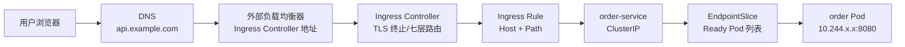

# Kubernetes - 第 6 课：Ingress与Gateway专题：七层入口、TLS与网关边界

## 学习目标（本节结束后你能做到什么）

学完这一节，你应该能把 Kubernetes 的“外部入口”讲清楚，而不是只会说“Ingress 暴露服务”。

你应该能做到：

- 解释为什么有了 Service 之后，还需要 Ingress 或 Gateway。
- 区分 Service、Ingress、Ingress Controller、Gateway API、API Gateway、Service Mesh Gateway 的边界。
- 理解 Ingress 资源只是规则，真正执行规则的是 Ingress Controller。
- 掌握 Ingress 的 host/path 路由、`pathType`、`ingressClassName`、defaultBackend、TLS Secret。
- 说清一次外部 HTTP/HTTPS 请求从浏览器进入 Kubernetes 后，如何经过负载均衡器、Ingress Controller、Service、EndpointSlice、Pod。
- 理解 Ingress 的限制：主要面向 HTTP/HTTPS，复杂能力依赖 Controller annotation，不同实现差异大。
- 理解 Gateway API 为什么出现，以及 `GatewayClass`、`Gateway`、`HTTPRoute` 的职责分离。
- 能排查常见入口问题：域名解析错误、Ingress 没地址、404、502/503、TLS 证书不匹配、Service 无后端、路径匹配不符合预期。
- 能从面试角度讲清：Ingress 是 Kubernetes 早期七层入口标准，Gateway API 是更表达现代网关能力的新模型。

## 内容讲解（核心概念，用类比、例子、图示说清楚。不要太提纲化，加强每一节深度，力求深度。）

### 1. 先把入口链路摆出来：外部用户怎么访问集群内服务

第 5 章讲 Service 时，我们重点讲的是集群内服务发现：

```text
payment Pod
  -> order-service
  -> EndpointSlice
  -> order Pod
```

这解决了“集群内部服务之间怎么互相访问”。

但真实线上系统还需要回答另一个问题：

```text
用户浏览器 / 移动 App / 第三方系统
怎么从集群外部访问 Kubernetes 内部服务？
```

如果你只有一个服务，最简单方式可能是：

```text
公网 LoadBalancer
  -> Service
  -> Pod
```

但系统变复杂后，你会有很多 HTTP 服务：

```text
api.example.com/order
api.example.com/pay
api.example.com/inventory
admin.example.com
static.example.com
```

如果每个 Service 都创建一个公网 LoadBalancer，会有几个问题：

- 成本高，每个 LoadBalancer 都可能收费。
- 域名和证书管理分散。
- 路由规则分散，难以统一治理。
- 很多服务只是一个 API 的不同路径，不需要独立入口。
- TLS、重定向、超时、限流、访问日志等七层能力需要统一配置。

所以需要一个统一入口层。

在 Kubernetes 里，传统方案是 Ingress：

```text
外部用户
  -> DNS
  -> 云负载均衡器 / 边缘入口
  -> Ingress Controller
  -> Service
  -> EndpointSlice
  -> Pod
```

Ingress 解决的是 HTTP/HTTPS 七层入口路由。它根据域名、路径、TLS 等规则，把请求转发到不同 Service。

先记住一句话：

```text
Service 解决集群内稳定访问。
Ingress 解决集群外 HTTP/HTTPS 请求如何按域名和路径进入不同 Service。
```

### 2. Service 已经能暴露服务，为什么还需要 Ingress

Service 有几种类型：

- ClusterIP：集群内部访问。
- NodePort：通过每个节点端口暴露。
- LoadBalancer：通过云厂商负载均衡器暴露。

那为什么还需要 Ingress？

因为 Service 更偏四层入口。它可以把某个端口的流量转发到一组 Pod，但它不擅长表达这些规则：

```text
api.example.com/order      -> order-service
api.example.com/pay        -> payment-service
api.example.com/inventory  -> inventory-service
admin.example.com/         -> admin-service
```

这些是 HTTP 层的概念：

- Host。
- Path。
- TLS。
- HTTP header。
- 重定向。
- URL rewrite。
- 请求体大小。
- 超时。

普通 Service 不理解这些七层语义。

如果不用 Ingress，你可能要给每个 Service 一个 LoadBalancer：

```text
order-service       -> LB1
payment-service     -> LB2
inventory-service   -> LB3
admin-service       -> LB4
```

这样不仅成本高，也不符合统一入口治理。

Ingress 提供的是：

```text
一个或少数几个外部入口
  -> 根据 HTTP 规则转发到多个 Service
```

可以类比 Nginx：

```nginx
server {
  server_name api.example.com;

  location /order {
    proxy_pass http://order-service;
  }

  location /pay {
    proxy_pass http://payment-service;
  }
}
```

Ingress 就是把类似 Nginx 七层路由规则标准化成 Kubernetes API 对象。

### 3. Ingress 资源和 Ingress Controller 不是一回事

这是 Ingress 最容易混淆的点。

Ingress 资源只是规则。它本身不转发流量。

Ingress Controller 才是真正执行规则的组件。

```text
Ingress：
  一份 Kubernetes API 对象，声明 host/path/TLS/backend 规则。

Ingress Controller：
  一个运行中的控制器和代理实现，watch Ingress/Service/EndpointSlice，
  把规则转成 Nginx、Envoy、HAProxy、云 LB 等真实配置。
```

如果你只创建 Ingress 资源，但集群里没有安装 Ingress Controller，请求不会 magically 进来。

这个关系和 Deployment/Pod 有点像：

```text
Deployment YAML 本身不运行容器。
Deployment Controller 和 kubelet 才让 Pod 跑起来。

Ingress YAML 本身不转发流量。
Ingress Controller 才把规则变成真实代理行为。
```

常见 Ingress Controller 包括：

- ingress-nginx。
- NGINX Ingress Controller。
- HAProxy Ingress。
- Traefik。
- Envoy/Contour。
- 云厂商 ALB/GCLB 等 Ingress Controller。

不同 Controller 对标准 Ingress 字段的支持相对一致，但对高级能力通常依赖 annotation，差异很大。

所以看到一个 Ingress YAML，你必须问：

```text
这个 Ingress 由哪个 Ingress Controller 实现？
它的 ingressClassName 是什么？
对应 Controller 是否已经安装并正常运行？
```

### 4. IngressClass 和 ingressClassName：谁来实现这条规则

一个集群里可能有多个 Ingress Controller。

例如：

- 一个外部 Nginx Ingress Controller，处理公网流量。
- 一个内部 Nginx Ingress Controller，处理内网流量。
- 一个云厂商 ALB Controller，处理特定业务。

那某个 Ingress 应该由谁处理？

靠 IngressClass。

IngressClass 示例：

```yaml
apiVersion: networking.k8s.io/v1
kind: IngressClass
metadata:
  name: nginx
spec:
  controller: k8s.io/ingress-nginx
```

Ingress 使用：

```yaml
apiVersion: networking.k8s.io/v1
kind: Ingress
metadata:
  name: order-ingress
spec:
  ingressClassName: nginx
  rules:
    - host: api.example.com
      http:
        paths:
          - path: /order
            pathType: Prefix
            backend:
              service:
                name: order-service
                port:
                  number: 80
```

`ingressClassName: nginx` 表示这条 Ingress 期望由名为 `nginx` 的 IngressClass 对应的 Controller 实现。

早期常用 annotation：

```yaml
metadata:
  annotations:
    kubernetes.io/ingress.class: nginx
```

现在更推荐使用 `spec.ingressClassName`。不同 Controller 可能仍兼容旧 annotation，但新文档和新配置应优先用字段。

如果 Ingress 没写 `ingressClassName`，它是否会被处理取决于集群是否配置了默认 IngressClass，以及 Controller 行为。生产中建议明确写出来，避免多 Controller 集群里规则被错误接管。

### 5. 一个最小 Ingress YAML

假设你有一个 Service：

```yaml
apiVersion: v1
kind: Service
metadata:
  name: order-service
spec:
  selector:
    app: order
  ports:
    - name: http
      port: 80
      targetPort: 8080
```

你希望外部用户访问：

```text
https://api.example.com/order
```

转到 `order-service:80`。

Ingress 可以这样写：

```yaml
apiVersion: networking.k8s.io/v1
kind: Ingress
metadata:
  name: order-ingress
  namespace: prod
spec:
  ingressClassName: nginx
  rules:
    - host: api.example.com
      http:
        paths:
          - path: /order
            pathType: Prefix
            backend:
              service:
                name: order-service
                port:
                  number: 80
```

这段 YAML 表达：

```text
当请求 Host 是 api.example.com，
并且 path 匹配 /order 前缀，
把请求转发到 prod namespace 下的 order-service 的 80 端口。
```

注意，Ingress backend 指向的是 Service，不是 Pod。

Ingress 不直接选择 Pod。它把请求交给 Service，再由 Service/EndpointSlice/数据面转给 Ready Pod。

这就是入口链路：

```text
Ingress
  -> Service
  -> EndpointSlice
  -> Pod
```

### 6. host 路由：一个入口承载多个域名

Ingress 支持按 Host 路由。

例如：

```yaml
apiVersion: networking.k8s.io/v1
kind: Ingress
metadata:
  name: multi-host-ingress
spec:
  ingressClassName: nginx
  rules:
    - host: api.example.com
      http:
        paths:
          - path: /
            pathType: Prefix
            backend:
              service:
                name: api-service
                port:
                  number: 80
    - host: admin.example.com
      http:
        paths:
          - path: /
            pathType: Prefix
            backend:
              service:
                name: admin-service
                port:
                  number: 80
```

同一个 Ingress Controller 入口地址，可以根据 Host 分发到不同后端。

请求：

```text
Host: api.example.com
```

去 `api-service`。

请求：

```text
Host: admin.example.com
```

去 `admin-service`。

这里要注意两个外部条件：

第一，DNS 要把这些域名解析到 Ingress Controller 的外部地址。

第二，请求里的 Host header 要匹配 Ingress 规则。

如果你直接用 IP 访问：

```text
http://1.2.3.4/order
```

Host 可能不是 `api.example.com`，规则就不匹配，可能返回默认 404。

排查时经常用：

```bash
curl -H "Host: api.example.com" http://<ingress-address>/order
```

这样可以绕过 DNS，直接验证 Ingress host/path 规则。

### 7. path 路由和 pathType：Prefix、Exact、ImplementationSpecific

Ingress 支持按路径路由。

常见：

```yaml
paths:
  - path: /order
    pathType: Prefix
    backend:
      service:
        name: order-service
        port:
          number: 80
  - path: /pay
    pathType: Prefix
    backend:
      service:
        name: payment-service
        port:
          number: 80
```

`pathType` 很重要。Kubernetes Ingress 有三种：

```text
Exact：
  精确匹配路径。

Prefix：
  按路径段前缀匹配。

ImplementationSpecific：
  由具体 IngressClass / Controller 决定匹配语义。
```

比如：

```yaml
path: /order
pathType: Prefix
```

通常可以匹配：

```text
/order
/order/
/order/123
```

但不应该把 `/orderabc` 当成同一个路径段前缀匹配。具体细节要以 Kubernetes path matching 语义和 Controller 实现为准。

`Exact` 则更严格：

```yaml
path: /order
pathType: Exact
```

只匹配：

```text
/order
```

不匹配：

```text
/order/123
```

`ImplementationSpecific` 最容易引入迁移风险，因为行为依赖具体 Controller。生产里如果没有明确需求，建议优先用 `Prefix` 或 `Exact`。

### 8. 路径重写：Ingress 标准字段不等于 Controller 高级能力

很多人希望：

```text
外部访问 /order/api/v1/list
转发到后端时变成 /api/v1/list
```

这叫路径重写。

标准 Ingress API 对这类高级七层行为支持有限，很多实现通过 annotation 提供。

以 Nginx Ingress 常见风格举例：

```yaml
metadata:
  annotations:
    nginx.ingress.kubernetes.io/rewrite-target: /$2
spec:
  ingressClassName: nginx
  rules:
    - host: api.example.com
      http:
        paths:
          - path: /order(/|$)(.*)
            pathType: ImplementationSpecific
            backend:
              service:
                name: order-service
                port:
                  number: 80
```

这里的 rewrite、正则匹配、annotation 都明显依赖具体 Controller。换成另一个 Controller，可能不兼容。

这就是 Ingress 的一个历史问题：标准 API 比较简单，复杂功能靠各家 annotation 扩展，导致可移植性下降。

所以写 Ingress 时要区分：

```text
Kubernetes Ingress 标准能力：
  host/path/TLS/backend。

Ingress Controller 扩展能力：
  rewrite、timeout、body size、rate limit、auth、canary 等。
```

如果你大量依赖 annotation，要把它当成 Controller 绑定能力，而不是 Kubernetes 通用能力。

### 9. defaultBackend：没有规则匹配时去哪里

Ingress 可以配置 defaultBackend。

```yaml
apiVersion: networking.k8s.io/v1
kind: Ingress
metadata:
  name: default-backend-example
spec:
  ingressClassName: nginx
  defaultBackend:
    service:
      name: default-web
      port:
        number: 80
```

defaultBackend 表示：

```text
当没有任何 host/path 规则匹配时，把请求转到这个 Service。
```

如果没有 defaultBackend，不同 Ingress Controller 可能返回自己的默认 404 页面。

defaultBackend 适合：

- 返回统一错误页。
- 引导到默认站点。
- 做入口兜底。

但不要用 defaultBackend 掩盖路由配置错误。生产排障时，如果请求落到默认后端，通常要检查 Host 和 Path 是否匹配预期规则。

### 10. TLS：Ingress 如何做 HTTPS

Ingress 支持 TLS 配置。常见 YAML：

```yaml
apiVersion: networking.k8s.io/v1
kind: Ingress
metadata:
  name: order-ingress
spec:
  ingressClassName: nginx
  tls:
    - hosts:
        - api.example.com
      secretName: api-example-tls
  rules:
    - host: api.example.com
      http:
        paths:
          - path: /order
            pathType: Prefix
            backend:
              service:
                name: order-service
                port:
                  number: 80
```

`secretName` 指向一个 TLS Secret：

```yaml
apiVersion: v1
kind: Secret
metadata:
  name: api-example-tls
type: kubernetes.io/tls
data:
  tls.crt: <base64 encoded cert>
  tls.key: <base64 encoded key>
```

这个 Secret 必须和 Ingress 在同一个 namespace，除非你的 Controller 有额外扩展能力。

典型 TLS 终止链路：

```text
浏览器
  -> HTTPS
  -> Ingress Controller 终止 TLS
  -> HTTP
  -> Service
  -> Pod
```

也就是说，Ingress 常见模式是在入口处终止 TLS，到后端 Service/Pod 可能是明文 HTTP。

如果你要求入口到 Pod 全链路加密，就要看：

- Ingress Controller 是否支持后端 HTTPS。
- Service Mesh mTLS。
- 应用自身 TLS。
- Gateway API 的 backend TLS 策略能力。

TLS 排障常见问题：

- Secret 不存在。
- Secret 类型或 key 不对，必须有 `tls.crt` 和 `tls.key`。
- 证书域名不匹配。
- `tls.hosts` 和 `rules.host` 不一致。
- DNS 指向了错误入口。
- 证书过期。
- 多个 Ingress 争用同一个 host。

### 11. Ingress Controller 如何接收外部流量

Ingress Controller 本身通常也是运行在 Kubernetes 里的 Pod。

它也需要被外部访问。

常见部署方式：

```text
Ingress Controller Deployment / DaemonSet
  -> Service type LoadBalancer 或 NodePort
  -> 云负载均衡器 / 边缘入口
```

例如 ingress-nginx 常见入口：

```bash
kubectl get svc -n ingress-nginx
```

可能看到：

```text
ingress-nginx-controller   LoadBalancer   10.96.1.23   1.2.3.4   80:xxxxx/TCP,443:yyyyy/TCP
```

外部 DNS：

```text
api.example.com -> 1.2.3.4
```

链路：

```text
用户
  -> DNS 解析 api.example.com 到 1.2.3.4
  -> 云 LB
  -> ingress-nginx-controller Service
  -> Ingress Controller Pod
  -> 根据 Ingress 规则转发到业务 Service
```

所以 Ingress 其实有两层 Service：

第一层：

```text
Ingress Controller 自己的 Service
  让外部流量进入 Controller。
```

第二层：

```text
业务 Service
  让 Controller 把请求转到业务 Pod。
```

初学者经常只看业务 Ingress，忘了 Ingress Controller 自己也要有入口。

### 12. 一次 HTTPS 请求进入 Kubernetes 的完整路径

把前面内容串起来。

用户访问：

```text
https://api.example.com/order/123
```

完整路径可能是：

```text
1. 浏览器查询 DNS。
2. DNS 返回 Ingress Controller 外部 LB 地址。
3. 浏览器和 Ingress Controller 建立 TLS 连接。
4. Ingress Controller 根据 SNI/Host 找到 api.example.com 对应证书。
5. TLS 终止，得到 HTTP 请求。
6. Ingress Controller 根据 Host=api.example.com 和 Path=/order/123 匹配 Ingress 规则。
7. 规则指向 order-service:80。
8. Ingress Controller 连接 order-service。
9. Service 根据 EndpointSlice 转到某个 Ready order Pod:8080。
10. Pod 内业务容器处理请求并返回响应。
```

画成图：



这条链路是入口排障的主线。

### 13. 常见入口错误：404、502、503 分别可能意味着什么

不同 Ingress Controller 的错误码细节可能不同，但可以建立基本直觉。

404 常见表示入口规则没匹配到：

- Host 不匹配。
- Path 不匹配。
- ingressClassName 不对，规则没被 Controller 接管。
- 请求打到了另一个 Ingress Controller。
- 没配置 defaultBackend。

502 常见表示 Controller 找到了后端，但后端连接异常：

- Service targetPort 错。
- Pod 应用没监听对应端口。
- 后端连接被拒绝。
- 后端协议不匹配，比如 Controller 用 HTTP 连后端，但后端期待 HTTPS。
- 应用进程崩了。

503 常见表示没有可用后端：

- Service 没有 EndpointSlice。
- Pod 不 Ready。
- Service selector 写错。
- 发布过程中后端全部摘流。
- NetworkPolicy 或数据面导致后端不可达。

这些不是绝对规则，但很有用。

排障时不要只看浏览器错误，要沿链路看：

```text
DNS
  -> 外部 LB
  -> Ingress Controller Service
  -> Ingress 对象
  -> Ingress Controller 日志
  -> 业务 Service
  -> EndpointSlice
  -> Pod Ready
  -> 应用日志
```

### 14. Ingress 的高级能力为什么经常依赖 annotation

Ingress 标准 API 比较克制，主要表达：

- Host。
- Path。
- Backend Service。
- TLS。
- IngressClass。

但真实网关经常需要：

- rewrite。
- redirect。
- 超时。
- body size。
- CORS。
- basic auth。
- external auth。
- rate limit。
- canary。
- sticky session。
- WebSocket。
- gRPC。

这些能力在传统 Ingress 里通常由各 Controller 用 annotation 实现。

例如 Nginx Ingress 风格可能有：

```yaml
metadata:
  annotations:
    nginx.ingress.kubernetes.io/proxy-read-timeout: "60"
    nginx.ingress.kubernetes.io/proxy-body-size: "10m"
```

这些 annotation 很实用，但可移植性弱。

换一个 Controller：

- annotation 名称可能不同。
- 语义可能不同。
- 有些能力可能不支持。

这就是为什么 Kubernetes 官方文档也强调：Ingress API 已稳定但冻结，新功能进入 Gateway API。

### 15. Gateway API 为什么出现

Ingress 的问题不是不能用，而是它太简单。

它最初解决的是：

```text
HTTP/HTTPS 请求按 host/path 路由到 Service。
```

但现代入口网关需要更复杂的能力：

- 多团队共享一个入口。
- 平台团队管理网关基础设施。
- 应用团队管理自己的路由规则。
- Header 匹配。
- 权重分流。
- 流量镜像。
- gRPC 路由。
- TCP/TLS 路由。
- 跨 namespace 授权。
- 更清晰的角色边界。

如果继续用 Ingress，就会出现：

```text
标准字段不够用 -> annotation 扩展 -> 各家 Controller 不兼容 -> 迁移困难
```

Gateway API 的目标是提供更表达现代网关能力、更角色化、更可扩展的 Kubernetes 网络 API。

它不是 Kubernetes 内置 Ingress 的简单升级字段，而是一组新的 API 资源，通常以 CRD 形式安装，并由具体 Gateway Controller 实现。

### 16. Gateway API 的角色模型：谁管基础设施，谁管路由

Gateway API 最大的设计亮点之一是角色分离。

在很多公司里，职责是分开的：

```text
平台团队：
  负责网关控制器、负载均衡器、入口地址、TLS 策略、跨 namespace 权限。

业务团队：
  负责自己的域名、路径、后端 Service、灰度规则。
```

Ingress 把很多东西塞进一个对象，角色边界不够清晰。

Gateway API 拆成多个资源：

```text
GatewayClass：
  一类 Gateway 的实现，由哪个 Controller 管。

Gateway：
  一个具体入口实例，监听哪些端口、协议、域名，允许哪些 Route 绑定。

HTTPRoute：
  HTTP 路由规则，匹配 host/path/header，转发到后端 Service。
```

关系：

```text
GatewayClass
  -> Gateway
    -> HTTPRoute
      -> Service
        -> EndpointSlice
          -> Pod
```

这比 Ingress 更适合多团队协作。

### 17. GatewayClass、Gateway、HTTPRoute 示例

GatewayClass 通常由平台团队创建：

```yaml
apiVersion: gateway.networking.k8s.io/v1
kind: GatewayClass
metadata:
  name: external-gateway
spec:
  controllerName: example.com/gateway-controller
```

Gateway 描述具体入口：

```yaml
apiVersion: gateway.networking.k8s.io/v1
kind: Gateway
metadata:
  name: public-gateway
  namespace: infra
spec:
  gatewayClassName: external-gateway
  listeners:
    - name: http
      protocol: HTTP
      port: 80
      hostname: api.example.com
      allowedRoutes:
        namespaces:
          from: All
```

HTTPRoute 由业务团队创建：

```yaml
apiVersion: gateway.networking.k8s.io/v1
kind: HTTPRoute
metadata:
  name: order-route
  namespace: prod
spec:
  parentRefs:
    - name: public-gateway
      namespace: infra
  hostnames:
    - api.example.com
  rules:
    - matches:
        - path:
            type: PathPrefix
            value: /order
      backendRefs:
        - name: order-service
          port: 80
```

这表达：

```text
把进入 infra/public-gateway 的 api.example.com/order 流量，
转发到 prod namespace 下的 order-service:80。
```

注意这里出现了跨 namespace 绑定。Gateway API 对跨 namespace 有更明确的授权和绑定模型，不是随便引用。

### 18. Gateway API 比 Ingress 表达能力强在哪里

Ingress 可以表达：

```text
host + path -> Service
TLS -> Secret
```

Gateway API 可以更自然地表达：

- Header 匹配。
- Query 参数匹配。
- 权重分流。
- 多 backendRefs。
- 请求/响应 header 修改。
- gRPC 路由。
- 更清晰的跨 namespace 关系。
- 路由和网关基础设施分离。

比如权重分流：

```yaml
rules:
  - matches:
      - path:
          type: PathPrefix
          value: /order
    backendRefs:
      - name: order-v1
        port: 80
        weight: 90
      - name: order-v2
        port: 80
        weight: 10
```

这类金丝雀能力如果用传统 Ingress，往往要依赖特定 Controller annotation。Gateway API 则把它建模得更标准。

当然，Gateway API 不是“写了 YAML 就自动能用”。你仍然需要安装支持 Gateway API 的 Controller，而且不同实现的支持范围和 conformance 级别可能不同。

### 19. Ingress、Gateway API、API Gateway、Service Mesh Gateway 的区别

这些名词很容易混。

Ingress：

```text
Kubernetes 原生 networking.k8s.io/v1 API。
主要用于 HTTP/HTTPS host/path 路由到 Service。
API 稳定但功能冻结。
复杂能力依赖 Controller annotation。
```

Gateway API：

```text
Kubernetes service networking 的新一代 API 家族。
更角色化、更表达式、更适合现代流量路由。
通过 GatewayClass、Gateway、HTTPRoute 等对象建模。
```

API Gateway：

```text
更偏业务 API 入口产品或系统。
常包含认证、鉴权、限流、计费、开发者门户、API 生命周期管理。
它可以运行在 K8s 内，也可以是外部产品。
```

Service Mesh Gateway：

```text
服务网格体系里的入口/出口网关。
通常和 mesh 内 mTLS、服务身份、流量治理、VirtualService 等规则协同。
例如 Istio IngressGateway。
```

它们可能重叠，但关注点不同。

一个请求可能经过：

```text
CDN
  -> API Gateway
  -> Kubernetes Gateway / Ingress
  -> Service Mesh Gateway
  -> Service
  -> Pod
```

也可能简化成：

```text
Ingress
  -> Service
  -> Pod
```

架构设计时不要只问“哪个更高级”，而要问：

```text
我需要的是七层路由？
还是 API 管理？
还是 mesh 内服务治理？
还是统一入口和多团队路由分权？
```

### 20. 入口排障一：Ingress 没有 ADDRESS

执行：

```bash
kubectl get ingress
```

可能看到：

```text
NAME            CLASS   HOSTS             ADDRESS   PORTS
order-ingress   nginx   api.example.com             80
```

ADDRESS 为空不一定立刻说明坏了，但如果长期为空，要看：

- Ingress Controller 是否安装。
- `ingressClassName` 是否匹配。
- Controller 是否有权限 watch 这个 Ingress。
- Controller 是否能创建或绑定外部 LoadBalancer。
- 云厂商 Controller 是否正常。
- Ingress Controller 的 Service 是否有外部 IP。

命令：

```bash
kubectl get ingressclass
kubectl describe ingress order-ingress
kubectl get pods -n ingress-nginx
kubectl logs -n ingress-nginx deploy/ingress-nginx-controller
kubectl get svc -n ingress-nginx
```

如果没有 Ingress Controller，Ingress 对象只是一张没人执行的规则表。

### 21. 入口排障二：域名访问 404

404 常见是规则没匹配。

排查：

```bash
kubectl describe ingress order-ingress
```

看 Rules：

```text
Host             Path     Backends
api.example.com  /order   order-service:80
```

然后检查实际请求：

```bash
curl -v https://api.example.com/order
```

重点看：

- DNS 是否指向正确入口地址。
- Host 是否是 `api.example.com`。
- Path 是否匹配 `/order`。
- pathType 是否符合预期。
- 请求是否打到了正确 Ingress Controller。
- 多个 Ingress 是否抢同一个 host/path。

用 IP 直连验证时要加 Host：

```bash
curl -H "Host: api.example.com" http://<ingress-address>/order
```

如果这样能通，而域名不通，多半是 DNS 或外部 LB 问题。

### 22. 入口排障三：502 或 503

如果规则匹配了，但后端不通，常见 502/503。

先看 Ingress 后端：

```bash
kubectl describe ingress order-ingress
```

你可能看到 backend 信息：

```text
order-service:80 (10.244.1.10:8080,10.244.2.11:8080)
```

如果后面没有 Endpoint，说明 Service 没有可用后端。

继续看：

```bash
kubectl get svc order-service
kubectl describe svc order-service
kubectl get endpointslice -l kubernetes.io/service-name=order-service
kubectl get pod -l app=order
```

重点：

- Service selector 是否匹配 Pod labels。
- Pod 是否 Ready。
- targetPort 是否对应应用真实监听端口。
- 应用是否监听 `0.0.0.0` 而不是只监听 `127.0.0.1`。
- NetworkPolicy 是否阻断 Ingress Controller 到业务 Pod。
- Controller 到 Service 使用的协议是否正确。

如果 Service 从集群内能访问，但 Ingress 不通，要看 Ingress Controller 日志：

```bash
kubectl logs -n ingress-nginx deploy/ingress-nginx-controller
```

### 23. 入口排障四：TLS 证书错误

TLS 问题常见表现：

- 浏览器提示证书域名不匹配。
- 证书过期。
- 返回默认证书。
- HTTPS 握手失败。
- 某个 host 正常，另一个 host 异常。

排查：

```bash
kubectl describe ingress order-ingress
kubectl get secret api-example-tls
kubectl describe secret api-example-tls
```

看：

- Secret 是否在同 namespace。
- Secret type 是否是 `kubernetes.io/tls`。
- 是否包含 `tls.crt` 和 `tls.key`。
- 证书 CN/SAN 是否包含 host。
- `spec.tls.hosts` 是否和 `spec.rules.host` 一致。
- DNS 是否打到正确 Ingress Controller。

可以用 openssl：

```bash
openssl s_client -connect api.example.com:443 -servername api.example.com
```

`-servername` 很重要，它会带 SNI。没有 SNI 时，入口可能返回默认证书。

### 24. 入口排障五：路径重写和后端路径不一致

外部路径和后端路径不一致时，最容易出现“入口配置看起来对，但应用返回 404”。

例如：

```text
外部访问 /order/list
Ingress 转发到后端仍然是 /order/list
但后端应用只认识 /list
```

这时浏览器看到 404，但这个 404 可能不是 Ingress 返回的，而是后端应用返回的。

排查方式：

- 看 Ingress Controller access log。
- 看后端应用 access log。
- 直接在集群内访问 Service 的后端路径。
- 确认是否配置 rewrite。
- 确认 rewrite annotation 是否属于当前 Controller。

这类问题非常依赖 Controller 实现。迁移 Ingress Controller 时，rewrite 是高风险点。

### 25. 安全边界：Ingress 入口不是安全的全部

Ingress 可以做 TLS 终止，但这不等于系统安全完成了。

你还要考虑：

- WAF 或边缘防护。
- API 鉴权。
- JWT/OAuth2。
- 限流。
- CORS。
- 请求体大小限制。
- 内外网入口隔离。
- 后端 Service 是否只允许入口访问。
- NetworkPolicy。
- mTLS。
- 审计日志。

Ingress Controller 有些能力可以通过 annotation 支持，但不要把所有安全都堆在 Ingress 上。

一个常见分层：

```text
CDN / WAF：
  抗 DDoS、缓存、边缘安全。

API Gateway：
  API 认证、鉴权、限流、租户、计费、开发者管理。

Ingress / Gateway：
  Kubernetes 内入口路由、TLS、host/path。

Service Mesh：
  服务间 mTLS、细粒度流量治理、服务身份。

应用：
  业务鉴权、参数校验、数据权限。
```

不同团队规模和系统复杂度下，层次会合并或拆分。小系统可能一个 Ingress Controller 就够，大系统会有多层入口。

### 26. 生产建议：Ingress 使用原则

几个实用原则：

明确写 `ingressClassName`。不要依赖隐式默认，尤其是多 Controller 集群。

Service backend 要稳定。Ingress 指向 Service，不要试图绕过 Service 直接找 Pod。

少用 Controller 私有 annotation 表达核心不可替代能力。如果用了，要清楚这是绑定某个 Controller 的能力。

TLS Secret 要有证书轮换机制。生产中通常配 cert-manager 或云证书管理，不要长期手工维护。

Host/path 规则要避免重叠和歧义。多个团队共享域名时，要有准入和规范。

入口超时要和后端服务超时配套。不要入口 60 秒、应用 5 秒、客户端 2 秒全乱套。

发布时关注 Ingress Controller 日志和指标。入口 5xx、延迟、连接数、证书错误都是关键指标。

跨 namespace 路由要谨慎。Ingress backend 通常引用同 namespace Service；如果需要跨 namespace，要看 Controller 扩展或 Gateway API 的授权模型。

### 27. 本章心智模型

可以把 Ingress 压缩成：

```text
Ingress 是 HTTP/HTTPS 入口路由规则。
Ingress Controller 是执行这套规则的真实代理/负载均衡器。
Ingress 后端通常是 Service。
Service 再转发到 Ready Pod。
```

可以把 Gateway API 压缩成：

```text
Gateway API 是更现代的服务网络 API。
GatewayClass 定义实现类型。
Gateway 定义入口实例和 listener。
HTTPRoute 定义业务路由规则。
backendRefs 通常指向 Service。
```

入口排障主线：

```text
DNS
  -> 外部 LB / Ingress Controller Service
  -> IngressClass / GatewayClass
  -> Ingress / HTTPRoute 规则
  -> Service
  -> EndpointSlice
  -> Pod Ready
  -> 应用日志
```

学到这里，Kubernetes 外部入口就不再是一句“配个 Ingress”了，而是一条完整的七层流量链路。

## 小结（3-5 条关键点）

- Service 解决集群内稳定访问，Ingress 解决外部 HTTP/HTTPS 请求按 host/path 进入不同 Service。
- Ingress 资源只是规则，真正执行规则的是 Ingress Controller；没有 Controller，Ingress 不会自动转发流量。
- Ingress 常用字段包括 `ingressClassName`、rules、host、path、pathType、backend、tls、defaultBackend。
- Ingress API 稳定但功能冻结，复杂能力常依赖 Controller annotation；Gateway API 提供更角色化、更表达现代网关能力的新模型。
- 入口排障要沿 DNS、外部 LB、Ingress Controller、Ingress/Gateway 规则、Service、EndpointSlice、Pod Ready、应用日志逐层检查。

## 问题（检测你对当前章节内容是否了解）

1. 有了 Service，为什么还需要 Ingress？Service 和 Ingress 分别解决什么问题？
2. Ingress 资源和 Ingress Controller 的区别是什么？如果只创建 Ingress 但没有 Controller，会发生什么？
3. `ingressClassName` 解决什么问题？多 Ingress Controller 集群里为什么建议明确配置它？
4. Ingress 的 `Prefix`、`Exact`、`ImplementationSpecific` 三种 `pathType` 有什么区别？
5. Ingress TLS 依赖什么 Secret？TLS 终止在入口后，后端到 Pod 一定还是 HTTPS 吗？
6. 一个请求访问 Ingress 返回 404，你会从哪些方向排查？如果是 502/503 呢？
7. 为什么说 Ingress 的复杂能力经常不可移植？annotation 带来什么问题？
8. Gateway API 为什么出现？`GatewayClass`、`Gateway`、`HTTPRoute` 分别负责什么？
9. API Gateway、Ingress、Gateway API、Service Mesh Gateway 的边界分别是什么？
10. 如果线上 `api.example.com/order` 不通，请按完整入口链路列出你的排查顺序。
