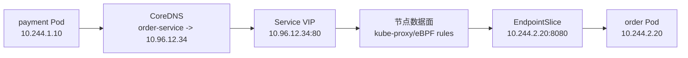

# Kubernetes - 第 7 课：Kubernetes网络底层专题：CNI、kube-proxy、iptables与eBPF

## 学习目标（本节结束后你能做到什么）

学完这一节，你应该能把 Kubernetes 网络从“Service 能访问 Pod”进一步讲到底层链路，而不是停在对象名上。

你应该能做到：

- 解释 Kubernetes 网络模型的基本要求：Pod 有独立 IP、Pod 之间默认可直接通信、同 Pod 容器共享网络命名空间。
- 理解 Pod IP、Node IP、ClusterIP、External IP 分别是什么，它们不是同一种地址。
- 说清 CNI 插件在 Pod 创建时做什么：创建网络接口、分配 Pod IP、配置路由或隧道、执行网络策略。
- 理解同节点 Pod 通信、跨节点 Pod 通信、Pod 访问 Service、外部访问 NodePort/LoadBalancer 的链路差异。
- 理解 kube-proxy 的职责：根据 Service 和 EndpointSlice 在每个节点维护 Service 虚拟 IP 转发规则。
- 区分 iptables、IPVS、nftables、eBPF 这些数据面实现思路。
- 解释为什么 Service ClusterIP 不是某个真实进程监听的 IP。
- 理解 NetworkPolicy 的模型：默认全通、被策略选中后隔离、规则是 additive、需要 CNI 支持才生效。
- 能排查常见网络问题：Pod 间不通、Service 不通、DNS 不通、NetworkPolicy 阻断、NodePort/LoadBalancer 源 IP 丢失、kube-proxy 规则异常。

## 内容讲解（核心概念，用类比、例子、图示说清楚。不要太提纲化，加强每一节深度，力求深度。）

### 1. 先建立一个事实：Kubernetes 网络不是一个组件完成的

很多人说“Kubernetes 网络”，好像它是一个单独组件。但实际上，Kubernetes 网络是多个层次一起工作的结果。

至少有这些角色：

```text
Pod network namespace：
  每个 Pod 自己的网络空间。

CNI plugin：
  负责给 Pod 配网络，让 Pod 获得 IP，并能跨节点通信。

Service：
  提供稳定虚拟访问入口。

EndpointSlice：
  保存 Service 后端 Ready Pod 地址。

kube-proxy / nftables / iptables / IPVS / eBPF：
  在节点上实现 Service VIP 到 Pod IP 的转发。

CoreDNS：
  把 Service 名称解析成 Service IP 或后端记录。

NetworkPolicy：
  声明 Pod 之间哪些流量允许，实际执行依赖 CNI。

Ingress / Gateway：
  七层外部入口，前一章已经讲过。
```

所以网络问题排障时，不要只问“是不是 K8s 网络坏了”。要先判断是哪一层：

```text
Pod 有没有 IP？
Pod 到 Pod 是否通？
Service 有没有 EndpointSlice？
Service ClusterIP 转发是否正常？
DNS 是否解析？
NetworkPolicy 是否拦截？
Ingress/Gateway 是否匹配规则？
```

这一章重点讲 Pod 网络、CNI、Service 数据面和 NetworkPolicy。

### 2. Kubernetes 网络模型的三个核心要求

Kubernetes 官方网络模型有几个关键点，可以先压缩成三句话：

```text
每个 Pod 有自己的集群内唯一 IP。
Pod 之间默认可以直接通信，不需要 NAT。
节点上的组件可以和本节点 Pod 通信。
```

再结合第 3 章 Pod，可以补一句：

```text
同一个 Pod 内的多个容器共享网络命名空间，可以通过 localhost 通信。
```

这套模型和传统 VM 部署不一样。

传统部署里，你可能是：

```text
一台机器一个 IP。
机器上多个进程用不同端口区分。
```

Kubernetes 里更像：

```text
一个 Pod 一个 IP。
Pod 内多个容器共享这个 IP。
不同 Pod 即使在同一台 Node，也通常有不同 Pod IP。
```

这让服务之间通信更自然：

```text
Pod A -> Pod B IP:port
```

不需要先知道 Pod B 在哪台 Node，也不需要调用方手动做端口映射。

当然，这个“直接通信”不是说中间没有路由、隧道、BPF 程序或网络设备。它的意思是：从 Kubernetes API 和应用视角，Pod IP 是可路由的，Pod 不需要自己做 NAT 和端口映射来暴露给其他 Pod。

### 3. 几种 IP 不要混：Pod IP、Node IP、ClusterIP、LoadBalancer IP

Kubernetes 网络里有几类 IP，很容易混。

Pod IP：

```text
分配给 Pod 网络命名空间的 IP。
例如 10.244.1.23。
Pod 重建后可能变化。
```

Node IP：

```text
节点机器的 IP。
例如 192.168.1.10。
节点上的 kubelet、容器运行时、CNI、kube-proxy 都运行在这个节点上。
```

Service ClusterIP：

```text
Service 的虚拟 IP。
例如 10.96.12.34。
它不是某个 Pod，也不是某个真实进程监听的地址。
访问它会被节点数据面规则转发到后端 Pod。
```

LoadBalancer IP：

```text
云负载均衡器或外部入口分配的地址。
它在集群外部可访问。
通常最终把流量导到 NodePort 或 Ingress Controller。
```

一条访问链路可能同时出现这些 IP：

```text
用户公网 IP
  -> LoadBalancer IP
  -> Node IP:NodePort
  -> Service ClusterIP
  -> Pod IP
```

如果把这些 IP 混在一起，排障会非常痛苦。

尤其要记住：

```text
Pod IP 是真实路由到 Pod 的地址。
ClusterIP 是 Service 虚拟地址，需要 kube-proxy/eBPF 等数据面转发。
```

### 4. CNI 是什么：Kubernetes 把“怎么联网”交给插件

CNI 是 Container Network Interface，容器网络接口。

Kubernetes 不自己实现所有网络细节，而是通过 CNI 插件给 Pod 配网络。常见 CNI 包括：

- Calico。
- Cilium。
- Flannel。
- Weave Net。
- 云厂商 VPC CNI。

当 kubelet 要创建 Pod 时，大致流程是：

```text
kubelet
  -> 调用 container runtime 创建 Pod sandbox
  -> 调用 CNI plugin
  -> CNI 给 Pod 配网络
  -> Pod 获得 IP 和网络接口
  -> 业务容器加入 Pod 网络命名空间
```

CNI 插件至少要做几类事：

- 在 Pod 网络命名空间中创建网卡。
- 给 Pod 分配 IP。
- 配置路由。
- 把 Pod 接入节点网络。
- 让跨节点 Pod 能通信。
- 清理 Pod 删除后的网络资源。

CNI 规范里定义了 ADD、DEL、CHECK 等操作。Kubernetes 不关心插件内部到底是用 veth、bridge、路由、隧道、BGP 还是 eBPF；它关心的是调用 CNI 后，Pod 网络能按 Kubernetes 模型工作。

这就是接口抽象的好处：

```text
Kubernetes 定义网络模型和调用接口。
CNI 插件实现具体网络方案。
```

但这也意味着，不同集群网络行为可能有差异。比如 NetworkPolicy 是否生效、Pod IP 是否直接来自 VPC、跨节点流量是否封装、性能和可观测性，都取决于 CNI 实现。

### 5. 同节点 Pod 通信：一般不会出节点

假设两个 Pod 在同一个 Node：

```text
node-a
├── pod-a: 10.244.1.10
└── pod-b: 10.244.1.11
```

`pod-a` 访问 `pod-b:8080`，流量通常在本节点内完成。

一种常见形态是：

```text
pod-a eth0
  -> veth pair
  -> node network bridge / datapath
  -> veth pair
  -> pod-b eth0
```

不同 CNI 实现细节会不同。有的使用 Linux bridge，有的使用路由，有的使用 eBPF 程序。但从逻辑上看，流量不需要经过外部网络。

同节点 Pod 通信问题常见原因：

- Pod 没有 IP。
- 应用没监听正确地址或端口。
- NetworkPolicy 阻断。
- CNI 本节点 datapath 异常。
- 容器内防火墙或应用绑定 `127.0.0.1`。

一个很常见的坑：

```text
应用只监听 127.0.0.1:8080。
同 Pod 容器可以访问它。
其他 Pod 访问 PodIP:8080 会失败。
```

如果希望其他 Pod 访问，应用应该监听：

```text
0.0.0.0:8080
```

或 Pod IP 对应的地址。

### 6. 跨节点 Pod 通信：关键是 Pod CIDR 如何路由

跨节点通信更复杂。

假设：

```text
node-a
└── pod-a: 10.244.1.10

node-b
└── pod-b: 10.244.2.20
```

`pod-a` 访问 `pod-b:8080`，节点网络需要知道：

```text
10.244.2.20 这个 Pod IP 在 node-b 上。
```

不同 CNI 有不同实现方式：

一种是路由模式。每个节点知道不同 Pod CIDR 应该走哪个 Node。包从 node-a 发到 node-b，node-b 再交给 pod-b。

一种是隧道模式。跨节点 Pod 流量被封装，比如 VXLAN、Geneve、IP-in-IP。外层包走 Node IP，内层包保留 Pod IP。

一种是云 VPC 原生模式。Pod IP 直接来自云 VPC 网段，云网络本身能路由到 Pod。

一种是 eBPF 数据面。CNI 在内核关键路径挂 eBPF 程序，完成转发、负载均衡、策略等。

可以抽象成：

```text
Pod IP 到 Node 的可达性
  是 CNI 必须解决的问题。
```

所以跨节点 Pod 不通，常见方向：

- CNI 插件异常。
- 节点路由表异常。
- 封装网络端口被防火墙拦截。
- 云安全组不允许节点间通信。
- MTU 问题导致大包丢失。
- NetworkPolicy 阻断。
- 节点 NotReady 或 kubelet/CNI 状态异常。

MTU 是一个隐蔽但真实的问题。隧道封装会增加额外头部，如果底层网络 MTU 不够，大包可能被丢弃或分片异常，表现为“小请求能通，大请求卡住”。

### 7. Service ClusterIP 为什么是虚拟 IP

第 5 章讲过 Service：

```text
Service name -> ClusterIP -> EndpointSlice -> Pod IP
```

这里要讲底层：ClusterIP 不是某台机器上一个真实进程监听的 IP。

比如：

```text
order-service ClusterIP = 10.96.12.34
```

你在节点上不一定能看到一个真实网卡绑定了 `10.96.12.34`。它是一个虚拟服务地址。节点上的数据面规则会拦截访问这个 IP:port 的流量，然后转发到后端 Pod。

官方文档也强调，Service 的虚拟 IP 机制会通过代理规则把目的地址重写到后端 endpoint，而不是把这个 IP 当作普通 Pod IP 路由。

所以访问 Service 的过程是：

```text
client Pod
  -> 访问 10.96.12.34:80
  -> 本节点网络规则匹配这个 Service VIP
  -> 选择一个 EndpointSlice 后端
  -> DNAT 或等价转发到 10.244.2.20:8080
```

关键点：

```text
Service 是 API 抽象。
ClusterIP 是虚拟入口。
EndpointSlice 是真实后端列表。
节点数据面规则实现转发。
```

### 8. kube-proxy 的职责：把 Service/EndpointSlice 变成节点规则

kube-proxy 运行在每个节点上。

它 watch API Server 中的 Service 和 EndpointSlice。每当这些对象变化，kube-proxy 会在本节点更新转发规则。

它的职责是：

```text
观察 Service 和 EndpointSlice
  -> 生成本节点的数据面规则
  -> 捕获访问 ClusterIP/NodePort 的流量
  -> 转发到某个后端 endpoint
```

注意，kube-proxy 不是每个请求都经过的用户态代理。在常见 Linux 模式下，它主要负责写内核规则。真正每个包的转发通常发生在内核数据面。

这点非常重要。否则你会误以为：

```text
每个 Service 请求都先进 kube-proxy 进程，再由 kube-proxy 转发。
```

这不是典型 iptables/IPVS/nftables 模式的工作方式。

更准确地说：

```text
kube-proxy 是规则控制器。
内核网络栈是实际数据面。
```

### 9. iptables 模式：规则链和 DNAT

iptables 是 kube-proxy 的经典模式。

它利用 Linux netfilter/iptables 规则，把访问 Service VIP 的流量 DNAT 到后端 Pod。

例如：

```text
访问 order-service ClusterIP:80
  -> 命中 KUBE-SERVICES 链
  -> 跳到 order-service 对应链
  -> 按概率选择某个 endpoint 链
  -> DNAT 到 PodIP:targetPort
```

简化：

```text
10.96.12.34:80
  -> 10.244.1.10:8080
```

iptables 模式的优点是成熟、通用。

缺点是：

- 大规模 Service/Endpoint 时规则很多。
- 规则更新可能变慢。
- 排查规则链比较痛苦。

不过不要简单认为 iptables 一定很差。它非常成熟，很多集群仍然运行良好。性能问题通常在服务和 endpoint 规模很大时更明显。

排查时可以看：

```bash
iptables-save | grep KUBE-SVC
iptables-save | grep <service-cluster-ip>
```

但生产节点上直接操作 iptables 要非常谨慎。查看可以，手工改规则很容易破坏 kube-proxy 管理的状态。

### 10. IPVS 模式：曾经为规模和性能引入，但现在要看版本状态

IPVS 是 Linux 内核里的四层负载均衡能力。

kube-proxy 的 IPVS 模式会用 IPVS 维护 Service 到 endpoint 的负载均衡规则，同时仍可能配合 iptables 做部分处理。

IPVS 的优点是：

- 为负载均衡场景设计。
- 使用哈希表等结构，曾经在大规模规则下比 iptables 更有优势。
- 支持多种调度算法，比如 rr、wrr、lc 等。

但它也有边界。当前 Kubernetes 官方文档已经把 IPVS proxy mode 标记为 deprecated，并推荐关注 nftables 等新模式。原因之一是 IPVS 内核 API 和 Kubernetes Service API 的一些边缘语义并不完全匹配。

所以学习 IPVS 时要把它放在历史位置：

```text
IPVS 曾是 kube-proxy 扩展性能的重要模式。
但新版本 Kubernetes 正在把 nftables 等模式作为更推荐方向。
```

如果你接手老集群，仍然可能看到 IPVS。排查时可以用：

```bash
ipvsadm -Ln
```

但新集群选型要看当前 Kubernetes 版本、发行版默认配置和 CNI/数据面方案。

### 11. nftables 模式：iptables 继任方向

nftables 是 Linux netfilter 的新一代接口，可以看作 iptables 的继任者。

在 Kubernetes kube-proxy 新版本里，nftables proxy mode 已成为重要方向。它的目标是比 iptables 更高效地处理大规模 Service 和 Endpoint 变化，同时保留与 Kubernetes Service 语义的匹配。

从学习角度，你不用一开始掌握 nft 命令细节，但要知道：

```text
iptables、IPVS、nftables 都是 kube-proxy 可以使用的 Service 数据面实现。
它们的共同目标是把 Service 虚拟 IP 转发到后端 endpoint。
```

以后排查具体集群时，第一步要知道 kube-proxy 当前运行模式：

```bash
kubectl -n kube-system get configmap kube-proxy -o yaml
```

或看 kube-proxy 启动参数和配置。

不要拿 iptables 的经验硬套到 eBPF 或 nftables 集群。

### 12. eBPF 数据面：不只是“更快”，而是把逻辑放进内核可编程路径

eBPF 是 Linux 内核里的可编程机制，可以在安全受限的前提下，把程序挂到网络、追踪、安全等内核路径上。

在 Kubernetes 网络里，以 Cilium 为代表的方案会用 eBPF 实现：

- Pod 网络转发。
- Service 负载均衡。
- NetworkPolicy。
- 可观测性。
- 部分 kube-proxy 替代能力。

传统 kube-proxy 模式通常是：

```text
kube-proxy watch Service/EndpointSlice
  -> 写 iptables/nftables/IPVS 规则
  -> 内核规则处理包
```

eBPF 模式可能是：

```text
CNI/agent watch Kubernetes 对象
  -> 更新 eBPF map
  -> eBPF 程序在包路径上查 map 并转发
```

它的优势包括：

- 更高性能潜力。
- 更细粒度可观测性。
- 更灵活的数据面逻辑。
- 可以减少或替代 kube-proxy。
- NetworkPolicy 和 Service LB 可以在同一数据面协同。

但 eBPF 不是魔法。它也有成本：

- 对内核版本有要求。
- 排障工具和传统 iptables 不同。
- 学习曲线更高。
- 不同 CNI 实现差异明显。

所以不要简单说“eBPF 一定比 kube-proxy 好”。更准确的表达是：

```text
eBPF 提供了更可编程、更高性能潜力的数据面实现方式，
但具体收益和复杂度取决于 CNI、内核、集群规模和团队运维能力。
```

### 13. Pod 访问 Service 的完整路径

假设：

```text
payment Pod: 10.244.1.10
order-service ClusterIP: 10.96.12.34:80
order Pod: 10.244.2.20:8080
```

payment 访问：

```text
http://order-service
```

完整路径：

```text
1. payment Pod 调用 DNS 解析 order-service。
2. CoreDNS 返回 ClusterIP 10.96.12.34。
3. payment Pod 发包到 10.96.12.34:80。
4. 包离开 Pod 网络命名空间，进入所在 Node 的网络栈。
5. 本节点 Service 数据面规则匹配 ClusterIP:80。
6. 规则选择一个 EndpointSlice 后端，比如 10.244.2.20:8080。
7. 进行 DNAT 或等价转发处理。
8. 包通过 Pod 网络到达 order Pod。
9. order Pod 响应，返回路径按连接跟踪和网络规则回到 payment Pod。
```

画成图：



这解释了为什么 Service 问题可能出在多个地方：

- DNS 没解析。
- ClusterIP 没规则。
- EndpointSlice 为空。
- Pod 网络不通。
- Pod 应用没监听。
- NetworkPolicy 拦截。

### 14. NodePort 和 LoadBalancer 的底层链路

NodePort 会在每个节点暴露一个端口，比如：

```yaml
spec:
  type: NodePort
  ports:
    - port: 80
      targetPort: 8080
      nodePort: 30080
```

访问：

```text
NodeIP:30080
```

会被节点数据面规则转到 Service 后端。

链路：

```text
外部客户端
  -> NodeIP:30080
  -> kube-proxy/eBPF NodePort 规则
  -> Service endpoint
  -> PodIP:8080
```

LoadBalancer 在云环境里通常是在 NodePort 上再加一层云负载均衡器：

```text
外部客户端
  -> Cloud LoadBalancer IP
  -> 某个 NodeIP:NodePort
  -> Service 后端 Pod
```

当然，具体云厂商和 CNI 可能有直接 Pod 转发、健康检查、源 IP 保留等优化。

这里和第 5 章的 `externalTrafficPolicy` 连接起来：

```text
externalTrafficPolicy: Cluster
  外部流量可以被转发到集群内任意 Ready endpoint。
  负载更均匀，但源 IP 可能被改写。

externalTrafficPolicy: Local
  外部流量只转发到当前节点本地 Ready endpoint。
  更容易保留源 IP，但要求 LB 只把流量打到有本地后端的节点。
```

源 IP 是否保留，是很多网关、审计、限流场景的关键问题。

### 15. DNS 和网络的关系：DNS 成功不代表服务通

CoreDNS 负责名字解析，但解析成功只说明第一步 OK。

例如：

```bash
nslookup order-service
```

返回：

```text
10.96.12.34
```

这说明 DNS 能解析 Service 名称。它不说明：

- Service 有 EndpointSlice。
- 后端 Pod Ready。
- targetPort 正确。
- kube-proxy/eBPF 规则正常。
- Pod 网络可达。
- 应用正常响应。

所以排查服务调用失败，要分开：

```text
DNS 解析问题：
  服务名、namespace、CoreDNS、搜索域、DNS policy。

连接问题：
  Service 后端、端口、数据面、NetworkPolicy、应用监听。
```

DNS 不通常看：

```bash
kubectl -n kube-system get pods -l k8s-app=kube-dns
kubectl -n kube-system logs deploy/coredns
kubectl get svc -n kube-system kube-dns
```

服务通不通则继续看 Service/EndpointSlice/Pod。

### 16. NetworkPolicy：Kubernetes 原生的 L3/L4 流量控制声明

默认情况下，如果没有 NetworkPolicy，Kubernetes 网络通常是开放的：

```text
Pod 可以和其他 Pod 通信。
Pod 可以出站访问外部地址。
```

这对易用性很好，但对安全不是最优。一个被攻破的普通 Pod，可能横向扫描其他 namespace 的数据库或内部服务。

NetworkPolicy 用来声明：

```text
哪些 Pod 可以接收哪些来源的流量。
哪些 Pod 可以发出到哪些目的地的流量。
```

它工作在 L3/L4 层，主要是 IP、端口、协议维度。不是 HTTP path、JWT、Header 这些七层能力。

一个简单的只允许 frontend 访问 db 的策略：

```yaml
apiVersion: networking.k8s.io/v1
kind: NetworkPolicy
metadata:
  name: allow-frontend-to-db
  namespace: prod
spec:
  podSelector:
    matchLabels:
      role: db
  policyTypes:
    - Ingress
  ingress:
    - from:
        - podSelector:
            matchLabels:
              role: frontend
      ports:
        - protocol: TCP
          port: 5432
```

含义：

```text
选择 prod namespace 下 role=db 的 Pod。
对它们的入站流量启用限制。
只允许同 namespace 中 role=frontend 的 Pod 访问 TCP 5432。
```

### 17. NetworkPolicy 生效的前提：CNI 必须支持

创建 NetworkPolicy 对象本身不代表策略一定生效。

官方文档明确说明，NetworkPolicy 由网络插件实现。你必须使用支持 NetworkPolicy 的网络方案。否则创建 NetworkPolicy 资源不会产生实际效果。

这点非常关键。

比如某些简单 CNI 只负责 Pod 连通，不负责策略执行。你 apply 了 NetworkPolicy，API Server 接受了，对象也存在，但流量仍然全通。

所以生产落地 NetworkPolicy 前要确认：

```text
当前 CNI 是否支持 NetworkPolicy？
ingress 和 egress 都支持吗？
是否支持 ipBlock、namespaceSelector、podSelector？
是否支持 SCTP、endPort 等特性？
是否有实现差异？
```

常见支持 NetworkPolicy 的方案包括 Calico、Cilium 等。云厂商 CNI 也可能通过附加组件或特定模式支持。

排查时不能只看：

```bash
kubectl get networkpolicy
```

还要验证实际流量。

### 18. NetworkPolicy 的隔离模型：默认不隔离，被选中后才限制

NetworkPolicy 最容易误解的地方是它不是传统“规则列表从上到下匹配”的防火墙。

它是选择 Pod，然后对这些 Pod 的 ingress 或 egress 方向引入隔离。

默认情况下：

```text
如果没有任何 NetworkPolicy 选择某个 Pod 的 ingress，
这个 Pod 入站是 non-isolated，所有入站允许。

如果没有任何 NetworkPolicy 选择某个 Pod 的 egress，
这个 Pod 出站是 non-isolated，所有出站允许。
```

当有策略选择某个 Pod 并声明 Ingress：

```text
这个 Pod 的入站变成 isolated。
只有策略允许的入站连接可以进入。
```

当有策略选择某个 Pod 并声明 Egress：

```text
这个 Pod 的出站变成 isolated。
只有策略允许的出站连接可以发出。
```

多条 NetworkPolicy 是 additive 的，也就是允许规则取并集。

```text
没有“deny 规则优先级”。
只有“被策略隔离后，哪些流量被允许”。
```

这和很多防火墙规则模型不同。

### 19. default deny：NetworkPolicy 的常见起点

如果你想让 namespace 默认拒绝所有入站，可以创建：

```yaml
apiVersion: networking.k8s.io/v1
kind: NetworkPolicy
metadata:
  name: default-deny-ingress
  namespace: prod
spec:
  podSelector: {}
  policyTypes:
    - Ingress
```

`podSelector: {}` 表示选择 namespace 下所有 Pod。

没有 `ingress` 允许规则，表示不允许任何入站，除了某些实现和 Kubernetes 语义中必须允许的节点相关流量等边界情况。

默认拒绝所有出站：

```yaml
apiVersion: networking.k8s.io/v1
kind: NetworkPolicy
metadata:
  name: default-deny-egress
  namespace: prod
spec:
  podSelector: {}
  policyTypes:
    - Egress
```

同时拒绝入站和出站：

```yaml
apiVersion: networking.k8s.io/v1
kind: NetworkPolicy
metadata:
  name: default-deny-all
  namespace: prod
spec:
  podSelector: {}
  policyTypes:
    - Ingress
    - Egress
```

然后再逐步加 allow 策略。

但生产中不要直接全 namespace 默认拒绝再说。很容易把 DNS、监控、日志、健康检查、Ingress Controller 到后端流量全部切断。

建议：

```text
先观测流量。
再在非生产环境验证。
再从低风险 namespace 开始。
先做 ingress，再谨慎做 egress。
保留 DNS、监控、网关必要通路。
```

### 20. namespaceSelector 和 podSelector 的 AND / OR 陷阱

NetworkPolicy 里 selector 组合非常容易写错。

例如：

```yaml
ingress:
  - from:
      - namespaceSelector:
          matchLabels:
            team: frontend
      - podSelector:
          matchLabels:
            role: client
```

这表示 OR：

```text
允许来自 team=frontend 的 namespace 里的所有 Pod
或者
允许来自当前 namespace 中 role=client 的 Pod
```

如果你想表达：

```text
允许来自 team=frontend 的 namespace 中 role=client 的 Pod
```

要写在同一个 from 元素里：

```yaml
ingress:
  - from:
      - namespaceSelector:
          matchLabels:
            team: frontend
        podSelector:
          matchLabels:
            role: client
```

这表示 AND。

这个缩进差异很小，但语义差很多。生产 NetworkPolicy 一定要 review。

### 21. egress 策略和 DNS 陷阱

如果你做 egress default deny，很容易把 DNS 也禁掉。

Pod 要访问：

```text
order-service
```

首先要查询 CoreDNS。

如果 egress 策略没有允许到 kube-system/CoreDNS 的 UDP/TCP 53，应用会表现为：

```text
服务名无法解析
偶发超时
连接前就失败
```

一个允许 DNS 的策略可能类似：

```yaml
apiVersion: networking.k8s.io/v1
kind: NetworkPolicy
metadata:
  name: allow-dns
  namespace: prod
spec:
  podSelector: {}
  policyTypes:
    - Egress
  egress:
    - to:
        - namespaceSelector:
            matchLabels:
              kubernetes.io/metadata.name: kube-system
      ports:
        - protocol: UDP
          port: 53
        - protocol: TCP
          port: 53
```

实际集群里 CoreDNS 的 labels、namespace labels、CNI 对 namespace label 的支持都要确认。不要直接复制。

### 22. NetworkPolicy 和 Service 的关系

NetworkPolicy 选择的是 Pod，不是 Service。

这句话很重要。

你写策略时，允许的是：

```text
哪些来源 Pod/namespace/IPBlock 可以访问目标 Pod 的哪些端口。
```

不是：

```text
允许访问某个 Service。
```

当客户端访问 Service ClusterIP 时，数据面最终会转发到后端 Pod。NetworkPolicy 在源 Pod、目标 Pod、IPBlock 等维度决定是否允许。

因此：

```text
Service 存在且 EndpointSlice 正常
不代表 NetworkPolicy 一定允许流量。
```

这也是 Service 排障的后半段：

```text
Service -> EndpointSlice -> Pod 都正常
但连接超时
  -> 看 NetworkPolicy / CNI 数据面
```

### 23. 常见网络排障一：Pod 到 Pod 不通

排查步骤：

第一，确认目标 Pod IP 和端口：

```bash
kubectl get pod -o wide
kubectl describe pod <target-pod>
```

第二，从源 Pod 里测试：

```bash
kubectl exec -it <source-pod> -- sh
nc -vz <target-pod-ip> 8080
```

第三，确认应用监听地址：

```bash
kubectl exec <target-pod> -- netstat -lntp
```

或用镜像里可用工具。

重点看应用是否监听 `0.0.0.0:8080`，而不是只监听 `127.0.0.1:8080`。

第四，看 NetworkPolicy：

```bash
kubectl get networkpolicy
kubectl describe networkpolicy <name>
```

第五，看 CNI 和节点状态：

```bash
kubectl get node
kubectl -n kube-system get pods
```

如果同节点通、跨节点不通，重点看 CNI 跨节点路由、隧道、云安全组、MTU。

### 24. 常见网络排障二：Pod 到 Service 不通

先确认 DNS：

```bash
nslookup order-service
```

如果 DNS 不通，看 CoreDNS。

DNS 通后，确认 Service：

```bash
kubectl get svc order-service
kubectl describe svc order-service
```

确认 EndpointSlice：

```bash
kubectl get endpointslice -l kubernetes.io/service-name=order-service
```

确认 Pod：

```bash
kubectl get pod -l app=order -o wide
```

如果 EndpointSlice 有后端，但 Service 仍不通：

- targetPort 是否正确。
- kube-proxy/eBPF 是否正常。
- NetworkPolicy 是否阻断。
- CNI 是否正常。
- 源 Pod 和目标 Pod 是否跨节点，跨节点网络是否通。

在 kube-proxy 模式下，可以看：

```bash
kubectl -n kube-system get pods -l k8s-app=kube-proxy
kubectl -n kube-system logs <kube-proxy-pod>
```

不同发行版 label 可能不同。

### 25. 常见网络排障三：NodePort/LoadBalancer 源 IP 不对

很多业务需要客户端真实 IP，比如：

- 风控。
- 审计。
- 限流。
- 地域判断。
- 访问日志。

但通过 NodePort/LoadBalancer 进来后，源 IP 可能被 NAT 成节点 IP 或负载均衡器 IP。

这时要看：

```yaml
externalTrafficPolicy: Local
```

它可以帮助保留源 IP，但有代价：

- 只转发到本节点本地 endpoint。
- 没有本地 endpoint 的节点不能接这个 Service 流量。
- 云 LB 健康检查必须能识别哪些节点有可用后端。
- 负载均衡可能不如 Cluster 均匀。

如果使用 Ingress Controller，还要看：

- Ingress Controller 是否保留或传递 `X-Forwarded-For`。
- 上游 LB 是否传递 Proxy Protocol。
- 应用是否信任正确代理层。

源 IP 问题通常不是单个 Kubernetes 字段就能完全解决，而是 LB、Service、Ingress、应用日志共同配置。

### 26. 常见网络排障四：NetworkPolicy 写了但没效果

如果 NetworkPolicy 写了但流量还是通：

第一，确认 CNI 支持 NetworkPolicy。

第二，确认 policy 在正确 namespace。

第三，确认 `podSelector` 是否选中了目标 Pod。

第四，确认 `policyTypes` 是否包含你想限制的方向。

第五，确认是否还有其他 NetworkPolicy 允许了这条流量。规则是 additive，并集允许。

第六，确认你测试的是 TCP/UDP/SCTP 层流量。ICMP 等协议在不同实现里行为可能不同。

第七，确认 source/destination 是 Pod 流量，而不是节点或 hostNetwork 特殊路径。

常用：

```bash
kubectl describe networkpolicy <name>
kubectl get pod --show-labels
kubectl get ns --show-labels
```

不要只看 YAML，要看实际 selector 匹配结果。

### 27. 常见网络排障五：小包通，大包不通

这个问题经常和 MTU 有关。

现象：

- `curl /health` 能通。
- 大响应、文件上传、某些 gRPC 请求卡住。
- 跨节点更明显，同节点不明显。

可能原因：

- CNI 使用隧道封装，额外头部占用 MTU。
- 底层网络禁止分片或 ICMP Fragmentation Needed 被丢。
- Pod 网卡 MTU 配置过大。

排查方向：

- 比较同节点和跨节点。
- ping 指定包大小测试，如果工具可用。
- 查看 CNI 配置里的 MTU。
- 查看云网络 MTU 和封装模式。

MTU 问题很隐蔽，容易被误判成应用超时。

### 28. 生产建议：如何设计 Kubernetes 网络边界

几个建议：

第一，不要让业务直接依赖 Pod IP。Pod IP 是临时实例地址，服务访问应该走 Service。

第二，Service selector 要稳定。不要把版本标签作为 Service 的唯一 selector，否则滚动发布时容易只选到某个版本。

第三，NetworkPolicy 从默认观测开始，不要一上来全拒绝。先识别流量，再逐步收紧。

第四，DNS、监控、日志、Ingress Controller 到后端这些基础通路要纳入策略设计。

第五，理解你的 CNI。至少要知道它是路由、隧道、云 VPC 原生还是 eBPF 数据面，是否支持 NetworkPolicy。

第六，保留一套网络排障工具镜像。生产镜像往往很精简，没有 curl、dig、nc、ip、ss 等工具。

第七，关注节点级网络指标。丢包、重传、conntrack 满、DNS 延迟、CNI agent 异常，都会表现成业务超时。

第八，大规模集群要关注 Service/EndpointSlice 规模和数据面更新延迟。服务发现对象变化太频繁，会影响 kube-proxy 或 CNI agent 同步。

### 29. 本章心智模型

可以把 Kubernetes 网络分成四层：

```text
第一层：Pod 网络
  CNI 让 Pod 获得 IP，并实现 Pod 到 Pod 通信。

第二层：Service 网络
  Service 提供虚拟 IP，EndpointSlice 提供后端，kube-proxy/eBPF 实现转发。

第三层：DNS 和入口
  CoreDNS 解析 Service 名，Ingress/Gateway 处理外部七层入口。

第四层：策略和安全
  NetworkPolicy 声明哪些 Pod 间流量允许，CNI 负责执行。
```

一次集群内调用：

```text
service name
  -> CoreDNS
  -> ClusterIP
  -> node datapath
  -> EndpointSlice backend
  -> Pod IP
```

一次 Pod 到 Pod 直接调用：

```text
source Pod IP
  -> CNI datapath
  -> target Pod IP
```

一次外部调用：

```text
external LB / Ingress
  -> Service / NodePort
  -> EndpointSlice
  -> Pod IP
```

网络排障时，不要跳层。先判断是哪条链路，再逐层验证。

## 小结（3-5 条关键点）

- Kubernetes 网络不是单个组件完成的，而是 Pod network namespace、CNI、Service、EndpointSlice、kube-proxy/eBPF、CoreDNS、NetworkPolicy 协同的结果。
- CNI 负责给 Pod 配网络并实现 Pod 间通信；不同 CNI 在路由、隧道、VPC 原生、eBPF、NetworkPolicy 支持上差异很大。
- Service ClusterIP 是虚拟 IP，不是某个真实进程监听的地址；节点数据面根据 Service 和 EndpointSlice 把它转发到后端 Pod。
- kube-proxy 是 Service 规则控制器，常见数据面包括 iptables、nftables、IPVS；eBPF 方案可能替代或增强 kube-proxy 能力。
- NetworkPolicy 默认不隔离，只有被策略选中的方向才开始限制；策略是否生效取决于 CNI 支持，规则是 additive。

## 问题（检测你对当前章节内容是否了解）

1. Kubernetes 网络模型对 Pod 通信有哪些基本要求？
2. Pod IP、Node IP、Service ClusterIP、LoadBalancer IP 分别是什么？为什么 ClusterIP 是虚拟 IP？
3. CNI 插件在 Pod 创建时大致做哪些事情？
4. 同节点 Pod 通信和跨节点 Pod 通信有什么差异？跨节点不通时你会看哪些方向？
5. kube-proxy 的职责是什么？为什么说它通常不是每个请求都经过的用户态代理？
6. iptables、IPVS、nftables、eBPF 这些 Service 数据面实现有什么区别？
7. Pod 访问 Service 的完整链路是什么？
8. NetworkPolicy 的默认行为是什么？为什么创建了 NetworkPolicy 但不一定生效？
9. `namespaceSelector` 和 `podSelector` 在 NetworkPolicy 里如何表达 AND 和 OR？
10. 如果 Service DNS 能解析但请求超时，你会按什么顺序排查？
