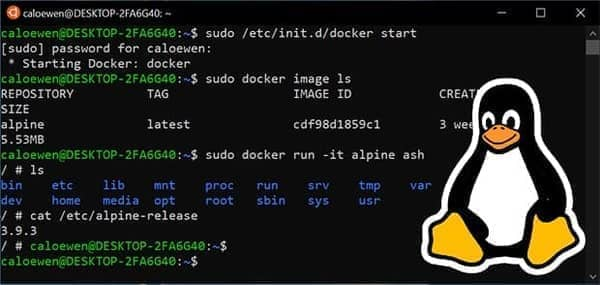
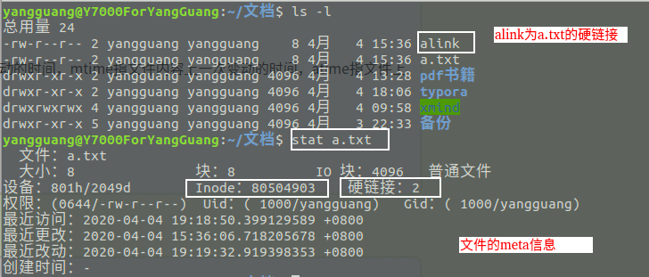
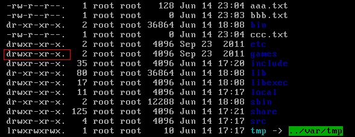
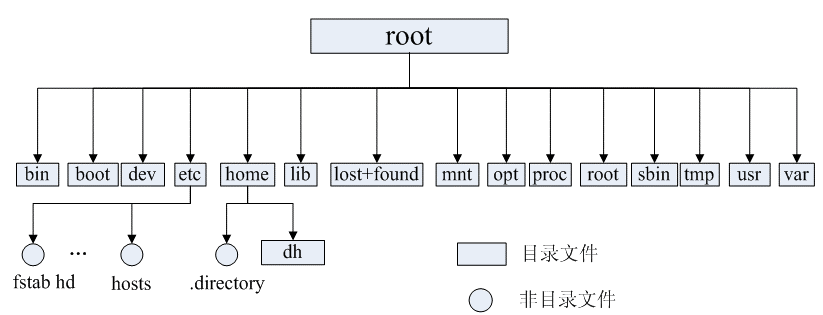
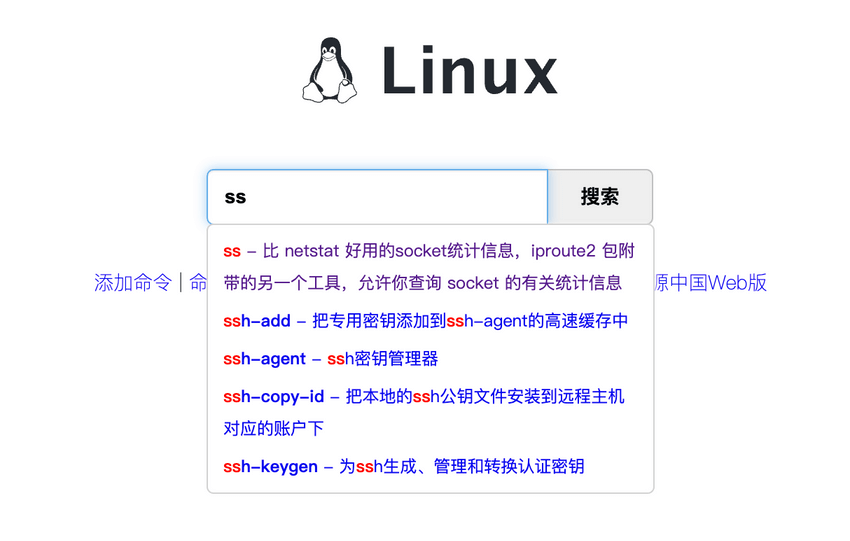
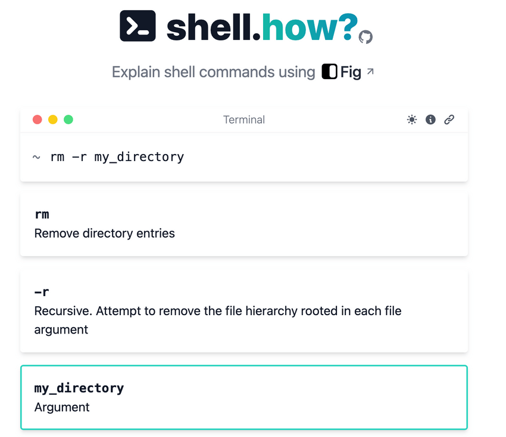
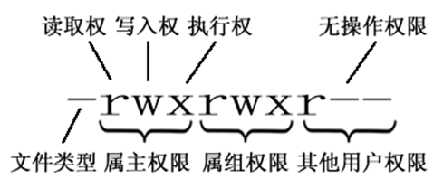
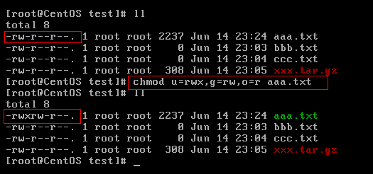

# Linux - 第 2 课：文件系统、目录结构、权限与常用命令

## 学习目标（本节结束后你能做到什么）

- 用容易懂的话解释 Linux 到底是什么，而不是只会说“它是个操作系统”。
- 理解 Linux 里“一切皆文件”这句话到底是什么意思。
- 理解 `inode` 和 `block` 分别在做什么，为什么它们是 Linux 文件系统的基础。
- 分清硬链接和软链接的区别，知道它们各自适合什么场景。
- 读懂 `ls -l` 输出，搞清楚文件类型、权限、所有者、所属组分别代表什么。
- 掌握后端开发最常用的一批 Linux 命令，并知道它们各自适合解决什么问题。

## 内容讲解（核心概念，用类比、例子、图示说清楚）

### 1. Linux 到底是什么

先别急着背命令，先把“Linux 是什么”这件事讲清楚。

你可以先抓住三层：

#### 1.1 Linux 是一类类 Unix 操作系统

Linux 是一种自由、开源、类 Unix 的操作系统。  
很多我们今天熟悉的服务器、云主机、容器底层，都是运行在 Linux 上。

#### 1.2 严格来说，Linux 这个词最核心指的是“Linux 内核”

内核是操作系统最核心的一层，它负责：

- 内存管理
- 进程管理
- 文件系统管理
- 硬件设备管理
- 网络协议栈

但只有内核还不够，还得配上：

- shell
- 包管理器
- 系统工具
- 配置文件
- 服务管理工具

这些组合在一起，才变成我们平时真正用的 Linux 发行版。

比如常见的：

- Ubuntu
- Debian
- RHEL
- Rocky Linux
- AlmaLinux
- CentOS Stream

#### 1.3 Linus Torvalds 是 Linux 内核的最早作者

Linux 的发起者是 Linus Torvalds。  
如果你是后端开发工程师，可以把他当成“系统软件世界里的传奇人物”来认识：

- 他发起了 Linux 内核项目
- 他后来还发起了 Git

很多现代软件工程和系统工程的地基，都能看到他的影响。



### 2. 为什么后端工程师必须懂 Linux

很多人会觉得：

- 我是写 Java / Go / Python 业务的
- 会用 IDE、会写 SQL、会调接口就够了

但现实是，后端服务最后几乎都跑在 Linux 上。  
所以你写的程序最终都会变成：

- Linux 上的一个进程
- 打开的若干文件
- 持有的一些 socket
- 消耗一定 CPU、内存、磁盘、网络资源

于是线上问题往往会回到 Linux：

- 端口为什么起不来
- 日志为什么看不到
- 进程为什么被杀了
- 磁盘为什么满了
- 内存为什么爆了
- 为什么连接建立了但请求还在超时

所以学 Linux，本质上是在学：

**你写的程序在操作系统里到底怎么活着。**

### 3. “一切皆文件”到底是什么意思

这是 Linux 里最著名、也是最容易被初学者忽略的一句话：

**一切皆文件。**

它不是说“世界上真的只有普通文件”，而是说：

**Linux 倾向于用统一的文件接口去抽象和管理各种资源。**

被 Linux 管理的很多资源，都会以“文件”的形式暴露出来，例如：

- 普通文本文件
- 目录
- 磁盘设备
- 终端
- 管道
- socket
- 某些内核和进程信息

这样做的好处是：

- 统一
- 好理解
- 好操作
- 好组合

比如你对文件熟悉了，再去理解：

- 重定向
- 管道
- 设备文件
- socket 文件描述符

就会自然很多。

### 4. Linux 的文件系统为什么离不开 inode

这一块是 Linux 文件系统最容易让初学者发虚的地方，但其实只要抓住一个核心比喻就够了。

你可以把一个文件理解成两部分：

- 文件内容本身
- 文件的“档案信息”

比如一个 `a.txt` 文件，不仅有正文内容，还会有这些信息：

- 谁创建的
- 权限是什么
- 多大
- 修改时间是什么时候
- 数据存在哪些磁盘块里

Linux 会把这类“档案信息”存到 `inode` 里。

### 5. inode 和 block 分别做什么

先记住一句非常重要的话：

- `inode` 负责记录文件的元信息
- `block` 负责存放文件的实际内容

也就是说：

#### 5.1 `block`

磁盘真正存数据时，不是按“文件名”存的，而是按块存的。  
一个文件如果很小，可能只占一个块；如果很大，就会占多个块。

#### 5.2 `inode`

`inode` 不存正文内容，它更像文件的“索引卡片”或“身份证档案”。

里面会记录：

- 文件类型
- 权限
- 所有者
- 大小
- 时间戳
- 数据块位置
- 硬链接数

所以操作系统拿到一个文件后，通常会先通过 `inode` 找到：

- 这个文件是谁
- 它的内容在哪些块里

再去读真正的数据块。



### 6. 为什么重命名文件，不会改变 inode

因为 Linux 真正区分文件，主要不是靠“文件名”，而是靠 `inode`。  
文件名更像是目录里维护的一层“人类可读入口”。

这也解释了很多现象：

- 文件改名了，内容还是原来那份
- 某些进程即使文件名被删了，仍然可能继续持有那个文件内容
- 硬链接为什么本质上可以指向同一个文件实体

这块你只要建立一个稳定心智模型就行：

**文件名更像门牌号，inode 更像房子的内部档案号。**

### 7. 硬链接和软链接有什么区别

这是 Linux 初学阶段一个非常高频的问题。

#### 7.1 硬链接

硬链接本质上是：

**多个文件名指向同一个 inode。**

也就是说，它们在文件系统看来几乎是平级的多个入口。  
删除其中一个名字，不会影响另一个名字继续访问内容。

特点：

- 和源文件共享同一个 inode
- 不能跨文件系统
- 一般不能给目录创建硬链接
- 所有硬链接都删掉后，文件才真正彻底消失

创建命令：

```bash
ln a.txt alink
```

#### 7.2 软链接

软链接本质上不是共享同一个 inode，而是：

**单独创建一个新文件，这个新文件里面保存的是目标路径。**

所以软链接更像 Windows 里的快捷方式。

特点：

- inode 不同
- 可以跨文件系统
- 可以指向目录
- 可以指向一个暂时不存在的目标
- 源文件删了之后，软链接会“悬空”

创建命令：

```bash
ln -s a.txt a_link
```

#### 7.3 一句话区分

- 硬链接：多个名字，底层是同一个文件实体
- 软链接：单独一个“跳转文件”，指向另一个路径

### 8. 为什么硬链接不能跨文件系统

因为硬链接依赖的是同一个文件系统内部的 `inode` 体系。  
每个文件系统都有自己独立的 inode 表。

如果跨文件系统去硬链接，就会出现一个根本问题：

- 另一个文件系统里的 inode 编号，对当前文件系统没有意义

所以硬链接不能跨文件系统，而软链接因为只是保存路径，就没这个限制。

### 9. Linux 支持哪些重要文件类型

Linux 里不只有普通文件。

常见文件类型包括：

- 普通文件 `-`
- 目录文件 `d`
- 符号链接 `l`
- 字符设备 `c`
- 块设备 `b`
- 管道文件 `p`
- 套接字文件 `s`

这也是“一切皆文件”的一个直接体现。



作为后端开发工程师，最常打交道的主要是：

- 普通文件
- 目录
- 软链接
- socket

### 10. Linux 的目录树怎么理解

Linux 的目录结构像一棵倒着长的树，最上面是根目录 `/`。

也就是说，所有路径最终都从 `/` 出发。



常见目录你不用一口气全背，先记最常见这几个：

- `/bin`：常用可执行命令
- `/etc`：系统配置文件
- `/home`：普通用户家目录
- `/root`：root 用户家目录
- `/usr`：系统应用和共享资源
- `/opt`：额外安装的软件
- `/var`：经常变化的数据，比如日志
- `/tmp`：临时文件
- `/dev`：设备文件
- `/proc`：进程和内核信息的虚拟文件系统
- `/boot`：启动相关文件

对后端工程师最实用的几个路径直觉是：

- 看配置，多半先看 `/etc`
- 看日志，多半先看 `/var/log`
- 看用户目录，多半在 `/home`
- 看程序额外安装位置，经常是 `/opt`

### 11. 最常用的一批文件和目录命令

下面这些命令不是“大全”，而是你日常开发、部署、排障最常用的一批。

#### 11.1 目录切换和定位

```bash
pwd
cd /usr
cd ..
cd ~
cd -
```

它们分别表示：

- `pwd`：看当前目录
- `cd /usr`：切换到指定目录
- `cd ..`：回上一级
- `cd ~`：回当前用户家目录
- `cd -`：回到上一次所在目录

#### 11.2 查看目录内容

```bash
ls
ls -l
ll
ls -al
```

常用理解：

- `ls`：只看名字
- `ls -l` / `ll`：看详细信息
- `ls -al`：连隐藏文件一起看

#### 11.3 新建、复制、移动、删除

```bash
mkdir demo
touch a.txt
cp a.txt /tmp/a.txt
cp -r dir1 dir2
mv a.txt b.txt
rm a.txt
rm -r demo
rmdir empty_dir
```

一句话记：

- `mkdir`：建目录
- `touch`：建空文件或更新时间戳
- `cp`：复制
- `mv`：移动或重命名
- `rm`：删除
- `rmdir`：删空目录

### 12. 文件查看和内容搜索

这一组命令对后端开发特别重要，尤其是看日志时。

```bash
cat file.txt
less app.log
tail -f app.log
grep "error" app.log
grep -i "error" app.log
find /home -name "*.txt"
```

重点理解：

- `cat`：适合看小文件
- `less`：适合翻大文件
- `tail -f`：动态追日志
- `grep`：按关键字过滤
- `find`：按路径递归查找文件

真实排障里最常见的组合就是：

```bash
tail -f app.log | grep ERROR
```

或者：

```bash
ps -ef | grep java
```

### 13. Linux 命令不会背怎么办

这很正常，没人能把命令全背住。  
真正重要的是：

- 知道应该去哪一类命令里找
- 知道看到报错后怎么自助理解参数

你给的这两个网站就非常适合初学阶段：

- Linux 命令在线速查
- [shell.how](https://shell.how/)





对初学者来说，这比死背参数更有价值。

### 14. 文件权限怎么看

看 `ls -l` 输出时，最容易让人发怵的是这一串：

```text
-rwxr-xr--
```

你可以把它拆成四段：

1. 第一位：文件类型
2. 接下来三位：属主权限
3. 再三位：属组权限
4. 最后三位：其他用户权限

比如：

```text
drwxr-xr-x
```

含义是：

- `d`：这是目录
- `rwx`：所有者有读写执行
- `r-x`：同组用户有读和执行
- `r-x`：其他用户也有读和执行



### 15. 文件和目录上的 r/w/x 意义不完全一样

这也是初学者经常搞混的一点。

#### 15.1 对文件来说

- `r`：可以读取内容
- `w`：可以修改内容
- `x`：可以执行

#### 15.2 对目录来说

- `r`：可以看目录列表
- `w`：可以在里面创建/删除文件
- `x`：可以进入目录

这就解释了为什么“目录可写”和“文件可写”不是一回事。

### 16. chmod 怎么改权限

最常用的权限修改命令是：

```bash
chmod 755 demo.sh
chmod u=rwx,g=rx,o=rx demo.sh
```

这里数字法你要会算：

- `r = 4`
- `w = 2`
- `x = 1`

所以：

- `7 = 4 + 2 + 1 = rwx`
- `6 = 4 + 2 = rw-`
- `5 = 4 + 1 = r-x`

例如：

- `755`：属主 `rwx`，其他人 `r-x`
- `644`：属主 `rw-`，其他人 `r--`



### 17. 所有者、所属组、其他用户是什么意思

Linux 里权限不是只针对“这个人能不能看”，而是分三层：

- 所有者 `u`
- 所属组 `g`
- 其他用户 `o`

所以一个文件通常不仅有内容和权限，还有：

- 属于哪个用户
- 属于哪个组

相关命令你至少要知道：

```bash
chown user file.txt
chgrp dev file.txt
chmod 644 file.txt
```

### 18. 用户、用户组和 sudo 先建立一个基础认识

Linux 是多用户系统。  
这意味着：

- 不同用户有不同权限
- 不同组可以统一管理一批用户的权限

常见命令你先混个脸熟：

```bash
useradd alice
passwd alice
userdel alice
groupadd dev
groupdel dev
su alice
sudo systemctl restart nginx
```

你不需要一开始就把所有用户管理命令都记住，但至少要知道：

- 普通用户和 root 权限不一样
- `sudo` 是临时以管理员身份执行命令
- 很多线上操作失败，本质上是权限问题

### 19. 后端工程师最常用的一批排障命令

如果你以后只记一批 Linux 排障命令，我建议先记下面这些：

#### 19.1 看进程

```bash
ps -ef | grep java
top
htop
```

#### 19.2 看内存

```bash
free -h
vmstat 1
```

#### 19.3 看磁盘

```bash
df -h
du -sh *
```

#### 19.4 看网络和端口

```bash
ss -lntp
ping 8.8.8.8
ip addr
```

#### 19.5 看服务

```bash
systemctl status nginx
systemctl restart docker
```

#### 19.6 看日志和关键字

```bash
tail -f app.log
grep "ERROR" app.log
```

#### 19.7 杀进程

```bash
kill pid
kill -9 pid
```

注意：

- `kill -9` 很暴力，排障时不要当默认方案
- 更好的顺序通常是先查原因，再决定是否强杀

### 20. 环境变量你至少要知道什么

环境变量你不用一开始学得很深，但要知道它们是什么：

- `PATH`：系统去哪里找命令
- `HOME`：当前用户家目录
- `JAVA_HOME`：很多 Java 程序依赖它

最常见操作：

```bash
echo $PATH
echo $HOME
export JAVA_HOME=/path/to/jdk
source ~/.bashrc
```

你可以先这样理解：

- `export`：当前终端里临时生效
- 配到 `~/.bashrc` / `~/.bash_profile`：更长期生效

### 21. 把这节内容串成一张图

作为后端工程师，你看 Linux 不要把它看成一堆零散命令，而要看成一张完整图：

- 程序是进程
- 进程会打开文件和 socket
- 文件系统靠 inode 和 block 管理内容
- 权限控制谁能读、写、执行
- 目录树决定配置、日志、程序装在哪里
- 排障命令帮你看 CPU、内存、磁盘、网络和进程状态

一旦这张图在你脑子里建立起来，你再学：

- socket
- 进程调度
- 虚拟内存
- 零拷贝
- 服务治理

就会顺很多。

## 小结（3-5 条关键点）

- Linux 最核心不只是会敲命令，而是理解程序、文件、权限、进程、网络这些资源如何被操作系统统一管理。
- “一切皆文件”表示 Linux 倾向于用统一文件接口管理多种资源，不只是普通文件。
- `inode` 记录文件元信息，`block` 存放文件实际内容，这是理解文件系统的基础。
- 硬链接共享同一个 inode，软链接更像保存目标路径的快捷方式。
- 对后端工程师最实用的一批命令集中在：目录文件操作、日志查看、进程排查、磁盘内存网络观察、服务管理。

## 问题 （检测用户对当前章节内容是否了解）

1. 为什么说 Linux 里“一切皆文件”？这句话对后端开发有什么实际帮助？
2. `inode` 和 `block` 分别在做什么？为什么文件改名通常不会改变 inode？
3. 硬链接和软链接最大的区别是什么？为什么硬链接不能跨文件系统？
4. `ls -l` 里的 `drwxr-xr-x` 该怎么拆开看？目录上的 `x` 权限到底代表什么？
5. 如果线上服务报“磁盘满了”“端口被占用”“日志里一直刷 error”，你第一反应会想到哪些 Linux 命令？
