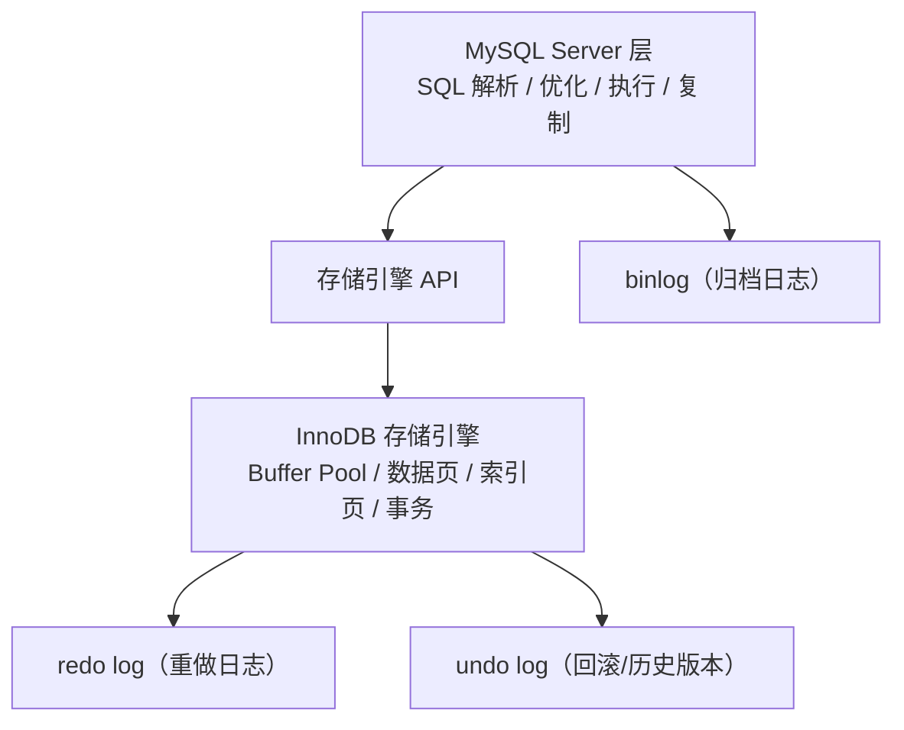
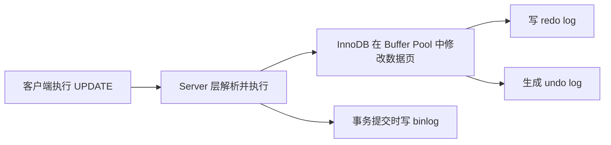

# MySQL - 第 1 课：MySQL 日志体系概览：为什么数据库需要这么多日志

## 学习目标（本节结束后你能做到什么）

- 能说清 MySQL 常见日志的大致分类，不再把各种日志混成一团。
- 能理解为什么数据库不能只靠“把数据页刷盘”来保证安全。
- 能区分 `redo log`、`binlog`、`undo log` 各自解决的核心问题。
- 脑子里建立“一次更新会同时经过 Server 层和 InnoDB 层”的整体画面。

## 内容讲解（核心概念，用类比、例子、图示说清楚）

很多人第一次接触 MySQL 日志时会懵，主要是因为名字太多了：

- 错误日志
- 查询日志
- 慢查询日志
- `binlog`
- `redo log`
- `undo log`

看起来都叫“日志”，但它们根本不是同一个层次的东西。

你可以先把 MySQL 想成一个“两层结构”的系统：

- 上面一层是 **MySQL Server 层**，负责 SQL 解析、优化、执行、权限、复制等通用能力。
- 下面一层是 **存储引擎层**，以 InnoDB 为主，负责真正的数据页、索引页、Buffer Pool、事务页修改等底层存储工作。

所以有些日志是 Server 层写的，有些日志是 InnoDB 写的，这就是为什么会有多种日志并存。



### 1. 先把常见日志分成两类

第一类是“运维 / 排障类日志”：

- 错误日志：看启动失败、崩溃、异常报错。
- 查询日志：记录所有请求，生产一般不会长期开。
- 慢查询日志：专门抓执行慢的 SQL，用于性能排查。

第二类是“事务 / 数据一致性类日志”：

- `redo log`
- `binlog`
- `undo log`

我们这次专题真正要学的，是第二类。

### 2. 为什么不能只靠直接刷数据页？

这个问题特别关键。

假设你执行：

```sql
update account set balance = balance - 100 where id = 1;
```

最朴素的想法是：

1. 找到这一行
2. 改掉余额
3. 立刻把对应数据页刷到磁盘

听起来很直接，但问题很大。

#### 2.1 数据页刷盘很重

InnoDB 以 **页** 为基本读写单位，默认一个页是 16KB。  
你这次可能只改了其中几个字节，却要把整页写回磁盘。

#### 2.2 数据页刷盘往往是随机写

一个数据页在磁盘上的位置不连续，多个事务改多个页时，磁盘会到处跳着写，随机 IO 成本很高。

#### 2.3 事务提交时如果等所有脏页落盘，吞吐会很差

数据库之所以快，很大程度上是因为：

- 数据页先在内存里改
- 真正的数据页刷盘可以稍后再做

那问题就来了：

- 如果页还没刷到磁盘，MySQL 突然挂了怎么办？

这就是日志体系存在的原因。

### 3. 三种核心日志分别在保什么

你可以先记住一句总纲：

- `redo log`：保 **已经做过的物理页修改**
- `binlog`：保 **这次事务做了什么逻辑操作**
- `undo log`：保 **如果要反悔，怎么退回旧版本**

它们像三个不同职责的“保险人”。

| 日志 | 所属层 | 记录重点 | 主要用途 |
| --- | --- | --- | --- |
| `redo log` | InnoDB | 某个页被改成什么样 | 崩溃恢复、持久性 |
| `binlog` | Server | 事务做了哪些逻辑变更 | 主从复制、备份恢复 |
| `undo log` | InnoDB | 修改前的旧版本 / 反向信息 | 回滚、MVCC |

### 4. 一次更新，三种日志是怎样配合的

我们先建立一个“粗粒度”的画面，后面每一课再细讲。



这里最容易误解的地方是：

- `redo log` 不是“最后补记一下”
- `binlog` 也不是“既然有 redo 了就可有可无”

它们分别服务于不同目标。

#### 4.1 `redo log` 解决的是“主库自己别丢”

只要事务提交成功，即使数据页还没刷盘，MySQL 重启后也能靠 `redo log` 把内存里来不及落盘的修改再“重做”一遍。

#### 4.2 `binlog` 解决的是“别人也得知道你改了什么”

主从复制、备份恢复、时间点恢复，都依赖 `binlog`。  
没有它，主库自己也许能恢复，但从库和备份库不一定知道发生了什么。

#### 4.3 `undo log` 解决的是“我现在想撤销，或者我现在只想看老版本”

一个事务执行到一半出错，要 rollback，就要用它。  
另一个事务做快照读时，如果当前版本对它不可见，也要顺着 `undo log` 去找历史版本。

### 5. 为什么 `redo` 和 `binlog` 不能互相替代

这个问题是 MySQL 日志专题里最经典的误区之一。

很多人会说：

- 反正都是日志，为什么不只留一个？

不行，因为它们站的层次不同。

#### 5.1 `redo log` 是 InnoDB 内部视角

它关心的是：

- 哪个表空间
- 哪个页
- 哪个偏移
- 做了什么修改

这种日志非常适合崩溃恢复，因为恢复时只需要把底层页修回去。

但它不适合做主从复制，因为别的实例未必需要照着“页偏移”去同步。

#### 5.2 `binlog` 是 Server 层逻辑视角

它关心的是：

- 这次事务更新了哪张表
- 改了哪些行
- 原 SQL 是什么，或者行级变更是什么

这种日志非常适合复制和归档，但它本身不能直接替代 InnoDB 的崩溃恢复机制。

### 6. 真正要建立的主线

这一节你不用急着背参数，只要把下面这条主线记稳：

1. **数据页真正改在 Buffer Pool**
2. **想保证提交后不丢，要先有 `redo log`**
3. **想保证复制和备份能同步，要有 `binlog`**
4. **想支持回滚和 MVCC，要保留 `undo log`**
5. **因为一个事务往往同时涉及 `redo` 和 `binlog`，所以还必须解决它们之间的一致性问题**

后面你学两阶段提交时，其实就是在解决第 5 点。

## 小结（3-5 条关键点）

- MySQL 有很多日志，但本专题重点是 `redo log`、`binlog`、`undo log` 三类事务相关日志。
- `redo log` 属于 InnoDB，核心是崩溃恢复；`binlog` 属于 Server 层，核心是复制与归档；`undo log` 属于 InnoDB，核心是回滚与历史版本。
- 数据库不会每次事务提交都立刻把数据页整体刷盘，因为那样太慢，所以需要日志先兜底。
- 一次更新通常会同时牵涉 `redo log`、`undo log` 和 `binlog`，它们不是重复设计，而是分工不同。
- 后面学习的关键，是把“一次事务提交前后到底发生了什么”这条时间线真正串起来。

## 问题（检测用户对当前章节内容是否了解）

1. 为什么说 MySQL 的 `binlog` 和 InnoDB 的 `redo log` 不是一回事？它们最核心的职责分别是什么？
2. 如果事务提交后数据页还没刷盘，为什么数据库仍然可以保证大多数情况下不丢数据？
3. `undo log` 除了 rollback 之外，还参与了 MySQL 的哪一个重要机制？
