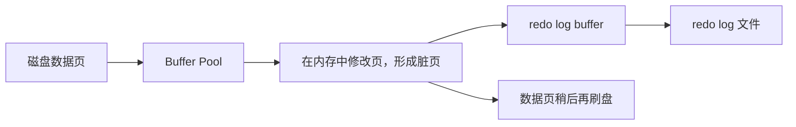

# MySQL - 第 2 课：redo log：WAL、Buffer Pool、刷盘时机与环形日志文件

## 学习目标（本节结束后你能做到什么）

- 能用“更新一行数据”的视角讲清 `redo log` 为什么存在。
- 理解 WAL、Buffer Pool、脏页、`redo log buffer` 之间的关系。
- 说清 `innodb_flush_log_at_trx_commit=0/1/2` 的区别，以及分别可能丢什么。
- 理解 `write pos`、`checkpoint`、环形日志文件组这些高频概念。

## 内容讲解（核心概念，用类比、例子、图示说清楚）

### 1. 一次更新到底先改哪里

先想一个非常具体的问题：

```sql
update account set balance = balance - 100 where id = 1;
```

InnoDB 不会一上来就直接去磁盘把那一页改掉。它的典型路径是：

1. 先把目标数据页从磁盘读进内存的 Buffer Pool
2. 在 Buffer Pool 中修改这页数据
3. 把“这页被怎样改了”写进 `redo log buffer`
4. 在合适时机把 `redo log buffer` 刷到磁盘上的 `redo log` 文件
5. 数据页本身稍后再刷盘



这背后对应的是一个非常核心的思想：**WAL，Write-Ahead Logging**。

### 2. WAL 是什么

WAL 的中文一般叫“预写式日志”。

你可以把它理解成一句非常接地气的话：

**真正把数据页写回磁盘之前，先把这次修改记到账本里。**

为什么要这样？

- 日志记录更小
- 日志写入更顺序
- 日志刷盘更快
- 事务提交时就不用等整页落盘

如果没有 WAL，每次提交事务都要等真实数据页刷盘，那数据库吞吐会掉得很厉害。

### 3. 为什么 `redo log` 比直接刷数据页快

这是你必须建立的性能直觉。

#### 3.1 数据页大

InnoDB 默认页大小是 16KB。  
你可能只改了几字节，但刷盘时面对的是整页。

#### 3.2 数据页刷盘更像随机写

一个页在磁盘文件里的位置是固定但分散的，多事务并发更新时，磁盘要在很多位置之间来回跳。

#### 3.3 `redo log` 更像顺序追加

`redo log` 记录的是“某页某偏移被改成什么”，通常记录量远小于整页，而且写入方式更接近顺序写。

所以它快，不是因为“它只是日志”，而是因为：

- 写得更少
- 写得更顺

### 4. `redo log buffer` 是什么

`redo log buffer` 就是 InnoDB 给 `redo log` 准备的一块内存缓冲区。

事务执行过程中，修改先被组织成 `redo log` 记录写到这里，再由后台线程或提交动作刷到磁盘文件。

这意味着一件很重要的事：

**还没提交的事务，其 `redo log` 也可能已经被刷盘。**

这很多人第一次接触时会觉得奇怪，但其实没问题。因为：

- 事务是否真正生效，不只看日志在不在磁盘
- 还要看事务最终是否提交，以及恢复时如何判定状态

### 5. `redo log` 什么时候刷盘

下面这几个时机最重要：

1. **事务提交时**
2. `redo log buffer` 使用空间过大时
3. 后台线程大约每秒定期刷一次
4. 发生 checkpoint 时
5. MySQL 正常关闭时
6. 一些与日志切换、容量管理相关的内部时机

实际工作里最该关心的是第 1 个，也就是参数：

`innodb_flush_log_at_trx_commit`

### 6. `innodb_flush_log_at_trx_commit` 的 0、1、2

这个参数是面试和线上调优里的绝对高频。

但不要死记“0 不安全、1 最安全、2 折中”，要知道它到底控制了什么。

先区分两个动作：

- `write`：把内容写到文件系统的 page cache
- `fsync`：真正把 page cache 刷到磁盘

#### 6.1 值为 1

每次事务提交时：

- 写入 page cache
- 立刻 `fsync`

这是最安全的方式。只要事务提交成功，`redo log` 就已经真正落盘。

#### 6.2 值为 0

每次事务提交时：

- 不主动做 `write`
- 不主动做 `fsync`

主要靠后台线程每秒刷一次。

这意味着如果 MySQL 进程或机器在这一秒内出问题，最近约 1 秒事务可能丢失。

#### 6.3 值为 2

每次事务提交时：

- 会 `write` 到 page cache
- 但不立刻 `fsync`

主要靠后台线程每秒把 page cache 刷到磁盘。

这种模式下：

- **仅 MySQL 进程崩溃** 时，通常问题不大，因为 page cache 还在操作系统里
- **机器宕机 / 掉电 / OS 崩溃** 时，就可能丢最近约 1 秒数据

你可以这样记：

| 参数值 | 提交时 write | 提交时 fsync | 风险 |
| --- | --- | --- | --- |
| 0 | 否 | 否 | MySQL 挂 / 宕机都可能丢近 1 秒 |
| 1 | 是 | 是 | 最安全，代价最高 |
| 2 | 是 | 否 | MySQL 进程挂风险较小，机器宕机仍可能丢近 1 秒 |

生产里如果你追求事务持久性，默认还是应该优先 `1`。

### 7. `redo log` 文件为什么是环形的

很多人知道 `redo log` 存在多个文件，但不知道为什么它不是越写越大。

答案是：它本来就是设计成**循环复用**的。


这里有两个特别重要的指针：

- `write pos`：当前写到哪里
- `checkpoint`：哪些日志已经“对应的数据页落盘，可以被覆盖”了


更准确地说：

- `write pos` 一直往前推进，表示新日志写到哪了
- `checkpoint` 也往前推进，表示旧日志可以被回收的位置

`write pos` 和 `checkpoint` 之间那段“正在使用”的空间，代表：

- 它对应的脏页还没有全部刷盘
- 这些日志还不能被覆盖

如果 `write pos` 快追上 `checkpoint`，说明日志空间快满了，InnoDB 就必须推进 checkpoint，也就是逼一部分脏页落盘，腾出可复用空间。

### 8. MySQL 8.0.30 之后 redo 配置的变化

这是比较新的版本知识点。

早期你经常会看到：

- `innodb_log_file_size`
- `innodb_log_files_in_group`

到了 MySQL 8.0.30 及之后，更推荐直接使用：

- `innodb_redo_log_capacity`

你可以把它理解成：

**不要再分别配置“几个文件、每个多大”，而是直接配置整个 redo 容量。**

然后 MySQL 再按这个总容量去切分文件。

对学习者来说，最重要的不是记所有变量名，而是知道：

- redo 空间不是无限的
- 空间太小会更频繁地逼 checkpoint
- checkpoint 太频繁会影响性能
- 所以 redo 容量配置，实际上是在“恢复时间、磁盘占用、刷脏压力”之间做平衡

### 9. 实战里怎么理解 `redo log`

你可以把 `redo log` 看成 MySQL 更新链路里的“低成本持久化凭证”。

事务提交时，不需要等所有脏页落盘，只要：

- 这次页修改已经可靠地记进 `redo log`

那即使数据库马上崩了，重启后也能把这些还没落到数据文件的修改再做一遍。

这就是为什么我们说：

**`redo log` 给 InnoDB 带来了崩溃恢复能力。**

## 小结（3-5 条关键点）

- `redo log` 的核心作用，是让 InnoDB 不必在事务提交时直接刷整页，也仍然能保证崩溃恢复。
- WAL 的本质是“先写日志，再择机刷真实数据页”。
- `redo log` 快，主要因为记录量更小、写入更顺序，而不是因为“日志天然就快”。
- `innodb_flush_log_at_trx_commit=1` 最安全；`0` 和 `2` 都可能造成近 1 秒数据风险，只是风险场景不同。
- `redo log` 采用环形复用，`write pos` 负责往前写，`checkpoint` 负责回收可覆盖空间。

## 问题（检测用户对当前章节内容是否了解）

1. 为什么事务提交时不直接强制刷脏页，而要优先依赖 `redo log`？
2. `innodb_flush_log_at_trx_commit=2` 时，如果只是 MySQL 进程崩溃，和整台机器断电，风险为什么不一样？
3. `write pos` 和 `checkpoint` 分别代表什么？为什么 `write pos` 不能直接追上 `checkpoint`？
