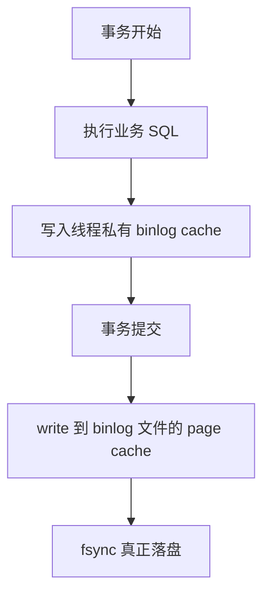

# MySQL - 第 3 课：binlog：归档日志、三种格式、sync_binlog与主从复制

## 学习目标（本节结束后你能做到什么）

- 理解 `binlog` 为什么属于 Server 层，而不是 InnoDB 层。
- 能说清 `statement`、`row`、`mixed` 三种格式分别记录什么、适合什么场景。
- 理解 `sync_binlog=0/1/N` 的含义以及它对可靠性和性能的影响。
- 明白为什么主从复制、备份恢复离不开 `binlog`。

## 内容讲解（核心概念，用类比、例子、图示说清楚）

上一课我们讲了 `redo log`，它更像是 InnoDB 给自己准备的“崩溃恢复账本”。

那 `binlog` 呢？

你可以先给它一个最朴素的定义：

**`binlog` 是 MySQL Server 层记录“事务做了哪些逻辑变更”的归档日志。**

注意这句话里有两个关键词：

- **Server 层**
- **逻辑变更**

### 1. 为什么 `binlog` 在 Server 层

因为主从复制、备份恢复这些能力，不应该只绑定在 InnoDB 上。

只要某个存储引擎发生了表数据变更，Server 层都可以把这次事务产生的逻辑变化记到 `binlog` 里。

所以：

- `redo log` 是 InnoDB 独有
- `binlog` 是 MySQL Server 层通用

这也是为什么：

- `redo log` 更偏“主库自己恢复”
- `binlog` 更偏“把变化告诉别人”

### 2. `binlog` 最重要的两个用途

#### 2.1 主从复制

主库把事务写进 `binlog`，从库持续读取并重放，从而达到数据同步。


#### 2.2 数据恢复与归档

比如你做了一次全量备份，然后想把数据库恢复到“今天下午 3 点 25 分”这个时间点，那就需要：

1. 先恢复全量备份
2. 再重放这一段时间里的 `binlog`

这叫时间点恢复，离不开 `binlog`。

### 3. `binlog` 记录的三种格式

这是很高频的知识点。

#### 3.1 `statement`

记录原始 SQL。

比如：

```sql
update T set update_time = now() where id = 1;
```

这种格式最直观，日志量也相对小。

但问题也明显：

- `now()`
- `uuid()`
- `rand()`

这类依赖执行时上下文的表达式，在别的实例上重放时可能出现不一致。

#### 3.2 `row`

记录被修改的行，以及行级别前后变化。

你可以把它理解成：

- 不再只说“执行了什么 SQL”
- 而是明确说“哪一行从什么值变成了什么值”

这种方式更可靠，主从复制也更稳，所以生产里通常更推荐。

缺点也很现实：

- 更占空间
- IO 压力更大

#### 3.3 `mixed`

混合模式。

MySQL 会自己判断：

- 这条 SQL 如果用 `statement` 可能不安全，就切成 `row`
- 否则仍然使用 `statement`

### 4. 为什么很多生产环境倾向于 `row`

不是因为它绝对最好，而是因为它在一致性上更稳。

对于工程系统来说，最怕的不是多花一点磁盘，而是：

- 主库和从库因为某条语句的上下文不同，结果算出来不一样

所以如果你把目标放在：

- 复制可靠
- 恢复可靠

那 `row` 往往是更省心的默认选择。

### 5. `binlog` 是什么时候写的

和 `redo log` 不一样，`binlog` 的典型特点是：

**事务执行过程中先写到线程私有的 `binlog cache`，事务提交时再统一落到 `binlog` 文件。**



这里的设计很好理解：

- 一个事务对应的 `binlog` 最好是一个相对完整的逻辑单元
- 不希望这个事务写一半就被拆得七零八落

这里顺手记一个很实用的配置项：

- `binlog_cache_size`

它控制的是**单个线程**的 `binlog cache` 初始大小。  
如果事务特别大，超出了这块缓存，就会把一部分内容临时落到磁盘文件中。这样虽然还能继续执行，但性能会明显变差。

所以线上看到“大事务 + binlog 写很慢”时，不能只盯 `sync_binlog`，还要怀疑是不是：

- 事务本身太大
- `binlog cache` 顶不住，开始频繁借助磁盘临时文件

所以它不像 `redo log` 那样在事务执行中持续变成最终持久化结果，而是更偏向“提交时统一归档”。

### 6. `sync_binlog`

这个参数控制的是：

**事务提交后，`binlog` 到底多久真正 `fsync` 到磁盘。**

#### 6.1 `sync_binlog = 1`

每次事务提交都 `fsync`。

这是最安全的做法。只要提交成功，对应的 `binlog` 基本就已经可靠落盘。

#### 6.2 `sync_binlog = 0`

提交时只 `write` 到 page cache，什么时候真正 `fsync` 交给操作系统。

性能更好，但如果机器宕机，page cache 里的内容可能丢。

#### 6.3 `sync_binlog = N`

每提交一个事务先 `write`，攒够 N 个事务再统一 `fsync`。

这是一种折中：

- 性能比 `1` 好
- 但机器宕机时，最近 N 个事务的 `binlog` 可能丢失

### 7. 为什么大家经常提“双 1”

所谓“双 1”，通常指：

- `innodb_flush_log_at_trx_commit = 1`
- `sync_binlog = 1`

意思是：

- `redo log` 提交时真正落盘
- `binlog` 提交时也真正落盘

这样做的核心目标是：

**既保证主库自己能恢复，也保证复制链路和归档链路能拿到完整事务。**

性能会更贵，但一致性最稳。

### 8. `binlog` 和 `redo log` 的差异要怎么记

这是整个专题最应该背熟的一张对照表：

| 维度 | `redo log` | `binlog` |
| --- | --- | --- |
| 所属层 | InnoDB | MySQL Server |
| 记录内容 | 页级物理修改 | 逻辑变更 / 行变更 |
| 主要目的 | 崩溃恢复 | 复制、归档、恢复 |
| 写入方式 | 事务执行过程中可持续产生 | 提交时统一写出 |
| 文件形态 | 环形复用 | 归档追加，滚动切换 |

这里还有一个容易忽略的点：

- `redo log` 重点是“把主库自己救回来”
- `binlog` 重点是“让别的实例、备份链路也知道你做了什么”

如果没有 `binlog`，主库自己可能仍能借助 `redo log` 恢复，但从库和备库就会缺这次变更。

### 9. 实战里关于 `binlog` 的几个建议

1. **生产环境优先考虑 `row`**
   - 尤其是你依赖主从复制、回放恢复、审计链路时，先保证一致性。
2. **避免超大事务**
   - 一次事务改很多行，不仅会让 `redo`、`undo` 压力上升，也会让 `binlog cache` 变大、刷盘变慢、主从延迟变高。
3. **谨慎设置 `sync_binlog`**
   - 如果你追求极致可靠，通常还是 `1`。
   - 如果你为了吞吐改成更大的值，要明确知道：机器宕机时最近若干事务的 `binlog` 可能丢。
4. **把 `binlog` 当成复制和恢复的生命线**
   - 主从异常、误删恢复、时间点恢复，很多时候最终都要回到 `binlog`。

## 小结（3-5 条关键点）

- `binlog` 属于 MySQL Server 层，核心任务是记录事务的逻辑变更，用于复制和归档。
- `statement` 省空间但可能有不一致风险；`row` 更可靠、生产更常见；`mixed` 是折中。
- `binlog` 通常先写到线程私有的 `binlog cache`，事务提交时再统一写出；大事务可能把 cache 顶到磁盘临时文件上。
- `sync_binlog=1` 最安全；`0` 和 `N` 会提升性能，但机器宕机时可能丢最近的 `binlog`。
- `redo log` 和 `binlog` 都是持久化相关日志，但它们分别面向“主库恢复”和“复制归档”两种不同目标。

## 问题（检测用户对当前章节内容是否了解）

1. 为什么说 `binlog` 更像“告诉别人我做了什么”，而 `redo log` 更像“保证我自己能恢复”？
2. `statement`、`row`、`mixed` 三种 `binlog` 格式，你会怎么向别人解释它们的区别？
3. 为什么很多生产环境会倾向于把 `sync_binlog` 设为 `1`？
