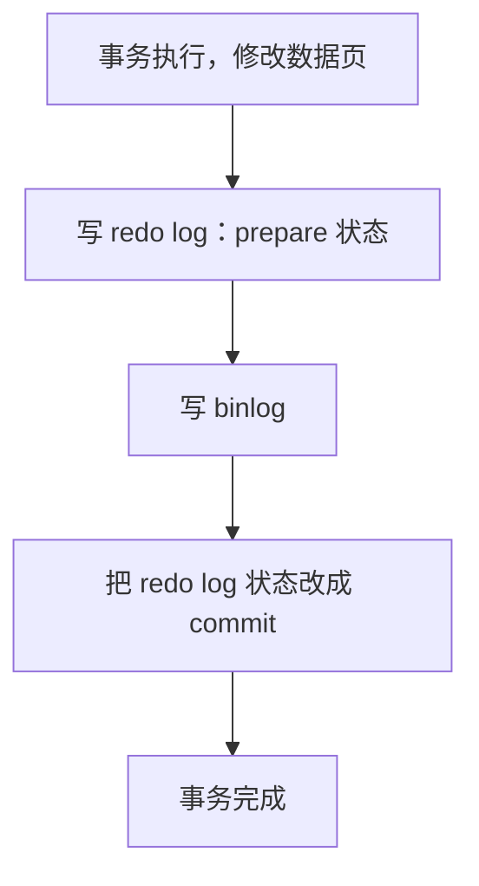
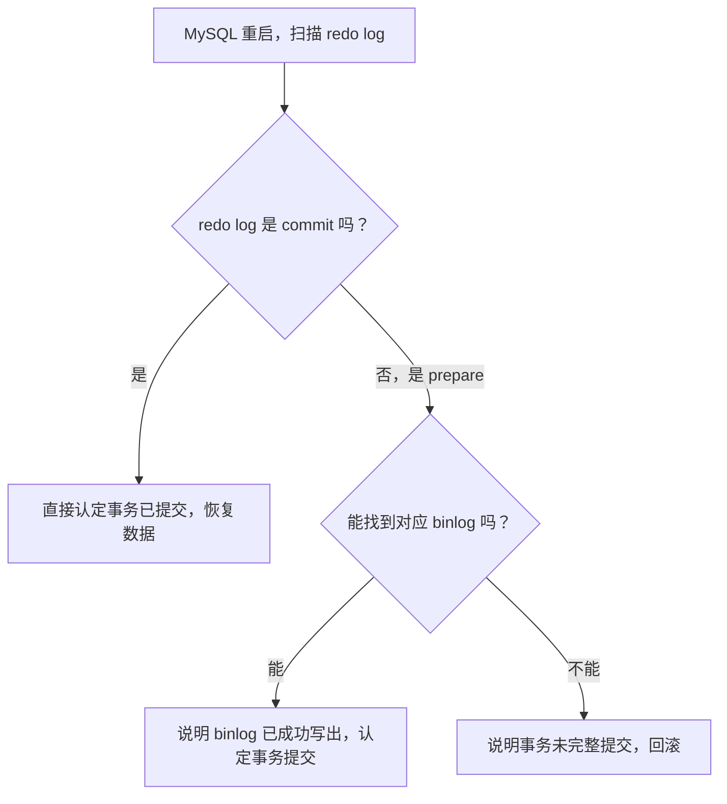

# MySQL - 第 4 课：两阶段提交：redo和binlog怎样保证一致

## 学习目标（本节结束后你能做到什么）

- 能说清两阶段提交要解决的根本问题，不再只会背 `prepare` 和 `commit`。
- 能解释如果 `redo log` 和 `binlog` 不一致，会导致什么线上后果。
- 理解 MySQL 崩溃恢复时，为什么会根据 `redo log` 状态和 `binlog` 是否存在共同判定事务结果。
- 能把“两阶段提交”讲成一个完整故障故事，而不是一段硬背流程。

## 内容讲解（核心概念，用类比、例子、图示说清楚）

### 1. 问题不是“有两个日志”，而是“两个日志的最终状态必须一致”

我们已经知道：

- `redo log` 负责主库崩溃恢复
- `binlog` 负责主从复制和归档恢复

那你马上会遇到一个关键问题：

**如果一个事务已经写进 `redo log`，但还没写进 `binlog` 时 MySQL 崩了，会怎么样？**

这不是理论上的小瑕疵，而是实打实会造成线上不一致的。

### 2. 先看最危险的故障场景

假设有一条 SQL：

```sql
update T set c = 1 where id = 2;
```

原来 `id = 2` 这一行的 `c = 0`。

如果系统执行过程是：

1. 先把这次修改完整写进 `redo log`
2. 再去写 `binlog`
3. 结果第 2 步中途崩了

那会出现什么情况？


结果就是：

- 主库自己恢复后，`c = 1`
- 从库和备份恢复出来的结果仍可能是 `c = 0`

这就叫日志不一致。

### 3. 为什么不能简单地规定“先写 binlog 再写 redo”

有人会说：

- 那就反过来不就行了？先写 `binlog`，再写 `redo log`

也不行。

因为如果：

1. `binlog` 已经写成功
2. `redo log` 还没完成
3. 这时 MySQL 崩了

那主库自己恢复时，可能恢复不出这次事务，但从库却已经通过 `binlog` 同步到了这次变更。

于是变成另一种不一致：

- 主库没有
- 从库反而有

所以重点不在“谁先谁后”，而在于：

**必须让恢复逻辑能判断：这个事务到底算提交成功，还是应该回滚。**

### 4. 两阶段提交是怎么做的

MySQL 的做法是把 `redo log` 的写入拆成两段：

1. `prepare`
2. `commit`

完整提交流程可以先粗看成这样：



你可以把 `prepare` 理解成：

- “我已经把恢复主库所需的底层修改记下来了”
- “但我还没宣布这次事务最终完成”

只有等 `binlog` 也写好，最后再把 `redo log` 改成 `commit`，这次事务才算彻底闭环。

### 5. 崩溃恢复时怎么判断事务最终状态

真正精妙的地方在这里。

MySQL 重启恢复时，不是只看 `redo log` 在不在，而是看：

1. `redo log` 是 `prepare` 还是 `commit`
2. 有没有与之匹配的 `binlog`

大致逻辑可以这样理解：



这就把前面两个最危险的故障窗口都兜住了。

### 6. 两个经典崩溃场景

#### 6.1 场景一：写完 redo prepare，写 binlog 之前崩溃

流程是：

1. 事务修改完成
2. `redo log` 写到 `prepare`
3. 还没写完 `binlog`
4. MySQL 崩溃

恢复时：

- 看到 `redo log` 只是 `prepare`
- 又找不到对应 `binlog`

于是判断：

- **这事务不完整，应回滚**

#### 6.2 场景二：写完 binlog，还没把 redo 标成 commit 时崩溃

流程是：

1. `redo log` 已到 `prepare`
2. `binlog` 已完整写出
3. `redo log` 还没来得及改成 `commit`
4. MySQL 崩溃

恢复时：

- 虽然 `redo log` 仍显示 `prepare`
- 但能找到匹配的 `binlog`

于是判断：

- **这事务应视为已提交**

这就是为什么很多文章会说：

- `redo log` 在 `prepare` 状态不一定回滚

关键不在于它是不是 `prepare`，而在于：

- 有没有完整的 `binlog` 能证明这次事务已经走完提交流程

### 7. 为什么两阶段提交对主从复制特别重要

如果你只盯着主库自己，会觉得：

- 主库能恢复就挺好了

但真实线上不是单机数据库，而是：

- 主库
- 从库
- 备份恢复链路

如果主库靠 `redo log` 恢复成功，而 `binlog` 缺失，那主库自己也许没问题，但复制链路和备份链路就会断裂。

所以两阶段提交真正解决的是：

**让“主库本地恢复结果”和“复制 / 归档链路看到的事务集合”保持一致。**

### 8. 一个好记的理解方式

你可以把三步想成：

1. `redo prepare`：先把“主库恢复凭证”写好，但先别宣布成交
2. `binlog`：再把“要告诉外界的归档凭证”写好
3. `redo commit`：最后盖章，宣布这笔事务正式完成

这样无论中途在哪一步崩，恢复时都还能推断出这笔事务到底该算成功还是失败。

## 小结（3-5 条关键点）

- 两阶段提交解决的不是“顺序优雅问题”，而是 `redo log` 和 `binlog` 之间的一致性问题。
- 只要存在“主库恢复依赖 `redo`、复制和备份依赖 `binlog`”，就必须让两者在事务边界上保持一致。
- MySQL 把 `redo log` 拆成 `prepare` 和 `commit` 两个状态，就是为了给崩溃恢复留下判定空间。
- 恢复时如果 `redo log` 是 `prepare`，但能找到匹配 `binlog`，事务仍会被认为已提交。
- 两阶段提交本质上是在保证：主库自己恢复出来的结果，不能和从库 / 备份链路看到的事务集合不一致。

## 问题（检测用户对当前章节内容是否了解）

1. 如果没有两阶段提交，为什么“主库自己恢复成功”仍然可能导致整个 MySQL 集群数据不一致？
2. `redo log` 处于 `prepare` 状态时，事务一定会回滚吗？为什么？
3. 你能不能用“写完 redo、没写完 binlog 时崩溃”的场景，自己讲一遍两阶段提交到底解决了什么问题？
