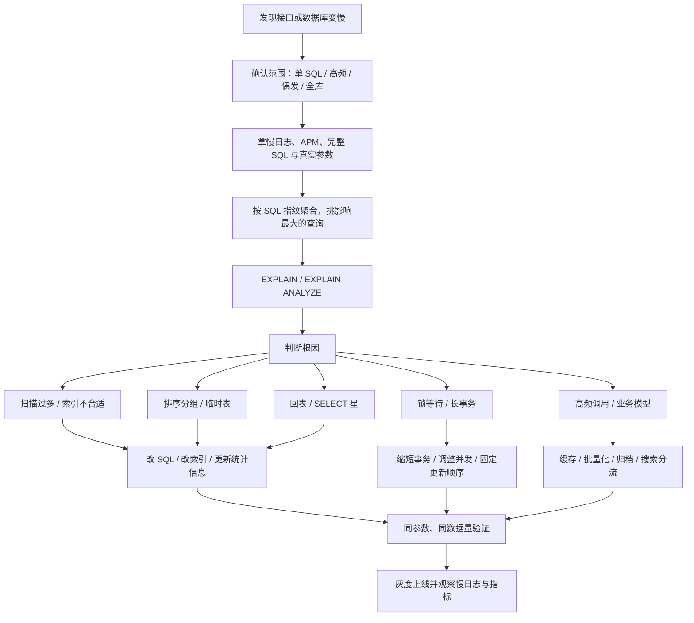

# MySQL - 第 6 课：慢查询排查过程：慢日志、EXPLAIN、锁等待与优化闭环

## 学习目标（本节结束后你能做到什么）

- 能按一套稳定顺序排查 MySQL 慢查询，而不是看到慢 SQL 就立刻加索引。
- 知道慢查询日志里哪些字段最有价值，以及如何按 SQL 指纹聚合问题。
- 能结合 `EXPLAIN`、`EXPLAIN ANALYZE`、锁等待和事务状态判断慢在哪里。
- 能把优化动作做成闭环：定位、修改、验证、上线观察，而不是“改完凭感觉”。

## 内容讲解（核心概念，用类比、例子、图示说清楚）

慢查询排查最怕两种状态：

- 只看 SQL 文本，不看真实参数和数据分布。
- 一上来就说“加索引”，但不知道慢在扫描、排序、回表、锁等待，还是调用太频繁。

更稳的思路是：

**先拿现场，再聚合影响面，再看执行路径，再拆根因，最后做最小代价优化。**

### 1. 第一步：先确认慢的是“哪一类问题”

用户说“接口慢”时，问题不一定在 SQL。

先把范围压小：

1. 是单个接口慢，还是整个 MySQL 都慢？
2. 是单条 SQL 单次很慢，还是一条不算慢的 SQL 被高频调用拖垮？
3. 是稳定慢，还是偶发慢？
4. 是读慢，还是写慢？
5. 是主库慢，还是从库慢？
6. 是执行慢，还是等锁慢？

这一步不是形式主义。因为不同答案对应完全不同的处理方向：

| 现象 | 更可能的方向 |
| --- | --- |
| 单条 SQL 每次都慢 | SQL 写法、索引、数据量、排序分组 |
| 偶发卡住 | 锁等待、长事务、IO 抖动、元数据锁 |
| 单次不慢但总量高 | 调用频次、缓存、批量化、业务模型 |
| 从库读慢 | 主从延迟、从库资源、复制回放压力 |
| 写入慢 | 大事务、索引过多、刷盘策略、锁冲突 |

### 2. 第二步：打开并用好慢查询日志

慢查询日志的价值是把“感觉慢”变成“证据”。

先看关键配置：

```sql
show variables like 'slow_query_log';
show variables like 'slow_query_log_file';
show variables like 'long_query_time';
show variables like 'log_queries_not_using_indexes';
```

常见临时开启方式是：

```sql
set global slow_query_log = on;
set global long_query_time = 1;
```

这里要注意：

- `long_query_time` 设多小，要看业务延迟目标，不是固定背一个值。
- `log_queries_not_using_indexes` 不要在高流量生产库上随手打开，否则可能产生大量日志。
- 临时排查可以动态调整，但长期配置要写进 MySQL 配置文件，否则重启后可能丢。

一条慢日志里，最值得看的通常是这些信息：

```text
# Query_time: 2.351  Lock_time: 0.000  Rows_sent: 20  Rows_examined: 1250000
select id, title
from article
where status = 1
order by created_at desc
limit 20;
```

你要立刻建立几个判断：

- `Query_time`：总耗时大不大。
- `Lock_time`：是否存在明显等锁信号。
- `Rows_sent`：最终返回多少行。
- `Rows_examined`：为了返回这些行，MySQL 扫了多少行。

如果 `Rows_sent = 20`，但 `Rows_examined = 1250000`，那就很像“为了找 20 行扫了太多数据”。这时再去看索引、过滤条件、排序方式，方向就清楚很多。

### 3. 第三步：先聚合，再挑最值得优化的 SQL

不要只抓到一条慢日志就开改。线上优化要看影响面。

你应该优先找：

1. 总耗时最高的 SQL 类型。
2. 调用次数最多的 SQL 类型。
3. 单次耗时特别高的 SQL 类型。
4. 扫描行数特别离谱的 SQL 类型。

常用工具有：

- `mysqldumpslow`
- `pt-query-digest`
- MySQL `sys` schema
- APM / 链路追踪里的 SQL 统计

比如可以看 `sys.statement_analysis`：

```sql
select query,
       exec_count,
       total_latency,
       avg_latency,
       rows_examined,
       rows_sent
from sys.statement_analysis
order by total_latency desc
limit 10;
```

这里的关键是“按 SQL 指纹看问题”。同一类 SQL 可能参数不同，不能只盯某一条样本。

比如：

```sql
select * from orders where user_id = 1001 order by created_at desc limit 20;
select * from orders where user_id = 2002 order by created_at desc limit 20;
```

它们是同一类查询。排查时要把它们当作一个模式看，再挑代表性参数去验证。

### 4. 第四步：拿完整 SQL 和真实参数

`EXPLAIN` 必须用接近现场的 SQL。

不要这样做：

```sql
explain select * from orders where user_id = ?;
```

而要尽量拿到真实参数：

```sql
explain select *
from orders
where user_id = 1001
order by created_at desc
limit 20;
```

原因很简单：

- 不同 `user_id` 的数据量可能差很多。
- 不同状态值的选择性可能差很多。
- 同一条 SQL 在不同参数下，优化器可能选不同索引。

慢查询排查里有一句很重要的话：

**没有真实参数的执行计划，只能当线索，不能当结论。**

### 5. 第五步：看 `EXPLAIN` 的关键字段

`EXPLAIN` 字段很多，刚开始不用全部背。先重点看这几个：

| 字段 | 关注点 |
| --- | --- |
| `type` | 访问方式，`ALL` 通常意味着全表扫描风险 |
| `possible_keys` | 理论上可能用哪些索引 |
| `key` | 实际选择了哪个索引 |
| `rows` | 优化器预估要扫描多少行 |
| `filtered` | 扫描后预计能留下多少比例 |
| `Extra` | 是否有 `Using temporary`、`Using filesort`、`Using index` 等信号 |

一个很常见的判断方式是：

1. `key` 为空，说明没有实际用上索引。
2. `key` 用了索引，但 `rows` 仍然很大，说明索引区分度或条件组合可能不理想。
3. `Extra` 出现 `Using filesort`，说明排序没有直接利用索引顺序。
4. `Extra` 出现 `Using temporary`，说明中间结果需要临时表。
5. `Using index` 往往说明有覆盖索引机会，但也要结合 `rows` 看。

如果是 MySQL 8，并且你能在安全环境里执行，可以进一步看：

```sql
explain analyze
select *
from orders
where user_id = 1001
order by created_at desc
limit 20;
```

`EXPLAIN` 是预估，`EXPLAIN ANALYZE` 会真实执行并给出实际耗时。线上主库慎用，尤其是大查询，因为它真的会跑这条 SQL。

### 6. 第六步：判断慢查询的常见根因

看完慢日志和执行计划后，通常可以把问题归到几类。

#### 6.1 扫描行数太大

典型信号：

- 慢日志 `Rows_examined` 很大
- `EXPLAIN rows` 很大
- `type = ALL` 或索引选择性很差

常见原因：

- 缺索引
- 联合索引列顺序不合适
- 条件没有命中联合索引前导列
- 对索引列做函数、表达式或隐式类型转换
- 条件选择性太差，比如大量数据都是同一个状态

#### 6.2 排序或分组太重

典型信号：

- `Using filesort`
- `Using temporary`
- `ORDER BY`、`GROUP BY`、`DISTINCT` 涉及大量数据

常见处理方向：

- 让过滤条件和排序字段形成合适的联合索引。
- 先缩小结果集，再排序或分组。
- 对大报表类需求走离线计算或汇总表。

#### 6.3 回表太多

典型信号：

- 走了二级索引
- 返回字段很多
- `Rows_examined` 和实际返回差距大

常见处理方向：

- 避免 `select *`。
- 让高频查询走覆盖索引。
- 先用窄索引取主键，再按主键回表拿必要字段。

#### 6.4 深分页

典型 SQL：

```sql
select *
from orders
where status = 'PAID'
order by created_at desc
limit 100000, 20;
```

问题在于 MySQL 需要先跳过前面 100000 行，再取 20 行。

常见处理方向：

- 改成基于游标的翻页，比如 `created_at < last_created_at`。
- 用覆盖索引先取 id，再回表。
- 产品上避免无限深翻页。

#### 6.5 锁等待或长事务

典型信号：

- 慢日志里耗时很长，但执行计划看起来不差。
- `show processlist` 里看到 `Waiting for ...`。
- 事务长时间不提交。
- `history list` 变长，purge 跟不上。

常用排查入口：

```sql
show processlist;
show engine innodb status\G
select * from information_schema.innodb_trx\G
select * from performance_schema.data_lock_waits\G
select * from sys.innodb_lock_waits\G
```

注意，慢日志里的 `Lock_time` 不能完整代表 InnoDB 行锁等待画像。排锁等待时，还是要结合 `performance_schema`、`innodb_trx`、`show engine innodb status` 和业务事务边界一起看。

#### 6.6 优化器误选索引

典型信号：

- 明明有更合适的索引，但 `key` 选了另一个。
- 数据分布严重倾斜。
- 统计信息过旧。

常见处理顺序：

1. 先确认是否真实误选。
2. 尝试 `analyze table` 更新统计信息。
3. 调整联合索引，让更合适的路径更容易被选中。
4. 必要时短期使用 `force index`，但不要把它当长期默认方案。

### 7. 第七步：选择优化动作

优化动作不要只局限在“加索引”。

| 根因       | 优化方向                             |
| -------- | -------------------------------- |
| 缺少合适索引   | 新增或调整联合索引                        |
| 索引没被用上   | 改写条件，避免函数包列、隐式转换、前导 `%`          |
| 回表太多     | 减少返回字段，设计覆盖索引                    |
| 排序分组太重   | 调整联合索引顺序，先过滤再排序，必要时做汇总表          |
| 深分页      | 游标翻页，延迟关联，限制深翻                   |
| 锁等待      | 缩短事务，固定更新顺序，降低批量事务大小             |
| 高频小查询    | 缓存、批量查询、接口合并                     |
| 大表历史数据太多 | 冷热分离、归档、分区或拆表                    |
| 模糊搜索复杂   | 考虑搜索引擎，而不是让 MySQL 硬扛 `%keyword%` |

这里要特别强调索引成本：

- 索引会占磁盘。
- 写入时要维护索引。
- 索引太多会增加优化器选择成本。
- 重复或低价值索引会让系统越来越重。

所以更成熟的说法不是“给它加个索引”，而是：

**为某个稳定、高频、重要的查询模式，设计一条收益大于成本的访问路径。**

### 8. 第八步：验证优化是否真的有效

优化必须做前后对比。

至少比较这些指标：

- 同一条 SQL
- 同一组真实参数
- 同量级数据
- `Query_time`
- `Rows_examined`
- `Rows_sent`
- `EXPLAIN key`
- `EXPLAIN rows`
- `Extra`
- 接口 P95 / P99
- MySQL CPU、IO、连接数、锁等待

不要只比较“我本地跑快了”。数据量、参数分布、缓存状态不同，都会让结果失真。

一个比较稳的验证流程是：

1. 保存优化前慢日志样本和执行计划。
2. 在接近生产数据量的环境验证新 SQL 或新索引。
3. 灰度上线。
4. 观察慢日志、APM、数据库资源和业务错误率。
5. 确认无回退风险后再扩大范围。

### 9. 一张图串起完整排查流程



### 10. 面试里怎么讲慢查询排查

如果面试官问“线上慢 SQL 怎么排查”，你可以这样答：

1. 我会先确认是单条 SQL 慢、整体数据库慢，还是高频调用导致整体资源高。
2. 然后从慢查询日志、APM 或 `performance_schema` 里拿完整 SQL、真实参数、耗时、扫描行数和调用频次。
3. 接着按 SQL 指纹聚合，优先处理总耗时高、调用频次高、扫描行数异常的查询。
4. 对代表性 SQL 跑 `EXPLAIN`，MySQL 8 有条件再看 `EXPLAIN ANALYZE`，重点看 `type`、`key`、`rows`、`filtered`、`Extra`。
5. 如果执行计划没问题但还是偶发慢，我会查锁等待、长事务、`show processlist`、`innodb_trx`、`data_lock_waits` 和 InnoDB 状态。
6. 最后根据根因选择改 SQL、改索引、减少返回字段、优化分页、缩短事务、缓存、归档或搜索分流，并用同参数同数据量做前后对比。

这样回答的好处是，你没有把慢查询简单归因于“没索引”，而是体现出完整排障闭环。

## 小结（3-5 条关键点）

- 慢查询排查要先拿现场：完整 SQL、真实参数、慢日志、调用频次和影响面，比凭感觉改更重要。
- 慢日志重点看 `Query_time`、`Rows_examined`、`Rows_sent`，再按 SQL 指纹聚合判断优先级。
- `EXPLAIN` 重点看 `type`、`key`、`rows`、`filtered`、`Extra`；MySQL 8 可以用 `EXPLAIN ANALYZE` 看真实执行，但线上要谨慎。
- 慢查询不一定是索引问题，也可能是排序分组、回表、深分页、锁等待、长事务、高频调用或业务模型不合适。
- 优化必须闭环验证：同 SQL、同参数、同数据量，对比执行计划、扫描行数、耗时和线上指标。

## 问题（检测用户对当前章节内容是否了解）

1. 为什么排查慢查询时，要先拿完整 SQL 和真实参数，而不是只看 SQL 模板？
2. 慢日志里的 `Rows_examined` 和 `Rows_sent` 差距很大，通常说明什么？
3. `EXPLAIN` 里 `key`、`rows`、`Extra` 分别能帮助你判断什么？
4. 如果执行计划看起来正常，但 SQL 偶发很慢，你下一步会查哪些锁等待或事务信息？
5. 为什么说慢查询优化的最后一步必须是“同参数、同数据量验证”？
