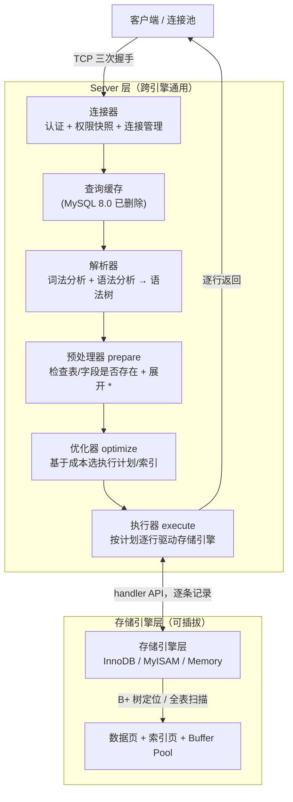

# MySQL - 第 7 课：一条 SELECT 语句的执行流程：连接器、查询缓存、解析器、优化器、执行器

> 前 6 课讲的是「一次 `update` 在底层改了什么、靠什么日志保证不丢不乱」。这一课往回退一步，先把「一条 `select` 从客户端发出到拿到结果，在 MySQL 内部到底走了哪些模块」讲透。它是整套日志/事务故事的骨架：先理解 Server 层和存储引擎层怎么分工，后面 `redo`/`binlog`/MVCC 才有地方挂。

## 学习目标（本节结束后你能做到什么）

- 能画出 MySQL 的两层架构（Server 层 + 存储引擎层），并说清为什么要这样分层。
- 能完整复述一条 `select` 的执行链路：连接器 → 查询缓存（8.0 已删）→ 解析器 → 预处理器 → 优化器 → 执行器 → 存储引擎。
- 知道每个模块「负责什么」「不负责什么」，尤其是「表/字段是否存在」到底在哪一步检查。
- 能从工程视角解释连接管理（长短连接、连接池、`max_connections`、连接内存）在线上为什么是高频故障点。
- 能讲清优化器的成本模型在选什么、为什么会选错、怎么干预。
- 能讲清执行器与存储引擎是「逐行交互」的，并由此理解覆盖索引、回表、索引下推（ICP）下推到了哪里。

## 内容讲解（核心概念，用类比、例子、图示说清楚）

学 SQL 时第一个学的就是查询语句，比如：

```sql
select * from product where id = 1;
```

看着一行就出结果，但 MySQL 内部把它拆成了一条流水线。先上「上帝视角」：



### 0. 先看两层架构：为什么 MySQL 要拆成 Server 层和存储引擎层

MySQL 整体分两层：

- **Server 层**：负责建立连接、解析和执行 SQL。连接器、查询缓存、解析器、预处理器、优化器、执行器都在这里。所有**内置函数**（日期、字符串、加密等）、所有**跨引擎的功能**（存储过程、触发器、视图、binlog）也都在 Server 层。
- **存储引擎层**：负责数据真正怎么存、怎么取。支持 InnoDB、MyISAM、Memory 等多种引擎，**共用同一个 Server 层**。我们平时说的「索引数据结构」是存储引擎层实现的——InnoDB 的主键索引、二级索引默认都是 B+ 树。MySQL 5.5 起 InnoDB 成为默认引擎。

**为什么要这么分？** 这不是为了好看，而是一个非常典型的「稳定接口 + 可替换实现」的工程设计：

- Server 层定义了一套统一的存储引擎接口（`handler` API：打开表、定位第一条记录、读下一条记录、写入、加锁……）。
- 不同引擎只要实现这套接口，就能接到同一个 Server 层上。于是 SQL 语法、连接管理、权限、优化器这些昂贵的通用能力只写一份，引擎可以按场景换：要事务和崩溃恢复用 InnoDB，要纯内存临时表用 Memory。
- **代价**：因为接口是「逐行（记录）」粒度的，Server 层和引擎之间是一行一行地要数据（见 §6）。这在历史上限制了某些向量化/批量执行优化，MySQL 8.0 的新执行器迭代器就是在这条边界上做改进。

> 记一个判断口径：**「这件事是不是所有引擎都该有？」如果是，多半在 Server 层（如解析、优化、binlog）；如果是「数据怎么落盘、怎么加行锁、用什么索引结构」，在引擎层（如 redo log、B+ 树、MVCC 版本链）。** 这条口径能帮你快速回答「binlog 和 redo log 为什么一个在 Server 层一个在引擎层」（见 §交叉引用）。

### 1. 第一步：连接器——建立连接、认证、权限快照、连接管理

要执行 SQL，第一步得连上 MySQL。常见方式：

```bash
mysql -h$host -P$port -u$user -p
```

连接器干三件事：

1. **TCP 三次握手**。MySQL 走 TCP，所以建连本身就有网络往返成本。服务没起会直接报连不上。
2. **认证**。校验用户名 + 密码。错了就 `Access denied for user`，客户端结束。
3. **取权限并做快照**。认证通过后，连接器读取该用户的权限**缓存在这个连接里**。后续这个连接里的所有操作，都基于**连接建立那一刻**读到的权限判断。

第 3 点有个常被问到的结论：

> **一个连接已经建立后，管理员中途改了它的权限，不影响这个已存在的连接；只有新建连接才会用到新权限。** （想立即生效需要对方重连，或 `FLUSH PRIVILEGES` 配合踢连接。）

#### 1.1 认证插件：8.0 默认变了

很多「升级到 8.0 后老客户端连不上」的坑出在这里：

- MySQL 5.7 默认认证插件是 `mysql_native_password`。
- MySQL 8.0 默认改成 `caching_sha2_password`（更安全，但要求客户端/驱动支持，且非 TLS 连接首次认证需要 RSA 交换）。

老驱动连 8.0 报 `Authentication plugin 'caching_sha2_password' cannot be loaded` 时，工程上的正解是升级驱动，而不是无脑把账号降回 `mysql_native_password`。

#### 1.2 看谁连了：`show processlist`

```sql
show processlist;
```

重点看几列：

| 列 | 含义 | 排障价值 |
| --- | --- | --- |
| `Id` | 连接（线程）ID | `kill <id>` 时要用 |
| `Command` | 当前在干什么，`Sleep` 表示空闲 | 一堆 `Sleep` 说明连接被占着没释放 |
| `Time` | 当前状态持续了多少秒 | `Sleep` 且 `Time` 很大 = 长期空闲连接 |
| `State` | 更细的执行阶段 | 慢查询/锁等待排查的关键信号（见第 6 课） |

#### 1.3 空闲连接会被回收吗？连接数有上限吗？

- **空闲回收**：由 `wait_timeout` 控制（非交互连接默认 8 小时 = 28800 秒），超时连接器自动断开；交互式客户端看 `interactive_timeout`。也可手动 `kill connection <id>`。
- **被动感知**：服务端主动断开一个空闲连接后，客户端不会立刻知道，等它下次发请求才会收到 `ERROR 2013 (HY000): Lost connection to MySQL server during query`。**这就是为什么连接池必须有「连接保活/有效性检测」**——否则池子里攥着一堆已被服务端断掉的死连接，业务一用就报错。
- **连接数上限**：`max_connections` 控制（默认常见为 151），超了直接 `ERROR 1040 (HY000): Too many connections`。还有一个 `back_log` 控制 TCP 半连接/未 accept 的排队长度，瞬时风暴时也会影响能不能连上。

#### 1.4 长连接 vs 短连接，以及长连接的内存问题

- **短连接**：每次执行完就断开，下次重新建。简单，但每次都付 TCP 握手 + 认证 + 权限读取的成本。
- **长连接**：连上后复用。省掉重复建连成本，**后端服务基本都用长连接 + 连接池**。

长连接的副作用：MySQL 在执行查询过程中会用一些**会话级内存**（如 `sort_buffer`、`join_buffer`、`read_buffer`、`net_buffer` 等），这些资源很多要等**连接断开**才释放。长连接堆积久了，单个 MySQL 进程内存越涨越大，极端情况下被 OS 的 OOM Killer 杀掉，表现为「MySQL 莫名其妙重启」。

两种缓解方式：

1. **定期断开长连接**：执行了一些大查询、占了大内存后，主动断开重连，靠「断开即释放」回收内存。连接池一般有「连接最大存活时间 / 最大使用次数」配置就是干这个的。
2. **主动重置连接**：MySQL 5.7 提供了 `mysql_reset_connection()` **接口函数**（注意是 C API/驱动接口，不是 SQL 命令）。客户端做完一个大操作后调用它，把连接恢复到「刚建好」的干净状态，**不需要重连、不需要重新认证**，但会清掉会话状态（临时表、用户变量、预处理语句等）。

> **工程视角小结**：连接器看起来「只是登录」，但线上一半的数据库可用性故障跟它有关——连接耗尽（`max_connections`）、连接泄漏（`Sleep` 堆积）、连接池死连接、长连接内存膨胀。排查套路：`show status like 'Threads_connected'` / `Max_used_connections` 看用量，`show processlist` 看谁占着，结合连接池配置（最大连接数、最小空闲、保活探测、最大存活时间）一起看。

连接器小结：TCP 握手 → 认证 → 读权限做快照。

### 2. 第二步：查询缓存——鸡肋且已被删除

SQL 进来后，MySQL 先看第一个关键字判断语句类型。如果是 `select`，**MySQL 8.0 之前**会先查「查询缓存（Query Cache）」：

- 它是个 key-value 内存结构，key 是 SQL 文本，value 是上次这条 SQL 的查询结果。
- 命中就直接返回 value，根本不往下走解析/优化/执行。
- 没命中就继续往下执行，执行完把结果塞进查询缓存。

听起来很美，**但它非常鸡肋**，原因要讲清楚（这是面试高频「为什么 8.0 删掉查询缓存」）：

1. **失效粒度太粗**：缓存失效是**表级**的。只要这张表有**任何**写操作，这张表相关的所有查询缓存全部清空。对更新频繁的表（订单、余额这种核心表）命中率极低——刚缓存一个大结果集还没被用到，一个 `update` 进来就全清了，等于「缓存了个寂寞」。
2. **并发扩展性差**：查询缓存有一把全局大锁（`query_cache_mutex`）。高并发下，读写缓存都要抢这把锁，反而成了瓶颈，并发越高越拖后腿。
3. **收益场景太窄**：只有「读多写极少 + 完全相同的 SQL 文本」才划算，现代业务很难满足。

所以 **MySQL 8.0 直接把查询缓存整个模块删除了**。8.0 起执行 `select` 不再有这一步。8.0 之前想关，可以把 `query_cache_type` 设成 `DEMAND`。

> 易错点：这里说的「查询缓存」是 **Server 层**的、按 SQL 文本缓存「结果」的东西，8.0 删的是它。它和 InnoDB 的 **Buffer Pool** 完全是两码事——Buffer Pool 缓存的是「数据页/索引页」，是存储引擎层的核心组件，一直都在、也不会被删（Buffer Pool 见第 2 课 redo log 那篇）。**别把这两个混为一谈，这是高频踩坑。**
> 现代「查询结果缓存」的正确做法是放到应用层（Redis）或代理层（ProxySQL query cache），由业务自己控制失效，而不是指望数据库内部那个粗粒度缓存。

### 3. 第三步：解析器——词法分析、语法分析、语法树

真正执行前，「解析器」先把 SQL 文本变成结构化的东西，做两件事：

1. **词法分析**：把字符串切成一个个 Token，识别出关键字。比如 `select username from userinfo` 会切成 4 个 Token，其中 `select`、`from` 是关键字：

| 关键字 | 非关键字 | 关键字 | 非关键字 |
| --- | --- | --- | --- |
| select | username | from | userinfo |

2. **语法分析**：按 SQL 语法规则检查这串 Token 是否合法，合法就构建出**语法树（parse tree）**，方便后面模块取出语句类型、表名、字段名、`where` 条件等。

语法不对就在这一步报错。比如把 `from` 写成 `form`，解析器直接报语法错误。

#### 3.1 一个被广泛传错的点：表/字段是否存在，不在解析器做

很多资料（包括《MySQL 45 讲》）说「表不存在、字段不存在是解析器报的」。**实际看 MySQL 5.7 和 8.0 源码，结论是：解析器只负责检查语法、构建语法树，不去查表/字段是否真实存在。**

- MySQL 8.0：表/字段存在性检查在 **prepare（预处理）阶段**，报错发生在 `get_table_share()` 这一类函数里，调用栈属于 prepare 阶段。
- MySQL 5.7：在「词法/语法分析之后、prepare 之前」做。代码结构没 8.0 清晰，所以 8.0 重构后干脆统一挪进了 prepare。

两版结论一致：**不是解析器干的**。这点要记准，面试容易被追问。

> 顺带一个工程相关点：**SQL 注入防御为什么靠预编译（prepared statement）而不是字符串转义。** 预编译时 SQL 模板（带占位符 `?`）会**先经过解析得到固定语法树**，参数后续只作为「值」绑定进去，永远不会被重新当作 SQL 结构解析——所以参数里塞 `' or 1=1 --` 也只是一个普通字符串值，改变不了语法树结构。这正是「解析阶段产出语法树」这件事在安全上的直接价值。

### 4. 第四步之一：预处理器（prepare 阶段）

经过解析器后进入执行 SQL 的流程，分三段：**prepare（预处理）→ optimize（优化）→ execute（执行）**。

预处理器做的事：

1. **检查表、字段是否真实存在**（上面说的，就在这一步；不存在就在 prepare 报错，比如查一张不存在的 `test` 表）。
2. **把 `select *` 的 `*` 展开成表上的所有列**。

第 2 点引出一个生产规范的「为什么」：**为什么阿里规约等都要求线上禁用 `select *`**，不只是「代码风格」：

- `*` 要在 prepare 阶段查元数据展开成全列，多一点解析成本（量小但真实）。
- 取了用不到的列 → 网络传输和内存占用变大。
- **更关键：破坏覆盖索引**。本来一个二级索引就能覆盖查询（不用回表），`select *` 强行要全部列，逼着每行都回表，性能差一个量级（覆盖索引/回表见 §5、§6 和第 6 课）。
- 列结构变更（加列/改列顺序）时，`select *` 的行为会悄悄变，下游代码按位置取列会错位，是脆弱写法。

### 5. 第四步之二：优化器（optimize 阶段）——基于成本选执行计划

预处理之后，要为这条 SQL 定一个**执行计划**，这是「优化器」的活。

**优化器的核心职责：把执行方案确定下来。** 最典型的就是「表上有多个索引时，选哪个索引」。它是**基于成本的优化器（CBO，Cost-Based Optimizer）**——估算每种执行路径的代价，选代价最小的。

#### 5.1 用 `explain` 看优化器选了什么

```sql
explain select * from product where id = 1;
```

- `key = PRIMARY`：走了主键索引。
- `key = NULL`：没走索引，`type = ALL` 全表扫描，效率最低档。

#### 5.2 索引选择的经典例子：覆盖索引

给 `product` 同时有主键索引 `id` 和普通（二级）索引 `name`，执行：

```sql
select id from product where name = 'iphone';
```

这个查询既能走主键索引也能走 `name` 二级索引。优化器会选 `name`：

- 这是**覆盖索引**——要的 `id` 直接在二级索引的 B+ 树叶子节点里就有（InnoDB 二级索引叶子存的就是主键值），不用回主键索引再查一次。
- 回主键索引（聚簇索引）的 B+ 树成本比只查二级索引大，优化器基于成本选代价小的那条路。
- 执行计划里会看到 `key = name`、`Extra = Using index`，`Using index` 就表示用上了覆盖索引优化。

#### 5.3 优化器的成本从哪来，为什么会选错（拓展）

优化器估代价靠两类输入：

- **统计信息**：表/索引的基数（cardinality，索引列大概有多少不同值）、行数等。InnoDB 默认靠**采样若干个索引页**估算（`innodb_stats_persistent_sample_pages` 控制采样页数），结果持久化在统计表里。
- **成本常量**：`mysql.server_cost`、`mysql.engine_cost`（如一次随机页读、一次记录比较的代价），可调但一般别动。

**它会选错索引的常见原因**（和第 6 课的「优化器误选索引」呼应）：

1. **统计信息过旧/不准**：大量增删改后没更新统计，基数估偏。处理：`analyze table <表>` 重新采样。
2. **数据分布严重倾斜**：比如某状态值占 99%，按平均基数估会严重失真。
3. **隐式类型转换 / 对索引列套函数**：让本可用的索引用不上。

干预手段（按优先级）：先 `analyze table`；再调整联合索引让更优路径自然胜出；`optimizer_trace` 看优化器到底怎么算的代价（强排查工具）：

```sql
set optimizer_trace = 'enabled=on';
select * from product where name = 'iphone';
select * from information_schema.optimizer_trace\G
set optimizer_trace = 'enabled=off';
```

实在不行短期用 `force index` / `use index` 兜底，但**不要当长期默认**——它把判断写死，数据分布变了反而更糟。

#### 5.4 多表关联时优化器还在做什么（拓展）

单表很简单，多表 `join` 时优化器还要决定**连接顺序**和**连接算法**：

- **NLJ（Nested-Loop Join）**：被驱动表能走索引时的常规做法。
- **BNL（Block Nested-Loop）**：被驱动表走不了索引时，用 `join_buffer` 批量比较，减少对内表的扫描遍数。
- **Hash Join**：MySQL 8.0.18+ 引入，等值连接且无合适索引时通常比 BNL 快很多，是 8.0 的重要优化。

优化器还会做子查询改写（`in` 子查询改写成 semi-join）、`order by`/`group by` 能否利用索引避免 `filesort`/临时表等——这些都直接决定了第 6 课里看到的 `Extra: Using filesort / Using temporary` 会不会出现。

### 6. 第四步之三：执行器（execute 阶段）——和存储引擎逐行交互

优化器定了执行计划，「执行器」真正执行，并在执行中**和存储引擎通过 `handler` 接口逐条记录交互**。

执行器执行前还会再做一次**权限校验**（执行阶段也会校验，比如列级权限）——别以为权限只在连接器查一次。

下面用三个典型场景说清「执行器 ↔ 存储引擎」的交互模型。

#### 6.1 主键等值查询（const）

```sql
select * from product where id = 1;
```

主键 `id` 唯一、等值查询，优化器选择访问类型 `const`。流程：

1. 执行器第一次查询，调用 `read_first_record` 指针指向的函数。因为访问类型是 `const`，这个指针指向 InnoDB 的索引查询接口，把条件 `id = 1` 交给存储引擎，**让引擎定位符合条件的第一条记录**。
2. 存储引擎用主键索引 B+ 树定位 `id = 1`：不存在就向执行器报「记录找不到」，查询结束；存在就把这条记录返回给执行器。
3. 执行器拿到记录后判断是否满足查询条件，满足就发给客户端，不满足跳过。
4. 执行器查询是个 `while` 循环，会再查一次。因为不是第一次了，调用 `read_record` 指针指向的函数；`const` 访问类型下这个指针被指向「永远返回 -1」的函数，于是执行器退出循环，查询结束。

#### 6.2 全表扫描（ALL）

```sql
select * from product where name = 'iphone';
```

`name` 没索引，优化器选访问类型 `ALL`（全表扫描）。流程：

1. 第一次查询调用 `read_first_record`，`ALL` 下它指向 InnoDB 全表扫描接口，**让引擎读表中第一条记录**。
2. 执行器判断这条记录 `name` 是否等于 `iphone`，不是就跳过；是就发给客户端。
3. `while` 循环再查，调 `read_record`，`ALL` 下它仍指向 InnoDB 全扫描接口，**向引擎要「上一条记录的下一条」**，引擎取出返回，执行器继续判断，符合就发客户端，不符合跳过。
4. 重复，直到引擎把所有记录读完，向执行器返回「读取完毕」。
5. 执行器收到「查询完毕」，退出循环，结束。

> 这个「逐行 pull」模型就是经典的**火山模型（Volcano / iterator model）**：上层不停向下层「要下一条」。它的好处是模型简单、内存占用小、能流式返回；代价是函数调用密集、对 CPU cache 不友好、难以向量化。MySQL 8.0 重写了执行器（统一的迭代器/`EXPLAIN ANALYZE` 就建立在新执行器上），但「Server 层逐行问引擎要数据」这个本质交互边界没变。

> **「客户端为什么是一次性显示全部结果」**：其实 Server 层每从引擎读到一行、判断符合条件，就**立刻往客户端发**了（流式）。客户端看起来「等了一下然后一次性全显示」，是因为客户端默认用 `mysql_store_result` 把整个结果集先收完再展示。如果用 `mysql_use_result`（逐行取），就能边查边处理大结果集而不爆客户端内存——这对导大数据很关键。

#### 6.3 索引下推（ICP）——「下推」到底推到了哪里

放在这里讲 ICP（Index Condition Pushdown，MySQL 5.6 引入）最合适，因为你现在已经清楚「执行器在 Server 层、记录由存储引擎逐条吐上来」，才能精确说清「下推」是把什么动作从 Server 层挪到了引擎层。

例子：用户表，对 `(age, reward)` 建了**联合索引**，查询：

```sql
select * from t_user where age > 20 and reward = 100000;
```

联合索引遇到范围查询 `>`、`<` 就停止继续用后面的列做索引匹配，所以 **`age` 能用上联合索引定位，`reward` 用不上索引**（只能当过滤条件）。

**没有 ICP（5.6 之前）的流程**：

1. Server 层让引擎定位满足 `age > 20` 的第一条二级索引记录。
2. 引擎在二级索引 B+ 树定位到记录，拿到主键值，**立即回表**取完整行，把整行返回 Server 层。
3. Server 层再判断这行 `reward` 是否等于 100000，成立发客户端，不成立跳过。
4. 继续要下一条，重复——**每一条二级索引记录都先回表，再由 Server 判断 `reward`**。

问题：很多行回表取回来后才发现 `reward` 不等于 100000，**回表全白做了**（回表 = 拿主键去聚簇索引再查一次，是随机 IO，很贵）。

**有 ICP 的流程**：

1. Server 层让引擎定位 `age > 20` 的第一条二级索引记录。
2. 引擎定位到二级索引记录后，**先不回表**，而是利用「`reward` 这一列其实就在联合索引里」这个事实，**在引擎层就先判断 `reward = 100000` 是否成立**：不成立直接跳过这条二级索引（零回表）；成立才回表取完整行返回 Server 层。
3. Server 层再判断其他查询条件（本例没有），成立发客户端。
4. 重复直到读完。

收益：`reward` 虽然「用不上索引做定位」，但它**包含在联合索引里**，所以可以在引擎层提前过滤，**省掉大量无谓回表**。

判断是否用了 ICP：执行计划 `Extra` 出现 **`Using index condition`**。

理清三个相邻概念别混：

| 概念 | Extra 标志 | 本质 | 推到哪 |
| --- | --- | --- | --- |
| 覆盖索引 | `Using index` | 要的列索引里全有，**根本不回表** | —（无需下推） |
| 索引下推 ICP | `Using index condition` | 要回表，但**在引擎层先用索引里的列过滤，减少回表次数** | 把过滤下推到引擎层 |
| 普通回表 + Server 过滤 | （无上述标志） | 每条都回表，Server 层再过滤 | 没下推 |

适用与限制（拓展）：ICP 用于二级索引的 `range`/`ref` 访问，且过滤列必须包含在该索引中；不适用于聚簇（主键）索引本身（它的叶子就是整行，没有「回表」可省）。相关的还有 **MRR（Multi-Range Read）**：把二级索引拿到的一批主键先排序再回表，把回表的随机 IO 尽量变顺序 IO，思路同样是「在引擎边界上少做随机 IO」。

### 7. 交叉引用：select 流程和前面 update/日志故事怎么接起来

这一课的价值是给前 6 课搭骨架，几个接口要点：

- **`select` 一般不写 `redo log` / `binlog`**（普通快照读不改数据，没东西要记）。`redo`/`binlog`/两阶段提交是 `update`/`insert`/`delete` 的事（第 2、3、4 课）。这正好印证 §0 的分层口径：binlog 在 **Server 层**（跨引擎、给主从复制用），redo log 在 **InnoDB 引擎层**（保证崩溃恢复）。
- **普通 `select` 走的是「快照读」**，可见性由 MVCC 的 Read View + undo 版本链决定——执行器从引擎读一行时，引擎按当前事务的 Read View 判断该返回哪个历史版本（第 5 课 undo log 与 MVCC）。所以「执行器逐行从引擎取记录」这一步，背后还藏着一次次可见性判断。
- **`select ... for update` / `select ... lock in share mode` 走「当前读」**：执行器让引擎读最新版本并加锁，这就和锁等待、长事务挂上钩（第 6 课锁等待排查）。
- 全表扫描 `type = ALL`、没用上覆盖索引导致回表过多、优化器误选索引——这些在本课是「流程里的一步」，到第 6 课就是「慢查询的具体根因和优化动作」。**本课讲「正常怎么走」，第 6 课讲「走歪了怎么查」。**

## 小结（3-5 条关键点）

- MySQL 两层架构：Server 层（连接器、查询缓存、解析器、预处理器、优化器、执行器、binlog、内置函数）+ 可插拔的存储引擎层（InnoDB 的 B+ 树、MVCC、redo log）。判断口径：「所有引擎都该有」→ Server 层；「数据怎么落盘/加锁/索引结构」→ 引擎层。
- 一条 `select` 链路：连接器（认证 + 权限快照 + 连接管理）→ 查询缓存（8.0 已删，且别和 Buffer Pool 混）→ 解析器（词法/语法分析 + 语法树，**不查表/字段是否存在**）→ 预处理器（**在这查表/字段是否存在** + 展开 `*`）→ 优化器（基于成本选执行计划/索引）→ 执行器（按计划逐行驱动存储引擎）。
- 连接器是线上高频故障点：`max_connections` 耗尽、`Sleep` 连接泄漏、连接池死连接、长连接会话内存膨胀；要会用 `show processlist` + 连接数 status + 连接池配置一起排查。
- 优化器是 CBO，靠统计信息 + 成本常量估代价；选错多因统计过旧/数据倾斜/隐式转换，处理优先级是 `analyze table` → 调索引 →（短期）`force index`，`optimizer_trace` 是利器。
- 执行器与存储引擎是「逐行 pull」（火山模型）；由此理解覆盖索引（`Using index`，不回表）、ICP（`Using index condition`，在引擎层提前过滤减少回表）、普通回表三者的区别——「下推」推的是「过滤动作从 Server 层下到引擎层」。

## 问题（检测用户对当前章节内容是否了解）

1. MySQL 为什么要分 Server 层和存储引擎层？这个分层在 binlog 和 redo log「一个在 Server 层、一个在引擎层」上怎么体现？
2. 「表或字段是否存在」到底是哪个模块检查的？为什么说「解析器报表不存在」是个常见错误说法？
3. MySQL 8.0 为什么直接删掉了查询缓存？它和 InnoDB Buffer Pool 有什么本质区别？
4. 一个已建立的连接，管理员中途改了它的权限会立刻生效吗？为什么？长连接为什么会导致 MySQL 内存膨胀，有哪两种缓解方式？
5. 覆盖索引、索引下推（ICP）、普通回表三者在执行器与存储引擎交互上的区别是什么？分别对应 `Extra` 里的什么标志？「下推」到底把什么动作推到了哪里？
6. 普通 `select` 不写 redo/binlog，那它的「可见性」由谁决定？`select ... for update` 和普通 `select` 在执行器与引擎交互上有什么不同？
