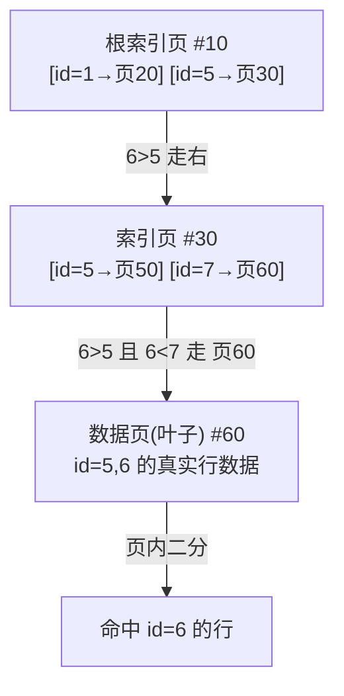

# MySQL - 第 8 课：单表 2000W 行的真相——InnoDB 页结构、B+ 树层高与真正的性能瓶颈

> 第 7 课讲了「执行器逐行向存储引擎要数据，索引是 B+ 树」。这一课把 B+ 树拆开：一个页里到底装了什么、一棵树能装多少行、为什么坊间会传出「单表别超 2000W」这个数字——以及这个数字哪里对、哪里是被误读的。学完你应该能在面试和架构评审里，把「2000W」从一句口号变成一个能推导、能反驳、能落地的判断。

## 学习目标（本节结束后你能做到什么）

- 能说清 InnoDB 表数据在磁盘上的组织：表空间 → 页（16K）→ 行；以及页内 7 个组成部分各自干什么。
- 能从零推导「一棵 3 层 B+ 树大约能放多少行」，并解释 2000W 这个数字是怎么来的。
- 能指出这个推导的隐含前提（主键类型、单行大小、页内开销），并据此说明 2000W 不是常量、而是 (主键大小, 行大小) 的函数。
- 能讲清「大表查询变慢」的真正原因——通常不是行数本身，也不只是树高，而是工作集放不进 Buffer Pool、二级索引回表随机 IO 等。
- 能给出一套判断「该不该拆表/怎么拆」的工程方法，而不是一看到 2000W 就分库分表。

## 内容讲解（核心概念，用类比、例子、图示说清楚）

后端圈流传几句「名言」：

- 「MySQL 单表最好别超过 2000W」
- 「单表超 2000W 就要考虑数据迁移了」
- 「你这表快到 2000W 了，难怪查询慢」

听得多，验证得少。下面先把这个数字怎么来的推导一遍，再把它「证伪」一遍。

### 0. 先给实验泼盆冷水：别被一条曲线骗了

常见做法是：建表，用 `rownum` 伪列 + 翻倍插入（连续执行 20 次 ≈ 2^20 ≈ 100w，23 次 ≈ 800w），一路插到几千万，然后画「数据量 vs 查询耗时」曲线，看到 2000W 处耗时陡升，于是「实锤了」。

这种实验**只能当线索，不能当结论**，原因（呼应第 6 课「没有真实环境的数字只是线索」）：

- **环境不隔离**：原文作者自己也说，机器同时跑着 IDE、浏览器，不是干净的数据库环境。
- **没有预热 / 冷缓存**：数据量越大，越装不进 Buffer Pool，冷查询必然走磁盘 IO，曲线陡升很可能是「Buffer Pool 命中率掉下去了」，而不是「行数到了某个魔法阈值」。
- **单一配置 / 单一 SQL**：`innodb_buffer_pool_size`、行大小、查询是点查还是范围、有没有走覆盖索引，都会让这条曲线长得完全不一样。

> 插一个实验中常见报错：插到 800w/1000w 时报 `The total number of locks exceeds the lock table size`。这不是「表到上限了」，而是**单个事务一次性插入太多行、持有的行锁/临时空间超限**。正解是**分批提交**（每几万行 commit 一次），而不是只会去调大参数。这点本身就说明「大批量单事务」是个独立问题，和「单表上限」无关（大事务危害见第 5 课 undo 堆积）。

带着怀疑，我们看 2000W 到底怎么推出来的。

### 1. 单表行数的理论上限：先被主键卡住

先问极端问题：一张表理论上最多多少行？最先卡你的是**主键取值范围**（自增主键唯一，主键能取多少个值，表就最多多少行）：

- 主键 `int`（32 位，有符号）：约 2^31-1 ≈ 21 亿。
- 主键 `unsigned int`：约 2^32-1 ≈ 42 亿。
- 主键 `bigint`：2^63-1 ≈ 922 亿亿，按一秒插一条要几千亿年——**现实中数据库早就因为别的原因撑不住了，根本碰不到这个上限**。

所以「2000W」显然不是理论上限（差了好几个数量级），它是一个**性能层面的经验推荐值**。要理解它，得进到 InnoDB 的存储结构里。

### 2. 表空间 → 页：数据在磁盘上长什么样

下面都基于 InnoDB（B+ 树索引）。

一张表的数据存在一个 `表名.ibd`（InnoDB Data）文件里，叫**表空间**。逻辑上记录是一条接一条的，但物理上它被切成很多**数据页（page）**，每页默认 **16K**（由 `innodb_page_size` 决定，可设 4K/8K/16K/32K/64K，绝大多数生产是默认 16K）。

```mermaid
flowchart TD
    TS["表空间 person.ibd"] --> P1["页 #1 (16K)"]
    TS --> P2["页 #2 (16K)"]
    TS --> P3["页 #3 (16K)"]
    TS --> Pn["页 #n (16K)"]
    P1 -. FIL_PAGE_NEXT/PREV 双向链表 .-> P2
    P2 -. .-> P3
    P3 -. .-> Pn
```

> 关键补充（原文没强调）：同一层的页之间用 `FIL_PAGE_PREV` / `FIL_PAGE_NEXT` 串成**双向链表**。这就是为什么**范围查询（`where id between ... ` / `order by 主键`）很高效**——定位到起点叶子页后，顺着链表往下扫即可，不用每次从根节点重新查。第 7 课说的「全表扫描 type=ALL」本质就是顺着叶子链表把页一个个读出来。页在磁盘上不一定连续，链表保证了逻辑有序。

### 3. 页的内部结构：16K 不是全用来装数据

一个 InnoDB 数据页大致分 7 部分：

| 组成部分 | 大小 | 作用 |
| --- | --- | --- |
| File Header | 38 B | 页号、上一页/下一页指针（双向链表就靠它）、页类型、校验和 |
| Page Header | 56 B | 本页记录数、Free Space 指针、PAGE_LEVEL（**层高就看这个**）等 |
| Infimum + Supremum | 26 B | 两条虚拟边界记录（最小/最大），记录链表的头尾哨兵 |
| User Records | 不定 | **真正存我们插入的行**（按行格式存储） |
| Free Space | 不定 | 尚未使用的空间，插一行就从这里划一块给 User Records |
| Page Directory | 不定 | 页内「槽（slot）」，支持页内**二分查找**而不是逐行扫 |
| File Trailer | 8 B | 校验和 + LSN，配合 File Header 校验页是否写坏（半页写问题） |

要点：

- 页刚生成时没有 User Records，每插一行从 Free Space 划一块过去；Free Space 用完，这一页就满了，要申请新页。
- **固定开销大约 1K 左右**（File Header + Page Header + 哨兵 + 页目录等），所以 16K 里**真正能放数据/索引项的约 15K**。这个「15K」是后面所有推导的基础。
- Page Directory 让页内查找是 O(log n) 二分，而不是 O(n) 逐行——所以「把一页加载进内存逐条比对」其实页内也是二分的，但跨页找哪一页，得靠索引。

### 4. 索引页 vs 数据页：结构一样，存的东西不同

索引页和数据页结构几乎一样，也是 16K。区别只在 User Records 里存什么：

- **数据页（叶子节点，PAGE_LEVEL = 0）**：存**完整的行数据**，按主键有序。
- **索引页（非叶子节点，PAGE_LEVEL > 0）**：存 **(子页中最小主键 id, 子页页号)** 这样的「目录项」，外加层级信息。

页与页因此有了上下层级 → 这就是 **B+ 树**：最底层 PAGE_LEVEL=0 是叶子（存数据），上面都是非叶子（存目录）。

查找 `id = 6` 的过程（3 层、为简化画成 2 分叉，实际是 M 分叉）：



- 非叶子节点存「最小 id + 页号」，从根开始按区间往下走（类似二分）。
- 3 个页（根、中间、叶子）若都不在 Buffer Pool，**最多 3 次磁盘 IO** 就能定位一行。
- 这就解释了第 7 课「主键等值查询 const，存储引擎用 B+ 树定位第一条记录」内部到底做了什么。

### 5. 推导「一棵树能放多少行」：2000W 是这么来的

设：

- `x` = 一个**非叶子页**能放多少个目录项（即扇出 / 分叉数）
- `y` = 一个**叶子页**能放多少行真实数据
- `z` = B+ 树层数

那么这棵树叶子总数 = `x^(z-1)`，每个叶子放 `y` 行，**总行数 Total = x^(z-1) × y**。

**算 x（非叶子扇出）**：可用空间约 15K。非叶子目录项 = 主键 + 子页号。主键设 `bigint`(8B)，页号固定 4B，约 **12B/项**。

```
x ≈ 15 × 1024 / 12 ≈ 1280
```

**算 y（叶子行数）**：可用空间同样约 15K。叶子存真实行，受字段类型/数量影响很大。**先按单行 1K 估**：

```
y ≈ 15 × 1024 / 1000 ≈ 15
```

代入 `Total = x^(z-1) × y`，x=1280，y=15：

| 层数 z | Total | 量级 |
| --- | --- | --- |
| 2 | 1280^1 × 15 = 19,200 | ≈ 1.9W |
| **3** | **1280^2 × 15 = 24,576,000** | **≈ 2.45kw（这就是 2000W 的出处）** |
| 4 | 1280^3 × 15 ≈ 31,457,280,000 | ≈ 314 亿 |

**结论**：在「主键 bigint + 单行约 1K」这组前提下，B+ 树正好在 **3 层**时装到约 2400W 行。再多就要长到 4 层。一般 B+ 树层数最多就 3 层（4 层 Total 三百多亿，既碰不到又多一次 IO），所以「3 层」被当成合理上限，对应的行数约 2000W——**坊间的「2000W」就是这么推出来的**。

### 6. 把这个数字「证伪」：2000W 不是常量，是一个函数

推导没错，但**「2000W」是一堆假设的产物**，换个前提结论就变。这是这一课最该带走的认知。

#### 6.1 它强依赖「单行多大」

把单行从 1K 改成 5K：一页只能放 `15×1024/5000 ≈ 3` 行，y=3。

```
z=3 时 Total = 1280^2 × 3 ≈ 4,915,200 ≈ 近 500W
```

行越大，y 越小，**同样 3 层能装的行数越少**。所以一张窄表（几个 int/小 varchar）3 层能装远超 2000W；一张宽表（很多列、长文本）可能 500W 就 3 层满了。**「2000W」对应的其实是「单行约 1K」这个隐含场景。**

#### 6.2 它强依赖「主键多大」

x 是按主键 bigint(8B) 算的。如果主键是 `UUID`/`varchar(36)`（36+ 字节）甚至更长：非叶子目录项变大 → x 变小（比如从 1280 掉到几百）→ **同样 3 层能放的行数断崖式下降**，树也更容易长到 4 层。

> 这就是为什么强烈建议**用自增 bigint 做主键、别用长字符串/UUID 做聚簇索引主键**：不只是「插入有序减少页分裂」，还直接决定了 B+ 树的扇出和层高。这一点把第 7 课「优化器/索引选择」和本课「容量推导」连了起来。

#### 6.3 行格式与大字段会改变 y

`y` 的估算还和**行格式**（`COMPACT`/`DYNAMIC`，5.7+ 默认 DYNAMIC）有关：

- 每行除了你的字段，还有**隐藏列**：`DB_TRX_ID`(6B)、`DB_ROLL_PTR`(7B)、以及没主键时的 6B rowid——这些就是第 5 课 MVCC 版本链用的，**它们也占叶子页空间**。
- `TEXT`/`BLOB`/超长 `VARCHAR` 在 DYNAMIC 行格式下**溢出到额外的 overflow 页**，行内只留 20 字节指针 → 行变「短」，y 变大，但代价是读这些大字段要**多一次 overflow 页 IO**。

所以宽表把大字段拆出去（垂直拆分）能提高 y、压低树高，但要权衡多一次 IO。

**一句话**：`Total = x^(z-1) × y`，而 `x` 看主键大小，`y` 看单行大小+行格式。**2000W 是「bigint 主键 + 约 1K 行 + 3 层」的特解，不是普适常量。**

### 7. 更狠的一刀：树高高一层，真的是性能悬崖吗？

就算树从 3 层长到 4 层，「查询急剧变慢」也基本是误读。算一笔账：

- 根页只有 1 个，第二层页数也很少（1280 个以内），它们是**最热的页**，几乎永远常驻 Buffer Pool。
- 所以一次主键点查，真正可能产生磁盘 IO 的，**通常只有最后那个叶子页**。3 层树 ≈ 1 次叶子 IO，4 层树 ≈ 多一次中间页 IO（且中间页大概率也在内存）。**多一层 ≈ 多最多一次 IO，不是雪崩。**

那大表查询变慢的**真正原因**是什么？（这部分是工程重点，呼应第 6 课慢查询根因）

| 真正瓶颈 | 机理 | 和行数的关系 |
| --- | --- | --- |
| **工作集 > Buffer Pool** | 热数据/索引装不进 `innodb_buffer_pool_size`，查询频繁穿透到磁盘随机 IO | 行数大只是「更容易触发」，根因是内存 vs 工作集比例 |
| **二级索引回表随机 IO** | 二级索引叶子存的是主键，非覆盖查询要拿主键再回聚簇索引查一遍（再走一棵 3 层树） | 表越大、回表命中冷页概率越高（呼应第 7 课 §6.3 ICP/回表） |
| **单行过大 / 大字段** | y 变小，扫同样行数要读更多页；overflow 页额外 IO | 直接拉低有效容量 |
| **写放大 / 页分裂 / 碎片** | 非顺序主键插入、频繁更新导致页分裂、空洞，页利用率下降 | 长期写入的大表更明显 |
| **统计信息不准 → 优化器误选** | 大表采样偏差大，索引选错（呼应第 7 课 §5.3、第 6 课优化器误选） | 数据分布倾斜时更严重 |
| **长事务 / undo 堆积** | 大表上长事务让 undo 链变长，purge 跟不上（第 5 课） | 与行数弱相关，与事务习惯强相关 |
| **大表 DDL 代价** | 加索引/改列在 2000W+ 表上是重操作，可能锁表/长时间 | 行数越大越痛，这才是「迁移/拆表」的真实驱动之一 |

> 真正该记住的结论：**「2000W」的价值不在那个数字，而在它提醒你「B+ 树该控制在 3 层、工作集该装进内存、二级索引回表别失控」。** 一张主键 bigint、行不大、访问模式以主键/覆盖索引点查为主的表，几千万甚至上亿都未必慢；一张宽表 + 长主键 + 大量非覆盖二级索引查询，几百万就可能开始难受。

### 8. 工程落地：怎么判断「该不该拆」「怎么拆」

不要一看到接近 2000W 就分库分表（过早分库分表带来的分布式事务、跨片 join、扩容复杂度，代价极高）。判断顺序：

1. **先看证据，别看行数**（完全复用第 6 课 SOP）：P99 是否真的劣化？慢日志 `Rows_examined`、`EXPLAIN` 的 `type/key/rows/Extra`、Buffer Pool 命中率（`Innodb_buffer_pool_read_requests` vs `Innodb_buffer_pool_reads`）。
2. **估算树高**：粗算 `表空间大小 / 16K` ≈ 总页数，反推层级；或用 `information_schema.innodb_buffer_page`、`SHOW TABLE STATUS`、`innodb_ruby` 等看 PAGE_LEVEL。层高没涨、命中率还高 → 多半不用拆。
3. **先做便宜的优化**：扩 `innodb_buffer_pool_size`（让索引/热数据进内存，常立竿见影）；优化主键（bigint 自增）；为高频查询做覆盖索引减少回表（第 7 课）；垂直拆分把大字段/冷字段移出主表抬高 y。
4. **再考虑结构性手段（由轻到重）**：冷数据归档/历史表 → 分区表（按时间/范围，对应用透明）→ 读写分离分担读压力 → 最后才是分库分表。
5. **拆的依据是访问模式，不是行数**：是写热点还是读热点？点查为主还是范围/聚合为主？有没有天然分片键（user_id / 租户）？没有清晰分片键时硬拆，往往比不拆更糟。

## 小结（3-5 条关键点）

- InnoDB 数据按「表空间 → 页(默认 16K) → 行」组织；页有 7 部分，固定开销约 1K，可用约 15K；同层页用双向链表串起来，所以范围扫描/全表扫描高效。
- B+ 树非叶子页存「最小主键 + 页号」（PAGE_LEVEL>0），叶子页存完整行（PAGE_LEVEL=0）；点查最多 IO 次数 ≈ 树层数。
- `Total = x^(z-1) × y`：x（非叶子扇出）≈ 1280（bigint 主键），y（叶子行数）≈ 15（1K 行）；3 层 ≈ 2400W——**这就是「2000W」的出处**。
- 2000W 不是常量，是 `(主键大小, 单行大小, 行格式)` 的函数：行 5K → 3 层只能装约 500W；长主键会让扇出骤降、树更高。
- 大表慢的真正原因通常不是行数本身、也不只是树高（多一层≈多最多一次 IO），而是工作集放不进 Buffer Pool、二级索引回表随机 IO、大行、写放大、优化器误选——判断该不该拆要看证据和访问模式，不是看数字。

## 问题（检测用户对当前章节内容是否了解）

1. 一个 16K 的 InnoDB 页，为什么真正能放数据的只有约 15K？File Header 里的什么字段让范围查询能顺着叶子页扫下去？
2. 完整推导一遍：x、y、z 各代表什么，2000W 是怎么从 `Total = x^(z-1) × y` 算出来的？这个推导隐含了哪两个关键前提？
3. 如果把主键从 `bigint` 换成 `varchar(36)` 的 UUID，对 x、树高、单表建议行数分别有什么影响？为什么推荐自增 bigint 主键？
4. B+ 树从 3 层长到 4 层，查询真的会「急剧变慢」吗？为什么说真正的瓶颈通常不是树高？请至少说出三个比「行数」更本质的大表性能瓶颈。
5. 一张表快到 2000W 了，按本课的方法，你会按什么顺序判断「要不要拆、怎么拆」？为什么不建议一上来就分库分表？
