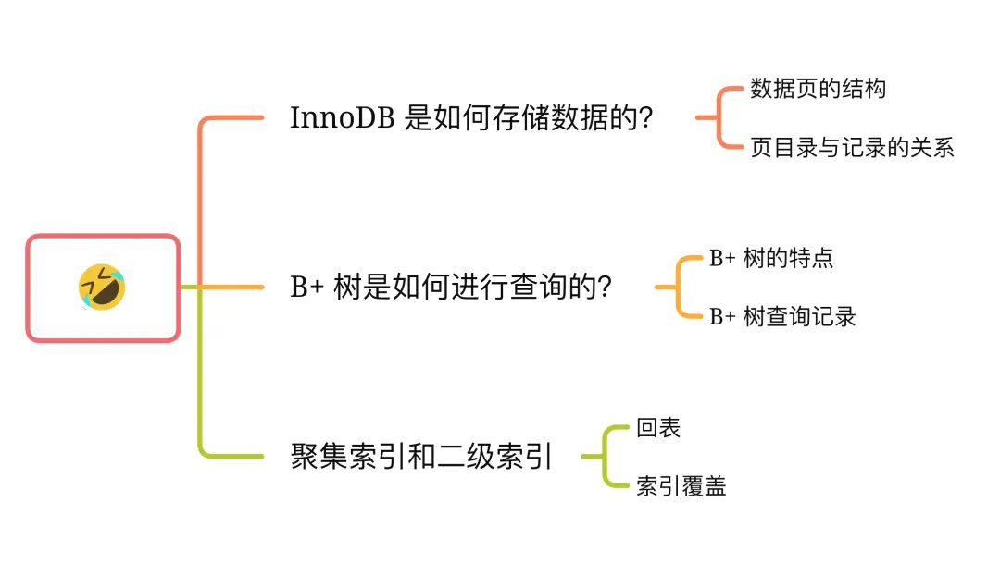
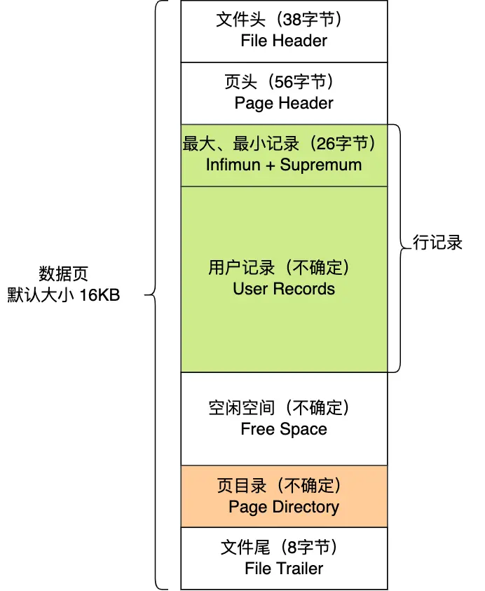
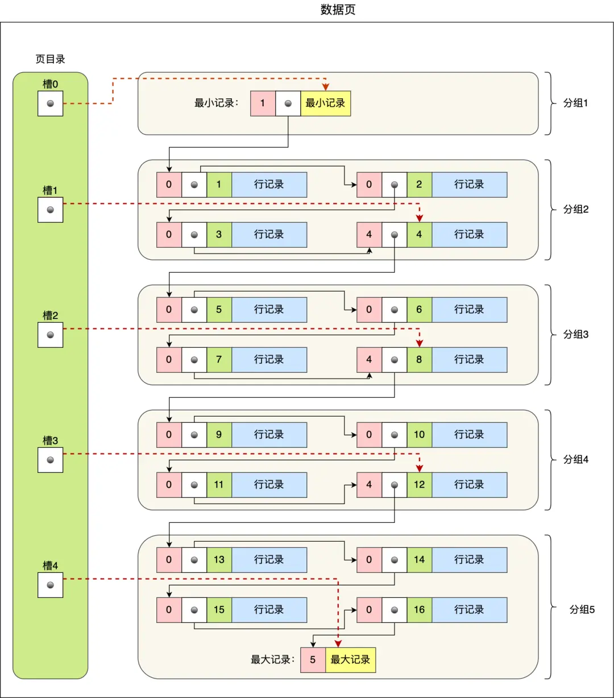
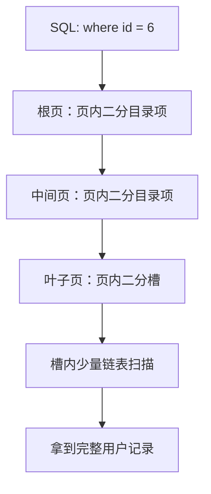
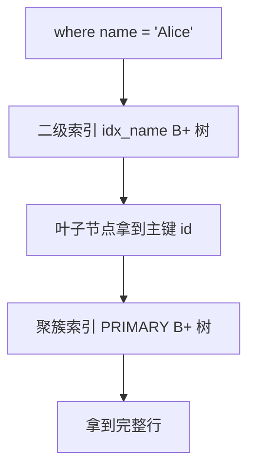

# MySQL - 第 11 课：从数据页角度看 B+ 树：页目录、槽、聚簇索引与回表

> 前面几课已经讲过 SELECT 执行流程、慢查询排查、B+ 树层高、联合索引和索引失效。这一课换一个视角：不要把 B+ 树想成教材里抽象的圆圈和箭头，而要把它还原成 InnoDB 真正读写的单位：**数据页**。一棵 InnoDB B+ 树里的每个节点，本质上都是一个 16KB 左右的页；页内有页目录，页与页之间有链表，叶子页和非叶子页存的内容不同。把这件事想透，回表、覆盖索引、范围查询、页分裂、主键选择都会变得很自然。

## 学习目标（本节结束后你能做到什么）

- 能从「数据页」而不是抽象节点的角度解释 InnoDB B+ 树。
- 能说清一个 InnoDB 页的 7 个部分分别负责什么。
- 能解释页内记录为什么既是单向链表，又可以通过页目录和槽做二分定位。
- 能完整讲出一次主键查询如何从根页走到叶子页，再在页内找到记录。
- 能区分聚簇索引和二级索引的叶子节点分别存什么，并解释回表和覆盖索引。
- 能把 B+ 树页结构和真实优化建议联系起来：主键设计、联合索引、减少回表、避免大字段污染热页。



## 内容讲解（核心概念，用类比、例子、图示说清楚）

很多人背 MySQL 八股时，能很快说出：

- InnoDB 用 B+ 树组织索引。
- 聚簇索引叶子节点存整行数据。
- 二级索引叶子节点存主键值。
- 查询二级索引后可能要回表。

这些话都对，但它们有一个共同问题：太像结论，脑子里没有画面。

这一课要建立的画面是：

**InnoDB 的 B+ 树不是飘在空中的抽象结构，而是由一个个数据页组成的。页是磁盘和内存之间搬运数据的基本单位；B+ 树的每个节点，就是一个页。**

### 1. InnoDB 不是按行读写，而是按页读写

表面上看，数据库存的是一行行记录：

```sql
select * from user where id = 11;
```

你可能会直觉地以为，MySQL 会从磁盘上只读出 `id = 11` 这一行。

实际不是。

InnoDB 的基本读写单位是页（page）。默认情况下，一个数据页大小是 **16KB**。也就是说：

- 查一行时，如果目标页不在 Buffer Pool，InnoDB 会把整个 16KB 页读进内存。
- 修改一行时，先改 Buffer Pool 里的页，形成脏页。
- 刷盘时，也通常以页为单位把内容写回磁盘。

这就是为什么前面讲 redo log 时反复说：事务提交时不应该直接刷真实数据页。因为哪怕只改几个字节，也可能要处理整个 16KB 页，成本很高。

所以理解 InnoDB 索引之前，先记住一句话：

**行是逻辑记录，页才是 InnoDB 和磁盘打交道的基本单位。**

### 2. 一个数据页长什么样

一个典型 InnoDB 数据页包含 7 个部分：




可以先按「页的外壳」「页内记录」「页内索引」三层来记。

| 部分 | 作用 | 你需要抓住的重点 |
| --- | --- | --- |
| File Header | 文件头，记录页号、上一页/下一页、页类型、校验信息等 | 页与页之间的双向链表，主要靠这里的指针 |
| Page Header | 页头，记录本页状态，如记录数、空闲空间位置、页层级等 | `PAGE_LEVEL` 可以理解这个页处在 B+ 树哪一层 |
| Infimum + Supremum | 两条虚拟记录，分别表示页内最小和最大边界 | 它们不是用户数据，是页内记录链表的哨兵 |
| User Records | 用户真实记录 | 叶子页里是完整行，非叶子页里是目录项 |
| Free Space | 空闲空间 | 新插入记录会从这里分配空间 |
| Page Directory | 页目录 | 页内二分查找靠它，不用从头扫完整个页 |
| File Trailer | 文件尾 | 用于校验页是否完整，防止页写坏 |

这里最值得注意的是两个东西：

1. **File Header 里的上一页/下一页指针**：它让同一层的数据页可以逻辑连续。
2. **Page Directory 页目录**：它让一个页内部也可以快速定位记录。

也就是说，InnoDB 不只是在「树层级」上做索引，它在每个页内部还做了一层很小的页内索引。

### 3. 页与页之间：物理不连续，逻辑连续

InnoDB 页之间不要求在磁盘上物理连续。

如果要求物理连续，每次页分裂、插入、删除都会非常痛苦。更现实的做法是：页可以散落在表空间文件的不同位置，但通过指针串起来。


File Header 中的两个指针可以把同一层页组织成双向链表：

- 前一个页。
- 后一个页。

这带来两个非常关键的结果：

1. **范围查询高效**：定位到起始叶子页后，可以顺着叶子页链表往后扫。
2. **物理布局更灵活**：页不需要挨在一起，只需要逻辑顺序正确。

例如：

```sql
select *
from orders
where id between 1000 and 2000;
```

执行时不是对每个 id 都从根节点重新查一遍，而是：

1. 先从 B+ 树根页定位到 `id >= 1000` 所在的叶子页。
2. 在该页内找到起始记录。
3. 顺着叶子页链表继续向后扫描，直到超过 2000。

这就是 B+ 树特别适合范围查询的原因之一。

### 4. 页内记录：按键有序，但记录之间是单向链表

在一个数据页内部，用户记录会按照索引键顺序组织。

如果是聚簇索引叶子页，记录按主键顺序排列。

如果是二级索引叶子页，记录按二级索引键排序；二级索引键相同的时候，再按主键排序，因为 InnoDB 需要让二级索引项也能唯一定位。

但注意：页内记录并不是一个普通数组，而是通过记录头里的 `next_record` 之类的信息串成单向链表。

单向链表的好处是：

- 插入、删除局部调整方便。
- 删除记录时可以先标记删除，后续再清理。
- 页内记录移动时，不需要像数组那样大范围搬迁。

坏处也明显：

- 如果只靠链表查找，最坏要从头扫到尾。

一个 16KB 页虽然不大，但如果每次页内都线性扫描，还是浪费。于是 InnoDB 又设计了页目录。

### 5. 页目录和槽：页内的小索引

页目录（Page Directory）可以理解成一个页内部的索引目录。

它不是 SQL 层面 `create index` 创建出来的索引，而是 InnoDB 每个页内部自带的查找结构。



页目录的构造方式可以这样理解：

1. InnoDB 把页内记录分成多个组。
2. 每组最后一条记录，是这一组里索引键最大的记录。
3. 这一条记录的记录头里会记录该组拥有多少条记录，也就是 `n_owned`。
4. 页目录保存每组最后一条记录在页内的偏移量。
5. 每个偏移量就是一个槽（slot）。

所以：

**槽不是直接指向每组第一条记录，而是指向每组最后一条记录。**

这点一开始有点反直觉，但它配合记录链表可以完成快速定位。

InnoDB 对每组记录条数也有约束：

- 第一个分组通常只有 1 条记录，也就是最小虚拟记录。
- 最后一个分组通常有 1 到 8 条记录。
- 中间分组通常有 4 到 8 条记录。

这样一来，即使定位到某个槽之后还要在组内线性遍历，最多也只是扫几条记录，不会退化成扫完整页。

### 6. 页内查找过程：先二分槽，再扫组内几条记录

假设页目录里有 5 个槽：

- 槽 0。
- 槽 1。
- 槽 2。
- 槽 3。
- 槽 4。

每个槽指向所在分组的最大记录。现在要找主键 `id = 11`。

过程大致是：

1. 对槽数组做二分，先看中间槽。
2. 如果中间槽指向的最大主键小于 11，说明目标在更靠后的槽。
3. 如果某个槽指向的最大主键大于等于 11，说明目标可能在这个槽对应的分组里。
4. 找到目标槽后，需要找到这个分组的第一条记录。
5. 因为槽指向的是组内最大记录，所以要借助前一个槽指向的记录。
6. 前一个槽对应记录的下一条记录，就是当前分组的第一条记录。
7. 从这里开始顺着单向链表扫几条，找到 `id = 11`。

把它抽象一下：

```text
页内查找 = 对槽数组二分 + 对槽内小分组线性扫描
```

所以一个页内部不是简单的 O(n) 链表遍历，而更接近：

```text
O(log 槽数 + 组内少量扫描)
```

这也是为什么 InnoDB 能把「页」作为 B+ 树节点：页内部已经有一套足够高效的查找机制。

### 7. B+ 树节点其实就是数据页

现在进入 B+ 树。

很多图里会把 B+ 树画成一个个圆圈节点，但在 InnoDB 里，这些节点本质上都是页。

一个 B+ 树可以这样看：

- 根节点是一个页。
- 中间非叶子节点是一个页。
- 叶子节点也是一个页。

区别只在于页里的 User Records 存什么。

| 页类型 | 位置 | User Records 存什么 |
| --- | --- | --- |
| 非叶子页 | 根节点或中间层 | 目录项，比如「最小键值 + 子页页号」 |
| 叶子页 | 最底层 | 聚簇索引里存完整行；二级索引里存二级索引键 + 主键 |

非叶子页里的目录项，可以粗略理解成：

```text
(key, child_page_no)
```

其中 `key` 表示某个子页能覆盖的最小键值，`child_page_no` 表示应该跳到哪个子页。

所以从根页往下找，本质就是：

1. 在当前页里通过页目录快速找到目标 key 应该落入哪个目录项区间。
2. 根据目录项拿到下一层子页页号。
3. 读入下一层页。
4. 重复这个过程，直到叶子页。

### 8. 主键查询：从根页到叶子页，再到页内记录

看一个主键查询：

```sql
select *
from user
where id = 6;
```

如果 `id` 是主键，那么它走的是聚簇索引。


查询过程可以拆成两层：

第一层是跨页定位：

1. 从根页开始。
2. 在根页的页目录里二分，找到 `id = 6` 应该去哪个子页。
3. 进入下一层非叶子页。
4. 继续在该页内二分目录项，找到目标叶子页。
5. 进入叶子页。

第二层是页内定位：

1. 在叶子页的 Page Directory 中二分槽。
2. 定位到目标记录所在分组。
3. 在组内顺着记录链表扫几条。
4. 找到 `id = 6` 的完整行。

可以画成这个链路：



这里有一个很重要的工程补充：

**B+ 树有几层，不等于每次查询就一定发生几次磁盘 I/O。**

因为根页和上层非叶子页访问频率非常高，通常会常驻 Buffer Pool。真实点查里，最可能发生磁盘 I/O 的往往是叶子页。

所以大表变慢时，不能机械地说「B+ 树层数高了」。更常见的根因是：

- 热数据页放不进 Buffer Pool。
- 二级索引回表造成大量随机读。
- 查询不是点查，而是扫描了很多叶子页。
- `select *` 让每次回表都要读很宽的行。

这和第 8 课讲的「单表 2000W 不是魔法线」是同一个逻辑。

### 9. 为什么 InnoDB 选择 B+ 树

理解了页之后，B+ 树的优势会更具体。

#### 9.1 比二叉树更矮

磁盘 I/O 很贵，所以数据库索引最怕树太高。

二叉树每个节点最多两个孩子，数据一多，树高很容易上去。

B+ 树一个非叶子页可以存很多目录项。一个 16KB 页里，如果每个目录项只是「主键 + 页号」，一个页可以指向上千个子页。

这叫扇出大。

扇出大意味着：

```text
同样数据量下，B+ 树更矮，需要访问的页更少
```

#### 9.2 比 B 树更适合磁盘页

B 树的非叶子节点也可能存真实数据。

B+ 树把真实数据都放在叶子节点，非叶子节点只放目录项。这样非叶子页可以塞更多目录项，扇出更大，树更矮。

对数据库来说，非叶子节点越小越好，因为它们是导航层，应该尽可能多地留在内存里。

#### 9.3 比 Hash 更适合范围查询

Hash 等值查询很快，但天然不适合范围查询和排序。

B+ 树的叶子页按键有序，并且用双向链表连接，所以：

```sql
where id between 1000 and 2000
order by id
```

这类查询可以定位起点后顺序扫叶子页。

这也是为什么 InnoDB 的主力索引结构是 B+ 树，而不是 Hash。

### 10. 聚簇索引：叶子节点存完整行

聚簇索引的关键定义是：

**叶子节点存放完整的用户记录。**

所以 InnoDB 表本身可以理解成一棵按聚簇索引键组织的 B+ 树。更准确地说，InnoDB 表是 index-organized table，数据不是另存一份再挂索引，而是直接存在聚簇索引的叶子页里。

InnoDB 选择聚簇索引键的规则是：

1. 如果表有主键，就用主键作为聚簇索引键。
2. 如果没有主键，就选择第一个不允许 NULL 的唯一索引。
3. 如果前两个都没有，InnoDB 会生成一个隐藏的自增 row id。

因此：

- 一张 InnoDB 表一定有聚簇索引。
- 一张表只能有一个聚簇索引。
- 因为完整数据只存一份，不可能同时按多个物理顺序聚簇存放。

主键选择会深刻影响聚簇索引：

| 主键选择 | 影响 |
| --- | --- |
| 自增 bigint | 插入大多发生在右侧叶子页，页分裂较少，目录项也小 |
| UUID / 长字符串 | 主键大，非叶子目录项变大，二级索引也变大，随机插入更容易页分裂 |
| 业务可变字段 | 更新主键等于移动记录，非常不适合作聚簇索引键 |

这就是为什么很多工程规范都会建议：

**InnoDB 表尽量使用短小、稳定、递增的主键。**

### 11. 二级索引：叶子节点存主键值

为了支持非主键字段快速查询，我们会建立二级索引。

比如：

```sql
create index idx_name on user(name);
```

这时 InnoDB 会为 `name` 维护另一棵 B+ 树。


二级索引和聚簇索引结构都叫 B+ 树，但叶子节点存的东西不一样。

| 索引类型 | 叶子节点存什么 |
| --- | --- |
| 聚簇索引 | 完整用户记录 |
| 二级索引 | 二级索引键 + 主键值 |

为什么二级索引叶子节点不直接存完整行？

因为完整行如果在每个二级索引里都存一份，会造成巨大冗余：

- 一个表可以有多个二级索引。
- 如果每个二级索引叶子页都存完整行，数据会被复制很多份。
- 更新一列时，还可能要维护很多份完整行。

所以 InnoDB 的选择是：

**二级索引负责快速找到主键，真正完整数据仍然回到聚簇索引拿。**

### 12. 回表：先查二级索引，再查聚簇索引

假设有表：

```sql
create table user (
  id bigint primary key,
  name varchar(64),
  age int,
  city varchar(64),
  index idx_name(name)
);
```

查询：

```sql
select *
from user
where name = 'Alice';
```

如果优化器选择 `idx_name`，执行过程是：

1. 在 `idx_name` 这棵二级索引 B+ 树中查 `name = 'Alice'`。
2. 在二级索引叶子节点中拿到对应主键 `id`。
3. 再拿着 `id` 去聚簇索引 B+ 树查完整行。

第 3 步就是回表。

用图表示：



所以回表的本质是：

```text
一次二级索引查询 + 一次聚簇索引查询
```

如果命中很多行，就可能产生大量随机读。

这也是慢查询中经常看到的问题：

- 二级索引确实用上了。
- `rows` 预估也不算特别离谱。
- 但因为查询 `select *`，每一条都要回表。
- 如果聚簇索引叶子页不在 Buffer Pool，随机 I/O 会非常重。

### 13. 覆盖索引：只查一棵二级索引就够了

再看一个查询：

```sql
select id
from user
where name = 'Alice';
```

这个查询只需要 `id`。

而二级索引 `idx_name(name)` 的叶子节点本来就存了：

```text
name + id
```

所以 InnoDB 查到二级索引叶子节点后，已经拿到了所有需要的数据，不必再回聚簇索引。

这叫覆盖索引。

再比如：

```sql
create index idx_name_age on user(name, age);
```

查询：

```sql
select id, name, age
from user
where name = 'Alice';
```

二级索引叶子节点里有：

```text
name + age + id
```

因此这条查询也可以被 `idx_name_age` 覆盖。

覆盖索引的价值非常朴素：

**少查一棵 B+ 树，少做大量随机回表。**

执行计划里常见的 `Extra: Using index`，很多时候就是在提示覆盖索引。

注意不要混淆：

- `key` 有值，说明选择了某个索引。
- `Using index` 说明查询所需列被索引覆盖，不需要回表。

这两个不是一回事。

### 14. 从数据页角度理解几个常见优化建议

把页结构和 B+ 树想清楚后，很多优化建议就不是口诀了。

#### 14.1 不要随便 `select *`

`select *` 的问题不是星号难看，而是它经常破坏覆盖索引机会。

如果查询列都在二级索引里，可以只读二级索引叶子页。

一旦 `select *`，多数情况下就必须回表去拿完整行。

对大表、高并发、命中多行的查询来说，这个差异可能非常大。

#### 14.2 主键越大，所有二级索引都跟着变大

二级索引叶子节点存主键值。

所以主键不是只影响主键索引，它会进入每一个二级索引。

如果主键是 `bigint`，每个二级索引项附带 8 字节主键。

如果主键是 `varchar(64)`，每个二级索引项都要附带更大的主键。

这会导致：

- 二级索引页能存的记录变少。
- B+ 树扇出下降。
- Buffer Pool 能缓存的索引项变少。
- 回表时要携带更大的主键。

所以主键短小不是审美，是空间和 I/O 问题。

#### 14.3 大字段会污染热页

聚簇索引叶子页存完整行。

如果一张热点表里放了很多大字段，比如长文本、JSON、大 varchar，那么每个叶子页能放的行数就变少。

结果是：

- 同样查 1000 行，需要读更多页。
- Buffer Pool 能缓存的有效行数变少。
- 范围扫描更容易触发更多 I/O。

所以对高频查询来说，经常会把大字段、冷字段拆到扩展表里：

```text
user(id, name, age, status, created_at)
user_profile_ext(user_id, bio, json_config, long_text)
```

这不是为了“表看起来清爽”，而是为了让热数据页更薄、更密、更容易留在内存里。

#### 14.4 范围查询为什么喜欢 B+ 树

定位起点靠树，继续扫描靠叶子页链表。

这就是：

```sql
where created_at >= '2026-01-01'
  and created_at < '2026-02-01'
order by created_at
```

适合建立 `(created_at)` 或更贴近业务的联合索引的原因。

只要查询可以利用索引顺序，InnoDB 就可以少做额外排序，也少走不必要的页。

#### 14.5 页分裂为什么会影响写入性能

如果主键递增，新记录大概率插到最右侧叶子页。

如果页满了，就开一个新页继续写，整体比较顺。

但如果主键无序，比如随机 UUID，新记录可能插到 B+ 树中间某个已经接近满的叶子页。

页满时就要页分裂：

1. 申请一个新页。
2. 把原页一部分记录移动到新页。
3. 调整页之间链表。
4. 调整父节点目录项。
5. 父节点也可能继续分裂。

这就是无序主键写入更重的底层原因。

### 15. 一个完整例子：两条 SQL 查的是几棵树

假设：

```sql
create table product (
  id bigint primary key,
  category_id bigint not null,
  name varchar(100) not null,
  price decimal(10, 2) not null,
  stock int not null,
  detail text,
  index idx_category_price(category_id, price)
);
```

#### 15.1 主键查询

```sql
select *
from product
where id = 10086;
```

走聚簇索引：

```text
PRIMARY B+ 树 root -> internal -> leaf -> 完整行
```

只查一棵 B+ 树。

#### 15.2 二级索引非覆盖查询

```sql
select *
from product
where category_id = 10
order by price
limit 20;
```

如果走 `idx_category_price`：

1. 在二级索引中定位 `category_id = 10` 的区间。
2. 因为二级索引按 `(category_id, price, id)` 有序，`order by price` 可以利用索引顺序。
3. 叶子节点拿到 20 个主键 id。
4. 因为 `select *` 需要 `name/stock/detail` 等不在索引里的列，所以回表 20 次。

查的是：

```text
idx_category_price B+ 树 + PRIMARY B+ 树
```

#### 15.3 二级索引覆盖查询

```sql
select id, category_id, price
from product
where category_id = 10
order by price
limit 20;
```

这时 `idx_category_price` 已经覆盖了所需列：

```text
category_id + price + id
```

不需要回表，只查二级索引 B+ 树。

所以同样的过滤条件，`select *` 和 `select id, category_id, price` 的成本可能完全不同。

这不是 SQL 写法洁癖，而是它们实际访问的页数量不同。

### 16. 面试里怎么讲“从数据页看 B+ 树”

如果面试官问：

> InnoDB 为什么用 B+ 树？B+ 树节点里存什么？查询怎么走？

可以这样答：

1. InnoDB 按页读写数据，默认页大小是 16KB，所以 B+ 树的节点本质上就是数据页。
2. 一个页里有 File Header、Page Header、Infimum/Supremum、User Records、Free Space、Page Directory、File Trailer。
3. 页内记录按索引键有序，并通过单向链表串起来；为了避免页内线性扫描，InnoDB 用 Page Directory 把记录分组，每个槽指向组内最大记录，查找时先二分槽，再在组内扫少量记录。
4. B+ 树非叶子页存目录项，可以理解成「键值 + 子页页号」；叶子页存真实索引记录。
5. 聚簇索引的叶子页存完整行，所以主键查询走一棵树就能拿到数据。
6. 二级索引的叶子页存二级索引键和主键值，如果查询列不被二级索引覆盖，就要拿主键回聚簇索引查，这叫回表。
7. B+ 树适合数据库，是因为它扇出大、树矮，非叶子页只做导航，叶子页有序且双向链表连接，点查和范围查都比较友好。

这套回答比只说“B+ 树三层，查询三次 I/O”更稳，因为它讲清了真实存储单位和访问过程。

## 小结（3-5 条关键点）

- InnoDB 按页读写数据，默认页大小 16KB；B+ 树中的每个节点，本质上都是一个页。
- 数据页有 7 个部分，其中 User Records 存记录，Page Directory 存槽，File Header 维护页之间的前后指针。
- 页内记录按索引键有序并通过单向链表连接；页目录把记录分组，查询时先二分槽，再在组内扫少量记录。
- B+ 树非叶子页存目录项，叶子页存真实索引记录；从根页到叶子页是在跨页定位，到了叶子页还要做页内定位。
- 聚簇索引叶子页存完整行；二级索引叶子页存二级索引键和主键值。非覆盖查询需要回表，覆盖索引可以避免回表。

## 问题（检测用户对当前章节内容是否了解）

1. 为什么说 InnoDB 的 B+ 树节点本质上是数据页？页和行在读写粒度上有什么区别？
2. 一个 InnoDB 数据页的 7 个组成部分分别是什么？其中 Page Directory 和 File Header 对查询有什么帮助？
3. 页目录里的槽为什么指向每组最大记录？查找主键 11 时，为什么要借助前一个槽找到当前组第一条记录？
4. 主键查询 `where id = 6` 从根页到叶子页，再到页内记录，大致经历了哪些步骤？
5. 聚簇索引和二级索引的叶子节点分别存什么？为什么二级索引查询经常需要回表？
6. 为什么 `select *` 经常破坏覆盖索引机会？请从“访问几棵 B+ 树、读多少页”的角度解释。
7. 为什么推荐 InnoDB 表使用短小、稳定、递增的主键？它对聚簇索引和二级索引分别有什么影响？
