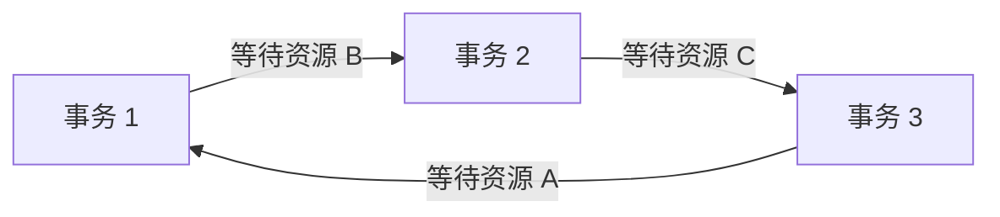

# MySQL - 第 12 课：死锁排查与避免：next-key 锁、插入意向锁与唯一索引

> 这一课从一个非常真实的订单幂等场景出发：新增订单前，先 `select ... for update` 检查订单号是否存在，不存在再插入。这个写法看起来很稳，实际在高并发下可能制造死锁。要真正讲清楚它，不能只背“死锁四条件”，而要把 InnoDB 在 RR 隔离级别下的 next-key lock、gap lock、insert intention lock、隐式锁、唯一索引冲突和 `performance_schema.data_locks` 一起串起来。

## 学习目标（本节结束后你能做到什么）

- 能解释为什么“先查不存在，再插入”的幂等写法可能导致死锁。
- 能区分 Record Lock、Gap Lock、Next-Key Lock、Insert Intention Lock、隐式锁。
- 能读懂 `performance_schema.data_locks` 里的 `LOCK_TYPE`、`LOCK_MODE`、`LOCK_STATUS`、`LOCK_DATA`。
- 能讲清 gap lock 为什么彼此兼容，但会阻塞插入意向锁。
- 能解释普通插入为什么通常靠隐式锁，什么时候会转成显式锁。
- 能给出线上死锁排查路径和工程规避方案。

## 内容讲解（核心概念，用类比、例子、图示说清楚）

先放一个结论：

**MySQL 死锁往往不是因为“锁太多”这么简单，而是因为多个事务以不同顺序占有资源，并等待对方释放。**

在 InnoDB 里，最容易把人绕晕的地方是：

- 锁不只锁真实记录，还可能锁记录之间的间隙。
- `select ... for update` 是当前读，会加锁。
- 普通 `select` 是快照读，通常不加行锁。
- `insert` 正常情况下可能不产生显式锁结构，但遇到冲突会把隐式锁显式化。
- gap lock 之间兼容，但 gap lock 和 insert intention lock 会冲突。

这一课就沿着一个订单案例，把这些点讲透。

### 1. 案例背景：订单号幂等校验

假设有订单表：

```sql
create table t_order (
  id bigint primary key auto_increment,
  order_no bigint not null,
  create_date datetime,
  index index_order(order_no)
) engine = InnoDB;
```

注意，`order_no` 这里只是普通二级索引，不是唯一索引。

表里已有数据：

| id | order_no |
| --- | --- |
| 1 | 1001 |
| 2 | 1002 |
| 3 | 1003 |
| 4 | 1004 |
| 5 | 1005 |
| 6 | 1006 |

业务想保证订单不能重复，于是写出这样的逻辑：

```sql
begin;

select id
from t_order
where order_no = 1007
for update;

-- 如果不存在，则插入
insert into t_order(order_no, create_date)
values(1007, now());

commit;
```

这段逻辑的想法是：

1. 先锁住目标订单号。
2. 如果已经存在，就不要插入。
3. 如果不存在，就插入。
4. 用 `for update` 防止并发事务也插进来。

看起来很合理，但问题就出在：

**你查询的是一条不存在的记录。InnoDB 为了防止幻读，不只是锁记录，还会锁间隙。**

### 2. 普通 `select` 为什么不够

如果不用 `for update`，只写：

```sql
begin;

select id
from t_order
where order_no = 1007;

insert into t_order(order_no, create_date)
values(1007, now());

commit;
```

在 RR 隔离级别下，普通 `select` 是快照读，依靠 MVCC 读历史版本，通常不加行锁。

于是两个事务可能这样执行：

| 时间 | 事务 A | 事务 B |
| --- | --- | --- |
| T1 | `select order_no=1007`，没查到 |  |
| T2 |  | `select order_no=1007`，也没查到 |
| T3 | 插入 1007 |  |
| T4 |  | 也插入 1007 |
| T5 | 提交 | 提交 |

如果 `order_no` 没有唯一约束，最后就可能出现两条 `order_no = 1007` 的记录。

这就是幻读在业务上的一种表现：两个事务都认为“我查的时候不存在”，然后各自插入了新记录。

所以开发者常常会想到用 `select ... for update` 做当前读，加锁防止别人插入。

但在非唯一索引 + 不存在记录 + RR 的组合下，这个方案会很危险。

### 3. 当前读、快照读和锁

先把读类型分清：

| 语句 | 读类型 | 是否加行锁 |
| --- | --- | --- |
| 普通 `select` | 快照读 | 通常不加行锁，依靠 MVCC |
| `select ... for update` | 当前读 | 加 X 锁 |
| `select ... lock in share mode` / `for share` | 当前读 | 加 S 锁 |
| `update` / `delete` | 当前读 | 加 X 锁 |
| `insert` | 写入 | 主要靠隐式锁，冲突时显式化 |

当前读读的是当前最新可见版本，并且要参与并发控制。

在 RR 隔离级别下，为了避免幻读，InnoDB 对一些当前读会使用 next-key lock。

### 4. InnoDB 行锁的几个核心类型

先建立锁类型地图。

| 锁类型                   | 锁什么                    | 作用                           |
| --------------------- | ---------------------- | ---------------------------- |
| Record Lock           | 某条真实索引记录               | 防止别人修改/删除这条记录                |
| Gap Lock              | 两条索引记录之间的间隙            | 防止别人往这个间隙插入新记录               |
| Next-Key Lock         | Gap Lock + Record Lock | 锁住左开右闭区间 `(前一条记录, 当前记录]`     |
| Insert Intention Lock | 插入意向锁，特殊 gap lock      | 表示事务想往某个间隙里的某个点插入            |
| Intention Lock        | 表级意向锁，如 IS/IX          | 表示事务稍后要在表内加 S/X 行锁           |
| Implicit Lock         | 隐式锁                    | 插入新记录后，先靠记录里的事务信息保护，冲突时再转显式锁 |

几个关键词要特别记：

- **Record Lock 锁真实记录。**
- **Gap Lock 锁记录之间的空隙，不锁记录本身。**
- **Next-Key Lock 锁左开右闭区间，既防修改记录，也防插入间隙。**
- **Insert Intention Lock 名字里有 intention，但它不是表级意向锁，而是一种特殊的 gap lock。**

### 5. `data_locks` 怎么读

MySQL 8 可以用：

```sql
select *
from performance_schema.data_locks\G
```

看当前 InnoDB 锁。

重点字段：

| 字段 | 含义 |
| --- | --- |
| `ENGINE_TRANSACTION_ID` | 事务 ID |
| `THREAD_ID` / `EVENT_ID` | 对应线程和事件 |
| `OBJECT_SCHEMA` / `OBJECT_NAME` | 哪个库、哪张表 |
| `INDEX_NAME` | 锁在哪个索引上，表级锁通常为 `NULL` |
| `LOCK_TYPE` | `TABLE` 或 `RECORD`，注意 `RECORD` 表示行级锁，不等于 Record Lock |
| `LOCK_MODE` | 锁模式，如 `IX`、`X`、`X,GAP`、`X,REC_NOT_GAP`、`X,INSERT_INTENTION` |
| `LOCK_STATUS` | `GRANTED` 表示已获得，`WAITING` 表示等待中 |
| `LOCK_DATA` | 锁住的索引值或 `supremum pseudo-record` |

最容易误解的是 `LOCK_TYPE = RECORD`。

它表示这是行级锁，不代表它一定是 Record Lock。真正判断锁类型，要看 `LOCK_MODE`：

| `LOCK_MODE` | 常见含义 |
| --- | --- |
| `X` | X 型 next-key lock |
| `S` | S 型 next-key lock |
| `X,REC_NOT_GAP` | X 型记录锁 |
| `S,REC_NOT_GAP` | S 型记录锁 |
| `X,GAP` | X 型间隙锁 |
| `S,GAP` | S 型间隙锁 |
| `X,INSERT_INTENTION` | 插入意向锁 |
| `IX` | 表级 X 意向锁 |

`LOCK_DATA = supremum pseudo-record` 表示锁关联到页内最大虚拟记录，也可以理解成当前索引范围的正无穷边界。

### 6. 死锁是怎么发生的：两个不存在订单号

现在回到订单案例。

事务 A 插入订单 `1007`，事务 B 插入订单 `1008`。

两个事务都先检查订单是否存在：

```sql
-- 事务 A
begin;
select id from t_order where order_no = 1007 for update;

-- 事务 B
begin;
select id from t_order where order_no = 1008 for update;
```

表中已有最大 `order_no = 1006`，而 `1007`、`1008` 都不存在。

因为 `order_no` 是普通二级索引，不是唯一索引；又因为当前隔离级别是 RR，`select ... for update` 是当前读，所以 InnoDB 会在二级索引 `index_order` 上加锁，防止别人在命中的范围内插入幻影记录。

对于 `order_no = 1007` 这种“查不到，并且超过当前最大值”的等值查询，锁范围可以理解成：

```text
(1006, +∞]
```

事务 A 和事务 B 都会持有这个范围上的 next-key lock。

时序如下：

| 时间 | 事务 A | 事务 B |
| --- | --- | --- |
| T1 | `begin` |  |
| T2 | `select ... order_no=1007 for update`，获得 `(1006,+∞]` 的 next-key lock |  |
| T3 |  | `begin` |
| T4 |  | `select ... order_no=1008 for update`，也获得 `(1006,+∞]` 的 next-key lock |
| T5 | `insert order_no=1007`，需要插入意向锁，等待 B 的 gap lock |  |
| T6 |  | `insert order_no=1008`，需要插入意向锁，等待 A 的 gap lock |

等待图是：


这就是循环等待。

如果 `innodb_deadlock_detect = ON`，InnoDB 会检测到死锁，主动回滚其中一个事务，报：

```text
ERROR 1213 (40001): Deadlock found when trying to get lock; try restarting transaction
```

如果关闭死锁检测，两个事务可能一直等到锁等待超时，报：

```text
ERROR 1205 (HY000): Lock wait timeout exceeded; try restarting transaction
```

### 7. 一个关键问题：为什么两个 next-key lock 能同时存在

很多人会卡在这里：

> 事务 A 已经拿了 `(1006,+∞]` 的 X 型 next-key lock，为什么事务 B 还能拿同一个范围的 X 型 next-key lock？

要分情况看。

Gap lock 的核心作用是：

**阻止其他事务往间隙里插入记录。**

它是 purely inhibitive，也就是纯粹抑制插入的锁。不同事务的 gap lock 之间通常是兼容的，因为它们的目的都是“禁止插入”，不是互相读写某条真实记录。

所以：

- gap lock 和 gap lock 兼容。
- S 型 gap lock 和 X 型 gap lock 没有传统 S/X 那种冲突意义。
- gap lock 的作用不是保护某条记录，而是保护一个间隙。

但 next-key lock = gap lock + record lock。

如果 next-key lock 的右边界是真实记录，那么 X 型 next-key lock 之间会因为记录锁部分冲突。

例如，一个事务持有 `(1,10]` 上的 X 型 next-key lock，另一个事务再想拿同样 `(1,10]` 上的 X 型 next-key lock，就会被真实记录 `10` 上的 X 记录锁挡住。

而在 `(1006,+∞]` 这个案例里，右边界是 `supremum pseudo-record`，它不是真实用户记录。此时主要发挥作用的是间隙部分，所以两个事务可以同时持有这个范围上的锁。

这正是这个死锁案例最迷惑的地方：

**两个事务先各自成功拿到同一段 gap/next-key 范围，然后在真正插入时又互相阻塞。**

### 8. 插入意向锁：不是表级意向锁

Insert Intention Lock 很容易被名字骗。

它虽然叫“意向锁”，但不是表级意向锁（IS/IX）。它是一种特殊的 gap lock，用于插入之前声明：

**我要往这个间隙里的某个位置插入一条记录。**

插入意向锁有两个重要特性：

1. 多个事务想往同一个间隙插入不同位置的记录时，插入意向锁之间通常不互相阻塞。
2. 如果这个间隙已经被别的事务持有 gap lock / next-key lock，插入意向锁会等待。

例如索引里已有 4 和 7：

```text
4   (gap)   7
```

事务 A 插入 5，事务 B 插入 6，如果没有其他 gap lock，它们可以并发，因为插入位置不冲突。

但如果事务 C 已经锁住 `(4,7)` 这个间隙，A/B 的 insert intention 都要等待。

所以在订单死锁案例里：

- A 的 `select ... for update` 锁了 `(1006,+∞]`。
- B 的 `select ... for update` 也锁了 `(1006,+∞]`。
- A 插入 1007，需要 insert intention，但被 B 的 gap lock 挡住。
- B 插入 1008，需要 insert intention，但被 A 的 gap lock 挡住。

循环等待出现。

### 9. 为什么 `insert` 正常情况下看不到显式锁

一个容易意外的现象是：

```sql
begin;
insert into t_order(order_no, create_date)
values(1006, now());
```

插入成功后，去 `performance_schema.data_locks` 里不一定能看到这条新记录对应的显式行锁。

原因是 InnoDB 对普通插入使用隐式锁。

每条 InnoDB 聚簇索引记录里都有隐藏事务字段，比如 `DB_TRX_ID`。新插入的记录会带着创建它的事务 ID。

如果没有其他事务要和它冲突，InnoDB 不必真的创建一条显式锁结构。这样可以减少锁对象数量，提高性能。

但遇到冲突时，隐式锁会显式化。

常见触发场景：

1. 目标插入间隙被 gap lock 锁住。
2. 插入的主键或唯一索引值和已有记录冲突。
3. 另一个事务试图读取/锁定当前事务未提交的新记录。

所以：

**看不到显式锁，不代表没有并发保护；只是 InnoDB 延迟到真正可能冲突时才创建锁结构。**

### 10. 场景一：间隙被锁住时插入会等待

假设表里已有：

| id | order_no |
| --- | --- |
| 1 | 1001 |
| 2 | 1002 |
| 3 | 1003 |
| 4 | 1004 |
| 5 | 1005 |

事务 A：

```sql
begin;
select id
from t_order
where order_no = 1006
for update;
```

如果 `1006` 不存在，而且当前最大值是 `1005`，事务 A 可能锁住：

```text
(1005, +∞]
```

事务 B：

```sql
begin;
insert into t_order(order_no, create_date)
values(1010, now());
```

`1010` 落在 `(1005,+∞]` 这个间隙里，所以 B 会尝试申请插入意向锁。

但 A 持有这个间隙的 gap/next-key lock，B 的插入意向锁会处于：

```text
LOCK_MODE: X,INSERT_INTENTION
LOCK_STATUS: WAITING
```

这就是 insert 被 gap lock 阻塞的典型现象。

### 11. 场景二：主键冲突会加 S 型记录锁

假设表里已经有：

```text
id = 5
```

事务 A：

```sql
begin;
insert into t_order(id)
values(5);
```

会报：

```text
ERROR 1062 (23000): Duplicate entry '5' for key 'PRIMARY'
```

但事情没有到报错就结束。

为了检查和处理唯一性冲突，InnoDB 会对已有的冲突记录加锁。在这个实验场景下，可以在 `data_locks` 里看到类似：

```text
INDEX_NAME: PRIMARY
LOCK_TYPE: RECORD
LOCK_MODE: S,REC_NOT_GAP
LOCK_DATA: 5
```

它表示：

- 锁在主键索引 `PRIMARY` 上。
- 锁的是 `id = 5` 这条真实记录。
- 是 S 型记录锁。
- `REC_NOT_GAP` 表示不锁间隙。

这个细节很重要：即使插入失败，事务还没结束时，也可能持有锁。

所以线上看到 Duplicate Key 报错，不要想当然认为“失败语句没有任何锁影响”。如果事务还开着，锁可能仍然到事务结束才释放。

### 12. 场景三：唯一二级索引冲突会加 S 型锁

如果把 `order_no` 改成唯一二级索引：

```sql
create unique index uk_order_no on t_order(order_no);
```

表里已有：

```text
order_no = 1001
```

事务 A：

```sql
begin;
insert into t_order(order_no, create_date)
values(1001, now());
```

也会报唯一键冲突：

```text
ERROR 1062 (23000): Duplicate entry '1001' for key 'uk_order_no'
```

在原实验里，`data_locks` 中可以看到 `uk_order_no` / `index_order` 上的 S 型 next-key lock，类似：

```text
INDEX_NAME: uk_order_no
LOCK_TYPE: RECORD
LOCK_MODE: S
LOCK_DATA: 1001, 1
```

如果另一个事务此时执行：

```sql
select *
from t_order
where order_no = 1001
for update;
```

它想拿 X 型锁，会和事务 A 持有的 S 型锁冲突，因此等待。

这里要抓住的不是“具体锁范围永远是某个固定区间”，而是：

**唯一键冲突检查本身也需要锁住相关索引记录，失败的插入也可能影响并发。**

### 13. 场景四：两个事务插入相同唯一键

再看一个更常见的并发场景。

`order_no` 是唯一二级索引，表里当前没有 `order_no = 1006`。

事务 A：

```sql
begin;
insert into t_order(order_no, create_date)
values(1006, now());
```

插入成功，但不提交。

此时这条新记录通常由隐式锁保护。

事务 B：

```sql
begin;
insert into t_order(order_no, create_date)
values(1006, now());
```

B 需要做唯一性检查，发现 A 已经插入了相同 `order_no`，但 A 还没提交。

这时会发生：

1. A 插入的那条记录上的隐式锁被转换成显式 X 型记录锁。
2. B 想拿 S 型锁做重复键检查。
3. X 和 S 冲突，B 等待。

在 `data_locks` 中可能看到：

事务 A：

```text
INDEX_NAME: uk_order_no
LOCK_MODE: X,REC_NOT_GAP
LOCK_STATUS: GRANTED
LOCK_DATA: 1006, ...
```

事务 B：

```text
INDEX_NAME: uk_order_no
LOCK_MODE: S
LOCK_STATUS: WAITING
LOCK_DATA: 1006, ...
```

后续结果取决于事务 A：

- 如果 A commit，B 最终会收到 Duplicate Key 错误。
- 如果 A rollback，B 可能继续插入成功。

这解释了为什么同一个唯一键的并发插入会阻塞，而普通非唯一索引下两个相同值插入不一定阻塞。

### 14. 死锁和锁等待不是一回事

锁等待是：

```text
A 等 B
```

死锁是：

```text
A 等 B，B 又等 A
```

更一般地说，是等待图里出现了环。



InnoDB 默认开启死锁检测：

```sql
show variables like 'innodb_deadlock_detect';
```

默认 `ON` 时，一旦发现等待图有环，InnoDB 会选择一个代价较小的事务回滚，返回：

```text
ERROR 1213 (40001): Deadlock found when trying to get lock; try restarting transaction
```

如果没有形成环，只是单纯等锁，最终可能超时：

```text
ERROR 1205 (HY000): Lock wait timeout exceeded; try restarting transaction
```

由参数控制：

```sql
show variables like 'innodb_lock_wait_timeout';
```

线上处理时要分清：

| 错误 | 含义 | 处理 |
| --- | --- | --- |
| `1213 Deadlock found` | InnoDB 检测到死锁，主动回滚了一个事务 | 应用层重试整个事务，并分析加锁顺序 |
| `1205 Lock wait timeout` | 等锁太久超时，不一定是死锁 | 查谁持锁、事务是否过长、SQL 是否扫太大范围 |

### 15. 怎么排查线上死锁

线上遇到死锁，不要只盯报错 SQL，要拿完整上下文。

#### 15.1 看最近一次死锁

```sql
show engine innodb status\G
```

重点看：

- `LATEST DETECTED DEADLOCK`
- 哪两个事务参与。
- 各自执行的 SQL。
- 等待什么锁。
- 持有什么锁。
- InnoDB 回滚了哪个事务。

这是死锁排查第一入口。

#### 15.2 看当前锁等待

```sql
select *
from performance_schema.data_locks\G

select *
from performance_schema.data_lock_waits\G
```

`data_locks` 看锁本身，`data_lock_waits` 看等待关系。

如果想看得更友好，可以用：

```sql
select *
from sys.innodb_lock_waits\G
```

#### 15.3 看事务和线程

```sql
select *
from information_schema.innodb_trx\G

show processlist;
```

重点看：

- 哪个事务开了很久。
- 当前执行什么 SQL。
- 是否处于 `Waiting for ...`。
- 事务是否长时间未提交。

#### 15.4 还原等待图

真正有价值的排查，是把它还原成：

```text
事务 A 持有什么锁 -> 等什么锁
事务 B 持有什么锁 -> 等什么锁
是否形成环
```

只看单条 SQL，经常会误判。

很多死锁的根因不是“某条 SQL 写错”，而是：

- 事务里多条 SQL 的加锁顺序不一致。
- 查询条件没走唯一索引，锁范围过大。
- 用 `select ... for update` 锁了不存在记录的间隙。
- 业务把幂等性校验交给了锁，而不是交给唯一约束。

### 16. 如何避免这个订单死锁

原始写法是：

```sql
begin;

select id
from t_order
where order_no = ?
for update;

insert into t_order(order_no, create_date)
values(?, now());

commit;
```

它的问题是：

- `order_no` 不是唯一索引，无法从数据库约束上保证唯一。
- 不存在记录时，`for update` 会锁间隙。
- 多个事务锁同一间隙后再插入，容易循环等待。

更推荐的方向是：

#### 16.1 用唯一索引保证幂等

订单号不能重复，这是数据约束，不应该只靠应用逻辑判断。

应该让数据库也知道这件事：

```sql
alter table t_order
add unique key uk_order_no(order_no);
```

然后用“直接插入 + 处理重复键”的方式：

```sql
insert into t_order(order_no, create_date)
values(?, now());
```

如果重复，捕获：

```text
ERROR 1062 Duplicate entry
```

业务可以把它当成幂等成功、查询已有订单、或返回重复请求。

也可以用：

```sql
insert ignore into t_order(order_no, create_date)
values(?, now());
```

或者：

```sql
insert into t_order(order_no, create_date)
values(?, now())
on duplicate key update order_no = values(order_no);
```

具体选哪种，要看业务语义：

| 写法 | 适用场景 | 注意点 |
| --- | --- | --- |
| 普通 `insert` + 捕获 1062 | 想显式知道重复请求 | 需要应用层处理异常 |
| `insert ignore` | 重复时静默忽略 | 可能吞掉其他约束错误，要谨慎 |
| `on duplicate key update` | 重复时更新某些字段 | 会产生更新语义和 binlog 记录，要确认幂等含义 |

#### 16.2 不要用非唯一索引上的 `for update` 做不存在校验

如果确实要锁，也尽量让条件命中唯一索引。

唯一索引等值查询命中真实记录时，锁范围通常更精确，更接近记录锁，而不是大范围间隙。

但如果查的是不存在记录，仍然可能有 gap lock。所以最好的幂等方式仍然是：

**让唯一约束成为最终防线，应用层做可重试处理。**

#### 16.3 保持固定加锁顺序

死锁四条件里，最容易在业务层破坏的是循环等待。

如果一个事务要锁多条记录，尽量按固定顺序加锁：

```text
总是按 id 从小到大锁
总是先锁订单，再锁库存，再锁账户
总是先锁父表，再锁子表
```

不要事务 A 先锁订单再锁库存，事务 B 先锁库存再锁订单。

#### 16.4 缩短事务

锁不是语句结束释放，而是事务提交/回滚时释放。

所以：

- 不要在事务里做 RPC。
- 不要在事务里做用户交互等待。
- 不要在事务里跑大查询。
- 不要把无关操作塞进同一个事务。

事务越长，锁持有时间越长，死锁和锁等待概率越高。

#### 16.5 所有锁定读和更新条件都要走合适索引

没有索引的 `update` / `delete` / `select ... for update` 很危险。

例如：

```sql
update t_order
set create_date = now()
where order_no = 1007;
```

如果 `order_no` 没有索引，InnoDB 可能全表扫描，并在扫描过程中对大量记录和间隙加锁。

结果可能接近“锁住整张表”的效果。

所以线上排查锁问题时，必须结合第 6 课慢查询 SOP：

- 看 SQL 是否走索引。
- 看 `EXPLAIN type/key/rows`。
- 看是否扫了大量行。
- 看是否有长事务。

#### 16.6 适当考虑隔离级别，但不要靠它掩盖设计问题

在 InnoDB 的 READ COMMITTED 隔离级别下，普通搜索和索引扫描的 gap lock 使用会减少，很多 next-key lock 场景会弱化，只在外键检查、唯一键冲突检查等场景保留。

这可能降低某些死锁概率。

但不要把“改隔离级别”当成万能解法：

- 它会改变一致性语义。
- 仍然会有唯一键冲突锁、外键锁、记录锁。
- 业务是否能接受 RC，需要整体评估。

订单幂等这种问题，优先级通常是：

```text
唯一约束 + 插入优先 + 事务重试
```

而不是先降隔离级别。

### 17. 应用层必须能重试死锁

死锁不是 MySQL 异常状态，而是并发系统里的正常现象。

即使你设计得很好，复杂业务在高并发下仍可能偶发死锁。

所以应用层应该：

1. 捕获 `1213 Deadlock found`。
2. 捕获必要场景下的 `1205 Lock wait timeout`。
3. 回滚当前事务。
4. 做有限次数重试。
5. 重试时加随机退避。
6. 保证事务逻辑幂等。

伪代码：

```java
for (int i = 0; i < maxRetries; i++) {
    try {
        begin();
        doBusiness();
        commit();
        return;
    } catch (DeadlockException | LockTimeoutException e) {
        rollback();
        sleep(backoff(i));
    }
}
throw new BusinessException("transaction retry exhausted");
```

这里最重要的是：

**重试必须重试整个事务，而不是只重试失败的那条 SQL。**

因为死锁发生时，事务状态已经被破坏或被数据库回滚了一部分，继续原事务会很危险。

### 18. 一张表记住锁兼容关系的关键点

不用死背完整矩阵，先记这几条：

| 组合 | 是否冲突 | 说明 |
| --- | --- | --- |
| S 记录锁 vs S 记录锁 | 不冲突 | 多个事务可以读锁同一记录 |
| S 记录锁 vs X 记录锁 | 冲突 | 读写互斥 |
| X 记录锁 vs X 记录锁 | 冲突 | 写写互斥 |
| Gap lock vs Gap lock | 通常不冲突 | gap lock 只负责禁止插入，彼此可以共存 |
| Gap lock vs Insert Intention | 冲突 | 间隙被锁住时，插入要等 |
| Insert Intention vs Insert Intention | 通常不冲突 | 插入不同位置时可以并发 |
| Next-key lock vs Next-key lock | 看记录部分 | 如果右边界是真实记录，X 记录部分会冲突；如果是 supremum，更多体现为 gap |

死锁案例里真正的核心就是：

```text
gap lock 彼此兼容
insert intention 与 gap lock 冲突
两个事务先兼容地拿了 gap，再互相等待插入
```

### 19. 面试里怎么讲这个死锁案例

如果面试官问：

> MySQL 死锁怎么排查？为什么 `select ... for update` 后再 insert 会死锁？

可以这样答：

1. 我先确认隔离级别和索引情况。这个案例在 InnoDB RR 下，`order_no` 是普通二级索引，不是唯一索引。
2. 两个事务都先用 `select ... for update` 查询不存在的订单号，比如 1007 和 1008。因为记录不存在，并且落在当前最大值 1006 后面，所以 InnoDB 会在二级索引上加 `(1006,+∞]` 范围的 next-key/gap 锁，防止幻读。
3. gap lock 之间是兼容的，所以两个事务都能先拿到这个范围锁。
4. 随后两个事务分别执行 insert。insert 需要在同一个 gap 上申请插入意向锁，而插入意向锁和对方持有的 gap lock 冲突。
5. 于是事务 A 等事务 B 释放 gap，事务 B 又等事务 A 释放 gap，形成循环等待，InnoDB 检测到后报 `ERROR 1213 Deadlock found`。
6. 排查时我会看 `show engine innodb status\G` 的 latest deadlock，再用 `performance_schema.data_locks` 和 `data_lock_waits` 看当前锁和等待关系，重点看 `LOCK_MODE`、`LOCK_STATUS`、`LOCK_DATA` 和 `INDEX_NAME`。
7. 规避上，不建议用非唯一索引上的 `select ... for update` 做不存在校验。订单号幂等应该建唯一索引，直接 insert，并捕获 duplicate key，必要时整个事务重试。

这套回答把业务、隔离级别、索引、锁类型、死锁环和解决方案都串起来了。

## 小结（3-5 条关键点）

- 普通 `select` 是快照读，通常不加锁；`select ... for update` 是当前读，会加锁，并在 RR 下可能触发 next-key lock 防幻读。
- Gap lock 锁的是间隙，主要作用是阻止插入；gap lock 之间通常兼容，但 gap lock 会阻塞 insert intention lock。
- 订单案例的死锁本质是：两个事务都锁住 `(1006,+∞]` 间隙，随后都想往这个间隙插入，于是互相等待对方释放 gap lock。
- `insert` 正常情况下常靠隐式锁保护；遇到间隙锁、主键冲突、唯一索引冲突时，可能生成显式锁或把隐式锁显式化。
- 避免这类死锁的核心不是“少用锁”这么简单，而是用唯一约束表达幂等、直接插入并处理重复键、保持固定加锁顺序、缩短事务、让锁定读走合适索引，并在应用层支持死锁重试。

## 问题（检测用户对当前章节内容是否了解）

1. 为什么普通 `select` 不能保证“先查不存在，再插入”这种订单幂等逻辑一定正确？
2. `select ... for update` 查询不存在的非唯一索引值时，为什么可能加 gap/next-key lock？
3. Gap lock 之间为什么兼容？它和 insert intention lock 为什么会冲突？
4. `performance_schema.data_locks` 中 `LOCK_TYPE = RECORD` 是否等于 Record Lock？应该看哪个字段判断记录锁、间隙锁、next-key lock？
5. 普通 `insert` 为什么可能看不到显式锁？什么情况下隐式锁会显式化？
6. 主键冲突和唯一二级索引冲突时，InnoDB 为什么还可能加 S 型锁？
7. 线上遇到 `ERROR 1213` 和 `ERROR 1205`，排查和处理思路分别是什么？
8. 为什么订单号幂等更推荐唯一索引 + 直接插入 + 重试，而不是非唯一索引上先 `select ... for update`？
