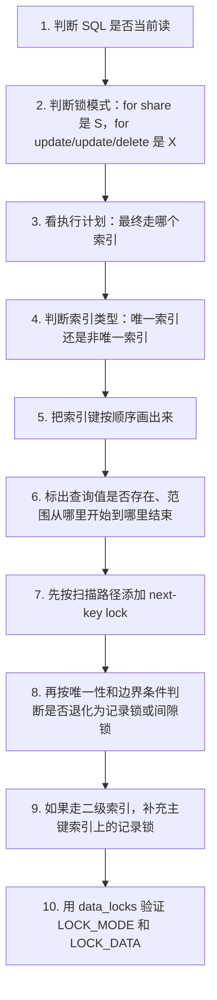

# MySQL - 第 13 课：行级锁加锁规则：唯一索引、非唯一索引、范围查询与全表扫描

> 第 12 课用订单幂等场景解释了死锁是怎么发生的，这一课把视角再放大一点：InnoDB 到底在什么 SQL 上加行级锁？Record Lock、Gap Lock、Next-Key Lock 分别锁什么？唯一索引、非唯一索引、等值查询、范围查询、没走索引时，加锁范围又该怎么推导？这一节的目标不是背一堆结论，而是建立一套能自己画出锁范围的推导方法。

## 学习目标（本节结束后你能做到什么）

- 能区分快照读、当前读，以及哪些 SQL 会加行级锁。
- 能说明 S 锁、X 锁的兼容关系，以及 Record Lock、Gap Lock、Next-Key Lock 的区别。
- 能读懂 `performance_schema.data_locks` 中 `LOCK_TYPE`、`LOCK_MODE`、`LOCK_DATA` 的含义。
- 能推导唯一索引等值查询、唯一索引范围查询的锁范围和退化规则。
- 能推导非唯一二级索引等值查询、范围查询为什么会同时锁二级索引和主键索引。
- 能解释为什么没有走索引的锁定读、`update`、`delete` 可能接近“锁全表”。
- 能把“为什么这样加锁”统一回到避免幻读和减少不必要阻塞这两个目标上。

## 内容讲解（核心概念，用类比、例子、图示说清楚）

先放一套总纲：

**InnoDB 行级锁锁的是索引，不是抽象的行；加锁的基本单位通常是 next-key lock；在只靠记录锁或间隙锁就足以避免幻读的场景下，next-key lock 会退化。**

所以分析一条加锁 SQL，不能只看 `where id = 1` 这种表面条件，而要问：

1. 当前隔离级别是什么？
2. 这条 SQL 是快照读还是当前读？
3. 它最终走了哪个索引？
4. 这个索引是唯一索引还是非唯一索引？
5. 查询条件是等值还是范围？
6. 查询值在索引里是否真实存在？
7. 如果是二级索引，排序单位是二级索引值，还是二级索引值 + 主键值？

这几个问题回答完，锁范围基本就能推出来。

### 1. 哪些 SQL 会加行级锁？

InnoDB 支持行级锁，MyISAM 不支持行级锁。后文讨论的都是 InnoDB。

普通 `select` 通常不会加行级锁，因为它是快照读，通过 MVCC 读取历史版本。

```sql
select *
from user
where id = 1;
```

在可重复读（Repeatable Read，简称 RR）隔离级别下，这类普通查询读的是事务开始后某个 Read View 可见的数据版本，不会阻塞别人更新，也不会被别人更新阻塞。

但下面这些语句属于当前读，会读取最新版本，并参与锁冲突：

```sql
-- MySQL 8 推荐写法
select *
from user
where id = 1
for share;

-- 兼容老写法
select *
from user
where id = 1
lock in share mode;

select *
from user
where id = 1
for update;

update user
set age = age + 1
where id = 1;

delete from user
where id = 1;
```

这些语句的锁类型大致是：

| SQL | 读写类型 | 常见行锁模式 |
| --- | --- | --- |
| 普通 `select` | 快照读 | 通常不加行锁 |
| `select ... for share` | 当前读 | S 锁 |
| `select ... lock in share mode` | 当前读 | S 锁 |
| `select ... for update` | 当前读 | X 锁 |
| `update` | 当前读 + 写 | X 锁 |
| `delete` | 当前读 + 写 | X 锁 |

注意两点：

- 锁定读语句要放在事务中才有意义。事务提交或回滚后，事务过程中持有的锁会被释放。
- 串行化隔离级别比较特殊，普通 `select` 也可能加锁；本文重点讨论常见的 RR 场景。

### 2. S 锁和 X 锁的兼容关系

S 锁是共享锁，X 锁是独占锁。

| 已持有 \ 请求 | S | X |
| --- | --- | --- |
| S | 兼容 | 不兼容 |
| X | 不兼容 | 不兼容 |

换成人话：

- 读读可以共享。
- 读写互斥。
- 写写互斥。

例如事务 A 执行：

```sql
begin;

select *
from user
where id = 1
for update;
```

如果 `id = 1` 存在，事务 A 会对这条记录加 X 锁。事务 B 再执行：

```sql
update user
set age = 20
where id = 1;
```

事务 B 也要对 `id = 1` 加 X 锁，因此会被事务 A 阻塞，直到 A 提交或回滚。

### 3. 行级锁三兄弟：记录锁、间隙锁、临键锁

在 RR 隔离级别下，InnoDB 行级锁主要有三类。

| 锁类型 | 英文 | 锁住什么 | 区间形态 |
| --- | --- | --- | --- |
| 记录锁 | Record Lock | 一条真实索引记录 | 单点 |
| 间隙锁 | Gap Lock | 两条索引记录之间的空隙，不包含记录本身 | `(a, b)` |
| 临键锁 | Next-Key Lock | 间隙 + 右边界记录 | `(a, b]` |

Record Lock 只保护真实存在的索引记录。

```text
id: 1  3  5
        ^
        记录锁锁住 id = 3
```

Gap Lock 只保护间隙，不保护两边的真实记录。

```text
id: 1  (gap)  5
       (1,5)
```

如果事务 A 锁住 `(1,5)` 这个间隙，其他事务不能插入 `id = 2/3/4`，但理论上不因为这个 gap lock 而不能修改 `id = 1` 或 `id = 5`。

Next-Key Lock 是前两者组合。

```text
id: 1  (gap)  5
       (1,5]
```

它既禁止往 `(1,5)` 间隙插入新记录，也保护 `id = 5` 这条记录本身不被修改或删除。

一个非常重要的细节：

**Gap Lock 之间是兼容的。**

多个事务可以同时持有同一段间隙上的 gap lock，因为 gap lock 的目的不是互相排斥读写同一条真实记录，而是共同阻止其他事务往这个间隙插入新记录。它真正会阻塞的是插入意向锁（Insert Intention Lock）或涉及右边界真实记录的记录锁部分。

### 4. `data_locks` 怎么读？

MySQL 8 可以用下面这条语句看当前锁：

```sql
select *
from performance_schema.data_locks\G
```

常用字段如下：

| 字段 | 说明 |
| --- | --- |
| `OBJECT_SCHEMA` / `OBJECT_NAME` | 锁在哪个库、哪张表 |
| `INDEX_NAME` | 锁在哪个索引上；表级意向锁通常为 `NULL` |
| `LOCK_TYPE` | `TABLE` 或 `RECORD` |
| `LOCK_MODE` | 锁模式，如 `IX`、`X`、`X,GAP`、`X,REC_NOT_GAP` |
| `LOCK_STATUS` | `GRANTED` 已获得，`WAITING` 等待中 |
| `LOCK_DATA` | 锁住的索引值，或右边界值，或 `supremum pseudo-record` |

最容易误解的是：

**`LOCK_TYPE = RECORD` 只表示这是行级锁，不代表它一定是 Record Lock。**

真正判断行锁类型，要看 `LOCK_MODE`：

| `LOCK_MODE` | 含义 |
| --- | --- |
| `X` | X 型 next-key lock |
| `S` | S 型 next-key lock |
| `X,REC_NOT_GAP` | X 型记录锁 |
| `S,REC_NOT_GAP` | S 型记录锁 |
| `X,GAP` | X 型间隙锁 |
| `S,GAP` | S 型间隙锁 |
| `X,INSERT_INTENTION` | X 型插入意向锁，通常处于等待插入间隙 |
| `IX` | 表级 X 意向锁 |

如果看到：

```text
LOCK_TYPE: RECORD
LOCK_MODE: X,REC_NOT_GAP
INDEX_NAME: PRIMARY
LOCK_DATA: 1
```

意思是：事务在主键索引 `PRIMARY` 的 `id = 1` 这条记录上加了 X 型记录锁。

如果看到：

```text
LOCK_TYPE: RECORD
LOCK_MODE: X,GAP
INDEX_NAME: PRIMARY
LOCK_DATA: 5
```

通常可以理解成：在主键索引右边界为 `5` 的位置加了 X 型间隙锁。左边界要看索引中 `5` 的上一条记录是谁。

如果看到：

```text
LOCK_DATA: supremum pseudo-record
```

`supremum pseudo-record` 是页内最大虚拟记录，可以理解成该页或该索引范围的正无穷边界。锁范围通常指向最后一条真实记录之后的区间。

### 5. 实验表：后文都用这张表推导

为了统一讨论，假设有一张 `user` 表：

```sql
create table user (
  id bigint primary key,
  name varchar(64) not null,
  age int not null,
  key index_age(age)
) engine = InnoDB;
```

表中数据如下：

| id | name | age |
| --- | --- | --- |
| 1 | 路飞 | 19 |
| 5 | 索隆 | 21 |
| 10 | 山治 | 22 |
| 15 | 乌索普 | 20 |
| 20 | 香克斯 | 39 |

主键索引 `PRIMARY` 的顺序是：

```text
1 -> 5 -> 10 -> 15 -> 20 -> supremum
```

二级索引 `index_age(age)` 的顺序不是按 `id`，而是按 `(age, id)`：

```text
(19,1) -> (20,15) -> (21,5) -> (22,10) -> (39,20) -> supremum
```

这点后面非常关键。

对二级索引加锁时，`LOCK_DATA` 可能显示两个值，例如：

```text
LOCK_DATA: 39, 20
```

它不是随便多显示了一个数字，而是在告诉你：

- 二级索引值是 `age = 39`。
- 对应主键值是 `id = 20`。
- 这个二级索引项的完整排序键是 `(39,20)`。

## 唯一索引：等值查询怎么加锁

唯一索引等值查询最容易建立直觉，因为它只会命中 0 条或 1 条记录。

这里先用主键索引举例。主键索引也是唯一索引。

### 6. 唯一索引等值查询：记录存在

事务 A：

```sql
begin;

select *
from user
where id = 1
for update;
```

`id = 1` 存在。

由于 `id` 是唯一索引，InnoDB 在索引树上定位到 `id = 1` 之后，就知道不会再有第二条 `id = 1` 的记录。

此时原本的 next-key lock 会退化成记录锁：

```text
主键索引 PRIMARY:

id = 1 加 X 型记录锁
```

`data_locks` 中常见形态：

```text
INDEX_NAME: PRIMARY
LOCK_TYPE: RECORD
LOCK_MODE: X,REC_NOT_GAP
LOCK_DATA: 1
```

这把锁会阻塞其他事务更新或删除 `id = 1`：

```sql
update user set age = 20 where id = 1;
delete from user where id = 1;
```

但如果其他事务执行：

```sql
insert into user(id, name, age)
values(1, '娜美', 18);
```

通常不会因为事务 A 的记录锁而等待，而是直接触发主键冲突：

```text
ERROR 1062 (23000): Duplicate entry '1' for key 'PRIMARY'
```

为什么这里可以退化成记录锁？

因为对于 `where id = 1` 这个查询条件来说，只要保护好已经存在的 `id = 1` 不被删除或修改，就能保证事务前后两次查询结果一致。由于 `id` 唯一，别人也不可能再插入第二条 `id = 1`。

### 7. 唯一索引等值查询：记录不存在

事务 A：

```sql
begin;

select *
from user
where id = 2
for update;
```

`id = 2` 不存在。主键索引中它应该落在 `1` 和 `5` 之间：

```text
1  (2 应该插这里)  5
```

InnoDB 会在索引树上找到第一条大于 `2` 的记录，也就是 `id = 5`。然后把这条记录上的 next-key lock 退化成间隙锁：

```text
锁范围：(1,5)
```

`data_locks` 中常见形态：

```text
INDEX_NAME: PRIMARY
LOCK_TYPE: RECORD
LOCK_MODE: X,GAP
LOCK_DATA: 5
```

注意这里 `LOCK_DATA = 5` 是右边界。左边界是主键索引中 `5` 的上一条记录，也就是 `1`。

这把间隙锁会阻塞其他事务插入：

```sql
insert into user(id, name, age) values(2, '娜美', 18);
insert into user(id, name, age) values(3, '娜美', 18);
insert into user(id, name, age) values(4, '娜美', 18);
```

但不会因为这把间隙锁阻塞插入 `id = 1` 或 `id = 5`，那两个值本来就已经存在，会走主键冲突。

为什么记录不存在时退化成间隙锁？

因为不存在的记录没法加记录锁。为了保证事务 A 前后两次查询 `id = 2` 都查不到，只要防止别人往 `(1,5)` 这个间隙插入 `id = 2` 就够了。没必要锁住 `id = 5` 这条真实记录本身。

## 唯一索引：范围查询怎么加锁

唯一索引范围查询比等值查询复杂，因为它会沿着索引继续扫描多条记录。

基本规则：

**范围查询会对扫描到的索引项先加 next-key lock，然后在部分边界场景退化成记录锁或间隙锁。**

### 8. `id > 15`：右侧范围，不包含边界

事务 A：

```sql
begin;

select *
from user
where id > 15
for update;
```

主键索引：

```text
1 -> 5 -> 10 -> 15 -> 20 -> supremum
```

推导过程：

1. 第一条满足条件的记录是 `id = 20`。
2. 因为条件是 `>`，不包含 `15` 这个边界，所以不会锁 `id = 15`。
3. 对 `id = 20` 加 next-key lock，范围是 `(15,20]`。
4. 为了防止插入 `id > 20` 的新记录，还要锁住最后一段 `(20,+∞]`，对应 `supremum pseudo-record`。

最终锁范围：

| 索引 | 锁类型 | 范围 |
| --- | --- | --- |
| `PRIMARY` | X 型 next-key lock | `(15,20]` |
| `PRIMARY` | X 型 next-key lock | `(20,+∞]` |

这会阻塞：

- 更新或删除 `id = 20`。
- 插入 `id = 16/17/18/19`。
- 插入任何 `id > 20` 的记录。

### 9. `id >= 15`：右侧范围，包含已存在边界

事务 A：

```sql
begin;

select *
from user
where id >= 15
for update;
```

推导过程：

1. 第一条要找的是 `id = 15`。
2. `id = 15` 存在，并且这是唯一索引上的等值边界，所以 `id = 15` 的 next-key lock 退化成记录锁。
3. 继续范围扫描到 `id = 20`，加 `(15,20]` 的 next-key lock。
4. 继续扫描到 `supremum pseudo-record`，加 `(20,+∞]` 的 next-key lock。

最终锁范围：

| 索引 | 锁类型 | 范围 |
| --- | --- | --- |
| `PRIMARY` | X 型记录锁 | `id = 15` |
| `PRIMARY` | X 型 next-key lock | `(15,20]` |
| `PRIMARY` | X 型 next-key lock | `(20,+∞]` |

这就是“大于等于”的特殊处：如果等值边界存在，唯一索引能确认只有这一条，所以边界记录可以退化成记录锁。

### 10. `id < 6`：左侧范围，条件值不存在

事务 A：

```sql
begin;

select *
from user
where id < 6
for update;
```

`id = 6` 不存在。

推导过程：

1. 从最左侧开始扫描，命中 `id = 1`，加 `(-∞,1]` 的 next-key lock。
2. 继续扫描，命中 `id = 5`，加 `(1,5]` 的 next-key lock。
3. 继续扫描到 `id = 10`，发现它不满足 `id < 6`，这是终止扫描的记录。
4. 终止记录 `id = 10` 上的 next-key lock 退化成 gap lock，范围是 `(5,10)`。这是按索引中相邻记录之间的物理间隙来锁，不是按整数值逐个精准裁剪，所以会一起挡住 `id = 6/7/8/9` 的插入。

最终锁范围：

| 索引 | 锁类型 | 范围 |
| --- | --- | --- |
| `PRIMARY` | X 型 next-key lock | `(-∞,1]` |
| `PRIMARY` | X 型 next-key lock | `(1,5]` |
| `PRIMARY` | X 型 gap lock | `(5,10)` |

有同学会问：查询条件是 `id < 6`，为什么要锁 `(5,10)`？

因为 InnoDB 的范围锁是建立在 B+ 树相邻索引记录上的：`5` 后面的下一条真实记录是 `10`，所以能锁的间隙就是 `(5,10)`。对 `id < 6` 这个例子来说，它看起来比谓词需要的范围更宽，但这是实现层面的自然结果；如果条件是 `id < 7` 或 `id <= 6`，这个间隙又正好能阻止可能造成幻读的新记录。理解时要记住：InnoDB 锁的是索引间隙，不是数学谓词里的每一个离散整数点。

对于 `id <= 6`，由于 `id = 6` 也不存在，加锁范围与 `id < 6` 通常相同。

### 11. `id <= 5`：左侧范围，条件值存在且包含边界

事务 A：

```sql
begin;

select *
from user
where id <= 5
for update;
```

`id = 5` 存在，并且条件包含 `5`。

推导过程：

1. 扫描到 `id = 1`，加 `(-∞,1]` 的 next-key lock。
2. 扫描到 `id = 5`，加 `(1,5]` 的 next-key lock。
3. 因为主键唯一，且 `id <= 5` 已经包含到边界 `5`，不需要继续扫描到 `10`。

最终锁范围：

| 索引 | 锁类型 | 范围 |
| --- | --- | --- |
| `PRIMARY` | X 型 next-key lock | `(-∞,1]` |
| `PRIMARY` | X 型 next-key lock | `(1,5]` |

这里 `id = 5` 没有退化成记录锁，因为范围查询要防止区间内插入新记录。例如如果只锁 `id = 5` 记录本身，就挡不住别人插入 `id = 2/3/4`，那下一次查询 `id <= 5` 就可能多出新行。

### 12. `id < 5`：左侧范围，条件值存在但不包含边界

事务 A：

```sql
begin;

select *
from user
where id < 5
for update;
```

`id = 5` 存在，但条件不包含 `5`。

推导过程：

1. 扫描到 `id = 1`，加 `(-∞,1]` 的 next-key lock。
2. 继续扫描到 `id = 5`，发现它是第一条不满足 `id < 5` 的记录。
3. 因为 `id = 5` 不属于结果集，不需要锁住这条记录本身。
4. 但要防止别人插入 `id = 2/3/4`，所以在 `id = 5` 上退化成 gap lock，范围是 `(1,5)`。

最终锁范围：

| 索引 | 锁类型 | 范围 |
| --- | --- | --- |
| `PRIMARY` | X 型 next-key lock | `(-∞,1]` |
| `PRIMARY` | X 型 gap lock | `(1,5)` |

### 13. 唯一索引范围查询小结

可以把唯一索引的范围查询压成下面这张表：

| 条件 | 条件值是否存在 | 边界处理 |
| --- | --- | --- |
| `>` | 无等值命中 | 扫描到满足条件的记录，加 next-key lock，最后锁到 `supremum` |
| `>=` | 存在 | 等值边界退化成记录锁，后续范围加 next-key lock |
| `<` | 不存在 | 终止扫描记录退化成 gap lock |
| `<=` | 不存在 | 终止扫描记录退化成 gap lock |
| `<` | 存在 | 条件值这条终止记录退化成 gap lock |
| `<=` | 存在 | 条件值记录属于结果集，保持 next-key lock |

背这张表不如记住两个原则：

- 结果集里的真实记录要防止被改或删。
- 可能插入幻影记录的间隙要封住。

如果只靠记录锁或 gap lock 已经足够，就尽量退化，减少锁范围。

## 非唯一索引：等值查询怎么加锁

非唯一索引比唯一索引更绕，因为它有两个特点：

1. 可能存在多个相同二级索引值。
2. 二级索引叶子节点里还存着主键值，排序单位是 `(二级索引值, 主键值)`。

所以用非唯一二级索引做锁定读时，通常会同时加两类锁：

- 在二级索引上加 next-key lock / gap lock，用于防止插入幻影记录。
- 对查到的真实行，在主键索引上加记录锁，用于防止这些行被更新或删除。

### 14. 非唯一索引等值查询：记录不存在

事务 A：

```sql
begin;

select *
from user
where age = 25
for update;
```

二级索引 `index_age` 的顺序是：

```text
(19,1) -> (20,15) -> (21,5) -> (22,10) -> (39,20)
```

`age = 25` 不存在。它应该落在 `(22,10)` 和 `(39,20)` 之间。

推导过程：

1. 定位到第一条大于 `25` 的二级索引记录，也就是 `(39,20)`。
2. 因为没有满足 `age = 25` 的记录，不会对主键索引加锁。
3. 为了防止别人插入 `age = 25` 的幻影记录，在 `(39,20)` 这个二级索引项上加 gap lock。

锁范围可以理解成：

```text
二级索引 index_age: (22,39)
```

`data_locks` 中常见形态：

```text
INDEX_NAME: index_age
LOCK_TYPE: RECORD
LOCK_MODE: X,GAP
LOCK_DATA: 39, 20
```

这里 `LOCK_DATA = 39,20` 的完整含义是：

- 右边界的二级索引值是 `39`。
- 右边界对应主键值是 `20`。
- 锁关联到二级索引项 `(39,20)`。

只说“锁住 `(22,39)`”还不够严谨，因为二级索引排序还要看主键。

例如别人插入：

```sql
insert into user(id, name, age)
values(12, '罗宾', 22);
```

新记录二级索引键是 `(22,12)`。它会排在 `(22,10)` 之后、`(39,20)` 之前。这个插入位置的下一条记录是 `(39,20)`，而 `(39,20)` 上有 gap lock，所以会被阻塞。

但如果插入：

```sql
insert into user(id, name, age)
values(3, '罗宾', 22);
```

新记录二级索引键是 `(22,3)`。它会排在 `(21,5)` 之后、`(22,10)` 之前。下一条记录是 `(22,10)`，而这个记录上没有事务 A 的 gap lock，所以可能成功。

因此，分析二级索引间隙锁时，不能只看 `age`，还要看 `id`。

### 15. 非唯一索引等值查询：记录存在

事务 A：

```sql
begin;

select *
from user
where age = 22
for update;
```

`age = 22` 存在，对应行是：

```text
(age,id) = (22,10)
```

推导过程：

1. 扫描到 `(22,10)`，它满足条件。
2. 对二级索引 `(22,10)` 加 next-key lock，范围可理解为 `(21,22]`，更精确地说是 `((21,5),(22,10)]`。
3. 因为查到了真实行，所以对主键索引 `id = 10` 加记录锁。
4. 非唯一索引可能有多个 `age = 22`，所以还要继续扫描下一条二级索引记录。
5. 下一条是 `(39,20)`，第一条不满足 `age = 22` 的记录。
6. 对 `(39,20)` 加 gap lock，范围可理解为 `(22,39)`，更精确地说是 `((22,10),(39,20))`。
7. 停止扫描。

最终锁：

| 索引 | 锁类型 | 范围 |
| --- | --- | --- |
| `index_age` | X 型 next-key lock | `((21,5),(22,10)]` |
| `index_age` | X 型 gap lock | `((22,10),(39,20))` |
| `PRIMARY` | X 型记录锁 | `id = 10` |

为什么查到 `age = 22` 后，还要锁 `(22,39)` 这个 gap？

因为 `age` 不是唯一索引。

如果只锁 `(21,22]`，其他事务仍可能插入：

```sql
insert into user(id, name, age)
values(12, '罗宾', 22);
```

二级索引键 `(22,12)` 会排在 `(22,10)` 和 `(39,20)` 之间。如果不锁这个间隙，那么事务 A 下一次查询 `age = 22` 时，就会多出一条记录，这就是幻读。

所以非唯一索引等值查询存在记录时，必须继续扫到第一条不满足条件的记录，用它前面的 gap 锁住“相同索引值后续可能插入的位置”。

### 16. 为什么非唯一索引还要锁主键索引？

事务 A 查询：

```sql
select *
from user
where age = 22
for update;
```

执行路径通常是：

1. 在二级索引 `index_age` 中找到 `(22,10)`。
2. 通过主键值 `10` 回表到聚簇索引。
3. 读取完整行。

由于 `for update` 要保护这条真实行不被别人更新或删除，仅锁二级索引是不够的。最终真实数据存在聚簇索引里，所以还要对 `PRIMARY` 上的 `id = 10` 加记录锁。

可以理解为：

- 二级索引锁：防止插入新的 `age = 22` 幻影记录。
- 主键记录锁：防止已经查到的真实行被改或删。

这也是为什么二级索引锁问题比主键索引更难：它经常同时涉及两棵 B+ 树。

## 非唯一索引：范围查询怎么加锁

非唯一索引范围查询有一个更粗的规则：

**非唯一索引范围查询时，扫描到的二级索引记录通常都加 next-key lock，不像唯一索引那样发生边界退化；同时，满足条件的真实行会在主键索引上加记录锁。**

### 17. `age >= 22` 的加锁过程

事务 A：

```sql
begin;

select *
from user
where age >= 22
for update;
```

二级索引顺序：

```text
(19,1) -> (20,15) -> (21,5) -> (22,10) -> (39,20) -> supremum
```

推导过程：

1. 第一条满足条件的是 `(22,10)`，对二级索引加 next-key lock：`((21,5),(22,10)]`。
2. 通过主键 `id = 10` 回表，对 `PRIMARY` 的 `id = 10` 加记录锁。
3. 继续扫描到 `(39,20)`，也满足 `age >= 22`，对二级索引加 next-key lock：`((22,10),(39,20)]`。
4. 通过主键 `id = 20` 回表，对 `PRIMARY` 的 `id = 20` 加记录锁。
5. 继续扫描到 `supremum pseudo-record`，加 `(39,+∞]` 的 next-key lock，防止插入更大的 `age`。

最终锁：

| 索引 | 锁类型 | 范围 |
| --- | --- | --- |
| `index_age` | X 型 next-key lock | `((21,5),(22,10)]` |
| `index_age` | X 型 next-key lock | `((22,10),(39,20)]` |
| `index_age` | X 型 next-key lock | `((39,20),+∞]` |
| `PRIMARY` | X 型记录锁 | `id = 10` |
| `PRIMARY` | X 型记录锁 | `id = 20` |

为什么 `age = 22` 明明存在，且 `age >= 22` 看起来包含等值边界，却不能像唯一索引一样退化成记录锁？

因为 `age` 不是唯一索引。

如果只对 `(22,10)` 加记录锁，别人仍可以插入新的 `age = 22`：

```sql
insert into user(id, name, age)
values(12, '罗宾', 22);
```

这样事务 A 再查 `age >= 22`，结果集就变了。因此非唯一索引范围查询需要继续用 next-key lock 保护间隙。

### 18. 非唯一索引 `<=` 场景为什么也可能不退化？

比如：

```sql
select *
from user
where age <= 22
for update;
```

从“避免幻读”的角度，有些边界似乎可以退化得更细。但 MySQL 实际实现中，非唯一索引范围查询通常不会像唯一索引那样做大量边界退化优化。

可以这样理解：

- 唯一索引能证明某个值最多只有一条记录，所以很多地方可以更大胆地退化。
- 非唯一索引不能证明同值记录只有一条，只要边界值附近还能插入同值新记录，就必须谨慎。
- 实现上也不一定追求每个场景的最小锁范围，而是用更统一的扫描加锁规则。

所以工程上不要用“我觉得这里用 gap lock 就够了”去假设数据库一定会这样做，应该以实际版本和 `data_locks` 验证为准。

## 没有走索引：为什么可能接近锁全表

前面的分析都有一个前提：SQL 走了某个索引。

如果锁定读、`update`、`delete` 没有走索引，或者优化器选择了全表扫描，那么 InnoDB 会扫描大量记录，并对扫描到的索引记录加锁。

例如：

```sql
select *
from user
where name = '路飞'
for update;
```

如果 `name` 没有索引，执行器只能全表扫描。为了在 RR 下防止幻读，InnoDB 可能对扫描到的每一条记录以及相关间隙加 next-key lock。

结果就是：

**看起来只查一个 `name`，实际可能把整张表的可插入范围都锁住。**

同理：

```sql
update user
set age = 30
where name = '路飞';

delete from user
where name = '路飞';

select *
from user
where name = '路飞'
for update;
```

这些语句如果不走索引，都有扩大锁范围的风险。

线上执行这类 SQL 前，必须先看执行计划：

```sql
explain update user
set age = 30
where name = '路飞';
```

重点看：

| 字段 | 关注点 |
| --- | --- |
| `type` | 是否是 `ALL` 全表扫描 |
| `key` | 实际使用了哪个索引 |
| `rows` | 预估扫描行数 |
| `Extra` | 是否有 `Using where`、`Using index condition` 等 |

如果 `key = NULL` 且 `type = ALL`，对写语句或锁定读要非常谨慎。

## 一套通用推导流程

以后遇到任何一条加锁 SQL，可以按这个流程推：



其中第 5 步最容易被忽略。

主键索引只需要画：

```text
1 -> 5 -> 10 -> 15 -> 20
```

非唯一二级索引必须画：

```text
(age,id)
(19,1) -> (20,15) -> (21,5) -> (22,10) -> (39,20)
```

只画 `age` 不画 `id`，很容易误判插入是否会被某个 gap lock 阻塞。

## 常见锁范围速查表

以下基于 MySQL 8.0.x、RR 隔离级别、`select ... for update` 这类 X 型当前读。不同版本、不同执行计划可能有细节差异。

### 唯一索引等值查询

| 场景 | 例子 | 锁范围 |
| --- | --- | --- |
| 记录存在 | `where id = 1` | `id = 1` 记录锁 |
| 记录不存在 | `where id = 2`，位于 `(1,5)` | `(1,5)` 间隙锁 |

### 唯一索引范围查询

| 场景 | 例子 | 锁范围示例 |
| --- | --- | --- |
| 大于 | `id > 15` | `(15,20]`、`(20,+∞]` |
| 大于等于且边界存在 | `id >= 15` | `id=15` 记录锁、`(15,20]`、`(20,+∞]` |
| 小于且边界不存在 | `id < 6` | `(-∞,1]`、`(1,5]`、`(5,10)` |
| 小于等于且边界不存在 | `id <= 6` | 通常同 `id < 6` |
| 小于且边界存在 | `id < 5` | `(-∞,1]`、`(1,5)` |
| 小于等于且边界存在 | `id <= 5` | `(-∞,1]`、`(1,5]` |

### 非唯一二级索引等值查询

| 场景 | 例子 | 二级索引锁 | 主键索引锁 |
| --- | --- | --- | --- |
| 记录不存在 | `age = 25` | `((22,10),(39,20))` gap lock | 无 |
| 记录存在 | `age = 22` | `((21,5),(22,10)]` next-key + `((22,10),(39,20))` gap | `id=10` 记录锁 |

### 非唯一二级索引范围查询

| 场景 | 例子 | 二级索引锁 | 主键索引锁 |
| --- | --- | --- | --- |
| 范围查询 | `age >= 22` | 扫描到的二级索引项通常加 next-key lock，并锁到 `supremum` | 满足条件的行加记录锁 |

## 工程建议：线上怎么少踩坑

### 1. 锁定读、更新、删除前先看索引

危险 SQL 的共同点：

```sql
select ... for update;
update ... where ...;
delete ... where ...;
```

它们不是普通查询，会加锁。上线前至少确认：

- `where` 条件能走索引。
- 走的是你预期的索引。
- 扫描行数不要远大于实际影响行数。
- 谓词没有因为函数、隐式转换、左模糊等原因失去索引能力。

### 2. 业务唯一性用唯一索引兜底

如果业务要求订单号唯一，不要只靠：

```sql
select ... for update;
if not exists then insert;
```

更稳的方式是给业务键加唯一约束：

```sql
alter table t_order
add unique key uk_order_no(order_no);
```

然后用插入冲突处理实现幂等：

```sql
insert into t_order(order_no, create_date)
values(?, now())
on duplicate key update order_no = values(order_no);
```

或者捕获 Duplicate Key，把它当作“订单已存在”的幂等结果处理。

唯一索引不只是为了查得快，更是为了让数据库帮你守住并发正确性。

### 3. 事务要短，锁持有时间要短

行锁到事务结束才释放，所以不要在事务里做：

- 远程 RPC。
- 大量业务计算。
- 等用户输入。
- 复杂报表查询。
- 无关的多表写入。

事务越长，锁持有越久，死锁和锁等待概率越高。

### 4. RC 可以减少 gap lock，但不是无脑切换

读已提交（Read Committed，简称 RC）隔离级别下，很多场景会减少 gap lock，行级锁以记录锁为主。

这确实能缓解一些锁等待和死锁问题，但它也改变了事务可见性语义：

- 同一事务内两次普通查询可能看到不同结果。
- 可重复读语义不再成立。
- 仍要靠唯一索引、业务幂等和重试机制保证正确性。

所以线上是否从 RR 改 RC，不应该只为了“少加锁”，而要结合业务一致性要求、历史 SQL 行为和测试验证。

### 5. 排查锁等待时同时看锁和 SQL

常用命令：

```sql
select *
from performance_schema.data_locks\G

select *
from performance_schema.data_lock_waits\G

show engine innodb status\G

select *
from information_schema.innodb_trx\G
```

排查时不要只看“谁在等谁”，还要还原：

1. 等待事务执行了哪条 SQL。
2. 阻塞事务执行了哪条 SQL。
3. 锁在哪个索引上。
4. 锁模式是 `X`、`X,GAP`、`X,REC_NOT_GAP` 还是 `X,INSERT_INTENTION`。
5. `LOCK_DATA` 是真实记录、右边界，还是 `supremum pseudo-record`。
6. 执行计划是否走了预期索引。

很多锁问题表面是“事务 A 卡住了”，本质是“SQL 没走索引，锁范围被放大了”。

## 面试讲法：怎么把这题讲得有层次

如果面试官问：“MySQL 是怎么加行级锁的？”

可以这样回答：

> InnoDB 的行级锁是加在索引上的，不是直接加在抽象的行对象上。普通 select 是快照读，通常不加行锁；`select ... for update`、`select ... for share`、`update`、`delete` 是当前读，会加锁。RR 下为了避免幻读，基本加锁单位是 next-key lock，也就是左开右闭的间隙加记录锁。但在一些场景下会退化，比如唯一索引等值查询命中记录时退化成记录锁，没命中时退化成间隙锁。

然后继续展开：

> 唯一索引和非唯一索引加锁差别很大。唯一索引能证明一个值最多一条记录，所以等值查询可以更精确地退化；非唯一索引可能有重复值，所以等值查询也要继续扫到第一条不满足条件的记录，并锁住后面的间隙，防止插入同值幻影记录。如果走的是二级索引，还会对查到行的主键索引加记录锁，因为真实数据在聚簇索引里。

最后补工程风险：

> 线上最危险的是锁定读、update、delete 没走索引，一旦全表扫描，就可能对大量索引记录加 next-key lock，效果接近锁全表。所以排查锁等待时，要同时看执行计划、`performance_schema.data_locks` 和 `data_lock_waits`，重点看锁在哪个索引上、`LOCK_MODE` 是什么、`LOCK_DATA` 对应哪个范围。

这一套回答比单纯背 Record/GAP/Next-Key 更完整。

## 小结

这一课最重要的不是记住所有实验，而是抓住四个核心结论：

1. **行锁锁的是索引。** 查询走主键索引就锁主键索引；走二级索引，通常会锁二级索引，也可能回表锁主键索引。
2. **next-key lock 是基本单位。** 它是左开右闭区间 `(a,b]`，既锁间隙，也锁右边界记录。
3. **退化是为了在避免幻读的前提下缩小锁范围。** 唯一索引等值命中退化成记录锁；唯一索引等值未命中退化成间隙锁。
4. **非唯一二级索引要按 `(二级索引值, 主键值)` 排序分析。** 只看二级索引值很容易误判插入是否被阻塞。

最后再记一个线上原则：

**所有加锁 SQL，都先看执行计划。**

没有走索引的 `select ... for update`、`update`、`delete`，可能把一个看似很小的业务操作，变成大范围锁等待。

## 问题（用于检验有没有真的理解）

1. 普通 `select` 和 `select ... for update` 的本质区别是什么？
2. `LOCK_TYPE = RECORD` 是否一定表示 Record Lock？为什么？
3. `LOCK_MODE = X`、`X,GAP`、`X,REC_NOT_GAP` 分别代表什么？
4. 唯一索引等值查询命中记录时，为什么 next-key lock 可以退化成记录锁？
5. 唯一索引等值查询未命中记录时，为什么不能加记录锁，只能锁间隙？
6. `where id < 5 for update` 中，如果 `id = 5` 存在，为什么锁 `(1,5)` 而不是锁 `id = 5`？
7. 非唯一索引 `where age = 22 for update` 命中 `(22,10)` 后，为什么还要继续扫描到 `(39,20)`？
8. 为什么二级索引的 `LOCK_DATA: 39,20` 里会出现两个数字？
9. 为什么 `age = 22, id = 12` 的插入是否阻塞，要看它在 `(age,id)` 排序中的下一条记录？
10. `update user set age=30 where name='路飞'` 如果 `name` 没索引，为什么可能接近锁全表？
