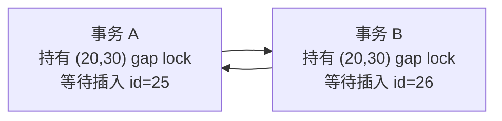

# MySQL - 第 16 课：用 data_locks 分析死锁：间隙锁兼容、插入意向锁等待与循环等待

> 这一课用一道典型面试题训练“看锁输出还原死锁”的能力。两个事务先分别更新不存在的主键 `id = 25` 和 `id = 26`，都拿到了同一个 `(20,30)` 的间隙锁；随后又分别插入 `id = 25` 和 `id = 26`，插入时需要插入意向锁，结果都被对方的间隙锁挡住，形成循环等待。真正要掌握的不是这道题本身，而是如何从 `performance_schema.data_locks` 读出锁范围、锁状态和等待原因。

## 学习目标（本节结束后你能做到什么）

- 能从 `LOCK_MODE = X,GAP` 和 `LOCK_DATA = 30` 推导出间隙锁范围 `(20,30)`。
- 能解释为什么两个事务可以同时持有同一段 gap lock。
- 能解释为什么 `insert` 进入别人持有的 gap 时会生成插入意向锁并等待。
- 能读懂 `LOCK_MODE = X,GAP,INSERT_INTENTION` 和 `LOCK_STATUS = WAITING`。
- 能画出“事务 A 等事务 B，事务 B 等事务 A”的死锁等待图。
- 能区分“纯 gap lock 兼容”和“next-key lock 中 record 部分冲突”。
- 能给出线上排查死锁时该看哪些字段、按什么顺序看。

## 内容讲解（核心概念，用类比、例子、图示说清楚）

先把结论放前面：

**纯间隙锁之间是兼容的，但插入意向锁和已有间隙锁冲突。**

于是就会出现看起来很反直觉的情况：

1. 事务 A 对 `(20,30)` 加 gap lock，成功。
2. 事务 B 也对 `(20,30)` 加 gap lock，也成功。
3. 事务 A 想插入 `25`，需要 insert intention lock，被 B 的 gap lock 阻塞。
4. 事务 B 想插入 `26`，需要 insert intention lock，被 A 的 gap lock 阻塞。
5. A 等 B，B 等 A，死锁成立。

这也是很多锁题最容易错的地方：

**gap lock 和 gap lock 不冲突，不代表 gap lock 和所有“间隙相关的锁”都不冲突。**

## 题目与实验表

假设有一张学生表：

```sql
create table t_student (
  id bigint primary key,
  no varchar(32),
  name varchar(64),
  age int,
  score int
) engine = InnoDB;
```

表中已有数据：

| id | no | name | age | score |
| --- | --- | --- | --- | --- |
| 15 | S0001 | Bob | 25 | 34 |
| 18 | S0002 | Alice | 24 | 77 |
| 20 | S0003 | Jim | 24 | 5 |
| 30 | S0004 | Eric | 23 | 91 |
| 37 | S0005 | Tom | 22 | 22 |
| 49 | S0006 | Tom | 25 | 83 |
| 50 | S0007 | Rose | 23 | 89 |

主键索引顺序是：

```text
15 -> 18 -> 20 -> 30 -> 37 -> 49 -> 50
```

注意：

```text
id = 25 不存在
id = 26 不存在
```

它们都落在同一个主键间隙：

```text
(20,30)
```

实验环境：

- MySQL 8.0.26。
- 隔离级别：RR，可重复读。
- 如果死锁检测开启，MySQL 会检测死锁并回滚其中一个事务；如果关闭死锁检测，则两个事务会等待到锁超时。

事务执行顺序：

| 阶段 | 事务 A | 事务 B |
| --- | --- | --- |
| T0 | `begin` | `begin` |
| T1 | `update t_student set score=100 where id=25;` |  |
| T2 |  | `update t_student set score=100 where id=26;` |
| T3 | `insert into t_student(id,no,name,age,score) values(25,'S0025','sony',28,90);` |  |
| T4 |  | `insert into t_student(id,no,name,age,score) values(26,'S0026','ace',28,90);` |

看起来很普通，实际会死锁。

## T1：事务 A 更新不存在的 `id = 25`

事务 A：

```sql
begin;

update t_student
set score = 100
where id = 25;
```

`id` 是主键，`id = 25` 不存在。InnoDB 会在主键索引里定位 `25` 应该插入的位置：

```text
20  (25 应该在这里)  30
```

在 RR 隔离级别下，`update` 是当前读。对于唯一索引等值更新，如果目标记录不存在，InnoDB 会锁住它应该落入的间隙，防止其他事务插入这个目标值造成当前读语义不稳定。

所以事务 A 会加：

| 锁 | 字段表现 | 含义 |
| --- | --- | --- |
| 表级意向锁 | `LOCK_TYPE=TABLE`, `LOCK_MODE=IX` | 准备在表内加 X 行锁 |
| 主键间隙锁 | `INDEX_NAME=PRIMARY`, `LOCK_MODE=X,GAP`, `LOCK_DATA=30` | 锁住 `(20,30)` |

`data_locks` 里你会看到类似：

```text
ENGINE_TRANSACTION_ID: 23968341
OBJECT_NAME: t_student
INDEX_NAME: NULL
LOCK_TYPE: TABLE
LOCK_MODE: IX
LOCK_STATUS: GRANTED
```

以及：

```text
ENGINE_TRANSACTION_ID: 23968341
OBJECT_NAME: t_student
INDEX_NAME: PRIMARY
LOCK_TYPE: RECORD
LOCK_MODE: X,GAP
LOCK_STATUS: GRANTED
LOCK_DATA: 30
```

这里仍然要强调：

**`LOCK_TYPE = RECORD` 只表示行级锁，不代表记录锁。**

真正说明这是间隙锁的是：

```text
LOCK_MODE: X,GAP
```

### 间隙范围怎么从 `LOCK_DATA=30` 推出来？

当 `LOCK_MODE` 是 next-key lock 或 gap lock 时，`LOCK_DATA` 往往表示锁范围的右边界。

这里：

```text
LOCK_DATA = 30
```

主键索引中 `30` 的上一条记录是：

```text
20
```

所以锁范围是：

```text
(20,30)
```

为什么不是 `(25,30)`？

因为 `25` 这条记录不存在。锁只能加在已有索引记录、已有记录之间的间隙、或虚拟边界上。`25` 只是一个谓词值，不是 B+ 树上的真实记录。

## T2：事务 B 更新不存在的 `id = 26`

事务 B：

```sql
begin;

update t_student
set score = 100
where id = 26;
```

`id = 26` 也不存在，同样落在：

```text
(20,30)
```

事务 B 也会加：

```text
PRIMARY 上的 X,GAP
LOCK_DATA = 30
范围：(20,30)
```

很多人会疑惑：

> 事务 A 已经持有 `(20,30)` 的 X 型 gap lock，为什么事务 B 还能成功拿同一个 `(20,30)` 的 X 型 gap lock？

答案是：

**gap lock 之间兼容。**

InnoDB 官方文档对 gap lock 有一个非常关键的描述：gap lock 是 purely inhibitive。也就是说，它的目的只是阻止其他事务往这个间隙插入记录。

因此：

- S 型 gap lock 和 X 型 gap lock 没有传统 S/X 那种互斥意义。
- 一个事务持有某个 gap lock，不会阻止另一个事务也持有同一段 gap lock。
- gap lock 之间可以共存。

换句话说：

```text
事务 A：我也不让别人往 (20,30) 插
事务 B：我也不让别人往 (20,30) 插
```

两者目标一致，所以可以共存。

但这个“共存”正是后面死锁的铺垫。

## T3：事务 A 插入 `id = 25`

事务 A：

```sql
insert into t_student(id, no, name, age, score)
values(25, 'S0025', 'sony', 28, 90);
```

插入 `id = 25` 的位置在：

```text
(20,30)
```

插入一条记录前，InnoDB 要先判断插入位置的下一条记录，也就是 `id = 30` 这条索引记录上，是否存在覆盖该间隙的 gap lock。

此时事务 B 持有 `(20,30)` 的 gap lock。

所以事务 A 的插入不能直接进行，它会生成一个插入意向锁：

```text
LOCK_MODE: X,GAP,INSERT_INTENTION
LOCK_STATUS: WAITING
LOCK_DATA: 30
```

含义是：

```text
事务 A 想往右边界为 30 的间隙中插入一条记录，
但这个间隙被其他事务的 gap lock 挡住了，
所以处于 WAITING。
```

重点字段：

| 字段 | 含义 |
| --- | --- |
| `LOCK_MODE=X,GAP,INSERT_INTENTION` | X 型插入意向锁 |
| `LOCK_STATUS=WAITING` | 锁结构已生成，但还没成功拿到锁 |
| `LOCK_DATA=30` | 目标插入间隙的右边界是 30 |

注意一句非常容易踩坑的话：

**出现 WAITING 的锁结构，不代表事务已经成功持有这把锁。它只是正在等这把锁。**

## 插入意向锁到底是什么？

插入意向锁（Insert Intention Lock）名字里有“意向”，但它不是 IS/IX 那种表级意向锁。

它属于行级锁体系，是一种特殊的 gap lock。

可以这样理解：

| 锁 | 锁的语义 |
| --- | --- |
| 普通 gap lock | 锁一段区间，例如 `(20,30)`，阻止别人往里面插 |
| insert intention lock | 锁区间里的某个插入点，例如“我要插 `25`” |

假设索引里已有：

```text
4  ...  7
```

事务 A 插入 `5`，事务 B 插入 `6`。如果没有其他事务持有 `(4,7)` 的 gap lock，A/B 的插入意向锁通常不会互相阻塞，因为它们插入的是不同位置。

这就是插入意向锁存在的意义：

**允许多个事务并发往同一个间隙的不同位置插入，前提是没有已有 gap lock 阻止这个间隙被插入。**

但如果已有事务持有了 `(4,7)` 的 gap lock，那么插入 `5` 或 `6` 都要等。

所以本题里：

```text
事务 B 持有 (20,30) gap lock
事务 A 想插入 25，需要 insert intention lock
insert intention lock 和 B 的 gap lock 冲突
事务 A 等待
```

## T4：事务 B 插入 `id = 26`

事务 B：

```sql
insert into t_student(id, no, name, age, score)
values(26, 'S0026', 'ace', 28, 90);
```

插入 `id = 26` 的位置同样在：

```text
(20,30)
```

此时事务 A 仍然持有 `(20,30)` 的 gap lock。

事务 B 也需要生成插入意向锁：

```text
LOCK_MODE: X,GAP,INSERT_INTENTION
LOCK_STATUS: WAITING
LOCK_DATA: 30
```

但它会被事务 A 的 gap lock 阻塞。

至此等待关系变成：

```text
事务 A：
  已持有 (20,30) gap lock
  等待插入 25 的 insert intention lock
  被事务 B 的 (20,30) gap lock 阻塞

事务 B：
  已持有 (20,30) gap lock
  等待插入 26 的 insert intention lock
  被事务 A 的 (20,30) gap lock 阻塞
```

画成等待图：



循环等待出现，死锁成立。

如果 `innodb_deadlock_detect = ON`，InnoDB 会检测到循环等待，回滚其中一个事务：

```text
ERROR 1213 (40001): Deadlock found when trying to get lock; try restarting transaction
```

如果关闭死锁检测，两个事务会一直等到：

```text
ERROR 1205 (HY000): Lock wait timeout exceeded; try restarting transaction
```

## 死锁四条件在本题里怎么对应？

| 死锁条件 | 本题对应 |
| --- | --- |
| 互斥 | 插入意向锁和对方持有的 gap lock 冲突 |
| 占有且等待 | A/B 都已持有 `(20,30)` gap lock，又等待插入意向锁 |
| 不可抢占 | 锁只能等持有事务提交/回滚释放 |
| 循环等待 | A 等 B，B 等 A |

其中最容易误解的是“互斥”：

不是 gap lock 和 gap lock 互斥。

真正互斥的是：

```text
insert intention lock  vs  对方已持有的 gap lock
```

## 用 `data_locks` 分析这类问题的步骤

遇到这种锁题或线上锁等待，建议按下面顺序看。

### 1. 先按事务分组

看：

```text
ENGINE_TRANSACTION_ID
THREAD_ID
EVENT_ID
```

把同一个事务持有和等待的锁归在一起。

例如：

```text
ENGINE_TRANSACTION_ID: 23968341  -> 事务 A
ENGINE_TRANSACTION_ID: 23968342  -> 事务 B
```

真实环境中，不要靠眼睛猜“事务 a/b”，要用事务 ID、线程 ID、当前 SQL 对齐。

### 2. 区分表级锁和行级锁

看：

```text
LOCK_TYPE
```

| `LOCK_TYPE` | 含义 |
| --- | --- |
| `TABLE` | 表级锁，如 `IX` |
| `RECORD` | 行级锁，不等于 Record Lock |

如果是：

```text
LOCK_TYPE: TABLE
LOCK_MODE: IX
```

这通常只是表级意向锁，不是导致本题死锁的关键。

本题重点在：

```text
LOCK_TYPE: RECORD
INDEX_NAME: PRIMARY
```

### 3. 用 `LOCK_MODE` 判断锁类型

常见判断表：

| `LOCK_MODE` | 含义 |
| --- | --- |
| `X` | X 型 next-key lock |
| `X,GAP` | X 型 gap lock |
| `X,REC_NOT_GAP` | X 型 record lock |
| `X,GAP,INSERT_INTENTION` | X 型插入意向锁 |

本题关键组合：

```text
X,GAP                 -> 已持有的间隙锁
X,GAP,INSERT_INTENTION -> 正在等待的插入意向锁
```

### 4. 用 `LOCK_STATUS` 区分“已持有”和“等待”

| `LOCK_STATUS` | 含义 |
| --- | --- |
| `GRANTED` | 已成功持有 |
| `WAITING` | 正在等待 |

本题中：

```text
事务 A:
  X,GAP, GRANTED
  X,GAP,INSERT_INTENTION, WAITING

事务 B:
  X,GAP, GRANTED
  X,GAP,INSERT_INTENTION, WAITING
```

这个形态几乎已经把死锁轮廓暴露出来了。

### 5. 用 `LOCK_DATA` 推导范围

本题：

```text
INDEX_NAME: PRIMARY
LOCK_DATA: 30
```

主键索引里 `30` 的上一条是 `20`，所以右边界为 `30` 的 gap lock 范围是：

```text
(20,30)
```

如果是二级索引，`LOCK_DATA` 可能出现多个值，例如：

```text
LOCK_DATA: 39, 20
```

那就要按 `(二级索引值, 主键值)` 来判断右边界，而不能只看第一个数字。

### 6. 最后画等待图

不要停在“看到 WAITING”。

要明确：

```text
谁持有什么？
谁在等什么？
等的锁被谁挡住？
是否形成环？
```

本题就是：

```text
A 持有 gap，等 insert intention，被 B gap 挡住
B 持有 gap，等 insert intention，被 A gap 挡住
```

形成环，死锁。

## 为什么 `update id = 25` 会加 gap lock？

这是本题的第一层关键。

`id` 是唯一索引，`id = 25` 不存在。

在 RR 下，唯一索引等值当前读如果没命中记录，会在第一条大于目标值的记录上把 next-key lock 退化成 gap lock。

这里第一条大于 `25` 的主键是：

```text
30
```

上一条是：

```text
20
```

所以锁：

```text
(20,30)
```

这和第 13 课的规则一致：

| 场景 | 加锁 |
| --- | --- |
| 唯一索引等值查询，记录存在 | 记录锁 |
| 唯一索引等值查询，记录不存在 | 间隙锁 |

`update` 本质上也是当前读 + 写，所以遵循类似的加锁逻辑。

## 读者常见误区：间隙锁“有记录”就不兼容吗？

原文最后的读者问答很有价值，值得单独讲清。

有人会问：

> 我测试 `select id > 15 and id < 50 for update`，两个事务执行同一句，后一个事务会阻塞。是不是说明“只要间隙内有记录，两个间隙锁就不兼容”？

不是。

关键在于这条语句加的并不是“纯 gap lock”，而是 next-key lock。

例如主键序列：

```text
15 -> 18 -> 20 -> 30 -> 37 -> 49 -> 50
```

执行：

```sql
select *
from t_student
where id > 15 and id < 50
for update;
```

它会扫描到真实记录：

```text
18, 20, 30, 37, 49
```

对这些扫描到的记录，加的通常是 X 型 next-key lock，也就是：

```text
(15,18]
(18,20]
(20,30]
(30,37]
(37,49]
```

这些锁都包含右边界记录的 record lock。

两个事务都执行这条 `for update`，第二个事务会被第一个事务持有的 X record lock 阻塞。阻塞原因不是“gap lock 不兼容”，而是：

```text
next-key lock = gap lock + record lock
X record lock 与 X record lock 冲突
```

换一个例子：

```sql
select *
from t_student
where id = 15
for update;
```

如果两个事务都执行，后一个也会阻塞，因为它们争的是 `id = 15` 的 X 记录锁。

所以要区分：

| 锁 | 是否彼此兼容 |
| --- | --- |
| 纯 gap lock vs 纯 gap lock | 兼容 |
| X record lock vs X record lock | 不兼容 |
| X next-key lock vs X next-key lock | 通常因 record 部分冲突 |
| insert intention lock vs 已有 gap lock | 冲突 |

一句话：

**纯 gap lock 兼容；包含记录锁部分的 next-key lock，要按 S/X 记录锁兼容矩阵判断。**

## 面试答法：这题怎么讲清楚？

如果面试官问：

> 这两个事务为什么会死锁？到底加了什么锁？

可以这样答：

> 表里没有 `id=25` 和 `id=26`，它们都落在主键索引 `(20,30)` 这个间隙里。RR 隔离级别下，`update ... where id=25` 是当前读，唯一索引等值更新没命中记录时，会在第一条大于目标值的记录 `id=30` 上加 gap lock，所以事务 A 拿到 `(20,30)` 的 X,GAP。事务 B 更新 `id=26` 也没命中，同样拿到 `(20,30)` 的 X,GAP。gap lock 之间是兼容的，所以这两步都能成功。

然后继续：

> 后面事务 A 插入 `id=25`，要往 `(20,30)` 插入，需要申请插入意向锁，但这个间隙被事务 B 的 gap lock 锁着，所以 A 等 B。事务 B 插入 `id=26` 时同理，要申请插入意向锁，但被事务 A 的 gap lock 锁着，所以 B 等 A。于是形成循环等待，死锁成立。`data_locks` 里能看到已持有的 `X,GAP` 以及等待中的 `X,GAP,INSERT_INTENTION`。

最后补一句：

> 这里不是 gap lock 之间冲突；gap lock 之间兼容。真正冲突的是 insert intention lock 和对方已经持有的 gap lock。

这个回答就很完整了。

## 线上排查建议

这类问题在真实业务里经常来自“先更新/检查不存在，再插入”的流程。

比如：

```sql
begin;

update t
set ...
where unique_key = ?;

insert into t(unique_key, ...)
values(?, ...);

commit;
```

如果前面的 `update` 没命中，可能会锁住目标值所在间隙。多个事务锁住同一间隙后再互相插入，就容易制造等待环。

建议：

1. 业务唯一性用唯一索引兜底。
2. 能用单条原子 SQL 就不要拆成“先探测再插入”。
3. 使用 `insert ... on duplicate key update` 或捕获 Duplicate Key 实现幂等。
4. 对死锁要设计重试机制，`ERROR 1213` 本来就是事务型系统需要处理的正常并发异常。
5. 排查时优先保存 `show engine innodb status\G` 的 latest deadlock，因为死锁现场会被后续死锁覆盖。

常用命令：

```sql
show engine innodb status\G

select *
from performance_schema.data_locks\G

select *
from performance_schema.data_lock_waits\G

select *
from information_schema.innodb_trx\G
```

## 小结

这一课重点记住四句话：

1. `update where id = 25` 如果 `id = 25` 不存在，在 RR 下会对它所在的主键间隙加 gap lock。
2. 两个事务可以同时持有同一段纯 gap lock，因为 gap lock 之间兼容。
3. 插入同一个被 gap lock 覆盖的间隙时，会申请 insert intention lock；它和已有 gap lock 冲突。
4. 两个事务各自持有 gap lock，又分别等待对方释放 gap lock 以获取 insert intention lock，就形成循环等待和死锁。

分析 `data_locks` 时，不要只看锁名，要按字段还原：

```text
ENGINE_TRANSACTION_ID -> 哪个事务
INDEX_NAME            -> 锁在哪个索引
LOCK_MODE             -> 什么锁
LOCK_STATUS           -> 已持有还是等待
LOCK_DATA             -> 锁的记录或右边界
```

最后再把等待关系画出来，这样死锁就不会只是“背结论”，而是能从现场自己推出来。

## 问题（用于检验有没有真的理解）

1. 为什么 `update t_student set score=100 where id=25` 没更新到任何行，却仍然会加锁？
2. `LOCK_MODE = X,GAP`、`LOCK_DATA = 30` 在本题中表示什么范围？
3. 为什么事务 A 和事务 B 可以同时持有 `(20,30)` 的 gap lock？
4. 插入意向锁是表级意向锁吗？它和 IS/IX 有什么区别？
5. `LOCK_MODE = X,GAP,INSERT_INTENTION` 且 `LOCK_STATUS = WAITING` 表示事务已经拿到锁了吗？
6. 本题中真正冲突的是哪两类锁？
7. 为什么两个事务都插入不同的值 `25` 和 `26`，仍然会互相等待？
8. `select id > 15 and id < 50 for update` 两个事务执行时，为什么后一个会阻塞？这是 gap lock 冲突吗？
9. 如何从 `data_locks` 中找出“谁持有锁，谁在等锁”？
10. 线上遇到这类死锁，除了分析锁之外，业务 SQL 可以怎么改？
