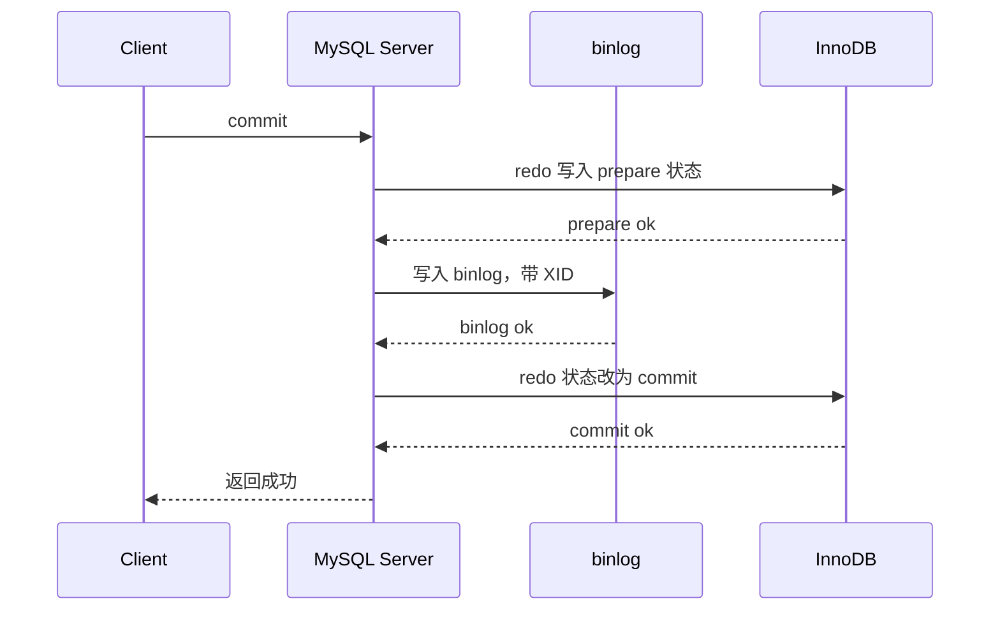
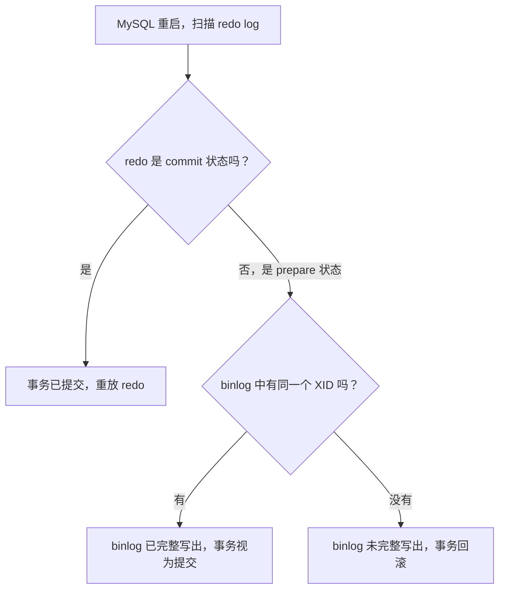

# MySQL - 第 18 课：一条 UPDATE 语句的完整执行链路：undo、Buffer Pool、redo、binlog 与两阶段提交

> 前面几课分别讲过 `redo log`、`binlog`、`undo log`、两阶段提交、MVCC、Buffer Pool 和锁。单独看每个点都不难，真正容易乱的是：一条 `update` 语句从客户端发出，到事务提交成功，中间这些组件到底按什么顺序参与？如果某个时间点 MySQL 崩溃，恢复时又怎么判断这笔事务该提交还是回滚？这一课把它们串成一条完整链路。

## 学习目标

- 能从一条 `update` 语句出发，讲清 Server 层和 InnoDB 层分别做了什么。
- 能解释 `undo log`、Buffer Pool、`redo log`、`binlog` 在更新链路中的先后关系。
- 能区分 `write`、`fsync`、redo log buffer、OS page cache、binlog cache 这些容易混淆的概念。
- 能说清 `innodb_flush_log_at_trx_commit` 和 `sync_binlog` 分别控制哪类日志的刷盘。
- 能用崩溃恢复窗口解释两阶段提交为什么必须存在。
- 能理解组提交为什么能降低磁盘 I/O，以及它用什么方式保证多事务提交顺序。

## 先给一张总图：UPDATE 不是“改一行”这么简单

假设执行这条语句：

```sql
update t_user
set name = 'xiaolin'
where id = 1;
```

如果 `id` 是主键，直觉上这好像只是：

```text
找到 id = 1 这一行 -> 把 name 改掉
```

但数据库真正要保证的是：

- 事务执行失败时，能回滚到旧值；
- 事务提交成功后，MySQL 崩溃也不能丢；
- 主库、从库、备份恢复链路看到的事务结果要一致；
- 修改数据时不能破坏并发事务的隔离性；
- 不能每次提交都随机刷整页数据，否则性能会很差。

所以一条 `update` 背后至少会牵出这几类东西：

```text
Server 层执行链路
  -> 连接器、解析器、预处理器、优化器、执行器

InnoDB 层更新链路
  -> Buffer Pool、undo log、redo log、锁、MVCC 版本链

提交与复制链路
  -> binlog、两阶段提交、组提交、主从复制、崩溃恢复
```

可以先把完整路径压缩成一句话：

**执行器通过索引找到记录，InnoDB 在 Buffer Pool 中改页，先写 undo 保留旧版本，再写 redo 保证崩溃恢复，Server 层记录 binlog，最后通过两阶段提交让 redo 和 binlog 对同一个事务达成一致。**

## 第一步：Server 层先把 SQL 走完执行骨架

`update` 和 `select` 一样，进入 MySQL 后先经过 Server 层。

大致流程是：

1. **连接器**：建立连接，校验用户身份和权限。
2. **查询缓存**：老版本 MySQL 会检查和维护查询缓存；MySQL 8.0 已经删除查询缓存。对于更新语句，即使老版本有查询缓存，也会让相关表的缓存失效。
3. **解析器**：做词法分析和语法分析，把 SQL 文本变成语法树。
4. **预处理器**：检查表、字段、别名等是否存在，做语义层面的校验。
5. **优化器**：选择访问路径，比如 `where id = 1` 应该走主键索引。
6. **执行器**：按执行计划调用存储引擎接口，真正去读写记录。

这一步里最重要的分层意识是：

```text
Server 层负责 SQL 语义、执行计划、binlog；
InnoDB 负责页、索引、事务、锁、undo、redo 和真实数据读写。
```

## 第二步：执行器通过索引找到要更新的行

优化器如果选择主键索引，执行器就会调用 InnoDB 接口，在聚簇索引 B+ 树中查找 `id = 1` 的记录。

这一步可能有两种情况：

- 数据页已经在 Buffer Pool 中：直接从内存页中定位记录。
- 数据页不在 Buffer Pool 中：先把磁盘中的 16KB 数据页读入 Buffer Pool，再在页内定位记录。

注意，InnoDB 的读写单位不是一行，而是页。默认页大小是 16KB。

所以你更新一行，本质上通常是：

```text
把包含这一行的整个数据页调入 Buffer Pool
在内存中的这个页上修改对应记录
后面再把这个页作为脏页刷回磁盘
```

如果更新前后的值完全一样，MySQL 可能不做真正的数据修改；如果确实变化，执行器会把旧记录和新记录交给 InnoDB，让 InnoDB 执行真正的更新。

## 第三步：更新前先写 undo log，给回滚和 MVCC 留后路

InnoDB 在修改记录之前，会先生成对应的 `undo log`。

对上面的语句来说，旧值可能是：

```text
id = 1, name = 'jay'
```

新值是：

```text
id = 1, name = 'xiaolin'
```

那么 undo 至少要能表达：

```text
如果事务回滚，需要把 name 从 'xiaolin' 改回 'jay'
```

这就是 `undo log` 的第一个职责：**保证事务原子性**。

事务执行过程中，如果后续发生错误、主动 `rollback`，或者崩溃恢复发现事务没有提交成功，InnoDB 就可以利用 undo 把已经做过的修改撤回来。

### undo 不只是回滚日志

`undo log` 还有第二个更容易被忽略的职责：**支撑 MVCC**。

InnoDB 的行记录里有两个和版本链密切相关的隐藏字段：

- `trx_id`：最后一次修改这行记录的事务 ID。
- `roll_pointer`：指向上一版本 undo 记录的指针。

多次更新同一行后，会形成类似这样的版本链：

```text
当前记录
  name = 'xiaolin', trx_id = 51, roll_pointer -> undo version

undo version
  name = 'jay', trx_id = 50, roll_pointer -> 更老版本
```

快照读时，事务会结合 Read View 判断当前版本是否可见。如果不可见，就沿着 `roll_pointer` 去 undo 版本链里找更老的版本。

所以 `undo log` 同时服务两个场景：

```text
回滚：把当前事务做过的修改撤掉。
MVCC：让其他事务能读到符合自己 Read View 的历史版本。
```

### insert、delete、update 的 undo 有什么区别

不同 DML 的 undo 目的不同：

- `insert`：记录新插入行的主键信息，回滚时删除这行。
- `delete`：记录被删除行的旧内容，回滚时恢复这行。
- `update`：记录被更新列的旧值，回滚时改回旧值。

其中 `delete` 在 InnoDB 中通常不是立刻物理删除，而是先打删除标记。等没有事务再需要它的历史版本时，purge 线程再清理。

如果 `update` 修改的是主键，情况更特殊：因为主键决定聚簇索引中的位置，InnoDB 可能把它处理成“删除旧记录 + 插入新记录”的组合。

### undo 页本身也要被 redo 保护

还有一个很关键但容易漏掉的点：

`undo log` 不是飘在内存里的抽象概念，它也存放在 undo 页里，而 undo 页同样会缓存在 Buffer Pool 中。

生成 undo 时，本质上也是修改了某个 undo 页。既然修改了内存页，就会变成脏页；既然脏页未来可能还没刷盘就宕机，那么 undo 页的修改也需要被 `redo log` 保护。

所以更新链路不是：

```text
写 undo -> 写 redo
```

这么简单，而更准确是：

```text
修改 undo 页 -> 记录 undo 页对应的 redo
修改数据页 -> 记录数据页对应的 redo
```

这也是为什么 `redo log` 负责的是 InnoDB 层“页修改”的崩溃恢复，而不只是用户表数据页。

## 第四步：在 Buffer Pool 中修改数据页，形成脏页

有了 undo 兜底，InnoDB 就可以修改 Buffer Pool 里的数据页了。

修改完成后，这个页会变成脏页：

```text
内存里的页：name = 'xiaolin'
磁盘里的页：name = 'jay'
```

也就是说，事务执行完这一刻，磁盘数据页不一定已经变了。

这并不危险，因为 InnoDB 会把“这个页被怎样改了”写进 `redo log`。只要 redo 已经按策略持久化，哪怕脏页还没刷盘，MySQL 崩溃后也能根据 redo 把修改重新做出来。

这就是 WAL：

```text
Write-Ahead Logging
先写日志，再择机刷数据页。
```

WAL 解决了两个问题：

- **性能问题**：事务提交时不用等随机的数据页刷盘。
- **安全问题**：提交成功后，即使脏页没刷盘，也能用 redo 恢复。

## 第五步：redo log 记录页的物理修改

`redo log` 是 InnoDB 的崩溃恢复日志。

它记录的不是：

```sql
update t_user set name = 'xiaolin' where id = 1;
```

而更接近：

```text
哪个表空间、哪个数据页、哪个偏移量，被改成了什么
```

所以它常被称为物理日志，或者偏物理的日志。

这和 `binlog` 的定位完全不同：

- `redo log` 让 InnoDB 在崩溃后恢复自己的页状态。
- `binlog` 让 Server 层做归档、复制、按时间点恢复。

### redo 写到哪里

事务执行过程中，redo 先写到内存中的 `redo log buffer`。

然后可能经历两个动作：

- `write`：写到操作系统文件系统的 page cache。
- `fsync`：真正把 page cache 刷到磁盘。

很多 MySQL 刷盘问题，都是因为把这两个动作混在一起了。

```text
redo log buffer
  -> write 到 OS page cache
  -> fsync 到磁盘 redo log 文件
```

只执行 `write`，不代表真正落盘。机器掉电、OS 崩溃时，page cache 里的内容仍可能丢失。

### innodb_flush_log_at_trx_commit 控制什么

`innodb_flush_log_at_trx_commit` 控制事务提交时 redo 的写盘策略。

| 参数值 | 提交时动作 | 后台动作 | 风险 | 性能 |
| --- | --- | --- | --- | --- |
| `0` | 不主动 write，也不主动 fsync | 后台线程大约每秒 write + fsync | MySQL 进程崩溃或机器宕机都可能丢近 1 秒事务 | 最好 |
| `1` | write + fsync | 后台仍会做其他日志维护 | 已返回成功的事务最安全 | 最差 |
| `2` | write 到 OS page cache，不 fsync | 后台线程大约每秒 fsync | MySQL 进程崩溃通常不丢，机器宕机可能丢近 1 秒 | 折中 |

生产里如果业务强依赖事务持久性，优先选择：

```ini
innodb_flush_log_at_trx_commit = 1
```

如果为了吞吐改成 `2` 或 `0`，一定要明确业务能承受什么级别的数据丢失。

### redo log 为什么是环形空间

传统资料里经常会看到 `ib_logfile0`、`ib_logfile1` 这样的 redo 文件组。新版本 MySQL 对 redo 文件布局做过调整，但核心模型没有变：**redo 空间是有限的，会循环复用**。

这里有两个重要位置：

- `write pos`：新 redo 写到哪里了。
- `checkpoint`：哪些 redo 对应的脏页已经刷盘，日志可以被覆盖到哪里。

可以这样理解：

```text
checkpoint 之前：对应脏页已经落盘，redo 可以复用
checkpoint 到 write pos 之间：对应脏页还没完全落盘，redo 不能覆盖
write pos 之后：空闲空间，可以写新 redo
```

如果 `write pos` 快追上 `checkpoint`，说明 redo 空间快写满了。InnoDB 必须加快刷脏页、推进 checkpoint，腾出 redo 空间。

这时前台更新可能被拖慢，严重时会出现写入阻塞。也就是说：

```text
redo log 写满，不是日志文件真的“无限增长到满磁盘”，而是可复用空间不够，需要先刷脏页推进 checkpoint。
```

## 第六步：Server 层记录 binlog

InnoDB 完成记录修改后，Server 层还要记录 `binlog`。

`binlog` 是 MySQL Server 层的归档日志，核心用途有两个：

- 主从复制：主库把 binlog 发给从库，从库重放。
- 数据恢复：全量备份 + binlog 可以做按时间点恢复。

对事务表来说，事务执行期间产生的 binlog 通常先写入当前连接自己的 `binlog cache`。等事务提交时，再把这个事务的 binlog 一次性写到 binlog 文件。

这和 redo 的区别很重要：

```text
redo log buffer：InnoDB 层，服务崩溃恢复。
binlog cache：Server 层，服务归档与复制。
```

### sync_binlog 控制什么

`sync_binlog` 控制事务提交时 binlog 的刷盘策略。

| 参数值 | 含义 | 风险 |
| --- | --- | --- |
| `0` | 每次提交只 write，不主动 fsync，交给操作系统决定何时落盘 | 机器宕机可能丢失尚未落盘的 binlog |
| `1` | 每次提交都 write + fsync | 最安全，I/O 成本最高 |
| `N > 1` | 每次提交都 write，累计 N 次后 fsync | 机器宕机可能丢失最近一批 binlog |

如果业务要求主从复制和备份链路尽可能不丢已提交事务，通常会使用：

```ini
sync_binlog = 1
```

如果为了写入吞吐把它设置成 `100` 或 `1000`，本质上是在用“可能丢一批 binlog”的风险换性能。

## 第七步：提交阶段必须让 redo 和 binlog 对齐

现在问题来了：

- `redo log` 决定主库崩溃后自己能恢复到什么状态。
- `binlog` 决定从库和备份链路能看到哪些事务。

如果它们不一致，会发生非常危险的事。

假设原始值是：

```text
id = 1, name = 'jay'
```

事务要改成：

```text
id = 1, name = 'xiaolin'
```

如果 redo 已经落盘，但 binlog 没写成功就崩了：

```text
主库重启：根据 redo 恢复出 xiaolin
从库/备份：因为没有 binlog，仍然是 jay
```

如果 binlog 已经落盘，但 redo 没写成功就崩了：

```text
主库重启：恢复不出 xiaolin，仍然是 jay
从库/备份：根据 binlog 得到 xiaolin
```

所以问题不是“先写谁”就能解决，而是：

**崩溃恢复时必须能明确判断：这个事务到底应该提交，还是应该回滚。**

这就是两阶段提交要解决的问题。

## 两阶段提交：把 redo 拆成 prepare 和 commit

在开启 binlog 的情况下，MySQL 使用内部 XA 事务来协调 Server 层 binlog 和 InnoDB 层 redo。

可以把 binlog 看成协调者，把 InnoDB 看成参与者。

提交过程分成两段：



更具体地说：

1. **prepare 阶段**
   - InnoDB 把事务对应的 redo 写成 `prepare` 状态。
   - redo 中记录内部 XA 事务 ID，也就是 XID。
   - 如果 `innodb_flush_log_at_trx_commit=1`，这里会把 redo 持久化到磁盘。

2. **commit 阶段**
   - Server 层把带有同一个 XID 的 binlog 写入 binlog 文件。
   - 如果 `sync_binlog=1`，这里会把 binlog 持久化到磁盘。
   - Server 调用 InnoDB 提交接口，把 redo 状态改成 `commit`。

注意最后一步把 redo 改成 `commit`，通常不需要再单独强制 fsync 一次。因为只要 binlog 已经完整持久化，即使重启时看到 redo 仍是 `prepare`，也可以通过 binlog 中是否有同一个 XID 来判断事务应提交。

## 崩溃恢复：prepare 状态不一定回滚

两阶段提交最容易考的地方是崩溃窗口。

恢复逻辑可以简化成这样：



也就是说：

```text
redo prepare + 没有 binlog  -> 回滚
redo prepare + 完整 binlog  -> 提交
redo commit                 -> 提交
```

这就是为什么不能简单说：

```text
redo 是 prepare，就一定回滚
```

真正的判断依据是：

```text
是否存在与 prepare redo 匹配且完整的 binlog。
```

### 为什么 binlog 成了提交成功的关键证据

因为 binlog 一旦完整写出，后续可能会被从库拉走，也可能被备份恢复链路使用。

如果主库重启后把这个事务回滚，而从库或备份链路却已经根据 binlog 应用了这个事务，就会产生不一致。

所以 MySQL 的策略是：

```text
只要 redo 已 prepare，且 binlog 中存在同 XID 的完整事务记录，就认定事务提交。
```

这保证了：

```text
主库本地恢复结果
和
binlog 代表的外部世界事务集合
保持一致。
```

## 事务没提交，redo 也可能已经刷盘

很多人会问：

> 如果事务还没提交，redo 就被后台线程刷到磁盘了，崩溃恢复时不会把未提交事务也恢复出来吗？

不会。

原因是事务是否提交，不是只看 redo 内容在不在磁盘，还要看事务状态和 binlog。

未提交事务的 redo 可能已经落盘，但它还没有完整走完提交流程。崩溃恢复时，InnoDB 会结合 undo 和事务状态把未提交事务回滚掉。

所以要分清两个概念：

```text
redo 已落盘：说明页修改有恢复依据。
事务已提交：说明这次修改最终应该对外生效。
```

两者不是一回事。

## 一条 UPDATE 的完整时间线

把前面的内容合起来，一条更新大致可以这样走：

| 阶段 | 位置 | 做了什么 | 关键点 |
| --- | --- | --- | --- |
| 1 | Server | 连接、解析、预处理、优化 | 决定访问路径，比如走主键索引 |
| 2 | InnoDB | 通过 B+ 树找到目标记录 | 数据页不在 Buffer Pool 时先读入 |
| 3 | InnoDB | 加锁并读取当前版本 | `update` 是当前读，会加 X 锁 |
| 4 | InnoDB | 生成 undo | 保存旧版本，支持回滚和 MVCC |
| 5 | InnoDB | 修改 undo 页 | undo 页变化也要写 redo |
| 6 | InnoDB | 修改数据页 | Buffer Pool 中的页变成脏页 |
| 7 | InnoDB | 写 redo log buffer | 记录页的物理修改 |
| 8 | Server | 生成 binlog 到 binlog cache | 事务提交时统一写入 binlog 文件 |
| 9 | 提交 | redo prepare | InnoDB 准备提交 |
| 10 | 提交 | 写 binlog | Server 层归档事务，带 XID |
| 11 | 提交 | redo commit | InnoDB 正式提交事务 |
| 12 | 后台 | 刷脏页 | 数据页最终落盘，推进 checkpoint |

一句话再压缩：

```text
先有旧版本可退（undo），再有页修改可恢复（redo），再有外部归档可复制（binlog），最后用两阶段提交把 redo 和 binlog 对齐。
```

## redo log 和 binlog 到底有什么区别

这两个日志太容易混在一起，单独列一张表。

| 维度 | redo log | binlog |
| --- | --- | --- |
| 所属层级 | InnoDB 存储引擎层 | MySQL Server 层 |
| 日志性质 | 偏物理日志，记录页级修改 | 逻辑归档日志，记录 SQL 或行变更 |
| 主要用途 | 崩溃恢复，保证已提交事务不因脏页未刷盘而丢失 | 主从复制、按时间点恢复、审计归档 |
| 写入方式 | 环形空间，循环复用 | 追加写，按文件滚动 |
| 是否所有引擎都有 | InnoDB 特有 | Server 层提供，所有引擎都可产生 |
| 是否能替代对方 | 不能 | 不能 |

为什么不能只留一个？

- 只有 redo：主库能恢复，但没有完整归档和复制语义，无法给从库重放，也不适合做全量备份后的时间点恢复。
- 只有 binlog：复制和归档有了，但 InnoDB 无法高效恢复脏页，也不能用 WAL 避免每次提交都刷数据页。

## 组提交：把多次 fsync 合成一次

两阶段提交虽然保证一致性，但也带来性能压力。

如果配置成“双 1”：

```ini
innodb_flush_log_at_trx_commit = 1
sync_binlog = 1
```

那么每个事务提交时，至少会涉及：

- redo 的 fsync；
- binlog 的 fsync。

`fsync` 是昂贵操作。如果每个事务都单独刷盘，并发写入性能会很差。

于是 MySQL 引入了组提交：**把一批同时提交的事务合并，尽量用一次 fsync 完成一组事务的刷盘。**

可以把它理解成：

```text
不是每个事务自己坐一辆车过河，
而是大家排队，凑一船一起过。
```

### 组提交的三个阶段

现代 MySQL 的提交过程可以分成三个队列阶段：

1. **flush 阶段**
   - 一组事务进入队列。
   - Leader 负责把这组事务的 redo 推到 prepare。
   - 把这组事务的 binlog 从各自的 binlog cache 写到 binlog 文件。
   - 这里通常是 write，不一定 fsync。

2. **sync 阶段**
   - 对 binlog 文件做 fsync。
   - 多个事务的 binlog 可以合并成一次刷盘。
   - 这一步是 binlog 组提交的核心收益。

3. **commit 阶段**
   - 按顺序调用 InnoDB commit。
   - 把 redo 状态从 prepare 改为 commit。
   - 完成后通知队列里的事务返回。

用 mermaid 表达就是：


每个阶段都有队列和 leader/follower 角色：

- 第一个进入队列的事务成为 leader。
- leader 负责带着这一组事务完成当前阶段。
- follower 等 leader 完成后继续往后走。

这样做有两个好处：

- 多个事务共享一次刷盘，降低 I/O 次数。
- 提交过程按队列顺序推进，保证 binlog 顺序和 InnoDB 提交顺序一致。

### 组提交相关参数

如果想增强 binlog 组提交效果，可以看两个参数：

```ini
binlog_group_commit_sync_delay
binlog_group_commit_sync_no_delay_count
```

含义是：

- `binlog_group_commit_sync_delay`：sync 阶段最多等待多少微秒，尽量等更多事务凑成一组。
- `binlog_group_commit_sync_no_delay_count`：如果队列里事务数达到这个值，就不再等，直接 fsync。

这是一种明确的取舍：

```text
稍微增加单个事务等待时间
换取更多事务合并刷盘
降低总体 I/O 压力
```

适合写入并发高、可以接受极小提交延迟的场景。

## MySQL 磁盘 I/O 高时，可以从哪些方向优化

如果写入压力大、磁盘 I/O 很高，常见调优方向有三类。

### 1. 调整组提交等待

通过：

```ini
binlog_group_commit_sync_delay
binlog_group_commit_sync_no_delay_count
```

让更多事务合并成一组，减少 binlog fsync 次数。

优点：

- 一般不牺牲已提交事务的安全性；
- 主要增加一点提交等待时间；
- 对高并发写入更有效。

### 2. 放宽 binlog 刷盘

比如：

```ini
sync_binlog = 100
```

表示不是每个事务都 fsync binlog，而是累计一批再刷。

代价是：

- MySQL 进程崩溃时，OS page cache 通常还在，风险较小；
- 机器宕机或 OS 崩溃时，最近一批 binlog 可能丢失；
- 对主从复制和按时间点恢复有影响。

### 3. 放宽 redo 刷盘

比如：

```ini
innodb_flush_log_at_trx_commit = 2
```

表示每次提交把 redo write 到 OS page cache，但不立刻 fsync。

代价是：

- MySQL 进程崩溃通常还可以依赖 OS page cache；
- 机器掉电或 OS 崩溃时，最近约 1 秒提交可能丢失。

### 生产建议

如果是核心交易、余额、订单状态这类强一致业务，优先用安全配置：

```ini
innodb_flush_log_at_trx_commit = 1
sync_binlog = 1
```

再从硬件、批量写入、SQL 设计、事务长度、组提交参数上优化。

如果是日志、埋点、可补偿数据，才考虑放宽刷盘策略。否则你调优得到的不是“性能”，而是“把数据丢失风险藏起来”。

## 高频面试追问

### 1. 已提交事务对应的数据页没刷盘，MySQL 崩溃会丢吗？

正常不会。

只要事务提交成功所需的 redo 已经按策略落盘，数据页即使还在 Buffer Pool 中、没有刷回磁盘，重启后也可以用 redo 重放恢复。

### 2. redo 已经 prepare，但 binlog 没写完，崩溃后怎么办？

回滚。

恢复时发现 redo 是 prepare，但 binlog 中找不到同 XID 的完整事务记录，说明这笔事务没有走完提交流程。

### 3. binlog 已经写完，但 redo 还没 commit，崩溃后怎么办？

提交。

恢复时发现 redo 是 prepare，但 binlog 中能找到同 XID 的完整事务记录，说明这笔事务已经对外归档，主库也必须提交，才能和从库、备份链路一致。

### 4. 为什么不直接每次 update 都刷数据页？

因为数据页通常是随机写，而且一页默认 16KB，你可能只改了几个字节，却要刷整页。

WAL 通过先写更小、更顺序的 redo，让事务提交不用等待真实数据页落盘。

### 5. `sync_binlog=1` 和 `innodb_flush_log_at_trx_commit=1` 是一回事吗？

不是。

- `sync_binlog=1` 管的是 binlog，每次提交都把 binlog fsync 到磁盘。
- `innodb_flush_log_at_trx_commit=1` 管的是 redo，每次提交都把 redo fsync 到磁盘。

一个保证复制/归档链路更安全，一个保证 InnoDB 本地崩溃恢复更安全。强一致场景通常两个都要关注。

### 6. 为什么有了两阶段提交，还需要组提交？

两阶段提交解决一致性问题，组提交解决性能问题。

没有两阶段提交，redo 和 binlog 可能不一致；没有组提交，高并发下每个事务都单独 fsync，I/O 成本太高。

## 小结

- 一条 `update` 不是简单地“改一行”，而是经过 Server 层执行链路，再进入 InnoDB 的页、锁、事务和日志体系。
- `undo log` 保存旧版本，既能回滚，也能支撑 MVCC；undo 页本身的修改也需要 redo 保护。
- Buffer Pool 让更新先发生在内存页中，形成脏页；脏页稍后刷盘，事务提交不必等待真实数据页落盘。
- `redo log` 是 InnoDB 的崩溃恢复日志，配合 WAL 保证已提交事务不因脏页未刷盘而丢失。
- `binlog` 是 Server 层归档日志，服务主从复制和按时间点恢复。
- 两阶段提交通过 `redo prepare -> 写 binlog -> redo commit`，保证主库恢复结果和 binlog 代表的外部事务集合一致。
- 组提交把多事务刷盘合并，减少 fsync 次数，是两阶段提交高并发性能优化的关键机制。

## 问题

1. 一条 `update` 语句为什么要先生成 undo，再修改 Buffer Pool 中的数据页？
2. 为什么 undo 页的修改也需要 redo log 保护？
3. `redo log buffer`、OS page cache、redo log 文件三者有什么区别？
4. `innodb_flush_log_at_trx_commit=0/1/2` 分别在提交时做了什么，机器宕机时分别可能丢什么？
5. `sync_binlog=0/1/N` 分别有什么性能和安全取舍？
6. 为什么 `redo prepare + 完整 binlog` 在崩溃恢复时会被判定为提交，而不是回滚？
7. 两阶段提交解决一致性问题，组提交解决性能问题。你能分别用一个崩溃场景和一个高并发写入场景解释这句话吗？
