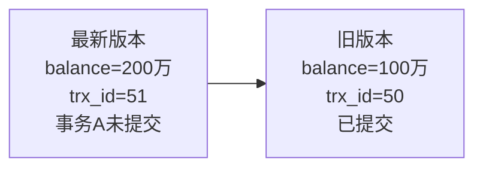

# MySQL - 第 20 课：事务隔离与 MVCC：ACID、并发异常、Read View 与快照读

## 学习目标（本节结束后你能做到什么）

- 能用转账场景解释事务为什么需要原子性、一致性、隔离性和持久性。
- 能区分脏读、不可重复读、幻读，以及它们分别由什么并发时序触发。
- 能说清四种隔离级别：读未提交、读已提交、可重复读、串行化。
- 能理解快照读和当前读的差异，知道 MVCC 主要服务于普通 `select` 这类快照读。
- 能掌握 Read View 的四个字段，以及一条记录版本对当前事务是否可见的判断规则。
- 能推导读已提交和可重复读为什么只是 Read View 创建时机不同，却表现出完全不同的读取结果。

## 1. 从转账看事务为什么存在

假设小林的钱包里有 100 万，现在要给你转 100 万。

从业务上看，这件事只有一个结果才是正确的：

- 小林的余额减少 100 万。
- 你的余额增加 100 万。
- 两个人的钱加起来，总额不变。

如果拆成数据库操作，大概是：

```sql
-- 伪代码
select balance from account where user_id = 'xiaolin';
update account set balance = balance - 1000000 where user_id = 'xiaolin';

select balance from account where user_id = 'you';
update account set balance = balance + 1000000 where user_id = 'you';
```

如果在扣掉小林的钱之后，服务器突然宕机，还没来得及给你加钱，就会出现非常糟糕的中间状态：

- 小林少了 100 万。
- 你没有收到 100 万。
- 系统里的钱凭空少了。

这就是事务要解决的问题：

**一组数据库操作必须作为一个整体执行，要么全部成功，要么全部失败，不能让外界看到半成品状态。**

在 MySQL 里，常用的 InnoDB 引擎支持事务；MyISAM 这类老引擎不支持事务，所以现代业务表几乎默认使用 InnoDB。

## 2. ACID 不是四个孤立名词

事务的四个特性叫 ACID：

- `Atomicity`：原子性
- `Consistency`：一致性
- `Isolation`：隔离性
- `Durability`：持久性

很多人会背，但背完还是不知道这些特性分别由什么机制支撑。更好的方式是把它们放回一次转账里看。

### 2.1 原子性：要么全做，要么全不做

原子性要求事务不能停在中间状态。

比如转账事务包含两次更新：

1. 扣小林的钱。
2. 加你的钱。

如果第二步失败，第一步也必须撤销。

在 InnoDB 里，原子性主要依赖 `undo log`。事务修改一行之前，会记录足以把数据恢复到旧状态的信息。事务回滚时，InnoDB 就能根据 `undo log` 把数据“倒回去”。

所以：

**`undo log` 不是只为了 MVCC，它首先是事务回滚的基础。**

### 2.2 持久性：提交后的修改不能丢

持久性要求事务一旦提交成功，即使数据库宕机，重启后也不能丢掉这次修改。

InnoDB 通过 `redo log` 保证持久性。事务修改数据页时，通常不会立刻把完整数据页刷到磁盘，而是先写 `redo log`。宕机恢复时，只要 `redo log` 里有足够的信息，就能把已经提交的修改重新做出来。

所以：

**`redo log` 解决的是“提交后的修改别丢”。**

### 2.3 隔离性：并发事务看起来不能互相乱入

隔离性要求多个事务并发执行时，彼此不能随意读到对方不该暴露的数据。

InnoDB 主要通过两类机制实现隔离：

- MVCC：让普通 `select` 可以读到一致快照。
- 锁：让当前读、更新、删除等操作控制并发冲突。

这节课的重点就是隔离性，尤其是 MVCC 和 Read View。

### 2.4 一致性：业务约束前后都成立

一致性是 ACID 里最容易被讲虚的一个。

它不是单独靠某一种日志实现的，而是指事务执行前后，数据都满足约束和业务规则。

比如转账前两个人总余额是 100 万，转账后总余额也应该还是 100 万。不能扣了钱没到账，不能到账了没扣钱，也不能余额变成负数还没人管。

InnoDB 能提供原子性、隔离性、持久性这些基础能力，但一致性还依赖：

- 表结构约束，比如主键、唯一键、外键、`not null`。
- 业务代码约束，比如余额不能小于 0。
- 正确的事务边界，比如扣款和入账必须放在同一个事务里。

可以这样记：

**数据库提供 ACID 能力，业务负责把正确规则放进事务里。**

## 3. 并发事务会引发哪些问题

MySQL 可以同时服务多个客户端，也就意味着多个事务可能同时读写同一批数据。

并发事务最经典的三个读异常是：

- 脏读：读到了未提交的数据。
- 不可重复读：同一个事务内，两次读同一行，结果不同。
- 幻读：同一个事务内，两次按同一条件查询，结果集行数或成员不同。

这三个问题都和“一个事务看到另一个事务的修改时机”有关。

### 3.1 脏读：读到了别人还没提交的修改

脏读的定义是：

**一个事务读到了另一个事务未提交的修改。**

例子：

```text
事务 A：把小林余额从 100 万改成 200 万，但还没提交
事务 B：读取小林余额，读到了 200 万
事务 A：回滚，余额恢复成 100 万
```

事务 B 读到的 200 万从来没有真正提交过，这个数据就是“脏”的。

脏读最危险，因为它读到的是可能随时消失的中间状态。

### 3.2 不可重复读：同一行前后读到不同值

不可重复读的定义是：

**一个事务内多次读取同一行，前后读到的数据不一致。**

例子：

```text
事务 A：第一次读取小林余额，读到 100 万
事务 B：把小林余额改成 200 万，并提交
事务 A：第二次读取小林余额，读到 200 万
```

事务 A 自己没有提交，也没有结束，但前后两次读同一行，结果变了。

这不一定代表数据是脏的，因为事务 B 已经提交了；问题在于事务 A 没有拿到一个稳定的事务内视图。

### 3.3 幻读：同一条件前后读到不同结果集

幻读的定义是：

**一个事务内多次按同一个查询条件读取，前后结果集的成员或数量发生变化。**

例子：

```sql
-- 事务 A 第一次查
select count(*) from account where balance > 1000000;
-- 返回 5

-- 事务 B 插入一条 balance > 1000000 的记录并提交

-- 事务 A 第二次查
select count(*) from account where balance > 1000000;
-- 返回 6
```

事务 A 明明用的是同一个条件，却像看到了“凭空出现”的记录，这就是幻读。

注意，幻读不只可能由 `insert` 导致，也可能由 `delete` 或 `update` 导致：

- `insert`：结果集变多。
- `delete`：结果集变少。
- `update`：某行进入或离开查询范围。

第 14 课已经从当前读和 next-key lock 的角度讲过这件事，这里会从快照读和 MVCC 的角度补上另一半。

### 3.4 顺手补一个：丢失更新

脏读、不可重复读、幻读是隔离级别里最常见的三类读异常，但实际业务里还常见“丢失更新”。

例子：

```text
余额初始值：100

事务 A：读取余额 100，准备 +10
事务 B：读取余额 100，准备 +20
事务 A：写回 110
事务 B：写回 120
```

最终余额是 120，而不是 130。事务 A 的修改被事务 B 覆盖了。

这类问题不能只靠“普通 select + 应用层计算 + update 写回”来赌，通常要使用：

- 原子更新：`update account set balance = balance + 10 where id = 1`
- 乐观锁版本号：`where id = 1 and version = ?`
- 悲观锁：`select ... for update`
- 唯一约束、幂等表、状态机约束

MVCC 让读更并发，但不代表所有写冲突都自动变安全。

## 4. 四种隔离级别

SQL 标准定义了四种隔离级别，隔离性从弱到强依次是：

1. 读未提交（Read Uncommitted，RU）
2. 读已提交（Read Committed，RC）
3. 可重复读（Repeatable Read，RR）
4. 串行化（Serializable）

隔离级别越高，允许的并发越少，性能成本通常越高。

| 隔离级别 | 是否可能脏读 | 是否可能不可重复读 | 是否可能幻读 | 大致实现思路 |
| --- | --- | --- | --- | --- |
| 读未提交 RU | 可能 | 可能 | 可能 | 直接读最新版本，甚至可见未提交修改 |
| 读已提交 RC | 不可能 | 可能 | 可能 | 每条一致性读语句生成新的 Read View |
| 可重复读 RR | 不可能 | 不可能 | SQL 标准认为可能，InnoDB 大幅避免 | 事务内复用同一个 Read View；当前读配合 next-key lock |
| 串行化 | 不可能 | 不可能 | 不可能 | 通过更强的读写锁把并发读写串行化 |

MySQL InnoDB 默认隔离级别是 `REPEATABLE READ`。

可以通过下面的语句查看：

```sql
select @@transaction_isolation;
```

也可以设置当前会话的隔离级别：

```sql
set session transaction isolation level read committed;
set session transaction isolation level repeatable read;
```

## 5. InnoDB 如何实现这些隔离级别

四种隔离级别的实现方式不完全一样。

### 5.1 读未提交：直接读最新数据

读未提交允许读到其他事务未提交的数据，所以它不需要为普通读构造稳定快照。

它的问题很明显：可能读到别人后续会回滚的数据。

业务系统一般很少使用这个隔离级别。

### 5.2 串行化：用锁减少并发

串行化隔离级别会让读写冲突变得更严格。

普通读也可能加共享锁，写操作加排他锁。这样事务之间更像排队执行，读写冲突会被阻塞。

它安全，但并发性能最差。

### 5.3 读已提交和可重复读：靠 Read View + 版本链

读已提交和可重复读是最常用、也最值得理解的两个隔离级别。

它们都依赖 MVCC：

- 每行记录有事务相关隐藏字段。
- 每次修改会通过 `undo log` 串出旧版本链。
- 普通 `select` 会基于 Read View 判断哪个版本对自己可见。

两者最大的区别是：

**Read View 创建时机不同。**

- RC：每条一致性读语句都会创建新的 Read View。
- RR：事务里第一次一致性读创建 Read View，后续一致性读复用它。

这个差异就是“读已提交会不可重复读，而可重复读能保持同一事务内普通读稳定”的核心原因。

## 6. 快照读和当前读

在继续讲 MVCC 前，必须先分清两种读。

### 6.1 快照读

普通 `select` 通常是快照读：

```sql
select * from account where id = 1;
```

快照读读到的不是“物理上最新版本”，而是“对当前 Read View 可见的版本”。

它的优势是读写并发好：

- 别人正在修改，你依然可以读旧版本。
- 你普通读取，不需要阻塞别人写。
- 你也不会读到别人未提交的脏版本。

### 6.2 当前读

当前读要读最新版本，并且通常要加锁。

常见当前读包括：

```sql
select * from account where id = 1 for update;
select * from account where id = 1 lock in share mode; -- MySQL 8.0 也可以用 for share
update account set balance = balance - 100 where id = 1;
delete from account where id = 1;
insert into account(id, balance) values(1, 100);
```

当前读关注的是“我要基于当前最新数据做判断或修改”，所以不能只读历史快照。

这也是为什么：

- 快照读主要靠 MVCC。
- 当前读主要靠锁。

一旦把两者混在一个事务里，就可能出现看似“可重复读失效”的现象。比如事务里普通 `select` 看不到别人提交的新行，但后续 `select ... for update` 可能读到最新版本并加锁。

## 7. MVCC 的三块拼图

MVCC，全称 Multi-Version Concurrency Control，多版本并发控制。

它的核心想法是：

**同一行数据可以保留多个历史版本，不同事务根据自己的 Read View 读取对自己可见的那个版本。**

在 InnoDB 里，MVCC 至少依赖三块拼图：

1. 记录里的隐藏字段。
2. `undo log` 形成的版本链。
3. Read View 的可见性规则。

### 7.1 记录里的隐藏字段

InnoDB 的聚簇索引记录里，除了业务列，还会有一些隐藏字段。

这里最关键的是：

- `trx_id`：最后一次修改这条记录的事务 id。
- `roll_pointer`：指向旧版本所在的 `undo log`。

如果表没有显式主键，InnoDB 还可能生成隐藏的 `row_id` 来组织聚簇索引。这在第 19 课行格式里已经提过。

### 7.2 undo 版本链

假设一条记录初始是：

```text
balance = 100 万, trx_id = 50
```

事务 A 的事务 id 是 51，它把余额改成 200 万。

修改后，当前记录变成：

```text
balance = 200 万, trx_id = 51
```

同时，旧版本会通过 `undo log` 保存，并由当前记录的 `roll_pointer` 指过去：


如果当前版本对某个事务不可见，它就会顺着 `roll_pointer` 往旧版本找，直到找到一个可见版本。

### 7.3 Read View

Read View 可以理解成：

**一个事务做快照读时，对“哪些事务的修改可见、哪些事务的修改不可见”的判断依据。**

它不是把整张表复制了一份，也不是把结果集缓存起来。

它只保存一些事务 id 信息，后续读每一行时，都拿行版本的 `trx_id` 去和 Read View 做判断。

## 8. Read View 的四个字段

Read View 里最重要的四个字段是：

| 字段 | 含义 |
| --- | --- |
| `creator_trx_id` | 创建这个 Read View 的事务 id |
| `m_ids` | 创建 Read View 时，数据库中活跃且未提交的事务 id 列表，不包含当前事务自身 |
| `min_trx_id` | `m_ids` 中最小的事务 id；如果 `m_ids` 为空，一般可理解为等于 `max_trx_id` |
| `max_trx_id` | 创建 Read View 时，下一个将要分配的事务 id，不是 `m_ids` 的最大值 |

这里最容易错的是 `max_trx_id`。

它不是活跃事务列表中的最大事务 id，而是“下一个事务 id”。换句话说：

- 小于 `max_trx_id` 的事务 id，可能在 Read View 创建前就已经存在。
- 大于等于 `max_trx_id` 的事务 id，一定是在 Read View 创建后才出现。

源码里字段名有一点反直觉：

- `m_up_limit_id` 大致对应我们讲解中的 `min_trx_id`。
- `m_low_limit_id` 大致对应我们讲解中的 `max_trx_id`。
- `m_creator_trx_id` 对应 `creator_trx_id`。

这里的 `up` / `low` 是从内部边界含义出发命名的，不要按中文“高低大小”死扣。学习和面试时，用 `min_trx_id` / `max_trx_id` 这套解释更直观。

## 9. 可见性判断规则

当事务读取一条记录版本时，会拿这个版本的 `trx_id` 和 Read View 比较。

可以用下面的伪代码记：

```text
如果 row.trx_id == creator_trx_id：
    可见，因为这是当前事务自己改的
否则如果 row.trx_id < min_trx_id：
    可见，因为它在 Read View 创建前就已经提交
否则如果 row.trx_id >= max_trx_id：
    不可见，因为它是 Read View 创建后才出现的事务
否则：
    row.trx_id 位于 [min_trx_id, max_trx_id)
    如果 row.trx_id 在 m_ids 中：
        不可见，因为创建 Read View 时它仍未提交
    如果 row.trx_id 不在 m_ids 中：
        可见，因为创建 Read View 时它已经提交
```

画成事务 id 数轴就是：

```text
更小的事务 id                                          更大的事务 id
|-------------------|---------------------------|-------------------|
   < min_trx_id        [min_trx_id, max_trx_id)       >= max_trx_id
      可见                  需要查 m_ids                  不可见
```

特殊规则：

**当前事务自己修改过的数据，对自己永远可见。**

否则你在一个事务里刚插入一行，自己后面却查不到，就没法正常写业务了。

## 10. 用一个例子推导 Read View

假设小林账户的初始版本是：

```text
balance = 100 万
trx_id = 50
```

然后两个事务启动：

- 事务 A：事务 id = 51
- 事务 B：事务 id = 52

事务 A 把余额改成 200 万，但暂时不提交。

此时版本链是：



如果事务 B 创建 Read View 时，事务 A 还没有提交，那么事务 B 的 Read View 大致是：

```text
creator_trx_id = 52
m_ids          = [51]
min_trx_id     = 51
max_trx_id     = 53
```

事务 B 读取这行时，先看到最新版本：

```text
trx_id = 51
```

判断过程：

- `51 == creator_trx_id(52)`：不成立，不是自己改的。
- `51 < min_trx_id(51)`：不成立，不是更早已提交事务。
- `51 >= max_trx_id(53)`：不成立，不是 Read View 之后才出现的事务。
- `51` 在 `m_ids=[51]` 中：成立，说明创建 Read View 时事务 A 仍活跃未提交。

所以最新版本不可见。

事务 B 会沿着 `roll_pointer` 找旧版本：

```text
trx_id = 50
```

这时：

```text
50 < min_trx_id(51)
```

旧版本可见，所以事务 B 读到的是 100 万。

这就是 MVCC 的核心动作：

**不是把读阻塞住，而是从版本链里找一个对当前事务可见的版本。**

## 11. 读已提交是怎么工作的

读已提交（RC）的规则是：

**每条一致性读语句都会创建新的 Read View。**

还是上面的例子。

### 11.1 事务 A 未提交时，事务 B 读取

事务 A 还没提交，事务 B 第一次读取时创建 Read View：

```text
creator_trx_id = 52
m_ids          = [51]
min_trx_id     = 51
max_trx_id     = 53
```

事务 B 看到最新版本 `trx_id=51`，发现它在 `m_ids` 里，所以不可见，于是读旧版本 `trx_id=50`，余额是 100 万。

这保证了读已提交不会发生脏读。

### 11.2 事务 A 提交后，事务 B 再次读取

事务 A 提交后，事务 B 再执行一次普通 `select`。

由于 RC 每条语句都会创建新的 Read View，这次新的 Read View 里，事务 A 已经不是活跃事务，不会出现在 `m_ids` 中。

可以近似理解为：

```text
creator_trx_id = 52
m_ids          = []
min_trx_id     = 53
max_trx_id     = 53
```

事务 B 看到最新版本 `trx_id=51`：

```text
51 < min_trx_id(53)
```

所以这个版本可见，事务 B 读到 200 万。

这就是 RC 的特点：

- 不读未提交，所以不会脏读。
- 每次语句看到的是当时已经提交的数据，所以同一个事务内前后两次普通读可能不同。

也就是说，RC 允许不可重复读。

## 12. 可重复读是怎么工作的

可重复读（RR）的规则是：

**事务内第一次一致性读创建 Read View，后续一致性读复用同一个 Read View。**

还是上面的例子。

事务 B 第一次读取时，事务 A 还未提交，创建的 Read View 是：

```text
creator_trx_id = 52
m_ids          = [51]
min_trx_id     = 51
max_trx_id     = 53
```

事务 A 后来提交了，但事务 B 后续普通 `select` 仍然使用第一次创建的这个 Read View。

所以事务 B 再读最新版本 `trx_id=51` 时，仍然会发现：

```text
51 在 m_ids=[51] 中
```

对这个 Read View 来说，事务 A 在快照创建时还是活跃未提交的，因此 `trx_id=51` 的版本依然不可见。事务 B 继续沿版本链读 `trx_id=50` 的旧版本，看到的还是 100 万。

这就是可重复读：

**事务内多次快照读，看到的是同一个快照视角。**

### 12.1 “启动事务时生成 Read View”要怎么理解

很多文章会说：

> RR 在事务启动时生成 Read View。

这句话适合理解语义，但要补一个实现细节：

```sql
begin;
```

或者：

```sql
start transaction;
```

执行后，并不一定立刻创建 Read View。InnoDB 通常会在事务内第一次一致性读时创建 Read View。

如果你希望事务一开始就创建一致性快照，可以使用：

```sql
start transaction with consistent snapshot;
```

这条语句会立即创建一致性快照。

所以更严谨的说法是：

**RR 下，一个事务内的快照读使用同一个 Read View；这个 Read View 通常在第一次一致性读时创建，也可以通过 `start transaction with consistent snapshot` 提前创建。**

## 13. RR 为什么还能避免很多幻读

SQL 标准里，可重复读仍然可能发生幻读。

但 InnoDB 的默认 RR 比标准定义更强一些，它在很多场景下能避免幻读。

这里要分快照读和当前读。

### 13.1 快照读：靠 MVCC

普通 `select` 是快照读。

在 RR 下，事务第一次快照读创建 Read View，后续普通 `select` 复用它。

如果其他事务中途插入了一条满足条件的新记录，并提交了：

- 新记录的 `trx_id` 要么大于等于当前 Read View 的 `max_trx_id`。
- 要么位于区间内但在创建 Read View 时不可见。

无论如何，对当前事务原来的 Read View 来说，这条新记录不可见。

所以同一个事务内重复执行普通范围查询，一般不会因为别人提交了新插入而看到“多出来的一行”。

### 13.2 当前读：靠 next-key lock

当前读不是读快照，而是读最新版本并加锁。

比如：

```sql
select * from account where balance > 1000000 for update;
```

在 RR 下，InnoDB 会根据索引扫描路径加 next-key lock。next-key lock = 记录锁 + 间隙锁：

- 记录锁防止已有结果行被删除或修改。
- 间隙锁防止其他事务往查询范围里插入新行。

所以当前读避免幻读靠的是锁，而不是 MVCC。

第 14 课已经专门展开过这个问题：幻读的本质不是只防插入，而是防同一谓词结果集变化。

### 13.3 为什么不能简单说“RR 彻底解决幻读”

更准确的表述是：

**InnoDB 在 RR 下，通过 MVCC 解决快照读的一致性问题，通过 next-key lock 很大程度上解决当前读的幻读问题。**

但不要把它说成所有场景都绝对没有幻读，原因包括：

- 快照读和当前读混用时，当前读可能看到最新已提交版本。
- 查询是否走索引，会影响 next-key lock 的范围，没走索引可能锁得非常大。
- 唯一索引等值命中、范围边界等场景会发生锁退化，具体要按执行计划和索引序列推导。

面试里说清这几句，比单纯背“RR 防幻读”更稳。

## 14. RC 和 RR 的本质差异

把 RC 和 RR 放在一起看，会发现它们没有那么神秘。

它们都用：

- 记录的 `trx_id`
- 记录的 `roll_pointer`
- `undo log` 版本链
- Read View 可见性规则

区别只是：

| 隔离级别 | Read View 创建时机 | 效果 |
| --- | --- | --- |
| 读已提交 RC | 每条一致性读语句创建一个新的 Read View | 能看到每条语句开始前已经提交的数据，可能不可重复读 |
| 可重复读 RR | 事务内第一次一致性读创建，后续复用 | 同一事务内普通读稳定，避免不可重复读 |

所以，如果你能推导一个版本对某个 Read View 是否可见，就能推导 RC 和 RR 的大部分读现象。

## 15. MVCC 和锁到底怎么分工

学习事务时有一个常见误区：

> 有 MVCC 了，是不是就不需要锁了？

不是。

MVCC 主要让读不阻塞写、写不阻塞普通读。它解决的是“普通 select 如何读到一致版本”的问题。

锁解决的是“当前读和写如何避免冲突”的问题。

可以这样分：

| 场景 | 主要机制 |
| --- | --- |
| 普通 `select` | MVCC + Read View |
| `select ... for update` | 当前读 + 行锁/next-key lock |
| `update` / `delete` | 当前读 + X 锁 |
| 防止范围内插入幻影记录 | next-key lock / gap lock |
| 防止写写冲突 | X 锁 |

所以，InnoDB 并不是“MVCC 或锁二选一”，而是两者配合：

- 能用快照读解决的，就尽量不加重锁。
- 需要基于最新数据修改的，就必须加锁。

## 16. 长事务为什么会伤害 MVCC

Read View 虽然轻量，但它会影响 `undo log` 清理。

如果一个事务创建了很早的 Read View 并长时间不提交，那么在它结束之前，InnoDB 不能随便删除它可能还需要读取的历史版本。

后果是：

- `undo log` 无法及时 purge。
- history list 变长。
- 版本链变长。
- 快照读需要沿版本链找更久。
- Buffer Pool 和磁盘空间压力上升。

线上常见危险操作包括：

- 开着事务忘记提交。
- 在事务里做慢接口调用。
- 事务里跑大查询、大报表。
- 客户端连接池把未提交事务长时间挂住。

排查时可以关注：

```sql
show engine innodb status\G
```

以及 `information_schema.innodb_trx`、`performance_schema` 里的事务和等待信息。

## 17. 工程实践：隔离级别怎么选

MySQL InnoDB 默认是 RR，这对很多业务是安全且熟悉的选择。

但不少互联网 OLTP 系统也会选择 RC，原因是：

- 减少一部分 gap lock 带来的锁等待和死锁概率。
- 更接近“每条语句读到已提交最新数据”的直觉。
- 适合很多短事务、高并发写入场景。

不过选择 RC 之前要明确：

- 同一事务内两次普通读可能不同。
- 范围统计可能看到新提交数据。
- 业务如果需要事务级一致快照，要自己设计事务边界或使用 RR。

选择 RR 也不是万事大吉：

- 长事务会拖住旧版本。
- 当前读仍然会加锁，可能产生锁等待和死锁。
- 快照读和当前读混用时，要知道自己读的是快照还是最新版本。

事务设计上，建议：

1. 事务尽量短。
2. 事务里只放必须原子提交的 SQL。
3. 不要在事务里等待外部接口、用户输入或长时间计算。
4. 写操作尽量走准确索引，减少锁范围。
5. 余额、库存、状态机这类业务，用原子 SQL、版本号或锁明确保护。

## 18. 高频面试题

### 18.1 什么是 Read View？

Read View 是快照读时的一套可见性判断依据。

它记录创建快照时的活跃事务列表、最小活跃事务 id、下一个事务 id、创建者事务 id。读取某行时，通过比较行版本的 `trx_id` 和 Read View，判断当前版本是否可见；不可见就沿 `undo log` 版本链找旧版本。

### 18.2 RC 和 RR 的区别是什么？

核心区别是 Read View 创建时机：

- RC：每条一致性读语句创建新的 Read View。
- RR：事务内第一次一致性读创建 Read View，后续一致性读复用。

所以 RC 能看到其他事务已经提交的新版本，可能发生不可重复读；RR 在同一个事务内普通读稳定。

### 18.3 RR 下普通 select 会加锁吗？

通常不会。

普通 `select` 是快照读，靠 MVCC 读取可见版本。

但 `select ... for update`、`select ... for share`、`update`、`delete` 是当前读，会读取最新版本并加锁。

### 18.4 RR 是否完全解决幻读？

更准确地说：

- 对普通快照读，RR 通过复用 Read View，让事务内多次查询看到一致快照，因此可以避免快照读场景下的幻读。
- 对当前读，InnoDB 通过 next-key lock 阻止范围内插入、删除、更新导致的结果集变化。

但不要简单说“RR 在所有场景彻底解决幻读”。快照读和当前读混用、执行计划变化、锁范围推导，都可能让现象变复杂。

### 18.5 `begin` 后 Read View 立刻创建吗？

不一定。

`begin` / `start transaction` 通常只是声明事务边界，Read View 往往在第一次一致性读时创建。

如果要事务启动时立即创建一致性快照，可以用：

```sql
start transaction with consistent snapshot;
```

## 小结（3-5 条关键点）

- 事务的 ACID 不是孤立名词：原子性靠 `undo log`，持久性靠 `redo log`，隔离性靠 MVCC 和锁，一致性需要数据库机制与业务约束共同保证。
- 并发事务可能产生脏读、不可重复读和幻读；隔离级别越高，允许的并发现象越少，但性能和锁成本通常越高。
- RC 和 RR 都依赖 Read View + `undo log` 版本链，核心区别是 RC 每条语句创建 Read View，RR 事务内复用 Read View。
- Read View 通过 `creator_trx_id`、`m_ids`、`min_trx_id`、`max_trx_id` 判断行版本是否可见；不可见就沿 `roll_pointer` 找旧版本。
- MVCC 主要服务快照读，当前读和写操作仍然要靠锁；理解事务问题时必须先分清“我这条 SQL 是快照读还是当前读”。

## 问题（检测用户对当前章节内容是否了解）

1. 脏读、不可重复读、幻读分别对应什么并发时序？
2. 为什么 RC 不会脏读，但仍然可能不可重复读？
3. Read View 的 `max_trx_id` 为什么不是活跃事务列表中的最大事务 id？
4. 一条记录版本的 `trx_id` 落在 `[min_trx_id, max_trx_id)` 区间内时，为什么还要检查 `m_ids`？
5. RR 下普通 `select` 和 `select ... for update` 分别靠什么机制避免幻读？
6. 为什么长事务会让 `undo log` 清理变慢，甚至拖累查询性能？
