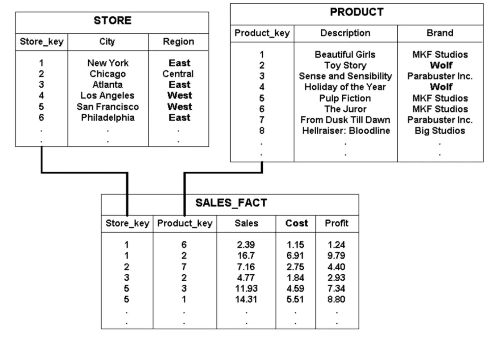
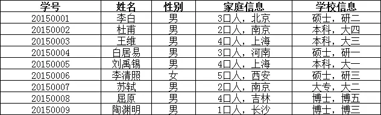
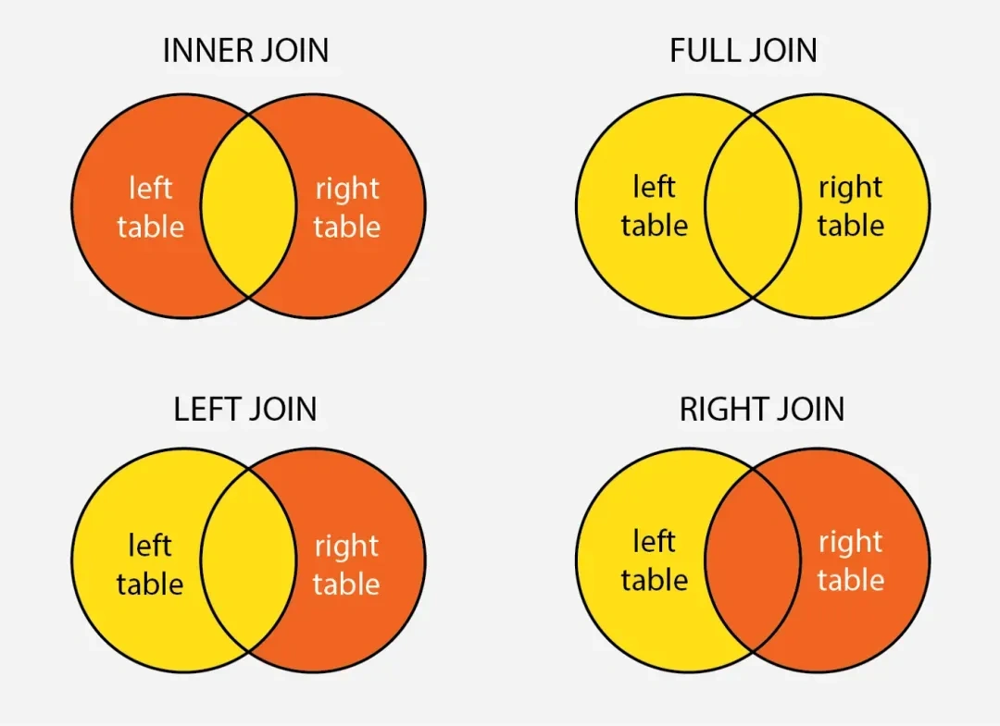
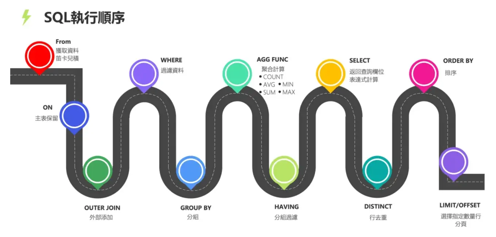

# MySQL - 第 22 课：关系建模与查询语义：范式、JOIN 与逻辑执行顺序

> 前面的章节已经把索引、执行计划、行格式、事务与锁讲到了存储引擎内部。这一课向上收一层：表为什么这样拆、连接为什么这样写、SQL 为什么“写在后面却先执行”。表设计不是 SQL 入门的附录，它会直接决定 InnoDB 页里重复存多少数据、索引怎么建、查询要连多少表，以及事务更新能不能保持一致。

## 学习目标

- 区分关系模型、文档/键值模型与分析模型，避免把“关系数据库 = ACID、NoSQL = BASE”背成绝对结论。
- 用函数依赖理解 1NF、2NF、3NF，而不是把范式机械理解成“表越拆越好”。
- 讲清 `INNER JOIN`、`LEFT JOIN`、`RIGHT JOIN` 的结果语义，以及 MySQL 没有原生 `FULL OUTER JOIN` 时怎样安全表达。
- 按逻辑执行顺序推导 `ON`、`WHERE`、`GROUP BY`、`HAVING`、`SELECT`、`ORDER BY` 与 `LIMIT` 的区别。
- 把建模选择落到 MySQL 工程约束：主键、外键/唯一约束、索引、冗余字段和 OLTP/OLAP 边界。

## 1. 先定边界：MySQL 适合解决什么问题

关系数据库最强的地方，不只是“能写 SQL”，而是：

- 结构化数据有清晰约束：主键、唯一键、外键、非空与类型。
- 多张表之间可以通过关系组合，并由事务保证一组更新的原子性。
- 优化器可以基于索引、统计信息和连接顺序生成执行计划。
- InnoDB 能提供事务、崩溃恢复、MVCC 与细粒度锁。

但下面两句话都不严谨：

- “用了 MySQL 就一定不能水平扩展。”
- “用了 NoSQL 就只能接受最终一致性。”

数据库分类不是一致性保证的开关。一些非关系数据库同样支持事务或可调一致性；MySQL 也常与缓存、搜索引擎、对象存储和分析仓库组合使用。真正的判断问题是：

| 问题 | 更偏向关系数据库的信号 | 更偏向其他模型的信号 |
| --- | --- | --- |
| 数据关系 | 订单、支付、库存有严格关联与约束 | 结构变化很大、主要按文档整体读写 |
| 查询方式 | 条件查询、连接、聚合复杂 | 访问路径极固定，以 key 获取为主 |
| 一致性 | 余额、库存、账务必须严格保护 | 可容忍延迟汇总或异步传播 |
| 扩展方式 | 先优化单库与读写分离，再谨慎分片 | 从设计起就需要海量分区或特殊检索 |

**面试口径**：不要用“SQL 对 NoSQL”的标签替代业务判断。先说访问模式和一致性要求，再说为什么选择 MySQL/InnoDB 或其他存储。

## 2. 关系建模不等于所有数据都堆在一张表

一份销售分析数据常被画成事实表加维度表：



其中：

- `sales_fact` 保存“发生了什么”：门店、商品、销量、成本、利润。
- `store` 和 `product` 保存“是谁/是什么”：城市、区域、品牌、描述。
- 事实表通过维度主键关联维度表，分析时可以按区域、品牌聚合。

这张图更接近数仓里的星型模型，而不是每个在线交易库都应该直接照搬的模板。在线交易与离线分析关注点不同：

| 工作负载 | 首要目标 | 常见建模倾向 |
| --- | --- | --- |
| OLTP：下单、扣款、改单 | 短事务、约束正确、点查/小范围更新快 | 规范化业务表，围绕访问路径建索引 |
| OLAP：报表、趋势、维度汇总 | 批量扫描与聚合方便 | 事实/维度模型，允许为查询重组织数据 |

例如在线订单主流程可能有：

```sql
CREATE TABLE product (
    id BIGINT PRIMARY KEY,
    name VARCHAR(128) NOT NULL,
    brand VARCHAR(64) NOT NULL
);

CREATE TABLE sales_order_item (
    order_id BIGINT NOT NULL,
    product_id BIGINT NOT NULL,
    quantity INT NOT NULL,
    unit_price DECIMAL(10, 2) NOT NULL,
    PRIMARY KEY (order_id, product_id),
    KEY idx_product_id (product_id)
);
```

这里 `unit_price` 可能故意保留在订单明细里，而不是每次去 `product` 查当前售价，因为订单要保存**成交当时**的价格。这不是“违反范式的坏设计”，而是业务事实和当前商品属性本来就不是同一件事。

## 3. 范式真正解决的是更新异常

范式不是为了把一张表拆得漂亮，而是为了避免同一事实在许多行里重复出现，导致修改、插入、删除时不一致。

### 3.1 从重复字段看问题

一张学生表如果把籍贯、学历、年级等信息都放在学生这一行，只要这些字段确实描述学生本人，通常没有问题：



如果其中包含的是“学校”“班主任”“院系”等可独立变化且被多人共享的事实，重复存到每个学生行里就会出现风险：

- 班主任姓名更改，要更新该班所有学生，漏一行就脏数据。
- 班级暂时没有学生时，无法仅凭学生表保存该班主任信息。
- 删除最后一名学生，可能误删班级仍需保留的信息。

把独立实体拆开，再通过键建立关系，才能让“一个事实只有一个负责维护的位置”：


### 3.2 1NF：字段要有可查询的原子语义

1NF 关心每个列值是否是当前业务查询边界下的单值。比如把多个手机号塞进字符串：

```text
phone_numbers = '138...,139...,137...'
```

会让唯一约束、按号码查用户和局部更新都困难。更稳的是：

```sql
CREATE TABLE user_phone (
    user_id BIGINT NOT NULL,
    phone VARCHAR(20) NOT NULL,
    PRIMARY KEY (user_id, phone),
    UNIQUE KEY uk_phone (phone)
);
```

注意，“原子”取决于查询需求。若业务永远只整体保存地址文本，地址并不必须拆成省、市、街道；若要按省份路由订单或做税率判断，拆列才有意义。

### 3.3 2NF：非主属性应依赖整个联合键

订单明细常用联合主键 `(order_id, product_id)`。如果把订单时间放进每一条明细：

```text
(order_id, product_id) -> quantity
order_id -> created_at
```

`created_at` 只依赖 `order_id`，而不是整个联合键。它应放回订单主表：

```sql
CREATE TABLE sales_order (
    id BIGINT PRIMARY KEY,
    created_at DATETIME NOT NULL
);

CREATE TABLE sales_order_item (
    order_id BIGINT NOT NULL,
    product_id BIGINT NOT NULL,
    quantity INT NOT NULL,
    PRIMARY KEY (order_id, product_id)
);
```

### 3.4 3NF：避免非主属性之间传递依赖

若学生表存成：

```text
student_id -> class_id -> teacher_name, teacher_phone
```

教师属性通过 `class_id` 间接依赖学生主键。教师电话变化时，更新学生表就是在制造批量不一致风险。更合理的责任边界通常是：

```sql
CREATE TABLE teacher (
    id BIGINT PRIMARY KEY,
    name VARCHAR(64) NOT NULL,
    phone VARCHAR(20) NOT NULL
);

CREATE TABLE class (
    id BIGINT PRIMARY KEY,
    teacher_id BIGINT NOT NULL,
    KEY idx_teacher_id (teacher_id)
);

CREATE TABLE student (
    id BIGINT PRIMARY KEY,
    class_id BIGINT NOT NULL,
    KEY idx_class_id (class_id)
);
```

### 3.5 什么时候有意识地冗余

三范式很适合交易数据的起点，但生产设计不是范式比赛。冗余可以合理，只要有清楚的维护机制：

- 订单保留商品成交价、商品标题快照，保护历史语义。
- 列表页冗余店铺名称或统计数量，减少高频连接，但要接受异步更新窗口。
- 报表或搜索索引复制业务数据，为查询吞吐换写入复杂度。

判断准则是：**冗余字段是否有明确的数据来源、更新机制、容错与对账方式**。没有这些，只是把更新异常推迟到线上。

## 4. JOIN 首先是结果语义，其次才是性能



假设要展示订单和可能存在的退款信息：

```sql
SELECT o.id, r.refund_amount
FROM sales_order o
LEFT JOIN refund r ON r.order_id = o.id;
```

### 4.1 四种连接要回答的是“保留谁”

| 写法 | 结果语义 | 常见场景 |
| --- | --- | --- |
| `INNER JOIN` | 只保留两侧都匹配的行 | 只统计有明细的订单 |
| `LEFT JOIN` | 保留左表全部行，右侧不匹配补 `NULL` | 订单列表同时展示可选退款 |
| `RIGHT JOIN` | 保留右表全部行 | 能改写成调换表顺序的 `LEFT JOIN` 时通常更易读 |
| `FULL OUTER JOIN` | 两侧全部保留 | 对账：找任一侧缺失的数据 |

**MySQL 没有原生 `FULL OUTER JOIN` 语法。** 对账型需求可写成两个方向的结果合并，并避免交集重复：

```sql
SELECT a.biz_no, a.amount, b.amount
FROM account_a a
LEFT JOIN account_b b ON b.biz_no = a.biz_no

UNION ALL

SELECT b.biz_no, a.amount, b.amount
FROM account_b b
LEFT JOIN account_a a ON a.biz_no = b.biz_no
WHERE a.biz_no IS NULL;
```

### 4.2 一个会把 `LEFT JOIN` 悄悄写成内连接的坑

以下 SQL 形式上是左连接，但 `WHERE` 删除了右侧不存在的行：

```sql
SELECT o.id, r.refund_amount
FROM sales_order o
LEFT JOIN refund r ON r.order_id = o.id
WHERE r.status = 'SUCCESS';
```

因为未退款订单的 `r.status` 是 `NULL`，不满足 `WHERE`。如果语义是“展示所有订单，只关联成功退款”，条件应放在 `ON`：

```sql
SELECT o.id, r.refund_amount
FROM sales_order o
LEFT JOIN refund r
  ON r.order_id = o.id
 AND r.status = 'SUCCESS';
```

### 4.3 JOIN 性能要回到访问路径

连接是否快，不能只凭“连了几张表”判断。重点检查：

- 连接列类型、字符集和排序规则是否一致，避免隐式转换让索引失效。
- 被驱动表的连接键是否有合适索引。
- 一对多连接是否会膨胀行数，随后又靠 `DISTINCT` 去重。
- 是否只需要判断存在性；若是，`EXISTS` 的语义通常更清楚。

不要背“`EXISTS` 一定比 `IN` 快”。MySQL 优化器可能把子查询改写为半连接或物化方案，最终仍要用 `EXPLAIN ANALYZE` 检查实际执行；语义层面还要特别警惕 `NOT IN` 子查询结果含 `NULL` 时产生的三值逻辑问题。

## 5. SQL 的逻辑执行顺序：写法顺序不是处理顺序



看一条统计品牌销售额的查询：

```sql
SELECT p.brand, SUM(i.quantity * i.unit_price) AS revenue
FROM sales_order o
JOIN sales_order_item i ON i.order_id = o.id
JOIN product p ON p.id = i.product_id
WHERE o.created_at >= '2026-01-01'
GROUP BY p.brand
HAVING SUM(i.quantity * i.unit_price) >= 100000
ORDER BY revenue DESC
LIMIT 10;
```

它的**逻辑**处理顺序可以这样记：

| 顺序 | 子句 | 这一阶段做什么 |
| --- | --- | --- |
| 1 | `FROM` / `JOIN` | 确定数据来源，构造连接候选行 |
| 2 | `ON` | 决定连接匹配关系，外连接在此保留未匹配侧 |
| 3 | `WHERE` | 在聚合前过滤行 |
| 4 | `GROUP BY` | 把剩余行组成分组 |
| 5 | 聚合计算 | 计算 `SUM`、`COUNT`、`AVG` 等 |
| 6 | `HAVING` | 过滤分组结果 |
| 7 | `SELECT` | 形成输出列和别名 |
| 8 | `DISTINCT` | 对输出结果去重 |
| 9 | `ORDER BY` | 排序，通常可以使用 `SELECT` 别名 |
| 10 | `LIMIT` / `OFFSET` | 只返回最终结果的一部分 |

这解释了三个常见问题：

1. 为什么行过滤优先放 `WHERE` 而不是 `HAVING`：早过滤可减少后面的分组工作量。
2. 为什么通常不能在同层 `WHERE` 里直接引用 `SELECT` 别名：逻辑上别名还没生成。
3. 为什么 `LEFT JOIN` 的右表过滤放在 `ON` 和放在 `WHERE` 结果不同：一个影响匹配，一个会删掉已保留的空侧行。

注意这是**语义顺序**，不是物理执行器必须逐项按此走。优化器可以在不改变结果语义的前提下下推谓词、改变连接顺序、选择索引或 Hash Join。写 SQL 时用逻辑顺序保证正确，排查性能时用执行计划判断真实代价。

## 6. 表设计如何影响 InnoDB 代价

### 6.1 主键不是随手一选

InnoDB 的主键索引叶子页存整行，二级索引叶子页会携带主键值。因此业务表通常希望主键：

- 短，减少聚簇索引和所有二级索引占用。
- 稳定，不因业务字段变化而更新大量索引。
- 尽量递增，减少随机插入导致的页分裂。

这与第 08 到第 11 课的 B+ 树和页结构直接相连。

### 6.2 约束不是只有“应用层校验”

可由数据库稳定表达的不变量，优先用约束兜底：

- `PRIMARY KEY` 保证实体身份。
- `UNIQUE KEY` 保证订单号、幂等号等业务唯一性。
- `NOT NULL` 减少不确定语义，也节省行内 NULL 位图空间。
- 外键是否启用要结合变更治理与写入负担，但即使不建物理外键，也必须明确关系列和一致性巡检。

### 6.3 列类型同时影响正确性和性能

- `varchar(n)` 的 `n` 是字符数；实际字节开销受字符集影响。行大小、溢出页细节见第 19 课。
- 不要把手机号、订单号当数字计算字段；字符类型可保存前导零并避免不必要数值语义。
- `INT(11)` 中历史上的显示宽度不是“只能存 11 位整数”；现代 MySQL 不应依赖显示宽度设计约束。
- 关联列必须保持类型和字符集一致，否则一次看似正常的 `JOIN` 可能由于隐式转换丢掉索引路径。

## 7. 把这课与已有章节接起来

| 本课问题 | 继续阅读 |
| --- | --- |
| 模型拆开后，连接究竟怎么被执行 | 第 07 课：SELECT 执行流程 |
| 主键、联合索引与连接列怎么选 | 第 09、10、11 课：索引与数据页 |
| 大字段、`varchar`、`NULL` 实际怎样落页 | 第 19 课：行格式 |
| JOIN 或更新遇到并发一致性问题 | 第 20、21 课：事务隔离与 MVCC |

## 小结

- MySQL 的价值不是标签式的“SQL/ACID”，而是关系约束、事务与可优化的访问路径组合；选型应从数据关系和一致性要求出发。
- 范式的核心是让一个事实有清晰维护位置，减少更新异常；面向历史事实或高频读取的受控冗余并不天然错误。
- JOIN 首先要保证保留行的语义正确；MySQL 不支持原生 `FULL OUTER JOIN`，且外连接的右表过滤位置会改变结果。
- SQL 要按 `FROM/ON -> WHERE -> GROUP BY -> HAVING -> SELECT -> ORDER BY -> LIMIT` 的逻辑顺序理解，再通过执行计划看物理代价。
- 表结构最终会映射成 InnoDB 页、索引和锁；主键、列类型、约束与关联列一致性都是底层性能与正确性的入口。

## 问题

1. 为什么“3NF 越彻底越好”不是生产建模的完整答案？请给出一个合理冗余的业务字段。
2. `LEFT JOIN` 的右表过滤条件放在 `ON` 与 `WHERE` 为什么可能返回不同的行数？
3. MySQL 中如何表达需要保留左右两边未匹配行的全量对账查询？
4. 为什么 `WHERE revenue > 1000` 不能直接引用同一层 `SELECT ... AS revenue` 的聚合别名，而 `ORDER BY revenue` 通常可以？
5. 关系列类型或字符集不一致为什么既可能带来正确性问题，也可能让查询变慢？
