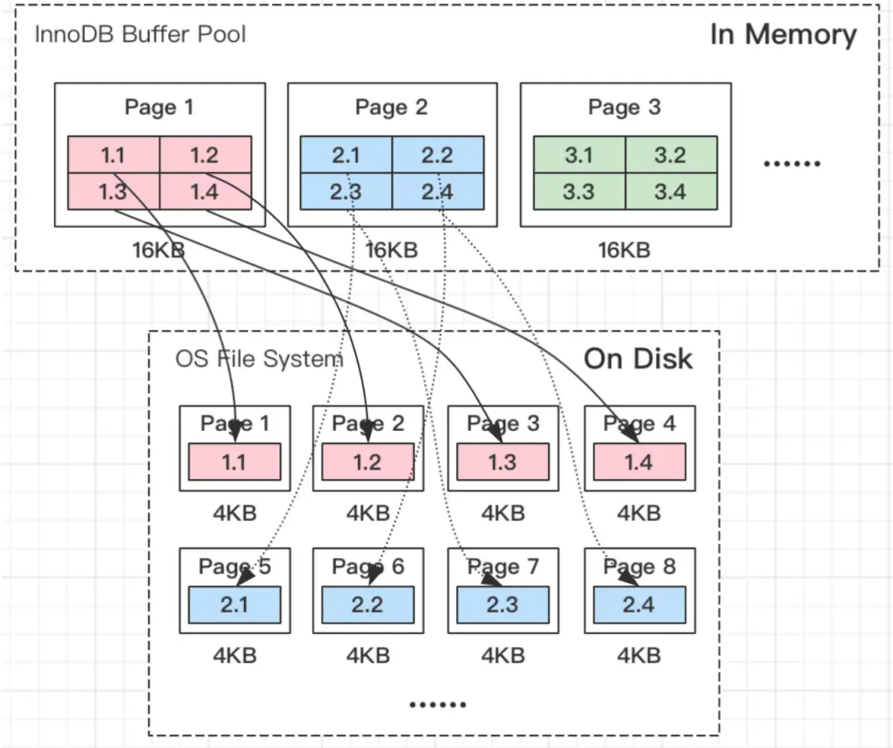
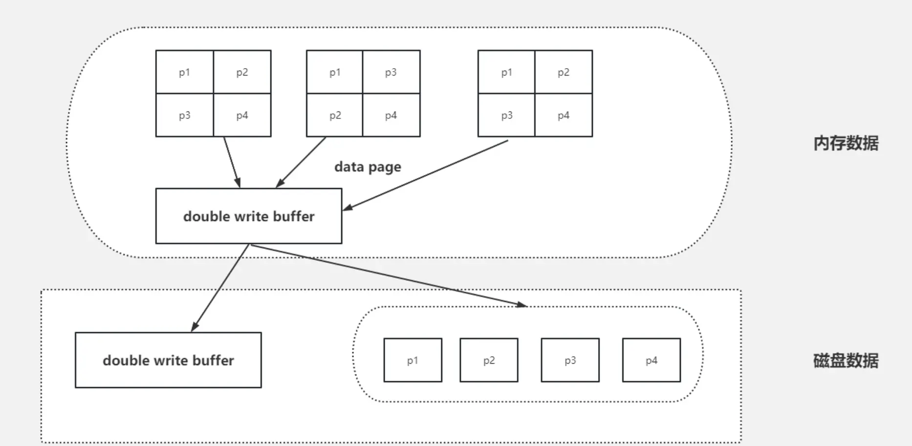
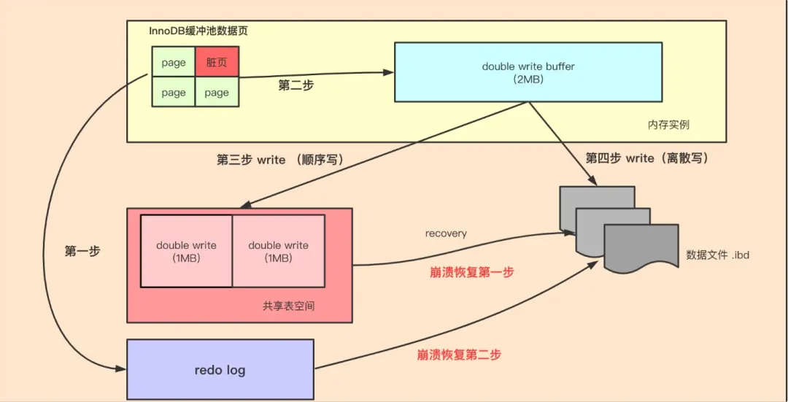

# MySQL - 第 23 课：InnoDB Doublewrite Buffer：页撕裂、双写与崩溃恢复

> 第 02 课讲过 WAL：事务提交不必等待数据页落盘，只要 `redo log` 足够可靠，崩溃后就能重放修改。这里有一个容易被省略的前提：**redo 要重放到一张结构完整、可解析的数据页上**。如果刷脏页时只写成功半页，基础页本身坏了，redo 并不能独自把它变回完整页面。Doublewrite Buffer 保护的正是这一层物理完整性。

## 学习目标

- 区分“脏页还没刷盘”和“数据页刷坏了一半”这两类故障。
- 解释为什么已有 `redo log`，InnoDB 仍然需要 Doublewrite Buffer。
- 画出脏页经 Doublewrite 持久副本再写入表空间的顺序。
- 在崩溃时间点推导恢复动作：何时仅靠 redo，何时先修复页再重放 redo。
- 理解 Doublewrite 的额外写入代价，以及为什么不能随意为了性能将它关闭。

## 1. `redo log` 解决了什么，没解决什么

更新一行时，正常链路是：

```text
修改 Buffer Pool 中的页 -> 页变脏
记录 redo -> 事务提交时持久化 redo
后台稍后把脏页刷回表空间
```

如果服务器在“redo 已落盘、脏页尚未刷盘”时崩溃，恢复阶段可从原来的完整旧页出发，重放 redo，让提交过的修改重新生效。这是 WAL 的核心价值。

但是，后台已经开始写数据页而机器在写入中途崩溃时，故障形态变了：

```text
完整旧页 -> 正在覆盖写入 -> 只有部分块属于新页，剩余部分还是旧页
```

这种结果叫 **torn page**，常译为页撕裂或部分页写入。此时问题不是“少做了一次逻辑修改”，而是“承载修改的数据结构已经破损”。

## 2. 页撕裂为什么会出现

InnoDB 的默认页大小通常是 16KB；下层文件系统块、扇区或一次能够原子保证的写入单位可能更小。一张 InnoDB 数据页写回存储时，在下层可能拆成多次写入：



例如一张页包含索引记录、页头、槽目录和校验信息。如果宕机发生在中间：

- 页的前一部分可能已经是新版本。
- 页的后一部分仍是旧版本。
- 页校验和、页 LSN 或 B+ 树结构信息无法匹配。

启动恢复时，InnoDB 可能检测到页面损坏。此时单纯重放 redo 会遇到根本问题：redo 记录的是“在哪个页上做过什么变更”，不是每次都保存一整张可替换的 16KB 完整页面。**坏页不是一个可靠的重放底座。**

### 一个很重要的区分

| 故障 | 页面状态 | 恢复所需能力 |
| --- | --- | --- |
| 脏页完全没写回就宕机 | 磁盘仍是完整旧页 | 用 redo 重放修改 |
| 数据页写回一半就宕机 | 磁盘可能是损坏混合页 | 先得到完整页副本，再重放 redo |

所以，`redo log` 保护的是持久化的**修改历史**，Doublewrite 保护的是重放前必须存在的**完整页面底座**。

## 3. Doublewrite 的核心设计：先存一份完整近照，再分散落位

名字里虽然有 Buffer，Doublewrite 不是单纯内存缓存，而是一条“内存批次 + 持久化副本 + 最终表空间写入”的保护路径：



概念上的刷页顺序如下：

1. 后台刷页线程挑选要落盘的脏页。
2. 将一批完整脏页复制到内存中的 Doublewrite 批次区域。
3. 先把这一批页顺序写入持久的 doublewrite 区域，保证存在可恢复的完整副本。
4. 再把每个页写到各自真正所属的表空间位置，这一步通常是分散写入。
5. 最终页写成功后，doublewrite 中旧的临时副本即可被后续批次复用。

源码版本与配置演进会影响 doublewrite 文件/区域的具体落点；学习时最重要的不是死记“固定在某个共享表空间”，而是记住不变量：

> InnoDB 在覆盖最终数据页之前，先把同一批完整页面可靠地放到可用于崩溃恢复的持久位置。

为什么这条路径可行：

- 临时区域是连续批量写，额外 I/O 的访问形态比将许多页随机写入各自位置更友好。
- 它不需要永久保存每一页的所有历史，只需保存最近正在刷出的完整页副本。
- 它将“事务修改是否可重放”和“数据页物理写入是否完整”拆成两道防线。

## 4. 崩溃恢复时怎样配合 redo



可以沿刷页时间线分析：

| 崩溃时机 | 磁盘最终数据页 | Doublewrite 持久副本 | 恢复路径 |
| --- | --- | --- | --- |
| 脏页尚未进入 Doublewrite 写盘 | 仍是完整旧页 | 无需依赖新副本 | 对旧页重放已持久化 redo |
| Doublewrite 尚未写完整 | 最终页还未开始被覆盖 | 新副本不可用也不影响旧页 | 对完整旧页重放 redo |
| Doublewrite 已可靠写完，最终页写到一半 | 最终页可能撕裂 | 有完整新页副本 | 先用副本替换坏页，再按需要应用 redo |
| 最终页已完整落位 | 是完整新页 | 副本可复用 | 校验通过后正常推进恢复 |

恢复时的重要逻辑不是“每次都从 Doublewrite 覆盖数据页”，而是：

1. 读取实际数据页并进行校验。
2. 若实际页完整，按日志恢复规则继续处理。
3. 若实际页因部分写入损坏，而 Doublewrite 中有对应的完整副本，先还原成可解析页。
4. 再让 redo 将该页推进到正确的恢复 LSN。

### 为什么修复后还可能需要 redo

Doublewrite 中的副本代表的是某一次刷页批次里的完整页面，不等于“所有已经提交事务的最新最终状态”。在副本形成之后仍可能有新的事务只把 redo 持久化、尚未把新数据页刷出。因此：

```text
Doublewrite：把坏掉的物理页修成一张完整页
redo：把完整页继续重放到应有的事务状态
```

两者的职责前后衔接，而不是相互替代。

## 5. 四种容易混淆的保护机制

| 机制 | 主要保护对象 | 故障时回答的问题 | 不能替代什么 |
| --- | --- | --- | --- |
| `undo log` | 旧版本与回滚信息 | 事务失败或读历史版本怎么办 | 不能保证已提交修改宕机后仍存在 |
| `redo log` | 已做过的页修改记录 | 已提交而数据页未落盘怎么办 | 不能独自修复被撕裂的基础页 |
| Doublewrite | 正在刷出的完整页副本 | 最终页物理写坏怎么办 | 不记录完整事务历史，不能替代 redo |
| `binlog` | Server 层变更事件 | 如何复制、归档、按时间恢复 | 不负责 InnoDB 页级即时崩溃恢复 |

面试中如果被问“redo 已经能恢复数据，为什么还需要双写”，最短且准确的回答是：

> Redo 的前提是数据页仍可解析；页写到一半宕机会造成 torn page，redo 没有完整基础页可重放。Doublewrite 在覆盖真实页前留一份完整持久副本，恢复时先修复坏页，再用 redo 补齐后续修改。

## 6. Doublewrite 和 WAL 的完整写入链路

把第 18 课的一条 `update` 再加上页完整性防线，完整时间线变为：

```text
1. 定位记录并加锁
2. 写 undo，修改 Buffer Pool 中的数据页
3. 生成 redo；事务提交时按策略持久化 redo
4. Server 层 binlog 与 InnoDB redo 通过两阶段提交达成事务一致
5. 后台选择脏页刷新
6. 脏页先持久化到 Doublewrite 的临时完整副本区域
7. 脏页再写到最终 .ibd / 表空间页位置
8. 崩溃后：必要时用 Doublewrite 修复撕裂页，再用 redo 重放
```

因此两类“成功”不能混为一谈：

- **事务提交成功**：核心取决于提交协议与日志刷盘策略，而不是数据页立刻写完。
- **脏页后续安全落位**：Doublewrite 保护后台刷页途中不会把最终表空间留成不可恢复坏页。

## 7. 性能代价与配置边界

Doublewrite 明显意味着页面要多经历一次持久写入，代价主要体现在写放大和刷脏吞吐上。但这里不能简单得出“生产关闭就快”的结论：

- 它保护的是低频却破坏性很强的故障，一次撕裂页足以让恢复与数据可信度变得困难。
- 额外的临时写入通常可以批量、顺序进行，成本和最终页随机刷写并不等价。
- 某些存储栈能提供可靠原子写能力，现代版本也有更细的 Doublewrite 配置形态，但是否安全依赖实际 MySQL 版本、文件系统、云盘/硬件能力和验证结果。

生产判断可以按下面顺序做：

1. 先确认写入瓶颈是否真的落在脏页刷新，而不是 redo 刷盘、锁等待、索引维护或业务写放大。
2. 检查 MySQL 版本对应的 `innodb_doublewrite` 能力与官方约束。
3. 只有在底层原子写保障明确、故障注入和恢复演练通过时，才讨论改变默认保护级别。
4. 无论如何，都要验证备份恢复和崩溃恢复链路，而不是只看压测 TPS。

## 8. 线上诊断时怎样想到它

Doublewrite 平时不以“业务报错”的方式冒出来，更常见于恢复和 I/O 问题分析：

- 数据库异常重启后出现页校验错误或页面损坏提示。
- 大量刷脏时写 I/O 上升，需要判断是正常保护成本，还是 Buffer Pool/写入模型失衡。
- 在讨论“已开 redo 为什么还可能坏页”时，需要区分日志耐久和页原子写。

排查路径可分成三层：

| 层次 | 先问什么 |
| --- | --- |
| 事务层 | 事务是否提交、redo/binlog 是否一致，见第 04 与第 18 课 |
| 页面层 | 数据页是否可校验、是否存在 torn page，Doublewrite 是否参与恢复 |
| 存储层 | 文件系统、磁盘/云盘写入保证与异常重启原因是什么 |

## 9. 与已有章节的连接

| 已有章节 | 本课补上的空缺 |
| --- | --- |
| 第 02 课 `redo log` 与 WAL | WAL 默认需要一个可读取的基础页，本课说明坏页如何先修好 |
| 第 04 课两阶段提交 | 两阶段提交解决 redo 与 binlog 的事务一致，不解决物理页撕裂 |
| 第 11 课数据页与 B+ 树 | 页不仅是查找单位，也是刷盘与损坏恢复单位 |
| 第 18 课 UPDATE 全链路 | 在“后台刷脏页”后增加 Doublewrite 的安全落位步骤 |

## 小结

- `redo log` 解决“已提交修改还没写到数据页”的恢复问题，Doublewrite 解决“数据页写了一半已经损坏”的完整性问题。
- 页撕裂来自 InnoDB 页写入并不天然具备底层原子性；一张损坏页不是 redo 可以可靠重放的底座。
- Doublewrite 的关键不变量是：覆盖最终页之前，先持久保存一批完整页面的恢复副本。
- 恢复顺序是“必要时用 Doublewrite 修复页，再用 redo 推进事务修改”；两者协作而非二选一。
- 调整 Doublewrite 是可靠性决策，不只是性能开关，必须建立在具体版本、存储保证与恢复演练之上。

## 问题

1. 脏页未刷盘宕机与脏页写到一半宕机，为什么恢复手段不同？
2. Redo 记录了页修改，为什么仍不能保证修好一张 torn page？
3. Doublewrite 为什么不必永久保存所有数据页历史，就能解决页撕裂问题？
4. 两阶段提交与 Doublewrite 分别保护什么一致性，为什么不能混为一谈？
5. 业务发现写入吞吐受限时，为什么不应把关闭 Doublewrite 当作第一个优化动作？
