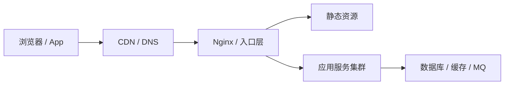

# Nginx - 第 1 课：Nginx 是什么、为什么重要、在整体架构里扮演什么角色

## 学习目标（本节结束后你能做到什么）

- 用自己的话解释 Nginx 是什么，而不是只会说“一个 Web 服务器”。
- 说清楚 Web 服务器、反向代理、网关、负载均衡分别是什么关系。
- 理解 Nginx 在一次真实请求链路中的位置，以及它为什么几乎出现在所有互联网系统里。
- 分清什么时候让 Nginx 直接返回内容，什么时候让它把请求转给后端应用。
- 建立 Nginx 的整体认知，为后续架构、配置和排障打地基。

## 内容讲解（核心概念，用类比、例子、图示说清楚）

### 1. 先别急着背定义，先看它在解决什么问题

假设你做了一个网站，后端服务跑在 `127.0.0.1:3000`。理论上你可以让浏览器直接访问这个端口，但真实生产环境几乎不会这么干，因为这会立刻遇到一串问题：

- 后端端口不适合直接暴露给公网
- 一个应用服务不擅长高效处理静态文件
- 以后如果你的后端从 1 台变 3 台，用户根本不知道该访问哪台
- 你想接 HTTPS、做限流、做缓存、做日志统一收集，都缺一个统一入口

Nginx 出现的意义，就是把这些“请求入口层”的事情接过去。

你可以把它想成一家公司的前台和总机：

- 用户先找到前台，而不是直接闯进各个部门
- 前台有些事能直接处理，比如发资料、指路、做简单答复
- 更复杂的事情，前台会转给对应的后端团队
- 如果后面有很多团队成员，前台还可以按规则分配给不同的人

这就是 Nginx 的直觉理解。

### 2. Nginx 到底是什么

Nginx 最常见的三个身份是：

- Web 服务器
- 反向代理服务器
- 负载均衡器

这三个身份不是互斥的，而是经常同时存在。

#### 2.1 Web 服务器

Web 服务器的职责，是接收 HTTP 请求并返回 HTTP 响应。

最简单的情况是静态文件服务。比如浏览器请求：

```http
GET /index.html HTTP/1.1
Host: example.com
```

Nginx 可以直接去磁盘上找 `index.html`，把它返回给浏览器。这种事情它做得非常快。

#### 2.2 反向代理

如果请求不是一个静态文件，而是要执行业务逻辑，比如“查订单”“提交支付”“登录”，那通常需要交给 Java、Go、Node.js、Python 这些后端服务处理。

这时 Nginx 不自己算业务，而是把请求转发给后端，这就叫反向代理。

客户端看到的是：

```text
浏览器 -> Nginx -> 后端服务
```

但客户端通常不知道后端到底有几台、在哪个端口、什么语言写的。对客户端来说，Nginx 就像系统的统一门面。

#### 2.3 负载均衡

如果你的后端服务有多台，比如：

- `10.0.0.1:8080`
- `10.0.0.2:8080`
- `10.0.0.3:8080`

Nginx 可以决定这次请求转给谁。默认可以轮着分，也可以按权重、连接数、IP 粘性等策略分配。这就是负载均衡。

### 3. Nginx 在整体架构中的位置

把一次典型请求链路画出来，你会更容易理解它为什么重要：



从这张图你可以看到，Nginx 经常位于“外部请求进入内部系统”的第一跳或前几跳。

它最常做的事情有：

- 终止 HTTPS
- 校验 Host、路径、头部
- 匹配规则决定怎么处理请求
- 静态资源直出
- 动态请求转发到后端
- 给后端补充代理相关请求头
- 在多台后端之间做负载均衡
- 记录访问日志和错误日志
- 做基础安全控制，比如限流、限连、简单拦截

所以 Nginx 不是“某个小插件”，而是入口层基础设施。

### 4. 它和后端应用服务器是什么关系

很多初学者容易混淆 Nginx 和 Tomcat、Spring Boot、Node.js 服务、Go HTTP 服务之间的关系。

更准确的理解是：

- Nginx 擅长处理连接、转发、静态资源、入口治理
- 应用服务器擅长处理业务逻辑

比如一个电商网站：

- 图片、CSS、JS、下载包等静态资源，适合由 Nginx 或 CDN 处理
- 下单、支付、查询库存等动态逻辑，适合由业务服务处理

这就叫动静分离。

它的好处是：

- 静态资源不再占用后端应用线程
- 后端专心做业务
- 整体架构更清晰
- 更容易扩容和排障

### 5. 正向代理和反向代理不要搞混

这是面试高频题。

#### 正向代理

正向代理代理的是客户端。客户端知道自己在使用代理。

比如你访问某个网站时，请求先发给公司代理服务器，再由代理服务器转出去。目标网站看到的是代理服务器，不知道真实客户端是谁。

一句话：**正向代理隐藏客户端。**

#### 反向代理

反向代理代理的是服务端。客户端通常不知道背后具体是哪台服务器在处理请求。

比如你访问 `example.com`，其实流量先到了 Nginx，再由 Nginx 转到若干台后端服务。

一句话：**反向代理隐藏服务器。**

Nginx 在大多数后端场景里，说的都是反向代理。

### 6. 一个最小可运行心智模型

如果你现在还没学配置，也可以先建立这个最小模型：

1. 用户访问域名
2. 请求先到 Nginx
3. Nginx 根据域名、端口、路径匹配规则
4. 如果是静态文件，直接返回
5. 如果是动态请求，转给后端
6. 后端算完结果返回给 Nginx
7. Nginx 再把结果返回给用户

你后面学的所有配置，本质上都在控制第 3、4、5 步。

### 7. 为什么 Nginx 这么重要

如果只从功能上看，很多事情别的组件也能做。但 Nginx 重要在于它把很多入口层能力集中在一个高性能、稳定、可配置的系统里：

- 它让后端服务不必直接暴露
- 它让入口治理集中统一
- 它把静态资源、HTTPS、代理、负载均衡这些通用能力前置了
- 它让你的系统可以从单机自然演化到多机

对一个后端工程师来说，学 Nginx 的价值不只是“会改配置”，而是理解整个请求入口层是怎么运作的。

## 小结

- Nginx 最常见的三个角色是 Web 服务器、反向代理和负载均衡器。
- 它通常位于请求链路靠前的位置，是入口层基础设施。
- 它擅长做静态资源服务、请求转发、HTTPS 终止和统一治理，后端应用擅长做业务逻辑。
- 正向代理隐藏客户端，反向代理隐藏服务器，Nginx 在后端系统里主要承担的是反向代理角色。
- 学 Nginx 的第一步不是背配置，而是先弄清楚它在整个架构里为什么存在。

