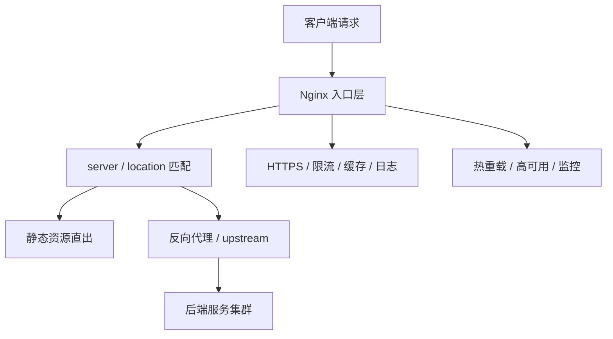

# Nginx - 第 7 课：高可用、热部署、平滑升级与面试答题框架

## 学习目标（本节结束后你能做到什么）

- 理解 Nginx 高可用不只是“多开几台”，而是入口层故障时如何快速切换和持续服务。
- 说清楚 `reload`、热部署、优雅退出、平滑升级分别在做什么。
- 理解 Keepalived、VIP、云负载均衡、DNS 轮询这些方案各自适合什么场景。
- 能把日志、监控、配置校验、变更发布纳入 Nginx 的工程化运维视角。
- 面试时能围绕“原理 + 配置 + 线上问题 + 取舍”组织完整回答。

## 内容讲解（核心概念，用类比、例子、图示说清楚）

### 1. 为什么入口层的高可用格外重要

数据库挂了很严重，应用挂了也很严重，但入口层一旦出问题，影响往往更“整齐”：

- 不是一部分功能慢，而是所有外部请求都进不来
- 用户侧看到的常常是大面积 502、504、连接失败
- 因为入口层在前面，它一挂，后面其实都没机会发挥

所以 Nginx 的高可用设计，本质是在保障“请求进系统的这道门”别轻易失效。

### 2. 热重载到底发生了什么

Nginx 的一个非常重要特性，是修改配置后可以：

```bash
nginx -t
nginx -s reload
```

它不是粗暴地把所有进程杀掉重启，而是更优雅地完成切换。

你可以这样理解：

1. master 收到 reload 信号
2. master 先校验新配置
3. 如果新配置合法，master 拉起一批新的 worker
4. 新 worker 用新配置开始接收新请求
5. 旧 worker 不再接新请求，但会把手头已经处理中的请求做完
6. 旧 worker 优雅退出

所以热重载的关键不是“没有任何进程变化”，而是“新旧 worker 平滑交接，尽量不中断服务”。

这就是很多人说的平滑重载、优雅退出。

### 3. 平滑升级和普通 reload 的区别

reload 更像“同版本下切换配置”。

平滑升级则更进一步，目标是：

- 升级 Nginx 二进制版本
- 不中断现有连接
- 尽量平滑完成进程替换

这类操作涉及 master-worker 的更复杂交接，一般只有在对可用性要求较高或维护窗口有限的环境下才会特别强调。

你面试时不需要把每个信号都背到很细，但要知道：

- reload 主要解决配置变更不中断
- 平滑升级解决程序版本替换时尽量不中断

### 4. 高可用方案一：Keepalived + VIP

这是传统自建机房或 VM 场景下非常经典的 Nginx 高可用方案。

思路是：

- 两台或多台 Nginx 实例做主备
- 通过 Keepalived 维护一个虚拟 IP（VIP）
- 正常情况下 VIP 漂在主节点上
- 主节点挂了，VIP 漂移到备节点

这样客户端只需要访问一个稳定 IP，而不需要知道后面哪台机器当前是主。

优点：

- 切换快
- 技术成熟
- 本地机房场景常见

缺点：

- 更偏基础设施层方案
- 多机房、多地域下扩展性一般
- 维护 VRRP、网络策略需要一定经验

### 5. 高可用方案二：云负载均衡前置

在云上更常见的做法是：

```text
客户端 -> 云 SLB / ALB -> 多台 Nginx -> 后端服务
```

这时 Nginx 自己也不一定是第一层入口，它可能位于云 LB 后面。

这种方案的好处是：

- 健康检查、摘流、跨可用区分发很多由云平台代劳
- 不必自己维护 VIP 漂移
- 扩缩容更自然

但也要意识到：

- 链路更长，定位问题时要分清是哪一层返回的错误
- HTTPS 有时终止在云 LB，有时终止在 Nginx，不能混淆

### 6. 高可用方案三：DNS 轮询不是银弹

有些人会想到直接用 DNS 轮询多个 Nginx 节点。

它确实可以分散流量，但不适合拿来当故障切换主力，因为：

- DNS 缓存不可控
- 故障节点摘除不够及时
- 客户端和中间层缓存都可能让“已坏节点”继续被访问

所以 DNS 更适合做粗粒度流量分配，不适合做需要秒级切换的高可用兜底。

### 7. 日志、监控和配置校验才是工程落地关键

很多人学 Nginx 只盯配置，却忽略了真正能支撑线上稳定性的，是一整套运维习惯。

#### 配置校验

所有变更前先：

```bash
nginx -t
```

这是最低成本、最高收益的习惯。

#### 日志

通常至少会看两类：

- access log：记录请求基本情况
- error log：定位异常和 upstream 问题

#### 指标

常见关注：

- QPS
- 连接数
- 4xx / 5xx 比例
- upstream 响应时间
- Nginx 自身 CPU、内存、文件描述符使用

只有把这些指标看起来，你才知道是入口层本身出问题，还是入口层只是在忠实反映后端问题。

### 8. 一套更成熟的发布思路

线上改 Nginx 配置，比较稳妥的流程通常是：

1. 先在测试或预发环境验证
2. 做 `nginx -t`
3. 小流量、分批灰度
4. reload 后重点观察错误日志和 5xx 指标
5. 确认正常再全量推开

这比“改完直接全机器 reload”更符合生产环境心态。

### 9. 面试怎么回答“你们怎么做 Nginx 高可用”

一个比较完整的回答模板可以是：

“入口层我们通常不会只放一台 Nginx。自建环境里常见是 Nginx 加 Keepalived，通过 VIP 做主备切换；云上更常见是前面挂 SLB/ALB，再把流量分发到多台 Nginx。配置变更前会先 `nginx -t` 校验，线上通过 reload 做平滑重载，新 worker 接新流量，旧 worker 处理完已有请求后优雅退出。监控上重点关注连接数、5xx 比例、upstream RT 和 error log，这样能区分是入口层故障还是后端故障传导。” 

这个回答之所以比“我们做了主备”更好，是因为它同时包含了：

- 架构方案
- 切换机制
- 发布机制
- 监控思路

### 10. 面试怎么回答“你怎么理解 Nginx”

如果面试官没有限定具体点位，你可以按这条总线来回答：

1. Nginx 的定位
   - Web 服务器、反向代理、负载均衡器
2. 它为什么快
   - master-worker、事件驱动、epoll
3. 它怎么表达行为
   - `server`、`location`、`upstream`、`rewrite`
4. 它怎么支持生产环境
   - HTTPS、限流、缓存、日志、热重载、高可用
5. 你用它解决过什么问题
   - 静态资源直出、接口转发、会话头透传、502/504 排障等

只要你能按这个框架展开，就会比碎片化回答更像真正用过。

### 11. 最后建立一张完整地图

到这里，你应该把 Nginx 放在这样一张图里理解：



这张图的意义是：Nginx 不是孤立配置项集合，而是入口层能力的汇聚点。

## 小结

- Nginx 高可用的重点，是保障入口层持续可服务，而不是只会“多部署几台”。
- `reload` 的关键是新旧 worker 平滑交接，尽量不中断服务。
- Keepalived + VIP 适合传统自建环境，云上更常见是前置云负载均衡。
- 真正支撑线上稳定的，不只是配置本身，还有 `nginx -t`、日志、监控和灰度发布流程。
- 面试回答 Nginx，最好按“定位、原理、配置、优化、故障、工程落地”这条主线组织。

