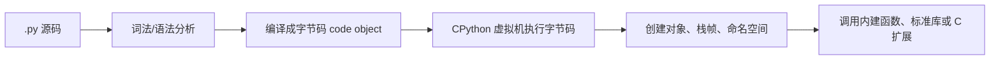
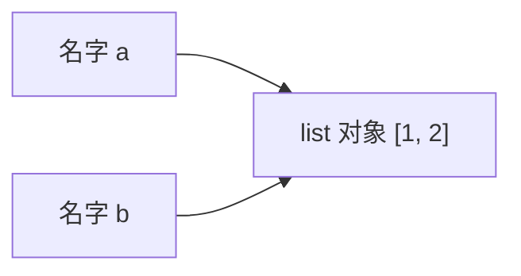

# Python - 第 1 课：Python 到底是什么：解释器、对象模型、动态类型与运行时

## 学习目标（本节结束后你能做到什么）

- 能区分 Python 这门语言和 `CPython` 这个最常见实现，不再把两者混为一谈。
- 能解释为什么“Python 是解释型语言”这句话只说对了一半。
- 能理解 Python 里的变量更准确地说是“名字绑定到对象”，而不是“盒子里装了值”。
- 能建立“一切皆对象、类型属于对象、执行依赖运行时”的整体认知。
- 能用结构化语言回答一个高频面试题：Python 为什么开发效率高、但运行效率常常不如 Java / Go / C++。

## 内容讲解（核心概念，用类比、例子、图示说清楚）

### 1. 为什么第一课不是语法，而是“Python 到底是什么”

很多人学一门语言时，默认会从语法开始：

- 变量怎么定义
- `if` 怎么写
- `for` 怎么遍历
- 函数怎么声明

这当然重要，但如果你是为了面试和系统学习，只从语法入手会有一个很大的问题：

**你会很快会写，但未必真的理解。**

比如下面这些问题，如果没有“语言观”和“运行时观”，就很容易答碎：

- 为什么 `a = [1, 2]`，`b = a`，改 `b` 会影响 `a`
- 为什么 Python 里经常说“一切皆对象”
- 为什么说 Python 是动态类型，但它又不是弱类型
- 为什么 GIL 只对某些实现和某些场景成立
- 为什么 Python 代码看起来短，但执行时可能不够快

所以这一课不是在背语法，而是在搭地基。  
后面你学 `dict`、闭包、生成器、协程、描述符、垃圾回收时，都会回到这一课的框架上。

### 2. Python 是语言，不只是一种解释器

先把一个非常重要的概念摆正：

**Python 是一门语言；`CPython` 是这门语言最主流的一种实现。**

这句话听起来像文字游戏，但其实非常关键。

你可以把“语言”和“实现”想成两个层次：

- 语言层：语法规则、数据模型、语义约定，比如 `for`、`def`、类、异常、迭代协议、上下文管理器这些机制应该怎么工作
- 实现层：这些规则到底由谁来执行、怎么执行、内部数据结构是什么、有没有 GIL、对象怎么分配、垃圾回收怎么做

最常见的实现是：

- `CPython`：官方主流实现，核心用 C 写成，绝大多数人平时说的 Python 基本指它
- `PyPy`：强调 JIT 优化，某些场景下可能更快
- 还有一些其他实现，但面试和工程里最常见的还是 `CPython`

这件事为什么重要？

因为很多“Python 面试题”其实默认问的是 `CPython`，而不是语言规范本身。

比如：

- GIL 是 Python 语言自带的吗？  
  更准确地说，GIL 是 **`CPython` 的一个重要实现机制**，不是“语言规范要求所有 Python 实现都必须这样做”。

- Python 对象为什么有引用计数？  
  更准确地说，这是 `CPython` 里非常核心的一种内存管理方式。

所以以后你看到一个结论，先问自己一句：

**这是 Python 语言层的事实，还是 `CPython` 这个实现的事实？**

这会让你的理解一下子稳很多。

### 3. “Python 是解释型语言”为什么只说对一半

很多教程会说，Python 是解释型语言，对比 C 这种编译型语言。  
这个说法能帮初学者建立一个粗略印象，但如果你准备面试，只停在这里是不够的。

更准确地说，`CPython` 执行 Python 代码时，大致经历下面这个过程：



也就是说，Python 不是“直接把源码一行一行不经处理地读过去”。  
它通常会先把源码编译成字节码，再由解释器的执行循环去运行这些字节码。

所以更稳的说法是：

- Python 源码通常不会像 C/C++ 那样直接编译成本地机器码再独立运行
- 但它也不是“完全没有编译过程”
- 它更像是“先编译成中间表示，再由虚拟机解释执行”

这也是为什么你会看到：

- `__pycache__`
- `.pyc` 文件
- `dis` 模块可以查看字节码

面试里如果被问到“Python 是解释型还是编译型”，比较成熟的回答不是二选一，而是：

**Python 通常被归类为解释型语言，但在 `CPython` 中，源码会先被编译成字节码，再交给虚拟机执行，所以它并不是完全没有编译阶段。**

### 4. Python 最核心的世界观之一：一切皆对象

“一切皆对象”这句话经常被说烂，但它不是口号，而是非常实在的运行时事实。

在 Python 里，下面这些东西本质上都可以被当成对象来看：

- 整数
- 字符串
- 列表
- 函数
- 类
- 模块
- 甚至很多你平时以为是“语法层”的能力，最终也会落到对象协议上

对象至少可以从三个维度理解：

- 身份（identity）：它是不是同一个对象
- 类型（type）：它属于什么类型
- 值（value）：它当前包含什么内容

例如：

- `100` 是对象
- `"hello"` 是对象
- 一个函数 `f` 也是对象
- 一个类 `User` 也是对象

这会带来很多后续特性：

- 函数可以作为参数传递，因为函数本身就是对象
- 类可以动态创建和修改，因为类也是对象
- 属性访问可以被拦截，因为对象模型里有统一的协议机制

所以你后面学高阶函数、装饰器、描述符、元类时，不要把它们看成彼此无关的奇技淫巧。  
它们很多都建立在这条事实之上：**Python 运行时对“对象”和“协议”的依赖非常重。**

### 5. 变量不是盒子，而是“名字绑定到对象”

这是 Python 学习里最重要、也最容易被误解的一件事。

很多人脑子里默认的变量模型是这样的：

- 变量像一个盒子
- 值被装进盒子里
- 赋值就是把值复制进另一个盒子

这个模型在 Python 里很容易把你带偏。

Python 更准确的理解方式是：

- 变量名是名字
- 右边创建或取得一个对象
- 赋值语句把“名字”绑定到“对象”上

可以把它想象成“标签贴在对象上”，而不是“盒子里装东西”。



比如：

```python
a = [1, 2]
b = a
b.append(3)
```

为什么最后 `a` 也变成了 `[1, 2, 3]`？

不是因为“Python 偷偷复制错了”，而是因为：

- `a` 先绑定到了一个列表对象
- `b = a` 不是创建新列表，而是让 `b` 也指向同一个对象
- `append` 改的是那个共享的列表对象本身

这个模型一旦建立起来，后面很多东西都会顺：

- 为什么可变对象容易产生共享副作用
- 为什么函数默认参数如果写成 `[]` 容易出问题
- 为什么浅拷贝和深拷贝结果不同
- 为什么 `is` 和 `==` 不是一回事

### 6. 动态类型到底是什么意思，它为什么不是弱类型

Python 常被描述成“动态类型语言”，这句话要拆开理解。

最关键的一层是：

**类型属于对象，不属于变量名。**

例如：

```python
x = 1
x = "hello"
```

这不是说“变量 `x` 的类型变了”，而是说：

- 一开始 `x` 绑定到一个 `int` 对象
- 后来 `x` 又绑定到一个 `str` 对象

名字本身没有固定类型约束，这就是动态绑定带来的灵活性。

但动态类型不等于弱类型。  
Python 其实是相对“强类型”的。

例如：

```python
1 + "2"
```

这不会像某些弱类型语言那样帮你自动乱转，而是直接报错。  
也就是说，Python 虽然在“变量绑定”这件事上很灵活，但在“类型语义”这件事上并不随便。

所以一个更准确的描述是：

- Python 是动态类型语言
- 同时它又是强类型语言

这个表述在面试里比简单说一句“Python 很灵活”要专业得多。

### 7. Python 运行时到底在忙什么

如果你从后端工程师的视角看 Python，理解运行时很重要。

一段 Python 代码运行时，背后不是只有“执行语句”这么简单，它还在不断做很多工作：

- 维护对象及其类型信息
- 维护引用关系
- 创建和销毁栈帧
- 处理命名空间查找
- 进行动态分发和方法解析
- 做异常传播
- 在 `CPython` 中维护引用计数，必要时再配合垃圾回收

这也是 Python 运行时很“重”的原因之一。

举个最简单的对比：

在静态编译型语言里，一个整数变量可能就是一块比较直接的内存。  
而在 `CPython` 里，一个整数通常是一个对象，它有对象头、类型信息、引用计数等元数据。

这带来了两个结果：

1. 好处是灵活  
   运行时知道“这是什么对象、它支持什么协议、现在该怎么分发”。

2. 代价是更重  
   对象创建、引用维护、动态查找、解释执行都会带来成本。

所以你后面学“Python 为什么慢”，不要只记一句“因为解释型语言”。  
更完整的原因通常包括：

- 字节码解释执行
- 对象模型比较重
- 动态类型与动态分发带来额外开销
- 函数调用和属性查找成本不低
- `CPython` 的 GIL 影响某些并发场景

### 8. Python 为什么开发效率高

既然 Python 运行时这么重，为什么大家还是很喜欢它？

因为它把大量复杂度转移给了语言和运行时，换来了非常强的开发效率。

主要体现在几个方面：

#### 8.1 表达力强

同样一个需求，Python 往往可以用更少代码表达出来。

比如：

- 容器和切片用起来很直接
- 函数、闭包、装饰器适合做抽象
- 标准库覆盖很广
- 第三方生态非常强

#### 8.2 运行时能力强

Python 不是“把所有约束都提前锁死”，而是允许你在运行时做很多事情：

- 动态创建对象
- 反射
- 修改属性
- 通过协议扩展行为

这对脚本、自动化、胶水层、数据处理和 AI 工具链开发特别有价值。

#### 8.3 工程试错成本低

后端开发里很多场景并不需要极致性能，而更需要：

- 快速验证
- 快速迭代
- 丰富生态
- 易于编写工具和平台层逻辑

这就是 Python 很适合作为：

- 自动化脚本语言
- 平台工具语言
- AI / 数据处理主力语言
- 中小型后端服务语言

### 9. Python 为什么常常跑得没那么快

这个问题几乎是面试必问。

比较好的回答不要只给一个原因，而是给一组结构化原因：

#### 9.1 执行路径更长

源码不是直接变成紧贴硬件执行的机器码，而是先变字节码，再由虚拟机解释执行。

#### 9.2 对象模型更重

很多基础值在 `CPython` 里都是完整对象，不是裸值。

#### 9.3 动态性有成本

类型检查、属性查找、方法分发、协议调用，都会把灵活性换成运行期开销。

#### 9.4 内存局部性通常没那么好

对象分散、间接访问多，会影响缓存友好性。

#### 9.5 某些并发场景受 GIL 限制

特别是纯 Python CPU 密集型任务，很难指望线程像多核并行那样线性加速。

但这里也要注意边界：

- Python 不代表一定慢
- 如果大量时间花在 I/O、数据库、网络、系统调用，语言本身未必是主瓶颈
- 如果核心计算下沉到 C 扩展、NumPy、数据库、搜索引擎、消息队列，Python 完全可以做一个高效率的系统胶水层

所以成熟的结论不是“Python 慢，所以不能用”，而是：

**Python 把速度让给了表达力和生态，但在很多工程场景里，这种交换是划算的。**

### 10. 一个后端工程师该怎么理解 Python 的边界

如果你是后端工程师，可以把 Python 放在三个层次看：

#### 10.1 它很适合做“快”

- 脚本
- 自动化
- 批处理
- 运维工具
- 内部平台
- AI 工作流和胶水层

#### 10.2 它也能做服务

- FastAPI / Django / Flask 这类 Web 开发
- 接口聚合
- 中后台服务
- I/O 型业务服务

#### 10.3 但要知道它哪里不是强项

- 纯 CPU 密集型高吞吐计算
- 极致低延迟、极致高性能、极度吃单机资源效率的场景

这不是说 Python 做不了，而是说你要更清楚地做架构切分：

- 哪部分用 Python 负责 orchestration、业务编排、平台能力
- 哪部分下沉到更高性能的组件或服务

这其实也是“系统地学 Python”最重要的收益之一：  
不是盲目热爱，也不是盲目嫌弃，而是知道它在系统里该站哪一层。

### 11. 面试里怎么回答“Python 到底是什么”

如果面试官让你简单介绍 Python，你可以按下面这个结构答：

1. 先定性  
   Python 是一门高级、通用、动态类型、强类型语言。

2. 再区分语言与实现  
   实际工程里最常见的是 `CPython`，很多面试里的 GIL、引用计数等问题默认都在说它。

3. 再讲执行模型  
   `CPython` 通常会先把源码编译成字节码，再由虚拟机执行，所以“解释型语言”这个说法是对的，但不完整。

4. 再讲对象模型  
   Python 里类型属于对象，变量本质上是名字绑定到对象；函数、类也都是对象。

5. 最后讲优缺点  
   优点是表达力强、生态丰富、开发效率高；缺点是运行时开销较重，纯 CPU 密集型和某些并发场景不占优势。

如果你能这样答，说明你不是在背“Python 是一种面向对象解释型语言”这种标准句，而是真的有了语言层的理解。

## 小结（3-5 条关键点）

- Python 是一门语言，`CPython` 是最主流实现；很多底层问题其实问的是 `CPython`。
- “Python 是解释型语言”这个说法不完整，因为 `CPython` 通常会先把源码编译成字节码，再由虚拟机执行。
- Python 的变量更准确地说是“名字绑定到对象”，不是“盒子装值”。
- Python 是动态类型且强类型的语言，灵活性和运行时开销往往同时存在。
- 理解对象模型、执行模型和运行时代价，是后面学习容器、闭包、协程、GIL、性能优化的共同地基。

## 问题（检测用户对当前章节内容是否了解）

1. Python 这门语言和 `CPython` 这个实现分别是什么关系？为什么这个区分对理解 GIL 很重要？
2. 为什么说“Python 是解释型语言”这句话只说对了一半？请用你自己的话描述 Python 源码到执行的大致过程。
3. 请解释“变量是名字绑定到对象”这句话，并说明为什么下面这段代码里改 `b` 会影响 `a`：

```python
a = [1, 2]
b = a
b.append(3)
```

4. 如果面试官问你“Python 为什么开发快但运行常常没那么快”，你会给出哪 3 到 5 个关键原因？

把你的答案直接告诉我，我会根据你的掌握程度决定下一步是进入第 2 课，还是先补一篇 `01b` 帮你把地基打得更牢。
