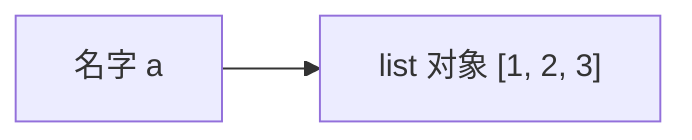
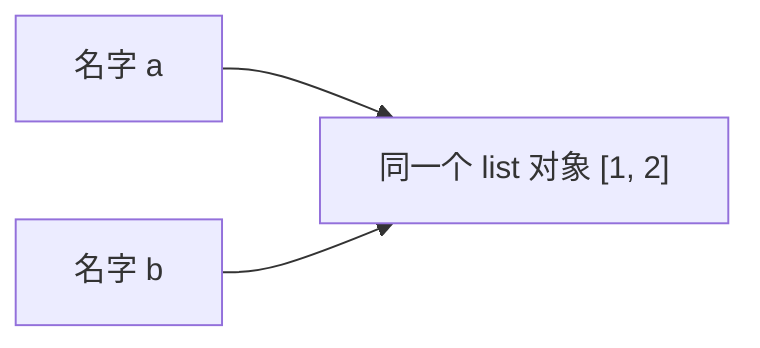
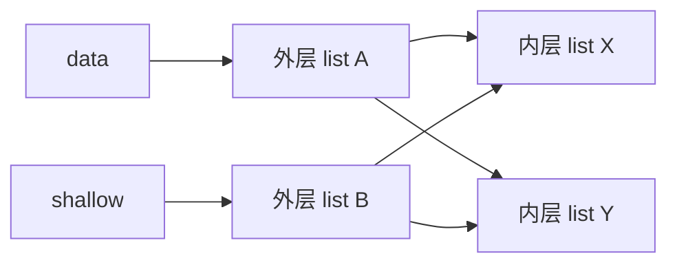
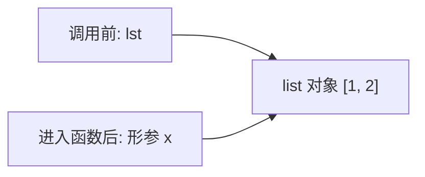

# Python - 第 2 课：变量、对象、引用、赋值、拷贝与可变不可变

## 学习目标（本节结束后你能做到什么）

- 能用准确语言解释 Python 里的变量、对象、引用分别是什么。
- 能说清 `=` 在 Python 里到底做了什么，以及它为什么通常不是“复制值”。
- 能稳定区分 `is` 和 `==`，知道它们分别在比较什么。
- 能理解可变对象与不可变对象的本质差异，并解释常见副作用从哪里来。
- 能讲清浅拷贝、深拷贝、函数传参这三类高频面试题背后的统一模型。

## 内容讲解（核心概念，用类比、例子、图示说清楚）

### 1. 这一课为什么极其重要

如果说第 1 课是在建立 Python 的世界观，那这一课就是把那个世界观落到最常出错的地方。

Python 面试里有一批题表面看起来互不相关：

- 为什么 `b = a` 之后改 `b` 会影响 `a`
- 为什么 `a += [1]` 和 `a = a + [1]` 看起来像一回事，行为却不完全一样
- 为什么 `is` 和 `==` 不能混着用
- 为什么默认参数写成 `[]` 容易出 bug
- 为什么浅拷贝“拷了，但又没完全拷”
- Python 函数传参到底是值传递还是引用传递

其实这几类问题背后是同一套底层模型：

**名字绑定对象，对象有身份和值，对象有的可变有的不可变，赋值和传参本质上都只是“再绑定一次”。**

这一课你只要把这条主线真正吃透，后面很多题就不会再靠背。

### 2. 先把三个词拆开：变量、对象、引用

这三个词最容易被混着说。

#### 2.1 变量

在 Python 里，变量更准确地说是“名字”。

例如：

```python
a = [1, 2, 3]
```

这里的 `a` 不是一个装值的盒子，而是一个名字。

#### 2.2 对象

右边的 `[1, 2, 3]` 会创建一个列表对象。  
这个对象有：

- 类型：`list`
- 值：里面有 `1, 2, 3`
- 身份：它是内存里的哪个对象，也就是“它到底是不是那个同一个对象”

#### 2.3 引用

“引用”可以理解成：名字和对象之间的关联关系。  
当我们说“`a` 引用了这个列表对象”，本质上就是在说：

- 名字 `a`
- 当前绑定到了
- 这个列表对象

所以更完整的画面是：



很多误解都来自把这三件事揉成一句“变量里存着值”。  
这种说法在 Python 里太粗糙，容易把后续所有行为都理解偏。

### 3. 赋值 `=` 到底做了什么

这是本课最核心的问题。

看代码：

```python
a = [1, 2]
b = a
```

很多人会下意识以为第二句是“把 `a` 的值复制给 `b`”。  
但更准确的理解是：

1. `a` 已经绑定到一个列表对象
2. `b = a` 会先求出右边表达式 `a` 当前绑定的对象
3. 再让名字 `b` 也绑定到同一个对象

也就是：



这时如果执行：

```python
b.append(3)
```

发生的不是“改了 `b` 这个变量”，而是“改了那个共享的列表对象本身”。  
因此 `a` 和 `b` 看到的内容都会变。

所以这里一定要建立一个非常稳的判断：

- `=` 默认做的是绑定，不是深层复制
- 是否出现副作用，关键看右边对象是不是可变、后续操作是不是原地修改

### 4. 为什么有时候看起来又像复制了

比如：

```python
a = 1
b = a
b = 2
```

很多人会说：“那这里为什么改 `b` 没影响 `a`？”

因为这里根本不是“把同一个对象改了”，而是：

- 起初 `a` 和 `b` 都绑定到整数对象 `1`
- 后来 `b = 2` 不是修改整数对象 `1`
- 而是让 `b` 重新绑定到另一个整数对象 `2`

也就是说，**你改的不是对象，而是绑定关系。**

这正是理解“可变 vs 不可变”的入口。

### 5. 可变对象与不可变对象，到底差在哪

#### 5.1 不可变对象

不可变对象指的是：**对象一旦创建，内部状态不能原地修改。**

常见例子：

- `int`
- `float`
- `str`
- `tuple`
- `frozenset`

例如：

```python
s = "abc"
s = s + "d"
```

这不是把原字符串 `"abc"` 改成了 `"abcd"`，而是创建了一个新字符串对象，再让 `s` 绑定过去。

#### 5.2 可变对象

可变对象指的是：**对象创建后，内部状态可以原地修改。**

常见例子：

- `list`
- `dict`
- `set`
- 大多数自定义类实例

例如：

```python
lst = [1, 2]
lst.append(3)
```

这里是直接把原列表对象改掉了，所以如果别的名字也指向这个列表，它们会一起“看到变化”。

#### 5.3 最容易误解的一点

“不可变”修饰的是对象，不是变量名。

也就是说：

- 不可变对象不能被原地改
- 但变量名当然仍然可以重新绑定到别的对象

所以这两句并不矛盾：

- 字符串是不可变的
- `s = "hello"` 之后你仍然可以写 `s = "world"`

这里变的不是字符串对象本身，而是 `s` 的绑定目标。

### 6. `is` 和 `==` 到底在比较什么

这是面试高频中的高频。

```python
a = [1, 2]
b = [1, 2]
```

这时：

- `a == b` 通常是 `True`
- `a is b` 通常是 `False`

为什么？

#### 6.1 `==` 比较的是值是否相等

也就是两个对象“内容上是否相等”。  
对于列表来说，就是元素是否一样。

#### 6.2 `is` 比较的是是不是同一个对象

也就是身份是否相同。

你可以把它理解成：

- `==` 问的是：“你俩看起来是不是一样？”
- `is` 问的是：“你俩到底是不是同一个东西？”

这个区分非常重要。  
尤其在 Python 里，判断 `None` 时通常应该用：

```python
x is None
```

因为这里我们判断的是“是不是那个唯一的 `None` 对象”，而不是做值语义比较。

#### 6.3 关于小整数和字符串驻留的坑

有时候你会看到这种代码：

```python
a = 256
b = 256
print(a is b)
```

结果可能是 `True`，于是有人误以为“整数都该用 `is` 比较”。

这很危险。

这里涉及的是 `CPython` 的一些实现优化，比如小整数缓存、字符串驻留。  
它们会让某些值恰好复用同一个对象，但这不是你写业务逻辑时应该依赖的语义。

稳妥原则非常简单：

- 比较值，用 `==`
- 比较身份，用 `is`
- 判断 `None`，用 `is None`

### 7. 浅拷贝和深拷贝，到底拷了什么

这是另一类经典题。

先看一个嵌套结构：

```python
import copy

data = [[1, 2], [3, 4]]
shallow = copy.copy(data)
deep = copy.deepcopy(data)
```

#### 7.1 浅拷贝

浅拷贝会创建一个新的“最外层容器”，但里面的元素引用通常还是沿用旧的。

可以这样理解：



所以如果你执行：

```python
shallow[0].append(99)
```

因为改的是共享的内层列表 `X`，所以 `data` 也会受影响。

但如果你写：

```python
shallow.append(["new"])
```

这次通常不会影响 `data`，因为你改的是浅拷贝新建出来的外层容器。

#### 7.2 深拷贝

深拷贝会递归复制整个对象图，尽量让内层对象也变成新的对象。

所以通常：

- 改 `deep[0]`
- 不会影响原始 `data`

但这里也别把深拷贝神化。  
它的代价可能很大：

- 更慢
- 更占内存
- 对复杂对象图可能有特殊行为

工程里不要一看到共享副作用就无脑 `deepcopy`，而是先判断：

- 我到底需要复制到哪一层
- 是否只需要手动复制局部结构
- 是否应该从设计上减少共享可变状态

### 8. 函数传参到底是值传递还是引用传递

这是最容易被问炸的一题，因为很多人会掉进“二选一陷阱”。

看例子：

```python
def f(x):
    x.append(3)

lst = [1, 2]
f(lst)
print(lst)
```

结果是：

```python
[1, 2, 3]
```

于是有人说：“Python 是引用传递。”

再看：

```python
def g(x):
    x = x + [3]

lst = [1, 2]
g(lst)
print(lst)
```

结果又是：

```python
[1, 2]
```

于是又有人说：“Python 是值传递。”

其实更准确的说法是：

**Python 采用的是对象引用的传递，或者说 call by sharing / call by object sharing。**

你可以这样理解函数调用：

1. 调用函数时，实参对应的对象会被拿到
2. 形参名字在函数内部绑定到这个对象
3. 如果你原地修改这个对象，外部能看到
4. 如果你只是让形参重新绑定到新对象，外部看不到

图示如下：



所以：

- `x.append(3)` 是改共享对象
- `x = x + [3]` 是让 `x` 重新绑定新对象

这道题真正考的不是术语，而是你是否真的理解“名字绑定对象”。

### 9. 为什么默认参数写成 `[]` 容易出 bug

这一题其实也是上一节模型的直接推论。

```python
def add_item(item, bucket=[]):
    bucket.append(item)
    return bucket
```

很多人以为每次调用都会新建一个空列表，但实际上默认参数对象通常在函数定义时就创建好了。  
后面每次不传 `bucket`，都会复用同一个列表对象。

所以：

```python
add_item(1)  # [1]
add_item(2)  # [1, 2]
```

这不是 Python “神秘出 bug”，而是因为：

- 默认参数绑定的是同一个可变对象
- 每次调用都在原地修改它

标准写法一般是：

```python
def add_item(item, bucket=None):
    if bucket is None:
        bucket = []
    bucket.append(item)
    return bucket
```

你会发现，这里又回到了：

- `is None`
- 名字重新绑定
- 避免共享可变对象

所以整套知识是连着的。

### 10. 面试里怎么把这一组题答得又准又稳

如果面试官问：

- Python 变量和引用怎么理解？
- 浅拷贝和深拷贝区别是什么？
- Python 函数是值传递还是引用传递？

你可以统一按这个框架回答：

1. 先给总原则  
   Python 里变量本质上是名字，赋值和传参本质上都是名字绑定对象。

2. 再讲对象特性  
   如果对象可变，原地修改会让所有引用它的名字都观察到变化；如果对象不可变，很多操作其实是在创建新对象再重新绑定。

3. 再落到具体题目  
   浅拷贝只复制外层容器，深拷贝递归复制；函数传参时形参也只是新名字绑定到同一个对象。

4. 最后补边界  
   `is` 比较身份，`==` 比较值；小整数缓存这类现象属于 `CPython` 实现细节，不应当拿来当通用语义。

这样答，基本就是“原理统一、细节不乱、边界清楚”的状态。

## 小结（3-5 条关键点）

- Python 里的变量本质上是名字，名字绑定到对象；赋值默认是在复制绑定关系，而不是复制对象内容。
- 可变对象能被原地修改，不可变对象不能；很多“串改”问题本质上来自共享同一个可变对象。
- `==` 比较值是否相等，`is` 比较是不是同一个对象；判断 `None` 应优先用 `is None`。
- 浅拷贝通常只复制最外层容器，深拷贝会递归复制更深层对象，但代价也更高。
- Python 函数传参更准确地说是对象共享传递，是否影响外部取决于你是在原地修改对象，还是让形参重新绑定。

## 问题（检测用户对当前章节内容是否了解）

1. 请解释下面代码为什么会输出同样的结果，并用“名字绑定对象”的语言描述发生了什么：

```python
a = {"x": [1, 2]}
b = a
b["x"].append(3)
print(a)
```

2. `is` 和 `==` 的根本区别是什么？为什么判断 `None` 时推荐用 `is None`？

3. 浅拷贝和深拷贝的区别到底在“哪一层”？请你自己举一个嵌套列表的例子说明。

4. Python 函数传参更接近值传递、引用传递，还是别的模型？为什么下面两个函数对外部列表的影响不同？

```python
def f(x):
    x.append(1)

def g(x):
    x = x + [1]
```

如果你愿意，我们下一篇就继续写第 3 课，把 `list`、`tuple`、`dict`、`set` 的底层结构和复杂度系统讲透。
