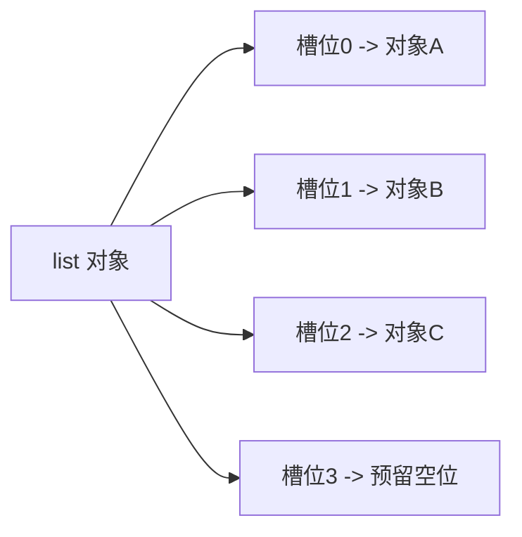

# Python - 第 3 课：`list`、`tuple`、`dict`、`set` 的底层原理与复杂度

## 学习目标（本节结束后你能做到什么）

- 能从底层结构解释 `list`、`tuple`、`dict`、`set` 分别适合什么场景。
- 能说清这些容器常见操作的时间复杂度，以及为什么平均是这样、最坏又为什么会退化。
- 能理解“为什么 `dict` 查找快但更吃内存”“为什么 `list` 追加快但中间插入慢”。
- 能建立“顺序存储 vs 哈希存储”“可变 vs 不可变”“有序访问 vs 去重查找”的统一判断框架。
- 能用一套结构化表达回答 Python 面试里的高频问题：`dict` 底层是什么、为什么 `set` 不能放可变对象、`tuple` 为什么能当键而 `list` 不行。

## 内容讲解（核心概念，用类比、例子、图示说清楚）

### 1. 为什么容器是 Python 面试和工程里的核心地基

很多人学容器时，只停留在“怎么用 API”：

- `list.append`
- `dict.get`
- `set.add`
- `tuple` 不能改

这当然不算错，但如果你只停在这个层面，很多问题就会答得很空：

- 为什么 `list.append()` 平均是 `O(1)`，但 `insert(0, x)` 却很慢
- 为什么 `dict` 查找平均是 `O(1)`，却不能简单理解成“永远常数时间”
- 为什么 `set` 能高效去重
- 为什么 `tuple` 常被说“比 `list` 更轻”，但到底轻在哪里
- 为什么一个对象能不能做 `dict` 的 key，关键不在于“语法允许不允许”，而在于它是否可哈希

本质上，容器选型是在做一个取舍：

- 我更关心顺序访问，还是更关心按 key 查找
- 我更关心追加性能，还是中间插入性能
- 我更关心去重，还是保留重复元素
- 我更关心可变性，还是稳定的不可变语义
- 我愿不愿意用更多内存去换更快的查找

所以这一课不是在背四个容器的特点，而是在建立一套容器设计直觉。

### 2. 先给一张总地图：四类容器分别在解决什么问题

你可以先把这四个容器看成四种不同的数据组织策略：

| 容器 | 核心定位 | 典型底层思路 | 最擅长的事 |
| --- | --- | --- | --- |
| `list` | 有序、可变序列 | 连续数组 + 预留扩容 | 末尾追加、按下标访问 |
| `tuple` | 有序、不可变序列 | 更紧凑的固定长度序列 | 表示稳定记录、可哈希组合 |
| `dict` | key-value 映射 | 哈希表 | 按 key 快速查找 |
| `set` | 无重复元素集合 | 基于哈希表的集合结构 | 去重、成员测试 |

如果只记一句话：

- `list` 和 `tuple` 更偏“序列”
- `dict` 和 `set` 更偏“哈希查找”

后面很多复杂度和行为差异，都是从这里长出来的。

### 3. `list`：为什么它适合追加和按下标访问

#### 3.1 `list` 的底层直觉

在 `CPython` 里，`list` 可以先粗略理解成：

**一个保存“元素引用”的动态数组。**

注意不是说它直接把元素值紧挨着塞进去，而是它维护了一段连续区域，这段区域里存放的是指向各个对象的引用。

图示可以理解成：



这会带来两个关键性质：

1. 按下标访问快  
   因为底层是连续槽位，已知起始位置和偏移量，就能快速定位到第 `i` 个元素引用。

2. 末尾追加通常快  
   如果后面还有预留空位，只要把新引用放进去就行。

#### 3.2 为什么 `append` 平均是 `O(1)`

很多人听到 `append` 是 `O(1)`，会误以为“每次都绝对恒定”。  
更准确的说法是：

**`append` 的摊还复杂度通常是 `O(1)`。**

原因是 `list` 不会每加一个元素就重新分配一次内存。  
它通常会做“过量分配”或“预留容量”：

- 当前容量够用：直接放进去
- 当前容量不够：申请更大的连续区域，把旧引用拷过去，再继续追加

所以：

- 大多数 `append` 很便宜
- 少数扩容时会比较重
- 均摊下来，平均成本仍然接近 `O(1)`

你可以把它想成搬家：

- 正常时候只是往空抽屉里放东西
- 偶尔抽屉塞满了，得换个更大的柜子，把旧东西全部搬过去

扩容那次会贵，但不是每次都贵。

#### 3.3 为什么中间插入和删除慢

比如：

```python
lst.insert(0, x)
```

如果你要在头部插入一个元素，后面的所有元素引用通常都得往后挪一格。

所以它的代价往往是：

- 要腾位置
- 要批量移动后续槽位

这就是为什么：

- `append` 快
- `pop()` 末尾弹出也快
- 但 `insert(0, x)`、`pop(0)` 这类头部操作通常是 `O(n)`

#### 3.4 `list` 常见复杂度

| 操作 | 平均复杂度 | 原因 |
| --- | --- | --- |
| 按下标访问 `lst[i]` | `O(1)` | 连续槽位偏移定位 |
| 末尾追加 `append` | 摊还 `O(1)` | 大多数不扩容 |
| 末尾弹出 `pop()` | `O(1)` | 直接去掉末尾引用 |
| 头部插入/删除 | `O(n)` | 需要批量搬移 |
| 查找元素 `x in lst` | `O(n)` | 线性扫描 |

所以只要你看到需求是：

- 大量按位置访问
- 保持顺序
- 末尾不断追加

`list` 通常是很自然的选择。

### 4. `tuple`：为什么它不只是“不能改的 list”

很多人把 `tuple` 理解成“只是不让改的 `list`”。  
这个理解太粗了。

#### 4.1 `tuple` 的真正价值

`tuple` 的核心不是“省几个 API”，而是：

- 长度固定
- 内容引用固定
- 语义上更适合表示稳定记录

比如：

- 经纬度坐标 `(lat, lng)`
- 数据库返回的一行记录
- 作为字典 key 的复合键

这时你想表达的是：

**这是一组有顺序、但不应该被随手改掉的值。**

#### 4.2 为什么 `tuple` 往往更轻

因为它是固定长度的，不需要像 `list` 那样为未来追加预留额外容量，也不需要支持一整套原地扩缩容行为。

所以从实现直觉上：

- 结构更紧凑
- 管理成本更低
- 某些场景下更节省内存

这也是为什么“如果你只是想表达一个稳定的、不会改的记录”，`tuple` 通常比 `list` 更合适。

#### 4.3 `tuple` 为什么经常能做 `dict` 的 key

因为 `dict` 的 key 需要满足一个重要条件：**可哈希（hashable）**。

而一个对象想可哈希，通常意味着：

- 它的哈希值在生命周期内应该稳定
- 它用于相等性判断的内容不能随意变化

`tuple` 本身是不可变的，所以只要它内部元素也都可哈希，它通常就可以作为 `dict` 的 key。

例如：

```python
point = (30, 120)
cache = {point: "hangzhou"}
```

而 `list` 不行，因为 `list` 可变。  
如果一个能当 key 的对象后面还能改内容，那哈希表就会乱掉。

### 5. `dict`：为什么查找快，但不是没有代价

#### 5.1 `dict` 的核心结构：哈希表

`dict` 可以先粗略理解成：

- 你给它一个 key
- 它先算这个 key 的哈希值
- 再根据哈希值定位到一个槽位或候选区域
- 如果发生冲突，再继续探测或比较
- 最终找到对应的 value

所以 `dict` 的快，不是来自“按顺序找得很快”，而是来自：

**通过哈希，把“全表扫描”尽量变成“直接跳到可能的位置”。**

这就像图书馆不是每次从第一本书开始找，而是先看编号，把你直接带到某一排书架附近。

#### 5.2 为什么平均查找是 `O(1)`

因为理想情况下：

- 哈希分布足够均匀
- 装载因子控制得比较合理
- 冲突不严重

那么一次查找通常只需要少数几步就能定位到目标。

但一定要注意，这里说的是平均复杂度，不是数学意义上的绝对常数保证。

#### 5.3 为什么最坏会退化

如果发生极端情况，比如：

- 大量 key 哈希冲突
- 装载过高
- 探测链很长

那查找成本会显著变高，理论上可以退化到接近 `O(n)`。

不过在正常工程场景里，`CPython` 的 `dict` 实现经过了大量优化，平均性能通常非常好。

#### 5.4 为什么 `dict` 更吃内存

`dict` 的高性能不是白来的，它通常要付出更多空间代价：

- 需要维护哈希表槽位
- 需要处理空槽位和冲突
- 为了保持查找快，不能把表塞得太满
- 每个键值对本身也有额外元数据和对象引用成本

所以和 `list` 比起来，`dict` 通常更“胖”。

这也是很典型的工程交换：

**用更多内存，换更快的按 key 查找。**

#### 5.5 `dict` 的常见复杂度

| 操作 | 平均复杂度 | 说明 |
| --- | --- | --- |
| 读 `d[k]` | `O(1)` | 哈希定位 |
| 写 `d[k] = v` | `O(1)` | 插入或更新 |
| 判断 `k in d` | `O(1)` | 查 key，不查 value |
| 删除 `del d[k]` | `O(1)` | 平均情况 |
| 遍历 | `O(n)` | 所有元素都要走一遍 |

这里有个非常常见的误区：

```python
x in d
```

判断的是 key 是否存在，不是 value 是否存在。  
因为 `dict` 的哈希索引本来就是围绕 key 建的。

### 6. `set`：为什么它天生适合去重和成员测试

`set` 和 `dict` 的底层思路非常接近，也是一类哈希结构。  
你甚至可以把它粗略理解成：

**只有 key、没有 value 的哈希表。**

所以它特别适合做两件事：

#### 6.1 成员判断

```python
x in my_set
```

通常很快，因为本质上还是哈希查找。

#### 6.2 去重

```python
unique = set(data)
```

因为集合天生不允许重复元素，所以很适合做去重。

这也是为什么你在工程里经常会看到：

- 用 `set` 存已经访问过的 id
- 用 `set` 做白名单 / 黑名单快速判断
- 用 `set` 做大批量数据的去重或交并差计算

#### 6.3 为什么 `set` 里的元素必须可哈希

因为 `set` 的定位逻辑和 `dict` 的 key 一样，都依赖哈希值。

所以：

- `int`、`str`、`tuple(内部也可哈希)` 通常可以放
- `list`、`dict`、`set` 这种可变对象通常不行

例子：

```python
ok = {(1, 2), (3, 4)}
bad = {[1, 2], [3, 4]}  # 会报错
```

原因不是“Python 不喜欢 list”，而是可变对象的内容会变，哈希稳定性没法保证。

### 7. 为什么 `list` 查重慢，而 `set` 查重快

看两个写法：

```python
if x in my_list:
    ...
```

和：

```python
if x in my_set:
    ...
```

它们看起来只差一个类型，但底层完全不同。

#### 7.1 `list` 的成员判断

`list` 没有按值建索引，所以通常只能：

- 从头到尾
- 一个一个比较

因此平均是 `O(n)`。

#### 7.2 `set` 的成员判断

`set` 直接通过哈希把搜索范围大幅缩小，所以平均是 `O(1)`。

所以如果你的需求是：

- 频繁判断某元素是否出现过
- 频繁去重

那 `set` 往往比 `list` 合适得多。

但如果你还关心：

- 保留重复
- 保持原始顺序
- 按位置访问

那就不能简单把 `list` 全换成 `set`。

这再一次说明：容器选型永远是 trade-off。

### 8. 有序、无序、去重、可变，这几组概念怎么统一起来

很多人在容器选型上容易只记零散结论。  
其实你可以用四个维度统一判断：

#### 8.1 是否关心顺序

- 关心元素位置和顺序：优先考虑 `list` / `tuple`
- 关心按 key 访问：优先考虑 `dict`
- 只关心成员关系和去重：优先考虑 `set`

#### 8.2 是否需要修改

- 需要频繁改：`list`、`dict`、`set`
- 希望稳定不可变：`tuple`

#### 8.3 是否需要哈希能力

- 要做 `dict` 的 key
- 要放进 `set`

那对象必须可哈希，通常也意味着它不能随意变化。

#### 8.4 主要操作是什么

- 按下标访问、末尾追加：`list`
- 快速查 key：`dict`
- 快速判断成员、去重：`set`
- 表示稳定记录：`tuple`

如果你能按这四个维度思考，很多选型题都能自然答出来。

### 9. 工程里最常见的几个误区

#### 9.1 误区：`dict` 查找是 `O(1)`，所以永远最快

不对。  
如果你的需求是按顺序遍历并连续处理，`list` 可能更自然；如果数据量很小，复杂度优势甚至不明显；如果内存很紧，`dict` 的空间开销也要考虑。

#### 9.2 误区：`tuple` 只是不能改，没别的价值

不对。  
它的不可变语义、本身更稳定的结构、可哈希潜力，都让它在“表达稳定记录”和“做复合 key”时很有价值。

#### 9.3 误区：`set` 就是无序版的 `list`

不对。  
`set` 的核心不是“无序”，而是“唯一性 + 哈希查找”。

#### 9.4 误区：只看时间复杂度，不看操作模式

也不对。  
真实工程里要一起看：

- 数据规模
- 读多写少还是写多读少
- 是否关心顺序
- 是否需要去重
- 是否需要可哈希
- 是否在意空间开销

### 10. 面试里怎么讲这四个容器

如果面试官让你比较 `list`、`tuple`、`dict`、`set`，比较稳的回答结构可以是：

1. 先按底层路线分组  
   `list` / `tuple` 属于序列，`dict` / `set` 属于哈希结构。

2. 再讲核心差异  
   `list` 可变且适合按位置访问与末尾追加；`tuple` 不可变，适合稳定记录和可哈希组合；`dict` 适合按 key 查找；`set` 适合去重和成员测试。

3. 再讲复杂度  
   `list` 按下标 `O(1)`、查成员 `O(n)`；`dict` / `set` 平均查找 `O(1)`；头部插入和删除对 `list` 往往较慢。

4. 最后补边界和代价  
   哈希结构查找快，但更吃空间；`O(1)` 是平均情况，不是永远绝对常数；是否可哈希和是否可变强相关。

你如果能这样讲，说明你不是只会背“列表、元组、字典、集合”这四个名字，而是真的理解容器设计。

## 小结（3-5 条关键点）

- `list` 和 `tuple` 更偏序列，`dict` 和 `set` 更偏哈希查找；它们在设计目标上就不同。
- `list` 底层可近似理解为动态数组，所以按下标访问快、末尾追加摊还快，但中间插入删除慢。
- `tuple` 的价值不只是“不能改”，而是稳定、紧凑、适合表示固定记录，并且在元素可哈希时可作为 key。
- `dict` 和 `set` 基于哈希结构，平均查找很快，但会用更多空间换时间，并且最坏情况下也可能退化。
- 容器选型不要只背复杂度，要同时看顺序、可变性、去重需求、主要操作模式和空间代价。

## 问题（检测用户对当前章节内容是否了解）

1. 为什么 `list.append()` 平均很快，但 `list.insert(0, x)` 往往更慢？请从底层结构角度解释。
2. `dict` 为什么平均查找是 `O(1)`？这个 `O(1)` 为什么不能理解成“永远绝对不变的常数时间”？
3. 为什么 `tuple` 往往可以作为 `dict` 的 key，而 `list` 不可以？请把“可变 / 不可变”和“可哈希”连起来讲。
4. 如果一个场景需要“频繁判断元素是否出现过”，为什么 `set` 通常比 `list` 更合适？代价又是什么？

如果你愿意，我们下一篇就继续写第 4 课，把函数、作用域、闭包、装饰器和参数绑定这一组高频面试点彻底串起来。
